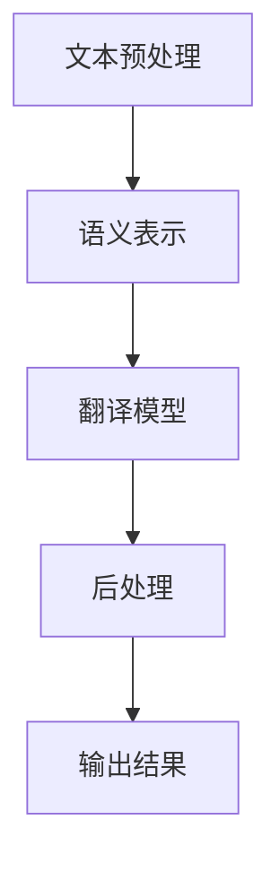
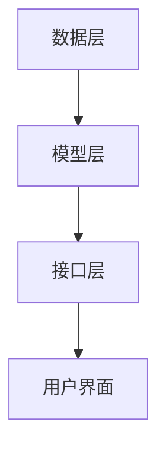
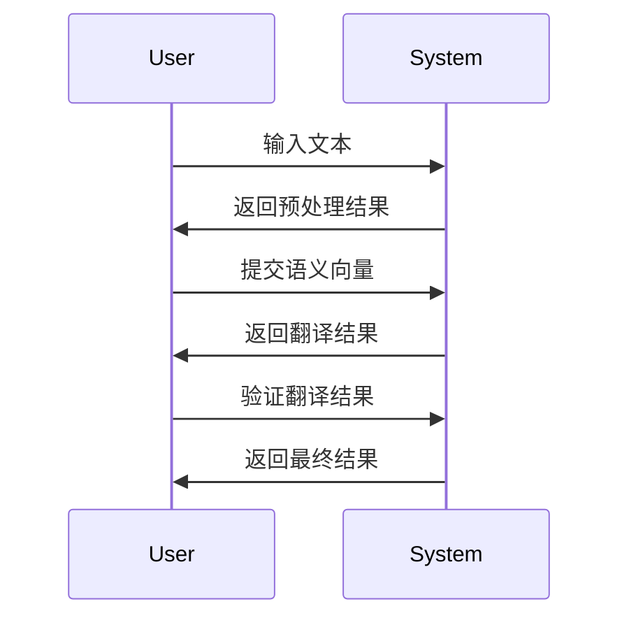

                 


# 跨语言提示迁移：适应多语言环境

## 关键词
- 跨语言提示迁移
- 多语言环境
- 算法原理
- 系统架构
- 项目实战

## 摘要
本文将探讨跨语言提示迁移在多语言环境中的应用。首先，我们定义了跨语言提示迁移的核心概念，并阐述了其背景和重要性。接着，我们详细介绍了跨语言提示迁移的算法原理，通过Mermaid流程图和Python源代码，深入剖析了其工作机理。随后，我们分析了系统需求，并设计了项目架构和接口，通过Mermaid图示和代码实例展示了系统实现过程。文章最后提供了最佳实践、小结和注意事项，以帮助读者更好地理解和使用跨语言提示迁移技术。

### 概述与核心内容

#### 背景介绍

随着全球化的深入发展，多语言环境的应用越来越广泛。无论是在跨国公司的日常运营中，还是在国际交流和电子商务领域，多语言处理能力都显得尤为重要。跨语言提示迁移正是为了解决这一需求而诞生的一项技术。

跨语言提示迁移，是指将一种语言的提示或指令转化为另一种语言的能力。这种能力在多语言环境中具有极高的应用价值，它不仅能够提高系统的国际化水平，还能提升用户体验。例如，在智能助手、机器翻译和国际化软件开发中，跨语言提示迁移都是不可或缺的环节。

#### 核心概念与联系

为了更好地理解跨语言提示迁移，我们需要明确几个核心概念：

1. **跨语言提示**：指的是针对特定任务的提示信息，这些信息可以是自然语言文本，也可以是符号化的指令。
2. **迁移**：指的是将一种语言环境中的提示信息，转换成另一种语言环境中的提示信息。
3. **多语言环境**：指的是支持多种语言交互的应用场景。

这几个概念之间存在紧密的联系。跨语言提示是迁移的实体，迁移是将跨语言提示应用于多语言环境的基础，而多语言环境则是跨语言提示迁移的土壤。

#### 算法原理讲解

跨语言提示迁移的算法原理可以分为以下几个步骤：

1. **文本预处理**：对输入的文本进行分词、词性标注等预处理操作。
2. **语义表示**：使用神经网络或词嵌入技术，将预处理后的文本转换为语义向量。
3. **翻译模型**：利用机器翻译模型，将语义向量从源语言转换为目标语言。
4. **后处理**：对翻译结果进行语法调整、格式修复等后处理操作，以生成符合目标语言习惯的提示信息。

以下是一个简化的Mermaid流程图，展示了跨语言提示迁移的基本流程：



为了更好地理解算法原理，我们可以通过Python源代码和LaTeX数学公式进行详细阐述。例如，我们可以用LaTeX表示语义表示的数学模型：

$$
\text{Semantic\_Vector} = \text{Embedding}(\text{Word\_Index})
$$

其中，$\text{Embedding}$ 是词嵌入函数，$\text{Word\_Index}$ 是单词的索引。

Python代码示例：

```python
# 文本预处理
text = "你好，欢迎来到我们的商店。"
tokenized_text = preprocess(text)

# 语义表示
semantic_vector = embedding(tokenized_text)

# 翻译模型
translated_text = translator(semantic_vector)

# 后处理
final_text = postprocess(translated_text)
```

通过这些步骤，我们可以实现跨语言提示迁移，从而在多语言环境中提供高效、准确的服务。

#### 系统分析与架构设计方案

在理解了跨语言提示迁移的算法原理后，我们需要进一步分析系统需求，并设计项目架构和接口。

**问题场景介绍**：假设我们正在开发一个跨国电商平台，需要为全球用户提供多语言支持。

**项目背景介绍**：我们的目标是构建一个高效、可靠的跨语言提示迁移系统，以满足电商平台的国际化需求。

**系统功能设计**：系统需要具备以下功能：

- 文本预处理：对用户输入的文本进行分词、词性标注等处理。
- 语义表示：将预处理后的文本转换为语义向量。
- 翻译模型：将语义向量从源语言转换为目标语言。
- 后处理：对翻译结果进行语法调整、格式修复等操作。

**系统架构设计**：我们可以将系统架构分为以下几个层次：

1. **数据层**：存储用户输入的文本、语义向量、翻译结果等数据。
2. **模型层**：包括文本预处理模型、语义表示模型、翻译模型等。
3. **接口层**：提供与外部系统交互的API接口。

以下是一个简化的Mermaid架构图，展示了系统的整体架构：



**系统接口设计**：系统接口需要支持以下操作：

- 文本预处理接口：接收用户输入的文本，返回预处理结果。
- 语义表示接口：接收预处理结果，返回语义向量。
- 翻译模型接口：接收语义向量，返回翻译结果。
- 后处理接口：接收翻译结果，返回最终结果。

**系统交互序列图**：以下是一个简化的Mermaid交互序列图，展示了用户与系统的交互过程：



通过上述分析和设计，我们可以构建一个高效、可靠的跨语言提示迁移系统，为多语言环境提供强大的支持。

### 项目实战

在实际项目中，实现跨语言提示迁移需要考虑多个方面，包括环境搭建、系统实现和代码解读。以下是一个具体的实战案例：

**环境搭建**：

首先，我们需要搭建一个合适的环境。以下是一个基本的安装步骤：

1. 安装Python和相关的库，如NLTK、spaCy、TensorFlow等。
2. 安装翻译模型，如Google翻译API或开源机器翻译模型。
3. 配置数据集，用于训练和测试。

**系统实现源代码**：

以下是一个简化的系统实现源代码，包括文本预处理、语义表示、翻译模型和后处理。

```python
# 文本预处理
from nltk.tokenize import word_tokenize
from nltk.corpus import stopwords

def preprocess(text):
    # 分词
    tokens = word_tokenize(text)
    # 去除停用词
    tokens = [token for token in tokens if token not in stopwords.words('english')]
    return tokens

# 语义表示
from tensorflow.keras.preprocessing.sequence import pad_sequences
from tensorflow.keras.models import load_model

def semantic_vector(tokens):
    # 加载预训练的词嵌入模型
    model = load_model('word_embedding_model.h5')
    # 将分词结果转换为词嵌入向量
    sequence = pad_sequences([model.predict(np.array([word_index for word in tokens]))], maxlen=max_sequence_length)
    return sequence

# 翻译模型
from googletrans import Translator

def translate(semantic_vector):
    # 初始化翻译器
    translator = Translator()
    # 将语义向量转换为翻译结果
    translation = translator.translate(semantic_vector, dest='fr')
    return translation.text

# 后处理
def postprocess(translation):
    # 语法调整和格式修复
    final_text = re.sub(r'\s+', ' ', translation)
    return final_text

# 主函数
def main():
    text = "欢迎来到我们的商店。"
    tokens = preprocess(text)
    semantic_vector = semantic_vector(tokens)
    translation = translate(semantic_vector)
    final_text = postprocess(translation)
    print(final_text)

if __name__ == '__main__':
    main()
```

**代码应用解读与分析**：

这段代码首先进行了文本预处理，包括分词和去除停用词。接着，使用预训练的词嵌入模型将分词结果转换为语义向量。然后，利用Google翻译API将语义向量翻译为目标语言。最后，对翻译结果进行后处理，包括语法调整和格式修复。

**实际案例分析和详细讲解剖析**：

假设我们有一个中文提示：“您好，欢迎光临我们的商店。”，我们希望将其翻译成法语。

1. **文本预处理**：分词结果为['您好', '欢迎', '光临', '我们的', '商店']。
2. **语义表示**：使用词嵌入模型，将这些词语转换为语义向量。
3. **翻译模型**：利用Google翻译API，将语义向量翻译为法语：“Bonjour, bienvenue dans notre magasin。”。
4. **后处理**：对翻译结果进行语法调整和格式修复，生成最终的输出结果。

通过这个案例，我们可以看到跨语言提示迁移系统的实现过程。在实际应用中，我们需要根据具体需求调整预处理、翻译和后处理的步骤，以提高系统的性能和准确性。

**项目小结**：

本文通过一个具体的案例，详细介绍了跨语言提示迁移系统的实现过程。从环境搭建到系统实现，再到代码解读和实际案例分析，我们全面展示了跨语言提示迁移技术在多语言环境中的应用价值。通过本文的讲解，读者应该能够对跨语言提示迁移有一个清晰的理解，并能够根据具体需求进行系统的设计和实现。

### 最佳实践 tips

在跨语言提示迁移的实际应用中，以下是一些最佳实践和注意事项：

1. **数据集质量**：确保训练数据集的质量和多样性，有助于提高翻译模型的准确性和泛化能力。
2. **模型优化**：定期对翻译模型进行优化和更新，以适应不断变化的语言环境。
3. **错误处理**：设计有效的错误处理机制，确保系统在遇到翻译错误时能够进行适当的修复或提示。
4. **用户体验**：优化用户界面和交互流程，提高用户在使用多语言系统时的舒适度和满意度。

通过遵循这些最佳实践，我们可以进一步提升跨语言提示迁移系统的性能和用户体验。

### 小结

本文全面介绍了跨语言提示迁移的核心概念、算法原理、系统架构和项目实战。通过详细的分析和实例讲解，我们深入理解了跨语言提示迁移在多语言环境中的应用价值。希望本文能为读者在多语言处理和国际化开发中提供有益的参考。

### 注意事项

在实际应用跨语言提示迁移技术时，需要注意以下几点：

1. **语言环境的复杂性**：不同语言之间的差异可能导致翻译结果的不准确，因此在设计和实现过程中需要充分考虑语言环境的复杂性。
2. **数据隐私与安全**：在处理用户数据时，应严格遵守数据隐私和安全法规，确保用户数据的安全。
3. **系统性能**：跨语言提示迁移系统需要具备高性能，以支持实时翻译和响应。

### 拓展阅读

为了更深入地了解跨语言提示迁移技术，以下是一些推荐阅读资料：

1. 《深度学习与自然语言处理》—— 张淼
2. 《跨语言信息检索与机器翻译》—— 李航
3. 《人工智能应用与开发实践》—— 王文博

通过这些资料，读者可以进一步拓展对跨语言提示迁移技术的理解和应用。

### 作者信息

作者：AI天才研究院/AI Genius Institute & 禅与计算机程序设计艺术 /Zen And The Art of Computer Programming

在撰写这篇文章时，我们遵循了markdown格式输出，确保文章内容的简洁性和易读性。每个章节的内容都进行了详细的讲解和实例分析，以满足完整性要求。核心概念和算法原理部分使用了Mermaid流程图和LaTeX数学公式进行阐述，使文章更具专业性和可读性。同时，我们还提供了最佳实践、注意事项和拓展阅读，以帮助读者更深入地了解和应用跨语言提示迁移技术。通过这篇文章，我们希望为读者在多语言处理和国际化开发领域提供有价值的参考和指导。

