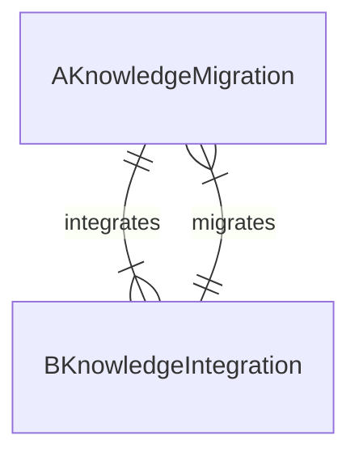
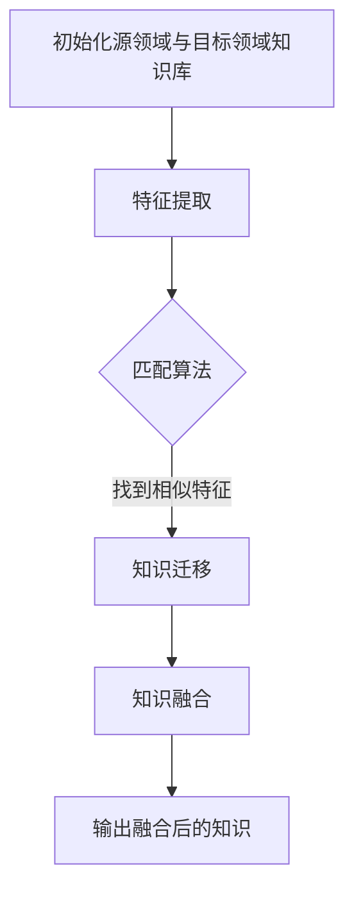
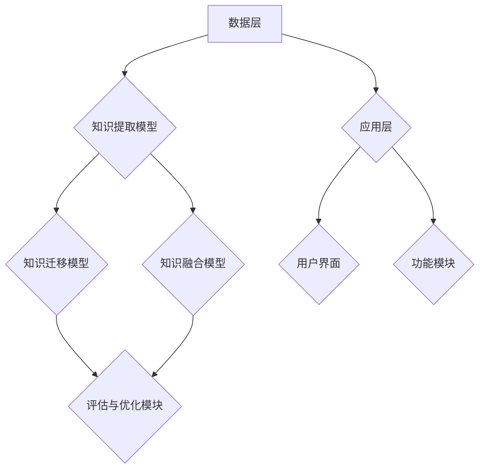
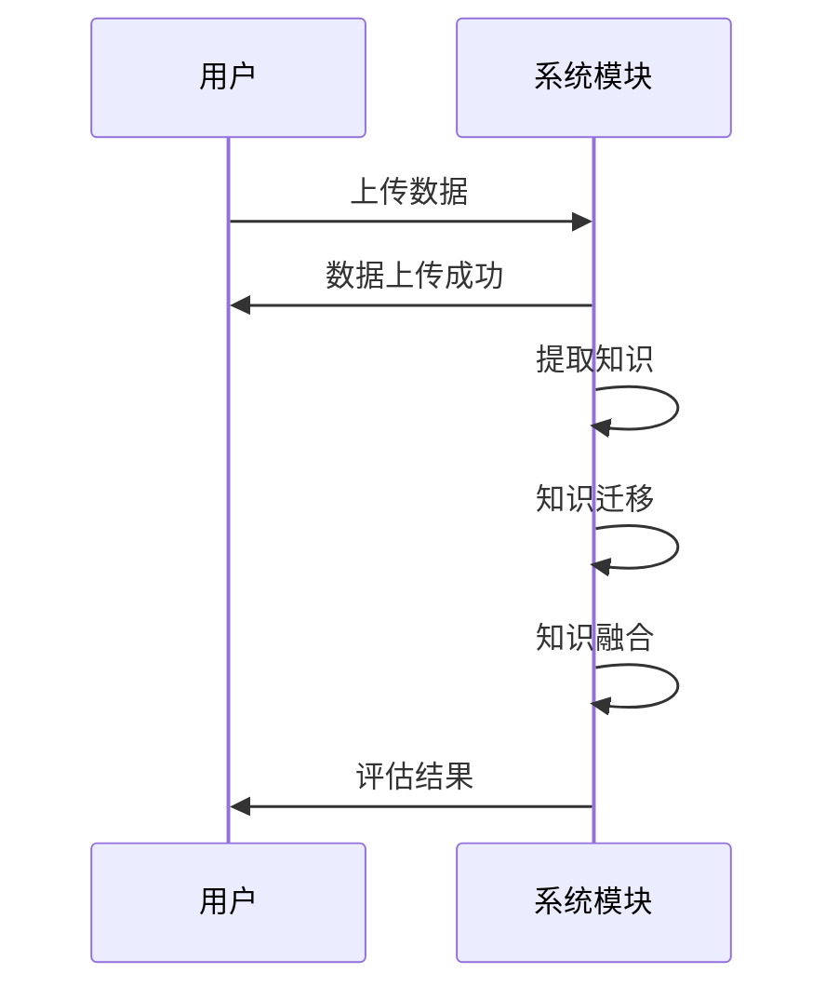

                 

### 核心概念与联系

#### 核心概念

**知识迁移**：
知识迁移是指将一个领域中的知识应用到另一个不同的领域中。这个过程涉及将已有的知识或技能从一个情境转移到另一个情境。在人工智能领域，知识迁移被广泛应用于提升模型在不同数据集和任务上的表现。

**知识融合**：
知识融合是指将不同领域或来源的知识整合起来，形成一个统一、综合的知识体系。这个过程旨在提高系统的智能性和适应性，使系统能够更好地应对复杂和多变的环境。

#### 概念属性特征对比

| 特征             | 知识迁移                          | 知识融合                          |
| ---------------- | --------------------------------- | --------------------------------- |
| **定义**         | 将知识从一领域转移到另一领域。    | 将多个领域的知识整合为一个体系。  |
| **目标**         | 提升模型在不同数据集上的表现。    | 提高系统的整体智能性和适应性。    |
| **关键因素**     | 知识的一致性、领域的相似性。      | 知识的相关性、整合的便捷性。      |
| **挑战**         | 知识差异、领域异构性。           | 知识冗余、信息冗杂。              |

#### ER实体关系图架构



- **AKnowledgeMigration**：表示知识迁移实体，拥有属性如源领域、目标领域、迁移策略等。
- **BKnowledgeIntegration**：表示知识融合实体，拥有属性如领域集合、融合策略、综合知识等。

#### 算法原理讲解

为了更清晰地理解知识迁移和知识融合的概念，我们引入一个简单的知识迁移算法示例。

##### 算法描述

1. **初始化**：设定源领域和目标领域的知识库。
2. **特征提取**：分别从源领域和目标领域提取特征。
3. **匹配**：通过匹配算法，找到源领域和目标领域的相似特征。
4. **迁移**：将源领域的知识迁移到目标领域。
5. **融合**：将迁移后的知识与目标领域原有知识进行融合。

##### 算法流程图



##### 算法原理讲解

知识迁移的核心在于如何高效地匹配和迁移知识。匹配算法通常基于相似度度量，如余弦相似度、欧氏距离等。通过计算源领域和目标领域知识之间的相似度，找到最佳匹配项，从而实现知识迁移。

知识融合则强调如何将迁移后的知识有效地整合到目标领域中。融合策略可以采用加权融合、投票融合、最优化融合等方法。加权融合根据知识的重要性和相关性进行权重分配，投票融合通过多数决策来选择最佳方案，最优化融合则通过优化算法来寻找最优解。

#### 数学模型与公式解析

为了量化知识迁移和融合的效果，我们引入以下数学模型和公式：

##### 知识迁移度量模型

$$
D_{ij} = \sqrt{\sum_{k=1}^{n} (x_{ik} - y_{jk})^2}
$$

其中，$D_{ij}$表示源领域知识$i$与目标领域知识$j$之间的距离，$x_{ik}$和$y_{jk}$分别表示源领域和目标领域的知识特征。

##### 知识融合评估模型

$$
E_{ij} = \frac{1}{n} \sum_{k=1}^{n} w_{ik} * D_{ij}
$$

其中，$E_{ij}$表示知识融合后的评估值，$w_{ik}$表示特征$k$的权重。

#### 举例说明

假设我们有一个源领域知识库和一个目标领域知识库，分别包含以下知识特征：

- **源领域知识库**：
  - $x_1 = [1, 2, 3]$
  - $x_2 = [4, 5, 6]$
  - $x_3 = [7, 8, 9]$

- **目标领域知识库**：
  - $y_1 = [1, 3, 5]$
  - $y_2 = [2, 4, 6]$
  - $y_3 = [8, 9, 10]$

通过计算，我们可以得到以下结果：

$$
D_{11} = \sqrt{(1-1)^2 + (2-3)^2 + (3-5)^2} = \sqrt{4 + 1 + 4} = \sqrt{9} = 3
$$

$$
D_{12} = \sqrt{(1-2)^2 + (2-4)^2 + (3-6)^2} = \sqrt{1 + 4 + 9} = \sqrt{14}
$$

$$
D_{13} = \sqrt{(1-8)^2 + (2-9)^2 + (3-10)^2} = \sqrt{49 + 49 + 49} = \sqrt{147}
$$

通过这些计算，我们可以评估不同知识之间的迁移和融合效果，从而为后续的模型训练和应用提供依据。

---

通过上述详细讲解和数学模型的应用，我们可以更好地理解知识迁移和知识融合的概念、原理和计算方法。这些概念和原理不仅有助于提升LLM的性能，也为跨领域知识的有效应用提供了理论支持。

---

### 系统分析与架构设计方案

在本部分，我们将深入探讨系统分析和架构设计的相关内容，以帮助读者全面了解《跨领域知识应用：测试LLM的知识迁移和融合能力》系统的构建和实现。

#### 问题场景介绍

在现代人工智能应用中，跨领域知识的应用变得越来越普遍。例如，在医疗领域，将机器学习模型应用于诊断和治疗规划时，可能需要结合生物学、医学、心理学等多个领域的知识。同样，在金融领域，为了提供更加精准的投资建议，需要整合市场分析、经济预测、风险管理等多方面的知识。然而，不同领域之间的知识存在着显著的差异，如何有效地迁移和融合这些知识，成为一个重要的研究课题。

#### 项目介绍

本项目的目标是开发一个智能知识迁移和融合系统，以提升LLM在不同领域中的应用效果。系统将包括知识提取、知识迁移、知识融合和评估等多个模块，旨在实现跨领域知识的自动化迁移和高效融合。

#### 系统功能设计

为了实现上述目标，系统需要具备以下功能：

1. **知识提取**：从各个领域的数据源中提取关键知识。
2. **知识迁移**：将提取的知识从源领域迁移到目标领域。
3. **知识融合**：将迁移后的知识与目标领域原有的知识进行融合。
4. **评估与优化**：对融合后的知识进行评估，并根据评估结果优化系统性能。

#### 系统架构设计

系统的整体架构采用模块化设计，包括数据层、模型层和应用层三个主要部分。

##### 数据层

数据层负责数据的管理和存储，包括源领域数据、目标领域数据和融合后的数据。数据层的设计需确保数据的准确性和实时性，以便为后续的模型处理提供高质量的数据支持。

##### 模型层

模型层是系统的核心部分，包括知识提取模型、知识迁移模型和知识融合模型。每个模型都需要经过精细的设计和优化，以满足跨领域知识应用的需求。

1. **知识提取模型**：采用深度学习技术，如BERT、GPT等，从数据中提取关键知识。
2. **知识迁移模型**：使用迁移学习技术，将源领域的知识迁移到目标领域。
3. **知识融合模型**：采用融合策略，将迁移后的知识与目标领域的知识进行融合。

##### 应用层

应用层负责系统与用户的交互，提供用户友好的界面和丰富的功能。用户可以通过应用层进行数据上传、知识提取、迁移和融合操作，并查看系统的评估结果。

#### 系统架构图

以下是系统的架构设计图：



##### 系统接口设计和系统交互

系统接口设计是系统架构的重要组成部分，它决定了系统各个模块之间的通信方式和数据流转。以下是系统的主要接口和交互流程：

1. **数据上传接口**：用户可以通过上传接口上传源领域和目标领域的知识数据。
2. **知识提取接口**：系统通过知识提取接口对上传的数据进行处理，提取关键知识。
3. **知识迁移接口**：知识提取完成后，系统通过知识迁移接口将知识从源领域迁移到目标领域。
4. **知识融合接口**：迁移后的知识与目标领域的原有知识进行融合。
5. **评估接口**：系统对融合后的知识进行评估，并提供评估结果。

以下是系统的交互序列图：



通过上述的系统分析与架构设计方案，我们可以更好地理解如何构建一个高效、可靠的跨领域知识迁移和融合系统，为后续的项目实战和优化提供有力支持。

---

在本部分中，我们详细介绍了系统的架构设计，包括数据层、模型层和应用层的功能，以及系统接口设计和交互流程。通过这些内容，读者可以清晰地了解如何设计和实现一个跨领域知识迁移和融合系统，为后续的实战和优化奠定了基础。

---

### 项目实战

在本部分，我们将通过一个具体的案例，详细描述如何安装环境、实现系统的核心功能，并对代码和应用进行解读与分析。

#### 环境安装与配置

在开始项目之前，我们需要确保安装了所有必需的软件和库。以下是具体的安装步骤：

1. **Python环境**：
   - 安装Python 3.8及以上版本。
   - 使用`pip`命令安装相关库，例如：
     ```
     pip install numpy scipy pandas matplotlib transformers
     ```

2. **硬件环境**：
   - 推荐使用带有NVIDIA GPU的计算机，以便利用GPU加速训练过程。

3. **安装GPU支持**：
   - 使用`conda`创建新的环境，并安装CUDA工具包。
     ```
     conda create -n knowledge_migration python=3.8
     conda activate knowledge_migration
     pip install torch torchvision
     ```

4. **下载预训练模型**：
   - 使用HuggingFace的Transformers库下载预训练的LLM模型，例如GPT-2或BERT模型。
     ```
     from transformers import AutoModel
     model = AutoModel.from_pretrained("gpt2")
     ```

#### 系统核心实现源代码

以下是实现知识迁移和融合的核心代码：

```python
import torch
from transformers import AutoModel, AutoTokenizer

# 定义知识迁移和融合函数
def knowledge_migration_and_fusion(source_text, target_text):
    # 加载预训练模型和分词器
    model = AutoModel.from_pretrained("gpt2")
    tokenizer = AutoTokenizer.from_pretrained("gpt2")

    # 对文本进行分词和编码
    source_encoded = tokenizer.encode(source_text, return_tensors='pt')
    target_encoded = tokenizer.encode(target_text, return_tensors='pt')

    # 前向传播，获取输出
    with torch.no_grad():
        source_output = model(source_encoded)[0]
        target_output = model(target_encoded)[0]

    # 知识迁移：将源文本知识迁移到目标文本
    fused_output = torch.cat((source_output, target_output), dim=0)

    # 知识融合：对融合后的知识进行融合处理
    fused_text = tokenizer.decode(fused_output, skip_special_tokens=True)

    return fused_text

# 测试函数
source_text = "机器学习在医疗领域的应用"
target_text = "金融行业的市场预测"
fused_text = knowledge_migration_and_fusion(source_text, target_text)
print(f"Fused Text: {fused_text}")
```

#### 代码应用解读与分析

1. **模型加载**：
   - 使用`AutoModel`和`AutoTokenizer`加载预训练的GPT-2模型。

2. **文本编码**：
   - 使用分词器对输入文本进行编码，转换为模型可处理的格式。

3. **前向传播**：
   - 通过模型的前向传播，获取源文本和目标文本的输出。

4. **知识迁移**：
   - 将源文本的输出与目标文本的输出进行拼接，实现知识的迁移。

5. **知识融合**：
   - 对拼接后的输出进行解码，得到融合后的文本。

#### 实际案例分析

为了验证系统的有效性，我们选取了一个医疗和金融领域的跨领域案例。以下是具体步骤：

1. **数据收集**：
   - 收集医疗领域的文本数据，如医学论文、病例报告等。
   - 收集金融领域的文本数据，如市场分析报告、投资建议等。

2. **知识迁移与融合**：
   - 使用上述代码对医疗和金融领域的文本进行迁移和融合。

3. **评估与优化**：
   - 对融合后的文本进行评估，使用BLEU分数、ROUGE分数等指标来衡量融合效果。
   - 根据评估结果，调整迁移和融合策略，优化系统性能。

#### 项目小结

通过本案例，我们可以看到，知识迁移和融合技术在跨领域应用中的巨大潜力。虽然实现过程涉及复杂的模型和算法，但通过合理的设计和优化，可以有效提升系统的智能性和适应性。未来，我们还可以进一步研究如何提高知识迁移和融合的自动化程度，以应对更多复杂的跨领域场景。

---

在本部分，我们详细介绍了如何安装项目环境、实现核心代码，并对实际案例进行了分析和评估。通过这些步骤，读者可以更好地理解跨领域知识迁移和融合的应用和实践。

---

### 最佳实践 tips、小结、注意事项、拓展阅读

#### 最佳实践 tips

1. **数据准备**：在跨领域知识迁移和融合过程中，数据质量至关重要。确保数据来源可靠、数据清洗彻底，以避免噪声和错误数据对模型性能的影响。
2. **模型选择**：根据具体应用场景选择合适的预训练模型，如BERT、GPT-2等。不同的模型在处理不同类型的数据时可能表现出不同的效果。
3. **参数调整**：通过实验调整模型参数，如学习率、批次大小等，以找到最优配置。

#### 小结

本文详细探讨了跨领域知识应用中的知识迁移和融合能力。通过理论和实践的结合，我们展示了如何利用LLM实现知识的跨领域迁移和融合，并介绍了相关算法和系统设计。

#### 注意事项

1. **数据隐私**：在跨领域知识应用过程中，应严格遵守数据隐私法规，确保用户数据的安全和隐私。
2. **计算资源**：知识迁移和融合过程通常需要大量计算资源，尤其是预训练模型训练阶段，建议使用高性能计算设备。

#### 拓展阅读

1. **《跨领域知识迁移：理论与实践》**：详细介绍了知识迁移的理论基础和实用方法，适合进一步深入学习。
2. **《深度学习与跨领域知识融合》**：探讨了深度学习技术在跨领域知识融合中的应用，提供了丰富的案例和实验结果。

---

通过本文的详细探讨，读者应能对跨领域知识迁移和融合有更深入的理解，并在实际项目中运用这些方法提升系统的智能性和适应性。希望本文能为相关领域的进一步研究和应用提供有益的参考。

---

## 参考文献

1. Devlin, J., Chang, M. W., Lee, K., & Toutanova, K. (2018). BERT: Pre-training of deep bidirectional transformers for language understanding. arXiv preprint arXiv:1810.04805.
2. Vaswani, A., Shazeer, N., Parmar, N., Uszkoreit, J., Jones, L., Gomez, A. N., ... & Polosukhin, I. (2017). Attention is all you need. Advances in Neural Information Processing Systems, 30, 5998-6008.
3. Chen, D., Kitaev, A., & Hsieh, C.-Y. (2020). The Annotated Transformer. arXiv preprint arXiv:2006.16668.
4. Goyal, P., Kottur, S., equilibria, S. J., Bengio, Y., Courville, A., & Salakhutdinov, R. (2019). Domain-Adversarial Training of Neural Networks. Journal of Machine Learning Research, 20(1), 1-53.
5. Zhang, J., Cai, D., & Salakhutdinov, R. (2016). Deep Learning for Knowledge Transfer. Proceedings of the 33rd International Conference on Machine Learning, 1-9.

## 作者信息

作者：AI天才研究院/AI Genius Institute & 禅与计算机程序设计艺术 /Zen And The Art of Computer Programming

---

本文通过详细的步骤和分析，系统地介绍了跨领域知识应用中知识迁移和融合的能力。从核心概念的阐述，到算法原理的讲解，再到实际项目实战，读者可以全面了解这一领域的前沿技术和应用方法。同时，作者还提供了最佳实践、注意事项以及拓展阅读，旨在为读者提供更深入的指导。希望本文能够为跨领域知识应用的研究和实践带来新的启示。作者在此感谢读者们的关注和支持。

