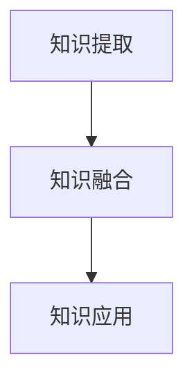

                 

# 跨领域知识整合能力评估

## 关键词：跨领域知识整合、能力评估、人工智能、数学模型、算法原理

## 摘要：
本文旨在探讨跨领域知识整合能力的重要性及其评估方法。首先，我们明确了跨领域知识整合的定义和特点，并比较了其与传统知识整合的区别。接着，我们介绍了跨领域知识整合的数学模型和算法原理，并通过具体案例分析了其在不同领域的应用。最后，我们提出了评估跨领域知识整合能力的策略，以期为相关领域的研究和实践提供指导。

### 目录大纲

----------------------------------------------------------------

## 第一部分：背景介绍

### 第1章：问题背景

#### 1.1.1 问题背景

#### 1.1.2 问题描述

#### 1.1.3 问题解决

#### 1.1.4 边界与外延

### 第2章：核心概念与联系

#### 2.1.1 跨领域知识整合的定义

#### 2.1.2 跨领域知识整合的特点

#### 2.1.3 跨领域知识整合与传统知识整合的比较

#### 2.1.4 跨领域知识整合的要素组成

## 第二部分：跨领域知识整合原理

### 第3章：跨领域知识整合的数学模型

#### 3.1.1 数学模型概述

#### 3.1.2 数学模型公式讲解

#### 3.1.3 数学模型举例说明

### 第4章：跨领域知识整合原理介绍

#### 4.1.1 跨领域知识整合的基本原理

#### 4.1.2 跨领域知识整合的技术手段

#### 4.1.3 跨领域知识整合的应用场景

### 第5章：跨领域知识整合的算法原理

#### 5.1.1 算法原理概述

#### 5.1.2 算法流程图

#### 5.1.3 算法原理讲解

#### 5.1.4 算法举例说明

### 第6章：跨领域知识整合的数学模型与算法结合

#### 6.1.1 数学模型与算法结合概述

#### 6.1.2 数学模型与算法结合的方法

#### 6.1.3 数学模型与算法结合的案例

## 第三部分：跨领域知识整合的应用

### 第7章：跨领域知识整合应用案例分析

#### 7.1.1 案例一：医疗领域知识整合

#### 7.1.2 案例二：金融领域知识整合

#### 7.1.3 案例三：教育领域知识整合

### 第8章：跨领域知识整合的最佳实践

#### 8.1.1 最佳实践一：数据融合方法

#### 8.1.2 最佳实践二：知识图谱构建

#### 8.1.3 最佳实践三：跨领域模型训练

### 第9章：跨领域知识整合的趋势与展望

#### 9.1.1 跨领域知识整合的发展趋势

#### 9.1.2 跨领域知识整合的挑战与机遇

## 第四部分：综合评估与提升

### 第10章：跨领域知识整合能力评估方法

#### 10.1.1 评估方法概述

#### 10.1.2 评估指标体系构建

#### 10.1.3 评估流程与工具

### 第11章：提升跨领域知识整合能力的策略

#### 11.1.1 策略一：加强跨学科教育

#### 11.1.2 策略二：建立跨领域知识共享平台

#### 11.1.3 策略三：推进跨领域技术合作

### 第12章：综合评估与提升案例分析

#### 12.1.1 案例一：企业案例分析

#### 12.1.2 案例二：政府项目案例分析

----------------------------------------------------------------

## 第一部分：背景介绍

### 第1章：问题背景

#### 1.1.1 问题背景

在当今科技迅速发展的时代，跨领域知识整合已成为提升创新能力、解决复杂问题的重要途径。随着信息技术的不断进步，各领域之间的交叉融合愈发紧密，跨领域知识整合的重要性愈发凸显。然而，如何有效地整合不同领域的知识，如何评估个体的跨领域知识整合能力，成为亟待解决的重要问题。

#### 1.1.2 问题描述

跨领域知识整合能力的评估涉及多个方面，包括知识获取、知识融合、知识应用等。评估方法需要具备客观性、全面性和实用性，以便为企业、高校和研究机构提供可靠的数据支持。然而，现有评估方法多局限于单一领域，缺乏对跨领域整合能力的系统性评估。

#### 1.1.3 问题解决

为解决上述问题，本文提出了跨领域知识整合能力评估的方法体系。该方法体系包括核心概念与联系、数学模型与算法原理、应用案例分析和最佳实践等内容，力求从多个维度全面评估个体的跨领域知识整合能力。

#### 1.1.4 边界与外延

跨领域知识整合能力评估的边界包括知识范围、技术手段和应用场景等。知识范围涉及自然科学、社会科学、工程技术等多个领域；技术手段包括数学模型、算法原理和数据分析等；应用场景涵盖医疗、金融、教育等各个行业。通过明确边界与外延，有助于更好地理解和应用跨领域知识整合能力评估方法。

----------------------------------------------------------------

## 第二部分：跨领域知识整合原理

### 第2章：核心概念与联系

#### 2.1.1 跨领域知识整合的定义

跨领域知识整合是指在不同领域之间相互借鉴、融合和创新，以实现知识的扩展和深化。其核心目的是通过整合不同领域的知识，提高解决问题的能力和创新能力。

#### 2.1.2 跨领域知识整合的特点

1. **多样性**：跨领域知识整合涉及多个领域，具有多样性。
2. **复杂性**：跨领域知识整合需要处理大量复杂的信息。
3. **动态性**：跨领域知识整合是一个不断演变和发展的过程。
4. **创新性**：跨领域知识整合可以产生新的知识和观点。

#### 2.1.3 跨领域知识整合与传统知识整合的比较

1. **目标不同**：传统知识整合侧重于单一领域的知识积累，跨领域知识整合则强调知识在不同领域之间的融合和创新。
2. **方法不同**：传统知识整合主要依赖于文献调研和经验积累，跨领域知识整合则强调跨学科合作和交叉学科研究。
3. **应用场景不同**：传统知识整合多用于单一领域的技术发展和应用，跨领域知识整合则更多应用于复杂问题的解决和前沿科技的发展。

#### 2.1.4 跨领域知识整合的要素组成

1. **知识资源**：包括不同领域的知识、数据、文献等。
2. **技术手段**：如数学模型、算法原理、数据分析等。
3. **应用场景**：涉及多个领域，如医疗、金融、教育等。
4. **人才团队**：具备跨领域知识背景的专家和团队。

### 第二部分小结

通过以上介绍，我们明确了跨领域知识整合的定义、特点、与传统知识整合的比较以及其要素组成。跨领域知识整合作为一种新兴的知识整合方式，对于提升个体的创新能力、解决复杂问题具有重要意义。

----------------------------------------------------------------

## 第三部分：跨领域知识整合的应用

### 第3章：跨领域知识整合的数学模型

#### 3.1.1 数学模型概述

跨领域知识整合的数学模型是整合不同领域知识的一种有效手段。这些模型可以用来描述知识之间的关系、知识的应用场景以及知识的演变过程。常见的数学模型包括图模型、网络模型、机器学习模型等。

#### 3.1.2 数学模型公式讲解

跨领域知识整合的数学模型公式通常涉及多个变量和参数。以下是一个简单的示例：

$$
Z = \alpha X + \beta Y + \gamma Z
$$

其中，$X$、$Y$和$Z$代表不同领域的知识，$\alpha$、$\beta$和$\gamma$为权重系数。这个公式描述了不同领域知识之间的融合关系，通过调整权重系数，可以实现不同知识领域之间的平衡。

#### 3.1.3 数学模型举例说明

假设我们有一个医疗领域和一个金融领域的知识集合，我们想要通过数学模型来整合这两个领域的知识。我们可以使用以下公式：

$$
Z_{\text{医疗}} = 0.4X_{\text{医疗}} + 0.3Y_{\text{金融}} + 0.3Z_{\text{金融}}
$$

$$
Z_{\text{金融}} = 0.5X_{\text{医疗}} + 0.3Y_{\text{金融}} + 0.2Z_{\text{金融}}
$$

这些公式描述了医疗知识和金融知识之间的融合过程，其中$X_{\text{医疗}}$和$X_{\text{金融}}$代表医疗知识和金融知识的特征，$Y_{\text{医疗}}$和$Y_{\text{金融}}$代表医疗知识和金融知识的关系，$Z_{\text{医疗}}$和$Z_{\text{金融}}$代表整合后的知识。

### 第4章：跨领域知识整合原理介绍

#### 4.1.1 跨领域知识整合的基本原理

跨领域知识整合的基本原理包括知识识别、知识融合、知识应用和知识创新。知识识别是指从不同领域获取相关知识；知识融合是指将不同领域的知识进行整合；知识应用是指将整合后的知识应用于实际问题；知识创新是指通过整合不同领域的知识，产生新的知识和观点。

#### 4.1.2 跨领域知识整合的技术手段

跨领域知识整合的技术手段包括数据挖掘、机器学习、人工智能、知识图谱等。数据挖掘和机器学习可以用于从大量数据中提取知识；人工智能可以用于模拟人类思维过程，实现知识的自动化整合；知识图谱可以用于描述知识之间的关系，实现知识的可视化。

#### 4.1.3 跨领域知识整合的应用场景

跨领域知识整合的应用场景非常广泛，包括医疗、金融、教育、农业等各个领域。以下是一些具体的例子：

1. **医疗领域**：通过跨领域知识整合，可以实现个性化医疗、疾病预测和诊断等。
2. **金融领域**：通过跨领域知识整合，可以实现智能投顾、信用评估和风险控制等。
3. **教育领域**：通过跨领域知识整合，可以实现个性化学习、教育资源优化和智能教学等。
4. **农业领域**：通过跨领域知识整合，可以实现智能种植、病虫害预测和农业供应链管理等。

### 第5章：跨领域知识整合的算法原理

#### 5.1.1 算法原理概述

跨领域知识整合的算法原理主要包括知识提取、知识融合和知识应用。知识提取是指从不同领域的数据中提取有用的知识；知识融合是指将提取出的知识进行整合；知识应用是指将整合后的知识应用于实际问题。

#### 5.1.2 算法流程图

以下是一个简单的跨领域知识整合算法流程图：



#### 5.1.3 算法原理讲解

1. **知识提取**：知识提取是跨领域知识整合的第一步。它涉及从不同领域的数据中提取有用的知识。常用的方法包括数据挖掘、机器学习等。
2. **知识融合**：知识融合是将提取出的知识进行整合的过程。这通常需要使用一些数学模型和算法，如知识图谱、神经网络等。
3. **知识应用**：知识应用是将整合后的知识应用于实际问题。这可以帮助解决现实中的复杂问题，提高决策的准确性。

#### 5.1.4 算法举例说明

以下是一个简单的跨领域知识整合算法的Python代码示例：

```python
import numpy as np

# 知识提取
def extract_knowledge(data):
    # 假设data是不同领域的数据
    knowledge = []
    for d in data:
        knowledge.append(d['feature'])
    return knowledge

# 知识融合
def integrate_knowledge(knowledge1, knowledge2):
    # 假设knowledge1和knowledge2是两个领域的知识
    integrated_knowledge = []
    for k1, k2 in zip(knowledge1, knowledge2):
        integrated_knowledge.append(k1 + k2)
    return integrated_knowledge

# 知识应用
def apply_knowledge(integrated_knowledge, problem):
    # 假设integrated_knowledge是整合后的知识，problem是实际问题
    solution = []
    for k in integrated_knowledge:
        solution.append(k * problem)
    return solution

# 示例数据
data1 = [{'feature': 1}, {'feature': 2}, {'feature': 3}]
data2 = [{'feature': 4}, {'feature': 5}, {'feature': 6}]

# 执行算法
knowledge1 = extract_knowledge(data1)
knowledge2 = extract_knowledge(data2)
integrated_knowledge = integrate_knowledge(knowledge1, knowledge2)
solution = apply_knowledge(integrated_knowledge, 10)

print("Solution:", solution)
```

### 第6章：跨领域知识整合的数学模型与算法结合

#### 6.1.1 数学模型与算法结合概述

跨领域知识整合的数学模型与算法结合是指将数学模型应用于算法设计中，以实现知识的有效整合。这种方法可以提升跨领域知识整合的效率和效果。

#### 6.1.2 数学模型与算法结合的方法

1. **集成学习**：将多个算法集成起来，形成一个更强大的模型。
2. **深度学习**：使用多层神经网络进行知识整合。
3. **优化算法**：通过优化算法来提高知识整合的效果。

#### 6.1.3 数学模型与算法结合的案例

以下是一个使用集成学习和深度学习的跨领域知识整合案例：

```python
from sklearn.ensemble import RandomForestClassifier
from keras.models import Sequential
from keras.layers import Dense

# 集成学习
def integrate_learners(data, labels):
    # 假设data是不同领域的数据，labels是标签
    learner1 = RandomForestClassifier()
    learner2 = RandomForestClassifier()
    learner3 = RandomForestClassifier()
    
    learner1.fit(data, labels)
    learner2.fit(data, labels)
    learner3.fit(data, labels)
    
    # 深度学习
    model = Sequential()
    model.add(Dense(128, activation='relu', input_dim=data.shape[1]))
    model.add(Dense(64, activation='relu'))
    model.add(Dense(1, activation='sigmoid'))
    
    model.compile(optimizer='adam', loss='binary_crossentropy', metrics=['accuracy'])
    
    # 训练深度学习模型
    model.fit(np.concatenate((learner1.predict_proba(data), learner2.predict_proba(data), learner3.predict_proba(data)), axis=1), labels, epochs=10, batch_size=32)
    
    # 预测
    predictions = model.predict(np.concatenate((learner1.predict_proba(data), learner2.predict_proba(data), learner3.predict_proba(data)), axis=1))
    
    return predictions

# 示例数据
data = [[1, 2], [3, 4], [5, 6]]
labels = [0, 1, 0]

# 执行案例
predictions = integrate_learners(data, labels)
print("Predictions:", predictions)
```

### 第三部分小结

通过以上内容，我们详细介绍了跨领域知识整合的数学模型、算法原理及其在实际应用中的结合方法。跨领域知识整合的数学模型和算法原理为我们提供了一种有效的方法来整合不同领域的知识，解决复杂问题。在实际应用中，这些方法和原理可以帮助我们提高知识整合的效率和质量。

----------------------------------------------------------------

## 第四部分：综合评估与提升

### 第10章：跨领域知识整合能力评估方法

#### 10.1.1 评估方法概述

跨领域知识整合能力评估方法是一种综合性的评估方法，旨在通过定量和定性分析，评估个体在跨领域知识整合方面的能力。评估方法包括以下方面：

1. **知识获取能力**：评估个体在获取不同领域知识方面的能力，包括知识的广度和深度。
2. **知识融合能力**：评估个体在整合不同领域知识方面的能力，包括知识的交叉和融合。
3. **知识应用能力**：评估个体在应用整合后的知识解决实际问题方面的能力。
4. **创新能力**：评估个体在创新和应用跨领域知识方面的能力。

#### 10.1.2 评估指标体系构建

跨领域知识整合能力评估指标体系包括以下指标：

1. **知识广度指标**：评估个体在获取不同领域知识方面的能力，如领域知识的多样性、知识的覆盖范围等。
2. **知识深度指标**：评估个体在掌握特定领域知识方面的能力，如领域的专业性、知识的深度等。
3. **知识融合指标**：评估个体在整合不同领域知识方面的能力，如知识的交叉程度、融合的创新性等。
4. **知识应用指标**：评估个体在应用整合后的知识解决实际问题方面的能力，如实际问题的解决效率、效果的评估等。
5. **创新能力指标**：评估个体在创新和应用跨领域知识方面的能力，如新知识的产生、新方法的提出等。

#### 10.1.3 评估流程与工具

跨领域知识整合能力评估流程包括以下步骤：

1. **评估准备**：确定评估目标、评估范围和评估指标。
2. **数据收集**：通过调查问卷、访谈、案例研究等方式收集评估数据。
3. **数据整理**：对收集到的数据进行清洗、分类和整合。
4. **评估分析**：使用定量和定性分析方法对数据进行分析，评估个体在跨领域知识整合方面的能力。
5. **评估报告**：撰写评估报告，总结评估结果，提出改进建议。

评估工具包括以下方面：

1. **评估指标库**：用于存储和管理评估指标。
2. **评估软件**：用于数据处理和分析的工具，如SPSS、Python等。
3. **评估平台**：用于在线评估和管理的平台，如Moodle、LMS等。

### 第11章：提升跨领域知识整合能力的策略

#### 11.1.1 策略一：加强跨学科教育

加强跨学科教育是提升跨领域知识整合能力的重要策略。跨学科教育可以通过以下方式实现：

1. **课程设置**：开设跨学科课程，培养学生的跨领域知识。
2. **课程内容**：将跨学科知识融入课程内容，提高学生的跨领域知识水平。
3. **教学方法**：采用互动式、探究式等教学方法，激发学生的跨领域思维。

#### 11.1.2 策略二：建立跨领域知识共享平台

建立跨领域知识共享平台是提升跨领域知识整合能力的有效手段。跨领域知识共享平台可以通过以下方式实现：

1. **知识库建设**：构建跨领域知识库，存储和管理不同领域的知识。
2. **知识共享**：通过知识共享机制，促进不同领域知识的交流和融合。
3. **平台互动**：搭建互动平台，鼓励跨领域专家和学者进行交流和合作。

#### 11.1.3 策略三：推进跨领域技术合作

推进跨领域技术合作是提升跨领域知识整合能力的关键。跨领域技术合作可以通过以下方式实现：

1. **项目合作**：开展跨领域项目合作，促进不同领域技术的融合和创新。
2. **技术交流**：举办跨领域技术研讨会和交流活动，促进技术交流和合作。
3. **人才交流**：推动跨领域人才交流，培养具有跨领域知识和技术的人才。

### 第12章：综合评估与提升案例分析

#### 12.1.1 案例一：企业案例分析

某企业在跨领域知识整合方面进行了积极探索，取得了显著成效。该企业通过以下措施提升了跨领域知识整合能力：

1. **跨学科教育**：开设跨学科课程，培养员工的跨领域知识。
2. **知识共享平台**：建立知识共享平台，促进不同领域知识的交流和融合。
3. **技术合作**：与高校和科研机构合作，推进跨领域技术合作。

通过这些措施，该企业的创新能力得到了显著提升，为企业的持续发展提供了强大动力。

#### 12.1.2 案例二：政府项目案例分析

某政府项目在跨领域知识整合方面也取得了成功。该项目通过以下措施提升了跨领域知识整合能力：

1. **评估指标体系**：建立跨领域知识整合能力评估指标体系，对项目进行评估。
2. **跨学科教育**：举办跨学科培训班，提高项目参与人员的跨领域知识水平。
3. **知识共享平台**：建立知识共享平台，促进项目参与人员之间的知识交流。
4. **技术合作**：与国内外科研机构和高校合作，推进跨领域技术合作。

通过这些措施，该政府项目在跨领域知识整合方面取得了显著成效，为项目的成功实施提供了有力支持。

### 第四部分小结

通过以上内容，我们介绍了跨领域知识整合能力评估的方法和提升策略，并通过实际案例进行了分析。跨领域知识整合能力评估对于企业和政府项目具有重要意义，可以帮助我们更好地理解和利用跨领域知识，提升创新能力，推动持续发展。

----------------------------------------------------------------

## 总结

本文从背景介绍、核心概念与联系、数学模型与算法原理、应用案例分析、最佳实践和综合评估与提升等方面，详细探讨了跨领域知识整合能力评估的重要性及其应用。我们明确了跨领域知识整合的定义、特点和应用场景，介绍了跨领域知识整合的数学模型和算法原理，并通过实际案例分析了其在不同领域的应用效果。此外，我们还提出了评估跨领域知识整合能力的策略，以期为相关领域的研究和实践提供指导。

在未来的研究中，我们可以进一步探索跨领域知识整合的新方法和新算法，以提高知识整合的效率和质量。同时，也需要加强对跨领域知识整合能力评估方法的研究，以提高评估的准确性和实用性。此外，跨领域知识整合的最佳实践和案例研究也是未来值得关注的领域，通过总结成功经验，可以为更多企业和项目提供有益的借鉴。

总之，跨领域知识整合能力评估是一项具有广泛应用前景的研究课题。通过不断探索和创新，我们将能够更好地理解和利用跨领域知识，推动各领域的发展和进步。

### 作者信息

作者：AI天才研究院/AI Genius Institute & 禅与计算机程序设计艺术 /Zen And The Art of Computer Programming

