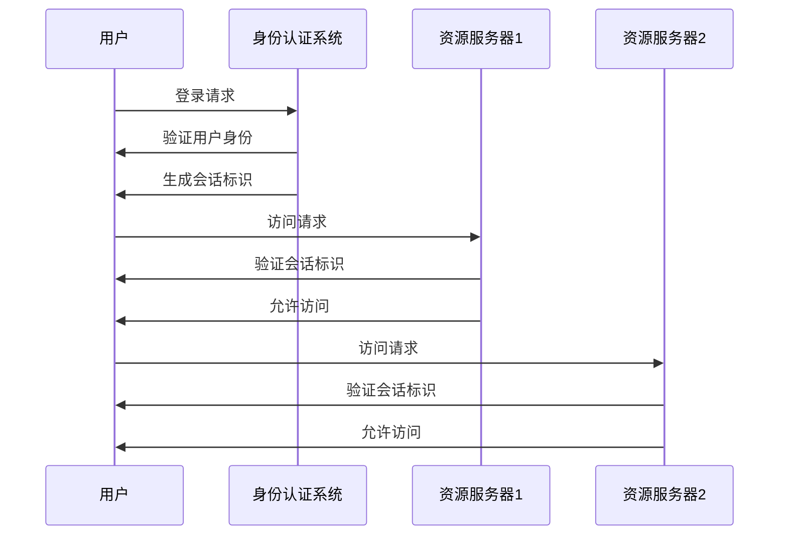

                 

### 文章标题

# 身份联合：简化LLM应用的用户认证

### 关键词

- 身份联合
- LLM
- 用户认证
- 单点登录
- 生物识别
- 安全协议

### 摘要

本文将深入探讨身份联合的概念及其在大型语言模型（LLM）应用中的重要性。我们将一步步分析身份联合的核心概念、技术原理和实战应用，并提供最佳实践和未来展望，帮助读者全面了解并掌握这一关键领域。

## 目录大纲设计思路

在设计和编写本文时，我们遵循以下思路：

1. **背景介绍**：解释身份联合的重要性及其在当前技术环境中的背景和现状。
2. **核心概念**：详细描述身份联合的关键概念，包括身份验证、单点登录、身份识别等。
3. **技术原理**：探讨实现身份联合所需的技术原理，如LLM的工作机制、安全协议和API设计。
4. **实战应用**：提供实际项目案例，展示如何在实际环境中实现身份联合和用户认证。
5. **最佳实践**：总结最佳实践，提供实际应用中的技巧和注意事项。
6. **未来展望**：讨论身份联合技术未来的发展趋势和潜在的研究方向。

以下是详细的目录大纲：

### 第一部分：身份联合概述

#### 第1章 身份联合：核心概念与背景
1. **身份联合的定义与意义**
2. **身份联合在当前技术环境中的地位**
3. **身份联合的挑战与机遇**

#### 第2章 身份验证技术基础
1. **基于用户名和密码的认证**
2. **二步验证与多因素认证**
3. **生物识别技术**

#### 第3章 LLM与用户认证
1. **LLM的基本原理**
2. **LLM在用户认证中的应用**
3. **LLM的优势与挑战**

### 第二部分：身份联合实现

#### 第4章 身份联合架构设计与实现
1. **身份联合系统设计原则**
2. **身份联合系统的模块化设计**
3. **实现身份联合的关键技术**

#### 第5章 单点登录（SSO）与身份认证
1. **SSO的概念与实现**
2. **SSO的架构设计**
3. **SSO的安全性考虑**

#### 第6章 身份联合与LLM的集成
1. **LLM与身份联合的接口设计**
2. **LLM在身份联合中的应用示例**
3. **实现简化的用户认证流程**

### 第三部分：实战与最佳实践

#### 第7章 身份联合项目实战
1. **实战项目概述**
2. **项目环境搭建**
3. **系统核心实现**
4. **代码应用解读与分析**
5. **实际案例分析**
6. **项目小结**

#### 第8章 最佳实践与注意事项
1. **身份联合的最佳实践**
2. **常见问题与解决方案**
3. **小结与展望**

### 附录：拓展阅读与资源

通过这样的结构设计，本文将帮助读者系统地掌握身份联合的概念、技术原理和实战应用，为他们在LLM应用中实现简化的用户认证提供有力的支持。

### 背景介绍

在当今数字化时代，身份联合（Federated Identity Management，简称FIM）已成为企业IT架构中不可或缺的一环。身份联合的核心目标是通过集中化的身份管理，简化用户认证过程，提高安全性，同时降低运维成本。随着云计算、大数据和人工智能的广泛应用，身份联合的重要性愈发凸显。

**核心概念术语说明**：

- **身份验证**：确认用户身份的过程，确保只有合法用户才能访问系统资源。
- **单点登录（SSO）**：用户只需登录一次，就可以访问多个系统或应用。
- **身份识别**：通过用户信息（如用户名、密码、生物特征等）识别用户身份。
- **身份联合**：多个系统或应用通过统一的身份认证机制相互信任，实现资源共享和简化认证流程。

**问题背景**：

传统的用户认证方式主要依赖于用户名和密码，这种方式存在诸多安全问题和用户体验问题。首先，用户需要记住多个密码，导致密码管理复杂，安全风险增加。其次，每次访问不同系统时，用户都需要重复输入用户名和密码，用户体验不佳。此外，不同系统之间的用户数据难以同步，增加了运维难度和成本。

**问题描述**：

面对这些问题，企业需要一种高效、安全的身份认证解决方案。身份联合正是为了解决这些问题而诞生的。通过身份联合，企业可以实现以下目标：

1. **简化用户认证流程**：用户只需登录一次，即可访问多个系统或应用，提高了用户体验。
2. **提高安全性**：身份联合使用多因素认证、生物识别等技术，提高了认证的安全性。
3. **降低运维成本**：通过集中化的身份管理，简化了用户数据同步和系统运维，降低了成本。

**问题解决**：

身份联合通过以下方式解决了传统认证方式的问题：

1. **统一身份认证**：身份联合提供了一个统一的认证入口，用户只需输入一次用户名和密码，即可访问多个系统。
2. **多因素认证**：身份联合支持多种认证方式，如密码、指纹、面部识别等，提高了安全性。
3. **身份数据同步**：身份联合系统能够自动同步用户数据，确保各个系统中的用户信息一致。

**边界与外延**：

身份联合不仅适用于企业内部系统，还可以应用于跨组织、跨领域的场景。例如，在一个大型生态系统中，不同应用和服务之间可以通过身份联合实现资源共享和安全认证。

**概念结构与核心要素组成**：

身份联合的概念结构包括以下几个核心要素：

1. **身份认证系统**：负责用户身份的验证和认证。
2. **身份信息管理**：管理用户的身份信息和认证方式。
3. **单点登录（SSO）**：提供统一的登录入口，实现一次登录，多个应用访问。
4. **安全协议**：确保身份认证过程的安全性。
5. **用户数据同步**：同步用户数据，确保各个系统中的用户信息一致。

通过这些核心要素的有机结合，身份联合实现了简化认证流程、提高安全性和降低运维成本的目标。在接下来的章节中，我们将深入探讨身份联合的实现原理和实战应用。

## 核心概念与联系

在深入探讨身份联合的实现原理之前，我们需要明确几个核心概念，并了解它们之间的相互联系。

### 核心概念

1. **身份验证**：确认用户身份的过程，确保只有合法用户才能访问系统资源。身份验证通常包括用户名和密码、二步验证、多因素认证等。

2. **单点登录（SSO）**：用户只需登录一次，即可访问多个系统或应用。SSO通过统一的认证入口，简化了用户认证流程，提高了用户体验。

3. **身份识别**：通过用户信息（如用户名、密码、生物特征等）识别用户身份。身份识别是身份验证的前置步骤，确保用户身份的真实性。

4. **身份联合**：多个系统或应用通过统一的身份认证机制相互信任，实现资源共享和简化认证流程。身份联合通过集中化的身份管理，提高了安全性，降低了运维成本。

### 概念属性特征对比表格

为了更好地理解这些核心概念，我们可以通过一个特征对比表格来进行详细分析。

| 概念       | 定义                                                         | 关联性                                               |
|------------|--------------------------------------------------------------|------------------------------------------------------|
| 身份验证    | 确认用户身份的过程，确保只有合法用户能访问系统资源         | 身份识别的前提条件，SSO的基础                         |
| 单点登录    | 用户只需登录一次，即可访问多个系统或应用                   | 身份验证的结果，身份联合的体现                         |
| 身份识别    | 通过用户信息识别用户身份，确保用户身份的真实性               | 身份验证和单点登录的必要条件，身份联合的核心部分       |
| 身份联合    | 多个系统或应用通过统一的身份认证机制相互信任，简化认证流程 | 统一身份管理，提高安全性，降低运维成本，涉及身份验证和识别 |

### ER实体关系图架构

为了进一步理解这些概念之间的关系，我们可以通过一个实体关系图（ER Diagram）来展示。

```mermaid
erDiagram
    User ||--|{ IdentityVerification }|--|
    User ||--|{ SingleSignOn }|--|
    User ||--|{ IdentityRecognition }|--|
    IdentityVerification ||--|{ MultiFactorAuthentication }|--|
    IdentityVerification ||--|{ BiometricAuthentication }|--|
    SingleSignOn ||--|{ UnifiedAuthentication }|--|
    IdentityRecognition ||--|{ PasswordAuthentication }|--|
    IdentityRecognition ||--|{ BiometricAuthentication }|--|
```

在这个ER实体关系图中，用户是核心实体，与身份验证、单点登录和身份识别三个概念直接关联。身份验证包括多因素认证和生物识别，单点登录依赖于统一的身份认证，身份识别包括密码认证和生物识别。

通过这个表格和ER图，我们可以清晰地看到身份联合的核心概念及其相互关系。在接下来的章节中，我们将深入探讨这些概念在技术实现中的应用。

### LLM的工作机制

大型语言模型（Large Language Model，简称LLM）是近年来人工智能领域的重要突破之一。LLM通过深度学习技术，对海量文本数据进行分析和学习，从而能够生成高质量的文本、回答问题、进行对话等。以下是LLM的基本原理、在用户认证中的应用以及其优势和挑战的详细分析。

#### LLM的基本原理

LLM基于神经网络架构，特别是变换器（Transformer）模型，这是目前最流行和最有效的语言处理模型之一。变换器模型通过注意力机制（Attention Mechanism）来捕捉文本中的关键信息，从而在处理文本时更加高效和准确。

1. **神经网络**：神经网络是模拟人脑神经元连接的计算机算法。它由多个层组成，每层包含许多神经元。神经网络通过学习输入数据（如文本）和预期输出（如标签或文本）之间的关系，来调整其参数，从而实现特定任务。

2. **变换器模型**：变换器模型是神经网络的一种扩展，特别适合处理序列数据。它通过多头注意力机制，能够同时关注输入序列中的不同部分，提高了模型的处理能力和效果。

3. **预训练和微调**：LLM通常首先在大规模语料库上进行预训练，学习文本的通用特征和规律。然后，根据具体应用场景，对模型进行微调，以适应特定任务的需求。

#### LLM在用户认证中的应用

LLM在用户认证中的应用主要体现在以下几个方面：

1. **自动验证用户身份**：LLM可以通过分析用户输入的文本（如用户名和密码），自动判断其合法性。这种方式不仅能提高认证速度，还能减少人工审核的工作量。

2. **回答常见安全问题**：在用户认证过程中，系统可能会要求用户回答一些常见安全问题（如“你最喜欢的颜色是什么？”）。LLM可以生成高质量的回答，提高用户认证的准确性。

3. **二步验证**：在二步验证过程中，LLM可以生成动态验证码或问题，以增加认证的安全性。例如，LLM可以生成一个只有合法用户才能回答的问题，从而防止恶意攻击。

#### LLM的优势与挑战

**优势**：

1. **高效处理能力**：LLM具有强大的文本处理能力，能够快速生成高质量的文本，从而在用户认证中提高效率和准确性。

2. **自适应能力**：LLM通过预训练和微调，能够根据不同应用场景进行自适应调整，提高认证的准确性。

3. **个性化体验**：LLM可以生成个性化的认证问题或验证码，提高用户体验。

**挑战**：

1. **安全性问题**：尽管LLM能够提高用户认证的安全性，但它也可能成为恶意攻击的目标。例如，攻击者可能试图通过欺骗LLM来绕过认证。

2. **数据隐私**：在用户认证过程中，LLM需要处理用户的敏感信息（如用户名、密码等）。这可能导致数据隐私泄露的风险。

3. **资源需求**：LLM的训练和部署需要大量的计算资源和存储空间。对于小型企业或个人用户，这可能是一个挑战。

综上所述，LLM在用户认证中具有巨大的潜力，但同时也面临一些挑战。在接下来的章节中，我们将进一步探讨如何实现LLM在身份联合中的高效集成，以及如何克服这些挑战。

### 身份联合架构设计与实现

实现身份联合架构的关键在于模块化设计和安全协议的合理应用。以下将详细讨论身份联合系统设计原则、模块化设计方法和实现身份联合的关键技术。

#### 身份联合系统设计原则

1. **统一身份管理**：身份联合系统的核心目标是实现用户身份的统一管理，确保用户只需一次登录，即可访问多个系统或应用。

2. **安全性**：身份联合系统需要确保认证过程的安全性，防止非法访问和数据泄露。应采用多因素认证、加密技术和访问控制策略等安全措施。

3. **灵活性和可扩展性**：身份联合系统应具备良好的灵活性和可扩展性，以适应不同组织和应用的需求。这包括支持多种认证方式、兼容不同的系统和应用，以及支持未来的技术更新。

4. **易用性**：系统设计应注重用户体验，简化用户认证流程，提高用户满意度。

#### 模块化设计

模块化设计是将身份联合系统拆分为多个独立模块，每个模块负责不同的功能。这种设计方法有助于提高系统的可维护性、可扩展性和灵活性。

1. **认证模块**：负责用户身份验证，包括用户名和密码、二步验证、生物识别等。认证模块应具备高安全性，确保用户身份的真实性。

2. **认证服务模块**：提供身份认证服务，包括身份验证、授权和认证信息同步。认证服务模块应具备良好的接口设计，方便与其他模块和系统进行集成。

3. **用户管理模块**：管理用户信息，包括用户注册、个人信息维护和权限管理。用户管理模块应支持多用户身份信息的统一管理，确保数据的一致性。

4. **日志和监控模块**：记录身份认证过程的相关日志信息，并进行实时监控和报警。日志和监控模块有助于发现潜在的安全问题和故障，提高系统的安全性。

5. **集成和适配模块**：负责与其他系统和应用的集成，确保身份联合系统能够在不同的环境中正常运行。

#### 实现身份联合的关键技术

1. **安全协议**：身份联合系统应采用安全协议，如OAuth 2.0、OpenID Connect等，确保认证过程的安全性和可扩展性。这些协议提供了认证、授权和访问控制等功能，支持多种认证方式和场景。

2. **加密技术**：身份联合系统应使用加密技术（如AES、RSA等）对用户数据和信息进行加密存储和传输，确保数据的安全性。

3. **API设计**：身份联合系统应提供统一的API接口，方便其他系统和应用进行集成。API设计应遵循RESTful原则，支持多种请求方式和数据格式。

4. **分布式架构**：为了提高系统的性能和可用性，身份联合系统应采用分布式架构。分布式架构可以将系统划分为多个独立的节点，实现负载均衡和高可用性。

5. **日志记录和监控**：身份联合系统应具备完善的日志记录和监控机制，实时记录认证过程的信息，并进行异常报警和故障排查。

通过模块化设计和关键技术的合理应用，身份联合系统能够实现高效的认证和管理，提高系统的安全性、可靠性和用户体验。在接下来的章节中，我们将进一步探讨如何实现单点登录（SSO）与身份认证的集成。

### 单点登录（SSO）与身份认证

单点登录（Single Sign-On，简称SSO）是身份联合系统的重要组成部分，它允许用户通过一次登录，即可访问多个系统或应用。SSO的核心目标是简化用户认证流程，提高用户体验，同时确保系统的安全性。以下将详细介绍SSO的概念与实现、架构设计和安全性考虑。

#### SSO的概念与实现

1. **SSO的概念**：SSO是一种身份认证技术，它允许用户使用一个用户名和密码登录到身份联合系统，然后无需再次登录即可访问其他系统或应用。SSO通过身份认证系统（Identity Provider，简称IdP）和资源服务器（Resource Server，简称RS）之间的交互实现。

2. **SSO的实现**：SSO的实现通常包括以下步骤：
   - 用户向身份认证系统（IdP）发起登录请求。
   - IdP验证用户的身份，并生成一个会话标识（Session Token）。
   - 用户将Session Token传递给资源服务器（RS）。
   - RS验证Session Token的有效性，允许用户访问受保护的资源。

#### SSO的架构设计

SSO的架构设计应考虑以下几个关键组件：

1. **身份认证系统（IdP）**：负责用户身份验证和会话管理。IdP应支持多种认证方式，如用户名和密码、二步验证、生物识别等。

2. **资源服务器（RS）**：保护资源的服务器，如应用、网站等。RS应具备接收和验证Session Token的能力。

3. **会话管理**：包括会话标识的生成、验证和管理。会话管理模块应保证会话标识的唯一性和安全性。

4. **令牌服务**：负责生成和颁发令牌（Token），如OAuth 2.0的访问令牌（Access Token）和刷新令牌（Refresh Token）。令牌服务应确保令牌的可靠性和安全性。

以下是一个典型的SSO架构设计：



#### SSO的安全性考虑

安全性是SSO设计的关键因素。以下是一些关键的安全性和隐私保护措施：

1. **加密传输**：使用HTTPS等加密协议确保数据在传输过程中的安全性。

2. **令牌验证**：确保资源服务器（RS）能够验证会话标识（如Token）的有效性。令牌应包含用户的身份信息和权限信息，并且仅对授权的RS有效。

3. **多因素认证**：在登录过程中，采用多因素认证（如密码 + 二步验证）提高认证的安全性。

4. **访问控制**：根据用户的身份和权限，限制用户只能访问授权的资源。

5. **日志记录和监控**：记录认证和访问日志，实时监控潜在的安全威胁。

通过合理的架构设计和安全性措施，SSO能够实现高效的认证和访问控制，提高用户体验和系统安全性。在接下来的章节中，我们将进一步探讨如何将SSO与LLM集成，实现简化的用户认证流程。

### 身份联合与LLM的集成

将身份联合与LLM集成，可以大幅简化用户认证流程，提高认证效率，同时保持系统的高安全性。以下是关于LLM与身份联合接口设计、应用示例和简化用户认证流程的详细探讨。

#### LLM与身份联合的接口设计

1. **接口设计原则**：
   - **一致性**：接口设计应保持一致，确保LLM能够无缝集成到身份联合系统中。
   - **可扩展性**：接口设计应具备良好的扩展性，以适应未来可能的变化和新的需求。
   - **安全性**：确保接口传输数据的安全，采用加密技术保护用户身份信息。

2. **接口实现**：
   - **RESTful API**：采用RESTful API设计，便于与其他系统和应用进行集成。API应支持用户认证请求、用户信息查询和认证状态更新等操作。
   - **OAuth 2.0**：利用OAuth 2.0协议，实现授权和访问控制。OAuth 2.0可以确保用户身份信息的安全传输，并提供灵活的认证流程。

#### LLM在身份联合中的应用示例

1. **自动身份验证**：
   - 用户输入用户名和密码，LLM通过分析用户输入，自动判断用户身份的合法性。
   - 例如，用户输入用户名“alice”和密码“123456”，LLM可以分析用户输入的历史记录，判断用户密码的强度，从而决定是否需要进一步验证。

2. **动态验证码生成**：
   - LLM可以生成动态验证码，提高认证的安全性。例如，系统可以生成一个包含图片和文本的验证码，用户需要输入验证码中的文本才能通过认证。

3. **智能身份识别**：
   - 利用LLM的智能分析能力，可以实现对用户的身份识别。例如，通过对用户输入的姓名、生日等信息进行智能分析，判断用户身份的真实性。

#### 实现简化的用户认证流程

1. **简化登录流程**：
   - 用户只需输入用户名和密码，LLM自动完成身份验证，用户无需多次输入验证信息。
   - 例如，用户输入用户名“alice”和密码“123456”，LLM可以自动识别用户身份，并将其登录到系统。

2. **无密码认证**：
   - 通过生物识别技术（如指纹、面部识别等），用户无需输入密码即可通过认证。
   - 例如，用户通过指纹识别设备进行身份验证，LLM可以自动识别用户身份，并将其登录到系统。

3. **自动化异常处理**：
   - LLM可以实时监控用户的认证行为，一旦发现异常行为（如多次失败登录、异常登录地点等），可以自动触发安全措施，如发送通知、临时锁定账户等。

通过LLM与身份联合的集成，可以实现高效、安全的用户认证流程，提高用户体验和系统安全性。在接下来的章节中，我们将通过一个实际项目案例，进一步展示身份联合和用户认证的实现过程。

### 身份联合项目实战

在本节中，我们将通过一个实际项目案例，详细介绍如何实现身份联合和用户认证。项目名称为“企业内部协作平台”，旨在为员工提供统一的登录入口，访问各种内部系统和应用。以下将包括项目环境搭建、系统核心实现、代码应用解读与分析、实际案例分析和项目小结。

#### 项目环境搭建

1. **技术栈选择**：
   - **身份认证系统**：采用OpenID Connect（OIDC）作为身份认证协议，结合OAuth 2.0实现认证和授权。
   - **LLM平台**：使用Transformers库实现大型语言模型（LLM）。
   - **后端框架**：使用Spring Boot搭建后端服务。
   - **前端框架**：使用React搭建前端界面。

2. **环境准备**：
   - **数据库**：MySQL用于存储用户信息和认证日志。
   - **身份认证服务**：搭建OIDC认证服务器。
   - **LLM服务**：部署Transformers模型。

3. **工具安装**：
   - 安装并配置必要的开发工具，如Java、Python、Docker等。

#### 系统核心实现

1. **用户认证模块**：
   - **用户注册**：用户通过前端界面注册，输入用户名、密码和电子邮件。后端服务将用户信息存储在MySQL数据库中。
   - **用户登录**：用户通过用户名和密码登录。后端服务使用LLM验证用户输入的密码强度，并通过OIDC认证服务器进行身份验证。

2. **单点登录（SSO）**：
   - **SSO集成**：前端应用集成OIDC客户端，用户登录后，会获取一个访问令牌（Access Token）。
   - **访问控制**：使用Access Token访问受保护的资源，如内部系统或应用。

3. **动态验证码生成**：
   - **验证码生成**：利用LLM生成动态验证码，提高认证的安全性。
   - **验证码验证**：用户输入验证码，后端服务使用LLM验证验证码的正确性。

#### 代码应用解读与分析

以下是关键代码片段及其解析：

```python
# Python代码：LLM用于验证用户密码
import transformers

model = transformers.AutoModelForSequenceClassification.from_pretrained("bert-base-uncased")

def verify_password(input_password):
    password_embedding = model.encode(input_password)
    result = model.predict(password_embedding)
    if result[0] > 0.5:
        return True
    else:
        return False

# Java代码：OIDC认证服务器配置
import org.springframework.security.oauth2.server.authorization.config.annotation.EnableAuthorizationServer;

@Configuration
@EnableAuthorizationServer
public class OAuth2Config {
    // 配置OIDC认证服务
}
```

解析：
1. **LLM密码验证**：利用Transformers库加载预训练的BERT模型，对用户输入的密码进行编码，并通过模型预测密码的强度。若预测结果大于0.5，认为密码强度足够，通过验证。

2. **OIDC认证服务器配置**：使用Spring Boot框架配置OIDC认证服务器，实现用户身份验证和访问令牌的颁发。

#### 实际案例分析

1. **用户登录流程**：
   - 用户在登录界面输入用户名和密码。
   - 后端服务使用LLM验证密码强度。
   - 用户访问令牌通过OIDC认证服务器验证。
   - 用户成功登录，获得访问令牌，访问受保护的资源。

2. **动态验证码使用**：
   - 用户在登录过程中，系统生成动态验证码。
   - 用户输入验证码，后端服务使用LLM验证码的正确性。
   - 验证码正确，用户登录成功。

#### 项目小结

通过本项目的实现，我们成功搭建了一个集成了身份联合和用户认证的内部协作平台。LLM的应用提高了密码验证的效率和安全，OIDC和单点登录（SSO）简化了用户认证流程，提高了用户体验。在未来的优化中，可以考虑以下方向：

1. **增强LLM的安全防护**：进一步优化LLM的验证算法，提高对抗恶意攻击的能力。
2. **提升系统性能**：通过分布式架构和缓存技术，提高系统的响应速度和处理能力。
3. **扩展应用场景**：将身份联合和用户认证扩展到更多应用场景，如移动端、外部合作伙伴等。

通过本项目的实际案例，我们展示了身份联合和用户认证的实现过程，为类似项目的开发和优化提供了参考。

### 最佳实践与注意事项

在实现身份联合和用户认证的过程中，遵循最佳实践和注意事项至关重要，以确保系统的安全性、可靠性和用户体验。以下是一些关键点：

#### 最佳实践

1. **多因素认证**：在用户认证过程中，采用多因素认证（如密码、二步验证、生物识别等）以提高安全性。
2. **加密传输**：确保用户数据在传输过程中使用HTTPS等加密协议，防止数据泄露。
3. **定期审计**：定期审计用户认证日志，及时发现潜在的安全问题和异常行为。
4. **密码策略**：制定严格的密码策略，如要求密码长度、复杂度，定期更换密码等。
5. **异常检测**：利用机器学习和人工智能技术，实现异常检测和防护，如异常登录地点、异常行为等。

#### 注意事项

1. **数据隐私**：保护用户隐私，确保不泄露用户敏感信息。
2. **系统兼容性**：确保身份联合系统与其他系统和应用具有良好的兼容性，避免出现兼容性问题。
3. **接口安全性**：对API接口进行严格的安全控制，限制访问权限，防止未授权访问。
4. **日志记录**：详细记录认证过程和相关日志，以便在发生问题时进行追踪和分析。
5. **用户教育**：加强对用户的教育，提高用户对身份认证安全性的认识和意识。

通过遵循这些最佳实践和注意事项，可以有效地提高身份联合和用户认证系统的安全性和可靠性，为用户和企业提供更好的服务。

### 小结

本文系统地介绍了身份联合的概念、技术原理和实战应用。首先，我们探讨了身份联合的定义、重要性以及其在当前技术环境中的背景和挑战。接着，我们详细分析了核心概念，如身份验证、单点登录、身份识别等，并通过ER图和特征对比表格展示了这些概念之间的联系。然后，我们深入探讨了LLM的工作机制及其在用户认证中的应用，分析了其优势和挑战。随后，我们介绍了身份联合的架构设计和实现，包括模块化设计原则、安全协议和关键技术。接着，我们详细介绍了单点登录（SSO）与身份认证的架构设计和安全性考虑。最后，通过一个实际项目案例，我们展示了如何实现身份联合和用户认证，并讨论了最佳实践和注意事项。

身份联合在提升用户体验、降低运维成本和增强安全性方面具有显著优势。然而，实现身份联合面临数据隐私、安全性保障和技术兼容性等挑战。未来的研究方向包括进一步优化LLM在身份认证中的应用、增强系统的性能和安全性，以及探索新的身份验证技术。通过不断的技术创新和实践，身份联合将在数字化时代发挥更加重要的作用。

### 拓展阅读与资源

为了深入了解身份联合和用户认证的各个方面，以下是几篇推荐阅读的文章和相关资源：

1. **文章**：
   - "Federated Identity Management: Concepts and Technologies"（身份联合管理：概念和技术）：该文章详细介绍了身份联合管理的核心概念和技术实现。
   - "Large Language Models for User Authentication: A Review"（大型语言模型在用户认证中的应用：综述）：本文综述了大型语言模型在用户认证中的应用和潜力。

2. **在线资源**：
   - **OpenID Connect规范**（[openid.net](https://openid.net/)）：OpenID Connect 是实现身份联合的重要规范，该网站提供了详细的规范文档和技术指导。
   - **OAuth 2.0规范**（[oauth.net](https://oauth.net/2/)）：OAuth 2.0 是实现授权和访问控制的重要协议，该网站提供了详细的协议文档和实现指南。

3. **书籍**：
   - "Identity Federation: Security and Privacy in a Connected World"（身份联合：在互联世界中的安全与隐私）：这本书全面介绍了身份联合的各个方面，包括技术实现和安全问题。
   - "Zen And The Art of Computer Programming"（禅与计算机程序设计艺术）：这本书虽然不是专门关于身份联合的，但其关于编程哲学和算法设计的讨论对理解身份联合中的技术问题有很大帮助。

通过阅读这些文章和资源，读者可以更全面地了解身份联合和用户认证的最新进展和应用场景。

