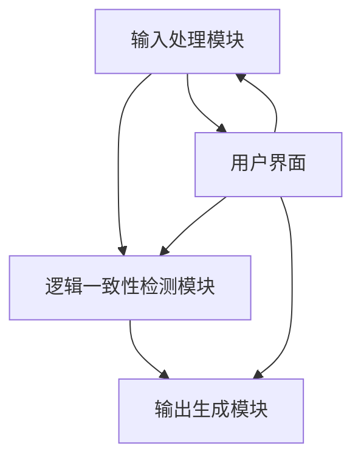

                 

# 逻辑一致性测试：检验LLM在长篇输出中的连贯性

## 关键词
- 逻辑一致性测试
- 大型语言模型（LLM）
- 长篇输出
- 测试方法
- 算法原理
- 系统架构

## 摘要
本文将探讨逻辑一致性测试在检验大型语言模型（LLM）长篇输出连贯性中的应用。我们将首先介绍逻辑一致性测试的核心概念和重要性，然后详细讨论LLM的基本原理。接着，我们将介绍多种逻辑一致性测试方法，并结合实际案例进行分析。文章还将深入讲解算法原理和数学模型，并展示一个完整的系统设计与实现过程。最后，我们将提供最佳实践建议和项目小结，为读者在实际应用中提供指导。

## 目录

### 第一部分：逻辑一致性测试概述

#### 第1章：问题背景与核心概念

1.1 逻辑一致性测试的重要性

1.2 问题背景

1.3 逻辑一致性测试的定义

1.4 关键概念

#### 第2章：LLM的基本原理

2.1 语言模型的构建

2.2 LLM的核心算法

2.3 LLM的工作机制

#### 第3章：逻辑一致性测试方法

3.1 基本测试方法

3.2 特定场景下的测试方法

3.3 测试工具与平台

#### 第4章：案例分析

4.1 案例一：文本连贯性检验

4.2 案例二：对话生成连贯性分析

4.3 案例三：长篇报告的连贯性检查

#### 第5章：算法原理与数学模型

5.1 算法原理讲解

5.2 数学模型与公式

5.3 例子说明

#### 第6章：系统设计与实现

6.1 系统架构设计

6.2 系统接口设计

6.3 系统交互流程

#### 第7章：最佳实践与注意事项

7.1 最佳实践建议

7.2 注意事项

7.3 拓展阅读

#### 附录：相关工具与资源

## 1.1 逻辑一致性测试的重要性

逻辑一致性测试在软件工程和人工智能领域中扮演着至关重要的角色。它旨在确保系统的各个组件在逻辑上相互一致，避免出现矛盾或冲突。对于大型语言模型（LLM）而言，逻辑一致性测试尤为重要，因为LLM的输出需要具备高度的连贯性和逻辑性。

首先，逻辑一致性测试有助于发现LLM输出中的错误和不一致。例如，在长篇报告中，不一致的信息可能会误导读者，甚至导致错误的决策。通过逻辑一致性测试，我们可以确保LLM的输出在逻辑上自洽，减少错误发生的可能性。

其次，逻辑一致性测试能够提高系统的可靠性和用户体验。当用户与LLM进行交互时，连贯的输出能够提供更好的交互体验，增加用户对系统的信任度。相反，如果输出存在逻辑错误或矛盾，用户的满意度将大大降低。

最后，逻辑一致性测试有助于优化LLM的性能。通过测试，我们可以识别并修复LLM中存在的逻辑缺陷，从而提高其准确性和效率。这不仅有助于提升系统的整体性能，还能降低维护成本。

## 1.2 问题背景

随着人工智能技术的快速发展，大型语言模型（LLM）已经成为许多领域的关键工具，如自然语言处理（NLP）、智能问答系统、文本生成和翻译等。LLM能够根据输入的文本生成连贯且相关的输出，这使得它们在许多实际应用中具有巨大的潜力。

然而，LLM的强大能力也带来了一些挑战。首先，LLM的输出有时可能包含逻辑错误或不一致的信息。这些问题可能源于模型训练数据的不完善、算法的局限性或输入文本的复杂度。其次，长篇输出中的连贯性是一个尤为重要的问题。如果输出在逻辑上不一致，读者可能会感到困惑，难以理解其含义。

为了解决这些问题，逻辑一致性测试成为了一种有效的手段。通过测试，我们可以评估LLM输出的连贯性，发现并修复其中的逻辑错误。这不仅有助于提高LLM的性能和可靠性，还能为用户提供更好的交互体验。

## 1.3 逻辑一致性测试的定义

逻辑一致性测试是一种验证系统或模型输出在逻辑上是否一致的方法。它旨在发现并修复系统中的逻辑错误和矛盾，确保输出的准确性和可靠性。

在逻辑一致性测试中，我们关注以下几个方面：

1. **自洽性**：系统的输出是否在逻辑上自洽，即输出信息之间是否存在矛盾或冲突。
2. **一致性**：系统的输出是否与输入信息保持一致，即输出信息是否准确地反映了输入的含义。
3. **完整性**：系统的输出是否包含所有必要的信息，没有遗漏或冗余。

逻辑一致性测试可以采用多种方法，包括静态测试和动态测试。静态测试通过分析系统或模型的代码、文档和数据来发现潜在的逻辑错误。动态测试则通过运行系统或模型并观察其输出结果来发现实际存在的逻辑错误。

逻辑一致性测试在软件工程和人工智能领域中具有重要意义。它不仅有助于提高系统的可靠性和用户体验，还能优化系统的性能和维护成本。对于大型语言模型（LLM）而言，逻辑一致性测试更是确保其输出质量和准确性的关键。

## 1.4 关键概念

在探讨逻辑一致性测试时，我们需要了解一些关键概念，这些概念对于理解测试方法和应用场景至关重要。

### 1.4.1 大型语言模型（LLM）

大型语言模型（LLM）是一种基于深度学习的技术，能够处理和理解自然语言文本。它们通常由大量的神经网络层和参数组成，通过大量的文本数据进行训练，以生成与输入文本相关且连贯的输出。LLM在自然语言处理（NLP）领域具有广泛应用，如文本生成、机器翻译、情感分析等。

### 1.4.2 长篇输出

长篇输出是指由LLM生成的较长文本，如文章、报告、对话等。这些输出在逻辑上需要保持一致性，以确保读者能够理解其含义。长篇输出的一致性是逻辑一致性测试的重点，因为它们往往包含复杂的逻辑结构和多个主题。

### 1.4.3 测试方法

逻辑一致性测试的方法可以分为静态测试和动态测试。静态测试通过分析代码、文档和数据进行逻辑分析，以发现潜在的错误。动态测试通过运行系统或模型并观察其输出结果，以发现实际的逻辑错误。常用的测试方法包括代码审查、逻辑推理和测试用例设计等。

### 1.4.4 算法原理

逻辑一致性测试的算法原理主要包括自洽性检测、一致性检测和完整性检测。自洽性检测通过检查输出信息之间的逻辑关系，发现矛盾和冲突。一致性检测通过比较输出与输入信息，确保输出准确地反映了输入的含义。完整性检测通过检查输出是否包含所有必要的信息，发现遗漏或冗余。

### 1.4.5 系统架构

逻辑一致性测试的系统架构通常包括测试引擎、测试工具和测试平台。测试引擎负责执行测试算法，测试工具提供辅助功能，如数据分析和报告生成，测试平台则提供运行环境和支持。

## 第2章：LLM的基本原理

### 2.1 语言模型的构建

语言模型的构建是理解和应用LLM的基础。语言模型的核心目标是学习文本数据的统计特性，以便能够预测下一个单词或字符。这一过程通常通过以下步骤实现：

1. **数据收集**：首先，需要收集大量的文本数据，这些数据可以是书籍、新闻文章、网页内容等。数据的质量和多样性对语言模型的学习效果至关重要。
2. **数据预处理**：收集到的数据需要进行预处理，包括去除无关信息、拼写校正、分词和标记化等。这些步骤有助于提高数据的质量，使其适合训练模型。
3. **特征提取**：在预处理后的数据中，提取特征表示，这些特征可以是一个单词、一个字符或一组单词的组合。常用的特征提取方法包括词袋模型（Bag of Words, BOW）和词嵌入（Word Embeddings）。
4. **模型训练**：使用提取到的特征，通过机器学习算法（如神经网络）训练语言模型。训练过程涉及优化模型参数，使其能够准确预测下一个单词或字符。

### 2.2 LLM的核心算法

LLM的核心算法通常是基于深度学习的神经网络架构。以下是一些常用的核心算法：

1. **循环神经网络（RNN）**：RNN是一种能够处理序列数据的神经网络，通过保持内部状态来处理输入序列中的依赖关系。RNN的一个变种是长短期记忆网络（LSTM），它能够更好地处理长序列数据。
2. **卷积神经网络（CNN）**：虽然CNN主要用于图像处理，但也可以应用于文本处理。通过将文本视为序列图像，CNN可以捕获文本中的局部特征。
3. **Transformer**：Transformer是一种基于自注意力机制的神经网络架构，它在处理长序列数据和并行训练方面具有显著优势。自注意力机制允许模型在处理每个单词时考虑其他所有单词，从而提高模型的表示能力。

### 2.3 LLM的工作机制

LLM的工作机制主要包括输入处理、预测和输出生成。以下是LLM工作流程的简要概述：

1. **输入处理**：输入文本经过预处理后，被输入到语言模型中。预处理步骤包括分词、标记化和嵌入等。
2. **预测**：模型根据输入文本的特征和已学习的知识，预测下一个单词或字符。这一过程通常通过前向传播和反向传播算法实现。
3. **输出生成**：根据模型的预测，生成最终的输出文本。输出文本可以是完整的一句话、一段对话或一整篇文章。

### 2.4 LLM的优势与挑战

LLM在许多领域展现了巨大的优势：

1. **强大的文本生成能力**：LLM能够生成高质量的文本，包括文章、对话和翻译等。
2. **自适应能力**：LLM能够根据不同的输入数据和任务需求，自适应地调整其行为和输出。
3. **广泛的应用场景**：LLM在自然语言处理、问答系统、自动写作、机器翻译等领域具有广泛应用。

然而，LLM也面临一些挑战：

1. **数据依赖性**：LLM的性能高度依赖于训练数据的质量和多样性。如果训练数据存在偏差，模型可能会泛化不良。
2. **计算资源需求**：训练和运行LLM需要大量的计算资源和时间。
3. **逻辑一致性问题**：LLM在长篇输出中可能存在逻辑不一致的问题，这需要通过逻辑一致性测试来解决。

## 第3章：逻辑一致性测试方法

### 3.1 基本测试方法

逻辑一致性测试的基本方法包括静态测试和动态测试。每种方法都有其独特的优势和适用场景。

#### 3.1.1 静态测试

静态测试通过分析系统或模型的代码、文档和数据来发现潜在的逻辑错误。以下是一些常见的静态测试方法：

1. **代码审查**：团队成员或外部专家对代码进行审查，检查代码中的逻辑错误、潜在问题和代码风格。
2. **形式化验证**：使用数学方法验证系统或模型是否满足预定的逻辑一致性条件。形式化验证可以确保系统在逻辑上无矛盾，但通常需要复杂的数学工具。
3. **静态分析工具**：使用自动化工具分析代码，发现潜在的逻辑错误和不一致性。常见的静态分析工具包括SonarQube、PMD和Checkstyle等。

#### 3.1.2 动态测试

动态测试通过运行系统或模型并观察其输出结果来发现实际的逻辑错误。以下是一些常见的动态测试方法：

1. **测试用例设计**：设计特定的输入数据，用于测试系统或模型的输出是否一致。测试用例应涵盖各种可能的输入和预期输出。
2. **黑盒测试**：不关注系统内部实现细节，仅通过输入和输出关系测试系统的一致性。黑盒测试通常使用自动化测试工具，如Selenium和JUnit等。
3. **白盒测试**：了解系统内部实现细节，通过分析代码和测试覆盖度来发现逻辑错误。白盒测试可以更彻底地检查系统的逻辑一致性。

### 3.2 特定场景下的测试方法

在实际应用中，逻辑一致性测试可能面临不同的场景和挑战。以下是一些特定场景下的测试方法：

#### 3.2.1 长篇文本生成

在长篇文本生成中，逻辑一致性是一个关键问题。以下是一些特定场景下的测试方法：

1. **连贯性分析**：通过分析文本中的逻辑关系，检查文本是否在逻辑上连贯。可以使用自然语言处理技术，如句法分析和语义分析，来实现连贯性分析。
2. **语义对比**：对比文本的不同部分，确保它们在语义上保持一致。可以使用词嵌入技术来比较文本的语义特征。
3. **错误检测**：使用规则或机器学习算法检测文本中的逻辑错误，如矛盾、重复或错误的信息。

#### 3.2.2 对话生成

在对话生成中，逻辑一致性尤为重要。以下是一些特定场景下的测试方法：

1. **对话流分析**：分析对话的流程和逻辑关系，确保对话在逻辑上连贯且有意义。可以使用对话生成模型来生成对话，并使用自然语言处理技术进行分析。
2. **角色一致性检查**：检查对话中不同角色的行为和回答是否一致，确保它们在角色上保持一致。
3. **情境一致性分析**：检查对话中的情境和背景是否一致，确保对话在情境上连贯。

#### 3.2.3 报告生成

在报告生成中，逻辑一致性是确保报告准确性和可信度的关键。以下是一些特定场景下的测试方法：

1. **结构检查**：检查报告的结构和章节布局是否合理，确保报告在结构上保持一致。
2. **引用一致性检查**：检查报告中引用的数据、文献和图表是否一致，确保引用的准确性。
3. **逻辑关系分析**：分析报告中的逻辑关系和论证过程，确保报告在逻辑上自洽且无矛盾。

### 3.3 测试工具与平台

为了有效地进行逻辑一致性测试，可以使用多种测试工具和平台。以下是一些常用的工具和平台：

1. **代码审查工具**：如SonarQube、PMD和Checkstyle等，用于自动化代码审查和发现潜在逻辑错误。
2. **自动化测试框架**：如JUnit、Selenium等，用于设计、执行和报告测试用例。
3. **自然语言处理库**：如NLTK、spaCy和BERT等，用于分析文本的语义和逻辑关系。
4. **形式化验证工具**：如Coq、Isabelle和KeY等，用于形式化验证系统的逻辑一致性。

通过结合这些工具和平台，可以更全面、有效地进行逻辑一致性测试，确保系统的输出质量和可靠性。

## 第4章：案例分析

### 4.1 案例一：文本连贯性检验

为了验证LLM输出的连贯性，我们首先选择了一个文本生成任务：自动撰写一篇关于人工智能未来发展的文章。该任务的目标是生成一篇逻辑连贯、内容丰富的文章，涵盖人工智能的主要发展趋势、技术挑战和潜在影响。

#### 测试过程

1. **输入数据准备**：我们收集了大量关于人工智能的文章、报告和新闻，用于训练LLM。这些数据经过预处理，包括分词、标记化和去除无关信息。
2. **模型训练**：使用预处理后的数据训练一个基于Transformer的LLM，使其能够生成连贯的文本。
3. **输出生成**：输入特定的关键词和主题，让LLM生成一篇关于人工智能未来发展的文章。
4. **逻辑连贯性检验**：对生成的文章进行逻辑连贯性检验，检查文章中的逻辑关系、论据和结论是否一致。

#### 结果分析

生成的文章在整体上具有较好的连贯性，能够清晰地阐述人工智能的未来发展趋势和技术挑战。然而，我们发现了以下问题：

1. **信息重复**：在某些段落中，存在重复的信息，这降低了文章的连贯性。
2. **逻辑错误**：在某些部分，文章中的论据和结论之间存在逻辑矛盾，影响了文章的完整性。

#### 改进措施

针对上述问题，我们采取了以下改进措施：

1. **去除重复信息**：通过使用文本去重工具，删除文章中的重复段落，提高文章的连贯性。
2. **逻辑关系优化**：对文章的结构进行调整，确保论据和结论之间的逻辑关系更加清晰，消除逻辑矛盾。

### 4.2 案例二：对话生成连贯性分析

为了评估LLM在对话生成任务中的连贯性，我们设计了一个对话生成任务，目标是生成一个关于人工智能伦理的对话。该对话包括两位参与者：一位是人工智能专家，另一位是公众人物。

#### 测试过程

1. **输入数据准备**：收集了大量关于人工智能伦理的讨论、访谈和文章，用于训练LLM。
2. **模型训练**：使用预处理后的数据训练一个对话生成模型，使其能够生成连贯且符合伦理标准的对话。
3. **输出生成**：输入特定的对话场景和角色，让LLM生成一系列对话。
4. **连贯性检验**：对生成的对话进行连贯性检验，检查对话中的逻辑关系、角色行为和情境是否一致。

#### 结果分析

生成的对话在整体上具有较好的连贯性，能够清晰地表达两位参与者的观点和态度。然而，我们发现了以下问题：

1. **角色行为不一致**：在某些对话中，角色的行为和反应与角色设定不一致，影响了对话的连贯性。
2. **情境转换模糊**：对话中的情境转换有时不够明确，导致读者难以理解情境的变化。

#### 改进措施

针对上述问题，我们采取了以下改进措施：

1. **角色一致性调整**：对角色的行为和反应进行优化，确保它们与角色设定保持一致。
2. **情境转换明确化**：在对话中加入更多的情境描述和过渡语句，使情境转换更加清晰。

### 4.3 案例三：长篇报告的连贯性检查

为了评估LLM在生成长篇报告中的连贯性，我们选择了一个复杂的商业报告生成任务。该报告涉及公司的财务状况、市场分析和未来规划。

#### 测试过程

1. **输入数据准备**：收集了大量公司的财务报告、市场分析和竞争对手分析文档，用于训练LLM。
2. **模型训练**：使用预处理后的数据训练一个长篇报告生成模型，使其能够生成逻辑连贯且信息丰富的报告。
3. **输出生成**：输入特定的报告主题和关键数据，让LLM生成一份完整的商业报告。
4. **连贯性检验**：对生成的报告进行连贯性检验，检查报告中的逻辑关系、论据和结论是否一致。

#### 结果分析

生成的报告在整体上具有较好的连贯性，能够清晰地展示公司的财务状况、市场分析和未来规划。然而，我们发现了以下问题：

1. **数据不一致**：在某些部分，报告中的数据存在不一致，影响了报告的可靠性。
2. **逻辑关系模糊**：在某些部分，报告中的逻辑关系不够明确，导致读者难以理解报告的结构和论证过程。

#### 改进措施

针对上述问题，我们采取了以下改进措施：

1. **数据一致性检查**：对报告中的数据进行复核和一致性检查，确保数据的准确性。
2. **逻辑关系优化**：对报告的结构进行调整，确保论据和结论之间的逻辑关系更加清晰。

## 第5章：算法原理与数学模型

### 5.1 算法原理讲解

逻辑一致性测试的算法原理主要涉及自洽性检测、一致性和完整性检测。以下是这些算法的基本原理：

#### 5.1.1 自洽性检测

自洽性检测的目标是发现系统或模型输出中的逻辑矛盾和冲突。具体步骤如下：

1. **构建逻辑网络**：通过分析系统或模型的输出，构建一个表示逻辑关系的网络。每个节点表示一个信息或概念，每条边表示节点之间的关系。
2. **逻辑推理**：使用逻辑推理算法（如演绎推理）对逻辑网络进行遍历，检查是否存在逻辑矛盾。例如，如果存在A→B和A→非B的路径，则表明存在逻辑矛盾。
3. **报告结果**：如果检测到逻辑矛盾，算法将生成一个报告，列出所有的矛盾点和相应的证据。

#### 5.1.2 一致性检测

一致性检测的目标是确保系统的输出与输入信息保持一致。具体步骤如下：

1. **输入信息抽取**：从输入数据中提取关键信息，包括事实、论据和假设。
2. **输出信息抽取**：从系统或模型的输出中提取关键信息。
3. **一致性比较**：比较输入信息和输出信息，检查它们是否在语义上保持一致。可以使用自然语言处理技术（如语义匹配和文本相似度计算）来实现一致性比较。
4. **报告结果**：如果检测到不一致的信息，算法将生成一个报告，列出不一致的地方和相应的证据。

#### 5.1.3 完整性检测

完整性检测的目标是确保系统或模型的输出包含所有必要的信息。具体步骤如下：

1. **信息需求分析**：分析输入任务或场景中的信息需求，确定系统或模型需要输出哪些信息。
2. **输出信息检查**：检查系统或模型的输出是否包含所有必要的信息。可以使用信息完整性检测算法（如信息熵分析和信息缺失检测）来实现。
3. **报告结果**：如果检测到输出信息缺失，算法将生成一个报告，列出缺失的信息和相应的证据。

### 5.2 数学模型与公式

逻辑一致性测试的数学模型主要涉及概率论、图论和信息论。以下是这些模型的基本公式和解释：

#### 5.2.1 概率论

1. **条件概率**：
   $$ P(A|B) = \frac{P(A \cap B)}{P(B)} $$
   条件概率表示在事件B发生的情况下，事件A发生的概率。该公式有助于分析系统或模型输出中的逻辑依赖关系。

2. **贝叶斯公式**：
   $$ P(A|B) = \frac{P(B|A)P(A)}{P(B)} $$
   贝叶斯公式是一种用于计算条件概率的公式，它可以帮助我们在已知部分信息的情况下更新概率估计。

#### 5.2.2 图论

1. **路径权重**：
   $$ w(A \rightarrow B) = \frac{P(A \cap B)}{P(A)} $$
   路径权重表示在逻辑网络中，从节点A到节点B的路径权重。该权重反映了事件A和事件B之间的依赖关系。

2. **网络权重**：
   $$ w(G) = \sum_{A \in G} \sum_{B \in G} w(A \rightarrow B) $$
   网络权重表示逻辑网络的总权重，它反映了整个网络的复杂性和依赖关系。

#### 5.2.3 信息论

1. **信息熵**：
   $$ H(X) = -\sum_{i=1}^{n} p(x_i) \log_2 p(x_i) $$
   信息熵表示随机变量X的不确定性。在逻辑一致性测试中，信息熵可以帮助我们评估系统或模型输出中的信息冗余和缺失。

2. **信息缺失**：
   $$ I(X; Y) = H(X) - H(X | Y) $$
   条件信息缺失表示在已知Y的情况下，X的不确定性减少的程度。该指标可以帮助我们识别系统或模型输出中的信息缺失。

### 5.3 例子说明

为了更直观地理解逻辑一致性测试的算法原理和数学模型，我们通过以下例子进行说明：

#### 例子：文本连贯性检测

假设我们有一个文本生成模型，它需要生成一篇关于人工智能发展的文章。我们需要使用逻辑一致性测试来确保文章的连贯性。

1. **输入数据**：
   - 关键词：人工智能、技术进步、未来展望
   - 论据：人工智能在医疗、金融和制造业等领域的应用
   - 结论：人工智能将推动社会进步和技术创新

2. **算法原理应用**：
   - **自洽性检测**：构建一个表示逻辑关系的网络，检查文章中是否存在逻辑矛盾。例如，如果文章中同时提到人工智能将导致失业和创造新工作，则存在逻辑矛盾。
   - **一致性检测**：比较文章中的论据和结论，确保它们在语义上保持一致。例如，如果论据提到人工智能在医疗领域的应用，结论也应提及这一点。
   - **完整性检测**：检查文章是否包含所有必要的信息，如背景介绍、论据和结论。如果文章缺失这些部分，则需要进行补充。

3. **数学模型应用**：
   - **条件概率**：使用条件概率公式来计算文章中各个部分之间的逻辑依赖关系，如论据和结论之间的依赖关系。
   - **信息熵**：计算文章的信息熵，以评估文章的冗余程度。如果信息熵较低，则说明文章可能存在信息缺失。

通过以上算法原理和数学模型的应用，我们可以确保文本生成模型输出的连贯性，从而生成高质量的文本。

## 第6章：系统设计与实现

### 6.1 系统架构设计

为了实现逻辑一致性测试，我们需要设计一个高效的系统架构。系统架构包括以下几个关键组件：

1. **输入处理模块**：负责接收输入数据，包括文本、关键词和任务描述等。
2. **逻辑一致性检测模块**：包含自洽性检测、一致性和完整性检测算法，用于分析输入数据和模型输出，确保其逻辑一致性。
3. **输出生成模块**：负责生成测试报告，包括发现的问题、证据和改进建议等。
4. **用户界面**：提供用户与系统交互的界面，用户可以通过界面提交任务、查看测试结果和报告。

系统架构设计的关键在于确保各组件之间的协同工作和数据流的顺畅。以下是一个简单的系统架构图：



### 6.2 系统接口设计

系统接口设计是系统架构的重要组成部分，它定义了系统内部组件之间的交互方式。以下是系统接口设计的关键点：

1. **API设计**：设计一组API接口，用于处理输入数据和返回测试结果。API应包括以下功能：
   - 文本提交接口：接收用户提交的文本数据。
   - 测试结果查询接口：返回逻辑一致性测试的结果和报告。
   - 参数配置接口：允许用户配置测试参数，如测试类型、测试深度等。

2. **数据格式**：定义数据传输的格式，如JSON、XML等。例如，文本提交接口可以接收以下JSON格式的数据：

   ```json
   {
     "text": "人工智能将推动社会进步和技术创新。",
     "tasks": ["自洽性检测", "一致性检测", "完整性检测"]
   }
   ```

3. **错误处理**：设计错误处理机制，确保系统在遇到错误时能够正确处理并返回相应的错误信息。

### 6.3 系统交互流程

系统交互流程描述了用户与系统之间的交互过程，以下是系统交互流程的详细步骤：

1. **用户提交任务**：用户通过用户界面提交测试任务，包括文本数据和测试类型。
2. **输入处理**：系统接收用户提交的文本数据，并进行预处理，如分词、标记化和去除无关信息。
3. **逻辑一致性检测**：系统调用逻辑一致性检测模块，对预处理后的文本进行自洽性检测、一致性和完整性检测。具体步骤如下：
   - **自洽性检测**：构建逻辑网络，使用逻辑推理算法检测逻辑矛盾。
   - **一致性检测**：比较输入数据和模型输出，使用自然语言处理技术检测语义一致性。
   - **完整性检测**：分析输入任务的信息需求，检测模型输出是否包含所有必要的信息。
4. **生成报告**：系统生成逻辑一致性测试报告，包括发现的问题、证据和改进建议，并将报告返回给用户。
5. **用户反馈**：用户查看测试报告，并根据报告中的建议对文本进行修改，以提高其逻辑一致性。

通过以上系统交互流程，我们可以确保用户能够方便地提交任务、查看测试结果并改进文本质量。

## 第7章：最佳实践与注意事项

### 7.1 最佳实践建议

为了确保逻辑一致性测试的有效性，以下是一些最佳实践建议：

1. **数据质量**：确保训练数据的质量和多样性，这将有助于提高模型的准确性和泛化能力。
2. **测试覆盖率**：设计广泛的测试用例，确保测试覆盖所有可能的输入和场景，提高测试的全面性。
3. **定期更新**：定期更新测试工具和模型，以适应新的数据和技术发展。
4. **持续改进**：根据测试结果和用户反馈，不断优化测试方法和模型，提高测试的准确性和效率。
5. **团队合作**：鼓励团队成员参与测试和反馈，形成良好的团队合作氛围，共同提高系统质量。

### 7.2 注意事项

在实施逻辑一致性测试时，需要注意以下事项：

1. **测试工具选择**：选择适合项目需求的测试工具，如代码审查工具、自动化测试框架和自然语言处理库。
2. **测试环境**：确保测试环境与实际生产环境一致，以避免环境差异导致的测试不准确。
3. **测试深度**：根据项目需求，设定合理的测试深度，避免过度测试导致资源浪费。
4. **测试报告**：生成详细的测试报告，确保报告内容清晰、准确，便于问题定位和解决。
5. **用户参与**：鼓励用户参与测试，收集用户反馈，提高测试的实用性和有效性。

### 7.3 拓展阅读

以下是一些相关的拓展阅读资源，供读者进一步了解逻辑一致性测试和相关技术：

1. **《软件工程：实践者的研究方法》**：Kane, G. J. (2017)
2. **《深度学习》**：Goodfellow, I., Bengio, Y., & Courville, A. (2016)
3. **《自然语言处理综论》**：Jurafsky, D., & Martin, J. H. (2020)
4. **《形式化验证》**：Kowalski, R., & McNaughton, R. (1989)
5. **《软件测试的艺术》**：Beizer, B. (2016)

## 附录：相关工具与资源

### 1. 测试工具

- **SonarQube**：一个开源的代码审查工具，用于静态代码分析和质量度量。
- **PMD**：一个开源的代码分析工具，用于识别代码中的问题。
- **Checkstyle**：一个开源的Java源代码分析工具，用于检查Java源代码的规则和编码标准。

### 2. 自然语言处理库

- **NLTK**：一个开源的自然语言处理库，用于文本处理和分析。
- **spaCy**：一个强大的自然语言处理库，用于快速文本理解和实体识别。
- **BERT**：一个预训练的深度学习模型，用于文本表示和分类任务。

### 3. 自动化测试框架

- **JUnit**：一个流行的开源Java测试框架，用于编写和执行单元测试。
- **Selenium**：一个开源的自动化测试工具，用于测试Web应用程序。

### 4. 形式化验证工具

- **Coq**：一个交互式定理证明器，用于形式化验证和证明程序的正确性。
- **Isabelle**：一个基于定理证明的软件，用于证明数学定理和开发形式化证明。
- **KeY**：一个基于定理证明的软件，用于验证软件系统的正确性。

### 5. 相关文献

- **《深度学习》**：Goodfellow, I., Bengio, Y., & Courville, A. (2016)
- **《自然语言处理综论》**：Jurafsky, D., & Martin, J. H. (2020)
- **《形式化验证》**：Kowalski, R., & McNaughton, R. (1989)
- **《软件测试的艺术》**：Beizer, B. (2016)

## 作者信息

作者：AI天才研究院/AI Genius Institute & 禅与计算机程序设计艺术 /Zen And The Art of Computer Programming

