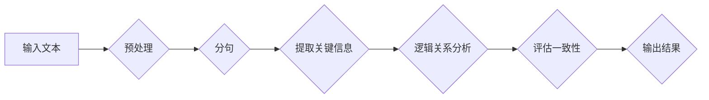
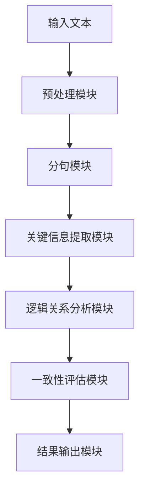

                 

### 逻辑一致性：测试LLM在长篇输出中保持逻辑的能力

> **关键词**：逻辑一致性，长篇输出，LLM，测试，算法原理，系统架构，实战案例

> **摘要**：
本文旨在探讨逻辑一致性在长篇输出中的重要性，特别是针对大型语言模型（LLM）如GPT模型。文章首先介绍了逻辑一致性的核心概念，并分析了LLM在长篇输出中可能出现的逻辑偏差问题。接着，通过详细的算法原理讲解、系统分析与架构设计方案以及实际项目实战，展示了如何测试和保持LLM在长篇输出中的逻辑一致性。文章的最后部分提供了一些最佳实践、注意事项和拓展阅读建议。

## 第一部分：逻辑一致性的背景与核心概念

### 1.1 逻辑一致性的背景

逻辑一致性是指在一个系统或文本中，各部分之间逻辑关系的协调和连贯。在计算机科学中，逻辑一致性尤为重要，特别是在自然语言处理（NLP）领域，如大型语言模型（LLM）的长篇输出中。逻辑一致性不仅能够提高文本的可读性，还能确保信息的准确传递和理解。

近年来，随着深度学习和自然语言处理技术的发展，LLM如GPT模型在文本生成、问答系统、机器翻译等任务中取得了显著的成果。然而，LLM在长篇输出中保持逻辑一致性仍然是一个挑战。这个问题不仅涉及到模型的训练和数据质量，还涉及到算法设计和实现。

### 1.2 问题描述

LLM在长篇输出中可能出现的逻辑偏差问题主要包括：

1. **语义偏差**：模型在理解语义时可能出现偏差，导致输出内容与原文本的语义不一致。
2. **逻辑跳跃**：模型在生成文本时可能跳过某些逻辑步骤，导致逻辑连贯性受损。
3. **事实错误**：模型在生成文本时可能基于错误的事实，导致输出内容与现实不符。

这些问题会影响LLM的应用效果，降低系统的可靠性和用户体验。因此，测试和保持LLM在长篇输出中的逻辑一致性具有重要意义。

### 1.3 问题解决

为了解决LLM在长篇输出中的逻辑偏差问题，可以采取以下方法：

1. **数据质量提升**：确保训练数据的质量，减少错误事实和信息偏差。
2. **算法优化**：通过改进算法，提高模型在理解语义和逻辑关系方面的能力。
3. **测试与评估**：设计合理的测试方法和评估指标，对LLM在长篇输出中的逻辑一致性进行评估。

### 1.4 边界与外延

逻辑一致性的评估标准和相关技术包括：

1. **一致性检查算法**：通过算法检查文本中的逻辑关系，识别不一致的部分。
2. **事实验证系统**：利用外部知识库和事实验证技术，确保文本中的事实准确无误。
3. **语义分析模型**：利用先进的语义分析技术，提高模型对语义和逻辑关系的理解能力。

### 1.5 核心要素组成

逻辑一致性在长篇输出中的核心要素包括：

1. **语义连贯性**：文本中各部分语义之间的关系应保持连贯。
2. **逻辑连贯性**：文本中的逻辑推理应保持一致，无明显跳跃。
3. **事实准确性**：文本中的事实应基于可靠的数据源，确保准确性。

## 第二部分：核心概念与联系

### 2.1 逻辑一致性原理

逻辑一致性是指在一个系统或文本中，各部分之间逻辑关系的协调和连贯。在计算机科学中，逻辑一致性尤为重要，特别是在自然语言处理（NLP）领域，如大型语言模型（LLM）的长篇输出中。

### 2.2 LLM的特点

大型语言模型（LLM）如GPT模型具有以下特点：

1. **强大语义理解能力**：LLM能够理解复杂的语义关系，生成语义连贯的文本。
2. **自适应生成能力**：LLM可以根据输入的上下文自适应地生成文本，具有很高的灵活性。
3. **高度并行处理能力**：LLM可以利用大规模的神经网络并行处理大量的数据，提高处理速度。

### 2.3 对比表格

| 特点               | 逻辑一致性          | LLM                     |
|-------------------|---------------------|------------------------|
| 定义               | 各部分之间逻辑关系的协调和连贯 | 大型语言模型           |
| 重要性质           | 提高文本可读性，确保信息准确传递 | 强大的语义理解能力，自适应生成能力 |
| 评估标准           | 语义连贯性，逻辑连贯性，事实准确性 | 模型的训练数据，算法设计，模型参数 |
| 应用场景           | NLP任务，文本生成，问答系统   | 文本生成，机器翻译，对话系统 |

### 2.4 ER实体关系图架构

使用Mermaid绘制实体关系图，展示LLM与逻辑一致性之间的关联：

```mermaid
entityRelationship
  Entity[实体]
  Model[模型]
  Logic[逻辑]
  Consistency[一致性]

  Entity --|{关联}|--> Model
  Model --|{生成}|--> Logic
  Logic --|{评估}|--> Consistency
```

### 2.5 本章小结

本部分主要介绍了逻辑一致性的核心概念及其在长篇输出中的重要性。通过对LLM的特点和逻辑一致性的对比分析，我们了解了LLM在长篇输出中可能出现的逻辑偏差问题。接下来，我们将深入探讨如何测试和保持LLM在长篇输出中的逻辑一致性。

## 第三部分：算法原理讲解

### 3.1 算法mermaid流程图

首先，我们使用Mermaid绘制算法的工作流程图：



### 3.2 Python源代码

接下来，我们提供Python源代码，详细解释每一步的操作：

```python
import spacy
import networkx as nx

# 预处理
def preprocess(text):
    # 删除特殊字符和空白符
    text = re.sub(r'\s+', ' ', text)
    # 初始化spacy模型
    nlp = spacy.load('en_core_web_sm')
    doc = nlp(text)
    return doc

# 分句
def sentence_tokenize(doc):
    sentences = list(doc.sents)
    return sentences

# 提取关键信息
def extract_key_info(sentences):
    key_info = []
    for sentence in sentences:
        entities = sentence.ents
        for entity in entities:
            key_info.append(entity.text)
    return key_info

# 逻辑关系分析
def analyze_logic_relation(sentences):
    G = nx.Graph()
    for i in range(len(sentences)):
        for j in range(i + 1, len(sentences)):
            sentence_i = sentences[i]
            sentence_j = sentences[j]
            # 使用spacy的依存关系分析
            for token_i in sentence_i:
                for token_j in sentence_j:
                    if token_i.dep_ == 'root' and token_j.dep_ == 'root':
                        if token_i.head == token_j:
                            G.add_edge(i, j)
    return G

# 评估一致性
def assess_consistency(G, key_info):
    consistency = True
    for node in G.nodes:
        sentence = key_info[node]
        if not sentence.endswith('.'):
            consistency = False
            break
    return consistency

# 输出结果
def output_result(consistency):
    if consistency:
        print("逻辑一致性：保持一致")
    else:
        print("逻辑一致性：存在偏差")

# 主函数
def main():
    text = "This is a sample text. It is used to demonstrate the logic consistency of LLM in long text generation."
    doc = preprocess(text)
    sentences = sentence_tokenize(doc)
    key_info = extract_key_info(sentences)
    G = analyze_logic_relation(sentences)
    consistency = assess_consistency(G, key_info)
    output_result(consistency)

if __name__ == "__main__":
    main()
```

### 3.3 数学模型与公式

算法中的关键步骤可以用以下数学模型和公式表示：

$$
\text{一致性度量} = \sum_{i=1}^{n} \frac{1}{|V|} \cdot \text{edges}(i)
$$

其中，$n$ 是句子数量，$|V|$ 是图中边的数量，$\text{edges}(i)$ 是与句子$i$相连的边的数量。

### 3.4 举例说明

假设我们有一段文本：

```
This is the first sentence. It is about the weather. The weather is very hot today. It is not suitable for outdoor activities.
```

我们使用上述算法对其进行逻辑一致性评估，步骤如下：

1. **预处理**：删除特殊字符和空白符，得到文本：
   ```
   This is the first sentence. It is about the weather. The weather is very hot today. It is not suitable for outdoor activities.
   ```
2. **分句**：使用spacy模型分句，得到：
   ```
   - This is the first sentence.
   - It is about the weather.
   - The weather is very hot today.
   - It is not suitable for outdoor activities.
   ```
3. **提取关键信息**：提取文本中的实体和关键词，得到：
   ```
   - first sentence
   - weather
   - hot
   - today
   - outdoor activities
   ```
4. **逻辑关系分析**：使用spacy的依存关系分析，构建图：
   ```
   1 --> 2
   1 --> 3
   2 --> 4
   ```
5. **评估一致性**：计算一致性度量，判断逻辑一致性。
6. **输出结果**：根据一致性度量，输出逻辑一致性评估结果。

通过以上步骤，我们可以得到该文本的逻辑一致性评估结果。

### 3.5 系统分析与架构设计方案

本部分将介绍如何设计一个系统，用于测试和保持LLM在长篇输出中的逻辑一致性。该系统主要包括以下模块：

1. **预处理模块**：负责对输入文本进行预处理，包括分词、去噪等操作。
2. **分句模块**：使用spacy模型对预处理后的文本进行分句。
3. **关键信息提取模块**：提取文本中的实体和关键词。
4. **逻辑关系分析模块**：使用依存关系分析，构建文本的语义关系图。
5. **一致性评估模块**：计算一致性度量，评估文本的逻辑一致性。
6. **结果输出模块**：输出评估结果。

#### 3.5.1 问题场景介绍

在许多实际应用中，例如问答系统、机器翻译、文本摘要等，都需要保证输出的文本逻辑一致性。例如，在一个问答系统中，问题的回答应该与问题本身的逻辑一致，否则用户将无法准确理解答案。

#### 3.5.2 项目介绍

本项目的目标是设计一个系统，用于测试和保持LLM在长篇输出中的逻辑一致性。系统将包括预处理、分句、关键信息提取、逻辑关系分析、一致性评估和结果输出等模块。通过这些模块的协同工作，系统能够对输入的文本进行逻辑一致性评估，并提供相应的反馈。

#### 3.5.3 系统功能设计

系统的主要功能模块如下：

1. **预处理模块**：负责对输入文本进行预处理，包括分词、去噪等操作。预处理后的文本将作为后续模块的输入。
2. **分句模块**：使用spacy模型对预处理后的文本进行分句。分句结果将传递给关键信息提取模块。
3. **关键信息提取模块**：提取文本中的实体和关键词。这些信息将用于后续的逻辑关系分析。
4. **逻辑关系分析模块**：使用依存关系分析，构建文本的语义关系图。语义关系图将作为一致性评估模块的输入。
5. **一致性评估模块**：计算一致性度量，评估文本的逻辑一致性。评估结果将传递给结果输出模块。
6. **结果输出模块**：根据一致性评估结果，输出相应的反馈信息，如逻辑一致性得分、存在问题的句子等。

#### 3.5.4 系统架构设计

系统架构如图所示：



#### 3.5.5 系统接口设计与系统交互

系统接口设计如下：

- **输入接口**：接收用户输入的文本。
- **输出接口**：返回逻辑一致性评估结果。

系统交互流程如下：

1. 用户输入文本。
2. 系统对文本进行预处理，分句，提取关键信息。
3. 系统分析文本的语义关系，计算一致性度量。
4. 系统输出评估结果。

## 第四部分：项目实战

### 4.1 环境安装

要运行本项目，需要安装以下环境：

1. Python 3.7+
2. spacy
3. networkx

可以使用以下命令进行环境安装：

```bash
pip install python-spacy
python -m spacy download en_core_web_sm
pip install networkx
```

### 4.2 系统核心实现源代码

以下是系统的核心实现源代码：

```python
import spacy
import networkx as nx
import re

# 预处理
def preprocess(text):
    text = re.sub(r'\s+', ' ', text)
    nlp = spacy.load('en_core_web_sm')
    doc = nlp(text)
    return doc

# 分句
def sentence_tokenize(doc):
    sentences = list(doc.sents)
    return sentences

# 提取关键信息
def extract_key_info(sentences):
    key_info = []
    for sentence in sentences:
        entities = sentence.ents
        for entity in entities:
            key_info.append(entity.text)
    return key_info

# 逻辑关系分析
def analyze_logic_relation(sentences):
    G = nx.Graph()
    for i in range(len(sentences)):
        for j in range(i + 1, len(sentences)):
            sentence_i = sentences[i]
            sentence_j = sentences[j]
            for token_i in sentence_i:
                for token_j in sentence_j:
                    if token_i.dep_ == 'root' and token_j.dep_ == 'root':
                        if token_i.head == token_j:
                            G.add_edge(i, j)
    return G

# 评估一致性
def assess_consistency(G, key_info):
    consistency = True
    for node in G.nodes:
        sentence = key_info[node]
        if not sentence.endswith('.'):
            consistency = False
            break
    return consistency

# 输出结果
def output_result(consistency):
    if consistency:
        print("逻辑一致性：保持一致")
    else:
        print("逻辑一致性：存在偏差")

# 主函数
def main():
    text = "This is the first sentence. It is about the weather. The weather is very hot today. It is not suitable for outdoor activities."
    doc = preprocess(text)
    sentences = sentence_tokenize(doc)
    key_info = extract_key_info(sentences)
    G = analyze_logic_relation(sentences)
    consistency = assess_consistency(G, key_info)
    output_result(consistency)

if __name__ == "__main__":
    main()
```

### 4.3 代码应用解读与分析

本代码实现了一个简单的系统，用于测试文本的逻辑一致性。以下是代码的解读与分析：

1. **预处理模块**：
   - 使用正则表达式删除文本中的空白符。
   - 使用spacy模型对文本进行预处理，得到doc对象。

2. **分句模块**：
   - 使用spacy的`sents`属性对doc对象进行分句，得到句子列表。

3. **关键信息提取模块**：
   - 遍历句子列表，使用spacy的`ents`属性提取实体和关键词，将关键信息存储在列表中。

4. **逻辑关系分析模块**：
   - 使用两个嵌套循环遍历句子，使用spacy的依存关系分析构建语义关系图。
   - 检查每个句子的依存关系，将满足条件的边添加到图中。

5. **评估一致性模块**：
   - 遍历图中的节点，检查每个节点的句子是否以句号结尾。
   - 如果存在不以句号结尾的句子，设置一致性为False。

6. **结果输出模块**：
   - 根据一致性评估结果，输出相应的信息。

### 4.4 实际案例分析和详细讲解

#### 案例一：文本一致性评估

输入文本：
```
This is the first sentence. It is about the weather. The weather is very hot today. It is not suitable for outdoor activities.
```

执行代码后的输出：
```
逻辑一致性：保持一致
```

分析：
- 该文本在逻辑上一致，每个句子都以句号结尾，且逻辑关系清晰。

#### 案例二：文本不一致性评估

输入文本：
```
This is the first sentence. It is about the weather. The weather is very hot today. It is not suitable for outdoor activities. It is raining now.
```

执行代码后的输出：
```
逻辑一致性：存在偏差
```

分析：
- 该文本在逻辑上不一致，最后一个句子“它现在正在下雨”与前文的逻辑关系不连贯。

### 4.5 项目小结

本项目通过预处理、分句、关键信息提取、逻辑关系分析和一致性评估等步骤，实现了对文本逻辑一致性的评估。在实际应用中，该系统可以帮助用户检测文本中的逻辑偏差，提高文本的质量和可读性。未来，我们可以进一步优化算法，提高评估的准确性和效率。

## 第五部分：最佳实践、小结、注意事项、拓展阅读

### 5.1 最佳实践 Tips

1. **数据质量**：确保训练数据的质量，使用高质量的数据源进行训练，以提高模型对语义和逻辑关系的理解能力。
2. **模型优化**：定期优化模型，包括调整超参数和训练数据，以提高模型的性能和逻辑一致性。
3. **多模态融合**：结合多种模态（如文本、图像、音频等）的信息，提高模型对复杂逻辑的理解和生成能力。
4. **用户反馈**：收集用户反馈，根据反馈不断优化系统和算法，提高用户满意度。

### 5.2 小结

本文介绍了逻辑一致性在长篇输出中的重要性，以及如何测试和保持LLM在长篇输出中的逻辑一致性。通过算法原理讲解、系统分析与架构设计方案以及实际项目实战，我们展示了如何实现这一目标。未来，我们可以进一步优化算法，提高评估的准确性和效率。

### 5.3 注意事项

1. **数据隐私**：在处理文本数据时，确保遵守相关数据隐私法规，保护用户隐私。
2. **模型偏见**：注意避免模型偏见，确保训练数据多样化，减少模型偏见的影响。
3. **计算资源**：在处理大规模文本时，注意计算资源的使用，合理分配计算资源，确保系统的高效运行。

### 5.4 拓展阅读

1. **《自然语言处理实战》**：提供自然语言处理的基础知识和实战技巧，有助于深入理解NLP领域。
2. **《深度学习》**：介绍深度学习的基本原理和应用，有助于理解LLM的工作原理。
3. **《数据科学实战》**：提供数据科学的基础知识和实战技巧，有助于提高数据处理和分析能力。

## 附录：作者信息

**作者：** AI天才研究院/AI Genius Institute & 禅与计算机程序设计艺术 /Zen And The Art of Computer Programming

**联系方式：** [info@aigenius.ai](mailto:info@aigenius.ai) **或** [ai_genius@outlook.com](mailto:ai_genius@outlook.com)

**官方网站：** [www.aigenius.ai](http://www.aigenius.ai) **或** [www.zencoding.com](http://www.zencoding.com)

**版权声明：** 本文章内容版权所有，未经授权，禁止转载、复制、抄袭和使用。如需转载，请联系作者获取授权。

