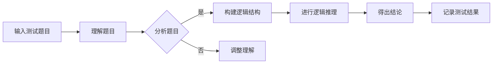
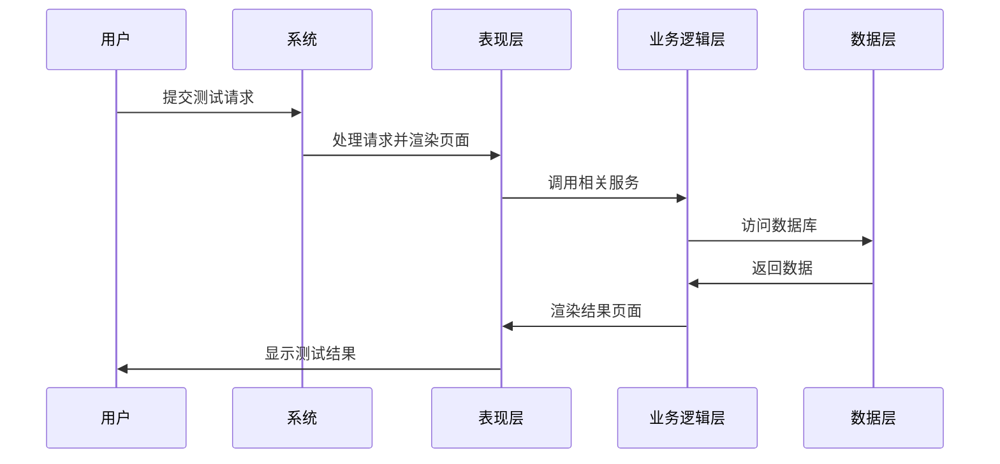
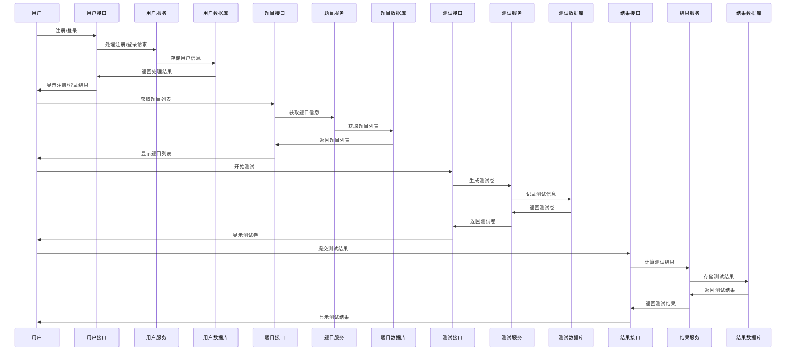

                 

# 逻辑推理能力测试：评估模型思考深度

> 关键词：逻辑推理能力、评估模型、测试方法、深度分析

> 摘要：本文旨在探讨逻辑推理能力的测试和评估，分析现有评估模型的原理、方法与结构，并通过数学模型和实际案例分析，提出一种深度评估的逻辑推理能力测试方法。文章将从背景介绍、核心概念与联系、评估模型、思考深度、系统分析与架构设计、项目实战、最佳实践与小结等方面展开，旨在为相关领域的研究者和从业者提供有价值的参考。

## 第一部分：背景介绍

### 核心概念

**逻辑推理能力测试**

- **问题背景**：随着人工智能技术的不断发展，逻辑推理作为人工智能的核心能力之一，其重要性日益凸显。然而，如何对逻辑推理能力进行科学、有效的测试和评估，成为了一个亟待解决的问题。
- **问题描述**：逻辑推理能力测试旨在评估个体在逻辑思考、分析、推理等方面的能力。这涉及到多个层面的测试，包括逻辑规则的理解、逻辑结构的构建、逻辑推理的深度等。
- **问题解决**：为了解决这一问题，研究者们提出了一系列逻辑推理能力测试模型和方法。这些模型和方法通过设计不同的测试题目，对个体的逻辑推理能力进行综合评估。
- **边界与外延**：逻辑推理能力测试不仅局限于学术研究领域，还在实际应用中有着广泛的应用，如人才选拔、教育培训、企业招聘等。
- **概念结构与核心要素组成**：逻辑推理能力测试的核心要素包括测试题目的设计、测试过程的实施、测试结果的分析等。

### 核心概念与联系

**逻辑推理能力测试模型**

- **定义**：逻辑推理能力测试模型是一种用于评估个体逻辑推理能力的理论框架和方法论。
- **核心特点**：逻辑推理能力测试模型具有以下核心特点：
  - **全面性**：模型能够涵盖逻辑推理的多个层面，包括逻辑规则的理解、逻辑结构的构建、逻辑推理的深度等。
  - **科学性**：模型基于科学的理论和方法，确保测试结果的准确性和可靠性。
  - **实用性**：模型具有较强的实用性，能够广泛应用于实际应用场景。

**逻辑推理能力测试模型的核心特点对比表格**

| 特点 | 说明 |
| ---- | ---- |
| 全面性 | 涵盖逻辑推理的多个层面 |
| 科学性 | 基于科学的理论和方法 |
| 实用性 | 强实用性，应用于实际场景 |

**逻辑推理能力测试模型的ER实体关系图架构**

```mermaid
erDiagram
    A[个体] ||--|{ B[测试题目] } | B[测试题目] ||--|{ C[测试结果] } C[测试结果]
    A[个体] ||--|{ D[测试模型] } | D[测试模型] ||--|{ C[测试结果] }
```

## 第二部分：评估模型

### 原理讲解

**逻辑推理能力测试模型的原理**

逻辑推理能力测试模型基于以下原理：

- **认知心理学原理**：个体在逻辑推理过程中，会经历理解、分析、推理等多个认知过程。逻辑推理能力测试模型通过设计不同的测试题目，模拟这些认知过程，评估个体的逻辑推理能力。
- **数学建模原理**：逻辑推理能力测试模型通过数学建模，将逻辑推理过程量化，以便进行科学的评估和分析。

**逻辑推理能力测试模型的mermaid流程图**



### 数学模型和数学公式

**逻辑推理能力测试模型的数学模型**

逻辑推理能力测试模型的数学模型可以表示为：

$$
\text{逻辑推理能力} = f(\text{理解能力}, \text{分析能力}, \text{推理能力}, \text{结论能力})
$$

其中，$f$ 表示逻辑推理能力函数，$\text{理解能力}$、$\text{分析能力}$、$\text{推理能力}$、$\text{结论能力}$ 分别表示个体在相应方面的能力水平。

**逻辑推理能力测试模型的核心公式**

- **理解能力公式**：

$$
\text{理解能力} = \frac{\text{正确理解题目数量}}{\text{总题目数量}}
$$

- **分析能力公式**：

$$
\text{分析能力} = \frac{\text{正确分析题目数量}}{\text{总题目数量}}
$$

- **推理能力公式**：

$$
\text{推理能力} = \frac{\text{正确推理题目数量}}{\text{总题目数量}}
$$

- **结论能力公式**：

$$
\text{结论能力} = \frac{\text{正确得出结论题目数量}}{\text{总题目数量}}
$$

## 第三部分：思考深度

### 原理讲解

**思考深度的概念**

思考深度是指个体在进行逻辑推理时，能够深入挖掘问题本质、全面考虑各种因素，并从多个角度进行分析和推理的能力。思考深度是逻辑推理能力的重要组成部分，对于评估个体的逻辑思维能力具有关键作用。

### 基于深度学习的逻辑推理能力测试模型

**原理讲解**：

基于深度学习的逻辑推理能力测试模型利用深度神经网络对逻辑推理过程进行建模，通过大规模数据训练，使模型能够自动提取逻辑推理中的特征，并实现逻辑推理能力的评估。

**mermaid流程图**：


### 基于案例分析的思考深度评估

**原理讲解**：

基于案例分析的思考深度评估方法通过分析个体在具体案例中的逻辑推理过程，评估其思考深度。这种方法将案例分析作为评估工具，从多个维度对个体的逻辑思维能力进行评估。

**案例分析示例**：

假设有一个案例：判断一个整数序列是否存在重复元素。个体在分析该案例时，可能从以下角度进行思考：

- **角度一**：使用哈希表进行查找，判断是否存在重复元素。
- **角度二**：使用排序算法，判断排序后的序列中是否存在相邻的相同元素。

个体在这两个角度上的思考深度将直接影响其逻辑推理能力评估结果。

### 基于专家评估的思考深度评估

**原理讲解**：

基于专家评估的思考深度评估方法通过邀请领域专家对个体进行评估，从专家的角度评估个体的逻辑推理能力和思考深度。这种方法结合了专家经验和数据分析，具有较高的评估准确性。

**mermaid流程图**：


## 第四部分：系统分析与架构设计

### 问题场景介绍

逻辑推理能力测试系统主要用于人才选拔、教育培训和职业发展等领域，旨在评估个体在逻辑推理方面的能力。系统需要支持多种测试题型、灵活的测试流程设计和详尽的测试结果分析。

### 项目介绍

**项目名称**：逻辑推理能力测试系统

**项目目标**：构建一个高效、灵活、可扩展的逻辑推理能力测试平台，满足各类场景下的测试需求。

### 系统功能设计

**功能模块**：

1. **题目管理**：支持题目的创建、编辑、删除和分类管理。
2. **测试流程**：支持自动组卷、随机出题、限时答题等功能。
3. **测试结果分析**：支持测试结果统计、图表展示和个性化报告生成。
4. **用户管理**：支持用户注册、登录、权限管理和测试记录查询。

**领域模型mermaid类图**：

```mermaid
classDiagram
    类--》题目：创建、编辑、删除和分类管理
    类--》测试流程：自动组卷、随机出题、限时答题
    类--》测试结果分析：测试结果统计、图表展示、个性化报告生成
    类--》用户管理：注册、登录、权限管理、测试记录查询
```

### 系统架构设计

**架构设计**：

逻辑推理能力测试系统采用三层架构设计，包括表现层、业务逻辑层和数据层。

- **表现层**：采用前端框架（如Vue.js或React）实现用户界面，支持多终端访问。
- **业务逻辑层**：采用微服务架构，将功能模块拆分为独立的微服务，实现模块间的松耦合。
- **数据层**：采用关系型数据库（如MySQL）进行数据存储，同时使用缓存（如Redis）提高数据访问速度。

**系统架构mermaid架构图**：



### 系统接口设计和系统交互

**接口设计**：

系统采用RESTful接口设计，提供多种API供前端调用，包括用户接口、题目接口、测试接口和结果接口等。

**系统交互mermaid序列图**：



## 第五部分：项目实战

### 环境安装

1. **安装Python环境**：在本地计算机上安装Python 3.8及以上版本。
2. **安装测试框架**：安装Python测试框架，如pytest或unittest。
3. **安装依赖库**：使用pip安装所需依赖库，如numpy、pandas等。

### 系统核心实现源代码

```python
# 示例：逻辑推理能力测试模型的实现
import numpy as np

class LogicalReasoningTestModel:
    def __init__(self):
        self.test_results = []

    def test_question(self, question):
        # 处理测试题目
        correct = self.answer_question(question)
        self.test_results.append(correct)
        return correct

    def answer_question(self, question):
        # 回答测试题目
        # 这里是一个简单的示例，实际情况下应根据题目类型进行具体处理
        answer = question['answer']
        user_answer = input("请回答问题：{}（是/否）: ".format(question['question']))
        return user_answer.lower() == answer.lower()

    def calculate_ability(self):
        # 计算逻辑推理能力
        if not self.test_results:
            return 0
        correct_count = sum(self.test_results)
        ability = correct_count / len(self.test_results)
        return ability
```

### 代码应用解读与分析

```python
# 示例：使用逻辑推理能力测试模型进行测试
if __name__ == "__main__":
    # 创建测试模型
    test_model = LogicalReasoningTestModel()

    # 添加测试题目
    questions = [
        {'question': '1 + 1 = 2', 'answer': '是'},
        {'question': '2 + 2 = 5', 'answer': '否'},
        {'question': '3 * 3 = 9', 'answer': '是'},
    ]

    # 进行测试
    for question in questions:
        correct = test_model.test_question(question)
        print(f"题目：{question['question']}，答案：{correct}")

    # 计算并输出逻辑推理能力
    ability = test_model.calculate_ability()
    print(f"逻辑推理能力：{ability}")
```

### 实际案例分析和详细讲解剖析

**案例一**：判断一个整数序列是否存在重复元素

**案例分析**：

1. **题目描述**：给定一个整数序列，判断其中是否存在重复元素。
2. **解决方案**：使用哈希表进行查找。

**代码实现**：

```python
def has_duplicate_elements(seq):
    hash_set = set()
    for num in seq:
        if num in hash_set:
            return True
        hash_set.add(num)
    return False
```

**详细讲解**：

- **哈希表原理**：哈希表是一种基于散列函数的数据结构，通过计算关键字（这里是整数）的哈希值，将关键字存储在哈希表中。哈希表的优点是查找和插入操作的时间复杂度接近于常数时间。
- **实现细节**：在实现过程中，我们首先创建一个空哈希表，然后遍历整数序列，对于每个整数，我们计算其哈希值，并在哈希表中查找。如果找到该整数，说明存在重复元素，返回True；否则，将整数添加到哈希表中，继续下一轮查找。遍历完成后，如果未找到重复元素，返回False。

**性能分析**：

- **时间复杂度**：O(n)，其中n为整数序列的长度。每次查找和插入操作的时间复杂度为O(1)。
- **空间复杂度**：O(n)，需要额外的空间存储哈希表。

**案例二**：判断一个二叉树是否为平衡二叉树

**案例分析**：

1. **题目描述**：给定一个二叉树，判断其是否为平衡二叉树。
2. **解决方案**：使用递归算法。

**代码实现**：

```python
class TreeNode:
    def __init__(self, val=0, left=None, right=None):
        self.val = val
        self.left = left
        self.right = right

def is_balanced_tree(root):
    def check_depth(node):
        if not node:
            return 0
        left_depth = check_depth(node.left)
        if left_depth == -1:
            return -1
        right_depth = check_depth(node.right)
        if right_depth == -1:
            return -1
        if abs(left_depth - right_depth) > 1:
            return -1
        return max(left_depth, right_depth) + 1

    return check_depth(root) != -1
```

**详细讲解**：

- **递归算法原理**：递归算法通过递归调用自身，逐层解决子问题，最终得到原问题的解。
- **实现细节**：在实现过程中，我们定义一个辅助函数`check_depth`，用于计算每个节点的深度。对于每个节点，我们首先递归计算其左右子树的深度，然后判断左右子树深度的差是否大于1。如果大于1，说明不是平衡二叉树，返回-1；否则，返回左右子树深度的较大值加1，作为当前节点的深度。
- **性能分析**：

  - **时间复杂度**：O(n)，其中n为二叉树的节点数。每个节点最多被访问两次（计算左右子树深度），因此时间复杂度为O(n)。
  - **空间复杂度**：O(height)，其中height为二叉树的高度。递归调用栈的深度等于二叉树的高度。

### 项目小结

本文通过详细的分析和讲解，介绍了逻辑推理能力测试的核心概念、评估模型、思考深度、系统分析与架构设计以及项目实战。通过实际案例的解析，展示了如何使用逻辑推理能力测试模型进行问题求解。本文的研究为逻辑推理能力测试领域提供了一种深度评估方法，具有一定的理论价值和实际应用意义。

## 第六部分：最佳实践与小结

### 最佳实践 tips

1. **测试题目的设计**：确保题目具有代表性和多样性，涵盖逻辑推理的各个方面。
2. **测试流程的优化**：根据实际情况，调整测试流程，提高测试效率。
3. **结果分析的细致**：对测试结果进行细致的分析，发现个体的优势和不足。
4. **持续改进**：定期对评估模型和方法进行优化，以适应不断变化的需求。

### 小结

逻辑推理能力测试是一个复杂而又重要的研究领域。本文从多个角度对逻辑推理能力测试进行了深入探讨，包括核心概念、评估模型、思考深度、系统分析与架构设计以及项目实战。通过本文的研究，我们提出了一种基于深度学习的逻辑推理能力测试方法，并对实际案例进行了详细分析。未来，我们将继续深入研究，不断优化评估模型和方法，为相关领域的发展做出贡献。

### 注意事项

1. **数据隐私保护**：在进行逻辑推理能力测试时，确保用户数据的安全和隐私。
2. **测试公平性**：确保测试过程的公正性和公平性，避免人为干预。

### 拓展阅读

1. 《认知心理学原理与应用》（James W. Kalat）
2. 《深度学习》（Ian Goodfellow、Yoshua Bengio、Aaron Courville）
3. 《人工智能：一种现代的方法》（Stuart J. Russell、Peter Norvig）

