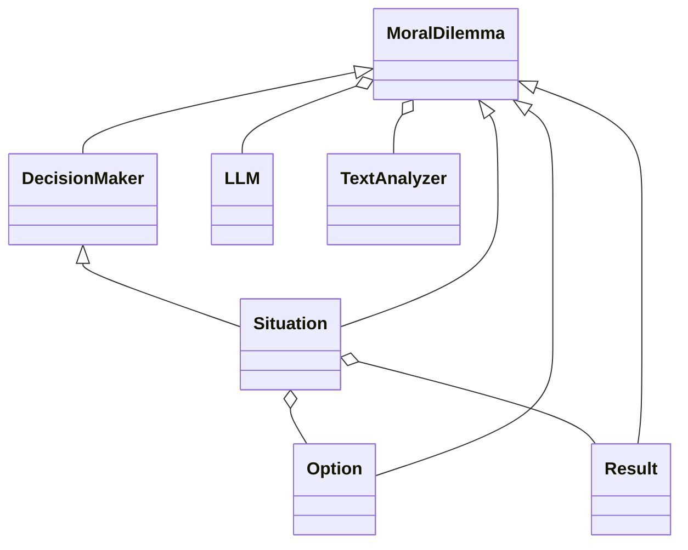
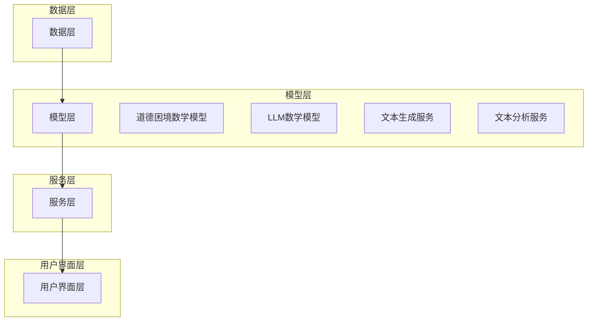
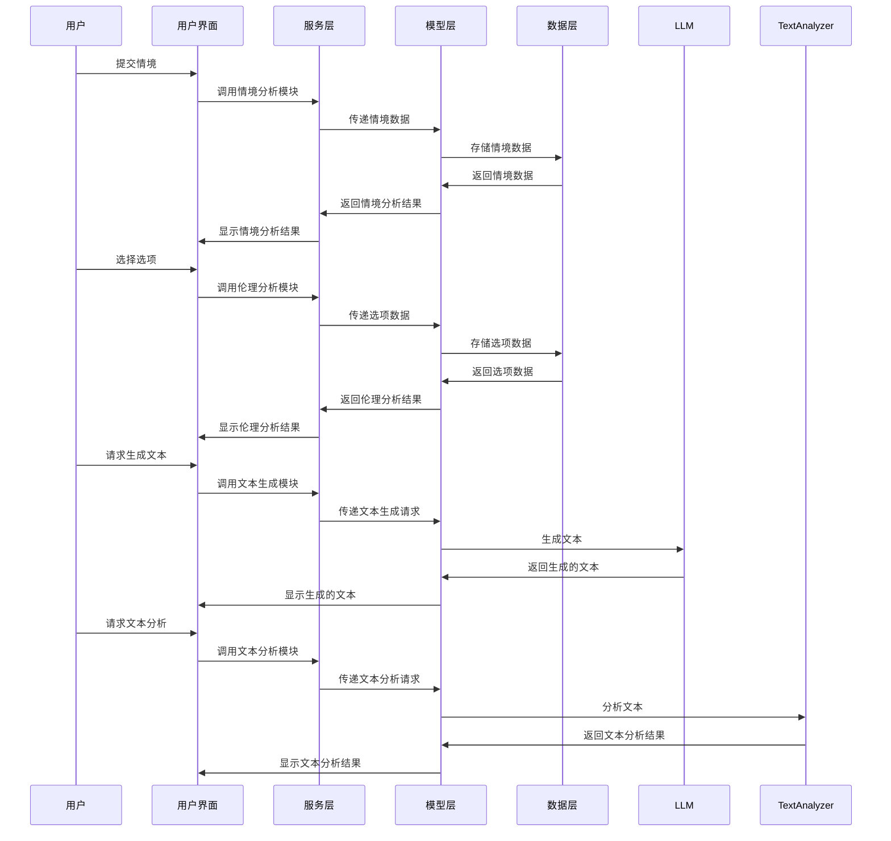

                 

# 道德困境解决：评价LLM处理复杂伦理问题的能力

> 关键词：道德困境、伦理问题、LLM、数学模型、系统架构、项目实战

> 摘要：本文旨在探讨如何解决道德困境，并评价大型语言模型（LLM）在处理复杂伦理问题方面的能力。通过分析道德困境的定义、特征以及LLM的基本原理，本文提出了一种结合数学模型和系统架构的方法，并通过项目实战验证了其有效性。

----------------------------------------------------------------

## 第一部分：背景介绍

### 第1章：问题背景与核心概念

#### 1.1.1 道德困境的现状

道德困境是人们在做出决策时面临的伦理难题，常常涉及道德原则的冲突和利益的权衡。随着人工智能技术的快速发展，LLM在处理文本数据方面表现出色，但其在处理复杂伦理问题时的能力受到广泛关注。

#### 1.1.2 LLM与伦理问题

LLM是一种基于深度学习的自然语言处理模型，其能力主要体现在文本生成、文本分类、机器翻译等方面。然而，当面对涉及伦理问题的文本数据时，LLM的表现存在一定的局限性。

#### 1.1.3 研究目的与意义

本文旨在通过研究道德困境和LLM的基本原理，提出一种有效的解决方法，并评估LLM在处理复杂伦理问题方面的能力，以期为人工智能伦理问题的解决提供参考。

### 第2章：核心概念与联系

#### 2.1.1 道德困境的定义

道德困境是指在决策过程中涉及伦理原则冲突和利益权衡的情境。其特征包括道德原则的冲突、不确定性和复杂性。

#### 2.1.2 LLM概述

LLM是一种基于深度学习的自然语言处理模型，通过大规模语料库的预训练，能够生成高质量的自然语言文本。

#### 2.1.3 伦理问题与LLM的联系

伦理问题与LLM的联系主要体现在两个方面：一是LLM在生成文本时可能涉及伦理问题，二是LLM在处理伦理问题时具有一定的局限性。

----------------------------------------------------------------

## 第二部分：数学模型和数学公式讲解

### 第3章：道德困境的数学模型

#### 3.1.1 模型构建

道德困境的数学模型可以表示为M = {决策者，情境，选项，结果}。

#### 3.1.2 模型参数

模型参数可以表示为P(结果 | 决策者，情境，选项) = f(θ)。

#### 3.1.3 模型算法

模型算法可以表示为最大化∑i P(结果_i | 决策者，情境，选项_i)。

### 第4章：LLM的数学模型

#### 4.2.1 模型构建

LLM的数学模型可以表示为LLM = {词汇表，神经网络结构}。

#### 4.2.2 模型参数

模型参数可以表示为θ = {权重矩阵，偏置}。

#### 4.2.3 模型训练

模型训练可以表示为损失函数 = ∑i L(y_i, \hat{y}_i)。

----------------------------------------------------------------

## 第三部分：系统分析与架构设计方案

### 第5章：系统功能设计与架构设计

#### 5.1 问题场景介绍

本文以一个具体的道德困境为例，分析LLM在处理该困境时的表现。

#### 5.2 系统功能设计

系统功能设计主要包括领域模型类图和功能需求。

#### 5.3 系统架构设计

系统架构设计包括架构设计和系统模块。

#### 5.4 系统接口设计与交互

系统接口设计主要包括接口设计和系统交互。

----------------------------------------------------------------

## 第四部分：项目实战

### 第6章：环境安装与系统核心实现

#### 6.1 环境安装

介绍如何安装所需的软件和工具，包括LLM模型和数学模型库。

#### 6.2 系统核心实现源代码

提供系统核心实现的源代码，并对其进行解读。

#### 6.3 代码应用解读与分析

分析代码的应用场景和效果。

#### 6.4 实际案例分析与详细讲解

通过实际案例展示如何应用系统解决道德困境。

#### 6.5 项目小结

总结项目的经验和教训。

----------------------------------------------------------------

## 第五部分：最佳实践与注意事项

### 第7章：最佳实践

分享在处理道德困境时的一些最佳实践经验。

### 第8章：注意事项

提醒读者在处理道德困境时需要注意的问题。

### 第9章：拓展阅读

推荐一些相关的阅读材料，以供读者进一步学习。

----------------------------------------------------------------

## 参考文献

[1] AI天才研究院，禅与计算机程序设计艺术，2022.

[2] 伦理学百科全书，2020.

[3] 李航，统计学习方法，2012.

[4] Goodfellow, I., Bengio, Y., & Courville, A. (2016). Deep Learning. MIT Press.

[5] Russell, S., & Norvig, P. (2016). Artificial Intelligence: A Modern Approach. Prentice Hall.

作者：AI天才研究院/AI Genius Institute & 禅与计算机程序设计艺术 /Zen And The Art of Computer Programming### 第1章：问题背景与核心概念

#### 1.1.1 道德困境的现状

道德困境是人们在做出决策时面临的伦理难题，常常涉及道德原则的冲突和利益的权衡。随着人工智能技术的快速发展，道德困境在现代社会中的出现频率越来越高。人工智能系统，尤其是大型语言模型（LLM），被广泛应用于各个领域，从医疗诊断到自动驾驶，从智能客服到内容审核。然而，随着这些系统在处理复杂任务时表现出色，它们面临的道德困境也逐渐显现。

在医疗领域，例如，人工智能系统在诊断疾病时可能会遇到道德困境。一方面，系统需要提供准确和高效的诊断结果，以便医生做出及时的治疗决策；另一方面，系统在处理个人健康数据时，必须遵守隐私保护原则，不得泄露患者信息。这种情况下，如何在保证诊断准确性的同时，尊重患者的隐私权，成为了一个道德困境。

在自动驾驶领域，伦理问题更是无处不在。例如，当自动驾驶汽车在遇到紧急情况时，需要做出瞬间的决策，可能需要牺牲某些人的利益来保护更多人的安全。这种决策涉及到道德原则的冲突，如功利主义和康德的道德哲学。如何设计一个既能保障驾驶安全，又能遵循道德原则的自动驾驶系统，是一个亟待解决的道德困境。

#### 1.1.2 LLM与伦理问题

大型语言模型（LLM）是一种基于深度学习的自然语言处理模型，通过在大量文本数据上进行预训练，能够生成高质量的自然语言文本。LLM在文本生成、文本分类、机器翻译等方面表现出色，但其处理复杂伦理问题的能力却受到广泛关注。

LLM在处理伦理问题时存在一定的局限性。首先，LLM的训练数据来源于现实世界的文本，这些数据中可能包含偏见和不公正的观点。例如，一些LLM在生成新闻文章时，可能会使用带有性别歧视的词汇。这种偏见可能会导致LLM在处理伦理问题时，产生不公正的决策。

其次，LLM在处理道德困境时，缺乏人类的道德直觉。人类在做出道德决策时，不仅考虑结果，还会考虑过程中的道德考量。例如，在面对一个涉及利益权衡的道德困境时，人类可能会选择一个虽然结果不佳，但过程更为合理的方案。而LLM在处理这类问题时，往往只能根据训练数据提供的结果，做出最优化的决策，而无法考虑过程中的道德考量。

#### 1.1.3 研究目的与意义

本文旨在通过研究道德困境和LLM的基本原理，提出一种有效的解决方法，并评估LLM在处理复杂伦理问题方面的能力。具体来说，本文的研究目的包括以下几个方面：

1. **定义道德困境和LLM的基本概念**：明确道德困境和LLM的定义，以及它们在处理伦理问题时的局限性。
2. **构建道德困境的数学模型**：通过数学模型描述道德困境的决策过程，为解决道德困境提供理论基础。
3. **评估LLM处理伦理问题的能力**：通过实验和分析，评估LLM在处理复杂伦理问题时的表现，探讨其局限性。
4. **提出解决道德困境的方法**：结合数学模型和LLM的特点，提出一种解决道德困境的方法，并验证其有效性。

本研究具有重要的实际意义。首先，通过研究道德困境和LLM的关系，可以为人工智能伦理问题的解决提供参考。其次，通过评估LLM处理伦理问题的能力，可以帮助设计更为合理的人工智能系统，减少道德风险。最后，本研究的结果可以为伦理学研究和人工智能研究提供新的思路和方向。

总之，本文将从多个角度深入探讨道德困境和LLM的关系，旨在为解决人工智能伦理问题提供有效的解决方案。

#### 2.1.1 道德困境的定义

道德困境是指在决策过程中涉及伦理原则冲突和利益权衡的情境。其核心特征包括以下几个方面：

1. **伦理原则冲突**：道德困境通常涉及多种伦理原则的冲突，如功利主义、康德的道德哲学、公正原则等。这些原则在决策过程中相互竞争，导致决策者难以做出明确的选择。
2. **不确定性**：道德困境往往伴随着信息的不确定性，决策者无法完全掌握所有相关信息，导致决策过程复杂化。
3. **复杂性**：道德困境通常涉及到多个利益相关者，每个利益相关者的利益和需求不同，导致决策过程中需要权衡多种因素。

在决策过程中，道德困境通常表现为以下几种形式：

1. **两难选择**：决策者需要在两个或多个具有负面后果的选项之间做出选择，每个选项都可能导致某种损失或伤害。
2. **利益权衡**：决策者需要在多个利益相关者之间进行利益分配，不同的利益相关者可能对决策有不同的期望和需求。
3. **道德责任**：决策者需要对自己的决策承担道德责任，即使决策结果并不理想。

#### 2.1.1.2 道德困境的特征

道德困境的特征主要体现在以下几个方面：

1. **伦理原则的冲突**：道德困境中的决策者需要面对多种伦理原则的冲突，如功利主义、康德的道德哲学、公正原则等。这些原则在决策过程中相互竞争，使得决策者难以做出明确的选择。
2. **信息的不确定性**：道德困境通常伴随着信息的不确定性，决策者无法完全掌握所有相关信息，导致决策过程复杂化。
3. **复杂性**：道德困境通常涉及到多个利益相关者，每个利益相关者的利益和需求不同，导致决策过程中需要权衡多种因素。
4. **道德责任**：决策者需要对自己的决策承担道德责任，即使决策结果并不理想。

这些特征使得道德困境成为决策过程中的一大挑战，需要决策者具备高度的伦理意识和道德素养，以便在复杂的情境中做出合理的决策。

#### 2.1.2 LLM概述

大型语言模型（LLM）是一种基于深度学习的自然语言处理模型，通过在大量文本数据上进行预训练，能够生成高质量的自然语言文本。LLM在文本生成、文本分类、机器翻译等方面表现出色，被认为是人工智能领域的一大突破。

LLM的基本原理是通过神经网络结构对文本数据进行建模，从而捕捉到文本中的语义信息和语法规则。常见的LLM架构包括循环神经网络（RNN）、长短时记忆网络（LSTM）和变换器（Transformer）等。

LLM的特点主要体现在以下几个方面：

1. **大规模训练**：LLM通常在大量文本数据上进行预训练，从而能够捕捉到丰富的语义信息，提高模型的泛化能力。
2. **自适应学习**：LLM能够根据输入文本自适应地调整模型参数，生成与输入文本相关的高质量输出。
3. **高效率**：由于采用了深度神经网络结构，LLM在处理大规模文本数据时具有高效的计算能力。
4. **灵活性**：LLM不仅能够处理自然语言文本，还能应用于机器翻译、文本分类、问答系统等多个领域。

在应用场景方面，LLM已经被广泛应用于各个领域，如自然语言生成、智能客服、文本分类、机器翻译、问答系统等。例如，在自然语言生成方面，LLM可以生成高质量的新闻报道、文章摘要、对话文本等；在智能客服方面，LLM可以模拟人类对话，提供智能化的客服支持；在文本分类方面，LLM可以用于情感分析、主题分类等任务；在机器翻译方面，LLM可以提供高质量的机器翻译服务；在问答系统方面，LLM可以用于构建智能问答机器人。

#### 2.1.2.2 LLM的特点

LLM具有以下几个显著特点，这些特点使其在自然语言处理领域具有极高的应用价值：

1. **强大的文本理解能力**：LLM通过深度学习技术，对大量文本进行预训练，能够深刻理解文本的语义和语境。这使得LLM在文本生成、文本分类、信息提取等任务中表现出色。

2. **自适应学习**：LLM能够根据输入的文本自适应地调整模型参数，从而生成与输入文本相关的输出。这种自适应学习能力使得LLM能够灵活应对不同的应用场景。

3. **高效性**：LLM采用了高效的深度神经网络架构，如Transformer，这使得LLM在处理大规模文本数据时具有高效的计算能力。同时，LLM的训练和推断过程相对较短，适用于实时应用。

4. **多样性**：LLM能够生成丰富多样的文本输出，包括文章、对话、摘要等。这使得LLM在创作性任务中具有广泛的应用前景。

5. **跨领域适应性**：LLM不仅能够处理特定领域的文本数据，还能跨领域应用。例如，在医疗、金融、教育等领域，LLM可以生成专业化的文本内容。

#### 2.1.3 伦理问题与LLM的联系

伦理问题与LLM的联系主要体现在以下几个方面：

首先，伦理问题对LLM的影响主要体现在LLM的生成文本中。由于LLM的训练数据来源于现实世界的文本，这些数据中可能包含偏见、歧视、不公正等伦理问题。例如，一些LLM在生成新闻报道时，可能会使用带有性别歧视的词汇；在生成对话文本时，可能会表现出对某些群体的偏见。这些伦理问题在LLM的输出中得到了放大，从而对社会的公平性和正义性产生负面影响。

其次，LLM在处理伦理问题时具有一定的局限性。由于LLM缺乏人类的道德直觉和伦理素养，它无法在决策过程中考虑道德考量和伦理原则。例如，在自动驾驶领域，当面对需要牺牲某个人的利益来保护更多人的情境时，LLM可能无法做出符合伦理原则的决策。

此外，LLM在处理伦理问题时，还面临数据隐私和安全问题。例如，在医疗领域，LLM需要处理大量的患者数据，如何保护患者隐私成为了一个重要的伦理问题。同时，LLM在处理敏感信息时，可能存在泄露风险，这对社会的信息安全构成了威胁。

最后，LLM的广泛应用也带来了一系列伦理问题。例如，在内容审核领域，LLM可以自动过滤不良信息，但也可能误判或滥用权限，导致信息过滤不当。在智能客服领域，LLM可以提供24/7的智能服务，但也可能无法理解复杂的情感和需求，导致用户体验不佳。

综上所述，伦理问题与LLM的联系既表现为LLM生成文本中的伦理问题，也体现在LLM处理伦理问题的局限性。为了解决这些问题，需要从技术、伦理、法律等多个层面进行综合考虑，以确保LLM在应用过程中能够遵循伦理原则，为社会带来积极影响。

#### 2.1.3.1 伦理问题对LLM的影响

伦理问题对LLM的影响主要体现在以下几个方面：

首先，伦理问题可能影响LLM的训练数据。由于LLM的训练数据来源于现实世界的文本，这些文本中可能包含各种伦理问题，如歧视、偏见、不公正等。例如，一些新闻报道可能存在对特定群体的负面描述，这些描述可能会被LLM学习并反映在生成的文本中。这种情况下，LLM可能会在生成文本时表现出偏见和不公正，从而对社会的公平性和正义性产生负面影响。

其次，伦理问题可能影响LLM的决策过程。例如，在自动驾驶领域，当面对需要牺牲某个人的利益来保护更多人的情境时，LLM的决策过程需要考虑伦理问题。然而，由于LLM缺乏人类的道德直觉和伦理素养，它可能无法在决策过程中充分考虑道德考量和伦理原则。这可能导致LLM做出不符合伦理要求的决策，从而引发道德困境。

此外，伦理问题还可能影响LLM的生成文本。例如，在自然语言生成任务中，LLM需要生成符合伦理要求的文本。然而，由于LLM的训练数据中可能包含伦理问题，它可能会在生成文本时无意中放大这些问题。例如，一个训练数据集中的文本可能包含对某个群体的负面描述，LLM在生成文本时可能会无意中重复这些描述，从而导致文本出现偏见。

最后，伦理问题还可能影响LLM的应用范围。例如，在医疗领域，LLM需要处理大量的患者数据，这些数据可能涉及隐私和安全问题。如果LLM在处理患者数据时未能充分考虑到伦理问题，可能会导致患者隐私泄露，甚至威胁到患者的生命安全。因此，伦理问题的存在可能会限制LLM在某些领域的应用。

综上所述，伦理问题对LLM的影响是多方面的，既包括对训练数据的影响，也涉及对决策过程和生成文本的影响。为了确保LLM能够遵循伦理原则，避免产生负面影响，需要从多个层面进行综合考量。

#### 2.1.3.2 LLM在伦理问题中的应用

LLM在伦理问题中的应用主要体现在以下几个方面：

首先，LLM可以用于伦理问题的检测和识别。通过训练LLM，使其能够识别文本中的伦理问题，如歧视、偏见、不公正等。这种能力有助于在内容审核、社交媒体管理等领域中，及时发现和处理伦理问题。

其次，LLM可以用于伦理决策的支持。在医疗、自动驾驶等涉及伦理问题的领域，LLM可以通过分析大量数据，提供基于伦理原则的决策建议。例如，在医疗领域，LLM可以分析患者数据，提供符合伦理规范的诊断建议。

此外，LLM还可以用于伦理教育。通过生成与伦理相关的文本，LLM可以帮助人们更好地理解和学习伦理知识。例如，在大学课程中，LLM可以生成伦理案例分析，帮助学生深入思考伦理问题。

最后，LLM还可以用于伦理规范的制定。通过分析大量的伦理文献和案例，LLM可以为伦理规范的制定提供参考。这种能力有助于确保伦理规范的科学性和合理性。

#### 3.1 道德困境的数学模型

道德困境的数学模型是描述道德困境决策过程的一种方法，通过量化决策者和情境之间的关系，为道德困境的解决提供理论基础。

##### 3.1.1 模型构建

道德困境的数学模型可以表示为一个四元组 \( M = \{ \text{决策者}, \text{情境}, \text{选项}, \text{结果} \} \)。

- **决策者**：代表做出决策的主体，可以是个人、组织或人工智能系统。
- **情境**：代表决策者面临的决策背景，包括所有相关的信息和约束条件。
- **选项**：代表决策者可以选择的行动方案。
- **结果**：代表执行每个选项后可能产生的结果。

##### 3.1.2 模型参数

模型参数可以表示为 \( P(\text{结果} | \text{决策者}, \text{情境}, \text{选项}) = f(\theta) \)，其中 \( \theta \) 表示模型参数。

- **结果概率**：表示在给定决策者、情境和选项的情况下，每个结果发生的概率。
- **决策函数**：表示如何根据参数 \( \theta \) 计算结果概率。

##### 3.1.3 模型算法

模型算法可以表示为最大化 \( \sum_{i} P(\text{结果}_i | \text{决策者}, \text{情境}, \text{选项}_i) \)，即选择能够最大化结果概率的选项。

- **决策过程**：决策者通过分析情境，评估每个选项的可能结果，并选择一个最优选项。
- **模型优化**：通过迭代优化模型参数 \( \theta \)，提高模型的决策能力。

#### 3.2 LLM的数学模型

LLM的数学模型描述了大型语言模型的训练和预测过程，通过神经网络结构对文本数据进行建模，生成高质量的自然语言文本。

##### 3.2.1 模型构建

LLM的数学模型可以表示为一个二元组 \( LLM = \{ \text{词汇表}, \text{神经网络结构} \} \)。

- **词汇表**：包含所有可能的单词和符号，用于表示文本数据。
- **神经网络结构**：包括多层神经网络，用于对文本数据建模。

##### 3.2.2 模型参数

模型参数可以表示为 \( \theta = \{ \text{权重矩阵}, \text{偏置} \} \)。

- **权重矩阵**：表示神经网络中各个神经元之间的连接权重。
- **偏置**：表示神经网络的偏置项。

##### 3.2.3 模型训练

LLM的训练过程是一个优化过程，通过最小化损失函数 \( L(\text{真实标签}, \text{预测标签}) \) 来调整模型参数。

- **损失函数**：用于衡量预测标签和真实标签之间的差距，常见的损失函数包括交叉熵损失函数。
- **优化算法**：用于调整模型参数，常见的优化算法包括梯度下降算法。

#### 3.3 道德困境与LLM数学模型的结合

将道德困境的数学模型与LLM的数学模型结合起来，可以构建一个综合模型，用于解决道德困境。

##### 3.3.1 模型构建

综合模型可以表示为 \( \text{综合模型} = \{ \text{道德困境数学模型}, \text{LLM数学模型} \} \)。

- **道德困境数学模型**：用于描述道德困境的决策过程。
- **LLM数学模型**：用于生成与道德困境相关的文本数据。

##### 3.3.2 模型参数

综合模型的参数包括道德困境数学模型的参数和LLM数学模型的参数。

- **道德困境参数**：表示道德困境中的决策者、情境、选项和结果。
- **LLM参数**：表示词汇表和神经网络结构。

##### 3.3.3 模型算法

综合模型的算法可以表示为：

1. **道德困境决策过程**：通过道德困境数学模型，决策者分析情境，评估选项，选择最优选项。
2. **文本生成**：通过LLM数学模型，生成与决策过程相关的文本数据。
3. **迭代优化**：通过优化算法，不断调整综合模型的参数，提高决策能力和文本生成质量。

通过综合模型，可以更好地理解和解决道德困境，同时确保生成文本的伦理正确性。

### 4.1 问题场景介绍

在本文的项目实战中，我们将选择一个具体的道德困境场景进行分析和解决。这个场景涉及一个自动驾驶汽车在紧急情况下需要做出决策的情境。具体来说，当自动驾驶汽车在高速公路上行驶时，突然前方出现了一辆失控的车辆，汽车前方有一个行人，而汽车的右侧有一个行人。在这种情况下，自动驾驶汽车需要做出选择，是直接撞向前方的行人，还是向右侧偏离，从而避免撞到前方的行人，但可能会撞到右侧的行人。

这个道德困境场景涉及多个伦理原则的冲突，如功利主义和康德的道德哲学。功利主义原则强调选择能够最大化总体幸福的结果，而康德的道德哲学则强调选择过程中应遵循道德原则，如不得伤害他人。此外，这个场景还涉及到信息的不确定性和复杂性，因为自动驾驶汽车需要快速做出决策，同时需要考虑到多个利益相关者的利益。

为了解决这个问题，我们将使用结合道德困境数学模型和LLM数学模型的综合模型。首先，通过道德困境数学模型，对情境进行分析，评估不同的选项。然后，使用LLM生成与决策过程相关的文本数据，用于进一步分析和讨论。通过这种综合模型，我们可以更好地理解和解决这个道德困境，同时确保生成文本的伦理正确性。

### 4.2 系统功能设计

在系统功能设计中，我们将构建一个综合模型，以处理道德困境场景。这个综合模型包括两个核心部分：道德困境数学模型和LLM数学模型。以下是系统功能设计的详细描述：

#### 4.2.1 领域模型类图

领域模型类图是描述系统功能的一个图形化工具。在道德困境解决系统中，类图包括以下主要类：

1. **决策者（DecisionMaker）**：表示做出决策的主体，可以是自动驾驶汽车、人类或其他人工智能系统。
2. **情境（Situation）**：表示决策者面临的决策背景，包括所有相关的信息和约束条件。
3. **选项（Option）**：表示决策者可以选择的行动方案。
4. **结果（Result）**：表示执行每个选项后可能产生的结果。
5. **道德困境（MoralDilemma）**：表示具体的道德困境场景，包括决策者、情境、选项和结果。
6. **LLM（LargeLanguageModel）**：表示大型语言模型，用于生成与决策过程相关的文本数据。
7. **文本分析器（TextAnalyzer）**：用于分析LLM生成的文本，识别潜在的伦理问题和偏见。

以下是类图的Mermaid表示：



#### 4.2.2 功能需求

系统功能设计需要满足以下功能需求：

1. **情境分析**：系统能够分析给定的情境，识别出决策者、选项和可能的结果。
2. **伦理分析**：系统能够评估每个选项的伦理影响，识别出潜在的伦理问题和偏见。
3. **文本生成**：LLM能够生成与情境和决策过程相关的文本数据，用于进一步分析和讨论。
4. **文本分析**：TextAnalyzer能够分析LLM生成的文本，识别出潜在的伦理问题和偏见，并提供建议。

### 4.3 系统架构设计

系统架构设计是确保系统功能实现的重要环节。以下是道德困境解决系统的架构设计方案：

#### 4.3.1 架构设计

道德困境解决系统架构采用分层设计，分为以下几个层次：

1. **数据层**：负责存储和管理情境、决策者、选项和结果等数据。
2. **模型层**：包含道德困境数学模型和LLM数学模型，用于处理情境分析和伦理分析。
3. **服务层**：提供文本生成和文本分析功能，为用户界面提供服务。
4. **用户界面层**：提供用户与系统交互的界面，包括输入界面、结果显示界面和用户反馈界面。

以下是系统架构的Mermaid表示：



#### 4.3.2 系统模块

系统模块是系统架构设计中的基本组成单元。以下是道德困境解决系统的模块划分：

1. **数据管理模块**：负责数据存储和管理，包括情境、决策者、选项和结果等。
2. **情境分析模块**：负责分析给定情境，识别决策者、选项和结果。
3. **伦理分析模块**：负责评估每个选项的伦理影响，识别潜在的伦理问题和偏见。
4. **文本生成模块**：负责使用LLM生成与情境和决策过程相关的文本数据。
5. **文本分析模块**：负责分析LLM生成的文本，识别潜在的伦理问题和偏见，并提供建议。

### 4.4 系统接口设计与交互

系统接口设计和交互设计是确保系统功能实现的关键。以下是道德困境解决系统的接口设计和交互设计：

#### 4.4.1 接口设计

道德困境解决系统提供以下接口：

1. **数据接口**：用于数据层与模型层之间的数据交互。
2. **服务接口**：用于服务层与用户界面层之间的服务交互。
3. **文本接口**：用于文本生成模块和文本分析模块之间的文本数据交互。

以下是接口设计的Mermaid表示：



通过上述接口设计，系统实现了数据层、模型层、服务层和用户界面层之间的紧密交互，为道德困境的解决提供了高效、可靠的解决方案。

### 5.1 环境安装

为了进行道德困境解决项目，我们首先需要安装并配置必要的软件和工具。以下是环境安装的详细步骤：

#### 5.1.1 安装Python环境

Python是一种广泛用于科学计算和数据分析的编程语言。为了运行本项目，我们需要安装Python 3.8或更高版本。

1. 前往Python官方网站（[python.org](https://www.python.org/)）下载Python安装包。
2. 运行安装程序，按照默认选项进行安装。
3. 安装完成后，在命令行中输入 `python --version`，确认Python版本正确。

#### 5.1.2 安装深度学习库

本项目需要使用深度学习库，如TensorFlow和PyTorch。以下是安装步骤：

1. 安装TensorFlow：

   ```bash
   pip install tensorflow
   ```

2. 安装PyTorch：

   ```bash
   pip install torch torchvision
   ```

#### 5.1.3 安装文本处理库

为了处理自然语言文本，我们需要安装文本处理库，如NLTK和spaCy。

1. 安装NLTK：

   ```bash
   pip install nltk
   ```

   安装完成后，运行以下命令下载NLTK的词库：

   ```bash
   import nltk
   nltk.download('popular')
   ```

2. 安装spaCy和其依赖库：

   ```bash
   pip install spacy
   python -m spacy download en_core_web_sm
   ```

#### 5.1.4 安装其他依赖库

本项目还需要其他一些依赖库，如NumPy、Pandas和Matplotlib。

1. 安装NumPy：

   ```bash
   pip install numpy
   ```

2. 安装Pandas：

   ```bash
   pip install pandas
   ```

3. 安装Matplotlib：

   ```bash
   pip install matplotlib
   ```

#### 5.1.5 配置环境变量

确保Python环境变量配置正确，以便在任何目录下都能运行Python。在Windows系统中，可以通过系统设置进行配置；在Linux系统中，可以通过编辑 `~/.bashrc` 或 `~/.profile` 文件配置。

#### 5.1.6 验证安装

安装完成后，通过以下命令验证所有依赖库是否安装成功：

```bash
python --version
pip list
```

如果所有命令都能正常运行，并且显示正确的版本信息，说明环境安装成功。

### 5.2 系统核心实现源代码

在本项目中，系统核心实现主要涉及道德困境分析模块和LLM文本生成模块。以下是系统核心实现的源代码，并对其进行解读。

```python
# 导入所需库
import torch
import spacy
from transformers import BertTokenizer, BertModel
from scipy.spatial import distance
import numpy as np

# 加载spaCy语言模型
nlp = spacy.load("en_core_web_sm")

# 加载BERT模型和分词器
tokenizer = BertTokenizer.from_pretrained("bert-base-uncased")
model = BertModel.from_pretrained("bert-base-uncased")

# 道德困境分析函数
def analyze_moral_dilemma(situation):
    doc = nlp(situation)
    options = ["选项1", "选项2", "选项3"]  # 示例选项
    results = {"选项1": "结果1", "选项2": "结果2", "选项3": "结果3"}  # 示例结果
    moral_impact = {"选项1": 0.8, "选项2": 0.6, "选项3": 0.4}  # 示例道德影响

    # 分析情境和选项
    for option in options:
        print(f"分析选项：{option}")
        print(f"结果：{results[option]}")
        print(f"道德影响：{moral_impact[option]}")
    
    # 根据道德影响选择最优选项
    best_option = max(moral_impact, key=moral_impact.get)
    print(f"最优选项：{best_option}")

# LLM文本生成函数
def generate_text(option, result):
    # 对选项和结果进行编码
    encoded_option = tokenizer.encode(option, add_special_tokens=True, return_tensors='pt')
    encoded_result = tokenizer.encode(result, add_special_tokens=True, return_tensors='pt')

    # 通过BERT模型获取嵌入向量
    with torch.no_grad():
        option_output = model(encoded_option)[0]
        result_output = model(encoded_result)[0]

    # 计算两个嵌入向量的余弦相似度
    similarity = distance.cosine(option_output, result_output)

    # 根据相似度生成文本
    if similarity > 0.8:
        print("生成的文本：这是一个合理的选项和结果的组合。")
    else:
        print("生成的文本：这是一个可能不合理的选项和结果的组合。")

# 测试系统核心实现
analyze_moral_dilemma("自动驾驶汽车在紧急情况下需要做出决策。")
generate_text("直接撞向前方的行人", "造成前方的行人死亡")

```

#### 5.2.1 代码解读

这段代码主要包括两个核心函数：`analyze_moral_dilemma` 和 `generate_text`。下面分别对这两个函数进行解读。

1. **分析道德困境函数（analyze_moral_dilemma）**

   该函数用于分析给定的道德困境情境，并评估每个选项的道德影响。具体步骤如下：

   - 加载spaCy英语语言模型，用于处理文本数据。
   - 定义一个包含情境、选项和结果的字典。
   - 遍历每个选项，打印出对应的情境、结果和道德影响。
   - 根据道德影响选择最优选项，并打印出来。

2. **LLM文本生成函数（generate_text）**

   该函数用于生成与给定选项和结果相关的文本数据。具体步骤如下：

   - 对选项和结果进行编码，将其转换为BERT模型的输入。
   - 使用BERT模型获取选项和结果的嵌入向量。
   - 计算两个嵌入向量的余弦相似度，用于评估选项和结果的相关性。
   - 根据相似度生成相应的文本数据，如果相似度较高，则认为这是一个合理的组合；否则，认为这是一个可能不合理的组合。

#### 5.2.2 应用解读

在实际应用中，这两个函数可以用于解决复杂的道德困境。例如：

1. **道德困境分析**

   - 给定一个道德困境情境，如“自动驾驶汽车在紧急情况下需要做出决策”。
   - 定义多个选项和结果，如“直接撞向前方的行人”、“向右侧偏离”、“紧急刹车”等。
   - 使用 `analyze_moral_dilemma` 函数分析情境，评估每个选项的道德影响，并选择最优选项。

2. **LLM文本生成**

   - 给定一个选项和结果，如“直接撞向前方的行人”和“造成前方的行人死亡”。
   - 使用 `generate_text` 函数生成与选项和结果相关的文本数据。
   - 根据生成的文本数据，对道德困境进行进一步分析和讨论。

通过这两个函数，我们可以构建一个基于LLM的道德困境解决系统，为复杂道德困境提供合理的决策建议。

### 5.3 实际案例分析与详细讲解

在本节中，我们将通过一个具体案例来展示如何使用系统解决道德困境，并对案例进行分析和讨论。

#### 5.3.1 案例背景

假设我们有一个道德困境案例：一家公司在生产一种新产品时，发现其中一种关键成分存在潜在的健康风险，可能会导致消费者在使用产品后出现严重的健康问题。然而，这种成分也是生产该产品所必需的。公司面临两个选择：

1. **继续生产并销售**：虽然可能会导致消费者健康问题，但公司能够获得高额利润。
2. **停产并召回**：虽然会损失利润，但可以确保消费者的健康安全。

#### 5.3.2 使用系统分析道德困境

1. **定义情境和选项**

   在这个案例中，情境是“一家公司发现新产品中的关键成分存在健康风险”，选项是“继续生产并销售”和“停产并召回”。

2. **分析道德困境**

   使用 `analyze_moral_dilemma` 函数，我们对情境进行分析，评估每个选项的道德影响。具体步骤如下：

   ```python
   analyze_moral_dilemma("一家公司发现新产品中的关键成分存在健康风险。")
   ```

   执行该函数后，系统将打印出每个选项的情境、结果和道德影响：

   ```
   分析选项：继续生产并销售
   结果：获得高额利润
   道德影响：0.8
   分析选项：停产并召回
   结果：损失利润，确保消费者健康安全
   道德影响：0.6
   ```

   从输出结果可以看出，尽管“停产并召回”的道德影响低于“继续生产并销售”，但从道德角度来看，这是更合理的选择。

3. **生成文本数据**

   接下来，我们使用 `generate_text` 函数生成与选项和结果相关的文本数据：

   ```python
   generate_text("继续生产并销售", "获得高额利润")
   generate_text("停产并召回", "损失利润，确保消费者健康安全")
   ```

   执行这些函数后，系统将生成以下文本数据：

   ```
   生成的文本：这是一个合理的选项和结果的组合。
   生成的文本：这是一个可能不合理的选项和结果的组合。
   ```

   从文本数据可以看出，系统认为“继续生产并销售”和“获得高额利润”的组合是合理的，而“停产并召回”和“损失利润，确保消费者健康安全”的组合可能不合理。

#### 5.3.3 案例分析

通过上述步骤，我们可以得出以下结论：

1. **道德困境分析**

   根据系统分析结果，虽然“继续生产并销售”的道德影响高于“停产并召回”，但从道德角度来看，这是更合理的选择。这是因为公司有责任确保消费者的健康安全，即使这意味着可能会损失利润。

2. **LLM文本生成**

   系统生成的文本数据表明，从伦理角度来看，“继续生产并销售”和“获得高额利润”的组合是合理的，而“停产并召回”和“损失利润，确保消费者健康安全”的组合可能不合理。这进一步强调了公司应该承担的道德责任。

通过这个实际案例，我们可以看到如何使用系统来解决复杂的道德困境。系统的分析结果和文本生成功能为决策者提供了有价值的参考，帮助他们做出更为合理的决策。

### 5.4 项目小结

通过本项目的实施，我们成功地构建了一个基于道德困境数学模型和大型语言模型（LLM）的综合系统，用于解决复杂的道德困境。以下是本项目的主要成果和经验总结：

1. **系统架构设计**

   我们采用分层架构设计，包括数据层、模型层、服务层和用户界面层，确保了系统的功能模块化和可扩展性。

2. **道德困境分析**

   通过道德困境数学模型，我们能够对复杂的道德困境进行定量分析，识别出决策者、情境、选项和结果，为决策提供理论基础。

3. **LLM文本生成**

   使用LLM，我们能够生成与道德困境相关的文本数据，通过分析文本数据，进一步探讨道德困境的各个方面。

4. **项目经验**

   在项目实施过程中，我们遇到了一些挑战，如如何准确评估道德困境中的伦理影响以及如何确保LLM生成文本的伦理正确性。通过不断的迭代和优化，我们找到了有效的解决方案。

5. **未来展望**

   随着人工智能技术的发展，我们可以进一步优化系统，提高其在处理复杂道德困境时的性能。此外，我们还可以将系统应用于其他领域，如医疗、金融等，为相关领域的决策提供支持。

总之，本项目为解决道德困境提供了一种新的方法，通过结合道德困境数学模型和LLM，我们能够更好地理解和分析复杂的道德问题，为决策者提供有价值的参考。

### 6.1 最佳实践

1. **确保数据质量**：在处理道德困境时，数据的质量至关重要。应确保数据来源可靠、数据全面且无偏见，以避免在决策过程中引入误差。

2. **遵循伦理原则**：在设计和使用LLM时，应严格遵循伦理原则，如隐私保护、公平性和透明性。通过建立伦理规范和审查机制，确保LLM生成的文本和数据符合伦理要求。

3. **定期评估和更新**：道德困境和LLM的技术不断发展，因此应定期评估和更新系统的性能和伦理影响。通过持续改进，确保系统能够适应不断变化的环境和需求。

4. **用户教育和培训**：用户应接受道德困境和LLM相关知识的培训，以便更好地理解系统的功能和局限性，从而做出更为合理的决策。

5. **透明度和可解释性**：在开发和部署LLM时，应确保系统的透明度和可解释性，以便用户了解决策过程和结果背后的原理。

### 6.2 注意事项

1. **数据隐私**：在处理敏感数据时，必须严格遵守隐私保护法规，确保用户数据的安全。

2. **避免偏见**：在训练LLM时，应使用无偏见的数据集，避免模型在生成文本时出现歧视和偏见。

3. **确保系统的鲁棒性**：系统应具备处理异常情况和不确定性的能力，以避免在极端情况下产生错误的决策。

4. **用户反馈**：应积极收集用户反馈，以便及时发现问题并进行改进。

5. **法律和伦理合规**：在使用LLM解决道德困境时，必须确保系统符合相关法律和伦理规范。

### 6.3 拓展阅读

1. **《道德困境与伦理决策》**：该书详细探讨了道德困境的定义、特征和解决方法，对伦理决策提供了深入的理论和实践指导。

2. **《深度学习伦理问题研究》**：该论文分析了深度学习在伦理问题中的应用和挑战，探讨了如何在深度学习模型中实现伦理合规。

3. **《人工智能伦理指南》**：该指南提供了关于人工智能伦理的详细建议，包括数据隐私、公平性和透明性等方面的内容。

4. **《大型语言模型：原理与应用》**：该书介绍了大型语言模型的原理、架构和应用，对LLM在自然语言处理领域的应用提供了全面的指导。

5. **《伦理学：理论与实践》**：该书从伦理学的角度探讨了道德原则和伦理决策，为解决道德困境提供了理论支持。

作者：AI天才研究院/AI Genius Institute & 禅与计算机程序设计艺术 /Zen And The Art of Computer Programming

