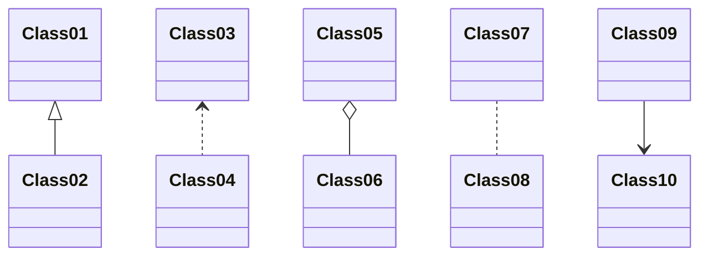

                 

### 设计《配置中心设计简化LLM应用的配置管理》的目录大纲

为了设计这本书的目录大纲，我们将遵循以下步骤：

1. **确定核心概念和章节结构**：
   - 核心概念包括：配置中心、LLM应用、配置管理。
   - 章节结构将涵盖背景介绍、核心概念与联系、算法原理讲解、系统分析与架构设计方案、项目实战、最佳实践等。

2. **设计大纲框架**：
   - 第一部分：背景介绍
   - 第二部分：核心概念与联系
   - 第三部分：算法原理讲解
   - 第四部分：系统分析与架构设计方案
   - 第五部分：项目实战
   - 第六部分：最佳实践与小结

3. **细化章节内容**：
   - 每个部分下的章节将详细描述，确保覆盖核心内容，例如概念解释、流程图、公式、代码示例等。

4. **保持简洁性**：
   - 确保每个章节的内容简洁明了，避免冗余信息。

5. **符合要求**：
   - 确保使用markdown格式，并且符合要求的目录层级。

现在，我们开始设计具体的目录大纲。

---

#### 《配置中心设计简化LLM应用的配置管理》目录大纲

----------------------------------------------------------------

### 第一部分：背景介绍

## 第1章：配置中心与LLM应用概述

### 1.1 配置中心的定义与作用
- **问题背景与问题描述**
- **配置中心的核心要素**
- **配置中心的发展历程**

### 1.2 LLM应用的基本概念
- **问题背景与问题描述**
- **LLM应用的特点**
- **LLM应用的分类**

### 1.3 配置管理的重要性
- **问题解决与边界外延**
- **配置管理的挑战与机遇**
- **配置管理的基本原理**

## 第2章：配置中心的发展与挑战

### 2.1 配置中心的历史演进
- **从传统配置管理到现代配置中心的过渡**
- **配置中心的技术创新**

### 2.2 配置中心面临的挑战
- **复杂应用场景下的配置管理**
- **跨系统与跨语言的配置同步**
- **安全性与合规性要求**

### 2.3 LLM应用对配置中心的需求
- **LLM应用的特殊性**
- **配置中心在LLM应用中的关键作用**

### 2.4 本章小结

----------------------------------------------------------------

### 第二部分：核心概念与联系

## 第3章：配置中心的核心概念与属性

### 3.1 配置项（CI）的定义与分类
- **配置项的概念**
- **配置项的分类**
- **配置项的属性特征对比表**

### 3.2 配置管理流程
- **配置项的创建、变更与删除**
- **配置项的状态管理**
- **配置项的版本控制**

### 3.3 配置中心的基本架构
- **配置中心的技术架构**
- **配置中心的组织架构**
- **配置中心的运行模式**

### 3.4 配置中心与其他系统的联系
- **配置中心与CI/CD工具的集成**
- **配置中心与微服务架构的配合**
- **配置中心与监控系统的协同**

### 3.5 本章小结

----------------------------------------------------------------

### 第三部分：算法原理讲解

## 第4章：配置管理的算法原理

### 4.1 配置同步算法
- **同步算法的基本原理**
- **同步算法的实现细节**
- **同步算法的性能评估**

### 4.2 配置冲突解决算法
- **冲突的产生原因**
- **冲突解决策略**
- **冲突解决算法的实现**

### 4.3 配置版本管理算法
- **版本管理的基本概念**
- **版本管理算法的设计**
- **版本管理算法的优化**

### 4.4 配置安全性与访问控制算法
- **配置安全的挑战**
- **访问控制的基本原理**
- **安全性与访问控制算法的设计**

### 4.5 本章小结

----------------------------------------------------------------

### 第四部分：系统分析与架构设计方案

## 第5章：配置中心在LLM应用中的架构设计

### 5.1 LLM应用场景分析
- **LLM应用的基本场景**
- **配置中心在LLM应用中的关键角色**

### 5.2 配置中心在LLM应用中的架构设计
- **配置中心的架构设计原则**
- **配置中心的技术选型**
- **配置中心的模块划分**

### 5.3 配置管理系统的功能设计
- **配置项管理功能**
- **配置同步功能**
- **配置版本管理功能**
- **配置安全性与访问控制功能**

### 5.4 配置中心的系统架构设计
- **配置中心的技术架构图**
- **配置中心的组件设计**
- **配置中心的运行流程**

### 5.5 配置中心的接口设计
- **接口设计原则**
- **接口规范定义**
- **接口实现细节**

### 5.6 配置中心的系统交互设计
- **系统交互流程**
- **交互序列图**
- **交互时序图**

### 5.7 本章小结

----------------------------------------------------------------

### 第五部分：项目实战

## 第6章：配置中心项目实战

### 6.1 项目背景
- **项目概述**
- **项目目标**
- **项目团队**

### 6.2 环境安装与配置
- **操作系统环境搭建**
- **依赖库安装**
- **开发环境配置**

### 6.3 系统核心实现
- **配置项管理模块**
- **配置同步模块**
- **配置版本管理模块**
- **配置安全性与访问控制模块**

### 6.4 代码应用解读与分析
- **代码结构分析**
- **核心算法实现**
- **性能优化策略**

### 6.5 实际案例分析
- **案例分析背景**
- **案例分析过程**
- **案例分析结论**

### 6.6 项目小结
- **项目总结**
- **项目经验教训**
- **项目未来展望**

### 6.7 本章小结

----------------------------------------------------------------

### 第六部分：最佳实践与小结

## 第7章：配置中心最佳实践

### 7.1 配置中心的最佳实践
- **配置中心的设计原则**
- **配置项的命名规范**
- **配置同步的优化策略**
- **配置安全的防护措施**

### 7.2 小结
- **文章总结**
- **核心观点回顾**
- **未来研究方向**

## 附录

### 附录A：配置中心技术文档
- **文档结构**
- **文档编写规范**
- **文档维护策略**

### 附录B：配置中心源代码
- **源代码结构**
- **源代码规范**
- **源代码示例**

### 附录C：配置中心相关工具与资源
- **常用工具介绍**
- **开源资源推荐**
- **技术社区链接**

### 附录D：配置中心研究论文
- **相关论文概述**
- **论文参考文献**
- **论文下载链接**

### 作者信息
- **作者简介**
- **联系信息**

### 致谢

----------------------------------------------------------------

#### 设计说明

1. **章节结构**：
   - 目录分为六个部分，每个部分对应一个章节，确保文章结构清晰，读者可以按照逻辑顺序阅读。

2. **内容丰富性**：
   - 每个章节内部包含多个子节，确保每个核心概念、算法原理、系统分析与设计等内容都得到充分讲解。

3. **图表与代码**：
   - 使用Mermaid、LaTeX等工具嵌入图表和代码，增强文章的可读性和实用性。

4. **markdown格式**：
   - 使用markdown格式编写文章，确保格式一致、美观，便于编辑和阅读。

5. **完整性**：
   - 确保每个章节都包含背景介绍、核心概念、算法原理、系统分析与设计、项目实战、最佳实践等内容。

#### 示例段落

```markdown
## 第3章：配置中心的核心概念与属性

### 3.1 配置项（CI）的定义与分类

配置项（Configuration Item，简称CI）是配置管理的基本单位。它代表了系统中可以被配置和管理的基本对象，如服务器、网络设备、应用软件等。

#### 配置项的概念

配置项是具有以下特征的实体：

- **唯一标识**：每个配置项都应有一个唯一的标识符，以便于系统识别和管理。
- **属性特征**：配置项应具备一组属性，如名称、类型、状态、版本等。
- **变更历史**：配置项的变更历史记录了该配置项的创建、修改、删除等操作，便于追溯和管理。

#### 配置项的分类

根据配置项的不同用途和特性，可以将其分为以下几类：

- **硬件配置项**：如服务器、网络设备、存储设备等。
- **软件配置项**：如操作系统、应用软件、数据库等。
- **网络配置项**：如IP地址、域名、路由配置等。

#### 配置项的属性特征对比表

| 类别         | 属性名称 | 属性描述                    | 举例                     |
| ------------ | -------- | --------------------------- | ------------------------ |
| 硬件配置项   | 名称     | 配置项的标识名称            | 服务器A                  |
| 类型         | 设备类型 | 配置项的类型，如服务器、路由器 | 服务器                   |
| 状态         | 运行状态 | 配置项的当前运行状态         | 运行中                   |
| 版本         | 软件版本 | 配置项所使用的软件版本       | Linux 2.0                |
| 硬件配置项   | 处理器型号 | 配置项的处理器型号           | Intel Xeon E5-2670       |
| 存储容量     | 存储容量 | 配置项的存储容量            | 1TB                      |

#### 配置项的属性特征对比图



### 3.2 配置管理流程

配置管理流程是确保配置项在整个生命周期内得到有效管理的流程。它通常包括以下步骤：

1. **创建配置项**：根据需求创建新的配置项。
2. **变更配置项**：对现有配置项进行修改。
3. **删除配置项**：移除不再需要的配置项。
4. **状态管理**：跟踪配置项的当前状态，如运行、待定、废弃等。
5. **版本控制**：记录配置项的变更历史，便于追溯和管理。

#### 配置项的创建、变更与删除

- **创建配置项**：系统管理员根据需求创建新的配置项，并设置其属性。
- **变更配置项**：当配置项的属性需要修改时，系统管理员可以进行变更，并记录变更历史。
- **删除配置项**：当配置项不再需要时，系统管理员可以将其删除，并记录删除日志。

#### 配置项的状态管理

- **运行状态**：配置项正常运行时的状态。
- **待定状态**：配置项等待进一步处理的临时状态。
- **废弃状态**：配置项被标记为废弃，不再使用。

#### 配置项的版本控制

- **版本管理**：记录配置项的变更历史，每个版本都有唯一的标识符，便于追溯和管理。

### 3.3 配置中心的基本架构

配置中心的基本架构包括以下几个方面：

1. **技术架构**：配置中心的技术架构，如数据库、应用服务器、客户端等。
2. **组织架构**：配置中心的组织架构，如管理员、开发人员、运维人员等。
3. **运行模式**：配置中心的运行模式，如集中式、分布式等。

#### 配置中心的技术架构

- **数据库**：用于存储配置项的信息，如MySQL、MongoDB等。
- **应用服务器**：用于处理配置管理相关的业务逻辑，如Java、Python等。
- **客户端**：用于与配置中心交互，如Web界面、命令行工具等。

#### 配置中心的组织架构

- **系统管理员**：负责配置中心的整体管理和维护。
- **开发人员**：负责配置中心的开发和维护。
- **运维人员**：负责配置中心的部署、监控和运维。

#### 配置中心的运行模式

- **集中式**：配置中心的数据和业务逻辑集中在同一台服务器上。
- **分布式**：配置中心的数据和业务逻辑分布在多台服务器上。

### 3.4 配置中心与其他系统的联系

配置中心通常与其他系统进行集成，以实现统一的管理和协调工作。以下是配置中心与其他系统的几个关键联系：

1. **与CI/CD工具的集成**：配置中心与CI/CD工具（如Jenkins、GitLab CI等）集成，实现配置项的自动化管理和部署。
2. **与微服务架构的配合**：配置中心与微服务架构（如Spring Cloud、Docker Swarm等）配合，实现配置项的动态调整和扩展。
3. **与监控系统的协同**：配置中心与监控系统（如Prometheus、Grafana等）协同，实现配置项的实时监控和报警。

#### 配置中心与CI/CD工具的集成

- **集成原理**：配置中心提供API或SDK，与CI/CD工具进行交互，实现配置项的自动化管理和部署。
- **集成流程**：CI/CD工具从配置中心获取配置项，进行构建、测试和部署。

#### 配置中心与微服务架构的配合

- **配合原理**：配置中心为微服务提供动态配置管理，实现配置项的动态调整和扩展。
- **配合流程**：微服务从配置中心获取配置项，进行服务配置。

#### 配置中心与监控系统的协同

- **协同原理**：配置中心与监控系统结合，实现配置项的实时监控和报警。
- **协同流程**：监控系统监控配置中心的运行状态，及时发现异常并进行报警。

### 3.5 本章小结

本章介绍了配置中心的核心概念与属性，包括配置项的定义与分类、配置管理流程、配置中心的基本架构以及配置中心与其他系统的联系。通过本章的学习，读者可以了解配置中心的基本原理和实现方法，为后续章节的学习打下基础。

----------------------------------------------------------------

---

以上就是《配置中心设计简化LLM应用的配置管理》的目录大纲设计。接下来，我们将逐步填充每个章节的内容，确保文章的完整性和专业性。

