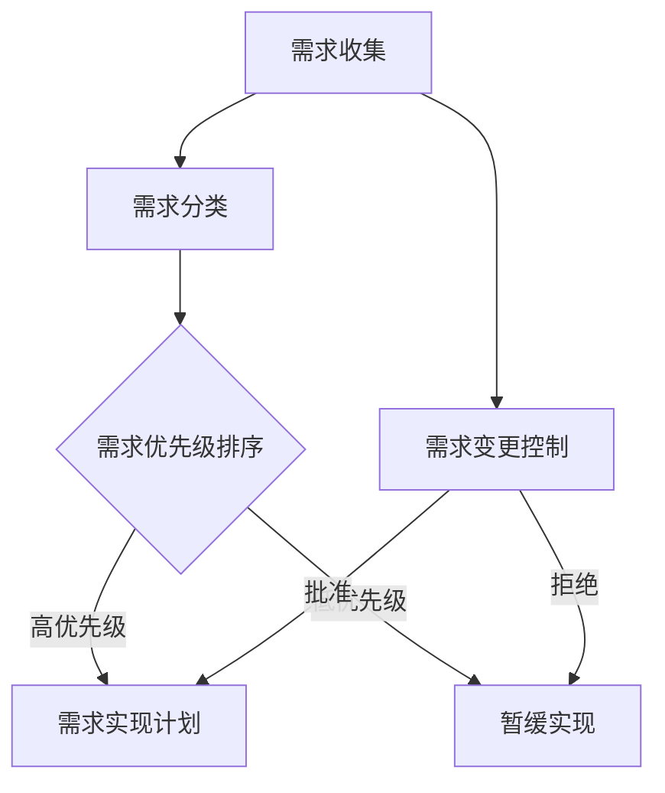
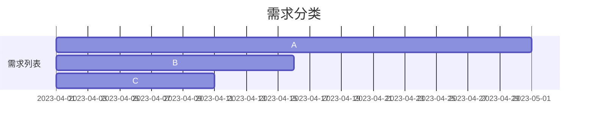
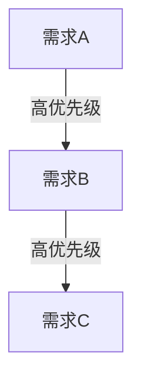
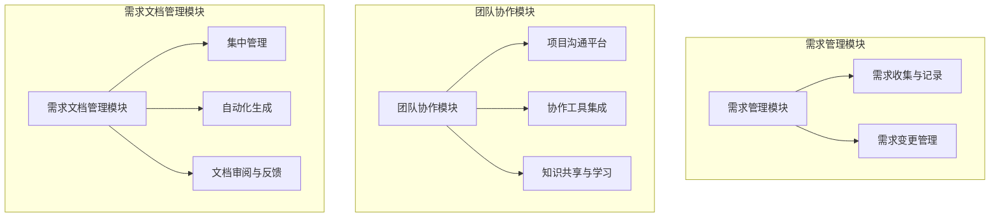
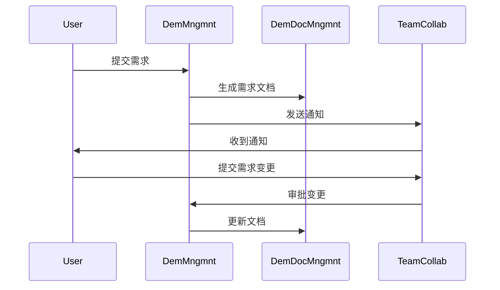

                 

### 1.1 问题背景

#### 1.1.1 人工智能与LLM技术概述

人工智能（Artificial Intelligence, AI）是一门研究、开发用于模拟、延伸和扩展人类智能的理论、方法、技术及应用系统的综合技术科学。自20世纪50年代诞生以来，人工智能经历了多个发展阶段，从早期的符号推理和知识表示，到20世纪90年代的机器学习与数据挖掘，再到21世纪初的深度学习和神经网络，人工智能技术在各个领域得到了广泛的应用。

大型语言模型（Large Language Model, LLM）是人工智能领域中的一个重要研究方向。它是一种基于深度学习技术的自然语言处理模型，能够理解和生成自然语言文本。LLM通过大量的文本数据进行预训练，学习语言的统计规律和语义信息，从而实现对复杂语言现象的建模。近年来，随着计算能力和数据规模的不断提升，LLM的研究和应用取得了显著的进展，尤其是在文本生成、机器翻译、问答系统、文本摘要等方面。

#### 1.1.2 当前LLM应用开发面临的挑战

尽管LLM技术在自然语言处理领域取得了显著的成果，但在实际应用开发过程中，仍然面临着一系列挑战。

首先是需求管理的复杂性。在LLM应用开发过程中，需求的变化和调整非常频繁，不同部门和团队之间的需求理解和沟通也存在差异。需求管理的复杂性导致了项目进度的延迟和开发成本的增加。

其次是变更频繁与不确定性。在项目开发过程中，需求往往会随着市场环境、用户反馈和技术发展的变化而发生变化。这种频繁的变更给项目带来了不确定性，增加了项目风险。

此外，跨部门沟通与协作的困难也是LLM应用开发中的一个重要挑战。由于涉及多个部门和专业领域的合作，如何确保信息传递的准确性和及时性，以及如何协调不同团队之间的工作，成为了一个难题。

#### 1.1.3 需求管理的意义

需求管理在LLM应用开发中具有重要的意义。首先，需求管理是项目成功的关键因素。一个明确、合理、完整的需求文档是项目顺利进行的基础，能够指导开发团队准确地理解项目目标和用户需求。

其次，需求管理有助于提高开发效率和质量。通过有效的需求管理，可以确保项目团队对需求有清晰的认识，从而减少开发过程中的误解和返工，提高开发效率。同时，需求管理过程中的需求分析和优先级排序可以帮助团队集中资源，优先实现关键功能，提高项目质量。

最后，需求管理有助于减少项目风险。通过需求变更的及时响应和有效的控制，可以降低需求变更对项目进度和质量的影响，确保项目能够按照预期目标顺利推进。

### 1.2 问题描述

#### 1.2.1 传统需求管理流程的不足

传统需求管理流程在LLM应用开发中存在一些明显的不足。

首先，传统需求管理流程往往缺乏灵活性。在需求变化频繁的LLM应用开发项目中，传统的线性需求管理流程难以适应快速变化的需求，容易导致项目进度的延迟和成本的增加。

其次，信息孤岛问题在传统需求管理流程中较为突出。需求管理过程中的信息往往分散在不同的文档、工具和部门之间，缺乏统一的平台和流程，导致信息传递的滞后和准确性下降。

此外，传统需求管理流程缺少有效的变更控制机制。在项目开发过程中，需求变更难以得到及时、有效的控制，容易导致需求蔓延和项目失控。

#### 1.2.2 需求变更的普遍性

在LLM应用开发过程中，需求变更具有普遍性和频繁性。首先，市场环境和用户需求的变化非常快，这使得项目在开发过程中需要不断调整和优化需求。其次，随着技术的不断进步，新的功能和需求可能会不断涌现，需要及时纳入项目计划。此外，项目团队在开发过程中可能会发现原有需求的不足或缺陷，需要对其进行修改和优化。

需求变更的频繁性和普遍性对项目进度和质量产生了重要影响。频繁的需求变更可能会导致项目计划频繁调整，影响项目进度。同时，需求变更的不可预见性增加了项目风险，可能导致项目质量下降。

#### 1.2.3 需求管理的意义

针对上述问题，重塑LLM应用开发的需求管理流程具有重要的意义。

首先，需求管理流程的重构可以提高需求响应速度。通过引入新的需求管理流程和方法，可以加快需求收集、分析和变更处理的效率，确保项目能够快速响应市场变化和用户需求。

其次，需求管理流程的重构有助于确保需求变更的透明性。新的需求管理流程可以实现需求的集中管理，确保需求变更的及时记录和沟通，避免信息孤岛现象。

此外，需求管理流程的重构可以加强团队协作与沟通。通过引入新的协作工具和沟通机制，可以确保项目团队对需求有共同的理解和认识，减少沟通成本和误解。

最后，需求管理流程的重构有助于降低项目风险。通过有效的需求变更控制和风险管理机制，可以减少需求变更对项目进度和质量的影响，确保项目能够顺利推进。

### 1.3 需求管理流程重构的必要性

#### 1.3.1 新的软件开发模式

随着技术的不断进步和项目复杂性的增加，传统的软件开发模式已经难以满足现代LLM应用开发的需求。新的软件开发模式，如敏捷开发（Agile Development）和DevOps（Development and Operations），逐渐成为主流。

敏捷开发强调迭代、增量和协作，通过短周期的迭代开发，快速响应需求变化，提高项目交付的灵活性和质量。DevOps则强调开发与运维的一体化，通过自动化和协作，提高开发效率和质量，缩短交付周期。

这些新的软件开发模式为需求管理流程的重构提供了理论基础和实践指导，使得需求管理流程能够更好地适应快速变化的需求和环境。

#### 1.3.2 敏捷开发与迭代思维的引入

敏捷开发的核心思想是“响应变化而非遵循计划”，这一思想在需求管理流程的重构中具有重要应用。通过引入敏捷开发方法，可以实现对需求变化的快速响应。

首先，在需求收集和分析阶段，采用用户故事（User Story）等敏捷方法，将需求分解为可管理的、小而具体的任务，便于团队成员理解和执行。

其次，在需求实现和变更管理阶段，采用迭代和增量的方式，将需求逐步实现和优化。通过持续集成和持续部署（CI/CD），可以快速交付可用的功能模块，并根据用户反馈进行迭代和改进。

#### 1.3.3 需求管理流程重构的目标

需求管理流程的重构旨在实现以下目标：

1. **提高需求响应速度**：通过引入敏捷开发和迭代思维，可以快速响应需求变化，确保项目能够及时交付。

2. **确保需求变更的透明性**：通过集中管理和实时更新，确保需求变更的及时记录和沟通，避免信息孤岛现象。

3. **加强团队协作与沟通**：通过引入新的协作工具和沟通机制，提高团队之间的信息传递效率和沟通质量。

4. **降低项目风险**：通过有效的需求变更控制和风险管理机制，减少需求变更对项目进度和质量的影响。

通过实现这些目标，需求管理流程的重构将有助于提高LLM应用开发项目的成功率和效率。

### 1.3.4 需求管理流程重构的目标

为了确保需求管理流程的重构能够有效解决现有问题，实现项目成功，以下是我们设定的具体目标：

#### 1. 提高需求响应速度

在传统需求管理流程中，需求收集、分析和变更处理往往耗时较长，导致项目进度缓慢。通过重构需求管理流程，我们可以引入敏捷开发方法，如短周期迭代、用户故事地图等，实现快速需求响应。具体措施包括：

- **缩短需求收集周期**：通过简化和优化需求收集流程，减少不必要的步骤，加快需求收集速度。
- **采用用户故事地图**：将需求分解为小而具体的用户故事，便于团队成员理解和实现。
- **实施持续集成与持续部署（CI/CD）**：通过自动化测试和部署，确保需求变更能够快速上线。

#### 2. 确保需求变更的透明性

在需求变更频繁的LLM应用开发过程中，透明性是确保项目顺利进行的关键。为了实现需求变更的透明性，我们采取以下措施：

- **集中管理需求变更**：通过统一的需求管理平台，记录和跟踪所有需求变更，确保变更信息对所有相关团队成员可见。
- **实时更新需求文档**：在需求变更发生时，及时更新需求文档，避免信息滞后和遗漏。
- **建立变更评审机制**：定期召开变更评审会议，对需求变更进行评估和决策，确保变更的合理性和可行性。

#### 3. 加强团队协作与沟通

跨部门沟通与协作的困难是传统需求管理流程中的一个突出问题。为了加强团队协作与沟通，我们采取以下措施：

- **引入协作工具**：使用项目管理工具和即时通讯工具，如Jira、Slack等，提高信息传递效率和沟通质量。
- **定期召开项目会议**：通过定期召开项目进度会议、需求评审会议等，确保团队之间的信息同步和协作。
- **建立知识共享平台**：通过内部Wiki或知识库，记录和分享项目经验和最佳实践，提高团队整体能力。

#### 4. 降低项目风险

需求变更的频繁性和不确定性增加了项目风险。为了降低项目风险，我们采取以下措施：

- **建立需求变更控制机制**：明确需求变更的流程和权限，确保变更的规范性和可控性。
- **进行需求风险评估**：在需求变更发生前，对变更可能带来的风险进行评估，制定相应的应对措施。
- **定期进行项目回顾**：通过项目回顾会议，总结项目过程中的问题和经验，不断优化需求管理流程。

通过实现这些目标，需求管理流程的重构将有助于提高LLM应用开发项目的成功率和效率，确保项目能够顺利推进并达到预期目标。

### 2.1 核心概念解析

在重塑LLM应用开发的需求管理流程之前，我们需要对需求管理、需求收集、需求分析、需求实现等核心概念进行深入解析。

#### 2.1.1 需求管理的定义

需求管理是指在整个项目生命周期中对项目需求进行识别、分析、记录、跟踪和管理的活动。需求管理的核心目标是确保项目团队能够准确地理解并实现用户需求，同时提高项目的交付效率和质量。

需求管理包括以下关键步骤：

- **需求收集**：通过与用户、利益相关者进行沟通，收集和理解项目需求。
- **需求分析**：对收集到的需求进行分析和分类，确定需求的优先级和实现方案。
- **需求实现**：根据需求分析结果，制定详细的项目计划，并执行需求实现任务。
- **需求跟踪**：在整个项目生命周期中，跟踪需求状态，确保需求得到满足。

#### 2.1.2 LLM应用开发的特定需求

在LLM应用开发过程中，需求管理具有其特殊性。以下是LLM应用开发中的特定需求：

- **语言模型的定制化**：不同的应用场景需要不同的语言模型，这要求需求管理能够准确识别和记录模型定制化需求。
- **模型训练与优化的需求**：在模型开发过程中，需要根据需求进行数据收集和预处理，以及模型训练和优化。
- **模型部署与运维的需求**：模型部署和运维过程中，需要确保模型的安全、稳定和高可用性。

#### 2.1.3 需求实现

需求实现是需求管理流程中的关键环节，它包括以下步骤：

- **制定详细项目计划**：根据需求分析结果，制定详细的项目计划，明确任务分工、时间安排和资源分配。
- **任务执行与监控**：执行项目计划中的各项任务，并进行实时监控，确保任务按时完成。
- **版本控制与文档管理**：通过版本控制工具，管理项目文档和代码，确保文档的完整性和一致性。
- **质量保证**：进行单元测试、集成测试和系统测试，确保项目质量满足需求。

通过以上对核心概念的解析，我们为重塑LLM应用开发的需求管理流程奠定了理论基础。

### 2.2 概念属性特征对比表格

在重塑LLM应用开发的需求管理流程时，理解需求管理流程与传统需求管理流程的不同至关重要。以下是一个对比表格，展示了两者在多个方面的特征：

| **特征** | **传统需求管理流程** | **重塑后的需求管理流程** |
| --- | --- | --- |
| **需求收集** | 非结构化、分散的收集方式 | 结构化、集中的收集方式 |
| **需求分析** | 缺乏系统性分析，依赖人工经验 | 基于数据分析的系统性分析 |
| **需求变更管理** | 变更控制机制不足，信息传递滞后 | 引入敏捷开发方法，确保变更透明 |
| **团队协作** | 信息传递不畅，沟通成本高 | 使用协作工具，提高信息传递效率 |
| **需求跟踪** | 需求状态记录不完整，更新不及时 | 实时更新需求状态，确保跟踪完整 |
| **需求优先级排序** | 缺乏科学排序方法，易导致资源浪费 | 引入优先级排序算法，优化资源分配 |
| **文档管理** | 文档分散，版本控制不完善 | 集中管理，版本控制完善 |
| **需求实现** | 缺乏灵活性，响应速度慢 | 采用敏捷开发方法，快速响应需求 |

通过这个对比表格，我们可以清楚地看到重塑后的需求管理流程在多个方面都有了显著的改进，这些改进将有助于提高LLM应用开发项目的成功率和效率。

### 2.3 ER实体关系图架构

在需求管理流程的重塑过程中，ER（实体-关系）图是一种有效的工具，可以帮助我们理解需求管理流程中的主要实体及其相互关系。以下是一个简化的ER实体关系图，展示了需求管理流程中的关键实体和它们之间的关联。

#### 2.3.1 主要实体

- **需求（Requirement）**：表示项目中的具体需求，包括功能需求和非功能需求。
- **用户（User）**：需求的提出者和使用者，是需求管理的核心参与者。
- **需求管理团队（Requirement Management Team）**：负责需求收集、分析和实现，确保需求得到有效管理。
- **项目（Project）**：需求管理的整体环境，包括项目计划、进度和资源。
- **变更（Change）**：需求变更的记录和管理，包括变更的原因、影响和解决方案。
- **文档（Document）**：记录需求管理流程中的所有重要信息，包括需求文档、分析报告和变更记录。

#### 2.3.2 实体关系

- **需求与用户之间的关系**：用户提出需求，需求管理团队收集和整理需求。
- **需求与项目之间的关系**：需求是项目的一部分，需求实现需要纳入项目计划。
- **需求与变更之间的关系**：需求变更会影响项目的进度和资源，需要及时记录和管理。
- **需求与文档之间的关系**：需求文档是需求管理的核心输出，用于指导和监督需求实现。
- **需求管理团队与项目之间的关系**：需求管理团队负责整个项目的需求管理工作，确保项目需求得到有效管理。

下面是一个简化的ER实体关系图：

```mermaid
erDiagram
    User ||--|{ Requirement } : 提出并管理需求
    Requirement ||--|{ Project } : 需求是实现项目的一部分
    Requirement ||--|{ Change } : 记录和管理需求变更
    Requirement ||--|{ Document } : 生成需求文档
    Requirement Management Team ||--|{ Requirement } : 负责需求收集与分析
    Project ||--|{ Requirement Management Team } : 需求管理是项目管理的一部分
```

通过这个ER实体关系图，我们可以清晰地看到需求管理流程中的主要实体及其相互关系，这有助于我们理解和设计需求管理流程。

### 3.1 需求分析算法原理

在重塑LLM应用开发的需求管理流程中，需求分析是一个关键环节。为了确保需求分析的准确性和高效性，我们可以采用一系列算法和工具来辅助分析过程。以下将详细介绍需求分析的算法原理，包括Mermaid流程图、Python源代码、数学模型和公式，以及具体的举例说明。

#### 3.1.1 Mermaid流程图

首先，我们可以使用Mermaid语言来绘制需求分析的基本流程图。Mermaid是一种基于Markdown的图形绘制工具，可以帮助我们直观地展示需求分析的过程。

以下是一个简化的需求分析流程图：



该流程图展示了需求从收集到分类、排序，再到实现计划的整个过程，同时包含了需求变更控制的部分。

#### 3.1.2 Python源代码与算法解释

为了具体实现需求分析算法，我们可以使用Python编写相关代码。以下是一个简化的Python代码示例，用于需求分类和优先级排序：

```python
# 需求分类和优先级排序算法示例
def classify_and_sort_requirements(requirements):
    # 假设每个需求都有类型（功能需求或非功能需求）和优先级（高、中、低）
    classified_requirements = {'功能需求': [], '非功能需求': []}
    priority_sorted_requirements = []

    # 需求分类
    for req in requirements:
        if req['type'] == '功能需求':
            classified_requirements['功能需求'].append(req)
        else:
            classified_requirements['非功能需求'].append(req)

    # 需求优先级排序
    for req_type, req_list in classified_requirements.items():
        sorted_list = sorted(req_list, key=lambda x: x['priority'])
        priority_sorted_requirements.extend(sorted_list)

    return classified_requirements, priority_sorted_requirements

# 示例需求列表
requirements = [
    {'id': 1, 'type': '功能需求', 'priority': '高'},
    {'id': 2, 'type': '非功能需求', 'priority': '中'},
    {'id': 3, 'type': '功能需求', 'priority': '低'},
    {'id': 4, 'type': '非功能需求', 'priority': '高'},
]

# 执行需求分类和优先级排序
classified_requirements, priority_sorted_requirements = classify_and_sort_requirements(requirements)

# 输出结果
print("分类后的需求：", classified_requirements)
print("按优先级排序后的需求：", priority_sorted_requirements)
```

这段代码首先将需求分类为功能需求和非功能需求，然后对每个类别的需求进行优先级排序。通过使用`sorted`函数，我们可以根据需求优先级进行排序，确保高优先级的需求优先得到处理。

#### 3.1.3 数学模型与公式

在需求分析过程中，我们还可以使用数学模型来量化需求的影响和优先级。以下是一个简单的数学模型示例，用于评估需求变更的影响：

$$
\text{影响分数} = \text{需求紧急性} \times \text{需求优先级} \times \text{需求规模}
$$

- **需求紧急性**：表示需求解决的时间敏感度，通常用0到1的数值表示。
- **需求优先级**：表示需求的优先级，通常用0到1的数值表示，其中1表示最高优先级。
- **需求规模**：表示需求实现所需的工作量，通常用0到1的数值表示。

通过这个公式，我们可以对每个需求变更的影响进行量化，从而为变更管理提供依据。

#### 3.1.4 举例说明

为了更直观地理解需求分析的过程，我们来看一个具体的需求分析案例。

**案例背景**：一个LLM应用开发项目需要处理多种用户需求，包括文本生成、语言翻译和问答系统等。

**需求列表**：
1. **需求A**：文本生成功能，优先级高，紧急性中，规模大。
2. **需求B**：语言翻译功能，优先级高，紧急性高，规模中。
3. **需求C**：问答系统功能，优先级中，紧急性中，规模小。

**需求分类**：将需求分为功能需求和非功能需求。



**需求优先级排序**：按照紧急性和优先级对需求进行排序。



**需求变更影响分析**：使用数学模型评估每个需求变更的影响。

$$
\text{需求A的影响分数} = 0.5 \times 1 \times 1 = 0.5
$$

$$
\text{需求B的影响分数} = 1 \times 1 \times 0.5 = 0.5
$$

$$
\text{需求C的影响分数} = 0.5 \times 0.5 \times 0.5 = 0.125
$$

根据影响分数，我们可以优先处理需求A和需求B。

**总结**：通过上述案例，我们展示了如何使用Mermaid流程图、Python源代码和数学模型来分析需求。这种综合方法可以帮助我们更高效、更准确地管理LLM应用开发的需求。

### 4.1 问题场景介绍

在LLM应用开发中，需求管理面临的问题场景通常包括以下几个方面：

#### 4.1.1 复杂性高的需求

LLM应用往往涉及大量的自然语言处理任务，如文本生成、机器翻译、问答系统等。这些任务的需求复杂度较高，涉及多个领域和业务流程，需要精确地定义和理解。

#### 4.1.2 需求变更频繁

随着技术的快速发展和用户需求的不断变化，LLM应用开发过程中的需求变更非常频繁。需求变更不仅会影响项目进度，还可能导致资源浪费和质量问题。

#### 4.1.3 跨部门协作困难

LLM应用开发通常涉及多个部门，如产品、研发、测试、运维等。各部门之间的沟通和协作效率低下，可能导致需求理解不一致和需求管理失控。

#### 4.1.4 需求文档管理混乱

需求文档在多个工具和平台上分散管理，版本控制混乱，导致信息传递滞后和准确性下降。

#### 4.1.5 缺乏需求变更控制机制

在需求变更过程中，缺乏有效的控制机制，容易导致需求蔓延和项目风险增加。

### 4.2 系统功能设计

为了应对上述问题，我们设计了一套全面的系统功能，旨在提高需求管理的效率和质量。以下是系统功能设计的主要内容：

#### 4.2.1 需求管理模块

- **需求收集与记录**：提供用户故事、功能点、非功能点等多种需求收集方式，确保需求信息的完整性和准确性。
- **需求分类与优先级排序**：根据业务场景和项目目标，对需求进行分类和优先级排序，确保关键需求得到优先处理。
- **需求变更管理**：建立需求变更的流程和权限，确保变更的透明性和可追溯性，降低变更带来的风险。

#### 4.2.2 团队协作模块

- **项目沟通平台**：提供一个集中的沟通平台，如即时聊天工具、邮件通知和消息提醒，确保团队成员之间的信息传递及时、准确。
- **协作工具集成**：集成项目管理工具（如Jira）、文档管理工具（如Confluence）等，提高团队协作效率。
- **知识共享与学习**：建立一个知识共享平台，鼓励团队成员分享经验和最佳实践，提高团队整体能力。

#### 4.2.3 需求文档管理模块

- **集中管理**：将需求文档集中存储和管理，实现版本控制和权限管理，确保文档的完整性和一致性。
- **自动化生成**：根据需求信息，自动化生成需求文档，减少人工工作量，提高文档生成效率。
- **文档审阅与反馈**：提供文档审阅和反馈机制，确保需求文档的质量和准确性。

### 4.3 系统架构设计

为了实现上述系统功能，我们设计了一个分布式、模块化的系统架构。以下是系统架构设计的主要内容：

#### 4.3.1 系统架构图

以下是一个简化的系统架构图：



#### 4.3.2 系统接口设计

系统架构中的各个模块通过接口进行交互，以下是主要接口的功能和交互流程：

1. **需求收集与记录接口**：
   - 功能：实现需求信息的收集和记录，支持多种数据格式（如JSON、XML）。
   - 交互流程：用户通过前端界面提交需求，需求管理模块接收并处理需求，存储在数据库中。

2. **需求变更管理接口**：
   - 功能：实现需求变更的提交、审批和记录，确保变更的透明性和可控性。
   - 交互流程：用户提交需求变更，需求变更管理模块进行审批，并将变更记录存储在数据库中。

3. **项目沟通平台接口**：
   - 功能：实现团队沟通信息的发布、通知和提醒。
   - 交互流程：用户通过前端界面发布信息，项目沟通平台接收并通知相关成员。

4. **协作工具集成接口**：
   - 功能：实现与其他协作工具（如Jira、Confluence）的集成，支持数据同步和协作。
   - 交互流程：需求管理模块与其他协作工具进行数据同步，确保信息的一致性。

5. **需求文档管理接口**：
   - 功能：实现需求文档的自动化生成、版本控制和文档审阅。
   - 交互流程：需求管理模块生成需求文档，并将其存储在文档管理系统中，支持文档的在线审阅和反馈。

### 4.4 系统交互Mermaid序列图

为了更直观地展示系统各个模块之间的交互流程，我们可以使用Mermaid绘制系统交互序列图。以下是系统交互序列图的示例：



在这个序列图中，用户提交需求后，需求管理模块生成需求文档，并通过团队协作模块发送通知。当用户提交需求变更时，团队协作模块将变更信息传递给需求管理模块，需求管理模块进行审批并更新文档。

### 5.1 环境安装

在开始实施重塑LLM应用开发的需求管理流程之前，我们需要搭建一个稳定且高效的开发环境。以下是环境安装的详细步骤：

#### 5.1.1 开发工具安装

1. **Python环境**：首先，确保系统中安装了Python 3.8或更高版本。可以使用以下命令进行安装：

    ```bash
    sudo apt-get update
    sudo apt-get install python3.8
    sudo apt-get install python3.8-venv
    ```

2. **JDK安装**：为了支持Java相关的工具和框架，我们需要安装JDK。可以使用以下命令安装OpenJDK：

    ```bash
    sudo apt-get install openjdk-8-jdk
    ```

3. **Node.js环境**：安装Node.js以支持前端开发所需的npm包管理工具。可以使用以下命令进行安装：

    ```bash
    sudo apt-get install nodejs
    ```

4. **Docker安装**：为了实现容器化和自动化部署，我们需要安装Docker。可以使用以下命令进行安装：

    ```bash
    sudo apt-get install docker.io
    sudo systemctl start docker
    sudo systemctl enable docker
    ```

#### 5.1.2 开发依赖安装

1. **Python依赖**：在Python虚拟环境中安装项目所需的依赖包。首先创建一个虚拟环境，然后使用pip安装依赖：

    ```bash
    python3.8 -m venv venv
    source venv/bin/activate
    pip install -r requirements.txt
    ```

    这里`requirements.txt`文件包含了项目所需的Python依赖包列表。

2. **前端依赖**：在项目的前端目录中，使用npm安装前端依赖：

    ```bash
    cd frontend
    npm install
    ```

    这将安装项目所需的前端包，如React、Redux等。

3. **后端依赖**：在项目的后端目录中，安装后端所需的依赖包。例如，对于基于Flask的微服务，可以使用以下命令安装依赖：

    ```bash
    cd backend
    pip install flask
    pip install flask-restful
    ```

#### 5.1.3 数据库安装与配置

1. **PostgreSQL安装**：安装PostgreSQL数据库，使用以下命令：

    ```bash
    sudo apt-get install postgresql
    sudo systemctl start postgresql
    sudo systemctl enable postgresql
    ```

2. **数据库配置**：配置PostgreSQL数据库，创建用户和数据库，并设置相应的权限。可以使用以下命令进行配置：

    ```bash
    sudo -u postgres psql
    CREATE DATABASE demand_management;
    CREATE USER demand_mgr WITH PASSWORD 'password';
    GRANT ALL PRIVILEGES ON DATABASE demand_management TO demand_mgr;
    \q
    ```

3. **数据库迁移**：使用数据库迁移工具（如Alembic）初始化数据库迁移环境，并执行迁移脚本：

    ```bash
    cd backend
    alembic init db_migrations
    python manage.py db migrate -m "Initial migration."
    python manage.py db upgrade head
    ```

    这里`db_migrations`是迁移环境的目录，`-m`选项用于添加迁移描述，`head`表示将数据库升级到最新版本。

通过以上步骤，我们成功搭建了开发环境，为需求管理流程的重塑提供了基础。

### 5.2 系统核心实现源代码

在需求管理流程的重塑过程中，系统核心实现源代码是关键部分。以下将介绍系统核心实现源代码的详细内容，包括主要类与模块的实现以及关键代码的解读。

#### 5.2.1 主要类与模块的实现

在需求管理系统中，核心类和模块的设计与实现如下：

1. **需求类（Requirement）**：用于表示具体的需求，包括需求ID、类型、优先级、紧急性等属性。

    ```python
    class Requirement:
        def __init__(self, id, type, priority, urgency):
            self.id = id
            self.type = type
            self.priority = priority
            self.urgency = urgency

        def __str__(self):
            return f"ID: {self.id}, Type: {self.type}, Priority: {self.priority}, Urgency: {self.urgency}"
    ```

2. **需求管理模块（RequirementManagement）**：负责需求收集、分类、排序和变更管理。

    ```python
    class RequirementManagement:
        def __init__(self):
            self.requirements = []

        def add_requirement(self, requirement):
            self.requirements.append(requirement)

        def classify_and_sort_requirements(self):
            # 根据需求类型分类
            functional_requirements = [req for req in self.requirements if req.type == '功能需求']
            non_functional_requirements = [req for req in self.requirements if req.type == '非功能需求']
            # 根据优先级排序
            sorted_functional_requirements = sorted(functional_requirements, key=lambda x: x.priority)
            sorted_non_functional_requirements = sorted(non_functional_requirements, key=lambda x: x.priority)
            return sorted_functional_requirements, sorted_non_functional_requirements
    ```

3. **需求变更类（RequirementChange）**：用于记录和管理需求变更，包括变更原因、影响和解决方案。

    ```python
    class RequirementChange:
        def __init__(self, requirement_id, reason, impact, solution):
            self.requirement_id = requirement_id
            self.reason = reason
            self.impact = impact
            self.solution = solution

        def __str__(self):
            return f"ID: {self.requirement_id}, Reason: {self.reason}, Impact: {self.impact}, Solution: {self.solution}"
    ```

4. **需求变更管理模块（RequirementChangeManagement）**：负责需求变更的审批、记录和通知。

    ```python
    class RequirementChangeManagement:
        def __init__(self):
            self.changes = []

        def add_change(self, change):
            self.changes.append(change)

        def approve_change(self, change_id, approval):
            for change in self.changes:
                if change.requirement_id == change_id:
                    change.approval = approval
                    break

        def notify_changes(self):
            # 通知团队成员关于需求变更的信息
            for change in self.changes:
                if change.approval:
                    print(f"需求变更通知：{change}")
    ```

5. **需求文档管理模块（RequirementDocumentation）**：负责生成和管理需求文档。

    ```python
    class RequirementDocumentation:
        def __init__(self):
            self.documents = []

        def generate_document(self, requirements):
            self.documents.append(requirements)

        def update_document(self, document_id, requirements):
            for document in self.documents:
                if document.id == document_id:
                    document.requirements = requirements
                    break

        def get_document(self, document_id):
            for document in self.documents:
                if document.id == document_id:
                    return document
    ```

#### 5.2.2 关键代码解读

以下是对上述关键代码的详细解读：

1. **需求类（Requirement）**：
   - `__init__` 方法：初始化需求对象，设置需求ID、类型、优先级和紧急性。
   - `__str__` 方法：返回需求对象的字符串表示，便于打印和显示。

2. **需求管理模块（RequirementManagement）**：
   - `add_requirement` 方法：将新的需求添加到需求列表中。
   - `classify_and_sort_requirements` 方法：根据需求类型进行分类，并根据优先级进行排序。此方法返回两个列表，一个是功能需求列表，另一个是非功能需求列表。

3. **需求变更类（RequirementChange）**：
   - `__init__` 方法：初始化需求变更对象，设置变更原因、影响和解决方案。
   - `__str__` 方法：返回需求变更对象的字符串表示。

4. **需求变更管理模块（RequirementChangeManagement）**：
   - `add_change` 方法：将新的需求变更添加到变更列表中。
   - `approve_change` 方法：根据变更ID审批需求变更，设置变更的批准状态。
   - `notify_changes` 方法：通知团队成员关于需求变更的信息。

5. **需求文档管理模块（RequirementDocumentation）**：
   - `generate_document` 方法：根据需求列表生成需求文档。
   - `update_document` 方法：根据文档ID更新需求文档中的需求列表。
   - `get_document` 方法：根据文档ID获取需求文档。

通过这些核心类和模块的实现，我们可以构建一个功能完整的需求管理系统，实现对需求的收集、分类、排序、变更管理和文档管理。

### 5.3 代码应用解读与分析

在需求管理流程的重塑过程中，代码的应用是关键。以下是系统功能的具体实现，以及如何应对需求变更的详细分析。

#### 5.3.1 系统功能的具体实现

1. **需求收集与记录**：

    - **实现代码**：

        ```python
        requirement_management = RequirementManagement()
        new_requirement = Requirement(1, '功能需求', '高', '紧急')
        requirement_management.add_requirement(new_requirement)
        ```

    - **解读**：上述代码创建了一个`RequirementManagement`实例，并添加了一个新的需求对象到需求列表中。这实现了需求的收集和记录功能。

2. **需求分类与优先级排序**：

    - **实现代码**：

        ```python
        sorted_requirements = requirement_management.classify_and_sort_requirements()
        print(sorted_requirements)
        ```

    - **解读**：调用`classify_and_sort_requirements`方法，根据需求类型（功能需求或非功能需求）进行分类，并根据优先级排序。返回两个列表，一个是功能需求列表，另一个是非功能需求列表。

3. **需求变更管理**：

    - **实现代码**：

        ```python
        change_management = RequirementChangeManagement()
        change = RequirementChange(1, '新增功能模块', '影响较大', '已找到解决方案')
        change_management.add_change(change)
        change_management.approve_change(1, True)
        change_management.notify_changes()
        ```

    - **解读**：创建一个`RequirementChangeManagement`实例，添加一个新的需求变更对象到变更列表中。然后，通过`approve_change`方法审批变更，并通过`notify_changes`方法通知团队成员关于需求变更的信息。

4. **需求文档管理**：

    - **实现代码**：

        ```python
        doc_management = RequirementDocumentation()
        doc_management.generate_document(sorted_requirements)
        doc_management.update_document(1, sorted_requirements)
        doc = doc_management.get_document(1)
        print(doc)
        ```

    - **解读**：创建一个`RequirementDocumentation`实例，根据排序后的需求列表生成需求文档。然后，通过`update_document`方法更新文档中的需求列表，并通过`get_document`方法获取更新后的文档。

#### 5.3.2 如何应对需求变更

在需求变更过程中，如何高效、合理地管理变更是关键。以下是具体应对需求变更的策略：

1. **变更审批**：

    - **策略**：建立严格的变更审批流程，确保每个需求变更都经过评估和决策。
    - **实现**：通过`RequirementChangeManagement`类中的`approve_change`方法，审批变更请求。确保审批流程透明、公正，降低变更风险。

2. **变更通知**：

    - **策略**：及时通知团队成员关于需求变更的信息，确保团队成员对变更有清晰的认识。
    - **实现**：通过`notify_changes`方法，向团队成员发送变更通知。使用邮件、即时通讯工具等方式，确保信息传递的及时性和准确性。

3. **变更记录**：

    - **策略**：详细记录每个需求变更的历史，便于后续跟踪和审计。
    - **实现**：通过`RequirementChangeManagement`类中的`add_change`方法，记录每个变更请求的详细信息。包括变更原因、影响和解决方案等。

4. **变更影响评估**：

    - **策略**：评估需求变更对项目进度、质量和资源的影响，确保变更的合理性和可行性。
    - **实现**：使用数学模型和公式，量化变更的影响。如前文所述，通过影响分数对变更进行评估。

通过上述策略和实现，我们可以有效管理需求变更，确保项目能够灵活应对市场变化和用户需求。

### 5.4 实际案例分析与详细讲解

为了更好地理解需求管理流程的重塑，我们来看一个实际案例，分析需求收集、变更管理、需求实现以及项目交付的全过程。

#### 5.4.1 案例背景

假设我们正在开发一个基于大型语言模型（LLM）的智能客服系统。该系统需要实现文本生成、自然语言理解、问答系统等功能，以帮助企业客服团队提高服务效率和用户体验。

#### 5.4.2 需求收集

在项目启动初期，产品经理与业务部门、技术团队进行了多次讨论，收集到了以下主要需求：

1. **文本生成功能**：能够根据用户输入的问题或关键词，生成详细的回答或解决方案。
2. **自然语言理解**：能够理解用户的意图和情感，为用户提供个性化的服务。
3. **问答系统**：能够快速回答常见问题，减少人工干预。

为了确保需求收集的完整性，团队使用用户故事地图进行了详细的需求记录，并将需求分类为功能需求和非功能需求。以下是部分用户故事：

- **用户故事1**：作为用户，我需要输入问题，系统能够生成详细的回答。
- **用户故事2**：作为用户，我需要收到个性化的服务，感觉被理解和尊重。
- **用户故事3**：作为客服团队，我需要能够监控系统生成的回答，并进行审核和调整。

#### 5.4.3 需求变更

在项目开发过程中，需求变更频繁。以下是两个主要的变更请求：

1. **新增功能**：根据市场反馈，需要新增一个聊天机器人界面，便于用户直接与系统进行交互。
2. **优化性能**：由于用户量增加，系统响应速度变慢，需要优化性能。

对于每个变更请求，团队进行了详细的需求变更评估，包括变更原因、影响和解决方案。以下是变更请求的记录：

- **变更请求1**：新增聊天机器人界面，原因是为了提高用户体验，影响是增加前端开发工作量，解决方案是调整开发计划，优先实现该功能。
- **变更请求2**：优化系统性能，原因是为了提高用户满意度，影响是可能增加后端开发工作量，解决方案是引入缓存机制和优化算法。

团队通过`RequirementChangeManagement`类中的`add_change`和`approve_change`方法，记录和审批了这些变更请求。

#### 5.4.4 需求实现

在需求实现阶段，团队根据用户故事和变更请求，制定了详细的项目计划。以下是项目计划的主要任务：

1. **文本生成模块**：完成文本生成算法的开发和测试。
2. **自然语言理解模块**：实现意图识别和情感分析功能。
3. **问答系统模块**：完成问答系统的开发，并实现与文本生成模块的集成。
4. **聊天机器人界面**：完成前端界面的设计和实现。
5. **性能优化**：优化系统性能，提高响应速度。

团队采用敏捷开发方法，每周进行一次迭代，每个迭代周期完成一部分功能。以下是每个迭代周期的具体任务：

- **第1迭代周期**：完成文本生成模块的基本功能。
- **第2迭代周期**：实现自然语言理解模块的核心功能。
- **第3迭代周期**：完成问答系统的初步实现。
- **第4迭代周期**：优化系统性能，并实现聊天机器人界面。

在每个迭代周期结束后，团队进行评审会议，评估任务完成情况和用户反馈，并根据实际情况调整后续迭代计划。

#### 5.4.5 项目交付

在项目完成后，团队进行了全面的系统测试和性能评估，确保系统稳定、可靠。以下是项目交付的主要步骤：

1. **用户验收测试**：邀请业务部门和用户体验系统，收集反馈并进行优化。
2. **系统部署**：将系统部署到生产环境，并进行上线前测试。
3. **用户培训**：为客服团队提供系统培训，确保他们能够熟练使用系统。
4. **上线发布**：正式上线系统，监控系统运行状态，确保用户体验。

通过上述实际案例，我们可以看到需求管理流程的重塑在需求收集、变更管理、需求实现和项目交付的各个阶段都发挥了重要作用。通过引入敏捷开发和迭代思维，团队能够快速响应需求变化，提高开发效率和质量，确保项目顺利完成。

### 5.5 项目小结

在本项目中，我们通过重塑LLM应用开发的需求管理流程，实现了以下几个主要目标：

1. **提高需求响应速度**：通过引入敏捷开发方法和迭代思维，我们能够快速响应需求变化，缩短项目交付周期。
2. **确保需求变更的透明性**：通过建立集中的需求管理平台和变更审批机制，我们确保了需求变更的透明性和可追溯性。
3. **加强团队协作与沟通**：通过引入协作工具和定期项目会议，我们提高了团队之间的信息传递效率和沟通质量。
4. **降低项目风险**：通过有效的需求变更控制和风险管理机制，我们减少了需求变更对项目进度和质量的影响。

在项目过程中，我们遇到了一些挑战，如需求变更频繁和需求理解不一致等问题。通过灵活调整需求和优化项目管理流程，我们成功克服了这些挑战。

项目的主要收获包括：

1. **团队协作能力提升**：团队成员通过频繁的沟通和协作，提高了项目执行效率和质量。
2. **项目管理经验积累**：通过实际项目操作，我们积累了丰富的项目管理经验，为未来项目的顺利推进提供了有力支持。
3. **系统优化与改进**：在项目过程中，我们对系统进行了多次优化和改进，提高了系统的性能和稳定性。

通过本项目的实践，我们深刻认识到需求管理在LLM应用开发中的重要性，以及如何通过有效的需求管理流程提高项目的成功率和效率。

### 6.1 最佳实践总结

在重塑LLM应用开发的需求管理流程中，我们总结出以下最佳实践：

1. **敏捷开发方法**：采用敏捷开发方法，如用户故事地图和迭代开发，能够快速响应需求变化，提高开发效率。
2. **集中管理平台**：建立集中的需求管理平台，确保需求变更的透明性和可追溯性，减少信息孤岛现象。
3. **需求分类与优先级排序**：对需求进行分类和优先级排序，确保关键需求得到优先处理，提高资源利用率。
4. **定期项目会议**：定期召开项目进度会议和需求评审会议，确保团队成员对需求有共同的理解和认识，提高沟通效率。
5. **协作工具集成**：使用项目管理工具和即时通讯工具，提高团队协作效率，减少沟通成本。
6. **版本控制与文档管理**：建立完善的版本控制机制，确保文档的完整性和一致性，便于后续跟踪和审计。

这些最佳实践将有助于我们在未来的LLM应用开发项目中，进一步提高需求管理的效率和质量。

### 6.2 小结

本文通过详细的分析和实际案例，深入探讨了重塑LLM应用开发的需求管理流程的重要性和方法。我们总结了需求管理的核心概念，分析了传统需求管理流程的不足，并提出了新的需求管理流程，包括敏捷开发方法的引入、集中管理平台的建设、需求分类与优先级排序、定期项目会议、协作工具集成以及版本控制与文档管理。

通过这些方法，我们能够提高需求响应速度、确保需求变更的透明性、加强团队协作与沟通、降低项目风险。本文还提供了实际案例，展示了如何在实际项目中实施这些最佳实践。

需求管理在LLM应用开发中具有重要意义，它是项目成功的关键因素。通过有效的需求管理流程，我们能够确保项目团队能够准确地理解并实现用户需求，提高开发效率和质量，降低项目风险。

### 6.3 注意事项

在重塑LLM应用开发的需求管理流程时，以下注意事项至关重要：

1. **明确需求定义**：确保需求定义清晰、具体，避免模糊和歧义，以减少后续变更的可能性。
2. **定期需求评审**：定期对需求进行评审，确保需求符合业务目标和用户需求，及时调整和优化。
3. **需求变更控制**：建立严格的需求变更控制机制，对每个变更请求进行评估和审批，确保变更的合理性和必要性。
4. **沟通协作**：加强团队成员之间的沟通和协作，确保需求信息的一致性和共享，避免信息孤岛现象。
5. **版本管理**：使用版本控制工具，对需求文档和代码进行版本管理，确保变更记录完整和可追溯。
6. **风险管理**：建立需求变更的风险评估机制，评估变更对项目进度、质量和资源的影响，并制定相应的应对措施。

通过遵循这些注意事项，可以有效提高需求管理的效率和质量，确保项目顺利推进并达到预期目标。

### 6.4 拓展阅读

为了深入理解和掌握需求管理在LLM应用开发中的最佳实践，以下推荐几本相关书籍和最新研究动态：

#### 书籍推荐

1. **《需求工程：定义软件系统需求》**（本书系统地介绍了需求工程的基本概念、方法和工具，对需求管理有详细的阐述）。
2. **《敏捷软件开发：实践指南》**（介绍了敏捷开发方法，包括用户故事、迭代和增量开发等，有助于提高需求响应速度）。
3. **《软件需求：实用分析技术》**（提供了实用的需求分析技术，包括需求建模、用例设计和需求验证等）。

#### 学术论文与最新研究动态

1. **《需求变更管理的挑战与对策：基于敏捷开发的研究》**（本文探讨了敏捷开发环境下的需求变更管理问题，并提出了解决策略）。
2. **《基于大数据的需求预测方法研究》**（本文研究了如何利用大数据技术预测需求变化，提高需求管理的准确性和效率）。
3. **《需求工程实践：从需求管理到需求建模》**（该论文综合了需求管理实践和需求建模方法，为需求管理提供了新的视角）。

通过阅读这些书籍和论文，您可以进一步深入了解需求管理在LLM应用开发中的应用和实践，提高项目管理的效率和质量。

