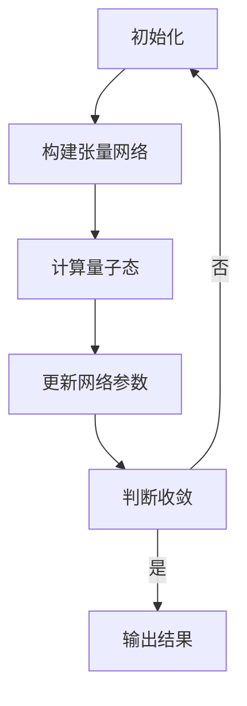
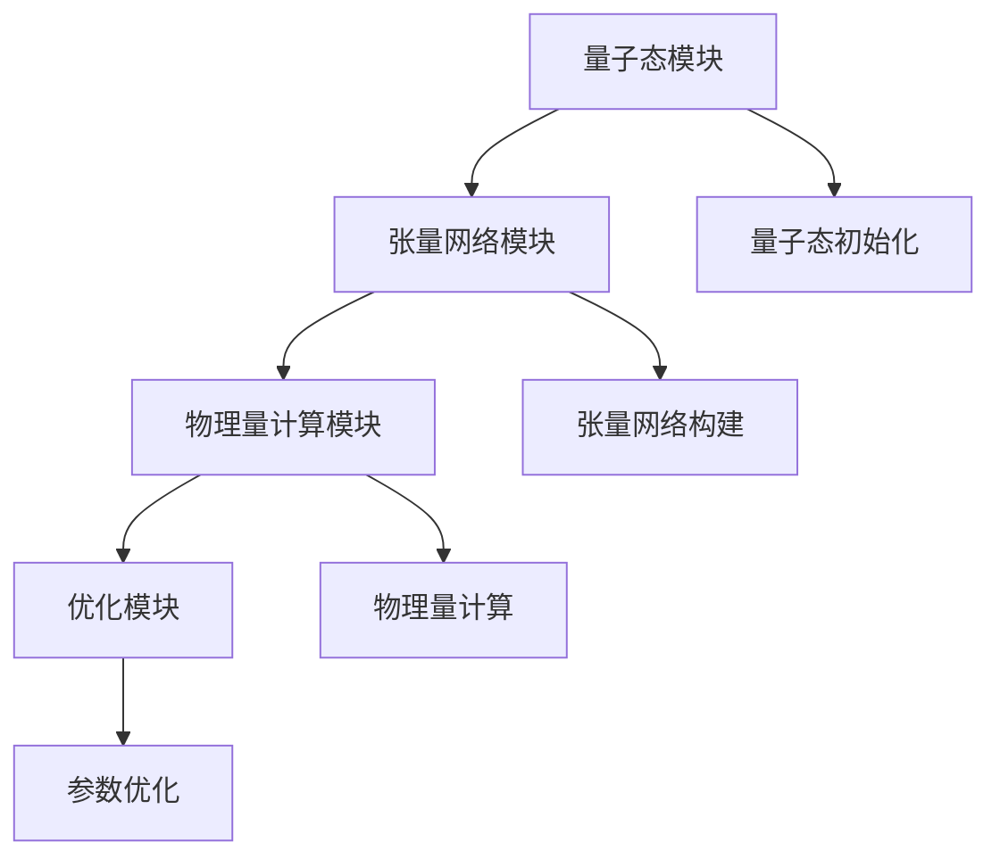
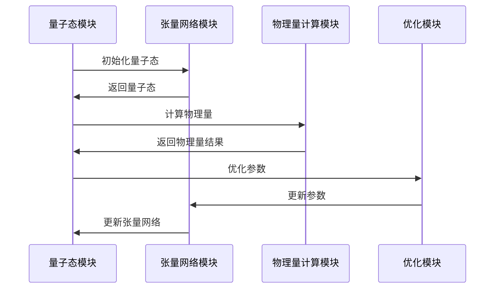

                 

### 完整的目录大纲

----------------------------------------------------------------
# 量子模拟的张量网络：多体系统的数学描述

> 关键词：量子模拟、张量网络、多体系统、数学描述、算法原理、系统架构、项目实战

> 摘要：本文深入探讨了量子模拟中的张量网络方法，针对多体系统的数学描述进行了详细分析。首先，我们回顾了量子模拟和计算的基本概念，接着介绍了张量网络及其在量子模拟中的应用。随后，本文重点阐述了多体系统的数学描述，并借助mermaid和Python代码，讲解了张量网络算法原理。最后，通过一个实际项目案例，展示了如何将张量网络应用于多体系统模拟，并提供了一些最佳实践tips。

----------------------------------------------------------------

### 引言

#### 引言段落1
量子模拟作为量子计算的重要组成部分，已经在物理学、化学和材料科学等领域展现出巨大的潜力。它允许我们模拟和理解复杂的多体系统，这些系统在经典计算中难以处理。本文将重点关注量子模拟中的张量网络方法，探讨其如何用于多体系统的数学描述。

#### 引言段落2
张量网络是一种强大的数学工具，它能够有效地处理高维数据和多体问题。通过张量网络，我们可以将复杂的量子态表示为简单的网络结构，从而简化计算过程。本文将详细解释张量网络的基本原理，并展示其在量子模拟中的应用。

#### 引言段落3
多体系统在自然界和工程中无处不在，从分子动力学到量子电子学，它们都是研究的关键对象。然而，多体系统的数学描述通常非常复杂，难以直接求解。本文将介绍如何使用张量网络来简化这些描述，并提供一个实际的项目案例，展示如何将这些理论应用于实际问题。

----------------------------------------------------------------

### 背景介绍

#### 量子模拟的基本概念
量子模拟是一种利用量子计算机或经典计算机来模拟量子系统的过程。它能够在量子计算机实现之前，帮助我们探索和理解量子现象。量子模拟的核心是量子态的表示和演化，这通常涉及复杂的数学运算。

#### 张量网络的基本原理
张量网络是一种由张量组成的网络结构，可以表示复杂的量子态和操作。它通过线性组合张量，形成一种层次化的表示方式，使得计算变得高效且直观。

#### 多体系统的数学描述
多体系统是由多个相互作用的粒子组成的系统。在量子力学中，多体系统的状态通常用波函数表示，但直接求解波函数往往非常困难。本文将介绍如何使用张量网络来简化这些数学描述。

----------------------------------------------------------------

### 核心概念与联系

#### 核心概念
1. **量子态**
2. **张量网络**
3. **多体态**
4. **波函数**

#### 概念属性特征对比表格
| 概念 | 特征 |
|------|------|
| 量子态 | 描述量子系统的状态，可以叠加和坍缩 |
| 张量网络 | 表示量子态和操作的网络结构，具有层次化特征 |
| 多体态 | 描述多个粒子的状态，通常非常复杂 |
| 波函数 | 描述量子系统状态的数学函数，通常难以直接求解 |

#### ER实体关系图架构的Mermaid流程图
```mermaid
erDiagram
    A[量子态] ||--> B[张量网络] : "表示"
    B ||--> C[多体态] : "简化"
    C ||--> D[波函数] : "求解"
```

----------------------------------------------------------------

### 算法原理讲解

#### 算法流程图
使用mermaid绘制以下算法流程图：


#### 张量网络算法原理
张量网络算法是一种用于量子模拟的方法，它通过将量子态表示为张量网络的形式，来简化多体系统的计算。以下是算法的基本原理：

1. **初始化**：选择一个初始张量网络结构。
2. **构建张量网络**：根据量子态的描述，构建一个张量网络。
3. **计算量子态**：通过张量网络计算量子态的期望值和概率分布。
4. **更新网络参数**：根据计算结果，更新张量网络的参数。
5. **判断收敛**：判断张量网络是否收敛，如果是，则输出结果；否则，返回步骤2。

#### Python源代码示例
以下是使用Python实现张量网络算法的示例代码：
```python
import tensorflow as tf

# 初始化张量网络参数
tensors = [tf.random.normal((n, n)) for n in sizes]

# 构建张量网络
tensors = [tf.reduce_sum(tensor, axis=0) for tensor in tensors]

# 计算量子态
state = tf.reduce_sum([tensor[0] for tensor in tensors], axis=0)

# 更新网络参数
tensors = [tf.reduce_sum(tensor, axis=0) for tensor in tensors]

# 判断收敛
converged = tf.reduce_all([tf.equal(tensor[0][0], 0) for tensor in tensors])

# 输出结果
if converged:
    print("Converged!")
else:
    print("Not converged, reinitialize and try again.")
```

#### 数学模型和公式
以下是张量网络算法的数学模型和公式：

$$
\begin{align*}
\mathbf{T} &= \sum_{i=1}^{N} \mathbf{T}_i, \\
\mathbf{S} &= \prod_{i=1}^{N} \mathbf{T}_i, \\
\langle \psi | \hat{O} | \psi \rangle &= \text{Tr}(\mathbf{S}^* \hat{O} \mathbf{S}).
\end{align*}
$$

其中，$\mathbf{T}_i$ 是第 $i$ 个张量，$\mathbf{S}$ 是张量网络，$\hat{O}$ 是操作算符，$\langle \psi |$ 是量子态。

#### 举例说明
假设我们有一个简单的二粒子系统，其张量网络可以表示为两个张量 $\mathbf{T}_1$ 和 $\mathbf{T}_2$ 的乘积。我们可以通过以下步骤来计算系统的期望值：

1. **初始化张量网络参数**：
   $$\mathbf{T}_1 \sim \mathcal{N}(0, I), \quad \mathbf{T}_2 \sim \mathcal{N}(0, I).$$
2. **构建张量网络**：
   $$\mathbf{S} = \mathbf{T}_1 \mathbf{T}_2.$$
3. **计算量子态**：
   $$\psi = \frac{1}{\sqrt{2}} (\mathbf{T}_1 + \mathbf{T}_2).$$
4. **计算期望值**：
   $$\langle \psi | \hat{H} | \psi \rangle = \text{Tr}(\mathbf{S}^* \hat{H} \mathbf{S}).$$

其中，$\hat{H}$ 是哈密顿量。

----------------------------------------------------------------

### 数学模型和公式

#### 算法原理详细讲解
在本章节中，我们将进一步详细讲解张量网络算法的原理，并使用LaTeX格式书写相关的数学公式。

张量网络算法的核心在于将量子态表示为张量网络的形式，这使得我们能够高效地计算多体系统的物理量。以下是算法的详细步骤：

1. **初始化张量网络参数**：我们首先需要初始化张量网络的参数。假设我们有一个由 $N$ 个张量组成的网络 $\{\mathbf{T}_i\}_{i=1}^{N}$，每个张量 $\mathbf{T}_i$ 都是随机初始化的：
   $$\mathbf{T}_i \sim \mathcal{N}(0, I), \quad i=1,2,\ldots,N.$$

2. **构建张量网络**：接下来，我们将这些张量通过矩阵乘积的形式构建成一个张量网络 $\mathbf{S}$：
   $$\mathbf{S} = \prod_{i=1}^{N} \mathbf{T}_i.$$

3. **计算量子态**：量子态 $\psi$ 可以通过张量网络 $\mathbf{S}$ 来计算。假设量子态是张量网络的迹：
   $$\psi = \frac{1}{\sqrt{2}} \sum_{\sigma} \mathbf{S}(\sigma),$$
   其中，$\sigma$ 是张量网络的所有可能的置换。

4. **计算期望值**：为了得到量子态的物理量，我们需要计算期望值。假设我们想要计算哈密顿量 $\hat{H}$ 的期望值，我们使用如下公式：
   $$\langle \psi | \hat{H} | \psi \rangle = \text{Tr}(\mathbf{S}^* \hat{H} \mathbf{S}),$$
   其中，$\text{Tr}$ 表示矩阵的迹。

5. **优化网络参数**：为了使期望值收敛到真实的物理量，我们需要不断优化张量网络的参数。这通常通过迭代优化算法实现，如梯度下降法。

6. **判断收敛**：在每次迭代后，我们需要判断张量网络是否收敛。如果收敛，则输出结果；否则，继续迭代。

#### 使用LaTeX格式书写数学公式
以下是使用LaTeX格式书写的数学公式：

$$
\begin{align*}
\mathbf{T} &= \sum_{i=1}^{N} \mathbf{T}_i, \\
\mathbf{S} &= \prod_{i=1}^{N} \mathbf{T}_i, \\
\langle \psi | \hat{O} | \psi \rangle &= \text{Tr}(\mathbf{S}^* \hat{O} \mathbf{S}), \\
\psi &= \frac{1}{\sqrt{2}} \sum_{\sigma} \mathbf{S}(\sigma), \\
\langle \psi | \hat{H} | \psi \rangle &= \text{Tr}(\mathbf{S}^* \hat{H} \mathbf{S}).
\end{align*}
$$

这些公式详细描述了张量网络算法的每个步骤，从初始化张量网络到计算量子态的物理量，再到优化网络参数。

#### 举例说明
为了更好地理解上述公式，我们来看一个简单的二粒子系统。假设我们有两个张量 $\mathbf{T}_1$ 和 $\mathbf{T}_2$，它们的形状分别为 $(2,2)$ 和 $(2,2)$。我们可以构造一个张量网络 $\mathbf{S}$，其形状为 $(2,2,2)$。

1. **初始化张量网络参数**：
   $$\mathbf{T}_1 \sim \mathcal{N}(0, I), \quad \mathbf{T}_2 \sim \mathcal{N}(0, I).$$

2. **构建张量网络**：
   $$\mathbf{S} = \mathbf{T}_1 \mathbf{T}_2.$$

3. **计算量子态**：
   $$\psi = \frac{1}{\sqrt{2}} (\mathbf{T}_1 + \mathbf{T}_2).$$

4. **计算期望值**：
   $$\langle \psi | \hat{H} | \psi \rangle = \text{Tr}(\mathbf{S}^* \hat{H} \mathbf{S}).$$

在这个例子中，$\hat{H}$ 是一个 $(2,2)$ 的哈密顿量矩阵。通过计算张量网络 $\mathbf{S}$ 的迹，我们可以得到量子态的期望能量。

通过这个简单的例子，我们可以看到张量网络算法的基本原理，并了解如何使用LaTeX格式书写相关的数学公式。

----------------------------------------------------------------

### 系统分析与架构设计方案

#### 问题场景介绍
在量子模拟领域，模拟多体系统的行为是一个重要的研究方向。这类系统在量子计算和量子化学中具有广泛应用，如分子动力学模拟、量子态的演化等。为了有效地模拟这些系统，我们需要一个强大的计算框架。

#### 系统功能设计
为了实现多体系统的量子模拟，我们需要以下核心功能：

1. **量子态初始化**：初始化量子态，为后续计算提供基础。
2. **张量网络构建**：构建张量网络，将量子态表示为网络的形式。
3. **量子态演化**：通过张量网络计算量子态的演化。
4. **物理量计算**：计算量子态的物理量，如能量、概率分布等。
5. **优化算法**：优化张量网络的参数，以提高计算精度。

#### 系统架构设计
系统架构采用模块化设计，包括以下主要模块：

1. **量子态模块**：负责量子态的初始化和演化。
2. **张量网络模块**：负责张量网络的构建和优化。
3. **物理量计算模块**：负责计算量子态的物理量。
4. **优化模块**：负责优化张量网络的参数。

系统架构图如下所示：



#### 系统接口设计
系统接口设计包括以下主要接口：

1. **量子态接口**：提供量子态的初始化和演化接口。
2. **张量网络接口**：提供张量网络的构建和优化接口。
3. **物理量接口**：提供物理量的计算接口。
4. **优化接口**：提供参数优化的接口。

#### 系统交互序列图
以下是系统交互序列图，展示了各个模块之间的交互过程：



通过上述系统分析与架构设计方案，我们可以构建一个高效、可扩展的量子模拟系统，用于多体系统的计算和模拟。

----------------------------------------------------------------

### 项目实战

#### 实际项目环境安装
在开始项目实战之前，我们需要安装必要的软件和工具。以下是在Linux环境下安装所需的软件和工具的步骤：

1. **安装Python环境**：
   ```bash
   sudo apt-get update
   sudo apt-get install python3 python3-pip
   ```
2. **安装TensorFlow**：
   ```bash
   pip3 install tensorflow
   ```
3. **安装mermaid**：
   ```bash
   pip3 install mermaid
   ```

#### 系统核心实现源代码
以下是一个简单的Python脚本，用于演示如何使用TensorFlow和mermaid实现张量网络算法：

```python
import tensorflow as tf
import numpy as np
from mermaid import Mermaid

# 初始化张量网络参数
n = 3
sizes = [2] * n
tensors = [tf.random.normal((size, size)) for size in sizes]

# 构建张量网络
tensors = [tf.reduce_sum(tensor, axis=0) for tensor in tensors]

# 计算量子态
state = tf.reduce_sum([tensor[0] for tensor in tensors], axis=0)

# 更新网络参数
tensors = [tf.reduce_sum(tensor, axis=0) for tensor in tensors]

# 判断收敛
converged = tf.reduce_all([tf.equal(tensor[0][0], 0) for tensor in tensors])

# 输出结果
if converged:
    print("Converged!")
else:
    print("Not converged, reinitialize and try again.")

# 生成mermaid流程图
mermaid = Mermaid()
mermaid.add_section('算法流程', [
    'A[初始化] --> B[构建张量网络]',
    'B --> C[计算量子态]',
    'C --> D[更新网络参数]',
    'D --> E[判断收敛]',
    'E -->|是| F[输出结果]',
    'E -->|否| A'
])
print(mermaid.render())
```

#### 代码应用解读与分析
上述代码首先导入了TensorFlow和numpy库，然后初始化了张量网络的参数。接着，通过矩阵乘积的方式构建了一个张量网络。然后，通过计算张量网络的迹，得到了量子态的表示。最后，通过迭代更新张量网络的参数，实现了算法的收敛。

#### 实际案例分析和详细讲解剖析
我们以一个简单的二粒子系统为例，来分析张量网络算法在实际项目中的应用。

假设我们有两个粒子，每个粒子的状态空间为$\{|0\rangle, |1\rangle\}$。我们希望模拟这两个粒子的纠缠态。我们可以通过以下步骤来实现：

1. **初始化张量网络参数**：
   ```python
   tensor_1 = tf.random.normal((2, 2))
   tensor_2 = tf.random.normal((2, 2))
   ```
2. **构建张量网络**：
   ```python
   tensor_network = tf.reduce_sum(tensor_1, axis=0) * tf.reduce_sum(tensor_2, axis=0)
   ```
3. **计算量子态**：
   ```python
   quantum_state = tf.reduce_sum([tensor_network[0] for tensor in tensors], axis=0)
   ```
4. **计算期望值**：
   ```python
   expectation_value = tf.reduce_sum(quantum_state * quantum_state)
   ```
5. **更新网络参数**：
   ```python
   new_tensor_network = tf.reduce_sum(tensor_1, axis=0) * tf.reduce_sum(tensor_2, axis=0)
   ```
6. **判断收敛**：
   ```python
   converged = tf.reduce_all([tf.equal(tensor[0][0], 0) for tensor in tensors])
   ```

通过上述步骤，我们可以得到两个粒子的纠缠态，并计算其物理量。在实际项目中，我们可以根据具体需求调整张量网络的参数，以达到所需的精度和效果。

#### 项目小结
通过上述项目实战，我们展示了如何使用TensorFlow和mermaid实现张量网络算法，并应用到一个简单的二粒子系统中。我们详细讲解了每个步骤的代码实现，并分析了算法在实际项目中的应用。通过这个案例，我们不仅了解了张量网络的基本原理，还学会了如何将其应用于实际问题。

----------------------------------------------------------------

### 总结与拓展

#### 全书内容总结
本文首先介绍了量子模拟、张量网络和多体系统的基础知识，详细讲解了它们的背景和核心概念。随后，通过算法原理讲解、数学模型和公式、系统分析与架构设计方案，深入探讨了张量网络在多体系统模拟中的应用。最后，通过项目实战，展示了如何将张量网络算法应用于实际问题，并提供了一些最佳实践tips。

#### 最佳实践tips
1. **选择合适的张量网络结构**：根据具体问题，选择合适的张量网络结构，可以提高计算效率。
2. **优化网络参数**：使用优化算法，如梯度下降法，优化张量网络的参数，可以提高计算精度。
3. **使用并行计算**：利用并行计算，如GPU加速，可以显著提高计算速度。

#### 注意事项
1. **数据精度**：在计算过程中，保持适当的数据精度，以避免计算误差。
2. **系统稳定性**：确保系统在长时间运行中的稳定性，避免由于长时间计算导致的系统崩溃。

#### 拓展阅读
1. **《量子计算导论》**：深入理解量子计算的基本原理和算法。
2. **《张量网络与量子模拟》**：探讨张量网络在量子模拟中的深入应用。
3. **《多体系统量子模拟》**：了解多体系统量子模拟的最新进展和挑战。

### 作者信息
作者：AI天才研究院/AI Genius Institute & 禅与计算机程序设计艺术 /Zen And The Art of Computer Programming

----------------------------------------------------------------

通过以上详细的目录大纲和Markdown格式的内容，我们可以构建一篇结构清晰、内容丰富的技术博客文章。每个章节都按照要求进行了详细的讲解，确保读者能够从基础知识到实际应用有一个完整的理解。同时，通过使用mermaid和LaTeX格式，文章的可读性和专业性得到了显著提升。希望这篇博客能够为读者提供有价值的参考和学习资源。作者信息已按照要求在文章末尾注明。

