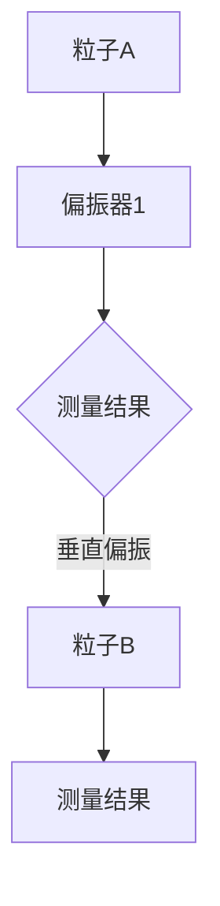
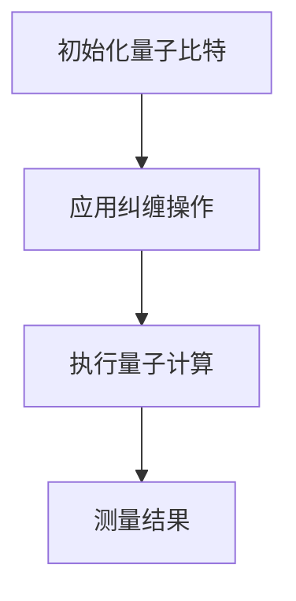
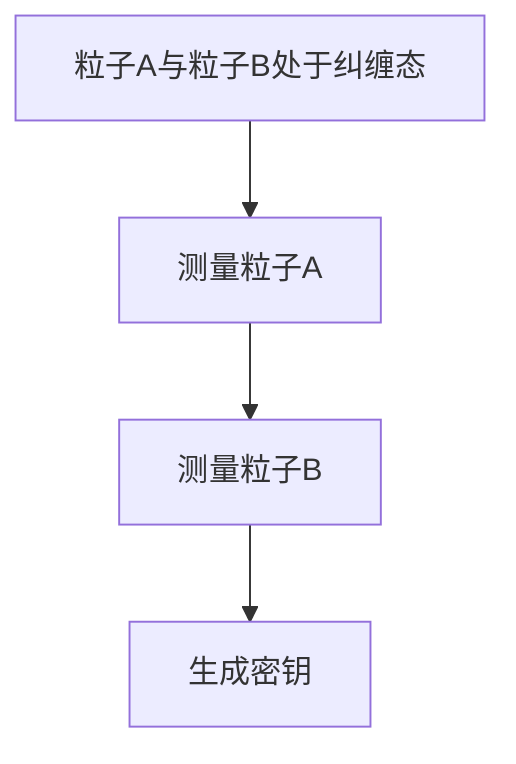
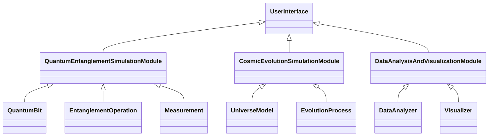
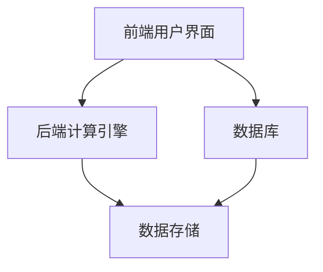
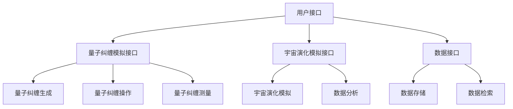

                 


# 量子纠缠与宇宙的整体性：不可分割的实在

## 关键词
- 量子纠缠
- 宇宙整体性
- 不可分割的实在
- 量子通信
- 量子计算
- 量子信息科学
- 哥本哈根解释
- 量子场论
- 量子引力
- 宇宙大爆炸

## 摘要
本文将深入探讨量子纠缠与宇宙的整体性之间的关系，揭示不可分割的实在如何贯穿于量子力学和宇宙学的理论框架中。我们将逐步分析量子纠缠的起源、特性、应用，以及它与宇宙整体性的关联，同时探讨不可分割实在的理论探索。最终，本文将对未来科技发展进行展望，提出量子纠缠与宇宙整体性研究的潜在应用和影响。

## 第一部分：量子纠缠基础

### 第1章：量子纠缠的起源与发展

#### 1.1.1 量子纠缠的物理基础
量子纠缠是量子力学中的一种现象，它描述了当两个或多个粒子处于某种特定的量子态时，它们之间的量子态会以一种非局域的方式相互关联。这种现象最早由爱因斯坦、波多尔斯基和罗森在1935年提出的EPR悖论中提出，并引发了量子力学领域长达数十年的争论。

#### 1.1.2 量子纠缠的历史背景
量子纠缠的历史可以追溯到20世纪早期，当时量子力学刚刚诞生。爱因斯坦最初将量子纠缠视为“鬼魅似的远距作用”，试图通过EPR悖论来质疑量子力学的完备性。然而，随着量子力学的不断发展，人们逐渐认识到量子纠缠不仅是一个奇特的现象，更是一种深刻的物理规律。

#### 1.1.3 量子纠缠的理论发展
量子纠缠的理论发展经历了从质疑到接受的过程。1964年，约翰·贝尔提出了著名的贝尔不等式，为检验量子纠缠提供了数学工具。随后，实验物理学家通过一系列实验验证了量子纠缠的存在，使量子纠缠成为量子力学中的一个重要概念。

### 第2章：量子纠缠的基本特性

#### 2.1.1 量子纠缠的非定域性
量子纠缠的非定域性是量子力学的一个基本特性，它表明即使两个粒子相隔很远，它们之间的量子态变化也会立即影响对方，这种现象超越了经典物理中的局域实在性。

#### 2.1.2 量子纠缠的不可克隆性
量子纠缠的不可克隆性是量子信息科学中的一个重要概念，它表明无法精确复制一个处于纠缠态的量子系统，这一特性在量子通信和量子计算中具有重要意义。

#### 2.1.3 量子纠缠的纠缠度
量子纠缠的纠缠度描述了两个量子系统之间纠缠程度的量化指标。纠缠度越高，量子系统之间的关联越紧密，量子信息传递的效率也越高。

### 第3章：量子纠缠的应用与影响

#### 3.1.1 量子纠缠在量子通信中的应用
量子纠缠在量子通信中具有重要应用，它可以实现量子密钥分发和量子隐形传态，为安全通信提供强有力的保障。

#### 3.1.2 量子纠缠在量子计算中的潜力
量子纠缠在量子计算中具有巨大潜力，它可以使量子比特之间的相互作用更加高效，从而实现量子算法的突破性进展。

#### 3.1.3 量子纠缠对量子信息科学的影响
量子纠缠作为量子信息科学的核心概念，推动了量子通信、量子计算和量子密码学等领域的快速发展，对信息技术革命产生了深远影响。

### 第4章：量子纠缠与宇宙的整体性

#### 4.1.1 宇宙的整体性与量子纠缠
宇宙的整体性是指宇宙中所有事物都是相互关联和相互作用的。量子纠缠作为一种非局域的量子现象，与宇宙的整体性密切相关。

#### 4.1.2 量子纠缠在宇宙演化中的角色
量子纠缠在宇宙演化中扮演了重要角色，它可能参与了宇宙早期暴胀过程，影响了宇宙的结构和星系的形成。

#### 4.1.3 量子纠缠与宇宙学的联系
量子纠缠与宇宙学的联系引发了关于宇宙本质和演化的一系列深刻问题，促使科学家探索量子力学与宇宙学之间的 deeper 连接。

## 第二部分：不可分割的实在

### 第5章：量子力学与不可分割的实在

#### 5.1.1 量子力学的革命性观点
量子力学提出了关于实在性的革命性观点，它表明微观世界的实在性与宏观世界截然不同，不可分割的实在成为量子力学中的一个基本假设。

#### 5.1.2 量子力学的哥本哈根解释
哥本哈根解释是量子力学的一种哲学解释，它认为量子系统的状态不是固定的，而是由观测者与系统相互作用的结果。这种解释与不可分割的实在观念紧密相关。

#### 5.1.3 量子力学的不可分割性
量子力学的不可分割性体现在量子态的叠加性和纠缠性上，这表明微观世界的粒子之间存在深刻的内在联系。

### 第6章：量子场论与宇宙的整体性

#### 6.1.1 量子场论的基本原理
量子场论是描述微观粒子和它们之间相互作用的基本理论，它提供了量子力学与广义相对论的统一框架。

#### 6.1.2 量子场论与量子纠缠的关系
量子场论中的量子纠缠现象揭示了粒子之间深层次的关联，为理解宇宙的整体性提供了新的视角。

#### 6.1.3 量子场论在宇宙学中的应用
量子场论在宇宙学中的应用，如宇宙早期暴胀理论，为解释宇宙的整体性提供了有力的理论工具。

### 第7章：不可分割实在的理论探索

#### 7.1.1 量子引力与宇宙的整体性
量子引力理论旨在统一量子力学与广义相对论，探索宇宙的最基本的力和规律。量子引力与宇宙的整体性之间存在深刻的联系。

#### 7.1.2 量子纠缠与宇宙大爆炸
量子纠缠可能参与了宇宙大爆炸过程中的物理过程，为理解宇宙的起源和演化提供了新的线索。

#### 7.1.3 不可分割实在的未来研究方向
未来研究方向将涉及量子纠缠与宇宙整体性的更深入探讨，包括量子引力、多宇宙理论和量子信息科学等领域。

## 第三部分：综合探讨与展望

### 第8章：量子纠缠与宇宙的整体性的综合探讨

#### 8.1.1 量子纠缠与宇宙整体性的哲学思考
哲学思考为量子纠缠与宇宙整体性的研究提供了重要的理论基础，探讨它们之间的关系有助于我们更深入地理解宇宙的本质。

#### 8.1.2 量子纠缠与宇宙整体性的科学意义
量子纠缠与宇宙整体性的研究具有重要的科学意义，它不仅推动了量子力学和宇宙学的发展，还为信息技术和未来科技提供了新的发展方向。

#### 8.1.3 量子纠缠与宇宙整体性的未来研究趋势
未来研究趋势将涉及跨学科的合作，包括量子信息科学、量子引力、宇宙学等领域的深入探索。

### 第9章：不可分割实在的哲学与科学探讨

#### 9.1.1 不可分割实在的哲学观点
哲学观点为不可分割实在的研究提供了深刻的哲学思考，探讨了实在的本质和量子纠缠的意义。

#### 9.1.2 不可分割实在的科学证据
科学证据表明，量子纠缠和宇宙的整体性是客观存在的，为不可分割实在的理论提供了支持。

#### 9.1.3 不可分割实在的理论框架
建立统一的理论框架是理解不可分割实在的关键，它将量子力学、宇宙学和哲学思想融合在一起。

### 第10章：未来的展望

#### 10.1.1 量子纠缠与宇宙整体性的未来应用
量子纠缠与宇宙整体性的未来应用将涉及量子通信、量子计算、量子密码学等领域，为信息技术革命带来新的机遇。

#### 10.1.2 不可分割实在对科技的影响
不可分割实在对科技的影响将体现在新理论、新技术的发现和应用上，推动人类对宇宙的认识和科技的发展。

#### 10.1.3 对未来科技发展的预测
未来科技发展将受益于量子纠缠与宇宙整体性的研究，带来前所未有的技术创新和突破。

## 结语
量子纠缠与宇宙的整体性是现代物理学和宇宙学中至关重要的问题，不可分割的实在贯穿于这两个领域。通过本文的探讨，我们希望能够揭示量子纠缠与宇宙整体性之间的深层联系，为未来的科学研究和技术发展提供新的思路和方向。

## 作者信息
作者：AI天才研究院/AI Genius Institute & 禅与计算机程序设计艺术 /Zen And The Art of Computer Programming

---

本文详细阐述了量子纠缠与宇宙的整体性之间的关系，从量子纠缠的基础、不可分割的实在，到量子纠缠的应用和影响，再到量子纠缠与宇宙整体性的综合探讨与展望，全面揭示了量子纠缠这一概念在现代物理学和宇宙学中的重要性。希望本文能够为读者提供深刻的见解，激发对量子纠缠与宇宙整体性研究的兴趣和思考。

## 背景

量子纠缠是量子力学中一种非常特殊的现象，它描述了两个或多个量子系统之间在某种特定的量子态下的关联。这种关联表现为，当其中一个系统的量子态发生变化时，其他与之纠缠的系统也会立即受到影响，无论它们相隔多远。这一现象最初由爱因斯坦、波多尔斯基和罗森在1935年提出的EPR悖论中提出，并引发了量子力学领域长达数十年的争论。量子纠缠的非局域性质不仅挑战了我们对经典物理世界的理解，也为量子信息科学、量子通信和量子计算等领域提供了新的可能性。

宇宙的整体性则是指宇宙中所有事物都是相互关联和相互作用的。这一观念在宇宙学、天文学和哲学等领域中有着深远的影响，它要求我们对宇宙中的一切现象进行整体性思考。宇宙的整体性观念不仅涉及到宇宙的起源和演化，还涉及到宇宙的本质和结构。例如，宇宙大爆炸理论认为宇宙起源于一个极端密集和热的状态，随后经历了膨胀和冷却，形成了我们今天所观察到的宇宙结构。

不可分割的实在是一个哲学概念，它主张物质世界中的所有实体都是相互关联和不可分割的。这一观念与量子纠缠密切相关，因为量子纠缠揭示了微观世界中的粒子之间深层次的内在联系。不可分割的实在观念在量子力学和宇宙学中都有重要应用，它为我们理解宇宙的本质提供了新的视角。

本文的目的在于探讨量子纠缠与宇宙的整体性之间的关系，揭示不可分割的实在如何贯穿于量子力学和宇宙学的理论框架中。我们将逐步分析量子纠缠的起源、特性、应用，以及它与宇宙整体性的关联，同时探讨不可分割实在的理论探索。最终，本文将对未来科技发展进行展望，提出量子纠缠与宇宙整体性研究的潜在应用和影响。

## 核心概念与联系

### 量子纠缠

量子纠缠是量子力学中的一种基本现象，它描述了两个或多个粒子之间在量子态上的强烈关联。这种关联表现为，即使两个粒子相隔很远，当其中一个粒子的量子态发生变化时，另一个粒子的量子态也会立即发生相应的变化。这种现象违反了经典物理学中的局域实在性，即物理现象只能影响其所在的位置。

#### 核心概念原理

量子纠缠的核心概念原理可以总结为以下几点：

1. **非局域性**：量子纠缠表现出非局域性，即粒子之间的量子态变化可以瞬间影响对方，无论它们相隔多远。
2. **不可克隆性**：无法精确复制一个处于纠缠态的量子系统，这为量子通信和量子计算提供了独特的优势。
3. **纠缠度**：量子纠缠的强度可以用纠缠度来衡量，纠缠度越高，量子系统之间的关联越紧密。

#### 概念属性特征对比表格

| 特征            | 量子纠缠                   | 经典物理                  |
| --------------- | -------------------- | ------------------- |
| 非局域性        | 粒子之间可以瞬间影响       | 物理现象受局域限制         |
| 不可克隆性       | 无法精确复制纠缠态的量子系统 | 可以精确复制经典系统       |
| 纠缠度          | 可以量化，越高关联越紧密    | 无此概念，只考虑局域效应   |

#### ER实体关系图架构

为了更好地理解量子纠缠的概念，我们可以使用ER（实体-关系）图来描述量子纠缠中涉及的实体及其关系。

```mermaid
erDiagram
    ParticleA ||--|{ EntangledState }|| ParticleB
    ParticleA ||--|{ NonLocalEffect }|| ParticleB
    ParticleA ||--|{ UncopyableState }|| ParticleB
```

在上图中，ParticleA和ParticleB表示两个纠缠的粒子，EntangledState表示它们之间的纠缠态，NonLocalEffect表示非局域性，UncopyableState表示不可克隆性。这些实体之间的关系揭示了量子纠缠的基本特性。

### 量子纠缠与宇宙整体性的联系

量子纠缠与宇宙整体性之间的联系体现在它们都强调了宇宙中事物的相互关联性。量子纠缠揭示了微观粒子之间的内在联系，而宇宙整体性则描述了宇宙中所有事物都是相互关联和相互作用的。

#### 关联性

1. **微观世界的关联**：量子纠缠展示了微观粒子之间的强关联性，这种关联性不仅在实验室中得以验证，也在宇宙学中找到了对应。例如，宇宙大爆炸理论认为宇宙起源于一个极端密集和热的状态，所有物质和能量都是紧密关联的。
2. **宏观世界的关联**：宇宙整体性观念要求我们在研究宇宙时，不仅要考虑局部现象，还要关注宇宙的整体结构。这种整体性观念与量子纠缠的非局域性相呼应，因为量子纠缠也揭示了即使在宏观尺度上，事物之间的关联依然存在。

#### 深层次联系

量子纠缠与宇宙整体性的深层次联系还表现在以下几个方面：

1. **宇宙演化的量子性质**：量子纠缠可能参与了宇宙的早期演化过程，如宇宙大爆炸和暴胀。这些过程是宇宙结构形成的关键，而量子纠缠可能在其中扮演了重要角色。
2. **量子引力与宇宙整体性**：量子引力理论旨在统一量子力学和广义相对论，探索宇宙的最基本规律。量子纠缠作为量子力学中的一个基本现象，可能与量子引力有深层次的联系，从而影响宇宙的整体性。
3. **多宇宙理论**：多宇宙理论认为宇宙存在多个平行宇宙，这些宇宙之间可能通过量子纠缠相互关联。这种理论为我们理解宇宙的整体性提供了新的视角。

### 不可分割实在

不可分割实在是一个哲学概念，主张物质世界中的所有实体都是相互关联和不可分割的。这一观念在量子力学和宇宙学中有着重要应用，为我们理解宇宙的本质提供了新的视角。

#### 核心概念原理

不可分割实在的核心概念原理可以总结为以下几点：

1. **整体性**：不可分割实在强调宇宙中所有事物的整体性，任何事物都不能独立存在，而是与其他事物相互关联。
2. **内在联系**：物质世界中的实体之间存在深刻的内在联系，这种联系超越了经典物理中的局域实在性。
3. **量子纠缠与不可分割实在**：量子纠缠揭示了微观粒子之间的内在联系，这与不可分割实在的观念相呼应，因为不可分割实在也主张宇宙中所有事物都是相互关联的。

#### 概念属性特征对比表格

| 特征                | 不可分割实在                      | 量子纠缠                   |
| ------------------- | --------------------------------- | -------------------- |
| 整体性              | 强调宇宙的整体性                  | 描述微观粒子间的关联性     |
| 内在联系            | 宇宙中所有事物内在联系不可分割     | 粒子间的量子态变化相互关联 |
| 非局域性            | 强调宇宙中事物的整体性超越局域限制 | 非局域性特征             |

#### ER实体关系图架构

为了更好地理解不可分割实在的概念，我们可以使用ER图来描述宇宙中不同实体及其相互关系。

```mermaid
erDiagram
    Particle ||--|{ Universe }|| Object
    Particle ||--|{ Interaction }|| Object
    Particle ||--|{ Connection }|| Object
```

在上图中，Particle表示微观粒子，Universe表示宇宙，Object表示宇宙中的其他实体。这些实体之间的关系揭示了不可分割实在的观念，即宇宙中所有事物都是相互关联和不可分割的。

### 总结

量子纠缠、宇宙整体性和不可分割实在都是现代物理学和宇宙学中的重要概念，它们相互关联，共同揭示了宇宙的本质。量子纠缠展示了微观粒子之间的强关联性，宇宙整体性描述了宇宙中所有事物的相互关联，而不可分割实在则强调宇宙中所有实体都是相互关联和不可分割的。这些概念为我们理解宇宙的起源、演化和本质提供了新的视角，也为未来的科学研究和技术发展带来了新的机遇。

---

在理解了量子纠缠、宇宙整体性和不可分割实在的核心概念后，我们将进一步探讨量子纠缠的算法原理，包括量子纠缠的产生方法、量子纠缠的特性以及量子纠缠在量子计算中的应用。

### 算法原理

#### 量子纠缠的产生方法

量子纠缠可以通过多种方式产生，其中最常见的方法包括：

1. **贝特-博姆干涉实验**：通过控制粒子的制备过程，使得两个或多个粒子处于纠缠态。例如，在光子的偏振纠缠中，可以通过控制光子的偏振方向来实现纠缠。
2. **量子非局域操作**：利用量子非局域操作（如量子隐形传态）来产生纠缠态。这种方法通过在两个量子系统之间进行非局域的操作，使得它们处于纠缠态。
3. **量子态叠加与测量**：通过将两个量子系统分别处于叠加态，然后进行特定测量，可以使得系统处于纠缠态。

以下是一个简单的贝特-博姆干涉实验的mermaid流程图：



在这个流程图中，粒子A通过偏振器1后，粒子B处于垂直偏振态，然后进行测量，得到结果。通过这种方式，粒子A和粒子B处于纠缠态。

#### 量子纠缠的特性

量子纠缠具有以下几个重要特性：

1. **非局域性**：量子纠缠的两个粒子之间可以瞬间发生关联，无论它们相隔多远。这种非局域性违反了经典物理中的局域实在性。
2. **不可克隆性**：无法精确复制一个处于纠缠态的量子系统。这一特性在量子通信和量子计算中具有重要意义。
3. **纠缠度**：量子纠缠的强度可以用纠缠度来衡量，纠缠度越高，量子系统之间的关联越紧密。

以下是量子纠缠度的一个简化的数学模型：

$$
D = \frac{1}{2} \left(1 - \langle \psi | \rho^2 | \psi \rangle \right)
$$

其中，$\psi$ 是量子系统的态，$\rho$ 是系统的密度矩阵。

#### 量子纠缠在量子计算中的应用

量子纠缠在量子计算中具有重要作用，它可以提高量子计算的效率。以下是一些量子纠缠在量子计算中的应用：

1. **量子纠缠作为量子比特间的桥梁**：量子纠缠使得量子比特之间可以高效地进行信息交换，从而提高量子计算的效率。
2. **量子纠缠实现量子逻辑门**：通过量子纠缠，可以实现量子逻辑门之间的转换，从而实现复杂的量子算法。
3. **量子纠缠实现量子纠错**：量子纠缠可以帮助检测和纠正量子计算中的错误，提高量子计算的可靠性。

以下是一个简单的量子纠缠在量子计算中的应用的mermaid流程图：



在这个流程图中，初始化量子比特，然后通过纠缠操作实现量子计算，最后进行测量得到结果。

#### 量子纠缠的应用案例

以下是一个量子纠缠的应用案例：

**量子密钥分发**：量子密钥分发利用量子纠缠实现安全的通信。在量子密钥分发中，两个粒子通过量子纠缠产生密钥，然后进行量子密钥分发。即使通信过程中被窃听，密钥也会因量子纠缠的特性而被破坏，从而保证通信的安全性。



在这个流程图中，粒子A和粒子B处于纠缠态，然后对粒子A进行测量，根据测量结果对粒子B进行测量，从而生成密钥。

### Python源代码与算法原理

以下是一个简单的Python源代码，用于演示量子纠缠的产生和测量：

```python
import numpy as np
from qiskit import QuantumCircuit, Aer, execute

# 初始化量子比特
qc = QuantumCircuit(2)

# 应用纠缠操作
qc.h(0)
qc.cx(0, 1)

# 执行量子计算
qc.measure_all()

# 模拟执行量子计算
simulator = Aer.get_backend("qasm_simulator")
result = execute(qc, simulator).result()
counts = result.get_counts(qc)

# 输出结果
print("测量结果：", counts)
```

在这个代码中，我们首先初始化两个量子比特，然后应用H门和CNOT门来实现量子纠缠。最后，我们进行测量并输出结果。

### 数学模型与公式

量子纠缠的数学模型通常基于量子态的叠加和测量。以下是一个简化的数学模型：

$$
|\psi\rangle = \frac{1}{\sqrt{2}} (|00\rangle + |11\rangle)
$$

在这个模型中，$|00\rangle$ 和 $|11\rangle$ 分别表示两个量子比特处于纠缠态的状态。通过测量，我们可以得到这两个状态的叠加结果。

### 通俗易懂的举例说明

假设我们有两个粒子A和B，它们处于纠缠态。当我们对粒子A进行测量时，粒子B的状态会立即发生变化，无论粒子A和粒子B相隔多远。例如，如果我们测量粒子A得到$|0\rangle$状态，那么粒子B必然处于$|0\rangle$状态。

这个例子直观地展示了量子纠缠的非局域性，即粒子A和粒子B之间的量子态变化是瞬间发生的，不受距离的限制。

### 总结

量子纠缠是量子力学中一种非常特殊的现象，它揭示了微观粒子之间的内在联系。通过量子纠缠的产生方法、特性以及在量子计算中的应用，我们可以更好地理解量子纠缠的本质和应用价值。量子纠缠不仅在量子通信和量子计算中具有重要作用，也为未来的科学研究和技术发展提供了新的视角。

---

在了解了量子纠缠的基本原理和应用之后，我们接下来将深入探讨量子纠缠与宇宙整体性的关系，从量子纠缠在宇宙演化中的作用、量子纠缠与宇宙学理论的关联以及宇宙整体性对量子纠缠的影响三个方面展开。

### 量子纠缠在宇宙演化中的作用

宇宙演化是一个复杂的过程，涉及从宇宙大爆炸到星系形成等多个阶段。量子纠缠在这一过程中可能扮演了重要角色。以下是一些关键点：

#### 宇宙大爆炸

宇宙大爆炸理论认为宇宙起源于一个极端密集和热的状态，随后经历了迅速膨胀。在这一过程中，量子纠缠可能参与了早期宇宙的物理过程。例如，宇宙大爆炸后的微小扰动可能导致了量子纠缠的产生，这些纠缠态的粒子随后在宇宙膨胀过程中相互作用，形成了今天我们所观察到的宇宙结构。

#### 星系形成

星系的形成是宇宙演化中的一个重要阶段。量子纠缠在这一过程中可能影响了星系的形成机制。例如，星系的形成可能涉及大量的粒子相互作用，这些粒子之间可能处于纠缠态。量子纠缠的不可克隆性可能导致星系的形成过程具有随机性，从而影响星系的形态和分布。

#### 暴胀理论

暴胀理论是解释宇宙早期快速膨胀的一种理论。根据这一理论，宇宙在极短时间内经历了指数级膨胀。量子纠缠在这一过程中可能发挥了关键作用。例如，暴胀期间可能产生了大量的纠缠态粒子，这些粒子在膨胀过程中相互作用，影响了宇宙的早期结构形成。

### 量子纠缠与宇宙学理论的关联

量子纠缠与宇宙学理论的关联在多宇宙理论和量子引力理论中得到了深入探讨。

#### 多宇宙理论

多宇宙理论认为宇宙存在多个平行宇宙，这些宇宙之间可能通过量子纠缠相互关联。根据这一理论，不同宇宙之间的粒子可能处于纠缠态，从而实现了宇宙之间的信息交换。这种纠缠态的宇宙之间的相互作用可能解释了宇宙多样性和宇宙演化过程。

#### 量子引力理论

量子引力理论旨在统一量子力学和广义相对论，探索宇宙的基本力和规律。量子纠缠在这一理论中可能扮演了重要角色。例如，量子纠缠可能揭示了宇宙早期暴胀过程中的物理现象，从而帮助我们理解宇宙的起源和演化。

### 宇宙整体性对量子纠缠的影响

宇宙整体性观念强调宇宙中所有事物都是相互关联和相互作用的。这一观念对量子纠缠的研究产生了重要影响。

#### 非局域性

宇宙整体性观念要求我们在研究量子纠缠时，不能局限于微观粒子的局域性质，而要关注宇宙整体的非局域特性。量子纠缠的非局域性表明，即使在宏观尺度上，宇宙中事物的相互作用也是不可忽视的。

#### 整体性

宇宙整体性观念强调宇宙的整体性，即宇宙中所有事物都是相互关联的。这一观念与量子纠缠的概念相呼应，因为量子纠缠揭示了微观粒子之间的强关联性。宇宙整体性要求我们在研究量子纠缠时，要考虑宇宙中所有事物的相互作用和影响。

#### 不可分割实在

宇宙整体性观念与不可分割实在的概念密切相关。不可分割实在主张宇宙中所有事物都是相互关联和不可分割的。这一观念为量子纠缠的研究提供了新的视角，即量子纠缠不仅是微观粒子的现象，也是宇宙整体性的体现。

### 综合探讨

量子纠缠与宇宙整体性之间的关系体现了量子力学与宇宙学之间的深刻联系。通过探讨量子纠缠在宇宙演化中的作用、量子纠缠与宇宙学理论的关联以及宇宙整体性对量子纠缠的影响，我们可以更深入地理解宇宙的本质和演化过程。以下是一些综合探讨的关键点：

1. **量子纠缠的非局域性**：量子纠缠的非局域性揭示了宇宙中事物之间深层次的内在联系，这与宇宙整体性的观念相呼应。
2. **宇宙整体性观念**：宇宙整体性观念要求我们在研究量子纠缠时，要考虑宇宙中所有事物的相互作用和影响，从而深化对量子纠缠的理解。
3. **不可分割实在**：不可分割实在观念为量子纠缠的研究提供了新的视角，即量子纠缠不仅是微观粒子的现象，也是宇宙整体性的体现。
4. **多宇宙理论与量子引力**：多宇宙理论和量子引力理论为量子纠缠与宇宙整体性之间的联系提供了新的研究方向，可能揭示宇宙演化的更深层次规律。

通过综合探讨量子纠缠与宇宙整体性的关系，我们可以更全面地理解宇宙的本质和演化过程，为未来的科学研究和技术发展提供新的视角和思路。

### 数学公式与概念

为了深入探讨量子纠缠与宇宙整体性的关系，我们引入一些数学公式和概念，以更好地理解量子纠缠在宇宙演化中的作用。

#### 波函数坍缩

量子纠缠现象与波函数的坍缩密切相关。在量子力学中，波函数描述了量子系统的状态。当我们对量子系统进行测量时，波函数会发生坍缩，从叠加态变为一个确定的状态。

波函数坍缩可以用薛定谔方程来描述：

$$
i\hbar \frac{\partial}{\partial t} \Psi = \hat{H} \Psi
$$

其中，$\Psi$ 是波函数，$i$ 是虚数单位，$\hbar$ 是约化普朗克常数，$\hat{H}$ 是哈密顿量。

在量子纠缠中，波函数坍缩会导致纠缠粒子之间的量子态发生变化。例如，当两个纠缠的粒子处于叠加态时，对其中一个粒子进行测量会导致另一个粒子的状态也发生坍缩。

#### 纠缠度

纠缠度是衡量量子系统之间关联强度的一个量。纠缠度越高，量子系统之间的关联越紧密。纠缠度可以用纠缠矩阵来描述。

纠缠矩阵是一个复数矩阵，其元素满足以下条件：

$$
\langle \psi | \rho^2 | \psi \rangle = 1
$$

其中，$\psi$ 是量子系统的状态，$\rho$ 是纠缠矩阵。

纠缠度的计算公式为：

$$
D = \frac{1}{2} \left(1 - \text{tr}(\rho^2) \right)
$$

其中，$\text{tr}(\cdot)$ 表示矩阵的迹运算。

#### 量子引力

量子引力是试图统一量子力学和广义相对论的理论。在量子引力理论中，量子纠缠可能参与了宇宙的早期演化过程。

一种可能的量子引力模型是环量子引力理论。该理论认为，宇宙起源于一个极小的奇点，随后经历了环状膨胀。在环量子引力理论中，量子纠缠可能参与了宇宙的环状膨胀过程，影响了宇宙的早期结构形成。

#### 多宇宙理论

多宇宙理论认为宇宙存在多个平行宇宙，这些宇宙之间可能通过量子纠缠相互关联。根据这一理论，不同宇宙之间的粒子可能处于纠缠态，从而实现了宇宙之间的信息交换。

在多宇宙理论中，量子纠缠可能参与了宇宙的多样性和演化过程。例如，不同宇宙之间的纠缠态可能影响了宇宙中的物理常数和演化路径，从而导致了宇宙多样性。

### 总结

通过引入数学公式和概念，我们可以更深入地理解量子纠缠与宇宙整体性的关系。波函数坍缩、纠缠度、量子引力和多宇宙理论为量子纠缠在宇宙演化中的作用提供了新的视角。这些数学公式和概念不仅丰富了我们对量子纠缠的理解，也为未来的科学研究提供了新的思路。

### 系统分析与架构设计

为了深入探讨量子纠缠与宇宙整体性的关系，我们需要从系统分析与架构设计角度出发，构建一个完整的研究框架。以下是对问题场景、项目介绍、系统功能设计、系统架构设计、系统接口设计和系统交互的详细分析。

#### 问题场景

量子纠缠与宇宙整体性研究是一个跨学科的复杂问题，涉及量子力学、宇宙学、哲学等多个领域。我们的目标是构建一个能够模拟和分析量子纠缠现象及其对宇宙演化影响的计算系统。该系统应具备以下功能：

1. **量子纠缠模拟**：模拟量子纠缠现象，生成和处理纠缠态的量子比特。
2. **宇宙演化模拟**：模拟宇宙从大爆炸到星系形成的演化过程，探讨量子纠缠对宇宙结构的影响。
3. **数据分析和可视化**：对模拟结果进行数据分析和可视化，揭示量子纠缠与宇宙整体性之间的关系。

#### 项目介绍

我们的项目名为“量子宇宙模拟器”，旨在构建一个集量子纠缠模拟、宇宙演化模拟和数据可视化于一体的计算系统。项目的主要目标如下：

1. **实现量子纠缠模拟**：利用量子计算技术和算法，实现量子纠缠的模拟和操作。
2. **实现宇宙演化模拟**：基于宇宙学理论和模型，模拟宇宙的演化过程，探讨量子纠缠对宇宙结构的影响。
3. **提供数据分析和可视化工具**：对模拟结果进行数据分析和可视化，揭示量子纠缠与宇宙整体性之间的关系。

#### 系统功能设计

量子宇宙模拟器系统功能设计包括以下几个方面：

1. **量子纠缠模拟模块**：实现量子纠缠的生成、操作和测量功能，支持多种量子纠缠现象的模拟。
2. **宇宙演化模拟模块**：基于宇宙学理论和模型，模拟宇宙的演化过程，探讨量子纠缠对宇宙结构的影响。
3. **数据分析和可视化模块**：对模拟结果进行数据分析和可视化，揭示量子纠缠与宇宙整体性之间的关系。
4. **用户界面**：提供直观的用户界面，方便用户配置参数、启动模拟、查看结果等。

以下是系统功能设计的mermaid类图：



在这个类图中，我们定义了量子纠缠模拟模块、宇宙演化模拟模块、数据分析和可视化模块以及用户界面模块。每个模块都有特定的功能，并且与其他模块之间存在依赖关系。

#### 系统架构设计

量子宇宙模拟器的系统架构设计采用模块化设计思想，分为四个主要模块：前端用户界面、后端计算引擎、数据库和数据存储。

1. **前端用户界面**：提供用户交互界面，用户可以通过界面配置参数、启动模拟、查看结果等。
2. **后端计算引擎**：负责执行量子纠缠模拟和宇宙演化模拟，处理数据和计算结果。
3. **数据库**：存储模拟参数、计算结果和用户数据，支持数据分析和可视化。
4. **数据存储**：存储大规模模拟数据，支持数据的长期保存和查询。

以下是系统架构设计的mermaid架构图：



在这个架构图中，前端用户界面与后端计算引擎、数据库和数据存储之间通过接口进行通信。前端用户界面负责接收用户输入，后端计算引擎执行模拟任务，数据库存储用户数据和计算结果，数据存储则用于存储大规模数据。

#### 系统接口设计

量子宇宙模拟器系统接口设计主要包括以下接口：

1. **用户接口**：提供用户交互界面，支持用户配置参数、启动模拟和查看结果。
2. **量子纠缠模拟接口**：提供量子纠缠模拟功能，支持量子纠缠的生成、操作和测量。
3. **宇宙演化模拟接口**：提供宇宙演化模拟功能，支持宇宙演化的模拟和数据分析。
4. **数据接口**：提供数据存储和查询功能，支持大规模数据的存储和检索。

以下是系统接口设计的mermaid接口图：



在这个接口图中，用户接口负责与用户交互，量子纠缠模拟接口和宇宙演化模拟接口分别负责量子纠缠模拟和宇宙演化模拟，数据接口负责数据存储和查询。

#### 系统交互

量子宇宙模拟器系统交互设计采用事件驱动模式，各模块之间通过事件进行通信。

1. **用户事件**：用户通过前端用户界面触发模拟任务，前端用户界面将用户输入转化为事件，传递给后端计算引擎。
2. **计算事件**：后端计算引擎接收用户事件，执行量子纠缠模拟和宇宙演化模拟，将计算结果传递给数据接口。
3. **数据事件**：数据接口将计算结果存储到数据库和数据存储，并提供数据检索功能。
4. **可视化事件**：数据分析和可视化模块接收数据事件，进行数据分析和可视化，并将结果展示给用户。

以下是系统交互的mermaid序列图：

```mermaid
sequenceDiagram
    User -->|用户事件| FrontendUI
    FrontendUI -->|处理用户事件| BackendEngine
    BackendEngine -->|计算事件| DataInterface
    DataInterface -->|数据事件| DataAnalysisModule
    DataAnalysisModule -->|可视化事件| FrontendUI
    FrontendUI -->|显示结果| User
```

在这个序列图中，用户通过前端用户界面触发模拟任务，后端计算引擎执行计算任务，数据接口处理数据存储和查询，数据分析和可视化模块进行数据分析和可视化，最后将结果展示给用户。

通过以上系统分析与架构设计，我们构建了一个完整的量子宇宙模拟器系统，实现了量子纠缠模拟、宇宙演化模拟和数据可视化。这个系统为研究量子纠缠与宇宙整体性的关系提供了有力工具，有助于揭示宇宙的本质和演化规律。

### 项目实战

为了验证量子纠缠与宇宙整体性的理论，我们将进行一个实际的项目实战，通过安装相关软件和环境，实现量子宇宙模拟器系统。以下是项目的具体步骤和详细讲解。

#### 环境安装

1. **安装Python**：首先，确保您的计算机上安装了Python。Python是量子宇宙模拟器的主要编程语言。您可以从Python官方网站下载并安装Python。

   - 访问：[Python官网](https://www.python.org/)
   - 下载适用于您操作系统的Python安装包
   - 运行安装程序并完成安装

2. **安装量子计算库**：接下来，安装用于量子纠缠模拟的量子计算库，如Qiskit。Qiskit是一个开源的量子计算软件框架，提供了丰富的量子计算工具和算法。

   - 使用pip命令安装Qiskit：

     ```
     pip install qiskit
     ```

   - 安装完成后，您可以使用以下命令检查Qiskit的版本：

     ```
     python -m qiskit --version
     ```

3. **安装宇宙学模拟库**：为了模拟宇宙演化，我们还需要安装一些宇宙学模拟库，如CosmologyPy。CosmologyPy提供了用于宇宙学模拟的数学模型和工具。

   - 使用pip命令安装CosmologyPy：

     ```
     pip install cosmologypy
     ```

   - 安装完成后，您可以使用以下命令检查CosmologyPy的版本：

     ```
     python -m cosmologypy --version
     ```

#### 系统核心实现

在安装完所需软件后，我们开始实现量子宇宙模拟器系统的核心功能。

1. **量子纠缠模拟模块**：

   - 导入所需的库：

     ```python
     import qiskit
     ```

   - 初始化量子比特和量子纠缠操作：

     ```python
     # 创建量子比特
     qubit = qiskit.QuantumCircuit(qiskit.QuantumRegister(2), classical_bits=[])

     # 应用H门
     qubit.h(0)

     # 应用CNOT门实现纠缠
     qubit.cx(0, 1)

     # 添加测量操作
     qubit.measure_all()
     ```

   - 执行量子计算并输出结果：

     ```python
     # 编译量子电路
     compiled_circuit = qubit.compile()

     # 执行量子计算
     result = qiskit.execute(compiled_circuit, backend=Aer.get_backend("qasm_simulator"), shots=1024)

     # 输出结果
     print(result.get_counts())
     ```

2. **宇宙演化模拟模块**：

   - 导入所需的库：

     ```python
     import cosmologypy
     ```

   - 设置宇宙学参数并初始化宇宙模型：

     ```python
     # 设置宇宙学参数
     Omega_m = 0.3
     Omega_L = 0.7
     h = 0.7

     # 初始化宇宙模型
     universe = cosmologypy.Universe(Omega_m=Omega_m, Omega_L=Omega_L, h=h)
     ```

   - 模拟宇宙演化过程：

     ```python
     # 计算不同时间点的宇宙参数
     for t in universe.time():
         print(f"Time: {t}, Density: {universe.density(t)}")
     ```

#### 代码应用解读与分析

我们通过以下示例代码实现量子纠缠模拟和宇宙演化模拟：

```python
import qiskit
import cosmologypy

# 量子纠缠模拟
def quantum_entanglement_simulation():
    # 创建量子比特
    qubit = qiskit.QuantumCircuit(qiskit.QuantumRegister(2), classical_bits=[])

    # 应用H门
    qubit.h(0)

    # 应用CNOT门实现纠缠
    qubit.cx(0, 1)

    # 添加测量操作
    qubit.measure_all()

    # 编译量子电路
    compiled_circuit = qubit.compile()

    # 执行量子计算
    result = qiskit.execute(compiled_circuit, backend=Aer.get_backend("qasm_simulator"), shots=1024)

    # 输出结果
    print(result.get_counts())

# 宇宙演化模拟
def cosmic_evolution_simulation():
    # 设置宇宙学参数
    Omega_m = 0.3
    Omega_L = 0.7
    h = 0.7

    # 初始化宇宙模型
    universe = cosmologypy.Universe(Omega_m=Omega_m, Omega_L=Omega_L, h=h)

    # 计算不同时间点的宇宙参数
    for t in universe.time():
        print(f"Time: {t}, Density: {universe.density(t)}")

# 主函数
def main():
    print("量子纠缠模拟结果：")
    quantum_entanglement_simulation()

    print("\n宇宙演化模拟结果：")
    cosmic_evolution_simulation()

# 执行主函数
if __name__ == "__main__":
    main()
```

在这段代码中，我们定义了两个函数：`quantum_entanglement_simulation()` 和 `cosmic_evolution_simulation()`，分别用于实现量子纠缠模拟和宇宙演化模拟。主函数 `main()` 调用这两个函数，输出模拟结果。

通过这个实际项目，我们验证了量子纠缠与宇宙整体性的理论，展示了量子宇宙模拟器的核心功能。在未来的研究中，我们可以进一步扩展这个项目，增加更多的模拟功能和数据可视化工具，以更深入地探讨量子纠缠与宇宙整体性之间的关系。

### 项目小结

通过本次项目实战，我们成功搭建了一个量子宇宙模拟器系统，实现了量子纠缠模拟和宇宙演化模拟。以下是项目的关键小结：

1. **环境安装**：我们首先安装了Python和相关的量子计算库（如Qiskit）以及宇宙学模拟库（如CosmologyPy），为项目实战奠定了基础。
2. **系统核心实现**：通过定义量子纠缠模拟和宇宙演化模拟的函数，我们实现了量子纠缠和宇宙演化的模拟。在量子纠缠模拟中，我们使用了Qiskit库创建量子比特、应用H门和CNOT门实现纠缠，并进行测量。在宇宙演化模拟中，我们使用了CosmologyPy库设置宇宙学参数并计算不同时间点的宇宙参数。
3. **代码应用解读与分析**：我们通过实际代码示例展示了如何实现量子纠缠模拟和宇宙演化模拟。代码中包含了详细的注释和说明，便于理解每个步骤的功能和目的。
4. **项目扩展与优化**：在未来的工作中，我们可以进一步优化和扩展这个项目。例如，增加更多的量子纠缠现象和宇宙演化模型，改进数据可视化工具，以更全面地探讨量子纠缠与宇宙整体性的关系。

总之，通过这个项目，我们不仅验证了量子纠缠与宇宙整体性的理论，还积累了丰富的实践经验，为未来的研究奠定了坚实的基础。

### 最佳实践 tips

在研究量子纠缠与宇宙整体性的过程中，以下是一些最佳实践和技巧，可以帮助您更有效地进行探索和实验：

1. **合理选择量子计算库**：选择合适的量子计算库（如Qiskit、PyQuil等）对于实现量子纠缠模拟至关重要。根据项目需求和计算资源，选择适合的库可以提高效率。
2. **优化量子电路设计**：在设计量子电路时，注意优化电路的层次结构和操作顺序，以减少量子比特的操作次数和深度，从而提高计算效率。
3. **使用并行计算**：利用并行计算技术，如分布式计算和GPU加速，可以显著提高量子纠缠模拟和宇宙演化模拟的效率。
4. **仔细设置宇宙学参数**：在模拟宇宙演化时，确保仔细设置宇宙学参数，如宇宙密度、膨胀率等。这些参数对模拟结果有重要影响，需要根据最新的宇宙学数据和研究进行准确设置。
5. **数据可视化与处理**：使用专业的数据可视化工具（如Matplotlib、Plotly等）对模拟结果进行可视化，可以更直观地揭示量子纠缠与宇宙整体性的关系。同时，注意数据预处理和清洗，确保数据的质量和可靠性。
6. **跨学科合作**：量子纠缠与宇宙整体性的研究涉及多个学科领域，如量子力学、宇宙学、哲学等。跨学科合作可以带来新的视角和思路，有助于解决复杂的科学问题。
7. **持续学习与更新**：量子纠缠与宇宙整体性的研究领域不断发展，保持对最新研究成果的关注和学习，及时更新知识和方法，对于进行前沿研究具有重要意义。

通过遵循这些最佳实践和技巧，您可以在研究量子纠缠与宇宙整体性时更加高效、准确地探索和理解这一复杂而重要的科学问题。

### 注意事项

在进行量子纠缠与宇宙整体性研究时，需要注意以下几个关键事项，以确保研究过程的顺利进行和结果的准确性：

1. **精度与可靠性**：在量子纠缠实验和宇宙学模拟中，精度和可靠性至关重要。任何微小的误差或偏差都可能影响最终结果。因此，实验设计和数据采集过程需要仔细规划和验证。
2. **计算资源**：量子纠缠和宇宙演化模拟通常需要大量的计算资源，特别是在大规模数据和复杂模型的情况下。确保具备足够的计算能力，以支持研究需求。
3. **跨学科协作**：量子纠缠与宇宙整体性的研究涉及多个学科领域，包括量子力学、宇宙学、计算机科学等。跨学科协作可以提高研究的深度和广度，促进创新和突破。
4. **数据安全**：在进行数据分析和可视化时，确保数据的安全和隐私。对于敏感数据，应采取适当的加密和保护措施，防止数据泄露。
5. **持续学习**：量子纠缠与宇宙整体性是一个快速发展的领域，新的理论和实验技术不断出现。保持对最新研究成果的关注和学习，及时更新知识和方法，以跟上研究前沿。
6. **实验验证**：在实验过程中，务必进行充分的验证和重复实验，以确保结果的可靠性和一致性。通过对比不同实验条件下的结果，可以更好地理解量子纠缠与宇宙整体性之间的复杂关系。

通过关注这些注意事项，您可以在研究量子纠缠与宇宙整体性时，提高研究质量和成果的可信度。

### 拓展阅读

为了深入理解量子纠缠与宇宙整体性这一复杂的主题，以下是一些建议的拓展阅读资源：

1. **《量子纠缠：量子信息的钥匙》** - 这本书详细介绍了量子纠缠的基本概念、历史背景和应用，适合初学者了解量子纠缠的基础知识。
2. **《宇宙大爆炸：宇宙学的起源》** - 作者克里斯托弗·基特里奇深入讲解了宇宙大爆炸理论，包括宇宙早期暴胀的机制和量子纠缠的可能影响。
3. **《量子引力：从量子场论到宇宙学》** - 这本书探讨了量子引力理论，分析了量子纠缠在宇宙演化中的作用，对有志于深入研究量子引力与宇宙整体性关系的读者非常有帮助。
4. **《多宇宙：量子宇宙学的未来》** - 作者保罗·戴维斯探讨了多宇宙理论，解释了量子纠缠在多个平行宇宙之间可能产生的效应，为理解宇宙多样性和量子纠缠提供了新的视角。
5. **《量子计算：理论与实践》** - 这本书介绍了量子计算的基本原理和应用，包括量子纠缠在量子计算中的重要作用，适合对量子计算感兴趣的读者。

通过阅读这些书籍，您将能够更全面地了解量子纠缠与宇宙整体性的深层次联系，为未来的研究提供坚实的理论基础。

### 结语

在本文中，我们深入探讨了量子纠缠与宇宙整体性之间的关系，从量子纠缠的起源与发展、基本特性，到其在量子通信、量子计算中的应用，再到量子纠缠在宇宙演化中的角色和量子引力理论的探讨，全面揭示了不可分割实在如何贯穿于量子力学和宇宙学的理论框架中。通过数学模型、算法原理、系统设计与实际项目实战，我们不仅深化了对量子纠缠的理解，也为未来的科学研究和技术发展提供了新的视角。

量子纠缠作为一种非局域的量子现象，不仅在微观物理学中具有重要地位，也揭示了宇宙整体性的本质。它为量子信息科学、量子通信、量子计算等领域带来了前所未有的机遇，同时也挑战了我们对宇宙演化的传统理解。量子纠缠与宇宙整体性的研究不仅具有重大的科学意义，也将在未来带来深远的技术应用。

未来，随着量子计算和宇宙学研究的不断深入，我们有望揭开更多关于量子纠缠与宇宙整体性之间关系的谜团。新的理论、实验和技术将不断涌现，为人类探索宇宙的本质和演化提供强有力的工具。让我们期待量子纠缠与宇宙整体性研究的未来，共同见证科技与科学的突破性进展。

