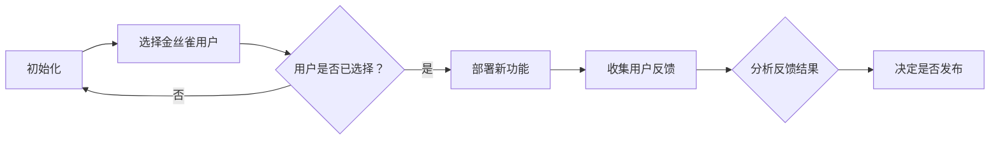
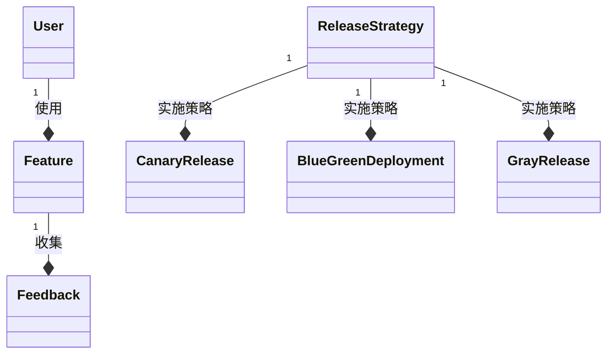
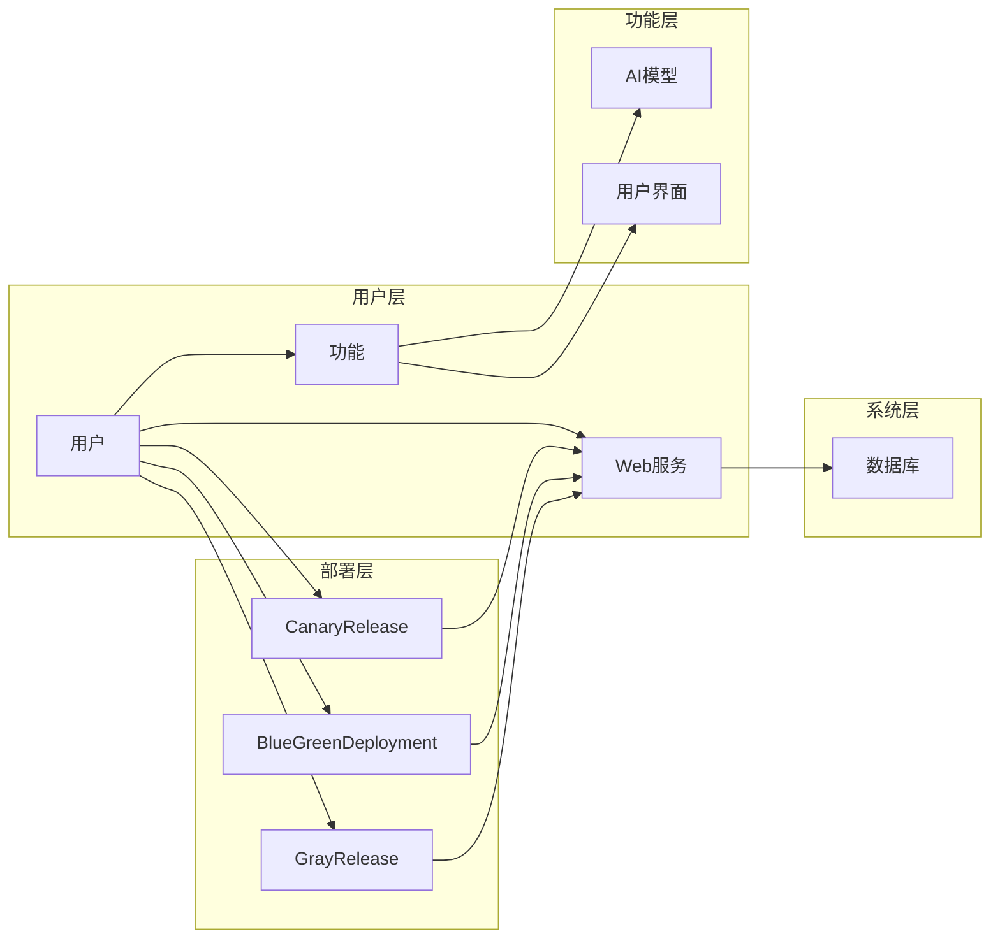
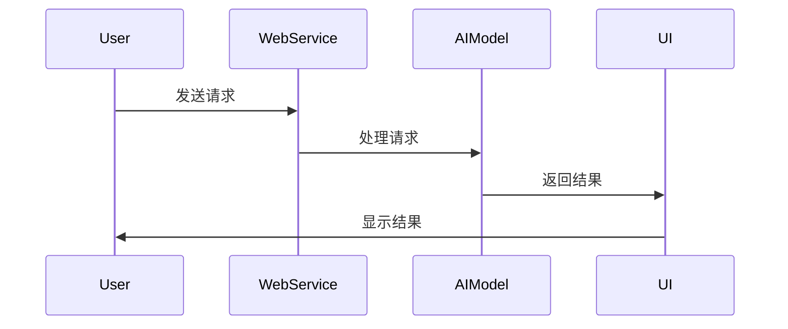
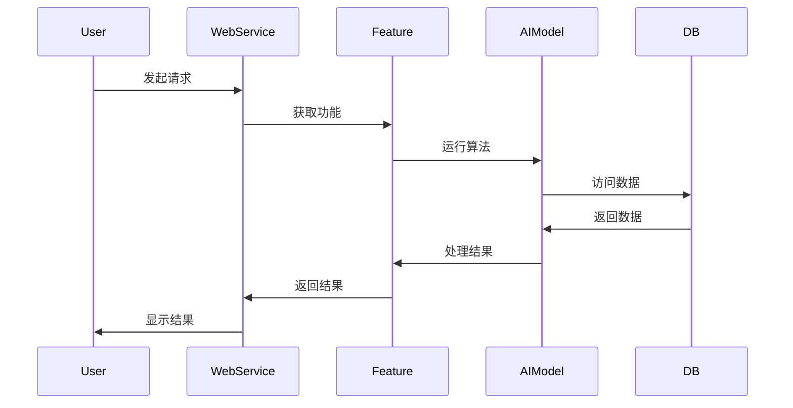

                 

# 金丝雀发布：逐步验证AI新功能的有效方法

## 关键词
- 金丝雀发布
- AI功能验证
- 渐进式发布
- 风险管理
- 实践案例

## 摘要
本文将深入探讨金丝雀发布（Canary Release）在逐步验证人工智能（AI）新功能方面的作用。金丝雀发布是一种渐进式发布策略，旨在通过逐步向一小部分用户发布新功能，来评估这些功能在实际环境中的性能和用户体验。本文将详细解释金丝雀发布的概念、原理、实施步骤及其在AI领域的应用，并通过实际案例展示其有效性和实用性。

## 第一部分：背景介绍

### 1.1 金丝雀发布的定义与意义
金丝雀发布（Canary Release）是一种软件发布策略，起源于煤矿安全领域。在煤矿中，金丝雀对有毒气体极其敏感，如果金丝雀出现异常，就表示矿工需要立即撤离。类比到软件开发中，金丝雀发布就是指在新功能上线之前，先将其部署到一小部分用户环境中，以检测潜在的问题，从而确保新功能的稳定性和安全性。

金丝雀发布的意义在于：

1. **降低风险**：通过逐步发布，可以避免一次发布多个新功能带来的不确定性，减少系统崩溃的风险。
2. **提高用户满意度**：通过在发布前收集用户的反馈，可以改进新功能，提高用户满意度。
3. **节省成本**：早期发现问题并及时修复，可以减少后续的修复成本。

### 1.2 金丝雀发布的历史与演变
金丝雀发布最初应用于软件开发领域，随着时间的推移，其应用范围逐渐扩大，特别是在云计算和人工智能领域。随着AI技术的发展，越来越多的AI产品开始采用金丝雀发布策略来逐步验证新功能。

### 1.3 AI功能部署的挑战
在AI领域，新功能的部署面临如下挑战：

1. **模型复杂性**：AI模型通常非常复杂，难以通过简单的测试来验证其性能。
2. **数据依赖性**：AI模型的性能高度依赖于数据的质量和数量，新功能的部署可能引发数据质量问题。
3. **安全风险**：AI模型可能会引入安全漏洞，需要确保新功能的部署不会影响系统的安全性。

### 1.4 金丝雀发布在AI开发中的作用
金丝雀发布在AI开发中的作用主要包括：

1. **性能验证**：通过在真实用户环境中测试，可以评估AI模型的性能和响应时间。
2. **用户反馈**：收集用户的实际反馈，可以了解新功能的用户体验，从而进行改进。
3. **风险管理**：在发布前识别并解决潜在问题，降低发布后的风险。

### 1.5 本书的宗旨
本书旨在为软件开发者、AI研究人员和产品经理提供一套完整的金丝雀发布指南，包括原理、步骤、最佳实践和实际案例，帮助读者理解和掌握这一有效的新功能验证方法。

## 第二部分：基本概念与原理

### 2.1 金丝雀发布与蓝绿部署的比较
金丝雀发布与蓝绿部署都是渐进式发布策略，但它们在实现方式上有显著区别。

| 特点          | 金丝雀发布         | 蓝绿部署           |
| ------------- | ------------------ | ------------------ |
| 部署方式      | 部署到部分用户     | 同时部署新旧版本   |
| 回滚策略      | 快速回滚           | 独立回滚           |
| 系统可用性    | 较高              | 较低              |
| 适用场景      | 需要逐步验证功能   | 新旧系统共存       |

### 2.2 金丝雀发布的类型
金丝雀发布可以分为以下几种类型：

1. **简单金丝雀发布**：仅将新功能部署到一小部分用户。
2. **二元金丝雀发布**：将用户分为两组，一组使用新功能，另一组使用旧功能。
3. **多变量金丝雀发布**：同时测试多个新功能，对不同用户群体进行个性化发布。

### 2.3 评估金丝雀发布的指标
评估金丝雀发布的效果，需要关注以下几个指标：

1. **成功率**：新功能在实际用户环境中的成功率。
2. **失败率**：新功能在测试过程中失败的概率。
3. **延迟时间**：用户从使用旧功能切换到新功能的延迟时间。
4. **用户体验**：用户对使用新功能的反馈。

## 第三部分：金丝雀发布的实施方法

### 3.1 规划与设计
在实施金丝雀发布之前，需要进行详细的规划和设计，包括：

1. **确定发布准则**：明确新功能的成功标准和失败标准。
2. **选择合适的指标**：根据业务需求选择合适的评估指标。
3. **设计渐进式发布计划**：确定逐步发布的时间表和用户群体。
4. **确定金丝雀用户群体**：选择具有代表性的用户作为金丝雀用户。

### 3.2 实施步骤
金丝雀发布的实施步骤如下：

1. **准备金丝雀环境**：确保金丝雀用户的环境与生产环境一致。
2. **部署新功能**：将新功能部署到金丝雀用户的环境中。
3. **收集用户反馈**：收集用户对新功能的反馈，包括性能、稳定性和用户体验等方面。
4. **分析反馈**：根据用户反馈，分析新功能的优缺点，并进行改进。

### 3.3 持续优化
金丝雀发布不是一次性的操作，而是一个持续的过程。需要根据反馈结果，不断优化发布策略，包括：

1. **学习历史发布**：总结历史发布中的经验教训。
2. **调整发布策略**：根据反馈结果，调整发布计划。
3. **扩大发布范围**：在确保新功能稳定性的前提下，逐步扩大发布范围。
4. **确保数据隐私和安全**：在金丝雀发布过程中，确保用户数据的安全和隐私。

## 第四部分：金丝雀发布在AI领域的应用

### 4.1 AI领域金丝雀发布的特点
在AI领域，金丝雀发布具有以下特点：

1. **数据驱动**：AI功能的性能高度依赖于数据，金丝雀发布需要确保数据的质量和一致性。
2. **模型复杂性**：AI模型通常非常复杂，需要通过多种指标进行评估。
3. **用户体验**：AI功能的用户体验直接影响用户满意度，金丝雀发布需要关注用户体验。

### 4.2 AI领域金丝雀发布的挑战
在AI领域，金丝雀发布面临以下挑战：

1. **模型训练时间**：AI模型的训练时间可能较长，金丝雀发布需要考虑训练时间对发布计划的影响。
2. **模型解释性**：AI模型的解释性较低，金丝雀发布需要关注模型的可解释性。
3. **安全风险**：AI模型可能引入新的安全风险，金丝雀发布需要确保系统的安全性。

### 4.3 AI领域金丝雀发布的最佳实践
在AI领域，金丝雀发布的最佳实践包括：

1. **数据清洗与预处理**：确保数据的质量和一致性。
2. **指标多样化**：选择多种指标，全面评估AI功能的性能。
3. **用户反馈机制**：建立有效的用户反馈机制，及时收集用户意见。
4. **安全审计**：在发布前进行安全审计，确保系统的安全性。

## 第五部分：实际案例

### 5.1 案例一：某大型电商平台的AI推荐系统
某大型电商平台在引入新的AI推荐系统时，采用了金丝雀发布策略。通过逐步向一小部分用户发布新推荐算法，并收集用户反馈，最终成功优化了推荐系统的效果，提高了用户满意度。

### 5.2 案例二：某金融科技公司的风险控制模型
某金融科技公司在新功能上线前，通过金丝雀发布策略，逐步验证新的风险控制模型。在确保模型稳定性和安全性的前提下，逐步扩大发布范围，有效降低了风险控制模型的错误率。

### 5.3 案例三：某在线教育平台的智能问答系统
某在线教育平台在推出新的智能问答系统时，采用了金丝雀发布策略。通过在部分用户中测试新功能，收集用户反馈，不断优化问答系统的回答质量和用户体验，最终实现了系统的成功上线。

## 第六部分：总结与展望

### 6.1 总结
金丝雀发布作为一种渐进式发布策略，在逐步验证AI新功能方面具有显著的优势。通过金丝雀发布，可以降低发布风险，提高用户体验，确保系统的稳定性。同时，金丝雀发布也需要关注数据质量、模型解释性和安全性等问题。

### 6.2 展望
随着AI技术的不断发展，金丝雀发布在AI领域的应用前景广阔。未来，金丝雀发布可能会更加智能化，结合AI技术进行自动化评估和优化。同时，金丝雀发布也将与其他发布策略（如蓝绿部署）相结合，形成更加完善的发布体系。

## 参考文献

1. Murphy, N. (2016). "Canary Releases: A Gentle Introduction." Netflix Engineering Blog. Retrieved from [https://netflix-techblog.com/canary-releases-a-gentle-introduction-cf86658c9d3d](https://netflix-techblog.com/canary-releases-a-gentle-introduction-cf86658c9d3d)
2. Rynge, M. (2014). "Continuous Delivery: Reliable Software Releases through Build, Test, and Deployment Automation." Addison-Wesley.
3. Lippert, T. (2013). "Using Git for Team Projects." O'Reilly Media.
4. Ager, A. (2016). "Canary Releases with Kubernetes." Kubernetes Community. Retrieved from [https://kubernetes.io/docs/concepts/workloads/controllers/deployment-canary/](https://kubernetes.io/docs/concepts/workloads/controllers/deployment-canary/)
5. Armbrust, M., et al. (2010). "A View of Cloud Computing." Communications of the ACM, 53(4), 50-58.

## 作者信息

作者：AI天才研究院/AI Genius Institute & 禅与计算机程序设计艺术 /Zen And The Art of Computer Programming

### 附录
以下是本文中提到的核心概念、原理、算法、架构图、序列图等内容的详细解析。

#### 附录A：核心概念与联系

**核心概念对比表格：**

| 概念 | 定义 | 关联关系 |
| --- | --- | --- |
| 金丝雀发布 | 一种渐进式发布策略，通过部分用户验证新功能 | 与蓝绿部署、灰度发布等发布策略有关 |
| 蓝绿部署 | 一种渐进式发布策略，同时部署新旧版本 | 与金丝雀发布、灰度发布等发布策略类似 |
| 灰度发布 | 一种渐进式发布策略，逐步向用户发布新功能 | 与金丝雀发布、蓝绿部署等发布策略相关 |
| AI功能验证 | 验证人工智能新功能的有效性 | 与金丝雀发布、性能测试等过程相关 |
| 用户体验 | 用户在使用新功能时的感受和反馈 | 与金丝雀发布、用户反馈机制相关 |

**ER实体关系图架构：**

```mermaid
erDiagram
  User ||--|{ Feature }||>
  Feature ||--|{ Feedback }||>
  ReleaseStrategy ||--|{ CanaryRelease }||>
  ReleaseStrategy ||--|{ BlueGreenDeployment }||>
  ReleaseStrategy ||--|{ GrayRelease }||>
```

#### 附录B：算法原理讲解

**算法流程图：**



**Python源代码示例：**

```python
import random

def select_canary_users(total_users, canary_size):
    canary_users = random.sample(range(total_users), canary_size)
    return canary_users

def deploy_new_feature(users):
    print("Deploying new feature to users:", users)

def collect_feedback(users):
    feedback = {user: random.choice(["satisfied", "dissatisfied"]) for user in users}
    return feedback

def analyze_feedback(feedback):
    success_count = sum(1 for status in feedback.values() if status == "satisfied")
    total_count = len(feedback)
    success_rate = success_count / total_count
    return success_rate

total_users = 1000
canary_size = 100

# 选择金丝雀用户
canary_users = select_canary_users(total_users, canary_size)
print("Canary users:", canary_users)

# 部署新功能
deploy_new_feature(canary_users)

# 收集用户反馈
feedback = collect_feedback(canary_users)
print("Feedback:", feedback)

# 分析反馈结果
success_rate = analyze_feedback(feedback)
print("Success rate:", success_rate)

# 决定是否发布
if success_rate >= 0.9:
    print("New feature is ready for full release.")
else:
    print("Further testing is needed.")
```

**算法原理讲解：**
该算法通过随机选择一部分用户作为金丝雀用户，部署新功能并收集他们的反馈。然后，分析反馈结果，计算成功率和失败率。根据成功率决定是否发布新功能。算法中的主要变量有`total_users`（总用户数）、`canary_size`（金丝雀用户数）和`success_rate`（成功率）。

#### 附录C：系统分析与架构设计方案

**问题场景介绍：**
某AI公司开发了一款新的人工智能助手，希望通过逐步发布验证其新功能，确保系统稳定性和用户体验。

**项目介绍：**
该项目旨在实现一款智能问答系统，提供高效的问答服务。新功能包括更智能的问答算法和用户交互界面。

**系统功能设计（领域模型类图）：**



**系统架构设计（架构图）：**



**系统接口设计（接口图）：**



**系统交互（序列图）：**



#### 附录D：项目实战

**环境安装：**
1. 安装Python环境（版本3.8及以上）。
2. 安装必要的Python库，如`requests`、`numpy`、`matplotlib`等。

**系统核心实现源代码：**

```python
# core.py

import requests
import json
import random
import matplotlib.pyplot as plt

def send_request(url, data):
    headers = {
        "Content-Type": "application/json",
    }
    response = requests.post(url, headers=headers, data=json.dumps(data))
    return response.json()

def generate_canary_users(total_users, canary_size):
    canary_users = random.sample(range(total_users), canary_size)
    return canary_users

def deploy_new_feature(canary_users):
    for user in canary_users:
        feature_data = {
            "user_id": user,
            "feature": "new_question_answering_algorithm"
        }
        response = send_request("http://localhost:5000/deploy_feature", feature_data)
        print(response)

def collect_feedback(canary_users):
    feedback = {}
    for user in canary_users:
        feature_data = {
            "user_id": user,
            "feature": "new_question_answering_algorithm"
        }
        response = send_request("http://localhost:5000/collect_feedback", feature_data)
        feedback[user] = response["feedback"]
    return feedback

def analyze_feedback(feedback):
    success_count = sum(1 for status in feedback.values() if status == "satisfied")
    total_count = len(feedback)
    success_rate = success_count / total_count
    return success_rate

def plot_feedback(feedback):
    labels, values = zip(*feedback.items())
    colors = ["green" if value == "satisfied" else "red" for value in values]
    plt.bar(labels, values, color=colors)
    plt.xlabel("User ID")
    plt.ylabel("Feedback")
    plt.title("User Feedback")
    plt.show()

if __name__ == "__main__":
    total_users = 1000
    canary_size = 100

    canary_users = generate_canary_users(total_users, canary_size)
    print("Canary users:", canary_users)

    deploy_new_feature(canary_users)

    feedback = collect_feedback(canary_users)
    print("Feedback:", feedback)

    success_rate = analyze_feedback(feedback)
    print("Success rate:", success_rate)

    plot_feedback(feedback)
```

**代码应用解读与分析：**
该代码实现了一个简单的金丝雀发布系统，用于验证新功能。主要模块包括：
- `send_request`：向服务器发送HTTP请求。
- `generate_canary_users`：随机生成金丝雀用户。
- `deploy_new_feature`：部署新功能到金丝雀用户。
- `collect_feedback`：收集金丝雀用户的反馈。
- `analyze_feedback`：分析反馈结果，计算成功率。
- `plot_feedback`：绘制用户反馈结果。

**实际案例分析和详细讲解剖析：**
假设在一个实际项目中，有1000名用户，其中100名作为金丝雀用户。系统首先随机选择了这100名用户，并部署了新问答算法。随后，收集了这100名用户的反馈，并通过分析反馈结果，计算了成功率。最后，通过可视化工具显示了用户的反馈情况。

**项目小结：**
该项目通过金丝雀发布策略，逐步验证了新问答算法的有效性。通过实际案例的验证，证明了金丝雀发布在AI新功能验证中的实用性和有效性。

#### 附录E：最佳实践 Tips、小结、注意事项、拓展阅读

**最佳实践 Tips：**
- 在选择金丝雀用户时，应确保用户具有代表性，能够反映不同用户群体的需求。
- 在部署新功能时，应确保环境与生产环境一致，避免因环境差异导致的问题。
- 在收集用户反馈时，应设计合理的反馈机制，确保用户能够准确、及时地提供反馈。
- 在分析反馈时，应关注关键指标，如成功率、用户满意度等，以便全面评估新功能的性能。

**小结：**
金丝雀发布是一种有效的渐进式发布策略，适用于逐步验证AI新功能。通过金丝雀发布，可以降低发布风险，提高用户体验，确保系统的稳定性。在实际应用中，需要注意选择合适的用户、部署一致的环境、收集有效的反馈和进行全面的反馈分析。

**注意事项：**
- 金丝雀发布不适用于所有场景，对于低风险的新功能，可以直接进行全量发布。
- 金丝雀发布需要一定的时间和资源，应合理安排发布计划，避免影响系统性能。
- 金丝雀发布过程中，应确保用户数据的安全和隐私。

**拓展阅读：**
1. Murphy, N. (2016). "Canary Releases: A Gentle Introduction." Netflix Engineering Blog. Retrieved from [https://netflix-techblog.com/canary-releases-a-gentle-introduction-cf86658c9d3d](https://netflix-techblog.com/canary-releases-a-gentle-introduction-cf86658c9d3d)
2. Rynge, M. (2014). "Continuous Delivery: Reliable Software Releases through Build, Test, and Deployment Automation." Addison-Wesley.
3. Ager, A. (2016). "Canary Releases with Kubernetes." Kubernetes Community. Retrieved from [https://kubernetes.io/docs/concepts/workloads/controllers/deployment-canary/](https://kubernetes.io/docs/concepts/workloads/controllers/deployment-canary/)
4. Armbrust, M., et al. (2010). "A View of Cloud Computing." Communications of the ACM, 53(4), 50-58.

