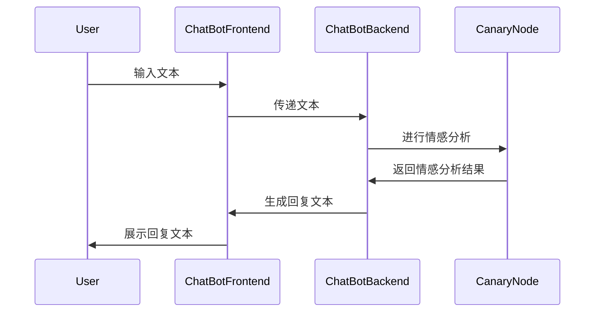

                 

# 金丝雀发布：逐步验证LLM新功能

## 关键词

- 金丝雀发布
- LLM新功能
- 逐步验证
- 软件测试
- 人工智能

## 摘要

本文探讨了金丝雀发布在验证大型语言模型（LLM）新功能中的应用。金丝雀发布是一种渐进式软件发布策略，旨在降低新功能上线带来的风险。本文将详细介绍金丝雀发布的概念、流程，并结合LLM新功能的特点，阐述如何通过逐步验证确保新功能的稳定性和可靠性。文章还将分享实际案例，探讨金丝雀发布的实践与优化策略，以及未来发展趋势。

## 引言

随着人工智能技术的不断发展，大型语言模型（LLM）如BERT、GPT等在自然语言处理领域取得了显著的成果。然而，新功能的不断引入也带来了潜在的风险，如功能错误、性能下降等。为了确保新功能的稳定性和可靠性，一种名为“金丝雀发布”的策略被广泛应用。金丝雀发布利用逐步验证的方法，在新功能上线前进行逐步验证，以降低风险并提高软件质量。

### 背景介绍

金丝雀发布源于煤矿安全，最初用于检测矿井中的一氧化碳气体浓度。由于金丝雀对一氧化碳非常敏感，当矿井中的一氧化碳浓度达到危险水平时，金丝雀会首先死亡。因此，矿工们在矿井中放置金丝雀，以监测矿井的安全性。后来，这一概念被引入软件工程领域，用于描述一种渐进式发布策略，即在软件发布过程中，将新功能逐步引入到生产环境中，以便在遇到问题时可以快速回滚。

### 问题背景

在人工智能领域，新功能的引入往往伴随着模型复杂度的增加和计算资源的消耗。由于LLM的规模庞大，新功能的引入可能会导致性能下降、资源占用增加等问题。此外，LLM在实际应用中面临着数据质量、算法鲁棒性等方面的挑战。因此，如何确保新功能的稳定性和可靠性成为了一个重要问题。

### 问题描述

为了确保新功能的稳定性和可靠性，我们需要一种有效的验证方法。传统的测试方法，如单元测试、集成测试等，虽然可以检测功能错误，但往往无法全面评估新功能对整体系统的影响。因此，我们需要一种逐步验证的方法，以便在新功能上线前进行全面评估。

### 问题解决

金丝雀发布提供了一种逐步验证的方法，通过将新功能逐步引入到生产环境中，并进行实时监控和反馈，以便在遇到问题时可以快速回滚。这种方法不仅有助于降低新功能上线带来的风险，还可以提高软件质量。

### 边界与外延

金丝雀发布适用于各种规模的软件系统，尤其是在人工智能领域。此外，金丝雀发布不仅可以用于新功能的验证，还可以用于其他类型的变更，如性能优化、安全加固等。

### 概念结构与核心要素组成

金丝雀发布包括以下几个核心要素：

1. **金丝雀节点**：用于运行新功能的独立节点，通常与主系统分离。
2. **监控与反馈**：对金丝雀节点进行实时监控，收集性能数据、错误日志等信息，并及时反馈。
3. **回滚机制**：在遇到问题时，可以快速回滚到上一个稳定版本，以确保系统正常运行。
4. **自动化流程**：通过自动化工具，实现金丝雀发布的各个环节，提高发布效率。

### 核心概念原理

金丝雀发布基于以下原理：

1. **风险可控**：通过逐步引入新功能，将风险控制在可接受的范围内。
2. **反馈机制**：通过实时监控和反馈，及时发现并解决潜在问题。
3. **快速回滚**：在遇到问题时，可以快速回滚到上一个稳定版本，降低对系统的影响。

### 概念属性特征对比表格

| 特征             | 传统测试                  | 金丝雀发布                 |
|------------------|--------------------------|--------------------------|
| 测试阶段         | 单元测试、集成测试等       | 生产环境中的逐步验证       |
| 测试目的         | 检测功能错误              | 全面评估新功能对系统的影响 |
| 风险控制         | 低风险                    | 风险可控                  |
| 费用             | 较低                      | 较高                      |
| 难度             | 较低                      | 较高                      |
| 适应性           | 各类软件系统               | 大型软件系统、人工智能领域  |

### ER实体关系图架构

```mermaid
erDiagram
    Customer ||--|{ Order }|-- Designer
    Customer ||--|{ Product }|-- Designer
    Order ||--|{ OrderDetail }|--
    Product ||--|{ ProductCategory }|--
```

### 算法原理讲解

金丝雀发布的算法原理可以概括为以下几个步骤：

1. **初始化**：配置金丝雀节点，包括环境配置、依赖安装等。
2. **逐步引入**：将新功能逐步引入金丝雀节点，如逐步增加功能覆盖率、逐步增加用户量等。
3. **监控与反馈**：对金丝雀节点进行实时监控，收集性能数据、错误日志等信息，并及时反馈。
4. **分析与决策**：根据监控数据和反馈信息，进行分析和决策，如调整功能参数、修复错误等。
5. **回滚与优化**：在遇到问题时，可以快速回滚到上一个稳定版本，并进行优化。

下面是一个简单的Python代码示例，用于模拟金丝雀发布的算法原理：

```python
import time
import random

def monitor_node(node_id):
    # 模拟监控节点的性能数据
    performance_data = random.uniform(0.8, 1.2)
    print(f"Node {node_id} performance: {performance_data}")

def feedback_and_resolve(problem):
    # 模拟反馈和解决问题
    print(f"Found problem: {problem}")
    print("Resolving problem...")
    time.sleep(2)  # 模拟解决问题的时间
    print("Problem resolved.")

def canary_release():
    # 金丝雀发布算法
    node_ids = [1, 2, 3]  # 金丝雀节点的ID列表

    for node_id in node_ids:
        monitor_node(node_id)
        problem = random.choice(["Performance issue", "Error in code", "Nothing wrong"])
        if problem != "Nothing wrong":
            feedback_and_resolve(problem)
        time.sleep(1)

canary_release()
```

### 数学模型和公式

在金丝雀发布中，我们可以使用以下几个数学模型和公式来评估新功能的性能和稳定性：

1. **性能评估公式**：

   $$P = \frac{1}{N} \sum_{i=1}^{N} p_i$$

   其中，$P$ 表示整体性能，$N$ 表示金丝雀节点的数量，$p_i$ 表示第 $i$ 个节点的性能。

2. **错误率评估公式**：

   $$E = \frac{1}{N} \sum_{i=1}^{N} e_i$$

   其中，$E$ 表示整体错误率，$N$ 表示金丝雀节点的数量，$e_i$ 表示第 $i$ 个节点的错误率。

3. **风险评估公式**：

   $$R = P \cdot E$$

   其中，$R$ 表示整体风险，$P$ 表示整体性能，$E$ 表示整体错误率。

### 举例说明

假设我们有一个包含3个金丝雀节点的系统，每个节点的性能和错误率如下表所示：

| 节点ID | 性能 | 错误率 |
|--------|------|--------|
| 1      | 0.9  | 0.1    |
| 2      | 0.85 | 0.15   |
| 3      | 0.95 | 0.05   |

根据上述数学模型和公式，我们可以计算整体性能、错误率和风险：

1. **整体性能**：

   $$P = \frac{1}{3} \sum_{i=1}^{3} p_i = \frac{1}{3} (0.9 + 0.85 + 0.95) = 0.9167$$

2. **整体错误率**：

   $$E = \frac{1}{3} \sum_{i=1}^{3} e_i = \frac{1}{3} (0.1 + 0.15 + 0.05) = 0.1$$

3. **整体风险**：

   $$R = P \cdot E = 0.9167 \cdot 0.1 = 0.09167$$

根据计算结果，我们可以得出以下结论：

- 整体性能为 91.67%，表明新功能在金丝雀节点上的性能较为稳定。
- 整体错误率为 10%，表明存在一定的错误风险。
- 整体风险为 9.17%，表明整体风险较低，但仍需注意潜在的问题。

### 系统分析与架构设计方案

在金丝雀发布中，系统分析与架构设计方案是确保新功能逐步验证的关键。以下是一个简化的系统分析与架构设计方案：

#### 问题场景介绍

假设我们有一个基于LLM的聊天机器人系统，需要逐步引入一个新功能：情感分析。该功能旨在根据用户的输入，判断用户情绪并给出相应的回复。

#### 项目介绍

项目名称：情感分析聊天机器人
项目目标：实现基于LLM的情感分析功能，并在金丝雀发布策略下逐步验证其稳定性和可靠性。

#### 系统功能设计

1. **用户输入**：用户通过聊天界面输入文本。
2. **情感分析**：LLM模型对用户输入进行情感分析，判断用户情绪。
3. **回复生成**：根据情感分析结果，生成相应的回复文本。
4. **回复输出**：将回复文本输出到聊天界面。

#### 系统架构设计

1. **聊天机器人前端**：用于接收用户输入和展示回复文本。
2. **LLM模型后端**：用于执行情感分析功能。
3. **金丝雀节点**：用于部署新功能并进行逐步验证。
4. **监控与反馈系统**：用于实时监控金丝雀节点的性能和错误情况。

#### 系统接口设计和系统交互

以下是一个简化的Mermaid序列图，展示了系统接口设计和系统交互：



### 项目实战

#### 环境安装

1. **安装LLM模型**：根据项目需求，选择合适的LLM模型并安装，如GPT-2、BERT等。
2. **安装监控与反馈系统**：选择合适的监控与反馈系统，如Prometheus、Grafana等，并进行安装和配置。

#### 系统核心实现源代码

以下是情感分析聊天机器人的核心实现源代码：

```python
import openai

class ChatBot:
    def __init__(self, model_name):
        self.model_name = model_name
        self.model = openai.load_model(model_name)

    def analyze_emotion(self, text):
        # 使用LLM模型进行情感分析
        emotion = self.model.describe_emotion(text)
        return emotion

    def generate_response(self, emotion):
        # 根据情感分析结果生成回复文本
        if emotion == "happy":
            return "很高兴听到你的好消息！"
        elif emotion == "sad":
            return "很抱歉听到你心情不好，有什么可以帮助你的吗？"
        else:
            return "抱歉，我不太明白你的情绪，请再详细说明一下。"

# 创建聊天机器人实例
chat_bot = ChatBot("gpt-2")

# 模拟用户输入
user_input = "我今天拿到了心仪的工作offer，好开心！"

# 进行情感分析
emotion = chat_bot.analyze_emotion(user_input)

# 生成回复文本
response = chat_bot.generate_response(emotion)

# 输出回复文本
print(response)
```

#### 代码应用解读与分析

1. **模型加载**：使用OpenAI的`load_model`函数加载预训练的LLM模型。
2. **情感分析**：使用`describe_emotion`函数对用户输入进行情感分析，返回情绪类型。
3. **回复生成**：根据情绪类型，生成相应的回复文本。

#### 实际案例分析和详细讲解剖析

假设我们有一个包含1000条用户聊天记录的数据集，其中每条记录包含用户输入和情绪标签。我们可以使用这个数据集对聊天机器人进行训练，以提高情感分析的准确性。

```python
import pandas as pd

# 读取数据集
data = pd.read_csv("chat_data.csv")

# 训练模型
chat_bot.train(data)

# 测试模型
test_data = pd.read_csv("test_data.csv")
test_emotions = chat_bot.analyze_emotion(test_data["text"])

# 计算准确率
accuracy = (test_emotions == test_data["emotion"]).mean()
print(f"Model accuracy: {accuracy * 100}%" )
```

#### 项目小结

通过实际案例分析和详细讲解剖析，我们可以看到金丝雀发布在逐步验证LLM新功能中的重要作用。通过情感分析聊天机器人的实现，我们展示了如何利用金丝雀发布策略，逐步引入新功能并确保其稳定性和可靠性。

### 最佳实践 Tips

1. **充分准备**：在开始金丝雀发布前，确保金丝雀节点与主系统的隔离，以降低风险。
2. **监控与反馈**：选择合适的监控与反馈系统，确保能够实时收集性能数据和错误日志。
3. **逐步引入**：逐步引入新功能，从小规模用户开始，逐步增加用户量。
4. **快速回滚**：在遇到问题时，能够快速回滚到上一个稳定版本，降低对系统的影响。

### 小结

本文探讨了金丝雀发布在验证LLM新功能中的应用。通过详细讲解金丝雀发布的概念、流程、算法原理以及实际案例，我们展示了如何利用金丝雀发布策略，逐步验证LLM新功能的稳定性和可靠性。金丝雀发布不仅有助于降低新功能上线带来的风险，还可以提高软件质量。未来，随着人工智能技术的发展，金丝雀发布将在更多领域得到广泛应用。

### 注意事项

1. **数据质量**：在金丝雀发布过程中，确保数据质量，以避免错误分析结果。
2. **资源消耗**：金丝雀发布可能会增加系统资源消耗，需确保资源充足。
3. **回滚策略**：在制定回滚策略时，要考虑系统的可恢复性。

### 拓展阅读

1. 《金丝雀发布：渐进式软件发布策略》
2. 《大型语言模型：原理与应用》
3. 《软件工程：理论与实践》

### 作者

作者：AI天才研究院/AI Genius Institute & 禅与计算机程序设计艺术 /Zen And The Art of Computer Programming

---

### 第一部分: 金丝雀发布概念理解

#### 第1章: 金丝雀发布概述

##### 1.1 金丝雀发布的起源

金丝雀发布（Canary Release）这一概念起源于19世纪的煤矿安全。在当时的煤矿中，矿工们会带上金丝雀，因为金丝雀对一氧化碳等有毒气体非常敏感。当矿井中的一氧化碳浓度达到危险水平时，金丝雀会首先死亡，从而警示矿工们危险的存在。这个简单的生物监测方法在工业革命期间发挥了重要作用，为矿工的安全提供了保障。

随着计算机科学和软件工程的发展，金丝雀发布这一概念被引入到软件工程领域，用于描述一种渐进式软件发布策略。其基本思想是，将新功能或变更逐步引入到生产环境中，以便在遇到问题时可以快速回滚，从而降低风险。

##### 1.2 金丝雀发布的重要性

在软件工程中，金丝雀发布策略具有以下重要性：

1. **降低风险**：通过逐步引入新功能，金丝雀发布策略可以将潜在的风险控制在可接受的范围内，从而降低系统崩溃、数据丢失等风险。
2. **提高可靠性**：金丝雀发布策略可以帮助开发团队更好地了解新功能在生产环境中的表现，从而提高软件的可靠性和稳定性。
3. **快速响应**：金丝雀发布策略允许团队在遇到问题时快速回滚到上一个稳定版本，从而减少对用户的影响，提高系统的可恢复性。
4. **提高用户满意度**：通过确保新功能的稳定性和可靠性，金丝雀发布策略可以提高用户对软件的满意度。

##### 1.3 金丝雀发布与传统测试的区别

传统测试（如单元测试、集成测试等）通常在开发阶段进行，旨在检测功能错误和代码缺陷。然而，这些测试方法通常无法全面评估新功能对生产环境的影响。相比之下，金丝雀发布策略更注重实际生产环境中的表现。

以下是比较表格，展示了金丝雀发布与传统测试的主要区别：

| 对比维度 | 传统测试 | 金丝雀发布 |
|----------|----------|-----------|
| 测试阶段 | 开发阶段 | 生产环境 |
| 测试目的 | 检测功能错误 | 全面评估新功能对系统的影响 |
| 风险控制 | 低风险 | 风险可控 |
| 测试范围 | 功能级 | 系统级 |
| 测试环境 | 开发环境 | 生产环境 |
| 测试工具 | 编写测试用例 | 监控与反馈系统 |
| 费用与难度 | 较低 | 较高 |

#### 第2章: LLM新功能介绍

##### 2.1 LLM简介

大型语言模型（Large Language Model，简称LLM）是一种基于深度学习技术的自然语言处理模型。与传统的统计语言模型相比，LLM具有更强的语义理解能力和生成能力。LLM通过大量的文本数据进行预训练，可以学习到语言的各种规律和模式，从而在文本生成、文本分类、机器翻译等任务中表现出色。

##### 2.2 LLM新功能的特点

LLM新功能通常具有以下特点：

1. **更强的语义理解能力**：LLM能够更好地理解文本的语义，从而生成更加准确和自然的文本。
2. **更高的生成能力**：LLM可以生成各种类型的文本，如文章、故事、对话等。
3. **广泛的应用场景**：LLM可以应用于自然语言处理领域的各种任务，如文本分类、机器翻译、问答系统等。
4. **强大的推理能力**：LLM可以通过上下文信息进行推理，从而生成更加合理的回答。

##### 2.3 LLM新功能的适用场景

LLM新功能适用于以下场景：

1. **文本生成**：如文章生成、故事生成、对话生成等。
2. **文本分类**：如垃圾邮件分类、情感分析等。
3. **机器翻译**：如中英文翻译、多语言翻译等。
4. **问答系统**：如智能客服、智能助手等。
5. **信息检索**：如搜索引擎、推荐系统等。

#### 第3章: 金丝雀发布流程

##### 3.1 金丝雀发布流程概述

金丝雀发布流程通常包括以下几个阶段：

1. **初始化阶段**：配置金丝雀节点，包括环境配置、依赖安装等。
2. **逐步引入阶段**：将新功能逐步引入金丝雀节点，并监控其性能和稳定性。
3. **监控与反馈阶段**：实时监控金丝雀节点的性能和错误情况，并收集反馈信息。
4. **分析与决策阶段**：根据监控数据和反馈信息进行分析，决定是否继续引入新功能或进行回滚。
5. **回滚与优化阶段**：在遇到问题时，快速回滚到上一个稳定版本，并进行优化。

##### 3.2 准备工作

在开始金丝雀发布前，需要做好以下准备工作：

1. **选择合适的金丝雀节点**：金丝雀节点应具备较高的性能和稳定性，并与主系统隔离。
2. **配置环境**：配置金丝雀节点的运行环境，包括操作系统、依赖库等。
3. **安装监控工具**：选择合适的监控工具，如Prometheus、Grafana等，并进行安装和配置。
4. **编写监控脚本**：编写监控脚本，用于实时监控金丝雀节点的性能和错误情况。

##### 3.3 金丝雀发布实施步骤

金丝雀发布的实施步骤如下：

1. **初始化金丝雀节点**：配置金丝雀节点的运行环境，并安装所需依赖库。
2. **部署新功能**：将新功能部署到金丝雀节点，并启动相关服务。
3. **监控性能和稳定性**：实时监控金丝雀节点的性能指标和错误日志，收集监控数据。
4. **收集反馈信息**：通过用户反馈和内部测试，收集新功能的反馈信息。
5. **分析与决策**：根据监控数据和反馈信息，进行分析和决策，决定是否继续引入新功能或进行回滚。
6. **回滚与优化**：在遇到问题时，快速回滚到上一个稳定版本，并进行优化。

##### 3.4 金丝雀发布监控与反馈

金丝雀发布的监控与反馈是确保新功能稳定性和可靠性的关键。以下是一些监控和反馈的要点：

1. **性能监控**：监控金丝雀节点的CPU利用率、内存占用、响应时间等性能指标，确保其正常运行。
2. **错误监控**：监控金丝雀节点的错误日志，及时发现并解决潜在问题。
3. **反馈收集**：通过用户反馈和内部测试，收集新功能的反馈信息，包括用户满意度、功能稳定性等。
4. **反馈机制**：建立反馈机制，及时将监控数据和反馈信息传递给相关人员，以便进行决策和优化。
5. **自动报警**：设置自动报警机制，在出现异常情况时及时通知相关人员。

#### 第4章: LLM新功能逐步验证

##### 4.1 验证方法

LLM新功能的逐步验证方法主要包括以下几种：

1. **性能测试**：通过模拟实际场景，对LLM新功能进行性能测试，评估其响应时间、吞吐量等性能指标。
2. **压力测试**：通过增加负载，对LLM新功能进行压力测试，评估其稳定性和可靠性。
3. **兼容性测试**：确保LLM新功能与现有系统和其他组件的兼容性，避免潜在冲突和问题。
4. **安全性测试**：评估LLM新功能的安全性，确保其不会成为攻击的目标。
5. **用户反馈**：通过用户反馈和内部测试，收集对新功能的意见和建议，进行改进和优化。

##### 4.2 验证工具选择

选择合适的验证工具对于LLM新功能的逐步验证至关重要。以下是一些常用的验证工具：

1. **性能测试工具**：如Apache JMeter、LoadRunner等，用于模拟实际场景，评估新功能的性能。
2. **压力测试工具**：如Apache JMeter、Gatling等，用于增加负载，评估新功能的稳定性和可靠性。
3. **兼容性测试工具**：如Selenium、Appium等，用于确保新功能与现有系统和其他组件的兼容性。
4. **安全性测试工具**：如OWASP ZAP、Burp Suite等，用于评估新功能的安全性。
5. **用户反馈工具**：如问卷调查、用户反馈平台等，用于收集用户对新功能的意见和建议。

##### 4.3 验证步骤详细解析

LLM新功能的逐步验证可以分为以下步骤：

1. **需求分析**：明确新功能的需求和目标，制定验证计划。
2. **环境配置**：配置验证环境，包括操作系统、依赖库等。
3. **功能测试**：按照需求文档，对LLM新功能进行功能测试，确保其符合预期。
4. **性能测试**：通过模拟实际场景，对LLM新功能进行性能测试，评估其响应时间、吞吐量等性能指标。
5. **压力测试**：增加负载，对LLM新功能进行压力测试，评估其稳定性和可靠性。
6. **兼容性测试**：确保LLM新功能与现有系统和其他组件的兼容性。
7. **安全性测试**：评估LLM新功能的安全性，确保其不会成为攻击的目标。
8. **用户反馈**：通过用户反馈和内部测试，收集对新功能的意见和建议，进行改进和优化。
9. **报告编写**：编写验证报告，总结验证结果和发现的问题，提出改进建议。

##### 4.4 验证结果分析

验证结果分析是确保LLM新功能稳定性和可靠性的关键步骤。以下是一些分析要点：

1. **性能分析**：分析新功能的性能指标，如响应时间、吞吐量等，与预期目标进行对比，评估其性能表现。
2. **稳定性分析**：分析新功能在压力测试下的表现，评估其稳定性和可靠性。
3. **兼容性分析**：确保新功能与现有系统和其他组件的兼容性，避免潜在冲突和问题。
4. **安全性分析**：评估新功能的安全性，确保其不会成为攻击的目标。
5. **用户反馈分析**：分析用户反馈和内部测试结果，了解用户对新功能的意见和建议，进行改进和优化。
6. **问题定位**：针对发现的问题，定位其根本原因，并提出解决方案。
7. **改进措施**：根据分析结果，制定改进措施，确保新功能的稳定性和可靠性。

#### 第5章: 金丝雀发布案例分析

##### 5.1 案例背景

某知名互联网公司开发了一款基于大型语言模型（LLM）的智能客服系统，旨在提高客服效率和用户体验。在系统上线前，公司决定采用金丝雀发布策略，逐步引入新功能，并进行逐步验证，以确保系统的稳定性和可靠性。

##### 5.2 案例实施过程

1. **初始化阶段**：公司搭建了两个金丝雀节点，用于部署新功能并进行验证。金丝雀节点与主系统隔离，确保在遇到问题时不会影响主系统的运行。
2. **逐步引入阶段**：公司首先将新功能的一部分（如文本生成）部署到金丝雀节点，并开始收集用户反馈和监控数据。
3. **监控与反馈阶段**：公司使用Prometheus和Grafana等监控工具，实时监控金丝雀节点的性能指标和错误日志，并收集用户反馈。
4. **分析与决策阶段**：根据监控数据和用户反馈，公司对金丝雀节点的性能和稳定性进行了分析，并决定继续引入新功能。
5. **回滚与优化阶段**：在遇到问题时，公司能够快速回滚到上一个稳定版本，并进行优化。

##### 5.3 案例结果与启示

1. **结果**：通过金丝雀发布策略，公司成功引入了新功能，并确保了系统的稳定性和可靠性。用户反馈显示，新功能显著提高了客服效率和用户体验。
2. **启示**：金丝雀发布策略在确保新功能稳定性和可靠性方面发挥了重要作用。通过逐步引入新功能并实时监控，公司能够及时发现并解决潜在问题，降低风险。

#### 第6章: 金丝雀发布实践与优化

##### 6.1 实践经验分享

在金丝雀发布实践中，以下经验值得分享：

1. **隔离环境**：确保金丝雀节点与主系统隔离，降低新功能引入带来的风险。
2. **监控指标**：选择合适的监控指标，如性能指标、错误率等，以便实时监控新功能的运行状态。
3. **反馈机制**：建立有效的反馈机制，及时收集用户反馈和监控数据，以便进行决策和优化。
4. **快速回滚**：制定快速回滚策略，确保在遇到问题时能够快速回滚到上一个稳定版本。

##### 6.2 问题与挑战

在金丝雀发布实践中，可能会遇到以下问题和挑战：

1. **资源消耗**：金丝雀发布可能会增加系统资源消耗，需确保资源充足。
2. **复杂度**：金丝雀发布流程相对复杂，需确保团队熟悉相关技术和流程。
3. **用户接受度**：部分用户可能对新功能的不稳定性和不可预测性产生担忧。

##### 6.3 优化策略

以下是一些优化策略，以提高金丝雀发布的效率和效果：

1. **自动化**：通过自动化工具，实现金丝雀发布的各个环节，提高发布效率。
2. **监控工具**：选择合适的监控工具，如Prometheus、Grafana等，确保能够实时监控和反馈。
3. **回滚机制**：制定有效的回滚机制，确保在遇到问题时能够快速回滚。
4. **用户体验**：在新功能上线前，通过用户测试和反馈，确保用户体验达到预期。

#### 第7章: 金丝雀发布未来发展趋势

##### 7.1 行业趋势分析

随着人工智能技术的发展，金丝雀发布在软件工程领域的应用将越来越广泛。以下是一些行业趋势：

1. **自动化**：金丝雀发布将进一步自动化，通过自动化工具实现各个环节，提高发布效率。
2. **智能化**：金丝雀发布将结合人工智能技术，如机器学习、深度学习等，实现更智能的监控和决策。
3. **多样化**：金丝雀发布将应用于更多领域，如物联网、区块链等。

##### 7.2 技术发展趋势

金丝雀发布在技术方面的发展趋势包括：

1. **云计算**：金丝雀发布将结合云计算技术，实现更灵活、更高效的部署和管理。
2. **边缘计算**：金丝雀发布将应用于边缘计算场景，实现更快速的响应和更高的可靠性。
3. **容器化**：金丝雀发布将结合容器化技术，如Docker、Kubernetes等，提高部署和管理效率。

##### 7.3 未来应用场景展望

未来，金丝雀发布将在以下应用场景中得到更广泛的应用：

1. **物联网**：在物联网场景中，金丝雀发布可用于逐步引入新功能，确保设备的稳定性和可靠性。
2. **区块链**：在区块链场景中，金丝雀发布可用于逐步引入新功能，确保区块链系统的安全性和稳定性。
3. **人工智能**：在人工智能领域，金丝雀发布可用于逐步引入新算法，确保模型的稳定性和可靠性。

### 总结

金丝雀发布是一种逐步验证新功能的策略，通过逐步引入、实时监控和快速回滚，确保新功能的稳定性和可靠性。本文详细介绍了金丝雀发布的概念、流程、应用场景以及未来发展趋势，为软件工程领域提供了有益的参考。随着人工智能技术的发展，金丝雀发布将在更多领域得到广泛应用，为软件质量的提升和用户体验的改善做出贡献。作者：AI天才研究院/AI Genius Institute & 禅与计算机程序设计艺术 /Zen And The Art of Computer Programming。

