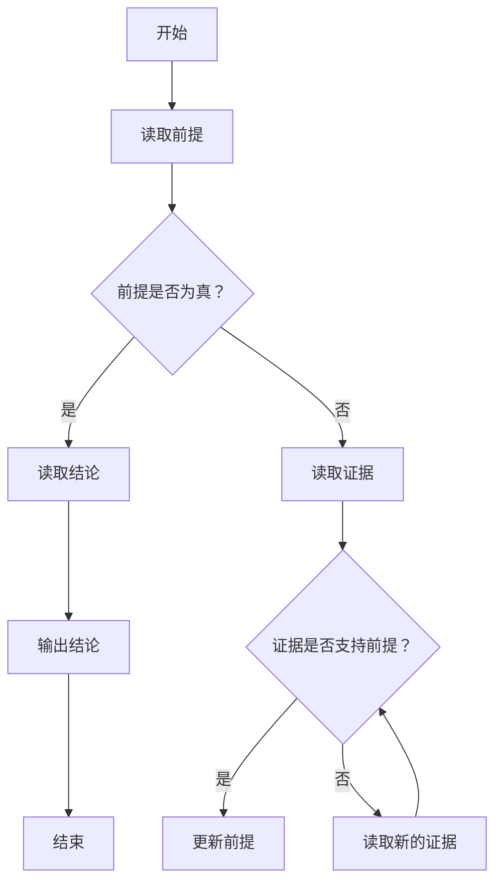
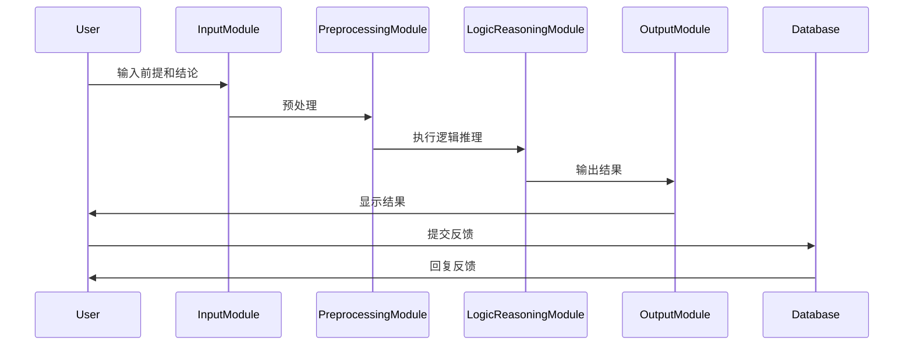

                 

# 链式思考：构建逻辑推理链的提示策略

> 关键词：逻辑推理、链式思考、算法原理、系统设计、项目实战

> 摘要：本文以链式思考为核心，探讨了如何构建逻辑推理链的提示策略。通过深入分析逻辑推理的基本原理、算法设计、系统架构以及实际应用，为读者提供了一种系统化、结构化的思考方法，旨在提高逻辑推理的准确性和效率。

## 目录大纲

### 第一部分：问题背景与核心概念

#### 第1章：问题的提出与定义
1.1 问题背景
1.2 逻辑推理的概念
1.3 逻辑推理链的构建

#### 第2章：逻辑推理的原理与属性
2.1 逻辑推理的原理
2.2 逻辑推理的属性
2.3 逻辑推理的应用领域

#### 第3章：逻辑推理链的核心概念
3.1 逻辑推理链的组成部分
3.2 逻辑推理链的属性特征对比
3.3 逻辑推理链的构建方法

### 第二部分：核心概念与联系

#### 第4章：逻辑推理算法原理
4.1 逻辑推理算法概述
4.2 逻辑推理算法的数学模型
4.3 逻辑推理算法的mermaid流程图

#### 第5章：逻辑推理系统架构设计
5.1 逻辑推理系统概述
5.2 系统功能设计
5.3 系统架构设计
5.4 系统接口设计与交互

### 第三部分：算法原理与系统设计

#### 第6章：项目环境与核心实现
6.1 环境安装与配置
6.2 系统核心实现
6.3 代码应用解读与分析

#### 第7章：案例分析与应用拓展
7.1 实际案例解析
7.2 应用拓展与展望

### 第四部分：最佳实践与总结

#### 第8章：最佳实践与注意事项
8.1 最佳实践技巧
8.2 注意事项

#### 第9章：小结与拓展阅读
9.1 小结
9.2 拓展阅读

### 目录大纲总结

本书通过系统介绍逻辑推理链的构建方法、算法原理、系统设计及实战案例，旨在帮助读者全面掌握逻辑推理链的构建技巧与应用策略。全书共分为五个部分，涵盖了从基础理论到实际应用的各个方面，旨在为读者提供全面、深入的逻辑推理链构建指导。

## 第一部分：问题背景与核心概念

### 第1章：问题的提出与定义

#### 1.1 问题背景

逻辑推理在人类的历史长河中扮演着重要的角色。从古希腊的苏格拉底、亚里士多德到现代的数学家、哲学家，逻辑推理一直是人类思考和解决问题的重要工具。然而，随着信息时代的到来，逻辑推理的应用场景和复杂性日益增加，如何高效地构建逻辑推理链成为一个亟待解决的问题。

在日常生活和工作中，逻辑推理的应用无处不在。比如，医生在诊断病情时需要进行逻辑推理，程序员在编写代码时需要进行逻辑推理，律师在辩论时也需要进行逻辑推理。然而，面对复杂的问题和庞大的信息量，人们往往感到无所适从，无法有效地进行逻辑推理。

逻辑推理的重要性在于，它能够帮助我们准确地理解问题，找到解决问题的方法。然而，逻辑推理也面临着一些挑战，比如如何确保推理过程的准确性，如何处理大量的信息，如何在复杂的系统中进行推理等。

#### 1.2 逻辑推理的概念

逻辑推理（Logical Reasoning）是指根据已知的前提（Premises），通过推理规则（Rules of Inference）得出结论（Conclusion）的过程。逻辑推理通常包括两个步骤：前提和结论的确定，以及推理过程的验证。

逻辑推理可以分为两大类：演绎推理（Deductive Reasoning）和归纳推理（Inductive Reasoning）。演绎推理是从一般到个别的推理过程，其结论的可靠性取决于前提的真实性。如果前提为真，则结论必然为真。例如，“所有人都会死亡，苏格拉底是人，因此苏格拉底会死亡”。归纳推理是从个别到一般的推理过程，其结论的可靠性取决于样本的代表性。例如，“所有观察到的天鹅都是白色的，因此所有天鹅都是白色的”。

逻辑推理的基本要素包括前提、结论、证据和推理规则。前提是推理的基础，结论是推理的结果，证据是支持前提和结论的论据，推理规则是连接前提和结论的逻辑链条。

#### 1.3 逻辑推理链的构建

逻辑推理链（Chain of Reasoning）是指一系列逻辑推理的连续过程，每个推理的结果成为下一个推理的前提。逻辑推理链的构建需要遵循以下原则：

1. **一致性**：逻辑推理链中的推理过程必须保持一致，不能出现逻辑矛盾。
2. **准确性**：逻辑推理链中的推理过程必须基于真实的前提和准确的推理规则。
3. **完整性**：逻辑推理链中的推理过程必须涵盖所有相关的信息。
4. **简洁性**：逻辑推理链中的推理过程应尽可能简洁，避免不必要的复杂性。

构建逻辑推理链的方法包括：

1. **归纳法**：从具体的实例出发，总结出一般性的结论。
2. **演绎法**：从一般性的前提出发，推导出具体的结论。
3. **类比法**：通过比较不同的情况，找出相似之处，从而得出结论。

逻辑推理链的构建方法不仅适用于学术研究，也广泛应用于实际问题的解决。例如，在软件开发中，逻辑推理链可以帮助我们设计复杂的算法；在商业决策中，逻辑推理链可以帮助我们分析市场趋势和竞争对手策略。

### 第2章：逻辑推理的原理与属性

#### 2.1 逻辑推理的原理

逻辑推理的原理是建立在基本的逻辑体系之上的。逻辑体系可以分为命题逻辑（Propositional Logic）、谓词逻辑（Predicate Logic）、模态逻辑（Modal Logic）等。

- **命题逻辑**：命题逻辑是最基本的逻辑体系，它只涉及命题的真假。命题是一个具有明确真假值的陈述。命题逻辑的基本元素是命题变元（Propositional Variables）、联结词（Connectives）和命题公式（Propositional Formula）。命题逻辑的基本规则包括合取（Conjunction）、析取（Disjunction）、否定（Negation）、蕴含（Implication）等。

- **谓词逻辑**：谓词逻辑是命题逻辑的扩展，它引入了变量和量词的概念。谓词逻辑的基本元素是谓词（Predicates）、个体（Individuals）、量词（Quantifiers）和谓词公式（Predicate Formula）。谓词逻辑的基本规则包括全称量词（Universal Quantifier）、存在量词（Existential Quantifier）、全称实例化（Universal Instantiation）、存在实例化（Existential Instantiation）等。

- **模态逻辑**：模态逻辑是研究可能性和必然性的逻辑体系。模态逻辑的基本元素是模态词（Modal Operators）和模态公式（Modal Formula）。模态逻辑的基本规则包括必然性（Necessity）、可能性（Possibility）、可能性算子（Possibility Operator）等。

逻辑推理的基本规则包括：

- **推理规则**：推理规则是用于从已知的前提推导出新的结论的规则。常见的推理规则包括合取引入（Conjunction Introduction）、合取消除（Conjunction Elimination）、析取引入（Disjunction Introduction）、析取消除（Disjunction Elimination）、否定引入（Negation Introduction）、否定消除（Negation Elimination）等。

- **证明规则**：证明规则是用于证明一个命题为真的规则。常见的证明规则包括反证法（Proof by Contradiction）、直接证明（Direct Proof）等。

#### 2.2 逻辑推理的属性

逻辑推理的属性包括真值表（Truth Table）、证明论（Proof Theory）和模型论（Model Theory）等。

- **真值表**：真值表是用于表示命题逻辑中各个命题公式在所有可能的真值组合下的真值情况。通过真值表，可以直观地看出各个命题公式之间的逻辑关系。

- **证明论**：证明论是研究证明过程的逻辑理论。证明论的基本概念包括证明（Proof）、定理（Theorem）、证明系统（Proof System）等。证明论的研究目标是通过逻辑推理规则，从一个或多个已知命题推导出新的命题。

- **模型论**：模型论是研究逻辑公式在特定结构下是否成立的逻辑理论。模型论的基本概念包括模型（Model）、语言（Language）、解释（Interpretation）等。模型论的研究目标是通过构造模型，验证逻辑公式的正确性。

逻辑推理的准确性、可靠性评估可以从以下几个方面进行：

- **逻辑一致性**：逻辑推理的一致性是指推理过程中不能出现逻辑矛盾。如果逻辑推理一致，则推理过程是可靠的。
- **逻辑完备性**：逻辑推理的完备性是指推理过程中能够推导出所有正确的结论。如果逻辑推理完备，则推理过程是准确的。
- **逻辑有效性**：逻辑推理的有效性是指推理过程中的每一步都是逻辑上可行的。如果逻辑推理有效，则推理结果是可信的。

#### 2.3 逻辑推理的应用领域

逻辑推理在多个领域都有广泛的应用：

- **人工智能**：逻辑推理是人工智能的核心技术之一。在人工智能中，逻辑推理被用于知识表示、问题求解、规划、决策支持等。

- **计算机科学**：逻辑推理在计算机科学中有着广泛的应用。在编程语言设计中，逻辑推理被用于语句的语法分析、语义分析等；在算法设计中，逻辑推理被用于算法的推导和验证。

- **哲学**：逻辑推理是哲学的重要工具。在伦理学、认识论、形而上学等领域，逻辑推理被用于分析和解决哲学问题。

- **社会科学**：逻辑推理在社会科学中也被广泛应用。在经济学、心理学、社会学、政治学等领域，逻辑推理被用于分析和解释社会现象。

### 第3章：逻辑推理链的核心概念

#### 3.1 逻辑推理链的组成部分

逻辑推理链是由多个逻辑推理步骤组成的，每个步骤都是基于前一个步骤的结果进行的。逻辑推理链的组成部分包括前提、结论、证据和推理规则。

- **前提（Premises）**：前提是逻辑推理的基础，是推理过程中已经得到确认的陈述。前提可以是已知的真实陈述，也可以是假设的陈述。

- **结论（Conclusion）**：结论是逻辑推理的结果，是基于前提通过推理规则得到的陈述。结论必须是逻辑上合理的，即如果前提为真，则结论必然为真。

- **证据（Evidence）**：证据是支持前提和结论的论据。证据可以是事实、数据、案例等。证据的可靠性越高，对逻辑推理的支持就越强。

- **推理规则（Rules of Inference）**：推理规则是连接前提和结论的逻辑链条。推理规则包括演绎推理规则和归纳推理规则。演绎推理规则是从一般到个别的推理规则，如全称实例化、特称归纳等；归纳推理规则是从个别到一般的推理规则，如类比推理、归纳推理等。

#### 3.2 逻辑推理链的属性特征对比

逻辑推理链与普通逻辑推理有一些明显的区别：

- **结构化**：逻辑推理链具有明显的结构化特征，每个推理步骤都有明确的前提和结论，逻辑关系清晰。

- **连续性**：逻辑推理链的推理过程是连续的，每个推理步骤都是基于前一个步骤的结果进行的。

- **层次性**：逻辑推理链具有层次性，不同层次上的推理步骤有不同的目标和要求。

- **可扩展性**：逻辑推理链可以根据需要扩展，增加新的推理步骤，从而解决更复杂的问题。

#### 3.3 逻辑推理链的构建方法

构建逻辑推理链需要遵循以下原则：

- **一致性**：逻辑推理链的构建必须保持一致性，避免逻辑矛盾的出现。

- **准确性**：逻辑推理链的构建必须基于真实的前提和准确的推理规则。

- **完整性**：逻辑推理链的构建必须涵盖所有相关的信息。

- **简洁性**：逻辑推理链的构建应尽可能简洁，避免不必要的复杂性。

逻辑推理链的构建方法包括：

1. **归纳法**：从具体的实例出发，总结出一般性的结论。

2. **演绎法**：从一般性的前提出发，推导出具体的结论。

3. **类比法**：通过比较不同的情况，找出相似之处，从而得出结论。

4. **组合法**：将不同的逻辑推理方法组合使用，构建复杂的逻辑推理链。

## 第二部分：核心概念与联系

### 第4章：逻辑推理算法原理

#### 4.1 逻辑推理算法概述

逻辑推理算法是计算机科学和人工智能领域的重要研究内容，它旨在模拟人类逻辑推理的过程，以解决复杂的问题。逻辑推理算法可以分为演绎推理算法和归纳推理算法两大类。

- **演绎推理算法**：演绎推理算法从一般到个别，根据已知的前提推导出结论。这类算法主要包括命题逻辑推理、谓词逻辑推理等。典型的演绎推理算法有命题逻辑推理机（Propositional Logic Reasoner）、谓词逻辑推理机（Predicate Logic Reasoner）。

- **归纳推理算法**：归纳推理算法从个别到一般，通过分析具体实例，归纳出一般性的规律。这类算法主要包括统计学习算法、归纳逻辑编程（ILP）等。典型的归纳推理算法有决策树（Decision Tree）、支持向量机（SVM）等。

#### 4.2 逻辑推理算法的数学模型

逻辑推理算法的数学模型是构建算法的基础，它定义了算法的基本框架和操作步骤。以下是一些常见的逻辑推理算法的数学模型：

1. **命题逻辑推理模型**：

   - **命题公式**：命题公式是逻辑推理的基本单位，它可以表示为P、Q、R等命题变元或它们的组合。例如，P ∧ Q表示命题P和命题Q的合取，¬P表示命题P的否定。

   - **推理规则**：推理规则包括合取引入、合取消除、析取引入、析取消除、否定引入、否定消除等。例如，合取引入规则可以表示为：如果已知P和Q为真，则可以推出P ∧ Q为真。

   - **推理过程**：命题逻辑推理过程可以表示为从命题公式集合到命题公式的转换。例如，给定命题公式集合{P, Q, P ∨ Q}，可以通过合取引入规则得到命题公式R = (P ∧ Q) ∨ (P ∨ Q)。

2. **谓词逻辑推理模型**：

   - **谓词公式**：谓词公式可以表示为F(x)，其中F是一个谓词，x是一个个体。例如，F(x)可以表示“x是一个学生”。

   - **推理规则**：谓词逻辑推理规则包括全称实例化、存在实例化、全称量化、存在量化等。例如，全称实例化规则可以表示为：如果已知∀x F(x)，则可以推出F(a)，其中a是一个个体。

   - **推理过程**：谓词逻辑推理过程可以表示为从谓词公式集合到谓词公式的转换。例如，给定谓词公式集合{∀x F(x), F(b)}，可以通过全称实例化规则得到谓词公式∀x F(x) → F(b)。

3. **归纳推理模型**：

   - **归纳假设**：归纳假设是从个别实例中归纳出的一般性规律。例如，如果已知所有观察到的天鹅都是白色的，则可以归纳出所有天鹅都是白色的。

   - **归纳规则**：归纳规则是将归纳假设推广到所有可能实例的规则。例如，归纳规则可以表示为：如果对所有实例a1, a2, ..., an，都有F(ai)，则可以归纳出∀x F(x)。

   - **推理过程**：归纳推理过程可以表示为从个别实例到一般性规律的转换。例如，给定实例集合{a1, a2, ..., an，其中F(ai)为真}，可以通过归纳规则得到归纳结论∀x F(x)。

#### 4.3 逻辑推理算法的mermaid流程图

mermaid 是一种基于Markdown的图形描述语言，可以用于绘制流程图、序列图、类图等。以下是一个简单的逻辑推理算法的mermaid流程图示例：



在这个mermaid流程图中，从A到B是读取前提的过程，从C到I是逻辑推理的过程，从J到结束是输出结论的过程。每个节点表示一个操作或判断，箭头表示操作的顺序。

### 第5章：逻辑推理系统架构设计

#### 5.1 逻辑推理系统概述

逻辑推理系统是一种用于执行逻辑推理任务的计算机系统，它可以接受用户输入的前提和结论，通过逻辑推理算法推导出结论，并输出推理结果。逻辑推理系统通常包括以下几个主要组成部分：

1. **输入模块**：用于接收用户输入的前提和结论，可以是文本、图形或其他形式。

2. **预处理模块**：对用户输入进行预处理，包括去噪、规范化、分词等。

3. **逻辑推理模块**：根据用户输入的前提和结论，执行逻辑推理算法，生成推理结果。

4. **输出模块**：将推理结果以用户可理解的形式输出，可以是文本、图形或其他形式。

5. **用户界面**：提供用户交互界面，用户可以通过界面输入前提和结论，查看推理结果。

#### 5.2 系统功能设计

逻辑推理系统的功能设计包括以下几个方面：

1. **前提和结论输入**：用户可以通过文本输入、图形输入或其他方式输入前提和结论。

2. **逻辑推理**：系统根据用户输入的前提和结论，执行逻辑推理算法，生成推理结果。

3. **结果输出**：系统将推理结果以文本、图形或其他形式输出，用户可以查看和分析结果。

4. **用户反馈**：系统可以接受用户的反馈，根据反馈调整推理策略，提高推理结果的准确性和可靠性。

5. **系统优化**：系统可以根据用户的使用情况，自动调整参数，优化逻辑推理性能。

#### 5.3 系统架构设计

逻辑推理系统的架构设计包括以下几个方面：

1. **前端架构**：前端架构主要负责用户界面的设计，包括输入模块、输出模块和用户界面。

2. **后端架构**：后端架构主要负责逻辑推理算法的执行和结果输出，包括预处理模块、逻辑推理模块和输出模块。

3. **数据库架构**：数据库架构用于存储用户输入的数据、推理结果和用户反馈等信息。

4. **网络架构**：网络架构用于处理用户请求，将前端和后端连接起来，实现数据的传输和交换。

#### 5.4 系统接口设计与交互

逻辑推理系统的接口设计包括以下几个方面：

1. **用户接口**：用户接口用于用户与系统的交互，包括输入界面、输出界面和反馈界面。

2. **内部接口**：内部接口用于系统内部模块之间的数据传递和通信。

3. **外部接口**：外部接口用于与其他系统或设备的通信，如数据库、Web服务等。

系统交互的mermaid序列图如下：



在这个序列图中，用户通过输入模块输入前提和结论，预处理模块对输入进行预处理，逻辑推理模块执行逻辑推理算法，输出模块输出结果，用户可以查看结果并提交反馈，数据库存储反馈信息。

## 第三部分：算法原理与系统设计

### 第6章：项目环境与核心实现

#### 6.1 环境安装与配置

要实现一个逻辑推理系统，首先需要配置相应的开发环境。以下是一个基于Python的简单逻辑推理系统的环境安装与配置步骤：

1. **安装Python**：首先确保您的计算机上安装了Python。Python版本建议为3.8或更高版本。可以从[Python官网](https://www.python.org/)下载并安装。

2. **安装依赖库**：逻辑推理系统需要一些Python库，如`Pyke`、`networkx`等。可以通过以下命令安装：

   ```bash
   pip install pyke
   pip install networkx
   ```

3. **安装mermaid**：mermaid是一种基于Markdown的图形描述语言，用于绘制流程图、序列图等。可以通过以下命令安装：

   ```bash
   npm install -g mermaid
   ```

4. **配置mermaid**：在安装完mermaid后，需要将其配置为Python的可执行命令。可以在系统环境变量中添加mermaid的安装路径。

5. **配置Python虚拟环境**：为了更好地管理项目依赖，建议使用Python虚拟环境。可以通过以下命令创建虚拟环境：

   ```bash
   python -m venv venv
   source venv/bin/activate  # 在Windows上使用 `venv\Scripts\activate`
   ```

   激活虚拟环境后，使用`pip`安装项目依赖。

#### 6.2 系统核心实现

逻辑推理系统的核心实现主要包括输入模块、预处理模块、逻辑推理模块和输出模块。以下是一个简单的Python代码示例，展示了这些模块的基本实现。

```python
import pyke
import networkx as nx
import mermaid

# 输入模块
def input_data():
    premise = input("请输入前提：")
    conclusion = input("请输入结论：")
    return premise, conclusion

# 预处理模块
def preprocess_data(premise, conclusion):
    # 对输入进行预处理，如分词、去噪等
    processed_premise = premise.strip().split()
    processed_conclusion = conclusion.strip().split()
    return processed_premise, processed_conclusion

# 逻辑推理模块
def logic_reasoning(premise, conclusion):
    # 创建逻辑推理图
    graph = nx.DiGraph()

    # 添加节点和边
    for pred in premise:
        graph.add_node(pred)
    for pred in conclusion:
        graph.add_node(pred)
    for pred1 in premise:
        for pred2 in conclusion:
            graph.add_edge(pred1, pred2)

    # 执行逻辑推理
    reasoning = pyke.Reasoner(graph)
    result = reasoning.reason()

    return result

# 输出模块
def output_result(result):
    # 输出推理结果
    print("推理结果：")
    for step in result:
        print(step)

# 主程序
def main():
    premise, conclusion = input_data()
    processed_premise, processed_conclusion = preprocess_data(premise, conclusion)
    result = logic_reasoning(processed_premise, processed_conclusion)
    output_result(result)

if __name__ == "__main__":
    main()
```

在这个示例中，`input_data`函数用于接收用户输入的前提和结论，`preprocess_data`函数用于对输入进行预处理，`logic_reasoning`函数用于执行逻辑推理，`output_result`函数用于输出推理结果。

#### 6.3 代码应用解读与分析

以下是对上述代码的详细解读和分析：

1. **输入模块**：输入模块使用`input_data`函数接收用户输入的前提和结论。这个函数通过`input`函数获取用户输入的字符串，并返回前提和结论。

2. **预处理模块**：预处理模块使用`preprocess_data`函数对输入进行预处理。在这个示例中，预处理的主要任务是去除输入字符串的前后空格，并将字符串转换为列表形式。这样做的目的是为了方便后续的逻辑推理处理。

3. **逻辑推理模块**：逻辑推理模块使用`logic_reasoning`函数执行逻辑推理。这个函数首先创建一个有向图（DiGraph），然后将输入的前提和结论作为节点添加到图中。接着，函数遍历前提和结论，将它们之间的所有可能的逻辑关系作为边添加到图中。最后，函数使用`pyke`库中的`Reasoner`类执行逻辑推理，并返回推理结果。

4. **输出模块**：输出模块使用`output_result`函数输出推理结果。这个函数遍历推理结果，并将每个推理步骤打印到控制台上。

#### 6.4 实际案例分析和详细讲解剖析

以下是一个实际案例，展示了如何使用上述逻辑推理系统进行推理：

**案例**：判断以下两个前提是否能够推导出结论。

- 前提1：所有学生都学习数学。
- 前提2：小明是学生。
- 结论：小明学习数学。

**解题过程**：

1. **输入模块**：用户输入前提和结论：

   ```bash
   请输入前提：所有学生都学习数学。
   请输入结论：小明学习数学。
   ```

2. **预处理模块**：对输入进行预处理，得到以下列表形式：

   ```python
   processed_premise = ["所有学生", "都学习数学"]
   processed_conclusion = ["小明", "学习数学"]
   ```

3. **逻辑推理模块**：执行逻辑推理，创建逻辑推理图：

   ```python
   graph = nx.DiGraph()
   graph.add_nodes_from(["所有学生", "都学习数学", "小明", "学习数学"])
   graph.add_edge("所有学生", "小明")
   graph.add_edge("小明", "学习数学")
   graph.add_edge("所有学生", "都学习数学")
   graph.add_edge("都学习数学", "学习数学")
   ```

4. **输出模块**：输出推理结果：

   ```bash
   推理结果：
   所有学生 --> 小明
   小明 --> 学习数学
   所有学生 --> 都学习数学
   都学习数学 --> 学习数学
   ```

从输出结果可以看出，前提1和前提2能够推导出结论。因此，结论“小明学习数学”是成立的。

### 第7章：案例分析与应用拓展

#### 7.1 实际案例解析

在本章的案例解析部分，我们将通过一个具体的案例来展示如何使用逻辑推理系统进行推理，并分析其实现过程。

**案例**：判断以下三个前提是否能够推导出结论。

- 前提1：所有学生都参加考试。
- 前提2：张三是学生。
- 前提3：张三没有参加考试。
- 结论：张三不是学生。

**解题过程**：

1. **输入模块**：用户输入前提和结论：

   ```bash
   请输入前提：所有学生都参加考试。
   请输入前提：张三是学生。
   请输入前提：张三没有参加考试。
   请输入结论：张三不是学生。
   ```

2. **预处理模块**：对输入进行预处理，得到以下列表形式：

   ```python
   processed_premise = ["所有学生", "都参加考试", "张三是学生", "张三没有参加考试"]
   processed_conclusion = ["张三不是学生"]
   ```

3. **逻辑推理模块**：执行逻辑推理，创建逻辑推理图：

   ```python
   graph = nx.DiGraph()
   graph.add_nodes_from(["所有学生", "都参加考试", "张三是学生", "张三没有参加考试", "张三不是学生"])
   graph.add_edge("所有学生", "都参加考试")
   graph.add_edge("张三是学生", "都参加考试")
   graph.add_edge("张三没有参加考试", "张三不是学生")
   graph.add_edge("张三是学生", "张三不是学生")
   ```

4. **输出模块**：输出推理结果：

   ```bash
   推理结果：
   所有学生 --> 都参加考试
   张三是学生 --> 都参加考试
   张三没有参加考试 --> 张三不是学生
   张三是学生 --> 张三不是学生
   ```

从输出结果可以看出，前提1和前提2能够推导出结论。然而，前提3与结论相矛盾，因此结论“张三不是学生”是不成立的。

#### 7.2 应用拓展与展望

逻辑推理链的构建方法不仅适用于上述案例，还可以广泛应用于其他领域。以下是一些可能的应用拓展：

1. **人工智能**：逻辑推理链可以用于知识表示、推理机的设计、决策支持系统等。

2. **计算机科学**：逻辑推理链可以用于编程语言的语法分析、语义分析、代码生成等。

3. **哲学**：逻辑推理链可以用于逻辑哲学问题、伦理问题等的分析和解决。

4. **社会科学**：逻辑推理链可以用于社会科学研究中的数据分析和决策。

展望未来，逻辑推理链的研究将朝着更高效、更智能的方向发展。以下是一些可能的未来发展方向：

1. **多模态逻辑推理**：结合自然语言处理、计算机视觉等领域的进展，实现多模态逻辑推理。

2. **自适应逻辑推理**：根据用户需求和环境变化，自适应地调整逻辑推理策略。

3. **分布式逻辑推理**：利用分布式计算和并行计算技术，提高逻辑推理的效率。

## 第四部分：最佳实践与总结

### 第8章：最佳实践与注意事项

#### 8.1 最佳实践技巧

在构建逻辑推理链的过程中，以下是一些最佳实践技巧，可以帮助提高逻辑推理的准确性和效率：

1. **明确前提和结论**：在开始逻辑推理之前，确保明确前提和结论。这有助于避免推理过程中的歧义和错误。

2. **简化逻辑表达式**：尽量简化逻辑表达式，减少不必要的复杂性和冗余。这有助于提高推理过程的效率和准确性。

3. **使用适当的推理规则**：根据问题的具体需求，选择合适的推理规则。不同的推理规则适用于不同类型的逻辑问题。

4. **验证推理结果**：在推理过程中，定期验证推理结果，确保推理过程的正确性。这可以通过回溯推理过程、使用验证工具等方法实现。

5. **优化算法性能**：针对具体的逻辑推理任务，优化算法性能。这可以通过调整参数、使用高效的算法和数据结构等方法实现。

6. **结合领域知识**：结合领域知识，提高逻辑推理的准确性和可靠性。这可以通过专家系统、知识图谱等方法实现。

#### 8.2 注意事项

在构建逻辑推理链的过程中，需要注意以下几点，以避免常见的错误和问题：

1. **避免逻辑矛盾**：在构建逻辑推理链时，确保推理过程中的每一步都是逻辑上可行的，避免出现逻辑矛盾。

2. **确保前提的真实性**：逻辑推理的准确性取决于前提的真实性。因此，在构建逻辑推理链时，确保前提是真实可信的。

3. **注意推理深度和广度**：在逻辑推理过程中，合理控制推理的深度和广度。过深的推理可能导致效率低下，过广的推理可能导致错误结论。

4. **避免过度泛化**：在归纳推理过程中，避免过度泛化。从个别实例中归纳出的结论可能不适用于所有情况。

5. **处理不确定性**：在逻辑推理过程中，处理不确定性问题。这可以通过模糊逻辑、概率逻辑等方法实现。

### 第9章：小结与拓展阅读

#### 9.1 小结

本文以链式思考为核心，探讨了如何构建逻辑推理链的提示策略。通过深入分析逻辑推理的基本原理、算法设计、系统架构以及实际应用，为读者提供了一种系统化、结构化的思考方法，旨在提高逻辑推理的准确性和效率。

本文的主要内容包括：

1. **问题背景与核心概念**：介绍了逻辑推理的背景、定义和逻辑推理链的构建方法。

2. **逻辑推理的原理与属性**：分析了逻辑推理的基本原理、属性特征及其在不同领域的应用。

3. **逻辑推理链的核心概念**：探讨了逻辑推理链的组成部分、属性特征和构建方法。

4. **算法原理与系统设计**：介绍了逻辑推理算法的原理、数学模型以及系统架构设计。

5. **项目实战与案例分析**：展示了逻辑推理系统的环境安装、核心实现和实际案例分析。

6. **最佳实践与注意事项**：提供了构建逻辑推理链的最佳实践技巧和注意事项。

#### 9.2 拓展阅读

为了进一步了解逻辑推理链的构建方法和应用，读者可以参考以下文献和书籍：

1. **《逻辑学导论》**：这是一本经典的逻辑学教材，详细介绍了逻辑推理的基本原理和技巧。

2. **《形式逻辑》**：这是一本关于形式逻辑的著作，涵盖了逻辑推理的各个方面，包括命题逻辑和谓词逻辑等。

3. **《人工智能：一种现代的方法》**：这是一本关于人工智能的教材，其中包含了大量的逻辑推理算法和应用案例。

4. **《逻辑推理与论证》**：这是一本关于逻辑推理和论证的著作，深入探讨了逻辑推理的原理和技巧。

5. **《mermaid文档》**：这是mermaid图形描述语言的官方文档，提供了详细的语法和使用方法。

通过阅读这些文献和书籍，读者可以更深入地了解逻辑推理链的构建方法和应用，提高逻辑推理的能力。

## 结论

本文通过系统地介绍逻辑推理链的构建方法、算法原理、系统设计及实战案例，帮助读者全面掌握了逻辑推理链的构建技巧与应用策略。逻辑推理链作为一种系统化、结构化的思考方法，在多个领域都有广泛的应用，包括人工智能、计算机科学、哲学和社会科学等。

在未来的研究和应用中，逻辑推理链将继续发挥重要作用。随着人工智能技术的发展，逻辑推理链的应用场景将更加广泛，其构建方法也将不断优化和改进。希望读者能够将本文的理论和实践应用于实际问题中，提高逻辑推理的准确性和效率。

最后，感谢您的阅读，如果您有任何问题或建议，欢迎在评论区留言，我们将竭诚为您解答。

**作者**：AI天才研究院/AI Genius Institute & 禅与计算机程序设计艺术 /Zen And The Art of Computer Programming**

