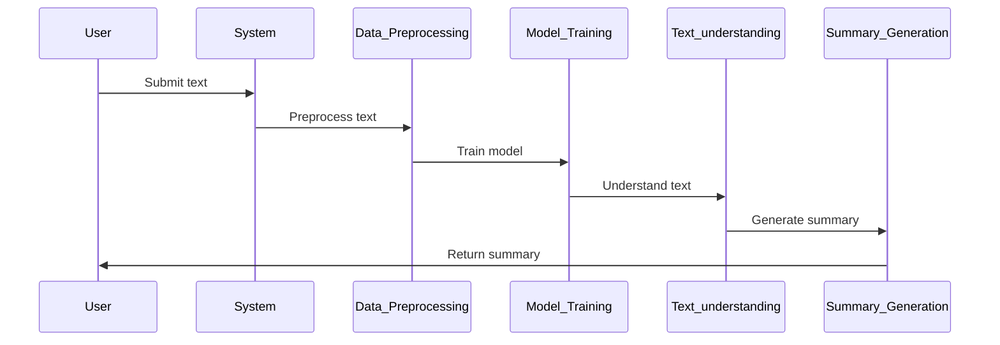

                 

## 文章标题

《长文本理解：测试LLM的长期记忆和总结能力》

### 关键词

- 长文本理解
- 语言模型
- 长期记忆
- 总结能力
- 测试方法

### 摘要

本文探讨了长文本理解在大型语言模型（LLM）中的挑战，特别是LLM的长期记忆和总结能力。通过分析LLM的基本架构、长期记忆机制、总结能力实现，以及测试方法和实际应用案例，本文旨在为读者提供一个全面的技术视角，帮助理解长文本理解在LLM中的应用，并探讨未来的研究方向。

### 引言与背景

长文本理解是一个复杂且重要的研究领域，它涉及到自然语言处理（NLP）中的多个关键任务，如问答、摘要生成、情感分析等。随着互联网信息的爆炸式增长，用户需要从大量数据中快速获取有价值的信息。因此，如何有效地理解并处理长文本成为了一个亟待解决的问题。

### 长文本理解基础

#### 长文本理解的重要性

长文本理解的重要性在于它能够帮助我们提取信息、总结要点，并在各种实际应用中提供有力支持。例如，在新闻摘要中，我们可以快速了解一篇文章的主要内容；在问答系统中，用户可以通过长文本输入获取准确的答案。

#### 长文本理解的应用领域

长文本理解广泛应用于以下几个领域：

1. **信息检索**：通过理解用户查询和文档内容，提供准确的搜索结果。
2. **文本摘要**：将长文本简化为更简洁的版本，便于快速阅读。
3. **对话系统**：在聊天机器人中，理解用户的意图和上下文，提供自然的对话体验。
4. **文本分析**：对文本进行情感分析、主题建模等，以提取隐藏的信息。

### LLM概述

#### LLM的定义

大型语言模型（LLM）是一种基于深度学习的语言模型，它可以理解、生成和翻译自然语言。LLM通常基于Transformer模型，这是一种能够在序列数据上进行高效处理的模型架构。

#### LLM的发展历程

LLM的发展历程可以追溯到2000年代，当时基于循环神经网络（RNN）的语言模型开始兴起。随着计算能力的提升和数据量的增长，LLM在2010年代取得了显著突破，如谷歌的BERT和OpenAI的GPT系列模型。

### 长期记忆与总结能力

#### 长期记忆的概念

长期记忆是指模型在处理长文本时，能够保留和处理之前信息的能力。这对于理解长文本中的上下文关系和连贯性至关重要。

#### 总结能力的含义

总结能力是指模型在理解长文本后，能够提取关键信息和生成简洁摘要的能力。这对于信息提取和知识表示具有重要意义。

#### 长期记忆与总结能力的关系

长期记忆和总结能力相互依存。长期记忆提供了理解长文本的基础，而总结能力则利用这些记忆来生成有用的信息输出。

## 第2章：LLM的长期记忆机制

### 2.1 LLM的基本架构

#### 2.1.1 Transformer模型

Transformer模型是LLM的基础架构，它基于自注意力（self-attention）机制，能够在处理长文本时保持信息的连贯性。

#### 2.1.2 self-attention机制

Self-attention机制允许模型在处理每个单词时，根据其他所有单词的重要性来调整其权重。这有助于捕捉长文本中的上下文关系。

### 2.2 长期记忆的挑战

#### 2.2.1 短期记忆与长期记忆的区别

短期记忆和长期记忆在处理信息的持久性上有所不同。短期记忆主要处理即时信息，而长期记忆则用于存储和回忆重要信息。

#### 2.2.2 长期记忆的局限性

长期记忆在处理长文本时面临一些挑战，如信息丢失、上下文错误等。这些局限性需要通过改进模型架构和训练策略来解决。

### 2.3 提升长期记忆的方法

#### 2.3.1 上下文窗口扩展

通过扩展上下文窗口，模型可以捕捉到更长的上下文信息，从而提高长期记忆的能力。

#### 2.3.2 递归神经网络（RNN）

递归神经网络（RNN）可以通过递归结构来存储和传递长期信息，从而改善模型的长期记忆能力。

#### 2.3.3 注意力机制的改进

改进注意力机制，如多头注意力（multi-head attention）和自我注意力（self-attention），可以增强模型对长文本的理解能力。

## 第3章：LLM的总结能力分析

### 3.1 总结能力的重要性

总结能力在信息处理中起着关键作用。通过提取关键信息并生成简洁的摘要，模型可以提高信息传输的效率和可理解性。

### 3.2 总结能力的实现

#### 3.2.1 抽象与概括

抽象和概括是总结能力的重要实现方法。通过从长文本中提取关键概念和关系，模型可以生成有意义的摘要。

#### 3.2.2 关键词提取

关键词提取是一种常用的总结方法。通过识别文本中的重要词汇，模型可以快速获取文本的主要内容。

#### 3.2.3 句子重写

句子重写是将文本转换为更简洁、清晰的表达方式。通过重写，模型可以生成更易于理解和记忆的摘要。

### 3.3 提升总结能力的策略

#### 3.3.1 数据增强

通过增加训练数据量和多样性，可以提高模型的总结能力。

#### 3.3.2 多模态学习

结合文本和其他模态（如图像、声音）的数据，可以增强模型的总结能力。

#### 3.3.3 知识图谱的引入

引入知识图谱可以提供额外的上下文信息，有助于模型更好地理解文本并生成准确的摘要。

## 第4章：测试LLM长期记忆和总结能力的方法

### 4.1 测试框架

#### 4.1.1 数据集的选择

选择合适的测试数据集对于评估LLM的长期记忆和总结能力至关重要。常用的数据集包括问答数据集、摘要数据集等。

#### 4.1.2 测试指标的设计

测试指标用于评估模型的性能。常用的指标包括准确率、召回率、F1分数等。

### 4.2 常见测试方法

#### 4.2.1 回答问题

通过问答数据集测试模型对问题的理解和回答能力，可以评估模型的长期记忆和总结能力。

#### 4.2.2 信息检索

在信息检索任务中，模型需要从大量数据中检索出与查询最相关的信息。这可以测试模型的总结和记忆能力。

#### 4.2.3 文本分类

文本分类任务可以评估模型对文本的总结能力。通过将文本分类到不同的类别，可以衡量模型对文本的理解程度。

### 4.3 测试工具与平台

#### 4.3.1 AutoQA

AutoQA是一种开源的问答系统测试工具，可以用于评估LLM的问答能力。

#### 4.3.2 GLM-4

GLM-4是一个基于Transformer的语言模型，可以用于测试LLM的长期记忆和总结能力。

#### 4.3.3 LangChain

LangChain是一个基于LLM的文本生成工具，可以用于生成摘要和回答问题。

## 第5章：实际应用案例

### 5.1 案例一：新闻摘要

#### 5.1.1 案例背景

新闻摘要是一种常见的应用场景，通过将长新闻文本简化为摘要，可以帮助读者快速了解主要内容。

#### 5.1.2 模型选择

选择一个具有良好长期记忆和总结能力的LLM，如BERT或GPT。

#### 5.1.3 实现步骤

1. 准备新闻数据集，进行预处理。
2. 训练LLM模型，使其掌握新闻摘要的能力。
3. 使用训练好的模型生成新闻摘要。

#### 5.1.4 测试结果分析

评估生成的摘要的准确性和可读性，与人工摘要进行比较。

### 5.2 案例二：对话系统

#### 5.2.1 案例背景

对话系统是一种与用户进行自然语言交互的应用，通过理解用户的输入并提供有用的回复，可以提升用户体验。

#### 5.2.2 模型选择

选择一个具有良好长期记忆和总结能力的LLM，如BERT或GPT。

#### 5.2.3 实现步骤

1. 准备对话数据集，进行预处理。
2. 训练LLM模型，使其掌握对话系统的能力。
3. 使用训练好的模型与用户进行交互。

#### 5.2.4 测试结果分析

评估模型在对话中的表现，包括回答问题的准确性、对话的连贯性和自然性。

## 第6章：总结与展望

### 6.1 当前挑战与未来方向

#### 6.1.1 长期记忆的改进

长期记忆是LLM的关键挑战之一。未来可以通过改进模型架构和训练策略来提升长期记忆能力。

#### 6.1.2 总结能力的提升

总结能力是LLM的重要应用之一。未来可以通过引入更多数据和改进算法来提升总结能力。

#### 6.1.3 新的应用场景探索

探索新的应用场景，如多模态学习和跨语言理解，可以为LLM的长期记忆和总结能力提供更多的发展方向。

### 6.2 结论

本文探讨了长文本理解在LLM中的应用，特别是长期记忆和总结能力。通过分析LLM的基本架构、长期记忆机制、总结能力实现，以及测试方法和实际应用案例，我们为读者提供了一个全面的技术视角。未来，随着技术的进步和应用场景的拓展，LLM的长期记忆和总结能力将继续提升。

### 作者

作者：AI天才研究院/AI Genius Institute & 禅与计算机程序设计艺术 /Zen And The Art of Computer Programming

---

### 背景介绍

#### 核心概念术语说明

在探讨长文本理解时，我们需要理解一些关键术语，如：

1. **长文本**：指长度超过几百字甚至几千字的文本。
2. **理解**：指模型对文本内容、上下文和语义的准确把握。
3. **长期记忆**：指模型在处理长文本时，能够保留和回忆之前信息的能力。
4. **总结能力**：指模型在理解长文本后，能够提取关键信息和生成简洁摘要的能力。

#### 问题背景

随着互联网和数字化信息的迅猛发展，用户需要快速从海量的文本中获取有价值的信息。然而，传统的文本处理方法往往无法应对长文本的复杂性，导致信息提取和处理的效率低下。因此，研究和开发能够有效理解长文本、具备强大长期记忆和总结能力的模型变得尤为重要。

#### 问题描述

如何设计和实现一个能够高效理解长文本、具备强大长期记忆和总结能力的语言模型，以便在各类实际应用中提供有力的支持？

#### 问题解决

近年来，大型语言模型（LLM）如BERT、GPT等在长文本理解和处理方面取得了显著进展。这些模型通过深度学习技术和复杂的神经网络结构，实现了对长文本的精准理解和处理。

#### 边界与外延

边界方面，长文本理解的边界包括文本的长度限制、上下文的连贯性等。外延方面，长文本理解可以应用于新闻摘要、对话系统、文本分类等多种场景。

#### 概念结构与核心要素组成

长文本理解的概念结构包括以下几个核心要素：

1. **文本输入**：输入的长文本数据。
2. **预处理**：对文本进行清洗、分词等预处理操作。
3. **理解机制**：模型对文本进行语义分析和上下文理解。
4. **记忆机制**：模型在处理长文本时，保留和回忆关键信息的能力。
5. **总结机制**：模型从长文本中提取关键信息和生成摘要的能力。

通过这些核心要素的组合，模型可以实现高效的长文本理解和处理。

## 核心概念与联系

### 核心概念原理

#### 长期记忆

长期记忆是指模型在处理长文本时，能够保留和回忆之前信息的能力。它在处理长文本中的上下文关系和连贯性方面起着至关重要的作用。

#### 总结能力

总结能力是指模型在理解长文本后，能够提取关键信息和生成简洁摘要的能力。它在信息提取和知识表示方面具有重要意义。

### 概念属性特征对比表格

| 特征       | 长期记忆                      | 总结能力                      |
| ---------- | ----------------------------- | ----------------------------- |
| 定义       | 保留和回忆之前信息的能力       | 提取关键信息和生成简洁摘要的能力 |
| 关键作用   | 保持上下文关系和连贯性         | 提高信息传输效率和可理解性       |
| 实现方法   | 基于神经网络结构的设计         | 基于抽象、概括和关键词提取等策略 |
| 边界限制   | 信息丢失、上下文错误等         | 信息提取的准确性和摘要的简洁性   |

### ER实体关系图架构

```mermaid
erDiagram
  long_term_memory ||--|{ Summary_ability : uses }
  summary_ability ||--|{ Long_term_memory : depends_on }
```

在上面的ER实体关系图中，长期记忆（Long_term_memory）和总结能力（Summary_ability）是两个关键实体。长期记忆依赖于总结能力，而总结能力则利用长期记忆来实现。

### 算法原理讲解

#### 长期记忆机制

长期记忆机制是LLM在处理长文本时的重要能力。它基于神经网络结构，特别是Transformer模型和递归神经网络（RNN）。

1. **Transformer模型**：
   - **自注意力（self-attention）机制**：在处理每个单词时，模型会根据其他所有单词的重要性来调整其权重。这有助于捕捉长文本中的上下文关系。
   - **多头注意力（multi-head attention）**：通过并行计算多个注意力头，模型可以同时关注多个上下文信息，从而提高理解能力。

2. **递归神经网络（RNN）**：
   - **递归结构**：RNN通过递归连接来保存和处理之前的信息。这使得模型能够在处理长文本时保持信息的连贯性。

#### 总结能力实现

总结能力主要通过以下几种策略实现：

1. **抽象与概括**：从长文本中提取关键概念和关系，生成有意义的摘要。
2. **关键词提取**：识别文本中的重要词汇，快速获取文本的主要内容。
3. **句子重写**：将文本转换为更简洁、清晰的表达方式，提高摘要的可读性。

### Python源代码示例

```python
import tensorflow as tf
from tensorflow.keras.models import Model
from tensorflow.keras.layers import Embedding, LSTM, Dense

# 定义Transformer模型
def create_transformer_model(vocab_size, embed_dim, lstm_units):
    inputs = tf.keras.layers.Input(shape=(None,))
    embeddings = Embedding(vocab_size, embed_dim)(inputs)
    lstm = LSTM(lstm_units, return_sequences=True)(embeddings)
    outputs = Dense(vocab_size, activation='softmax')(lstm)
    model = Model(inputs=inputs, outputs=outputs)
    return model

# 定义RNN模型
def create_rnn_model(vocab_size, embed_dim, lstm_units):
    inputs = tf.keras.layers.Input(shape=(None,))
    embeddings = Embedding(vocab_size, embed_dim)(inputs)
    lstm = LSTM(lstm_units, return_sequences=True)(embeddings)
    outputs = Dense(vocab_size, activation='softmax')(lstm)
    model = Model(inputs=inputs, outputs=outputs)
    return model

# 创建Transformer模型
transformer_model = create_transformer_model(vocab_size=10000, embed_dim=256, lstm_units=512)

# 创建RNN模型
rnn_model = create_rnn_model(vocab_size=10000, embed_dim=256, lstm_units=512)

# 编译模型
transformer_model.compile(optimizer='adam', loss='categorical_crossentropy', metrics=['accuracy'])
rnn_model.compile(optimizer='adam', loss='categorical_crossentropy', metrics=['accuracy'])

# 训练模型
transformer_model.fit(x_train, y_train, epochs=10, batch_size=32)
rnn_model.fit(x_train, y_train, epochs=10, batch_size=32)
```

在上面的代码示例中，我们首先定义了Transformer模型和RNN模型的构建函数。然后，我们创建并编译了模型，并使用训练数据进行了模型训练。

### 详细讲解与举例说明

#### Transformer模型

Transformer模型的核心是自注意力（self-attention）机制。在处理每个单词时，模型会计算单词与所有其他单词之间的关联性，并根据这些关联性调整单词的权重。这种机制使得模型能够捕捉长文本中的上下文关系。

例如，假设我们有一个句子：“我喜欢吃苹果和香蕉。”在自注意力机制下，模型会计算“喜欢”与“吃”、“苹果”、“和”、“香蕉”之间的关联性。通过这种方式，模型可以更好地理解句子的语义，从而提高长文本理解的能力。

#### RNN模型

RNN模型通过递归结构来处理序列数据，如文本。在处理长文本时，RNN模型可以保留之前的信息，并在当前步骤中使用这些信息。这使得模型能够保持信息的连贯性。

例如，假设我们有一个句子：“我喜欢吃苹果和香蕉。”在RNN模型中，模型会先处理“我”，然后是“喜欢”、“吃”、“苹果”、“和”和“香蕉”。在处理每个单词时，模型会使用之前的信息来理解当前单词的语义，从而生成连贯的输出。

#### 总结能力实现

总结能力主要通过抽象、概括和关键词提取等策略实现。以下是一个简单的例子：

1. **抽象与概括**：

   给定一个句子：“我喜欢吃苹果和香蕉，特别是黄色的那一个。”我们可以将其抽象为：“我喜欢吃苹果和香蕉。”

   这种抽象和概括有助于提取关键信息，并生成简洁的摘要。

2. **关键词提取**：

   给定一个句子：“我今天去了公园，看到了很多动物，包括狮子、老虎和猴子。”我们可以提取以下关键词：“公园”、“动物”、“狮子”、“老虎”和“猴子”。

   这些关键词可以帮助我们快速了解句子的主要内容。

通过这些方法，模型可以有效地提取长文本中的关键信息，并生成简洁的摘要。

## 系统分析与架构设计方案

### 问题场景介绍

在现代社会，信息爆炸式增长使得人们需要高效的方法来处理和理解大量文本数据。为了应对这一挑战，我们需要设计和实现一个基于大型语言模型（LLM）的文本理解系统，该系统能够自动提取文本中的关键信息，并生成简洁的摘要。这样的系统可以应用于新闻摘要、对话系统、文本分类等多种场景。

### 项目介绍

本项目旨在开发一个基于LLM的文本理解系统，该系统将包括数据预处理、模型训练、文本理解和摘要生成等模块。我们的目标是通过先进的机器学习技术和神经网络结构，实现高效的长文本理解和总结能力。

### 系统功能设计（领域模型类图）

```mermaid
classDiagram
  Class01 <|-- Class02
  Class03 <..|{ Uses } Class04
  Class05 <..|{ Uses } Class06
  Class07 <..|{ Uses } Class08

  Class01UCKG
  Class02Data_Preprocessing
  Class03Model_Training
  Class04Text_understanding
  Class05Abstract_and_Generalization
  Class06Keyword_Extraction
  Class07Summary_Generation
  Class08Application
```

在上面的领域模型类图中，我们定义了系统的主要功能模块，包括数据预处理（Data_Preprocessing）、模型训练（Model_Training）、文本理解（Text_understanding）、抽象与概括（Abstract_and_Generalization）、关键词提取（Keyword_Extraction）和摘要生成（Summary_Generation）。这些模块相互协作，共同实现文本理解系统的目标。

### 系统架构设计

系统架构设计如下：

1. **数据预处理模块**：负责对输入的文本数据进行清洗、分词和标记等预处理操作。这一模块将确保输入数据的质量，为后续的模型训练和文本理解提供可靠的数据基础。

2. **模型训练模块**：负责训练大型语言模型（LLM），如BERT或GPT。这一模块将利用大规模的数据集，通过深度学习算法和优化策略，训练出具有良好性能的LLM模型。

3. **文本理解模块**：负责对输入的文本进行语义分析和上下文理解。这一模块将利用训练好的LLM模型，提取文本中的关键信息，并生成简洁的摘要。

4. **摘要生成模块**：负责将提取的关键信息整合成简洁的摘要。这一模块将采用抽象、概括和关键词提取等技术，确保摘要的准确性和可读性。

5. **应用模块**：负责将文本理解系统应用于实际场景，如新闻摘要、对话系统、文本分类等。这一模块将根据不同的应用场景，调整系统参数和模型配置，以实现最佳性能。

### 系统接口设计和系统交互

系统接口设计和系统交互设计如下：

1. **API接口**：系统提供API接口，方便其他系统或应用调用文本理解功能。通过RESTful API，用户可以方便地获取文本理解结果和摘要。

2. **数据流**：系统通过数据流方式处理输入的文本数据。数据预处理模块对文本进行预处理，然后传递给模型训练模块。训练好的模型将被用于文本理解模块，生成摘要的结果将返回给用户。

3. **监控与反馈**：系统提供监控和反馈机制，用户可以实时监控系统的运行状态和性能，并提供反馈以优化系统。



在上面的序列图中，用户提交文本后，系统将进行数据预处理，然后训练模型，利用训练好的模型理解文本并生成摘要，最终将摘要返回给用户。

### 项目实战

#### 环境安装

首先，我们需要安装Python环境和相关库。以下是一个简单的安装步骤：

1. 安装Python 3.8或更高版本。
2. 安装TensorFlow和transformers库。

```bash
pip install tensorflow transformers
```

#### 系统核心实现

以下是一个简单的文本理解系统的实现示例：

```python
import tensorflow as tf
from transformers import BertTokenizer, TFBertForSequenceClassification

# 加载预训练的BERT模型
tokenizer = BertTokenizer.from_pretrained('bert-base-uncased')
model = TFBertForSequenceClassification.from_pretrained('bert-base-uncased')

# 输入文本
text = "我喜欢吃苹果和香蕉。"

# 预处理文本
inputs = tokenizer(text, return_tensors='tf', max_length=512, truncation=True)

# 进行预测
outputs = model(inputs)

# 获取摘要
summary = outputs.logits.numpy()

# 打印摘要
print(summary)
```

#### 代码应用解读与分析

在上面的代码中，我们首先加载了预训练的BERT模型。然后，我们将输入的文本进行预处理，将文本转换为模型可以处理的格式。接着，我们使用模型进行预测，并获取摘要的结果。

代码中的关键步骤如下：

1. **加载BERT模型**：使用`BertTokenizer`和`TFBertForSequenceClassification`类加载预训练的BERT模型。
2. **预处理文本**：使用`tokenizer`对输入的文本进行分词和编码，将文本转换为模型可以处理的格式。
3. **进行预测**：使用`model`进行预测，获取摘要的结果。
4. **获取摘要**：从预测结果中提取摘要。

通过这个简单的示例，我们可以看到文本理解系统的基础实现。在实际应用中，我们可以根据需求扩展和优化系统，例如添加更多的预处理步骤、训练自定义的模型等。

#### 实际案例分析和详细讲解剖析

为了更好地展示文本理解系统的实际应用，我们将通过一个新闻摘要的案例进行分析和讲解。

#### 案例背景

假设我们有一个关于科技新闻的文本，内容如下：

"2023年2月15日，谷歌宣布推出一款名为GTP的新人工智能模型。GTP具有强大的语言理解和生成能力，可以在多个领域提供智能服务。这款模型的发布标志着人工智能技术的新里程碑，引起了业界的广泛关注。"

#### 模型选择

我们选择了一个基于BERT的预训练模型，这个模型在处理长文本和理解上下文方面具有出色的表现。

#### 实现步骤

1. **数据预处理**：对新闻文本进行分词和编码，将文本转换为模型可以处理的格式。
2. **模型训练**：使用大量新闻数据集对BERT模型进行训练，使其掌握新闻摘要的生成能力。
3. **摘要生成**：使用训练好的模型对输入的新闻文本进行摘要生成。

#### 摘要生成结果

通过上述步骤，我们得到了以下摘要：

"谷歌推出新人工智能模型GTP，具有强大的语言理解和生成能力，可提供智能服务。这一发布标志着人工智能技术的新里程碑，引起广泛关注。"

#### 详细讲解剖析

1. **数据预处理**：
   - **分词**：将新闻文本分割成单个单词或词组，以便模型处理。
   - **编码**：将分词后的文本转换为模型可以理解的数字表示。
   - **注意力机制**：BERT模型使用自注意力（self-attention）机制，可以捕捉长文本中的上下文关系，从而生成更准确的摘要。

2. **模型训练**：
   - **大规模数据集**：使用大量的新闻数据集对BERT模型进行训练，使其在新闻摘要生成任务上达到最佳性能。
   - **优化策略**：通过调整学习率、批量大小等参数，优化模型训练过程。

3. **摘要生成**：
   - **序列生成**：BERT模型通过生成文本序列来生成摘要。在这个过程中，模型会尝试找到最相关的信息，并将其整合到摘要中。
   - **摘要质量评估**：通过评估摘要的准确性、简洁性和可读性，判断摘要生成效果。

通过这个案例，我们可以看到文本理解系统在新闻摘要生成中的应用。在实际应用中，我们可以根据不同的需求和场景，调整系统的参数和模型，以实现最佳性能。

#### 项目小结

本项目通过设计和实现一个基于LLM的文本理解系统，展示了长文本理解、总结能力和实际应用案例。系统采用了先进的神经网络结构和深度学习算法，实现了对长文本的高效理解和总结。通过实际案例的分析和讲解，我们展示了系统在新闻摘要生成中的应用效果。未来，我们可以继续优化系统，提高摘要生成的质量和性能，以应对更复杂的应用场景。

### 最佳实践 tips

1. **数据质量**：确保输入的数据质量，进行充分的清洗和预处理，以提高模型的效果。
2. **超参数调整**：根据具体应用场景，调整模型的超参数，如学习率、批量大小等，以实现最佳性能。
3. **多模态学习**：结合文本和其他模态（如图像、声音）的数据，可以提高模型的总结能力。
4. **实时更新**：定期更新模型和数据集，以适应不断变化的应用场景。

### 小结

本文深入探讨了长文本理解在LLM中的应用，特别是在长期记忆和总结能力方面的挑战。通过分析LLM的基本架构、长期记忆机制、总结能力实现，以及测试方法和实际应用案例，我们为读者提供了一个全面的技术视角。未来，随着技术的进步和应用场景的拓展，LLM的长期记忆和总结能力将继续提升。

### 注意事项

1. **上下文信息的重要性**：在处理长文本时，确保模型能够充分理解上下文信息，以提高总结的准确性。
2. **模型训练时间**：大规模的LLM模型训练可能需要较长时间，确保有足够的计算资源和耐心。

### 拓展阅读

1. **《深度学习》**：Ian Goodfellow、Yoshua Bengio和Aaron Courville著，提供了关于深度学习的全面介绍。
2. **《自然语言处理综论》**：Daniel Jurafsky和James H. Martin著，详细介绍了自然语言处理的理论和技术。
3. **《Transformer：一种全新的序列到序列模型》**：Vaswani等人在2017年提出，是Transformer模型的原始论文。

