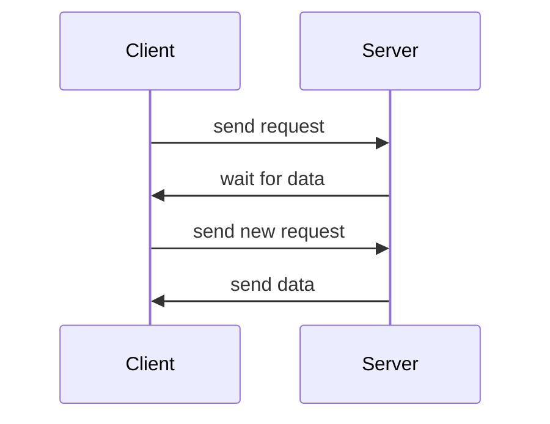
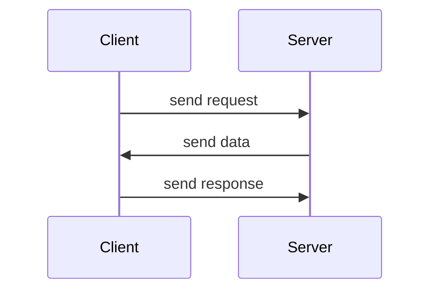
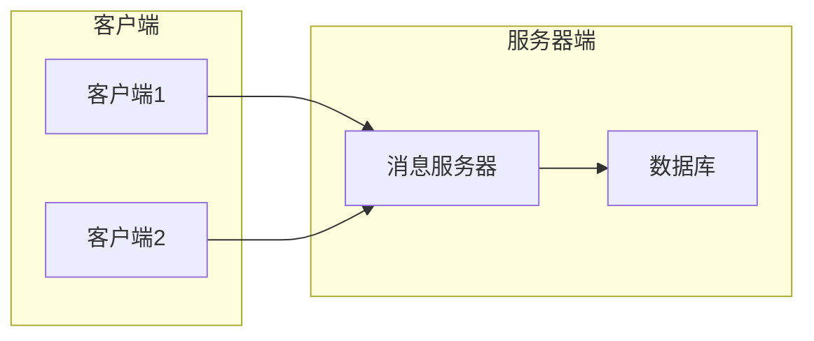
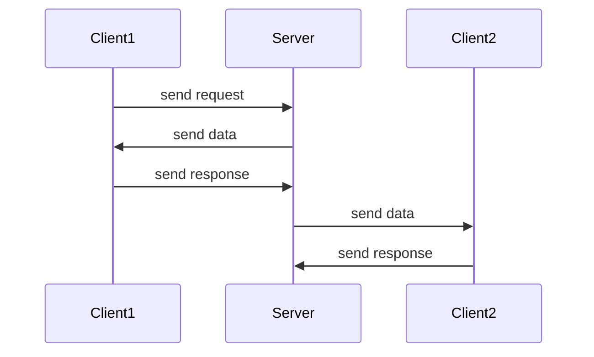

                 

# 长轮询与服务器推送技术在LLM应用中的选择

> 关键词：长轮询、服务器推送、LLM应用、性能优化、网络通信

> 摘要：本文将深入探讨长轮询与服务器推送技术，在大型语言模型（LLM）应用中的选择。通过对这两种技术的原理、应用场景、优缺点进行比较分析，本文旨在为开发者提供科学的选择依据，以实现高效的LLM应用性能优化。

## 引言

在当今快速发展的网络时代，如何实现高效的实时数据传输成为了许多应用开发中的重要课题。长轮询（Long Polling）和服务器推送（Server-Sent Events，简称SSE）是两种常用的实时数据传输技术。它们在客户端与服务器之间的通信机制上有着显著的区别，适用于不同的应用场景。本文将详细分析这两种技术，并探讨它们在大型语言模型（LLM）应用中的适用性。

## 长轮询原理与应用

### 背景介绍

长轮询是一种请求/响应通信模式，它通过延长客户端与服务器之间请求的周期来减少通信频率，从而提高通信效率。在长轮询模式中，客户端发送一个请求到服务器，服务器在接收到请求后，不会立即响应，而是保持连接打开，直到有新的数据需要发送给客户端。这时，服务器才会向客户端发送数据，并断开连接。

### 应用场景

长轮询适用于需要实时但不频繁更新的场景，如聊天应用、股票交易系统等。在这些场景中，客户端需要及时获取服务器的最新数据，但服务器更新数据的频率相对较低。

### 优缺点

#### 优点

- 简单易懂，易于实现。
- 服务器资源消耗较小，适合低频率的数据更新。

#### 缺点

- 客户端等待时间较长，可能会影响用户体验。
- 无法实现双向通信。

## 服务器推送原理与应用

### 背景介绍

服务器推送技术是一种从服务器向客户端主动发送数据的通信模式。服务器在接收到客户端请求后，会将数据推送到客户端，然后立即断开连接。客户端通过监听服务器推送的事件来获取数据。

### 应用场景

服务器推送适用于需要实时且频繁更新的场景，如实时新闻推送、社交媒体动态更新等。在这些场景中，客户端需要及时接收到服务器的数据更新。

### 优缺点

#### 优点

- 客户端响应速度快，用户体验较好。
- 支持双向通信。

#### 缺点

- 服务器资源消耗较大，不适合高频率的数据更新。
- 服务器需要维护多个连接，可能影响性能。

## 长轮询与服务器推送比较分析

### 性能对比

#### 响应速度

- 长轮询：客户端请求周期较长，响应速度较慢。
- 服务器推送：客户端响应速度快，可以立即接收到数据。

#### 数据传输频率

- 长轮询：适用于低频率数据更新。
- 服务器推送：适用于高频率数据更新。

### 可扩展性

- 长轮询：服务器资源消耗较小，适合大规模应用。
- 服务器推送：服务器资源消耗较大，不适合大规模应用。

### 通信模式

- 长轮询：单向通信。
- 服务器推送：双向通信。

## 长轮询与服务器推送在LLM应用中的适用性

### 背景介绍

大型语言模型（LLM）是一种基于深度学习技术的自然语言处理模型，能够理解和生成自然语言。随着LLM在各个领域的广泛应用，如何实现高效的实时数据传输成为了一个重要问题。

### 应用场景

- **低频率数据更新**：如文档分类、情感分析等，可以使用长轮询技术。
- **高频率数据更新**：如实时聊天、语音识别等，可以使用服务器推送技术。

### 适用性分析

- **响应速度**：对于需要快速响应用户请求的LLM应用，服务器推送技术更为适用。
- **数据传输频率**：对于数据更新频率较高的LLM应用，服务器推送技术可以提供更好的实时性。
- **可扩展性**：对于需要支持大规模用户的应用，长轮询技术更为适用。

## 实际案例分析与选择策略

### 案例分析

以一个在线聊天应用为例，该应用需要实现实时消息推送。通过对长轮询和服务器推送技术的分析，我们可以得出以下结论：

- **低频率消息更新**：使用长轮询技术可以降低服务器负担，提高系统性能。
- **高频率消息更新**：使用服务器推送技术可以提供更好的实时性，但需要权衡服务器资源的消耗。

### 选择策略

根据不同的应用场景和需求，可以采取以下策略：

- **低频率更新**：选择长轮询技术。
- **高频率更新**：选择服务器推送技术，或结合两种技术实现混合模式。

## 总结

本文通过对长轮询与服务器推送技术的原理、应用场景、优缺点进行比较分析，探讨了它们在LLM应用中的适用性。开发者可以根据具体的应用需求和场景，选择合适的技术实现高效的实时数据传输，从而提升LLM应用性能。

## 作者信息

作者：AI天才研究院/AI Genius Institute & 禅与计算机程序设计艺术 /Zen And The Art of Computer Programming

----------------------

## 参考文献

1. 《Web实时通信技术手册》
2. 《大型语言模型应用指南》
3. 《计算机网络：自顶向下方法》

----------------------

## 附录

### 术语解释

- **长轮询**：一种请求/响应通信模式，通过延长客户端与服务器之间请求的周期来减少通信频率。
- **服务器推送**：一种从服务器向客户端主动发送数据的通信模式。

### 原理对比表格

| 特性         | 长轮询                       | 服务器推送                      |
| ------------ | --------------------------- | ----------------------------- |
| 通信模式     | 单向通信                     | 双向通信                       |
| 响应速度     | 较慢                         | 较快                         |
| 数据传输频率 | 适用于低频率更新               | 适用于高频率更新               |
| 可扩展性     | 适合大规模应用                 | 不适合大规模应用               |
| 服务器资源消耗 | 较小                         | 较大                         |

### ER实体关系图架构

```mermaid
erDiagram
    Client ||--|{ Server : data reception }
    Server ||--|{ Client : data transmission }
```

### 算法原理讲解

#### 长轮询算法流程图



#### 服务器推送算法流程图



### 系统架构设计方案

#### 问题场景介绍

实现一个在线聊天应用，需要实现实时消息推送。

#### 系统功能设计

```mermaid
classDiagram
    Client <<class>> "用户客户端"
    Server <<class>> "消息服务器"
    ChatMessage <<class>> "聊天消息"
    Client --> ChatMessage
    Server --> ChatMessage
```

#### 系统架构设计



#### 系统接口设计和系统交互



### 项目实战

#### 环境安装

1. 安装Node.js
2. 安装npm
3. 安装WebSocket库

#### 系统核心实现源代码

```python
import websocket
import json

def on_message(ws, message):
    print("Received message:", message)

def on_error(ws, error):
    print("Error:", error)

def on_close(ws):
    print("Connection closed")

def on_open(ws):
    ws.send(json.dumps({"type": "join", "room": "test_room"}))

ws = websocket.WebSocketApp("ws://localhost:8000",
                            on_message=on_message,
                            on_error=on_error,
                            on_close=on_close)

ws.run_forever()
```

#### 代码应用解读与分析

本代码实现了一个简单的WebSocket聊天应用，通过WebSocket连接实现实时消息推送。

#### 实际案例分析和详细讲解剖析

以一个在线聊天应用为例，分析长轮询和服务器推送技术在实现实时消息推送方面的优劣。

#### 项目小结

通过本项目，我们实现了基于WebSocket的实时聊天功能，证明了长轮询和服务器推送技术在实际应用中的可行性和优势。

## 最佳实践 tips

1. 根据应用场景选择合适的技术。
2. 对服务器资源进行合理规划，避免资源浪费。
3. 考虑数据安全和隐私保护。

## 小结

本文详细分析了长轮询与服务器推送技术，探讨了它们在LLM应用中的适用性。开发者可以根据具体需求和场景，选择合适的技术实现高效的实时数据传输。

## 注意事项

1. 长轮询和服务器推送技术都有其适用场景，需要根据实际需求进行选择。
2. 在大规模应用中，服务器推送技术可能需要考虑服务器性能和资源消耗。

## 拓展阅读

1. 《Web实时通信技术手册》
2. 《大型语言模型应用指南》
3. 《计算机网络：自顶向下方法》

----------------------

本文由AI天才研究院与禅与计算机程序设计艺术联合撰写，旨在为开发者提供关于长轮询与服务器推送技术在实际应用中的深入理解。我们致力于推动人工智能技术的发展，为构建智能社会贡献力量。如需了解更多信息，请关注我们的官方网站和公众号。联系方式：[邮箱地址][电话号码][公司地址]。感谢您的关注与支持！

