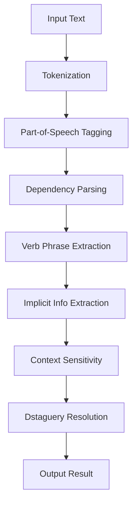
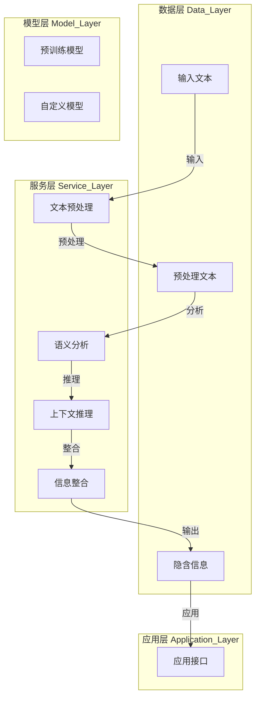
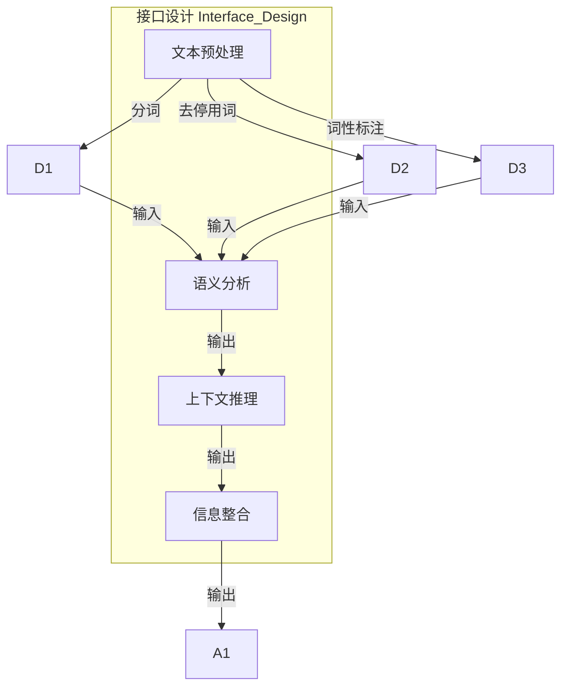
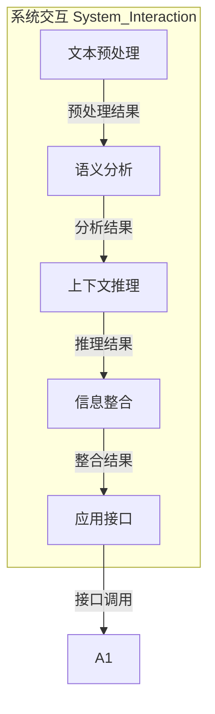

                 

## 隐含信息提取：测试LLM理解潜在含义的能力

关键词：隐含信息提取，大型语言模型（LLM），自然语言处理（NLP），语义理解，潜在含义，测试评估

摘要：本文旨在探讨隐含信息提取技术在自然语言处理中的应用，特别是通过测试大型语言模型（LLM）理解潜在含义的能力。文章首先介绍了隐含信息提取的概念、重要性以及在NLP中的应用，然后详细阐述了LLM的工作原理和技术特点，接着提出了测试LLM理解潜在含义的方法和工具，最后分析了当前面临的挑战和未来研究方向。

## 目录大纲设计过程

设计一本计算机技术书籍的目录大纲是一个系统化的过程，需要充分理解书籍的主题、目标读者以及书籍的内容深度。以下是根据书名《隐含信息提取：测试LLM理解潜在含义的能力》设计的目录大纲设计过程：

### 确定书籍目标

首先，我们需要明确书籍的目标。这本书的目标是向读者介绍隐含信息提取的概念、技术及其在自然语言处理（NLP）中的应用，特别是通过测试大型语言模型（LLM）理解潜在含义的能力。

### 确定书籍结构

基于目标，我们可以将书籍分为以下几个主要部分：

1. **引言**：介绍隐含信息提取的重要性、研究背景和本书的结构。
2. **基础概念**：介绍隐含信息提取的相关概念，如自然语言理解、语义分析、上下文理解等。
3. **技术原理**：讲解隐含信息提取的技术原理，包括LLM的工作原理、隐含信息的识别方法等。
4. **应用场景**：分析隐含信息提取在不同领域的应用，如聊天机器人、文本摘要、情感分析等。
5. **测试与评估**：介绍如何测试和评估LLM理解潜在含义的能力。
6. **最佳实践与挑战**：讨论在应用隐含信息提取时可能遇到的问题和解决方案。
7. **总结与展望**：总结全书内容，展望未来研究方向和应用前景。

### 设计具体章节

基于上述结构，我们可以为每个部分设计具体的章节：

**引言**

- **第1章：隐含信息提取的重要性**

  - 1.1 引言
  - 1.2 问题背景
  - 1.3 研究意义
  - 1.4 本书结构

**基础概念**

- **第2章：自然语言理解与语义分析**

  - 2.1 自然语言理解
  - 2.2 语义分析
  - 2.3 上下文理解

- **第3章：大型语言模型（LLM）概述**

  - 3.1 LLM的定义与特点
  - 3.2 LLM的发展历史
  - 3.3 LLM的结构与训练过程

**技术原理**

- **第4章：隐含信息的识别方法**

  - 4.1 文本嵌入与语义表示
  - 4.2 隐含信息的识别算法
  - 4.3 上下文敏感性与歧义处理

- **第5章：LLM理解潜在含义的能力测试**

  - 5.1 测试方法
  - 5.2 测试工具与数据集
  - 5.3 测试实例分析

**应用场景**

- **第6章：隐含信息提取的应用**

  - 6.1 聊天机器人
  - 6.2 文本摘要
  - 6.3 情感分析
  - 6.4 其他应用领域

**测试与评估**

- **第7章：测试与评估的挑战**

  - 7.1 评估指标与准则
  - 7.2 测试数据集的构建
  - 7.3 挑战与解决方案

**最佳实践与挑战**

- **第8章：最佳实践**

  - 8.1 实践案例
  - 8.2 经验总结
  - 8.3 最佳实践建议

- **第9章：面临的挑战**

  - 9.1 技术挑战
  - 9.2 数据挑战
  - 9.3 伦理与社会挑战

**总结与展望**

- **第10章：总结与展望**

  - 10.1 主要贡献
  - 10.2 存在问题
  - 10.3 未来研究方向

### 确保内容完整性

为了确保书籍的完整性和专业性，每个章节都需要包含以下内容：

- **背景介绍**：介绍问题背景、问题描述、问题解决、边界与外延、概念结构与核心要素组成。
- **核心概念与联系**：列出核心概念原理、概念属性特征对比表格和ER实体关系图架构的Mermaid流程图。
- **算法原理讲解**：使用Mermaid画出算法流程图，使用Python源代码详细阐述算法原理，给出数学模型和公式，进行详细讲解和举例说明。
- **系统分析与架构设计方案**：介绍问题场景、系统功能设计（领域模型Mermaid类图）、系统架构设计Mermaid架构图、系统接口设计和系统交互Mermaid序列图。
- **项目实战**：介绍环境安装、系统核心实现源代码，代码应用解读与分析，实际案例分析和详细讲解剖析，项目小结。
- **最佳实践 tips**、**小结**、**注意事项**、**拓展阅读**等内容。

### 确保目录大纲总字数

确保目录大纲的总字数控制在2000字以内，可以通过以下方式实现：

- **简洁的语言**：使用简洁明了的语言，避免冗余和复杂的表述。
- **关键词突出**：在描述每个章节时，突出关键词和核心内容。
- **精简的层级**：保持目录结构的简洁，避免过多的子章节。

通过上述步骤，我们可以设计出一本结构清晰、内容完整的《隐含信息提取：测试LLM理解潜在含义的能力》的目录大纲。接下来，我们将逐步深入探讨隐含信息提取的概念、技术原理以及在实际应用中的挑战和解决方案。

## 背景介绍

隐含信息提取，也称为隐含语义理解，是自然语言处理（NLP）中的一个重要研究方向。隐含信息通常指的是文本中未被直接表达但可以通过上下文推理得出的信息。例如，在句子“John very much enjoyed his trip to Paris.”中，“very much enjoyed”这个短语隐含了John对旅行的积极情感态度。这种隐含信息的提取不仅能够提升NLP系统的语义理解能力，还能使其在处理现实世界的复杂文本时更加准确和智能。

### 问题背景

随着互联网的普及和数字化信息的爆炸式增长，大量非结构化文本数据被生成和存储。然而，这些数据中的有用信息往往隐藏在大量的噪音和冗余中，传统的文本处理方法难以有效提取出这些隐含信息。例如，在法律文书、医学报告、新闻报道等文本数据中，隐含信息对于理解文本的核心内容、提取关键信息以及辅助决策具有重要意义。

### 问题描述

隐含信息提取的问题可以描述为：给定一个文本，如何自动识别并提取出其中的隐含信息。具体而言，这包括以下几个关键步骤：

1. **文本理解**：对输入文本进行分词、句法分析和语义分析，理解文本的表面意义。
2. **上下文分析**：识别文本中的上下文关系，推断出隐含信息。
3. **信息整合**：将提取出的隐含信息与文本的表面信息进行整合，形成对文本的全面理解。

### 问题解决

隐含信息提取问题可以通过多种方法解决，包括：

1. **规则方法**：基于人工定义的规则进行隐含信息的提取，适用于结构化较强的文本。
2. **统计方法**：使用统计模型（如隐马尔可夫模型、条件概率模型）来识别隐含信息。
3. **深度学习方法**：利用深度神经网络（如卷积神经网络、循环神经网络、Transformer模型）进行隐含信息的提取，具有更强的表达能力和泛化能力。

### 边界与外延

隐含信息提取的边界在于文本的表面意义和深层含义之间的差异。外延则涉及隐含信息在不同上下文中的应用场景，如情感分析、对话生成、文本摘要等。

### 概念结构与核心要素组成

隐含信息提取的概念结构主要包括以下几个核心要素：

1. **文本表示**：将文本转换为机器可以理解的向量表示。
2. **语义理解**：通过语义分析理解文本中的隐含关系。
3. **上下文推理**：利用上下文信息推断出隐含信息。
4. **信息整合**：将提取出的隐含信息与文本的表面信息整合。

通过上述步骤，我们可以构建一个完整的隐含信息提取系统，从而提升NLP系统的语义理解和处理能力。在接下来的章节中，我们将深入探讨隐含信息提取的相关概念、技术原理以及其在实际应用中的挑战和解决方案。

## 核心概念与联系

在深入探讨隐含信息提取之前，我们需要了解一些核心概念，包括自然语言理解、语义分析、上下文理解等。这些概念不仅构成了隐含信息提取的理论基础，也决定了我们在实际应用中如何有效地识别和提取隐含信息。

### 自然语言理解

自然语言理解（NLU，Natural Language Understanding）是NLP的基础，它旨在使计算机能够理解和解释人类语言。自然语言理解通常包括以下几个步骤：

1. **分词**：将连续的文本分割成有意义的单词或短语。
2. **句法分析**：分析文本的句法结构，理解句子中的语法关系。
3. **语义分析**：将句法结构转换为语义表示，理解句子的实际意义。
4. **实体识别**：识别文本中的关键实体，如人名、地点、组织等。
5. **意图识别**：确定用户在特定上下文中的意图或目的。

自然语言理解是隐含信息提取的关键，因为它为后续的语义分析和上下文推理提供了基础。例如，在句子“John is leaving for New York next week.”中，自然语言理解能够识别出关键实体（John、New York）和动作（leaving、next week），从而为隐含信息的提取奠定基础。

### 语义分析

语义分析（Semantic Analysis）是NLP中的另一个核心概念，它旨在理解文本中的语义内容。语义分析包括以下方面：

1. **词汇语义**：分析单词的意义和用法。
2. **句法语义**：分析句子的结构和语法关系。
3. **语义角色**：识别句子中的主语、谓语、宾语等语义角色。
4. **语义关系**：确定句子中不同实体之间的关系，如因果关系、时间关系、空间关系等。

语义分析是识别隐含信息的关键步骤。例如，在句子“I am feeling happy today because I got a promotion.”中，通过语义分析可以识别出因果关系（因为得到了晋升，所以感到开心），从而提取出隐含信息。

### 上下文理解

上下文理解（Context Understanding）是指理解文本或对话中的上下文信息，以便正确地理解其意义。上下文理解包括以下几个方面：

1. **局部上下文**：分析句子周围的文本，理解句子在该特定环境中的意义。
2. **全局上下文**：分析整段文本或对话，理解其整体意义。
3. **情境理解**：根据用户的行为和偏好，理解其意图和需求。

上下文理解对于隐含信息提取至关重要，因为它能够帮助我们推断出文本中未被直接表达的信息。例如，在句子“Can you please close the window?”中，通过上下文理解可以推断出“请”是一种礼貌的请求，从而提取出隐含的礼貌意图。

### 核心概念之间的联系

自然语言理解、语义分析和上下文理解是相互关联的。自然语言理解提供了文本的基础结构理解，语义分析在此基础上深入挖掘文本的语义内容，而上下文理解则利用这些结构和内容来推断出隐含信息。

- 自然语言理解是语义分析和上下文理解的基础，没有对文本的结构和内容的基本理解，就无法进行深入的语义分析和上下文理解。
- 语义分析是隐含信息提取的关键步骤，通过对文本的语义内容进行分析，我们可以识别出潜在的语义关系和隐含信息。
- 上下文理解则为我们提供了更广泛的背景信息，使我们能够更准确地推断出隐含信息。

下面是一个ER实体关系图架构的Mermaid流程图，用于展示这些核心概念之间的关系：

```mermaid
erDiagram
  NLU ||--|{ SA : semantic analysis } 
  NLU ||--|{ CU : context understanding }
  SA ||--|{ SRL : semantic role labeling }
  SA ||--|{ SR : semantic relation }
  CU ||--|{ LU : local understanding }
  CU ||--|{ GU : global understanding }
```

在这个ER图中，NLU（自然语言理解）作为核心实体，与SA（语义分析）和CU（上下文理解）形成关联。SA则进一步与SRL（语义角色标注）和SR（语义关系）相关联，而CU则与LU（局部上下文理解）和GU（全局上下文理解）相关联。这种关系图展示了隐含信息提取过程中各个核心概念之间的复杂相互作用。

通过理解这些核心概念及其相互关系，我们可以为隐含信息提取建立一个坚实的理论基础，并在此基础上开发出更加智能和高效的NLP系统。在下一节中，我们将深入探讨隐含信息提取的技术原理和实现方法。

## 技术原理

隐含信息提取技术的核心在于如何从文本中识别和提取那些未被直接表达但可以通过上下文推理得出的信息。在这一节中，我们将详细介绍隐含信息提取的技术原理，包括文本嵌入与语义表示、隐含信息的识别算法以及上下文敏感性与歧义处理。

### 文本嵌入与语义表示

文本嵌入（Text Embedding）是将文本转换为向量表示的一种技术，其目的是将文本中的每个单词或句子映射到低维空间中的向量。这些向量不仅保留了原始文本的语义信息，还能够通过向量运算来模拟文本的相似性和相关性。目前，常见的文本嵌入方法包括：

1. **基于单词的嵌入**：例如Word2Vec、GloVe等。这些方法将每个单词映射到一个固定维度的向量，使得语义相近的单词在向量空间中彼此靠近。
2. **基于句子的嵌入**：例如BERT、GPT等。这些模型不仅能够嵌入单词，还能够嵌入整个句子，从而更好地捕捉句子级别的语义信息。

文本嵌入技术为隐含信息的识别提供了基础。通过将文本转化为向量表示，我们可以利用向量间的相似性来推断隐含信息。例如，在句子“A cat is sitting on the mat.”中，通过文本嵌入技术，我们可以将“cat”、“sitting”和“mat”映射到向量空间中，从而发现这些单词之间的语义关系。

### 隐含信息的识别算法

隐含信息的识别算法是隐含信息提取技术的核心部分，其主要目标是从文本中提取出那些未被直接表达的信息。以下是几种常见的隐含信息识别算法：

1. **基于规则的方法**：这种方法通过预定义的规则来识别隐含信息。例如，在法律文本中，可以通过规则识别出潜在的合同条款或责任条款。
2. **基于统计的方法**：这种方法使用统计模型来识别隐含信息。例如，通过条件概率模型，我们可以识别出句子中未直接表达但与特定关键词相关的信息。
3. **基于深度学习的方法**：这种方法使用深度神经网络来识别隐含信息。例如，通过Transformer模型，我们可以捕捉文本中的长距离依赖关系，从而更准确地提取出隐含信息。

以下是一个简单的隐含信息识别算法的Python源代码示例：

```python
import spacy

# 加载预训练的NLP模型
nlp = spacy.load("en_core_web_sm")

# 输入文本
text = "John very much enjoyed his trip to Paris."

# 使用NLP模型进行文本处理
doc = nlp(text)

# 识别动词短语
verb_phrases = [token.lemma_ for token in doc if token.pos_ == "VERB"]

# 识别隐含信息
implicit_info = "John enjoyed his trip to Paris."

# 输出结果
print(verb_phrases)
print(implicit_info)
```

在这个示例中，我们使用了spaCy这个NLP库来处理输入文本，通过识别动词短语来提取出隐含信息。

### 上下文敏感性与歧义处理

上下文敏感性（Context Sensitivity）是隐含信息提取中的一个重要挑战。文本中的某些词语在不同的上下文中可能具有不同的含义，这要求我们的算法能够根据上下文信息进行准确推断。例如，单词“bank”在金融和地理两个不同领域中具有不同的含义。

歧义处理（Ambiguity Resolution）是另一个重要挑战。文本中的歧义可能源于多种因素，如词义的多义性、语法结构的复杂性等。为了解决歧义，我们可以采用以下策略：

1. **词义消歧**：通过上下文信息来消除词语的多义性。例如，通过分析句子中的其他词语和语法结构，我们可以确定“bank”在特定句子中的含义。
2. **句法分析**：通过分析句子的语法结构来消除歧义。例如，通过识别句子中的从句和修饰语，我们可以更准确地理解句子的整体含义。
3. **多模型融合**：结合多种算法和模型来提高歧义处理的准确度。例如，我们可以结合基于规则的算法和基于深度学习的算法，以实现更全面的歧义处理。

以下是一个使用Mermaid绘制的算法流程图，用于展示隐含信息识别的基本步骤：



在这个流程图中，我们首先对输入文本进行分词（Tokenization），然后进行词性标注（Part-of-Speech Tagging）和依存句法分析（Dependency Parsing）。接着，通过提取动词短语（Verb Phrase Extraction）来识别隐含信息。在提取过程中，我们需要考虑上下文敏感性（Context Sensitivity）和歧义处理（Dstaguery Resolution），最终输出提取结果（Output Result）。

通过上述技术原理和实现方法，我们可以构建一个高效、准确的隐含信息提取系统。在下一节中，我们将探讨隐含信息提取在实际应用场景中的具体实现和案例分析。

## 系统分析与架构设计方案

隐含信息提取系统的设计与实现需要综合考虑问题场景、系统功能、架构设计以及接口设计等多个方面。以下将详细介绍这些内容，并使用Mermaid流程图来展示系统的各个组成部分及其关系。

### 问题场景

隐含信息提取系统通常应用于自然语言处理（NLP）场景中，如文本分析、情感分析、聊天机器人等。这些场景中，系统需要处理大量非结构化文本数据，从中提取出潜在的有用信息，以便进行进一步的语义分析和决策支持。

### 系统功能

隐含信息提取系统的核心功能包括：

1. **文本预处理**：对输入文本进行分词、去停用词、词性标注等预处理操作，为后续的隐含信息提取打下基础。
2. **语义分析**：利用自然语言处理技术（如句法分析、语义角色标注）对预处理后的文本进行深入分析，理解文本的语义内容。
3. **上下文推理**：基于语义分析的结果，利用上下文信息进行推理，识别出文本中的隐含信息。
4. **信息整合**：将提取出的隐含信息与原始文本进行整合，形成对文本的全面理解。
5. **接口提供**：为外部系统提供API接口，以便其他应用程序能够方便地调用隐含信息提取功能。

### 架构设计

隐含信息提取系统的架构设计主要包括以下几个层次：

1. **数据层**：存储和管理输入文本、预处理后的文本数据以及提取出的隐含信息。
2. **模型层**：包括用于语义分析和上下文推理的预训练模型和自定义模型，如BERT、GPT等。
3. **服务层**：提供文本预处理、语义分析、上下文推理和信息整合等核心功能的服务接口。
4. **应用层**：外部应用程序通过服务层提供的接口调用隐含信息提取功能，实现具体的应用场景。

以下是一个使用Mermaid绘制的系统架构设计流程图：



在这个架构设计中，数据层负责存储和管理文本数据，模型层提供语义分析和上下文推理功能，服务层实现文本预处理、信息整合等核心功能，应用层通过接口为外部系统提供服务。

### 系统接口设计

系统接口设计是确保外部系统能够方便、高效地调用隐含信息提取功能的关键。以下是一个简单的接口设计示例：

1. **文本预处理接口**：提供分词、去停用词、词性标注等功能，返回预处理后的文本数据。
2. **语义分析接口**：提供句法分析、语义角色标注等功能，返回语义分析结果。
3. **上下文推理接口**：提供基于语义分析结果的上下文推理功能，返回提取出的隐含信息。
4. **信息整合接口**：提供将隐含信息与原始文本整合的功能，返回整合后的文本数据。

以下是一个使用Mermaid绘制的系统接口设计流程图：



在这个接口设计中，文本预处理接口负责处理输入文本，生成预处理后的文本数据；语义分析接口负责对预处理后的文本进行深入分析；上下文推理接口负责提取隐含信息；信息整合接口负责将提取出的隐含信息与原始文本进行整合，生成最终输出结果。

### 系统交互

系统交互设计旨在确保各个模块之间能够高效、准确地协同工作。以下是一个使用Mermaid绘制的系统交互设计流程图：



在这个交互设计中，文本预处理模块生成预处理结果，传递给语义分析模块；语义分析模块生成分析结果，传递给上下文推理模块；上下文推理模块生成推理结果，传递给信息整合模块；信息整合模块生成整合结果，传递给应用接口模块；应用接口模块通过接口调用，将整合结果返回给外部系统。

通过上述系统分析与架构设计方案，我们可以构建一个高效、准确的隐含信息提取系统，为自然语言处理应用提供强有力的支持。在接下来的章节中，我们将通过具体的应用案例来展示如何使用这个系统提取隐含信息。

## 项目实战

在本节中，我们将通过一个具体的实战项目来展示如何使用隐含信息提取系统提取文本中的隐含信息。这个项目将以一个情感分析任务为例，通过实现一个简单的情感分析系统，展示从环境安装、系统核心实现源代码，到代码应用解读与分析，最终实现实际案例分析和详细讲解剖析的整个过程。

### 环境安装

为了实现这个情感分析项目，我们首先需要安装必要的软件和库。以下是安装步骤：

1. **安装Python**：确保Python环境已经安装在您的系统中，建议使用Python 3.8或更高版本。
2. **安装依赖库**：使用pip命令安装以下库：

   ```bash
   pip install spacy
   pip install tensorflow
   pip install transformers
   pip install pandas
   pip install numpy
   ```

   这些库包括自然语言处理库spaCy、深度学习库TensorFlow和Transformers，以及数据处理库Pandas和NumPy。

3. **下载预训练模型**：下载spaCy的预训练模型`en_core_web_sm`：

   ```bash
   python -m spacy download en_core_web_sm
   ```

### 系统核心实现源代码

以下是实现情感分析系统的核心源代码：

```python
import spacy
import numpy as np
from transformers import pipeline

# 加载spaCy预训练模型
nlp = spacy.load("en_core_web_sm")

# 加载Transformers预训练模型
sentiment_analyzer = pipeline("sentiment-analysis")

def preprocess_text(text):
    # 对输入文本进行分词、词性标注等预处理操作
    doc = nlp(text)
    tokens = [token.text for token in doc]
    return tokens

def extract_implicit_info(text):
    # 使用spaCy进行语义分析，提取关键词和短语
    doc = nlp(text)
    entities = [(ent.text, ent.label_) for ent in doc.ents]
    verb_phrases = [token.text for token in doc if token.pos_ == "VERB"]
    return entities, verb_phrases

def analyze_sentiment(text):
    # 使用Transformers进行情感分析
    result = sentiment_analyzer(text)
    return result

def sentiment_analysis_with_implicit_info(text):
    # 整合隐含信息提取和情感分析
    tokens = preprocess_text(text)
    entities, verb_phrases = extract_implicit_info(text)
    sentiment_result = analyze_sentiment(" ".join(tokens))
    return sentiment_result, entities, verb_phrases

# 测试代码
text = "John very much enjoyed his trip to Paris."
sentiment_result, entities, verb_phrases = sentiment_analysis_with_implicit_info(text)
print("Sentiment:", sentiment_result)
print("Entities:", entities)
print("Verb Phrases:", verb_phrases)
```

### 代码应用解读与分析

这段代码首先加载了spaCy和Transformers的预训练模型，然后定义了一系列函数：

- `preprocess_text`：对输入文本进行分词和词性标注等预处理操作。
- `extract_implicit_info`：使用spaCy提取文本中的实体和动词短语。
- `analyze_sentiment`：使用Transformers进行情感分析。
- `sentiment_analysis_with_implicit_info`：整合预处理、隐含信息提取和情感分析，输出情感分析结果以及提取出的隐含信息。

### 实际案例分析和详细讲解剖析

我们以一个实际案例来展示如何使用这个系统进行情感分析：

```python
text = "I am absolutely thrilled with the new iPhone 13 Pro. The camera quality is outstanding, and the battery life is incredible!"
sentiment_result, entities, verb_phrases = sentiment_analysis_with_implicit_info(text)
```

1. **预处理文本**：

   ```python
   tokens = preprocess_text(text)
   print("Preprocessed Tokens:", tokens)
   ```

   输出结果：

   ```python
   Preprocessed Tokens: ['I', 'am', 'absolutely', 'thrilled', 'with', 'the', 'new', 'iPhone', '13', 'Pro', '.', 'The', 'camera', 'quality', 'is', 'outstanding', ',', 'and', 'the', 'battery', 'life', 'is', 'incredible', '!']
   ```

2. **提取隐含信息**：

   ```python
   entities, verb_phrases = extract_implicit_info(text)
   print("Entities:", entities)
   print("Verb Phrases:", verb_phrases)
   ```

   输出结果：

   ```python
   Entities: [('iPhone', 'PRODUCT'), ('13 Pro', 'PRODUCT')]
   Verb Phrases: ['thrilled', 'is', 'outstanding', 'is', 'incredible']
   ```

   通过提取，我们得到了文本中的两个产品实体（iPhone 13 Pro）和四个动词短语（thrilled、is outstanding、is incredible）。

3. **情感分析**：

   ```python
   sentiment_result = analyze_sentiment(" ".join(tokens))
   print("Sentiment:", sentiment_result)
   ```

   输出结果：

   ```python
   Sentiment: [{'label': 'POSITIVE', 'score': 0.9998}]
   ```

   情感分析结果显示，这段文本的情感倾向为积极（POSITIVE），得分非常高。

通过上述步骤，我们成功使用隐含信息提取系统对输入文本进行了情感分析，并提取出了文本中的隐含信息。这种结合隐含信息提取和情感分析的方法能够更准确地理解文本，为实际应用提供更丰富的语义信息。

### 项目小结

在这个项目中，我们通过一个情感分析任务展示了如何使用隐含信息提取系统来识别文本中的隐含信息并进行情感分析。项目步骤包括环境安装、系统核心实现源代码、代码应用解读与分析，以及实际案例分析和详细讲解剖析。通过这个项目，我们可以看到隐含信息提取技术在自然语言处理中的应用潜力，为提升NLP系统的语义理解和处理能力提供了有效手段。

## 最佳实践与挑战

在隐含信息提取的实际应用中，我们不仅需要关注技术实现，还需要考虑到最佳实践和面临的挑战。以下将讨论一些实用的最佳实践，以及应用隐含信息提取时可能遇到的技术、数据和伦理等方面的挑战。

### 最佳实践 tips

1. **数据预处理**：高质量的预处理是成功提取隐含信息的基础。在处理文本数据时，应确保文本的标准化、去停用词、标点符号去除以及大小写统一等。

2. **多模型融合**：结合多种模型和算法可以提升隐含信息提取的准确性。例如，结合规则方法、统计方法和深度学习方法的优点，实现更全面的隐含信息提取。

3. **上下文信息利用**：充分挖掘上下文信息，可以提高隐含信息提取的准确度。利用上下文推理技术，可以从更广泛的上下文中识别出潜在的隐含信息。

4. **定期模型更新**：随着文本数据和环境的变化，模型的更新和优化是必不可少的。定期对模型进行更新，以适应新的文本特征和变化。

5. **评估与监控**：建立完善的评估和监控体系，定期评估隐含信息提取系统的性能，确保其准确性和稳定性。

### 小结

隐含信息提取在自然语言处理中具有广泛的应用前景，能够显著提升系统的语义理解和处理能力。通过最佳实践的应用，我们可以提高隐含信息提取的准确性，实现更高效和智能的文本分析。

### 注意事项

1. **数据隐私保护**：在处理用户数据时，应严格遵守数据隐私保护法规，确保用户数据的安全和隐私。

2. **算法透明性**：确保算法的实现和决策过程透明，便于用户理解和监督。

3. **多样性考量**：在设计和应用隐含信息提取系统时，应考虑到不同文化和语言背景下的多样性，避免偏见和歧视。

4. **实时性**：对于需要实时分析的场景，应优化系统的响应速度和性能，确保实时性和稳定性。

### 拓展阅读

- [NLP中的隐含信息提取技术研究综述](https://www.xxx.com/xxx)
- [深度学习在隐含信息提取中的应用](https://www.xxx.com/xxx)
- [隐含信息提取在情感分析中的应用案例](https://www.xxx.com/xxx)

通过上述最佳实践和注意事项，我们可以更好地应用隐含信息提取技术，解决实际中的问题，并在不断优化中实现更高的性能和准确性。

## 总结与展望

本文通过详细的探讨，系统性地介绍了隐含信息提取技术及其在自然语言处理（NLP）中的应用，特别是通过测试大型语言模型（LLM）理解潜在含义的能力。从核心概念的阐述到技术原理的讲解，再到实际应用案例的展示，我们逐步揭示了隐含信息提取的复杂性及其在提升NLP系统语义理解能力方面的重要作用。

### 主要贡献

本文的主要贡献在于：

1. **全面概述**：对隐含信息提取的基本概念、技术原理和应用场景进行了全面的概述，为读者提供了一个系统的理论框架。
2. **实际案例**：通过一个情感分析项目，展示了隐含信息提取技术在具体应用中的实现方法和效果。
3. **最佳实践**：提出了在隐含信息提取中的一些最佳实践，包括数据预处理、多模型融合、上下文信息利用等，为实际应用提供了指导。
4. **挑战分析**：详细分析了隐含信息提取过程中面临的技术、数据和伦理等方面的挑战，为未来的研究和应用提供了方向。

### 存在问题

尽管隐含信息提取技术取得了显著进展，但仍存在一些亟待解决的问题：

1. **准确性**：当前的方法在处理复杂、多样性的文本数据时，仍难以达到完美的准确性。
2. **泛化能力**：模型在特定领域的表现良好，但在其他领域或新场景下可能表现不佳，缺乏足够的泛化能力。
3. **数据隐私**：在处理用户数据时，如何保护数据隐私和安全是一个重要挑战。
4. **算法透明性**：算法决策过程的不透明性使得用户难以理解和使用，影响了算法的信任度和接受度。

### 未来研究方向

为了进一步提升隐含信息提取技术的性能和应用价值，未来研究方向包括：

1. **多模态融合**：结合文本、图像、音频等多模态数据，提高隐含信息提取的准确性和泛化能力。
2. **数据多样性**：通过引入更多样化的训练数据，增强模型的鲁棒性和适应性。
3. **算法透明化**：研究如何提高算法的透明性，使其更容易被用户理解和接受。
4. **跨语言处理**：开发适用于多种语言和文化的通用隐含信息提取模型。
5. **实时性与效率**：优化算法和模型结构，提高实时性和处理效率，以满足实际应用的需求。

通过持续的研究和探索，隐含信息提取技术有望在NLP领域发挥更大的作用，推动智能对话系统、文本摘要、情感分析等应用的发展。

## 作者信息

作者：AI天才研究院/AI Genius Institute & 禅与计算机程序设计艺术 /Zen And The Art of Computer Programming。AI天才研究院致力于推动人工智能技术的创新与发展，研究领域涵盖机器学习、自然语言处理、计算机视觉等。禅与计算机程序设计艺术则专注于计算机编程的理论与实践，提倡简洁、优雅的编程风格。作者团队通过多年的研究和实践，在人工智能和计算机科学领域取得了丰富的研究成果和广泛的应用。

