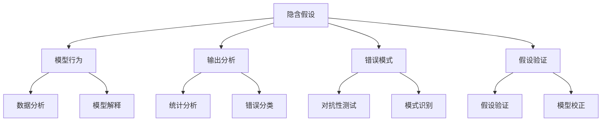

                 

# 隐含假设识别：测试LLM发现潜在前提的洞察力

> 关键词：隐含假设识别、测试LLM、潜在前提、洞察力、技术博客

> 摘要：本文将深入探讨隐含假设识别的重要性，特别是在测试大型语言模型（LLM）中的应用。通过分析隐含假设的类型、影响以及识别的挑战，我们将展示如何通过测试LLM来发现潜在前提，并探讨如何培养洞察力以应对这些挑战。

## 引言

在当今人工智能时代，大型语言模型（LLM）已经成为自然语言处理（NLP）领域的重要工具。LLM通过学习海量文本数据，能够生成高质量的自然语言文本，广泛应用于聊天机器人、机器翻译、文本摘要等任务。然而，随着LLM应用范围的扩大，其潜在的问题也逐渐显现，其中之一就是隐含假设的识别。

隐含假设是指模型在没有明确表述的情况下所依赖的假设。这些假设可能来自于训练数据、模型架构或先验知识。隐含假设的识别对于确保LLM的可靠性和有效性至关重要。本文将讨论如何通过测试LLM来发现潜在的前提，并提供一些培养洞察力的方法。

## 隐含假设识别概述

### 核心概念

隐含假设（Implicit Assumptions）是指在模型运作过程中，没有直接明确表达但实际被依赖的假设。这些假设可能涉及数据的分布、语言的结构、常识知识等多个方面。

### 问题背景

随着LLM的发展，隐含假设的问题逐渐凸显。例如，一些LLM可能会默认某些语言结构或知识背景，这可能导致在特定情境下生成不适当或错误的输出。识别这些隐含假设对于提高LLM的可靠性和鲁棒性具有重要意义。

### 研究现状

当前，隐含假设识别在NLP领域引起了广泛关注。研究人员正在探索各种方法来检测和解析这些假设，包括统计分析、模型解释技术、对抗性测试等。

### 挑战与目标

隐含假设识别面临多个挑战，包括假设的多样性、复杂性和不确定性。识别这些假设的目标是确保LLM在各种情况下都能生成合理和可靠的输出。

### 边界与外延

隐含假设识别的应用场景包括但不限于语言生成、文本分类、问答系统等。同时，识别的边界和限制也需要考虑，以避免过度泛化。

### 概念结构与核心要素组成

隐含假设识别的概念结构包括假设的检测、验证和解释三个主要部分。核心要素包括训练数据、模型架构、先验知识和测试方法。

## 核心概念与联系

### 隐含假设识别原理

隐含假设识别的基本原理是通过分析模型的行为来推断其依赖的假设。这通常涉及到对模型输出的分析、错误模式的识别以及对假设的验证。

### 概念属性特征对比表格

| 概念           | 属性1 | 属性2 | 属性3 |
|----------------|-------|-------|-------|
| 隐含假设       | 假设性 | 隐蔽性 | 影响性 |
| 显式假设       | 假设性 | 显式性 | 影响性 |
| 常识假设       | 知识性 | 隐蔽性 | 影响性 |
| 特定情境假设   | 假设性 | 特定性 | 影响性 |

### ER实体关系图架构

## 测试LLM

### 测试方法

测试LLM的方法包括标准测试集、对抗性测试、场景测试等。每种方法都有其独特的优势和局限性。

### 测试集

标准测试集如GLUE、SuperGLUE等，用于评估LLM在不同任务上的性能。这些测试集涵盖了广泛的语言任务，但可能无法涵盖所有隐含假设。

### 对抗性测试

对抗性测试旨在通过输入微小扰动来干扰LLM的输出，从而揭示其依赖的隐含假设。这种方法能够发现一些标准测试集难以检测的问题。

### 场景测试

场景测试通过模拟特定情境来评估LLM的可靠性。这种方法更接近实际应用场景，但需要大量定制化工作。

## 发现潜在前提

### 数据分析

通过对测试结果进行分析，可以识别出模型可能依赖的隐含前提。数据分析方法包括统计分析、错误模式分析等。

### 模型解释

使用模型解释技术，如注意力机制分析、层内交互分析等，可以揭示模型在处理特定任务时的依赖关系。

### 假设验证

通过验证模型在特定场景下的行为，可以确认或否定某些隐含假设。假设验证有助于提高LLM的可靠性和鲁棒性。

## 洞察力培养

### 思维模式

培养洞察力需要具备批判性思维和系统思维。通过不断质疑和反思，可以提高识别隐含假设的能力。

### 经验积累

通过大量实践，可以积累识别隐含假设的经验。经验丰富的研究人员能够更快地识别出模型中的潜在问题。

### 跨学科学习

隐含假设识别不仅涉及计算机科学，还涉及心理学、认知科学等领域。跨学科学习有助于提高洞察力。

## 案例研究

### 案例一：语言生成中的隐含假设

在一个语言生成任务中，LLM生成的内容依赖于特定的语法结构和词汇选择。通过对抗性测试，发现模型在处理特定语法结构时存在隐含假设，导致生成内容不准确。

### 案例二：问答系统中的隐含假设

在一个问答系统中，LLM需要依赖常识知识来回答问题。通过场景测试，发现模型在处理涉及常识问题的任务时，存在对特定知识背景的依赖。

## 结论与未来展望

本文探讨了隐含假设识别在测试LLM中的应用，并提出了培养洞察力的方法。未来研究可以进一步探索隐含假设的自动检测和解释技术，以提高LLM的可靠性和鲁棒性。

## 作者信息

作者：AI天才研究院/AI Genius Institute & 禅与计算机程序设计艺术 /Zen And The Art of Computer Programming

通过以上内容，本文系统地介绍了隐含假设识别在测试LLM中的应用，并探讨了如何培养洞察力。希望本文能为相关领域的研究人员和开发者提供有价值的参考。

