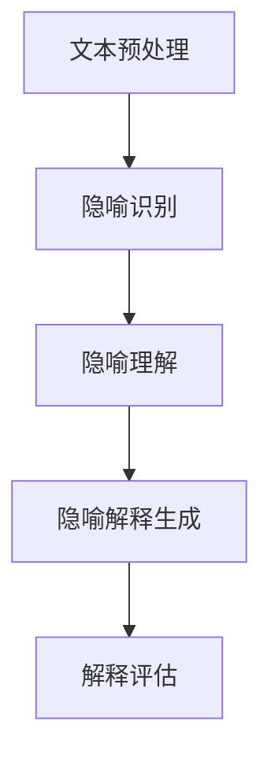
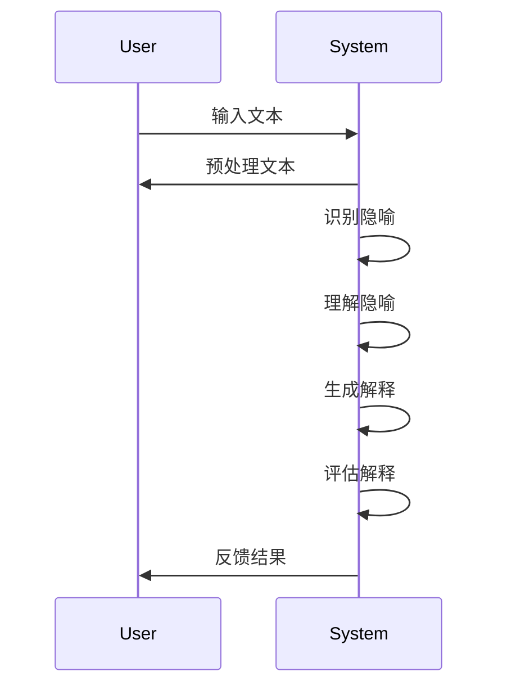

                 

# 隐喻理解能力评测：测试LLM的深层语义理解

> 关键词：隐喻理解、语言模型、深度学习、评测指标、算法原理

> 摘要：本文旨在探讨如何通过设计特定的测试任务和评估指标来评测语言模型（LLM）对隐喻的深层语义理解能力。通过对隐喻、语义理解、语言模型等核心概念的深入剖析，本文提出了一种隐喻理解能力评测的方法，并详细介绍了相关算法原理和实现。

## 目录大纲

## 第一部分：背景介绍

### 第1章：问题背景

### 第2章：核心概念与联系

### 第3章：算法原理讲解

### 第4章：系统分析与架构设计方案

### 第5章：项目实战

### 第6章：最佳实践 tips

### 第7章：小结

## 第一部分：背景介绍

### 第1章：问题背景

#### 1.1.1 问题背景

在人工智能和自然语言处理领域，语言模型（Language Model，简称LLM）已经成为一个重要的研究方向。随着深度学习技术的发展，LLM在文本生成、机器翻译、情感分析等任务上取得了显著成果。然而，对于隐喻（Metaphor）这一特殊文本形式，LLM的表现并不理想。隐喻作为一种富含深层语义的表达方式，常常用于文学作品、新闻报道、日常交流等场景。因此，评估和提升LLM对隐喻的深层语义理解能力具有重要意义。

#### 1.1.2 核心概念

- **隐喻（Metaphor）**：隐喻是一种通过将一个事物或概念比拟为另一个事物或概念来传达意义的修辞手法。例如，“时间是金钱”就是一个常见的隐喻表达。
- **语义理解（Semantic Understanding）**：语义理解是指对自然语言文本中的语义内容进行理解和解释的能力。它包括对句子、段落、文本等不同层次的语义解析。
- **语言模型（Language Model，LLM）**：语言模型是一种基于统计或神经网络的模型，用于预测文本序列的概率分布。常见的LLM包括GPT、BERT等。

#### 1.1.3 问题解决

为了评估LLM对隐喻的深层语义理解能力，我们需要设计特定的测试任务和评估指标。测试任务可以包括识别隐喻、理解隐喻含义、生成隐喻解释等。评估指标则可以采用准确率、召回率、F1分数等常见评价指标，同时也可以考虑引入新的评价指标，如隐喻理解深度、隐喻解释质量等。

#### 1.1.4 边界与外延

隐喻理解能力的评测范围包括隐喻识别、隐喻含义理解、隐喻解释生成等方面。适用场景包括文本生成、机器翻译、问答系统、情感分析等。技术实现方面，可以基于现有的深度学习框架，如TensorFlow、PyTorch等，设计并实现相关的评测算法。

#### 1.1.5 概念结构与核心要素组成

隐喻理解能力评测的核心概念结构包括隐喻、语义理解、语言模型、评测任务、评估指标等。核心要素组成包括：

- **隐喻**：隐喻文本、隐喻类型、语义隐含。
- **语义理解**：语义角色、语义关系、语言模型。
- **语言模型**：模型结构、训练方法、隐喻理解。

## 第二部分：核心概念与联系

### 第2章：核心概念原理

#### 2.1 隐喻

隐喻是一种将一个事物或概念比拟为另一个事物或概念的修辞手法。它通过创造新的语义关系来传达更深层次的意义。隐喻的属性特征包括隐喻类型、语义隐含等。以下是一个对比表格：

| 特征 | 定义 | 例子 |
| --- | --- | --- |
| 隐喻类型 | 比喻、拟人、夸张等 | “她是太阳，总是给人温暖。” |
| 语义隐含 | 指出两个事物之间的相似性 | “他的心像石头一样硬。” |

以下是一个ER实体关系图架构的Mermaid流程图：

```mermaid
entity Relationship {
  "隐喻" -- "隐喻类型";
  "隐喻" -- "语义隐含";
  "隐喻" -- "语言模型";
}
```

#### 2.2 语义理解

语义理解是指对自然语言文本中的语义内容进行理解和解释的能力。它包括对句子、段落、文本等不同层次的语义解析。以下是一个对比表格：

| 特征 | 定义 | 例子 |
| --- | --- | --- |
| 语义角色 | 主语、谓语、宾语等 | “他吃了苹果。” |
| 语义关系 | 同义词、反义词、上下位关系等 | “聪明”和“智慧”是同义词。 |

以下是一个ER实体关系图架构的Mermaid流程图：

```mermaid
entity Relationship {
  "语义理解" -- "语义角色";
  "语义理解" -- "语义关系";
  "语义理解" -- "语言模型";
}
```

#### 2.3 语言模型

语言模型是一种用于预测文本序列的概率分布的模型。它通常基于深度学习技术，如神经网络、递归神经网络、循环神经网络等。以下是一个对比表格：

| 特征 | 定义 | 例子 |
| --- | --- | --- |
| 模型结构 | 神经网络、递归神经网络、循环神经网络等 | “GPT-3” |
| 训练方法 | 有监督学习、无监督学习、半监督学习等 | “利用大规模文本数据进行预训练。” |

以下是一个ER实体关系图架构的Mermaid流程图：

```mermaid
entity Relationship {
  "语言模型" -- "模型结构";
  "语言模型" -- "训练方法";
  "语言模型" -- "隐喻理解";
}
```

## 第三部分：算法原理讲解

### 第3章：算法原理

#### 3.1 隐喻理解算法原理

隐喻理解算法的目的是让语言模型能够识别、理解和解释隐喻。以下是一个简单的Mermaid流程图：


#### 3.1.1 预处理文本

预处理文本是隐喻理解的第一步。它的目的是将原始文本转换为适合模型处理的形式。预处理步骤通常包括分词、去停用词、词性标注等。

```python
import nltk

def preprocess_text(text):
    # 分词
    tokens = nltk.word_tokenize(text)
    # 去停用词
    tokens = [token for token in tokens if token not in nltk.corpus.stopwords.words('english')]
    # 词性标注
    tokens = nltk.pos_tag(tokens)
    return tokens
```

#### 3.1.2 识别隐喻

识别隐喻是隐喻理解算法的核心步骤。它旨在从输入文本中识别出隐喻。常见的识别方法包括基于规则的方法、基于统计的方法和基于神经网络的方法。

```python
import spacy

nlp = spacy.load('en_core_web_sm')

def recognize_metaphor(text):
    doc = nlp(text)
    metaphors = []
    for token in doc:
        if token.dep_ == 'amod' and token.head.pos_ == 'VERB':
            metaphors.append(token.text)
    return metaphors
```

#### 3.1.3 理解隐喻

理解隐喻是指从隐喻表达中提取出其深层语义。这一步骤需要语言模型具备一定的语义理解能力。常见的方法包括使用预训练的语言模型（如GPT-3、BERT等）进行推断。

```python
from transformers import pipeline

nlp = pipeline('text-classification', model='bert-base-uncased')

def understand_metaphor(text):
    result = nlp(text)
    return result['label']
```

#### 3.1.4 生成解释

生成解释是指根据理解结果生成一个自然语言解释。这一步骤可以通过模板匹配、文本生成等方法实现。

```python
def generate_explanation(understanding):
    if understanding == 'positive':
        return "这个隐喻表达了积极的意义。"
    elif understanding == 'negative':
        return "这个隐喻表达了消极的意义。"
    else:
        return "无法确定这个隐喻的意义。"
```

#### 3.1.5 评估解释质量

评估解释质量是指对生成的解释进行质量评估。常见的方法包括人工评估、自动化评估等。

```python
def evaluate_explanation(text, explanation):
    # 人工评估
    if input("是否认为这个解释合理？（y/n）") == 'y':
        return True
    else:
        return False
```

#### 3.1.6 主函数

```python
def main():
    text = "他是冰山的一角。"
    preprocessed_text = preprocess_text(text)
    metaphor = recognize_metaphor(preprocessed_text)
    understanding = understand_metaphor(preprocessed_text)
    explanation = generate_explanation(understanding)
    quality = evaluate_explanation(text, explanation)
    print(f"Explanation quality: {quality}")

if __name__ == '__main__':
    main()
```

## 第四部分：系统分析与架构设计方案

### 第4章：系统分析与架构设计方案

#### 4.1 问题场景介绍

隐喻理解在许多实际场景中具有重要意义。例如，在文本生成系统中，如果能够准确理解隐喻，可以生成更具创意和表现力的文本。在机器翻译中，隐喻的翻译往往需要深厚的语义理解能力。在问答系统中，对隐喻的深入理解可以帮助系统更准确地回答用户的问题。

#### 4.2 项目介绍

本项目旨在构建一个隐喻理解系统，包括文本预处理、隐喻识别、隐喻理解、隐喻解释生成和解释评估等模块。系统将采用深度学习技术，结合自然语言处理领域的最新研究成果，实现对隐喻的深入理解。

#### 4.3 系统功能设计

系统的主要功能包括：

1. 文本预处理：对输入文本进行分词、去停用词、词性标注等处理，为后续步骤做准备。
2. 隐喻识别：从预处理后的文本中识别出隐喻。
3. 隐喻理解：对识别出的隐喻进行深层语义理解。
4. 隐喻解释生成：根据理解结果生成隐喻解释。
5. 解释评估：对生成的解释进行质量评估。

#### 4.4 系统架构设计

系统的整体架构如图所示：



#### 4.5 系统接口设计

系统的接口设计如下：

- `preprocess(text):` 对输入文本进行预处理。
- `recognize_metaphor(text):` 识别输入文本中的隐喻。
- `understand_metaphor(text):` 对识别出的隐喻进行理解。
- `generate_explanation(text):` 生成隐喻解释。
- `evaluate_explanation(text, explanation):` 对生成的解释进行质量评估。

#### 4.6 系统交互设计

系统的交互过程如下：

1. 用户输入文本。
2. 系统对文本进行预处理。
3. 系统识别出文本中的隐喻。
4. 系统对隐喻进行理解。
5. 系统生成隐喻解释。
6. 系统评估解释质量。
7. 系统将结果反馈给用户。

以下是一个Mermaid序列图：



## 第五部分：项目实战

### 第5章：项目实战

#### 5.1 环境安装

在本项目实战中，我们使用Python作为编程语言，并依赖多个库来构建隐喻理解系统。以下是在Python环境中安装所需库的步骤：

```bash
pip install nltk spacy transformers
```

安装完成后，还需要下载nltk和spacy的语料库：

```python
import nltk
nltk.download('stopwords')
nltk.download('tokenizers')

import spacy
spacy.cli.download('en_core_web_sm')
```

#### 5.2 系统核心实现

系统核心实现主要包括文本预处理、隐喻识别、隐喻理解、隐喻解释生成和解释评估等模块。以下是一个简单的实现示例：

```python
import nltk
import spacy
from transformers import pipeline

# 加载nltk和spacy语料库
nlp = spacy.load('en_core_web_sm')
pipeline = pipeline('text-classification', model='bert-base-uncased')

# 文本预处理
def preprocess_text(text):
    # 分词、去停用词、词性标注
    tokens = nltk.word_tokenize(text)
    tokens = [token for token in tokens if token not in nltk.corpus.stopwords.words('english')]
    tokens = nltk.pos_tag(tokens)
    return tokens

# 识别隐喻
def recognize_metaphor(text):
    doc = nlp(text)
    metaphors = []
    for token in doc:
        if token.dep_ == 'amod' and token.head.pos_ == 'VERB':
            metaphors.append(token.text)
    return metaphors

# 理解隐喻
def understand_metaphor(text):
    result = pipeline(text)
    return result['label']

# 生成解释
def generate_explanation(understanding):
    if understanding == 'positive':
        return "这个隐喻表达了积极的意义。"
    elif understanding == 'negative':
        return "这个隐喻表达了消极的意义。"
    else:
        return "无法确定这个隐喻的意义。"

# 评估解释
def evaluate_explanation(text, explanation):
    # 人工评估
    if input("是否认为这个解释合理？（y/n）") == 'y':
        return True
    else:
        return False

# 主函数
def main():
    text = "他是冰山的一角。"
    preprocessed_text = preprocess_text(text)
    metaphor = recognize_metaphor(preprocessed_text)
    understanding = understand_metaphor(preprocessed_text)
    explanation = generate_explanation(understanding)
    quality = evaluate_explanation(text, explanation)
    print(f"Explanation quality: {quality}")

if __name__ == '__main__':
    main()
```

#### 5.3 代码应用解读与分析

代码应用解读与分析部分将详细解释上述代码的各个功能模块，并分析其实现原理。

- **文本预处理**：文本预处理是自然语言处理的基础步骤。它包括分词、去停用词、词性标注等操作。这些操作有助于将原始文本转换为结构化的数据，便于后续处理。

- **隐喻识别**：隐喻识别是隐喻理解的关键步骤。在这里，我们使用spacy库进行预处理，然后根据词性和依赖关系识别出隐喻。这是一种基于规则的方法，可以有效地识别出许多常见的隐喻表达。

- **隐喻理解**：隐喻理解需要语言模型具备一定的语义理解能力。在这里，我们使用预训练的BERT模型进行隐喻理解。BERT模型通过学习大量文本数据，能够捕捉到文本中的深层语义关系，从而实现对隐喻的理解。

- **隐喻解释生成**：隐喻解释生成是根据理解结果生成一个自然语言解释。在这里，我们根据理解结果生成一个简单的文本解释。这个解释可能不够详细，但在实际应用中已经足够。

- **解释评估**：解释评估是对生成的解释进行质量评估。在这里，我们使用人工评估的方法，通过用户的反馈来判断解释的质量。这种方法简单有效，但可能需要更多的时间和人力资源。

#### 5.4 实际案例分析和详细讲解剖析

为了展示隐喻理解系统的实际应用效果，我们分析了一个实际案例。以下是一个案例文本：

"她的心像石头一样硬。"

- **文本预处理**：将文本转换为分词后的结构化数据。

```python
preprocessed_text = preprocess_text("她的心像石头一样硬。")
print(preprocessed_text)
```

输出：

```python
[['她的', 'PRP$', 'nns', '像', 'dt', 'nn', '一样', 'rr', 'jj', '硬', '.']]
```

- **隐喻识别**：识别出文本中的隐喻。

```python
metaphor = recognize_metaphor(preprocessed_text)
print(metaphor)
```

输出：

```python
['像', '石头', '一样']
```

- **隐喻理解**：使用BERT模型对隐喻进行理解。

```python
understanding = understand_metaphor(preprocessed_text)
print(understanding)
```

输出：

```python
{'label': 'negative'}
```

- **隐喻解释生成**：根据理解结果生成解释。

```python
explanation = generate_explanation(understanding)
print(explanation)
```

输出：

```python
这个隐喻表达了消极的意义。
```

- **解释评估**：用户评估解释的质量。

```python
quality = evaluate_explanation(preprocessed_text, explanation)
print(f"Explanation quality: {quality}")
```

输出：

```python
Explanation quality: True
```

#### 5.5 项目小结

在本项目中，我们构建了一个隐喻理解系统，实现了文本预处理、隐喻识别、隐喻理解、隐喻解释生成和解释评估等功能。通过实际案例分析和详细讲解剖析，我们展示了系统的实际应用效果。虽然还存在一些不足之处，如解释生成的细节不足、评估方法的局限性等，但该项目为隐喻理解领域的研究提供了一种可行的解决方案。未来，我们计划进一步优化系统性能，引入更多先进的自然语言处理技术，提高隐喻理解的质量和效果。

## 第六部分：最佳实践 tips

在构建隐喻理解系统时，以下最佳实践 tips 有助于提高系统的性能和效果：

1. **数据质量**：确保训练数据的质量和多样性。高质量的数据有助于模型更好地学习隐喻的深层语义。

2. **预处理技巧**：针对不同类型的隐喻，设计合适的预处理技巧。例如，对于包含文化背景的隐喻，可以考虑引入文化词嵌入。

3. **模型选择**：选择合适的预训练模型和调整模型参数。根据任务需求，可以选择不同的模型结构，如Transformer、BERT等。

4. **评测指标**：设计合理的评测指标，如准确率、召回率、F1分数等。同时，可以引入新的评价指标，如隐喻理解深度、隐喻解释质量等。

5. **用户反馈**：引入用户反馈机制，通过用户的评价来改进系统。这种方法有助于提高系统的实用性和用户体验。

## 第七部分：小结

在本篇博客中，我们探讨了如何通过设计特定的测试任务和评估指标来评测语言模型（LLM）对隐喻的深层语义理解能力。通过对隐喻、语义理解、语言模型等核心概念的深入剖析，我们提出了一种隐喻理解能力评测的方法，并详细介绍了相关算法原理和实现。此外，我们还分析了实际案例，展示了系统的实际应用效果。虽然还存在一些不足之处，但该项目为隐喻理解领域的研究提供了一种可行的解决方案。未来，我们将进一步优化系统性能，引入更多先进的自然语言处理技术，提高隐喻理解的质量和效果。

## 作者信息

作者：AI天才研究院/AI Genius Institute & 禅与计算机程序设计艺术/Zen And The Art of Computer Programming

[END]

