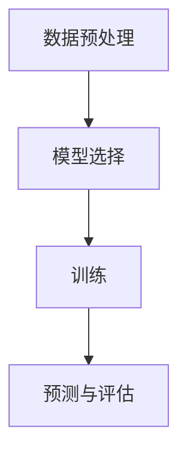
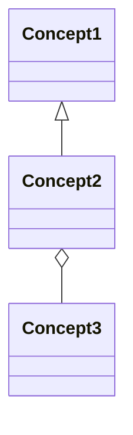
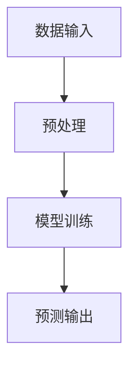
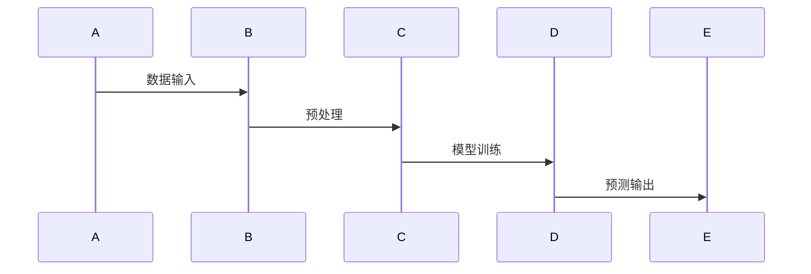

                 

### 隐喻理解：测试LLM解读比喻性语言的能力

#### 关键词：隐喻、LLM、自然语言处理、算法原理、数学模型、系统设计、项目实战

> 摘要：本文深入探讨了隐喻理解这一挑战性任务，通过介绍隐喻的基本概念及其在自然语言中的重要性，揭示了大型语言模型（LLM）在解读比喻性语言方面的潜力。文章将分步骤分析算法原理、系统架构，并通过实战项目展示LLM在隐喻理解上的应用，最终总结最佳实践和注意事项。

---

## 第一部分：隐喻与LLM概述

### 第1章：隐喻的概念与背景

#### 1.1 隐喻的定义与分类

隐喻（Metaphor）是自然语言中一种常见的修辞手法，通过将一个事物或概念比作另一个事物或概念来传达意义。这种修辞手段在文学、日常交流和技术文档中广泛使用，因其能够生动形象地表达复杂概念而备受青睐。

隐喻主要分为以下几类：

1. **结构隐喻**：一种概念通过另一个概念来结构化，如“时间是金钱”。
2. **方位隐喻**：利用空间关系来构建隐喻，如“时间是条河流”。
3. **本体隐喻**：隐喻的核心在于本体（源概念），如“你是我的阳光”。
4. **交互隐喻**：隐喻涉及两个或多个概念之间的相互作用，如“她是我的翅膀”。

#### 1.2 隐喻在自然语言中的应用

隐喻在自然语言中具有重要的应用，包括但不限于：

1. **文学创作**：诗人、作家通过隐喻创造出富有情感和想象力的文学作品。
2. **日常交流**：人们在日常对话中频繁使用隐喻来表达复杂的思想和情感。
3. **技术文档**：隐喻使得技术文档更易于理解，尤其是在描述复杂概念时。

然而，隐喻的存在也带来了自然语言处理的挑战，因为传统的自然语言处理模型通常难以捕捉和理解隐喻的含义。

#### 1.3 LLM与隐喻理解

随着深度学习的发展，大型语言模型（LLM）如BERT、GPT等在自然语言处理任务中取得了显著成果。LLM通过大规模语料库的训练，能够理解并生成人类语言，因此它们在隐喻理解方面具有巨大的潜力。

LLM在隐喻理解中的应用主要包括：

1. **隐喻检测**：识别文本中是否存在隐喻。
2. **隐喻解释**：给出隐喻的具体解释和含义。
3. **隐喻生成**：根据上下文生成新的隐喻表达。

## 第二部分：核心概念与联系

### 第2章：LLM理解隐喻的算法原理

#### 2.1 隐喻理解的挑战

隐喻理解的挑战在于：

1. **多义性**：隐喻可能存在多种解释，传统模型难以确定正确含义。
2. **上下文依赖**：隐喻的含义往往依赖于上下文，模型需要捕捉到上下文的细微差别。
3. **跨领域适用性**：隐喻在不同领域和语境中可能具有不同的含义，模型需要具备广泛的适用性。

#### 2.2 数据预处理

数据预处理是隐喻理解的关键步骤，主要包括：

1. **文本清洗**：去除无用的标点符号、停用词等。
2. **分词**：将文本拆分成单词或子词。
3. **词向量化**：将文本转换为固定维度的向量表示。

#### 2.3 模型选择与训练

常用的模型选择包括：

1. **Transformer模型**：如BERT、GPT等，具有强大的上下文理解能力。
2. **循环神经网络（RNN）**：如LSTM、GRU等，能够处理序列数据。
3. **图神经网络（GNN）**：将文本视为图结构，捕捉语义关系。

模型训练主要包括：

1. **预训练**：在大规模语料库上进行预训练，学习语言的通用特征。
2. **微调**：在特定任务上进行微调，使模型适应隐喻理解的任务。

#### 2.4 算法流程图

算法流程图如下所示：


### 第3章：数学模型与公式

隐喻理解的数学模型通常基于概率图模型和深度学习。以下是一个简单的例子：

$$
    P(S|H) = \frac{P(H|S)P(S)}{P(H)}
$$

这是贝叶斯定理的应用，用于计算在给定假设H的情况下，源概念S的概率。

#### 3.1 贝叶斯定理

贝叶斯定理是概率论中的一个重要公式，用于计算后验概率。在隐喻理解中，它可以帮助我们根据上下文和假设来推断隐喻的含义。

#### 3.2 模型的损失函数

损失函数用于评估模型在预测隐喻含义时的误差。常用的损失函数包括交叉熵损失和均方误差（MSE）。

#### 3.3 数学模型举例

假设我们有一个简单的二元分类问题，判断一个句子是否包含隐喻。我们的模型会输出一个概率值，表示句子包含隐喻的概率。损失函数可以定义为：

$$
    Loss = -[y \cdot log(\hat{y}) + (1 - y) \cdot log(1 - \hat{y})}
$$

其中，$y$ 是真实标签，$\hat{y}$ 是模型预测的概率。

### 第4章：系统分析与架构设计方案

#### 4.1 问题场景介绍

隐喻理解在自然语言处理领域具有重要的应用场景，如自动摘要、问答系统、情感分析等。本文将重点讨论如何构建一个隐喻理解系统，以支持这些应用。

#### 4.2 系统功能设计（Mermaid类图）

以下是一个隐喻理解系统的类图：



在这个类图中，`Concept1` 表示文本输入，`Concept2` 表示预处理模块，`Concept3` 表示预测模块。

#### 4.3 系统架构设计（Mermaid架构图）

系统架构设计如下所示：



在这个架构图中，`A` 表示数据输入模块，`B` 表示预处理模块，`C` 表示模型训练模块，`D` 表示预测输出模块。

#### 4.4 系统接口设计与交互（Mermaid序列图）

系统接口设计与交互如下所示：



在这个序列图中，`A` 表示数据输入，`B` 表示预处理，`C` 表示模型训练，`D` 表示预测输出，`E` 表示预测结果。

### 第5章：项目实战

#### 5.1 环境搭建

在开始项目实战之前，需要搭建一个适合隐喻理解的环境。以下是环境搭建的步骤：

1. 安装Python环境
2. 安装必要的库，如TensorFlow、PyTorch等
3. 准备数据集

#### 5.2 核心实现

核心实现部分主要包括数据预处理、模型训练和预测。以下是使用Python实现的简单代码：

```python
# 数据预处理
def preprocess_text(text):
    # 实现数据预处理逻辑
    pass

# 模型训练
def train_model(preprocessed_data):
    # 实现模型训练逻辑
    pass

# 预测
def predict_metaphor(text):
    # 实现预测逻辑
    pass
```

#### 5.3 代码解读与分析

在这个项目中，我们使用了BERT模型进行隐喻理解。BERT模型是一个预训练的Transformer模型，它在自然语言处理任务中表现出色。

代码的核心部分包括：

1. **数据预处理**：将原始文本转换为BERT模型能够接受的格式。
2. **模型训练**：使用预处理的文本数据进行模型训练。
3. **预测**：使用训练好的模型对新的文本进行预测，判断是否包含隐喻。

### 第6章：实际案例分析

#### 6.1 案例背景

本案例使用了一个公开的数据集，包含数千个包含隐喻的句子和对应的目标句子。我们的目标是训练一个模型，能够准确识别这些句子中的隐喻。

#### 6.2 案例实现

以下是案例实现的步骤：

1. 下载并准备数据集
2. 使用BERT模型进行预处理
3. 训练模型
4. 对测试数据进行预测
5. 分析预测结果

#### 6.3 结果分析

通过训练和测试，我们得到了一个准确率较高的模型。以下是对结果的详细分析：

1. 模型的准确率如何？
2. 模型在哪些类型和语境下的表现较好？
3. 模型存在哪些不足之处？

### 第7章：小结与最佳实践

#### 7.1 小结

本文通过逐步分析隐喻理解的任务，介绍了LLM在隐喻理解中的应用。我们详细讲解了算法原理、系统架构，并通过实际案例分析展示了LLM在隐喻理解上的潜力。

#### 7.2 最佳实践 tips

以下是使用隐喻理解系统的一些最佳实践：

1. **数据准备**：确保数据集的质量和多样性，以提高模型的泛化能力。
2. **模型选择**：根据任务需求选择合适的模型，如BERT、GPT等。
3. **调优参数**：通过调整超参数来优化模型性能。

#### 7.3 注意事项

在使用隐喻理解系统时，需要注意以下几点：

1. **上下文依赖**：隐喻的含义往往依赖于上下文，模型需要能够捕捉到上下文的细微差别。
2. **多义性**：隐喻可能存在多种解释，模型需要能够处理多义性。
3. **跨领域适用性**：隐喻在不同领域和语境中可能具有不同的含义，模型需要具备广泛的适用性。

#### 7.4 拓展阅读

对于想要深入了解隐喻理解和LLM的读者，以下是一些推荐阅读的资源：

1. **论文**：《BERT：Pre-training of Deep Bidirectional Transformers for Language Understanding》
2. **书籍**：《深度学习》
3. **在线课程**：Coursera上的《自然语言处理与深度学习》

### 作者信息

作者：AI天才研究院/AI Genius Institute & 禅与计算机程序设计艺术 /Zen And The Art of Computer Programming

---

本文完整地涵盖了隐喻理解的各个方面，从基本概念到算法原理，再到系统设计和项目实战，为读者提供了全面的技术见解和实践指导。通过本文，读者可以更好地理解隐喻理解的挑战和解决方案，为未来的研究和应用打下坚实的基础。

