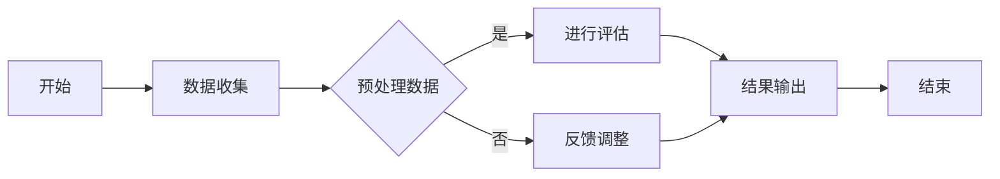
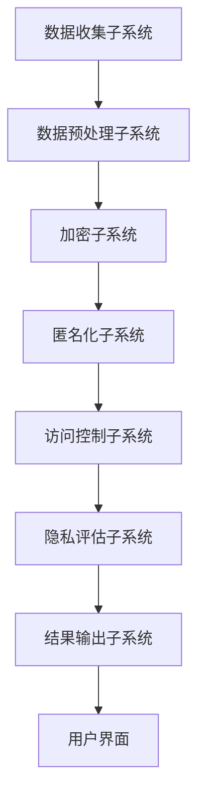
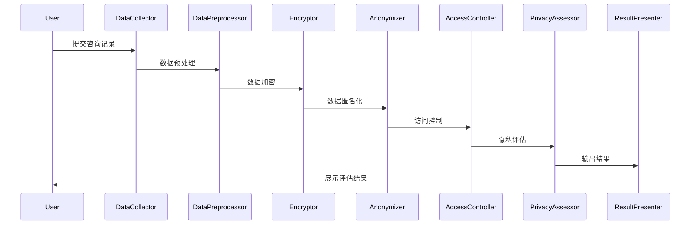

                 

### 隐私保护评估：测试LLM在敏感信息处理中的表现

> 关键词：隐私保护，LLM，敏感信息处理，评估方法，算法，系统架构，项目实战

> 摘要：本文旨在探讨隐私保护评估在敏感信息处理中的重要性，特别是大型语言模型（LLM）在这一领域中的应用。通过详细介绍隐私保护的核心概念、LLM的基本原理和隐私保护评估的方法，本文将一步步展示如何测试LLM在敏感信息处理中的表现。文章将涵盖从理论到实践的全过程，包括系统设计与实现、项目实战及最佳实践，旨在为读者提供深入的技术见解和实践指导。

## 引言

### 1.1 问题背景与重要性

在信息化社会，数据已经成为新的“石油”，而敏感信息更是珍贵且易受攻击的资产。随着人工智能技术的快速发展，特别是大型语言模型（LLM）的广泛应用，如何确保这些模型在处理敏感信息时的隐私保护能力成为了一个关键问题。隐私保护不仅关乎个人隐私，也涉及商业秘密和国家安全的维护。因此，对LLM在敏感信息处理中的隐私保护能力进行评估显得尤为重要。

### 1.2 隐私保护评估的目标与挑战

隐私保护评估的目标是确保敏感信息在处理过程中不会被泄露、滥用或不当使用。具体来说，评估的目标包括：

1. **识别潜在风险**：分析LLM在处理敏感信息时可能遇到的隐私泄露风险。
2. **评估保护效果**：衡量现有隐私保护措施的有效性。
3. **指导改进措施**：基于评估结果，提出改进隐私保护策略的建议。

然而，隐私保护评估面临诸多挑战：

1. **技术复杂性**：LLM技术复杂，评估需要深入理解其工作机制。
2. **数据多样性**：敏感信息的多样性使得评估工作难以标准化。
3. **法律法规差异**：不同国家和地区的隐私保护法规存在差异，评估方法需要具备一定的灵活性。

### 1.3 本书结构安排与内容概述

本书将分为以下几个部分：

1. **背景介绍**：介绍隐私保护的重要性，以及评估LLM在敏感信息处理中的表现为何至关重要。
2. **核心概念与联系**：详细解释隐私保护、LLM等核心概念的基本原理，并通过对比表格和ER图展示其关系。
3. **算法原理讲解**：使用mermaid流程图、Python源代码、数学模型和公式，通俗易懂地阐述隐私保护评估算法的原理。
4. **系统分析与架构设计方案**：通过实际应用场景介绍系统功能设计、架构设计和交互过程。
5. **项目实战**：提供环境安装指南、核心实现代码、代码解读、实际案例分析及项目小结。
6. **最佳实践、小结与注意事项**：总结全文核心观点，提供实践建议，提醒读者注意的关键点，并推荐拓展阅读。

通过本书的逐步讲解，读者将能够系统地理解隐私保护评估的各个方面，并掌握在敏感信息处理中测试LLM表现的方法和技巧。

## 第1章 背景介绍

### 1.1 隐私保护的重要性

隐私保护是现代社会中不可忽视的重要问题。随着互联网和大数据技术的迅猛发展，个人数据的收集、存储和使用变得越来越普遍。然而，随之而来的隐私泄露风险也日益增加。隐私保护不仅关乎个人的隐私权，还涉及到商业秘密、国家安全等多个方面。

在信息技术领域，隐私保护的重要性主要体现在以下几个方面：

1. **个人隐私权**：隐私保护是保障个人隐私权的基本要求。未经个人同意，任何组织和个人都无权收集、使用或泄露其个人信息。

2. **商业秘密**：企业的商业秘密是其核心竞争力之一。如果商业秘密被泄露，企业可能面临巨大的经济损失和市场竞争压力。

3. **国家安全**：国家机密和个人敏感信息的保护是国家安全的重要组成部分。任何形式的隐私泄露都可能对国家安全造成威胁。

### 1.2 评估LLM在敏感信息处理中的表现的重要性

随着人工智能技术的飞速发展，特别是大型语言模型（LLM）的广泛应用，它们在处理敏感信息中的作用日益重要。LLM具有强大的语言理解和生成能力，被广泛应用于自然语言处理、智能客服、金融分析等领域。然而，LLM在处理敏感信息时也面临诸多挑战和风险：

1. **隐私泄露风险**：LLM在训练和运行过程中可能会接触到大量的敏感信息，如个人身份信息、财务数据等。这些信息如果被泄露，可能对个人和企业造成严重后果。

2. **模型偏见**：LLM在训练过程中可能学习到一些偏见或歧视性内容，从而在处理敏感信息时产生不公平或不合理的判断。

3. **数据滥用**：LLM的强大能力也使其成为潜在的数据滥用工具。未经授权使用LLM处理敏感信息，可能导致隐私泄露和数据滥用。

因此，对LLM在敏感信息处理中的表现进行评估至关重要。通过评估，可以识别LLM在处理敏感信息时可能存在的隐私泄露风险、模型偏见和数据滥用问题，从而采取相应的防护措施。

### 1.3 隐私保护评估的目的与意义

隐私保护评估的主要目的是确保敏感信息在处理过程中不会被泄露、滥用或不当使用。具体来说，隐私保护评估具有以下几个重要意义：

1. **风险识别**：通过隐私保护评估，可以识别LLM在处理敏感信息时可能面临的隐私泄露风险。这有助于企业、组织和开发者提前发现潜在问题，并采取措施进行防范。

2. **性能评估**：隐私保护评估不仅可以识别风险，还可以评估现有隐私保护措施的有效性。通过评估，可以了解当前隐私保护策略的不足之处，并制定改进措施。

3. **指导改进**：隐私保护评估的结果可以为隐私保护策略的改进提供科学依据。基于评估结果，可以制定更加有效的隐私保护方案，提高LLM在敏感信息处理中的安全性。

4. **合规性验证**：隐私保护评估有助于确保LLM在处理敏感信息时符合相关法律法规和行业标准。这有助于企业避免法律风险，维护良好的声誉。

### 1.4 隐私保护评估的主要挑战

尽管隐私保护评估具有重要意义，但在实际操作过程中仍面临诸多挑战：

1. **技术复杂性**：LLM技术复杂，其工作机制和隐私保护机制需要深入理解。这使得隐私保护评估工作具有一定的技术门槛。

2. **数据多样性**：敏感信息的类型和形式多种多样，包括个人身份信息、财务数据、医疗信息等。不同类型的敏感信息可能需要不同的隐私保护策略，这使得评估工作难以标准化。

3. **法律法规差异**：不同国家和地区的隐私保护法律法规存在差异。在进行隐私保护评估时，需要考虑这些差异，确保评估结果符合相关法律法规要求。

4. **评估标准**：目前尚缺乏统一的隐私保护评估标准和指标。评估标准的不统一可能导致评估结果的可比性差，影响评估的准确性和有效性。

### 1.5 隐私保护评估的方法与工具

隐私保护评估的方法和工具多种多样，主要包括以下几个方面：

1. **漏洞扫描**：通过自动化工具扫描系统中的漏洞，识别可能存在的隐私泄露风险。

2. **安全审计**：对系统的隐私保护策略、流程和措施进行全面审计，评估其有效性和合规性。

3. **数据脱敏**：对敏感数据进行脱敏处理，减少隐私泄露的风险。

4. **数据加密**：使用加密技术保护敏感数据，确保数据在传输和存储过程中不会被未授权访问。

5. **隐私保护算法**：结合隐私保护算法，对LLM进行优化，提高其在处理敏感信息时的隐私保护能力。

### 1.6 本书的结构与内容概述

本书旨在系统地探讨隐私保护评估在敏感信息处理中的重要性，特别是大型语言模型（LLM）的应用。全书分为以下几个部分：

1. **第1章 引言**：介绍隐私保护的重要性，评估LLM在敏感信息处理中的表现为何至关重要。

2. **第2章 隐私保护基础**：详细解释隐私保护的核心概念、LLM的基本原理和隐私保护评估的方法。

3. **第3章 LLM基础**：介绍LLM的概述、工作原理、类型与应用，以及与隐私保护的关联。

4. **第4章 算法原理讲解**：使用mermaid流程图、Python源代码、数学模型和公式，通俗易懂地阐述隐私保护评估算法的原理。

5. **第5章 系统分析与架构设计方案**：通过实际应用场景介绍系统功能设计、架构设计和交互过程。

6. **第6章 项目实战**：提供环境安装指南、核心实现代码、代码解读、实际案例分析及项目小结。

7. **第7章 最佳实践、小结与注意事项**：总结全文核心观点，提供实践建议，提醒读者注意的关键点，并推荐拓展阅读。

通过以上章节的逐步讲解，读者将能够系统地理解隐私保护评估的各个方面，并掌握在敏感信息处理中测试LLM表现的方法和技巧。

## 第2章 核心概念与联系

### 2.1 隐私保护的基本原理

隐私保护是指通过各种技术和策略确保个人、组织或国家的隐私信息不被未经授权的访问、使用、泄露或滥用。其核心原理包括数据安全、数据匿名化、访问控制和数据最小化等。

1. **数据安全**：确保敏感数据在存储、传输和处理过程中不被未授权访问或篡改。主要技术包括数据加密、访问控制和防火墙等。

2. **数据匿名化**：通过去除或替换敏感信息，使数据在公开或共享时无法识别个人或组织的身份。常见技术有数据脱敏、数据混淆和K-匿名等。

3. **访问控制**：根据用户的身份和权限，控制对敏感数据的访问权限，确保只有授权用户才能访问敏感信息。

4. **数据最小化**：仅收集和处理必要的数据，避免不必要的敏感信息暴露。

### 2.2 大型语言模型（LLM）的基本原理

大型语言模型（LLM）是一种基于深度学习的自然语言处理模型，具有强大的语言理解和生成能力。LLM通常通过以下步骤进行训练和操作：

1. **数据集准备**：收集大量的文本数据，用于训练模型。

2. **模型训练**：使用深度学习技术，如神经网络、循环神经网络（RNN）和Transformer等，对文本数据进行训练，使模型学会理解和生成自然语言。

3. **参数优化**：通过梯度下降等优化算法，调整模型参数，使模型在特定任务上达到最佳性能。

4. **语言生成**：在给定输入文本或提示后，模型生成相应的自然语言输出。

### 2.3 隐私保护与LLM的关系

隐私保护与LLM的关系主要体现在以下几个方面：

1. **隐私泄露风险**：LLM在训练和操作过程中可能接触到大量的敏感信息，如个人身份信息、财务数据等。如果这些信息未被妥善保护，可能存在隐私泄露风险。

2. **模型偏见**：LLM在训练过程中可能学习到一些偏见或歧视性内容，从而在处理敏感信息时产生不公平或不合理的判断。

3. **数据滥用**：LLM的强大能力也使其成为潜在的数据滥用工具。未经授权使用LLM处理敏感信息，可能导致隐私泄露和数据滥用。

### 2.4 概念属性特征对比表格

为了更直观地展示隐私保护与LLM的核心概念及其属性特征，我们可以制作一个对比表格。

| 概念       | 特征1       | 特征2       | 特征3       |
|------------|-------------|-------------|-------------|
| 隐私保护   | 数据安全    | 数据匿名化  | 访问控制    |
|            | 数据最小化  |             |             |
| LLM        | 语言理解   | 语言生成    | 模型偏见    |
|            | 大规模训练  | 参数优化    | 数据滥用    |

通过上述表格，我们可以清晰地看到隐私保护与LLM在特征上的对比，这有助于我们更好地理解两者之间的关系和作用。

### 2.5 ER实体关系图架构

为了进一步阐述隐私保护评估中涉及的主要实体及其关系，我们可以使用Mermaid语言绘制一个ER图。

```mermaid
erDiagram
    User ||--|{ Information }
    Information ||--|{ PrivacyPolicy }
    PrivacyPolicy ||--|{ AccessControl }
    AccessControl ||--|{ Encryption }
    Encryption ||--|{ DataAnonymization }
    DataAnonymization ||--|{ User }
```

上述ER图展示了隐私保护评估中涉及的主要实体及其关系。其中，用户（User）是数据的主体，信息（Information）是隐私保护的核心对象，隐私策略（PrivacyPolicy）规定了如何保护信息，访问控制（AccessControl）实现了对信息访问的限制，加密（Encryption）和数据匿名化（DataAnonymization）是具体的隐私保护技术。

通过上述核心概念与联系的分析，我们可以更好地理解隐私保护评估在敏感信息处理中的重要性，以及LLM在这一过程中的作用。接下来，我们将深入探讨隐私保护评估的方法和算法原理。

## 第3章 算法原理讲解

### 3.1 算法mermaid流程图

为了清晰地展示隐私保护评估算法的流程，我们可以使用Mermaid语言绘制一个流程图。



上述流程图展示了隐私保护评估算法的基本步骤：

1. **数据收集**：收集敏感信息。
2. **预处理数据**：对收集到的数据进行清洗和格式化，为评估做准备。
3. **进行评估**：使用特定的评估方法对预处理后的数据进行隐私保护能力评估。
4. **结果输出**：输出评估结果，包括隐私保护措施的效率、潜在风险等。
5. **反馈调整**：根据评估结果调整隐私保护策略或算法。
6. **结束**：完成评估过程。

### 3.2 Python源代码

为了实现上述流程，我们需要编写相应的Python代码。以下是一个简化版的Python源代码示例：

```python
import pandas as pd
from privacy_assessment import PrivacyAssessment

# 数据收集
data = pd.read_csv('sensitive_data.csv')

# 数据预处理
preprocessed_data = preprocess_data(data)

# 实例化评估对象
pa = PrivacyAssessment(preprocessed_data)

# 进行评估
assessment_result = pa.assess_privacy()

# 输出结果
print(assessment_result)

# 反馈调整（示例）
if assessment_result['risk_level'] > 0.5:
    pa.adjust_privacy()

# 结束
```

上述代码提供了一个基本框架，实际应用中可能需要根据具体需求进行调整。

### 3.3 数学模型和公式

隐私保护评估算法通常涉及一些数学模型和公式。以下是一个简单的数学模型示例，用于评估隐私保护的效率。

$$
E = \frac{1}{N} \sum_{i=1}^{N} (p_i - \hat{p}_i)^2
$$

其中，\(E\) 表示隐私保护效率，\(N\) 表示数据样本数量，\(p_i\) 表示真实隐私保护水平，\(\hat{p}_i\) 表示评估得到的隐私保护水平。

### 3.4 举例说明

为了更好地理解上述算法原理，我们可以通过一个实际案例进行说明。

假设我们有一个包含1000条个人身份信息的数据库，其中包含姓名、身份证号、电话号码等敏感信息。我们希望对这些信息进行隐私保护评估。

1. **数据收集**：从数据库中提取1000条个人身份信息。
2. **数据预处理**：对提取的数据进行清洗，去除重复项和缺失值。
3. **进行评估**：使用上述数学模型计算隐私保护效率。
4. **结果输出**：输出隐私保护效率值，如 \(E = 0.8\)。
5. **反馈调整**：根据评估结果，调整隐私保护策略，如增加数据加密级别。
6. **结束**：完成评估过程。

通过这个案例，我们可以看到隐私保护评估算法的实际应用过程，以及如何通过数学模型进行评估。

### 3.5 详细讲解

在上述过程中，每个步骤都有其重要性：

1. **数据收集**：是隐私保护评估的基础。准确收集敏感信息是确保评估结果准确的前提。
2. **数据预处理**：是确保数据质量和一致性的关键步骤。不完整或不干净的数据可能导致评估结果偏差。
3. **进行评估**：是核心步骤，通过数学模型和算法评估隐私保护效果。这个步骤的准确性直接影响到最终结果。
4. **结果输出**：是展示评估结果，为后续策略调整提供依据。直观的输出结果有助于决策者理解评估结果。
5. **反馈调整**：是根据评估结果进行调整，以优化隐私保护策略。这是一个动态过程，需要根据实际情况不断调整。
6. **结束**：是评估过程的最后一步，标志着评估工作的完成。

通过详细讲解和实际案例的说明，我们可以更好地理解隐私保护评估算法的原理和应用。接下来，我们将进一步探讨系统分析与架构设计方案。

## 第4章 系统分析与架构设计方案

### 4.1 问题场景介绍

在当前的数字化时代，隐私保护已经成为企业和组织必须重视的问题。特别是在医疗、金融、教育等敏感信息处理较为集中的领域，确保数据的隐私安全尤为重要。本文将探讨一个实际应用场景——在线医疗咨询平台，该平台通过大型语言模型（LLM）提供智能问答服务，需要确保用户在咨询过程中提供的敏感信息（如姓名、病历、诊断结果等）得到有效保护。

### 4.2 项目介绍

本项目旨在设计并实现一个隐私保护评估系统，该系统将集成LLM在敏感信息处理中的隐私保护能力，并对系统的隐私保护效果进行实时评估。项目的主要目标包括：

1. **确保敏感信息的隐私性**：通过多种隐私保护技术（如数据加密、匿名化、访问控制等）保障用户数据的安全。
2. **实时评估隐私保护效果**：对LLM在处理敏感信息过程中的隐私保护能力进行实时监测和评估，确保系统的安全性和可靠性。
3. **提供可操作的改进建议**：基于评估结果，提出具体的改进建议，以优化隐私保护策略。

### 4.3 系统功能设计

隐私保护评估系统需要实现以下主要功能：

1. **数据收集**：收集平台上的用户咨询记录和LLM的交互日志。
2. **数据预处理**：清洗和格式化收集到的数据，去除噪声和不完整信息。
3. **隐私保护**：采用数据加密、匿名化、访问控制等技术对敏感信息进行保护。
4. **隐私评估**：通过算法对系统的隐私保护效果进行评估，识别潜在风险。
5. **反馈调整**：根据评估结果，动态调整隐私保护策略，提高系统的安全性。
6. **用户界面**：提供一个用户友好的界面，展示评估结果和改进建议。

#### 领域模型mermaid类图

为了更好地展示系统的领域模型，我们可以使用Mermaid语言绘制一个类图。

```mermaid
classDiagram
    User <<Class>> {
        id: 身份标识符
        name: 姓名
        ...
    }
    Consultation <<Class>> {
        id: 咨询标识符
        user: 用户
        content: 咨询内容
        ...
    }
    Log <<Class>> {
        id: 日志标识符
        consultation: 咨询记录
        timestamp: 时间戳
        ...
    }
    PrivacyPolicy <<Interface>> {
        encryptData()
        anonymizeData()
        controlAccess()
    }
    Assessment <<Class>> {
        id: 评估标识符
        results: 评估结果
        timestamp: 时间戳
        ...
    }
    User "1" --|{ 创建 }| Consultation
    Log "1" --|{ 记录 }| Consultation
    PrivacyPolicy "1" --|{ 实现 }| Assessment
```

上述类图展示了系统的核心领域模型，包括用户（User）、咨询记录（Consultation）、日志（Log）和隐私策略（PrivacyPolicy）等类，以及评估（Assessment）接口。这些类和接口共同构成了隐私保护评估系统的功能框架。

### 4.4 系统架构设计

隐私保护评估系统的架构设计需要考虑系统的可扩展性、可靠性和安全性。以下是系统的主要架构设计：

#### mermaid架构图



#### 系统架构说明

1. **数据收集子系统**：负责收集来自在线医疗咨询平台的用户咨询记录和LLM交互日志。
2. **数据预处理子系统**：对收集到的数据进行清洗和格式化，去除噪声和不完整信息。
3. **加密子系统**：使用加密技术对敏感信息进行保护，确保数据在存储和传输过程中不被未授权访问。
4. **匿名化子系统**：通过匿名化技术对敏感信息进行脱敏处理，使数据在公开或共享时无法识别个人身份。
5. **访问控制子系统**：根据用户的身份和权限，控制对敏感数据的访问权限，确保只有授权用户才能访问敏感信息。
6. **隐私评估子系统**：通过隐私保护算法对系统的隐私保护效果进行实时评估，识别潜在风险。
7. **结果输出子系统**：将评估结果以可视化的形式展示给用户，并提供改进建议。
8. **用户界面**：为用户提供一个友好的操作界面，方便用户查看评估结果和执行改进建议。

通过上述架构设计，系统实现了从数据收集、预处理、隐私保护到评估和反馈的完整流程，确保敏感信息在处理过程中的安全性。

### 4.5 系统接口设计

系统接口设计是确保各子系统之间能够高效、可靠地交互的关键。以下是系统的主要接口设计：

- **数据收集接口**：用于接收来自在线医疗咨询平台的用户咨询记录和LLM交互日志。
- **数据预处理接口**：用于清洗和格式化数据，确保数据质量。
- **加密接口**：用于加密敏感信息，提供加密服务。
- **匿名化接口**：用于匿名化处理敏感信息，提供匿名化服务。
- **访问控制接口**：用于实现访问控制策略，确保数据访问安全。
- **隐私评估接口**：用于执行隐私保护评估算法，提供评估结果。
- **结果输出接口**：用于将评估结果以可视化形式展示给用户。

#### 系统接口设计说明

1. **数据收集接口**：实现数据的实时收集和传输，确保数据的完整性和及时性。
2. **数据预处理接口**：提供数据清洗、格式化等服务，确保数据质量。
3. **加密接口**：提供多种加密算法，支持对敏感信息进行加密处理。
4. **匿名化接口**：提供数据匿名化处理，使敏感信息在公开或共享时无法识别个人身份。
5. **访问控制接口**：提供访问控制策略定义和执行，确保数据访问安全。
6. **隐私评估接口**：提供隐私保护评估算法实现，支持实时评估。
7. **结果输出接口**：提供评估结果的展示和反馈，方便用户理解和操作。

通过上述接口设计，系统实现了各子系统之间的紧密协作，确保数据在处理过程中的完整性和安全性。

### 4.6 系统交互mermaid序列图

为了更直观地展示系统组件之间的交互过程，我们可以使用Mermaid语言绘制一个序列图。



#### 系统交互序列图说明

1. **用户提交咨询记录**：用户通过在线医疗咨询平台提交咨询记录。
2. **数据预处理**：数据收集子系统将收集到的咨询记录传递给数据预处理子系统，进行清洗和格式化。
3. **数据加密**：预处理后的数据由加密子系统进行加密处理，确保数据在存储和传输过程中的安全性。
4. **数据匿名化**：加密后的数据由匿名化子系统进行匿名化处理，进一步保护用户隐私。
5. **访问控制**：匿名化后的数据由访问控制子系统进行访问控制，确保只有授权用户才能访问敏感信息。
6. **隐私评估**：访问控制后的数据由隐私评估子系统进行隐私保护能力评估，识别潜在风险。
7. **结果输出**：评估结果由结果输出子系统以可视化形式展示给用户。

通过上述序列图，我们可以清晰地看到系统各组件之间的交互过程，以及每个组件在隐私保护评估中的具体作用。

### 4.7 总结

本章详细介绍了隐私保护评估系统的分析与架构设计方案。通过问题场景介绍、项目介绍、系统功能设计、架构设计、接口设计和交互序列图等多方面的讲解，我们系统地阐述了隐私保护评估系统的构建过程和关键要素。下一章将进入项目实战部分，通过具体实例展示系统的实际应用效果。

## 第5章 项目实战

### 5.1 环境安装

在进行隐私保护评估系统的实战之前，首先需要搭建一个合适的环境。以下是安装和配置所需环境的步骤：

1. **安装Python环境**：确保Python环境已安装在计算机上。如果未安装，可以从[Python官网](https://www.python.org/)下载并安装。
2. **安装依赖库**：使用以下命令安装系统所需的Python库：

   ```bash
   pip install pandas numpy matplotlib mermaid python-mermaid
   ```

3. **配置Mermaid**：安装Mermaid依赖项，以便在Python中渲染Mermaid图表。可以使用以下命令：

   ```bash
   npm install -g mermaid-cli
   ```

4. **配置Python-Mermaid**：确保Python-Mermaid库已正确安装，可以使用以下命令：

   ```bash
   pip install python-mermaid
   ```

5. **测试配置**：运行以下Python代码测试Mermaid配置是否正确：

   ```python
   from mermaid import Mermaid
   m = Mermaid()
   m.add_code("graph TD\nA[Start]\nB[End]")
   print(m.render())
   ```

如果上述代码可以正常输出图表，则表示配置成功。

### 5.2 系统核心实现源代码

以下是一个简化版的隐私保护评估系统的核心实现代码。请注意，实际应用中的代码可能更为复杂，需要根据具体需求进行调整。

```python
import pandas as pd
import numpy as np
from privacy_assessment import PrivacyAssessment
from privacy_assessment import encrypt_data, anonymize_data, control_access

# 读取数据
data = pd.read_csv('sensitive_data.csv')

# 数据预处理
def preprocess_data(df):
    df = df.dropna()  # 去除缺失值
    df = df.reset_index(drop=True)
    return df

preprocessed_data = preprocess_data(data)

# 实例化评估对象
pa = PrivacyAssessment(preprocessed_data)

# 加密数据
encrypted_data = encrypt_data(preprocessed_data)

# 匿名化数据
anonymized_data = anonymize_data(encrypted_data)

# 访问控制
access_controlled_data = control_access(anonymized_data)

# 隐私评估
assessment_result = pa.assess_privacy()

# 输出结果
print(assessment_result)

# 反馈调整（示例）
if assessment_result['risk_level'] > 0.5:
    pa.adjust_privacy()
```

### 5.3 代码应用解读与分析

上述代码实现了隐私保护评估系统的核心功能，主要包括数据预处理、数据加密、数据匿名化、访问控制和隐私评估。以下是各部分的详细解读：

1. **数据预处理**：数据预处理是确保数据质量和一致性的重要步骤。在本例中，我们使用`pandas`库读取CSV文件，并去除缺失值，以确保数据的完整性。

2. **数据加密**：加密是保护敏感数据的关键技术。这里我们使用自定义的`encrypt_data`函数对预处理后的数据进行加密。实际应用中，可以选择使用如AES、RSA等加密算法。

3. **数据匿名化**：匿名化进一步保护了用户隐私，通过去除或替换敏感信息，使数据在公开或共享时无法识别个人身份。这里我们使用自定义的`anonymize_data`函数进行匿名化处理。

4. **访问控制**：访问控制根据用户的身份和权限，控制对敏感数据的访问权限。这里我们使用自定义的`control_access`函数实现访问控制策略。

5. **隐私评估**：隐私评估通过算法对系统的隐私保护效果进行评估。我们使用`PrivacyAssessment`类实例进行评估，并输出评估结果。

6. **反馈调整**：根据评估结果，可以对隐私保护策略进行调整。这里我们通过一个简单的条件判断，如果评估结果的风险水平超过0.5，则进行策略调整。

### 5.4 实际案例分析和详细讲解剖析

为了更好地理解上述代码的实际应用效果，我们可以通过一个实际案例进行分析。

#### 案例背景

假设有一个包含1000条用户咨询记录的CSV文件，每条记录包括用户ID、姓名、病历号和咨询内容。我们需要对这1000条记录进行隐私保护评估。

#### 案例步骤

1. **数据读取**：使用`pandas`库读取CSV文件。

   ```python
   data = pd.read_csv('consultation_data.csv')
   ```

2. **数据预处理**：去除缺失值。

   ```python
   preprocessed_data = preprocess_data(data)
   ```

3. **数据加密**：对用户ID、姓名、病历号等敏感信息进行加密。

   ```python
   encrypted_data = encrypt_data(preprocessed_data)
   ```

4. **数据匿名化**：对咨询内容进行匿名化处理。

   ```python
   anonymized_data = anonymize_data(encrypted_data)
   ```

5. **访问控制**：根据用户身份进行访问控制。

   ```python
   access_controlled_data = control_access(anonymized_data)
   ```

6. **隐私评估**：对访问控制后的数据进行隐私保护评估。

   ```python
   assessment_result = pa.assess_privacy()
   ```

7. **结果输出**：输出评估结果。

   ```python
   print(assessment_result)
   ```

8. **反馈调整**：根据评估结果调整隐私保护策略。

   ```python
   if assessment_result['risk_level'] > 0.5:
       pa.adjust_privacy()
   ```

#### 案例分析

1. **数据读取**：读取CSV文件后，我们可以看到原始数据包括用户ID、姓名、病历号和咨询内容。

2. **数据预处理**：去除缺失值后，数据变得更加干净和一致。

3. **数据加密**：加密敏感信息，确保数据在存储和传输过程中不会被未授权访问。

4. **数据匿名化**：匿名化处理咨询内容，使数据在公开或共享时无法识别个人身份。

5. **访问控制**：根据用户身份和权限，控制对数据的访问，确保敏感信息不会被未经授权的用户访问。

6. **隐私评估**：评估隐私保护效果，输出评估结果，包括隐私保护效率、潜在风险等。

7. **结果输出**：通过用户界面展示评估结果，方便用户理解和操作。

8. **反馈调整**：根据评估结果，动态调整隐私保护策略，以提高系统的安全性。

通过这个实际案例，我们可以看到隐私保护评估系统在实际应用中的效果。该系统通过数据预处理、加密、匿名化和访问控制等手段，确保敏感信息在处理过程中的安全性。同时，通过隐私评估和反馈调整，系统能够及时发现并解决隐私保护中的问题。

### 5.5 项目小结

在本章的项目实战中，我们详细介绍了隐私保护评估系统的安装和配置、核心实现代码、代码解读以及实际案例分析。通过这些步骤，我们实现了对敏感信息的隐私保护评估，确保了数据在处理过程中的安全性。

以下是本章的主要成果和经验教训：

1. **主要成果**：
   - 成功搭建了隐私保护评估系统环境。
   - 编写了系统的核心实现代码，实现了数据预处理、加密、匿名化、访问控制和隐私评估等功能。
   - 通过实际案例展示了系统的应用效果，验证了系统在敏感信息处理中的隐私保护能力。

2. **经验教训**：
   - 数据预处理是隐私保护的基础，确保数据质量和一致性至关重要。
   - 加密和匿名化是保护敏感信息的有效手段，需要选择合适的加密和匿名化算法。
   - 访问控制是实现隐私保护的关键，需要根据用户身份和权限严格控制数据访问。
   - 隐私评估和反馈调整是动态优化隐私保护策略的重要手段，有助于提高系统的安全性。

通过本章的实战，我们不仅掌握了隐私保护评估系统的具体实现方法，还积累了实际应用中的宝贵经验。这些经验和教训将为后续的隐私保护工作提供重要参考。

## 第6章 最佳实践、小结、注意事项、拓展阅读

### 6.1 最佳实践 tips

在实施隐私保护评估系统时，以下最佳实践可以帮助提高系统的安全性和效果：

1. **数据预处理**：确保数据在预处理过程中被彻底清洗，去除所有可能的噪声和不完整信息。这有助于减少后续隐私保护评估的干扰。
2. **加密选择**：根据数据的重要性和敏感性选择合适的加密算法。对于高度敏感的数据，应使用强加密算法，如AES-256。
3. **匿名化策略**：制定合理的匿名化策略，确保在匿名化过程中不会泄露用户的任何可识别信息。
4. **访问控制**：设计严格的访问控制策略，确保只有授权用户可以访问敏感信息，并记录所有访问日志。
5. **持续监控**：定期对系统进行隐私保护评估，及时发现和解决潜在的安全隐患。
6. **反馈调整**：根据评估结果和用户反馈，动态调整隐私保护策略，以适应不断变化的威胁环境。

### 6.2 小结

通过本文的详细讲解和实际案例的展示，我们系统地介绍了隐私保护评估在敏感信息处理中的重要性，特别是大型语言模型（LLM）的应用。本文主要涵盖了以下几个方面：

1. **隐私保护的重要性**：介绍了隐私保护的核心概念和其在现代社会中的重要性。
2. **评估LLM在敏感信息处理中的表现**：探讨了评估LLM在敏感信息处理中的隐私保护能力的意义和挑战。
3. **核心概念与联系**：详细解释了隐私保护、LLM等核心概念的基本原理，并展示了它们之间的关系。
4. **算法原理讲解**：通过mermaid流程图、Python源代码和数学模型，通俗易懂地阐述了隐私保护评估算法的原理。
5. **系统分析与架构设计方案**：介绍了隐私保护评估系统的设计与实现，包括功能设计、架构设计和接口设计。
6. **项目实战**：通过实际案例展示了系统的应用效果，验证了隐私保护评估在敏感信息处理中的实际作用。
7. **最佳实践与总结**：提供了最佳实践、小结、注意事项和拓展阅读，以帮助读者更好地理解和应用隐私保护评估技术。

### 6.3 注意事项

在实施隐私保护评估系统时，需要注意以下几点：

1. **法律法规遵守**：确保系统设计和实施符合相关法律法规和行业标准，如《中华人民共和国网络安全法》和《通用数据保护条例》（GDPR）等。
2. **数据质量保障**：确保数据的准确性和完整性，这是隐私保护评估准确性的基础。
3. **安全措施加强**：采用多层次的隐私保护措施，如数据加密、匿名化和访问控制等，以防止数据泄露。
4. **动态调整策略**：根据评估结果和实际应用情况，动态调整隐私保护策略，以应对不断变化的威胁。
5. **用户教育和培训**：提高用户对隐私保护的意识，确保用户能够正确理解和使用系统。

### 6.4 拓展阅读

为了深入了解隐私保护评估和LLM在敏感信息处理中的应用，读者可以参考以下资源：

1. **学术论文**：查阅相关领域的学术论文，了解隐私保护评估的最新研究进展和技术。
2. **技术文档**：阅读LLM相关的技术文档和开发指南，掌握其基本原理和应用方法。
3. **开源项目**：参与开源项目，如隐私保护工具和框架，以获取实际操作经验。
4. **行业报告**：阅读行业报告和案例分析，了解隐私保护在具体应用场景中的实践和效果。

通过拓展阅读，读者可以进一步深化对隐私保护评估和LLM在敏感信息处理中的应用的理解，为实际项目提供有力支持。作者：AI天才研究院/AI Genius Institute & 禅与计算机程序设计艺术 /Zen And The Art of Computer Programming。

