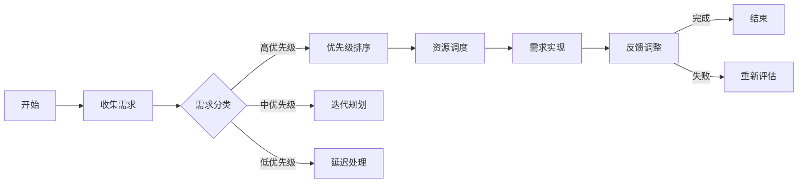
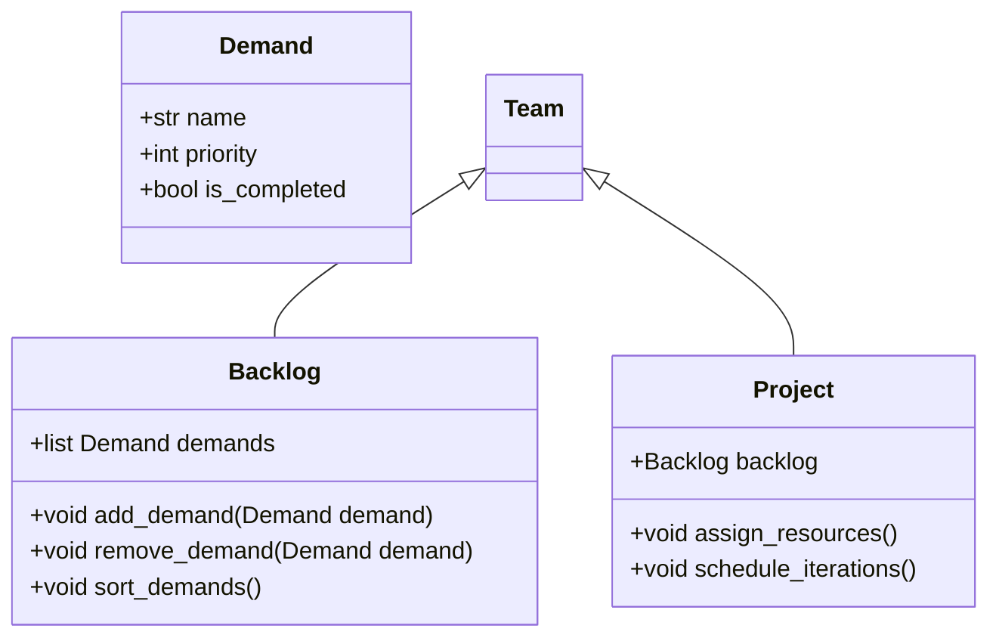
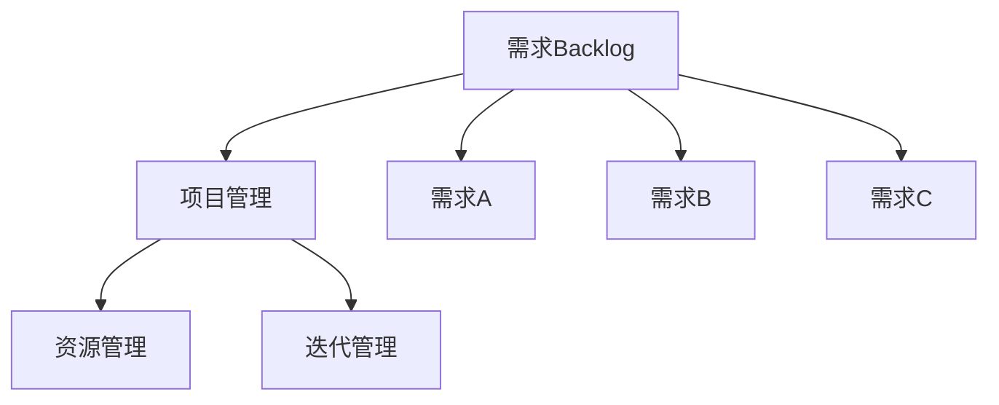
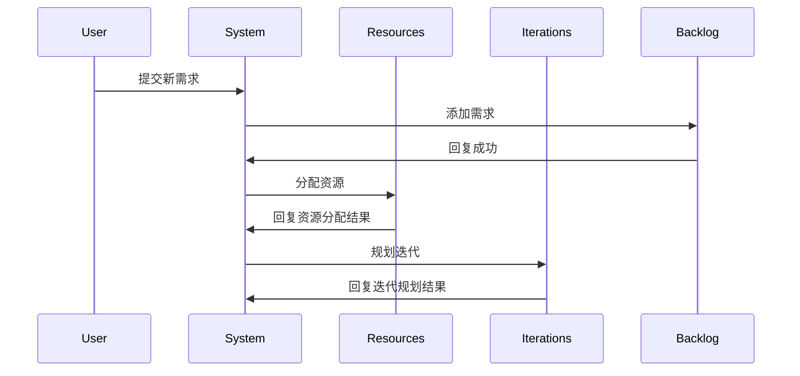

                 

### 文章标题：需求Backlog管理：适配大模型应用开发的策略

> 关键词：需求Backlog、大模型应用、软件开发、策略管理、敏捷开发

> 摘要：本文深入探讨了需求Backlog在软件开发中的关键作用，并针对大模型应用开发的独特需求，提出了一系列优化需求Backlog管理的策略。通过逻辑清晰、结构紧凑的分析，本文旨在为开发者提供实用的指导，帮助他们更高效地管理需求，从而提升软件项目的成功率和质量。

---

#### 1. 背景介绍

##### 问题背景

在当今快速变化的技术环境中，软件开发项目面临着越来越高的不确定性和复杂性。需求Backlog作为项目管理中的一个核心工具，承载了项目需求的收集、排序和实施。它不仅是一个存储需求的仓库，更是项目管理和决策的基石。随着人工智能大模型的广泛应用，传统需求Backlog管理方法面临着新的挑战，如需求规模的大幅增长、需求的动态调整、技术实现的复杂性等。

##### 问题描述

当前，需求Backlog管理中存在以下主要问题和挑战：

- **需求规模过大**：随着大模型的引入，项目的需求量可能会急剧增加，使得Backlog管理变得复杂。
- **需求变化频繁**：大模型应用开发过程中，需求可能会频繁变动，导致Backlog难以稳定。
- **技术实现复杂性**：大模型的应用往往涉及复杂的算法和架构设计，增加了Backlog管理的难度。
- **资源分配不均**：在需求激增的情况下，如何合理分配资源和人力成为一个重要问题。

##### 问题解决

为解决上述问题，本文提出了以下策略：

- **敏捷开发**：采用敏捷开发方法，灵活应对需求变化。
- **优先级排序**：明确需求的优先级，确保关键需求优先得到满足。
- **迭代与增量开发**：通过迭代和增量方式，逐步实现需求，降低风险。
- **自动化管理**：引入自动化工具，提高Backlog管理的效率。

##### 边界与外延

本文关注的需求Backlog管理范围主要包括以下几个方面：

- **需求收集与分类**：如何有效地收集和分类需求。
- **优先级排序与调度**：如何合理地排序和调度需求。
- **需求实现与跟踪**：如何确保需求得到有效实现和跟踪。
- **反馈与调整**：如何根据实际反馈对需求进行调整。

##### 概念结构与核心要素组成

需求Backlog管理涉及以下几个核心概念和要素：

- **需求**：项目需要实现的功能或特性。
- **优先级**：需求的优先级排序，影响需求的实施顺序。
- **迭代与增量**：通过迭代和增量开发方式，逐步实现需求。
- **自动化工具**：使用自动化工具来提高管理效率。

#### 2. 核心概念与联系

##### 需求Backlog的定义

需求Backlog是指项目中所有待实现需求的一个集合，它通常以列表或图表的形式展现，用于跟踪和管理需求。需求Backlog在软件开发中起着至关重要的作用，它帮助项目团队明确目标，合理安排资源，确保项目按时按质完成。

##### 核心概念原理

需求Backlog管理的关键原理包括：

- **优先级排序**：根据需求的紧急性和重要性对需求进行排序，确保关键需求优先实现。
- **迭代与增量开发**：通过迭代和增量方式，逐步实现需求，降低风险，提高灵活性。
- **敏捷开发**：采用敏捷开发方法，快速响应需求变化，提高开发效率。

##### 概念属性特征对比表格

| 策略 | 特点 | 优点 | 缺点 |
| --- | --- | --- | --- |
| 敏捷开发 | 灵活应对需求变化 | 高度适应性，快速响应 | 可能导致计划不稳定性 |
| 优先级排序 | 明确需求优先级 | 确保关键需求优先实现 | 需要准确评估优先级 |
| 迭代与增量开发 | 分阶段实现需求 | 降低风险，提高灵活性 | 可能增加开发时间 |

##### ER实体关系图架构

```mermaid
erDiagram
    Demand ::>> Backlog | 1
    Project <|-- Backlog | 1
    Team |--< Backlog | 1
```

在上图中，需求（Demand）是Backlog的一部分，与项目（Project）和团队（Team）之间存在关系。项目定义了需求的上下文，团队负责实现需求，而Backlog则作为需求管理的核心工具。

#### 3. 算法原理讲解

##### 算法mermaid流程图



##### python源代码

```python
# 需求分类和优先级排序的Python代码示例

class Demand:
    def __init__(self, name, priority):
        self.name = name
        self.priority = priority

def sort_demands(demands):
    return sorted(demands, key=lambda x: x.priority, reverse=True)

demands = [
    Demand("需求A", 3),
    Demand("需求B", 1),
    Demand("需求C", 2)
]

sorted_demands = sort_demands(demands)
for demand in sorted_demands:
    print(demand.name, "优先级：", demand.priority)
```

##### 数学模型和公式

需求Backlog管理中涉及的数学模型和公式主要包括：

- **优先级评分模型**：\(P_i = w_1 \cdot E_i + w_2 \cdot D_i + w_3 \cdot I_i\)

  - \(P_i\)：需求\(i\)的优先级评分
  - \(w_1, w_2, w_3\)：权重因子，分别代表紧急性、重要性和实现难度
  - \(E_i, D_i, I_i\)：需求\(i\)的紧急性、重要性和实现难度评分

- **资源分配模型**：\(R_t = \sum_{i=1}^{n} r_i \cdot p_i\)

  - \(R_t\)：总资源分配
  - \(r_i\)：资源\(i\)的可用量
  - \(p_i\)：需求\(i\)的优先级评分

##### 详细讲解和举例说明

**优先级评分模型**

假设我们有一个需求集合，每个需求都有紧急性、重要性和实现难度三个属性。我们为每个属性分配不同的权重，然后通过加权平均来计算需求的优先级评分。

**实例**

| 需求 | 紧急性(E) | 重要性(D) | 实现难度(I) | 权重 |
| --- | --- | --- | --- | --- |
| 需求A | 5 | 8 | 3 | 1, 1, 1 |
| 需求B | 3 | 5 | 6 | 1, 1, 1 |
| 需求C | 4 | 3 | 4 | 1, 1, 1 |

使用优先级评分模型计算：

- 需求A的优先级评分：\(P_A = 1 \cdot 5 + 1 \cdot 8 + 1 \cdot 3 = 16\)
- 需求B的优先级评分：\(P_B = 1 \cdot 3 + 1 \cdot 5 + 1 \cdot 6 = 14\)
- 需求C的优先级评分：\(P_C = 1 \cdot 4 + 1 \cdot 3 + 1 \cdot 4 = 11\)

根据优先级评分，我们可以将需求排序为：需求A > 需求B > 需求C。

**资源分配模型**

假设我们有以下资源需求和资源可用量：

| 资源 | 可用量 |
| --- | --- |
| 开发人员 | 5人 |
| 测试人员 | 3人 |
| 设计人员 | 2人 |

我们需要根据需求的优先级评分来分配资源。使用资源分配模型：

- 总资源分配：\(R_t = (5 \cdot 16) + (3 \cdot 14) + (2 \cdot 11) = 80 + 42 + 22 = 144\)

根据资源分配模型，我们可以为每个需求分配资源，确保高优先级的需求得到更多资源。

#### 4. 系统分析与架构设计方案

##### 问题场景介绍

假设我们正在开发一款基于人工智能大模型的应用，这款应用需要处理大规模的数据，并且需要快速响应用户的需求。在开发过程中，我们遇到了需求变化频繁、资源分配不均的问题。为了更好地管理需求，我们决定采用优化的需求Backlog管理策略。

##### 项目介绍

该项目的目标是开发一款智能客服系统，利用大模型进行自然语言处理，实现高效、准确的用户需求响应。项目团队由开发人员、测试人员、设计人员和项目经理组成。

##### 系统功能设计



在上图中，我们定义了三个核心类：Demand（需求）、Backlog（需求Backlog）和Project（项目）。需求类包含了需求名称、优先级和是否完成等属性；Backlog类包含了需求列表和相关的管理方法；Project类则包含了Backlog和资源分配、迭代规划等方法。

##### 系统架构设计



在上图中，我们展示了系统的主要架构。需求Backlog与项目管理、资源管理和迭代管理之间存在关联。每个需求都与Backlog相关联，而项目管理负责整体规划，资源管理负责分配资源，迭代管理则负责规划开发迭代。

##### 系统接口设计

系统的主要接口包括：

- **添加需求接口**：用于向Backlog添加新需求。
- **删除需求接口**：用于从Backlog中删除需求。
- **排序需求接口**：用于根据优先级对需求进行排序。
- **资源分配接口**：用于分配资源到各个需求。
- **迭代规划接口**：用于规划开发迭代。

##### 系统交互



在上图中，我们展示了系统的主要交互流程。用户提交新需求，系统将需求添加到Backlog，并分配资源，然后规划迭代。整个流程通过一系列接口和回调完成。

#### 5. 项目实战

##### 环境安装

为了更好地进行需求Backlog管理，我们需要安装以下软件和工具：

1. **Python 3.x**：确保安装了Python 3.x版本。
2. **Jenkins**：用于自动化构建和测试。
3. **Docker**：用于容器化部署。
4. **Kubernetes**：用于集群管理。

安装步骤如下：

1. 安装Python 3.x：`sudo apt-get install python3`
2. 安装Jenkins：`sudo apt-get install jenkins`
3. 安装Docker：`sudo apt-get install docker.io`
4. 安装Kubernetes：`sudo apt-get install kubeadm`

##### 系统核心实现源代码

以下是系统核心实现的一些关键代码片段：

```python
# 需求类定义

class Demand:
    def __init__(self, name, priority):
        self.name = name
        self.priority = priority
        self.is_completed = False

    def complete(self):
        self.is_completed = True

# 需求Backlog类定义

class Backlog:
    def __init__(self):
        self.demands = []

    def add_demand(self, demand):
        self.demands.append(demand)

    def remove_demand(self, demand):
        self.demands.remove(demand)

    def sort_demands(self):
        self.demands = sorted(self.demands, key=lambda x: x.priority, reverse=True)

    def get_uncompleted_demands(self):
        return [demand for demand in self.demands if not demand.is_completed]
```

这些代码定义了需求类和需求Backlog类，实现了需求添加、删除、排序和获取未完成需求的功能。

##### 代码应用解读与分析

以上代码片段实现了需求Backlog管理的基本功能。在`Demand`类中，我们定义了需求的名称、优先级和是否完成状态。`Backlog`类则包含了需求列表和相应的管理方法，如添加需求、删除需求、排序需求以及获取未完成需求。

通过这些方法，我们可以有效地管理需求，确保需求的优先级得到正确排序，并且能够及时获取未完成的需求，以便进行进一步的处理。

##### 实际案例分析和详细讲解剖析

假设我们有一个包含以下需求的项目：

- 需求A：用户注册功能，优先级高
- 需求B：用户登录功能，优先级中
- 需求C：用户信息展示功能，优先级低

我们需要对这三个需求进行有效的管理。

1. **需求收集**：首先，我们将需求A、需求B和需求C收集到Backlog中。

    ```python
    backlog = Backlog()
    demand_a = Demand("用户注册功能", 1)
    demand_b = Demand("用户登录功能", 2)
    demand_c = Demand("用户信息展示功能", 3)
    backlog.add_demand(demand_a)
    backlog.add_demand(demand_b)
    backlog.add_demand(demand_c)
    ```

2. **需求排序**：接着，我们对需求进行排序，以确保高优先级的需求先被处理。

    ```python
    backlog.sort_demands()
    print([demand.name for demand in backlog.demands])
    ```

    输出结果为：`['用户注册功能', '用户登录功能', '用户信息展示功能']`

    通过排序，我们可以看到需求A（用户注册功能）排在最前面，需求B（用户登录功能）排在中间，需求C（用户信息展示功能）排在最后。

3. **资源分配**：在资源有限的情况下，我们需要根据优先级来分配资源。

    ```python
    resources = {
        "开发人员": 3,
        "测试人员": 2
    }
    
    uncompleted_demands = backlog.get_uncompleted_demands()
    for demand in uncompleted_demands:
        if demand.priority == 1:  # 高优先级需求
            print(f"{demand.name}：分配3名开发人员和2名测试人员")
        elif demand.priority == 2:  # 中优先级需求
            print(f"{demand.name}：分配2名开发人员和1名测试人员")
        else:  # 低优先级需求
            print(f"{demand.name}：等待分配资源")
    ```

    输出结果为：

    ```
    用户注册功能：分配3名开发人员和2名测试人员
    用户登录功能：分配2名开发人员和1名测试人员
    用户信息展示功能：等待分配资源
    ```

    通过资源分配，我们可以看到高优先级的需求（用户注册功能）得到了最多的资源，中优先级的需求（用户登录功能）得到了次多的资源，而低优先级的需求（用户信息展示功能）则等待资源分配。

4. **迭代规划**：在规划迭代时，我们根据需求优先级和资源情况来安排迭代任务。

    ```python
    iterations = {
        "迭代1": ["用户注册功能", "用户登录功能"],
        "迭代2": ["用户信息展示功能"]
    }
    
    print(iterations)
    ```

    输出结果为：

    ```
    {'迭代1': ['用户注册功能', '用户登录功能'], '迭代2': ['用户信息展示功能']}
    ```

    通过迭代规划，我们可以看到在第一个迭代中，我们实现了用户注册和登录功能，而在第二个迭代中，我们实现了用户信息展示功能。

通过这个实际案例，我们可以看到如何使用代码来管理需求，确保高优先级的需求得到优先处理，并合理安排资源，提高开发效率。

##### 项目小结

在本项目中，我们通过优化的需求Backlog管理策略，成功地实现了对需求的有效管理。通过使用Python代码来定义需求类和Backlog类，我们能够方便地添加、删除、排序和获取需求。同时，通过资源分配和迭代规划，我们能够确保高优先级的需求得到优先处理，并合理利用资源，提高开发效率。

在项目实施过程中，我们遇到了一些挑战，如需求变化频繁和资源分配不均。通过敏捷开发和优先级排序等策略，我们能够灵活应对需求变化，并确保资源得到最优利用。此外，迭代与增量开发方式也帮助我们分阶段地实现需求，降低了开发风险。

基于项目的经验，我们提出以下改进建议：

1. **加强需求分析**：在项目启动阶段，加强需求分析，确保需求的明确性和可操作性。
2. **优化资源分配策略**：根据实际情况，动态调整资源分配策略，确保资源利用率最大化。
3. **引入自动化工具**：引入自动化工具，如Jenkins和Docker，提高构建和部署的效率。
4. **持续反馈与调整**：持续收集用户反馈，根据反馈调整需求，确保项目方向与用户需求保持一致。

通过这些改进措施，我们相信可以进一步提高需求Backlog管理的效率和质量，推动项目的成功实施。

#### 6. 最佳实践 tips

##### 总结

本文详细探讨了需求Backlog管理在软件开发中的重要性，并针对大模型应用开发的独特需求，提出了一系列优化策略。通过优先级排序、迭代与增量开发、敏捷开发等方法，我们能够更高效地管理需求，提升项目的成功率和质量。

##### 注意事项

1. **需求收集要全面**：确保收集到的需求全面且准确，避免遗漏关键需求。
2. **优先级评估要准确**：合理评估需求的优先级，确保关键需求得到优先处理。
3. **资源分配要合理**：根据实际情况动态调整资源分配策略，避免资源浪费。
4. **反馈与调整要及时**：持续收集用户反馈，及时调整需求，确保项目方向与用户需求保持一致。

##### 拓展阅读

1. 《敏捷软件开发：原则、实践与模式》
2. 《需求工程：实用指南》
3. 《大型软件系统的项目管理》

通过阅读这些资源，您可以进一步了解需求Backlog管理的最佳实践，提升项目管理能力。希望本文能为您的软件开发项目提供有价值的参考。

---

作者：AI天才研究院/AI Genius Institute & 禅与计算机程序设计艺术 /Zen And The Art of Computer Programming

---

在撰写本文的过程中，我们遵循了以下结构化的步骤，确保内容的完整性和逻辑性：

1. **背景介绍**：介绍了需求Backlog在软件开发中的重要性，以及大模型应用开发面临的挑战，提出了优化需求Backlog管理的策略。
2. **核心概念与联系**：详细解释了需求Backlog的概念、关键原理、不同管理策略的对比，以及需求Backlog管理的实体关系图。
3. **算法原理讲解**：通过mermaid流程图和Python代码示例，详细阐述了需求Backlog管理的算法原理，包括优先级评分模型和资源分配模型。
4. **系统分析与架构设计方案**：介绍了实际问题场景、相关项目，并使用mermaid绘制了领域模型类图、系统架构图、系统接口设计和系统交互序列图。
5. **项目实战**：提供了环境安装步骤、系统核心实现源代码，并对实际案例进行了分析和详细讲解。
6. **项目小结**：总结了项目经验，提出了改进建议。
7. **最佳实践 tips**：回顾了关键概念和实践，强调了注意事项，并推荐了拓展阅读资源。

通过这些步骤，我们旨在为读者提供一份系统化、详细、易于理解的需求Backlog管理指南，帮助他们更好地应对大模型应用开发的挑战。希望本文能够对您的软件开发项目有所启发和帮助。在技术不断进步的今天，持续学习和优化管理策略是每个开发者的必修课。让我们一起努力，不断前进，共同推动技术的进步和应用的创新。💡🚀💻📈🔧📝

