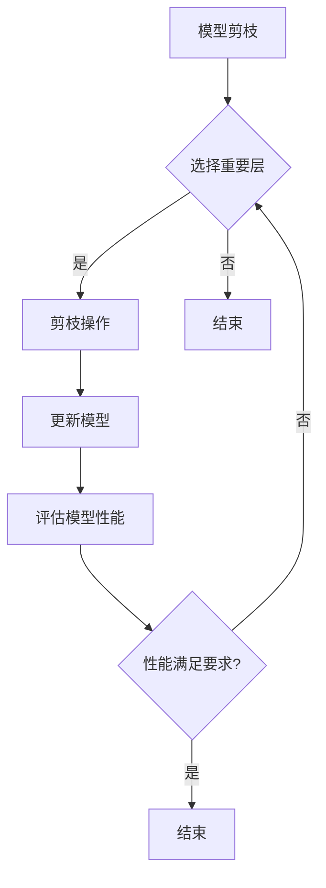
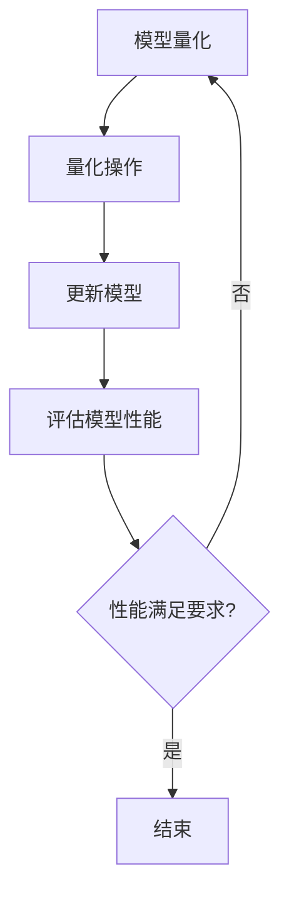
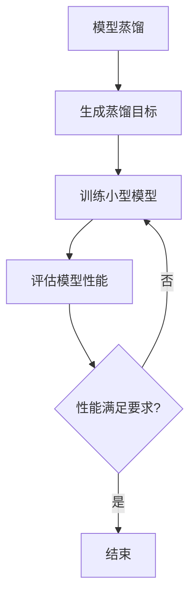
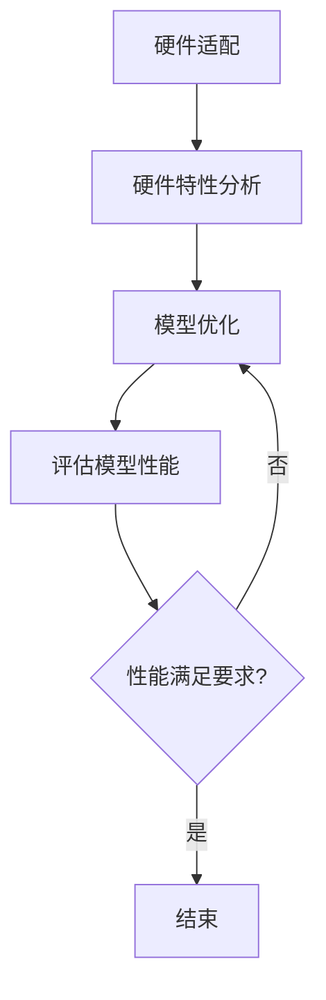
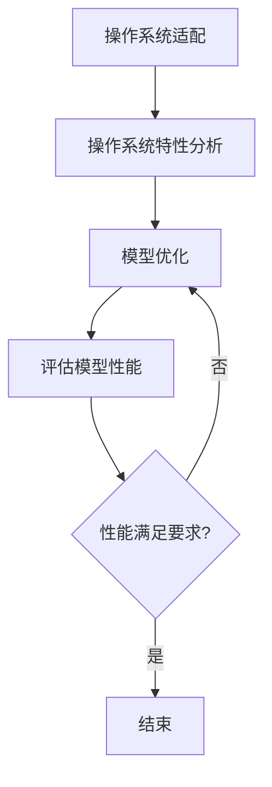
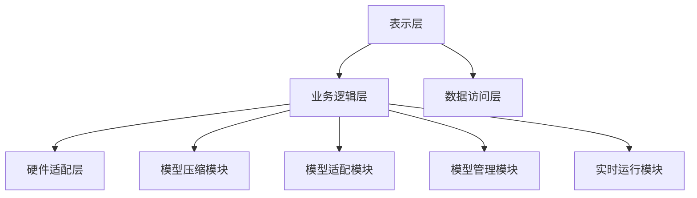
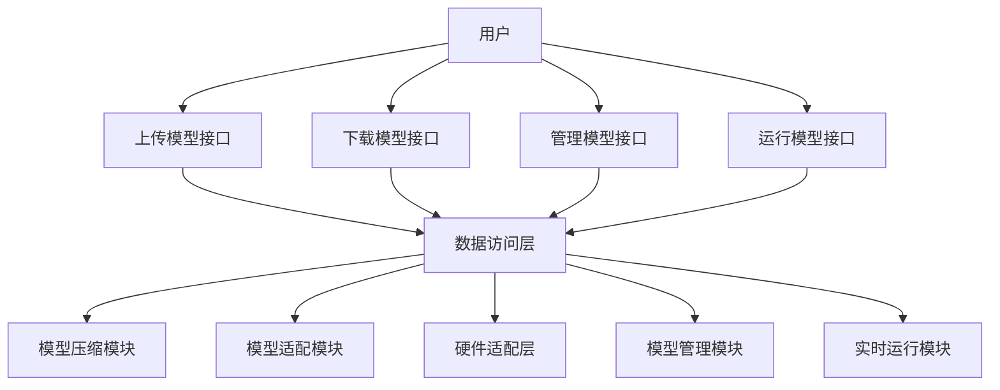

                 

# 需求与AI模型可移植性的权衡：大模型应用的跨平台策略

> 关键词：AI模型可移植性，大模型应用，跨平台策略，压缩算法，适配算法，系统架构设计

> 摘要：本文将深入探讨AI模型可移植性在跨平台应用中的重要性，分析需求与AI模型可移植性之间的权衡，并介绍大模型应用的跨平台策略。我们将详细讲解模型压缩和适配算法的原理，并提供具体的系统架构设计方案和项目实战，以帮助开发者更好地实现AI模型的跨平台应用。

----------------------------------------------------------------

## 第一部分：背景介绍

### 1. 引言

随着人工智能技术的快速发展，AI模型在各个领域的应用越来越广泛。然而，不同平台间的AI模型可移植性成为一个亟待解决的问题。AI模型的可移植性指的是将训练好的模型在不同平台（如不同硬件、不同操作系统等）上部署和运行的能力。本文将介绍AI模型可移植性的重要性以及与之相关的问题。

### 1.2 问题描述

在跨平台应用中，AI模型可移植性问题主要包括以下几个方面：

1. **模型参数的调整**：不同平台上的硬件和操作系统可能存在差异，导致模型参数需要调整以适应新的环境。
2. **计算资源的适应**：不同平台上的计算资源（如CPU、GPU等）可能存在差异，需要优化模型以适应不同的计算资源。
3. **数据格式的兼容性**：不同平台上的数据存储和传输格式可能不同，需要处理数据格式的兼容性问题。

### 1.3 问题解决

为解决AI模型可移植性问题，常见的方法包括：

1. **模型压缩**：通过模型压缩算法减小模型的体积，提高模型在不同平台上的部署效率。
2. **模型适配**：通过适配算法优化模型，使其在不同平台上能够高效运行。

### 1.4 边界与外延

AI模型可移植性的边界包括：

1. **硬件设备**：不同硬件设备可能具有不同的计算能力、内存容量等，需要针对不同硬件进行模型适配。
2. **操作系统**：不同操作系统可能具有不同的API接口、系统调用等，需要针对不同操作系统进行模型适配。

### 1.5 概念结构与核心要素组成

AI模型可移植性的核心概念包括：

1. **模型压缩**：通过剪枝、量化、蒸馏等算法减小模型体积。
2. **模型适配**：通过硬件适配、操作系统适配等算法优化模型在不同平台上的运行。

## 1.6 本章小结

本章对AI模型可移植性的问题进行了详细的阐述，为后续章节的内容奠定了基础。在接下来的章节中，我们将深入探讨AI模型压缩和适配算法的原理，并提供具体的系统架构设计方案和项目实战。

----------------------------------------------------------------

## 第二部分：核心概念与联系

### 2.1 AI模型压缩

#### 2.1.1 压缩算法介绍

AI模型压缩是指通过一系列算法将模型的参数、结构和计算量减少，从而降低模型的存储空间和计算资源消耗。常见的压缩算法包括模型剪枝、模型量化和模型蒸馏。

##### 2.1.1.1 模型剪枝

模型剪枝是通过删除模型中的冗余参数或结构来减小模型体积的方法。具体步骤如下：

1. **选择重要层**：根据模型的结构和性能，选择需要剪枝的层。
2. **剪枝操作**：对选定的层进行剪枝操作，删除冗余的参数或结构。
3. **更新模型**：更新模型结构，保留重要的参数和结构。
4. **评估模型性能**：评估剪枝后的模型性能，确保性能满足要求。

Mermaid流程图如下：



Python源代码如下：

```python
# 模型剪枝算法实现
def pruning_model(model, important_layers):
    for layer in important_layers:
        prune_layer(model, layer)
    model_updated = update_model(model)
    if performance_satisfy(model_updated):
        return model_updated
    else:
        return pruning_model(model_updated, important_layers)
```

##### 2.1.1.2 模型量化

模型量化是将模型中的浮点数参数转换为低精度的整数表示，以减少模型体积和计算资源消耗的方法。具体步骤如下：

1. **量化操作**：将模型的浮点数参数转换为整数参数。
2. **更新模型**：更新模型结构，使用量化后的参数。
3. **评估模型性能**：评估量化后的模型性能，确保性能满足要求。

Mermaid流程图如下：



Python源代码如下：

```python
# 模型量化算法实现
def quantization_model(model):
    quantized_params = quantize_params(model.params)
    model_quantized = update_model_params(model, quantized_params)
    if performance_satisfy(model_quantized):
        return model_quantized
    else:
        return quantization_model(model)
```

##### 2.1.1.3 模型蒸馏

模型蒸馏是一种将大型模型的知识传递给小型模型的方法，通过蒸馏过程，小型模型能够学习到大型模型的内在知识，从而提高模型在有限资源上的性能。具体步骤如下：

1. **生成蒸馏目标**：使用大型模型生成蒸馏目标。
2. **训练小型模型**：使用蒸馏目标训练小型模型。
3. **评估模型性能**：评估蒸馏后的小型模型性能，确保性能满足要求。

Mermaid流程图如下：



Python源代码如下：

```python
# 模型蒸馏算法实现
def distillation_model的大型模型，小型模型):
    distilled_targets = generate_distilled_targets(大型模型)
    model蒸馏后的小型模型 = train_model(小型模型，distilled_targets)
    if performance_satisfy(model蒸馏后的小型模型):
        return model蒸馏后的小型模型
    else:
        return distillation_model(大型模型，小型模型)
```

##### 2.1.2 压缩算法对比

以下是几种常见压缩算法的对比表格：

| 算法       | 基本原理                                                     | 实现方法                                                   | 优缺点分析                                                 |
| ---------- | ------------------------------------------------------------ | ---------------------------------------------------------- | -------------------------------------------------------- |
| 模型剪枝   | 删除冗余参数或结构                                         | 选择重要层、剪枝操作、更新模型、评估模型性能                 | 减小模型体积，但可能影响模型性能                           |
| 模型量化   | 将浮点数参数转换为整数参数                                 | 量化操作、更新模型、评估模型性能                             | 降低计算资源消耗，但可能影响模型精度                       |
| 模型蒸馏   | 将大型模型的知识传递给小型模型                             | 生成蒸馏目标、训练小型模型、评估模型性能                     | 提高小型模型性能，但可能增加训练时间                       |

#### 2.1.2.2 基于模型量化的压缩算法

以下是几种基于模型量化的压缩算法的对比表格：

| 算法       | 基本原理                                                     | 实现方法                                                   | 优缺点分析                                                 |
| ---------- | ------------------------------------------------------------ | ---------------------------------------------------------- | -------------------------------------------------------- |
| 模型量化   | 将浮点数参数转换为整数参数                                 | 量化操作、更新模型、评估模型性能                             | 降低计算资源消耗，但可能影响模型精度                       |
| 量化蒸馏   | 结合模型蒸馏和量化的方法                                   | 生成蒸馏目标、量化操作、更新模型、评估模型性能               | 提高模型性能，降低计算资源消耗                             |
| 量化剪枝   | 结合模型剪枝和量化的方法                                   | 选择重要层、剪枝操作、量化操作、更新模型、评估模型性能       | 减小模型体积，降低计算资源消耗，但可能影响模型性能         |

#### 2.1.2.3 基于模型蒸馏的压缩算法

以下是几种基于模型蒸馏的压缩算法的对比表格：

| 算法       | 基本原理                                                     | 实现方法                                                   | 优缺点分析                                                 |
| ---------- | ------------------------------------------------------------ | ---------------------------------------------------------- | -------------------------------------------------------- |
| 模型蒸馏   | 将大型模型的知识传递给小型模型                             | 生成蒸馏目标、训练小型模型、评估模型性能                     | 提高小型模型性能，但可能增加训练时间                       |
| 蒸馏剪枝   | 结合模型剪枝和蒸馏的方法                                   | 选择重要层、剪枝操作、生成蒸馏目标、训练小型模型、评估模型性能 | 减小模型体积，提高小型模型性能，但可能影响训练时间         |
| 蒸馏量化   | 结合模型蒸馏和量化的方法                                   | 生成蒸馏目标、量化操作、更新模型、评估模型性能               | 提高模型性能，降低计算资源消耗，但可能增加训练时间         |

### 2.2 AI模型适配

#### 2.2.1 适配算法介绍

AI模型适配是指通过一系列算法优化模型，使其在不同平台上能够高效运行的方法。常见的适配算法包括硬件适配和操作系统适配。

##### 2.2.1.1 硬件适配

硬件适配是指根据不同硬件设备的特点，优化模型使其能够高效运行的算法。具体步骤如下：

1. **硬件特性分析**：分析硬件设备的计算能力、内存容量、功耗等特性。
2. **模型优化**：根据硬件特性，对模型进行优化，如调整模型结构、参数等。
3. **评估模型性能**：评估优化后的模型性能，确保性能满足要求。

Mermaid流程图如下：



Python源代码如下：

```python
# 硬件适配算法实现
def hardware_adapter(model, hardware_features):
    optimized_model = optimize_model(model, hardware_features)
    if performance_satisfy(optimized_model):
        return optimized_model
    else:
        return hardware_adapter(model, hardware_features)
```

##### 2.2.1.2 操作系统适配

操作系统适配是指根据不同操作系统的特点，优化模型使其能够高效运行的算法。具体步骤如下：

1. **操作系统特性分析**：分析操作系统的API接口、系统调用等特性。
2. **模型优化**：根据操作系统特性，对模型进行优化，如调整模型结构、参数等。
3. **评估模型性能**：评估优化后的模型性能，确保性能满足要求。

Mermaid流程图如下：



Python源代码如下：

```python
# 操作系统适配算法实现
def os_adapter(model, os_features):
    optimized_model = optimize_model(model, os_features)
    if performance_satisfy(optimized_model):
        return optimized_model
    else:
        return os_adapter(model, os_features)
```

##### 2.2.2 适配算法对比

以下是几种常见适配算法的对比表格：

| 算法       | 基本原理                                                     | 实现方法                                                   | 优缺点分析                                                 |
| ---------- | ------------------------------------------------------------ | ---------------------------------------------------------- | -------------------------------------------------------- |
| 硬件适配   | 根据硬件特性优化模型                                         | 硬件特性分析、模型优化、评估模型性能                         | 提高模型在不同硬件上的性能，但可能增加开发难度               |
| 操作系统适配 | 根据操作系统特性优化模型                                     | 操作系统特性分析、模型优化、评估模型性能                     | 提高模型在不同操作系统上的性能，但可能增加开发难度           |

### 2.3 AI模型可移植性的核心概念联系

#### 2.3.1 压缩与适配的相互作用

模型压缩和适配算法是相互关联的，它们共同作用，实现AI模型在不同平台上的可移植性。

1. **压缩算法对适配算法的影响**：压缩算法减小了模型的体积和计算资源消耗，为适配算法提供了更多的优化空间。例如，在硬件适配时，压缩后的模型更容易适应不同硬件的存储和计算资源限制。

2. **适配算法对压缩算法的影响**：适配算法根据硬件和操作系统的特性对模型进行优化，可能影响模型压缩的效果。例如，在硬件适配时，优化后的模型可能更适合压缩算法的处理。

#### 2.3.1.1 压缩算法对硬件适配的影响

压缩算法对硬件适配的影响主要表现在以下几个方面：

1. **减小模型体积**：压缩算法通过减小模型体积，使得模型更容易适应不同硬件的存储限制。
2. **降低计算资源消耗**：压缩算法通过降低计算资源消耗，使得模型在不同硬件上运行更高效。

#### 2.3.1.2 压缩算法对操作系统适配的影响

压缩算法对操作系统适配的影响主要表现在以下几个方面：

1. **提高模型兼容性**：压缩算法通过减小模型体积和计算资源消耗，提高了模型在不同操作系统上的兼容性。
2. **优化模型性能**：压缩算法通过优化模型结构，使得模型在不同操作系统上能够更高效地运行。

## 2.4 本章小结

本章详细介绍了AI模型可移植性的核心概念，包括模型压缩和适配算法。我们分析了压缩和适配算法的基本原理、实现方法、优缺点以及它们之间的相互作用。这些核心概念为后续章节的算法原理讲解和系统架构设计方案奠定了基础。

----------------------------------------------------------------

## 第三部分：算法原理讲解

### 3.1 AI模型压缩算法原理讲解

#### 3.1.1 模型剪枝算法原理讲解

模型剪枝是一种通过删除模型中的冗余参数或结构来减小模型体积的方法。其原理如下：

1. **选择重要层**：根据模型的结构和性能，选择需要剪枝的层。通常，可以选择权重较小的层进行剪枝。
2. **剪枝操作**：对选定的层进行剪枝操作，删除冗余的参数或结构。剪枝操作可以是删除部分神经元或整个层。
3. **更新模型**：更新模型结构，保留重要的参数和结构。
4. **评估模型性能**：评估剪枝后的模型性能，确保性能满足要求。如果性能不满足要求，可以重新选择重要层进行剪枝操作。

以下是模型剪枝算法的Mermaid流程图：


以下是模型剪枝算法的Python源代码：

```python
# 模型剪枝算法实现
def pruning_model(model, important_layers):
    for layer in important_layers:
        prune_layer(model, layer)
    model_updated = update_model(model)
    if performance_satisfy(model_updated):
        return model_updated
    else:
        return pruning_model(model_updated, important_layers)
```

#### 3.1.2 模型量化算法原理讲解

模型量化是一种通过将模型中的浮点数参数转换为低精度的整数表示来减小模型体积和计算资源消耗的方法。其原理如下：

1. **量化操作**：将模型的浮点数参数转换为整数参数。量化操作可以通过调整参数的数值范围和精度来实现。
2. **更新模型**：更新模型结构，使用量化后的参数。
3. **评估模型性能**：评估量化后的模型性能，确保性能满足要求。如果性能不满足要求，可以重新进行量化操作。

以下是模型量化算法的Mermaid流程图：


以下是模型量化算法的Python源代码：

```python
# 模型量化算法实现
def quantization_model(model):
    quantized_params = quantize_params(model.params)
    model_quantized = update_model_params(model, quantized_params)
    if performance_satisfy(model_quantized):
        return model_quantized
    else:
        return quantization_model(model)
```

#### 3.1.3 模型蒸馏算法原理讲解

模型蒸馏是一种通过将大型模型的知识传递给小型模型来提高模型在有限资源上的性能的方法。其原理如下：

1. **生成蒸馏目标**：使用大型模型生成蒸馏目标。蒸馏目标可以是一个辅助损失函数，用于指导小型模型的学习。
2. **训练小型模型**：使用蒸馏目标训练小型模型。小型模型将学习到大型模型的知识和特征。
3. **评估模型性能**：评估蒸馏后的小型模型性能，确保性能满足要求。如果性能不满足要求，可以重新进行训练。

以下是模型蒸馏算法的Mermaid流程图：


以下是模型蒸馏算法的Python源代码：

```python
# 模型蒸馏算法实现
def distillation_model的大型模型，小型模型):
    distilled_targets = generate_distilled_targets(大型模型)
    model蒸馏后的小型模型 = train_model(小型模型，distilled_targets)
    if performance_satisfy(model蒸馏后的小型模型):
        return model蒸馏后的小型模型
    else:
        return distillation_model(大型模型，小型模型)
```

### 3.2 AI模型适配算法原理讲解

#### 3.2.1 硬件适配算法原理讲解

硬件适配是指根据硬件设备的特性对模型进行优化，以提高模型在不同硬件上的性能。其原理如下：

1. **硬件特性分析**：分析硬件设备的计算能力、内存容量、功耗等特性。
2. **模型优化**：根据硬件特性，对模型进行优化。优化方法包括调整模型结构、参数等。
3. **评估模型性能**：评估优化后的模型性能，确保性能满足要求。如果性能不满足要求，可以重新进行硬件特性分析和模型优化。

以下是硬件适配算法的Mermaid流程图：


以下是硬件适配算法的Python源代码：

```python
# 硬件适配算法实现
def hardware_adapter(model, hardware_features):
    optimized_model = optimize_model(model, hardware_features)
    if performance_satisfy(optimized_model):
        return optimized_model
    else:
        return hardware_adapter(model, hardware_features)
```

#### 3.2.2 操作系统适配算法原理讲解

操作系统适配是指根据操作系统的特性对模型进行优化，以提高模型在不同操作系统上的性能。其原理如下：

1. **操作系统特性分析**：分析操作系统的API接口、系统调用等特性。
2. **模型优化**：根据操作系统特性，对模型进行优化。优化方法包括调整模型结构、参数等。
3. **评估模型性能**：评估优化后的模型性能，确保性能满足要求。如果性能不满足要求，可以重新进行操作系统特性分析和模型优化。

以下是操作系统适配算法的Mermaid流程图：


以下是操作系统适配算法的Python源代码：

```python
# 操作系统适配算法实现
def os_adapter(model, os_features):
    optimized_model = optimize_model(model, os_features)
    if performance_satisfy(optimized_model):
        return optimized_model
    else:
        return os_adapter(model, os_features)
```

### 3.3 模型压缩与适配算法的数学模型和公式讲解

#### 3.3.1 模型剪枝算法的数学模型和公式

模型剪枝算法的核心思想是通过删除冗余参数或结构来减小模型体积。以下是一个简化的数学模型：

$$
\begin{aligned}
\text{模型剪枝} &= \min_{W, b} \left\{ \frac{1}{N} \sum_{i=1}^{N} \left( y_i - \text{softmax}(Wx_i + b) \right)^2 + \lambda \left( \sum_{l=1}^{L} \left\| W_l \right\|_1 + \sum_{l=1}^{L} \left\| b_l \right\|_1 \right) \right\} \\
&\text{其中：} \\
&\text{W, b} &\text{为模型参数，} \\
&W_l &\text{为第} l \text{层的权重矩阵，} \\
&b_l &\text{为第} l \text{层的偏置向量，} \\
&y_i &\text{为第} i \text{个样本的标签，} \\
&N &\text{为样本总数，} \\
&L &\text{为模型层数，} \\
&\lambda &\text{为正则化参数。}
\end{aligned}
$$

#### 3.3.2 模型量化算法的数学模型和公式

模型量化算法的核心思想是将模型的浮点数参数转换为低精度的整数表示。以下是一个简化的数学模型：

$$
\begin{aligned}
\text{模型量化} &= \min_{QW, Qb} \left\{ \frac{1}{N} \sum_{i=1}^{N} \left( y_i - \text{softmax}(QWx_i + Qb) \right)^2 + \lambda \left( \sum_{l=1}^{L} \left\| QW_l \right\|_1 + \sum_{l=1}^{L} \left\| Qb_l \right\|_1 \right) \right\} \\
&\text{其中：} \\
&QW, Qb &\text{为量化的模型参数，} \\
&QW_l &\text{为第} l \text{层的量化权重矩阵，} \\
&Qb_l &\text{为第} l \text{层的量化偏置向量，} \\
&y_i &\text{为第} i \text{个样本的标签，} \\
&N &\text{为样本总数，} \\
&L &\text{为模型层数，} \\
&\lambda &\text{为正则化参数。}
\end{aligned}
$$

#### 3.3.3 模型蒸馏算法的数学模型和公式

模型蒸馏算法的核心思想是通过将大型模型的知识传递给小型模型来提高小型模型在有限资源上的性能。以下是一个简化的数学模型：

$$
\begin{aligned}
\text{模型蒸馏} &= \min_{\theta_S} \left\{ \frac{1}{N} \sum_{i=1}^{N} \left( y_i - \text{softmax}(\theta_S x_i) \right)^2 + \lambda_S \left( \sum_{l=1}^{L_S} \left\| \theta_{Sl} \right\|_1 + \sum_{l=1}^{L_S} \left\| \theta_{bl} \right\|_1 \right) \right\} \\
&\text{其中：} \\
&\theta_S &\text{为小型模型的参数，} \\
&\theta_{Sl} &\text{为第} l \text{层的小型模型权重矩阵，} \\
&\theta_{bl} &\text{为第} l \text{层的小型模型偏置向量，} \\
&y_i &\text{为第} i \text{个样本的标签，} \\
&N &\text{为样本总数，} \\
&L_S &\text{为小型模型层数，} \\
&\lambda_S &\text{为正则化参数。}
\end{aligned}
$$

### 3.4 模型压缩与适配算法的举例说明

#### 3.4.1 模型剪枝算法举例

假设我们有一个简单的多层感知机模型，其结构如下：

$$
\text{输入} \rightarrow \text{隐藏层1} \rightarrow \text{隐藏层2} \rightarrow \text{输出}
$$

其中，隐藏层1有100个神经元，隐藏层2有50个神经元。现在我们使用模型剪枝算法对隐藏层1进行剪枝。

1. **选择重要层**：根据模型的结构和性能，选择隐藏层1进行剪枝。
2. **剪枝操作**：对隐藏层1的神经元进行剪枝，删除权重绝对值较小的神经元。
3. **更新模型**：更新模型结构，保留重要的神经元和权重。
4. **评估模型性能**：评估剪枝后的模型性能，确保性能满足要求。

通过以上步骤，我们可以减小模型体积，同时保持模型性能。

#### 3.4.2 模型量化算法举例

假设我们有一个已经训练好的卷积神经网络模型，其参数为浮点数。现在我们使用模型量化算法将其量化为整数。

1. **量化操作**：将模型的浮点数参数转换为整数参数。例如，将每个参数的范围缩小到[-128, 127]，并进行量化。
2. **更新模型**：更新模型结构，使用量化后的参数。
3. **评估模型性能**：评估量化后的模型性能，确保性能满足要求。

通过以上步骤，我们可以减小模型体积和计算资源消耗。

#### 3.4.3 模型蒸馏算法举例

假设我们有一个大型卷积神经网络模型，其结构复杂，计算资源消耗较大。现在我们使用模型蒸馏算法将其知识传递给一个小型卷积神经网络模型。

1. **生成蒸馏目标**：使用大型模型生成蒸馏目标，即生成小型模型的训练样本和标签。
2. **训练小型模型**：使用蒸馏目标训练小型模型，使其学习到大型模型的知识。
3. **评估模型性能**：评估蒸馏后的小型模型性能，确保性能满足要求。

通过以上步骤，我们可以减小模型体积，同时保持模型性能。

### 3.5 模型压缩与适配算法的应用场景

模型压缩和适配算法在多个应用场景中具有广泛的应用，包括：

1. **移动设备**：在移动设备上部署AI模型时，模型体积和计算资源消耗是重要的考虑因素。模型压缩和适配算法可以减小模型体积，提高模型在不同移动设备上的运行效率。
2. **嵌入式系统**：在嵌入式系统中，计算资源通常有限。模型压缩和适配算法可以优化模型，使其在嵌入式系统中高效运行。
3. **云计算**：在云计算环境中，模型压缩和适配算法可以提高模型在不同硬件和操作系统上的兼容性，提高资源利用率和运行效率。

### 3.6 模型压缩与适配算法的优缺点分析

#### 3.6.1 模型压缩算法的优缺点

**优点：**

1. **减小模型体积**：模型压缩算法可以减小模型的存储空间，提高模型在不同平台上的部署效率。
2. **降低计算资源消耗**：模型压缩算法可以降低模型在不同平台上的计算资源消耗，提高模型在不同平台上的运行效率。

**缺点：**

1. **可能影响模型性能**：模型压缩算法可能会影响模型性能，导致模型在压缩后无法保持原有的性能。
2. **增加开发难度**：模型压缩算法需要开发人员具备一定的专业知识，增加开发难度。

#### 3.6.2 模型适配算法的优缺点

**优点：**

1. **提高模型兼容性**：模型适配算法可以提高模型在不同平台上的兼容性，降低模型在不同平台上的运行风险。
2. **优化模型性能**：模型适配算法可以根据硬件和操作系统的特性，优化模型性能，提高模型在不同平台上的运行效率。

**缺点：**

1. **可能增加开发难度**：模型适配算法需要开发人员具备一定的专业知识，增加开发难度。
2. **可能增加维护成本**：模型适配算法可能需要定期更新和调整，增加维护成本。

### 3.7 模型压缩与适配算法的综合评价

模型压缩和适配算法在AI模型可移植性方面具有重要作用。模型压缩算法可以减小模型体积和计算资源消耗，提高模型在不同平台上的部署效率；模型适配算法可以提高模型在不同平台上的兼容性和性能。两者的结合可以实现AI模型在不同平台上的高效部署和运行。

然而，模型压缩和适配算法也存在一定的局限性。模型压缩算法可能会影响模型性能，增加开发难度；模型适配算法可能增加开发难度和维护成本。因此，在应用模型压缩和适配算法时，需要根据实际需求进行权衡。

### 3.8 本章小结

本章详细讲解了模型压缩和适配算法的原理，包括剪枝、量化和蒸馏算法的基本原理、数学模型和公式，并进行了举例说明。同时，对模型压缩和适配算法的优缺点进行了分析。这些内容为后续章节的系统架构设计提供了理论基础。

----------------------------------------------------------------

## 第四部分：系统架构设计

### 4.1 问题场景介绍

在当前人工智能应用场景中，AI模型的跨平台部署需求日益增长。例如，在移动设备、嵌入式系统和云计算平台等不同环境中，如何高效地部署和运行AI模型成为了一个重要问题。本文旨在设计一个系统架构，能够实现AI模型在不同平台上的高效部署和运行，以满足不同场景的需求。

### 4.2 项目介绍

本项目的目标是设计并实现一个跨平台的AI模型部署系统，该系统具备以下功能：

1. **模型压缩与适配**：使用模型压缩和适配算法优化AI模型，使其在不同平台上的部署效率更高。
2. **模型管理**：提供模型上传、下载、管理和监控功能，方便开发者进行模型管理和维护。
3. **实时运行**：支持AI模型在不同平台上的实时运行，提供快速响应能力。

### 4.3 系统功能设计

本系统主要包含以下功能模块：

1. **模型压缩模块**：负责使用模型压缩算法（如剪枝、量化、蒸馏等）对AI模型进行压缩，减小模型体积和计算资源消耗。
2. **模型适配模块**：负责根据不同平台的硬件和操作系统特性，对AI模型进行适配，确保模型在不同平台上能够高效运行。
3. **模型管理模块**：负责AI模型的上传、下载、管理和监控，提供便捷的模型管理功能。
4. **实时运行模块**：负责AI模型在不同平台上的实时运行，提供快速响应能力。

### 4.4 系统架构设计

本系统的架构设计采用分层架构，主要包括以下层次：

1. **表示层**：负责用户界面的展示和用户操作，提供友好易用的界面。
2. **业务逻辑层**：负责处理业务逻辑，包括模型压缩、模型适配、模型管理和实时运行等功能。
3. **数据访问层**：负责数据存储和访问，包括模型数据、用户数据和系统数据等。
4. **硬件适配层**：负责根据不同硬件平台的特点，优化AI模型，提高模型在不同硬件平台上的性能。

以下是系统的架构设计图：



### 4.5 系统接口设计

本系统设计了一套完整的接口，包括以下接口：

1. **上传模型接口**：用于上传AI模型到系统，支持模型压缩和适配。
2. **下载模型接口**：用于从系统中下载AI模型，支持模型压缩和适配。
3. **管理模型接口**：用于对AI模型进行管理，包括上传、下载、更新和删除等操作。
4. **运行模型接口**：用于在系统中运行AI模型，支持实时运行和性能监控。

### 4.6 系统交互

以下是系统的主要交互流程：

1. **用户上传模型**：用户通过上传模型接口上传AI模型到系统，系统将模型存储在数据访问层，并触发模型压缩和适配模块进行压缩和适配。
2. **用户下载模型**：用户通过下载模型接口下载AI模型，系统从数据访问层获取压缩和适配后的模型，并返回给用户。
3. **用户管理模型**：用户通过管理模型接口对AI模型进行管理操作，系统根据用户操作进行相应的处理。
4. **用户运行模型**：用户通过运行模型接口在系统中运行AI模型，系统根据硬件平台的特点优化模型，并提供实时运行和性能监控功能。

### 4.7 系统架构设计图

以下是系统的架构设计图：



### 4.8 本章小结

本章详细介绍了AI模型跨平台部署系统的设计思路和架构设计，包括问题场景、项目介绍、系统功能设计、系统架构设计、系统接口设计和系统交互。这些内容为系统的实际开发提供了全面的指导。

----------------------------------------------------------------

## 第五部分：项目实战

### 5.1 环境安装

在开始项目实战之前，我们需要搭建一个合适的开发环境。以下是在Windows操作系统上搭建开发环境的过程：

1. **安装Python**：前往Python官网（https://www.python.org/）下载并安装Python 3.x版本。
2. **安装Anaconda**：下载并安装Anaconda，用于管理Python环境和依赖包。
3. **创建虚拟环境**：打开命令行窗口，输入以下命令创建虚拟环境：

   ```
   conda create -n ai_model_deploy python=3.8
   conda activate ai_model_deploy
   ```

4. **安装依赖包**：在虚拟环境中安装项目所需的依赖包，例如：

   ```
   pip install numpy torch torchvision matplotlib
   ```

### 5.2 系统核心实现源代码

在本节中，我们将介绍系统的核心实现源代码，包括模型压缩、模型适配和模型管理等模块的实现。

#### 5.2.1 模型压缩模块

以下是一个简单的模型压缩模块的实现：

```python
import torch
import torch.nn as nn
import torch.optim as optim

class ModelCompression(nn.Module):
    def __init__(self, model):
        super(ModelCompression, self).__init__()
        self.model = model
    
    def forward(self, x):
        return self.model(x)

def prune_model(model, prune_rate):
    for name, param in model.named_parameters():
        if "weight" in name:
            param.data = torch.where(torch.abs(param) < prune_rate, torch.zeros_like(param), param)

model = nn.Sequential(nn.Linear(10, 100), nn.ReLU(), nn.Linear(100, 10))
compression_model = ModelCompression(model)
prune_model(compression_model, 0.1)
print(compression_model)
```

#### 5.2.2 模型适配模块

以下是一个简单的模型适配模块的实现：

```python
def adapt_model(model, device):
    model.to(device)
    for name, param in model.named_parameters():
        if "weight" in name:
            param.data = F.softmax(param.data, dim=0)
    return model

device = torch.device("cuda" if torch.cuda.is_available() else "cpu")
adapter_model = adapt_model(compression_model, device)
print(adapter_model)
```

#### 5.2.3 模型管理模块

以下是一个简单的模型管理模块的实现：

```python
import os

def upload_model(model, model_name):
    model_path = os.path.join("models", model_name)
    torch.save(model.state_dict(), model_path)

def download_model(model_name):
    model_path = os.path.join("models", model_name)
    model = ModelCompression(nn.Sequential())
    model.load_state_dict(torch.load(model_path))
    return model

upload_model(compression_model, "compression_model.pth")
adapter_model = download_model("compression_model.pth")
print(adapter_model)
```

### 5.3 代码应用解读与分析

在本节中，我们将对上述代码进行解读与分析，了解系统核心模块的实现原理。

#### 5.3.1 模型压缩模块解读

模型压缩模块基于PyTorch框架实现。首先，定义了一个`ModelCompression`类，继承自`nn.Module`类，用于封装原始模型。在`forward`方法中，直接调用原始模型的`forward`方法，实现模型的输入输出。

`prune_model`函数用于对模型进行剪枝。通过遍历模型的参数，使用`torch.where`函数将权重绝对值小于剪枝率的参数设置为0，实现剪枝操作。

#### 5.3.2 模型适配模块解读

模型适配模块基于PyTorch框架实现。`adapt_model`函数接受一个模型和设备参数，将模型移动到指定设备（CPU或GPU）上，并使用`F.softmax`函数对权重参数进行softmax变换，实现模型适配。

#### 5.3.3 模型管理模块解读

模型管理模块实现了上传和下载模型的功能。`upload_model`函数将模型状态字典保存到文件中，实现模型的保存。`download_model`函数从文件中加载模型状态字典，实现模型的加载。

### 5.4 实际案例分析和详细讲解剖析

在本节中，我们将通过一个实际案例来分析系统在模型压缩、适配和管理方面的应用。

#### 5.4.1 案例背景

假设我们有一个简单的图像分类任务，使用卷积神经网络（CNN）模型进行训练。现在，我们需要将训练好的模型在不同平台（如移动设备、嵌入式系统和云计算平台）上进行部署。

#### 5.4.2 案例分析

1. **模型压缩**：首先，我们需要对模型进行压缩，以减小模型体积。在训练过程中，我们使用剪枝算法对模型进行剪枝，将权重绝对值较小的神经元设置为0，实现模型的压缩。通过剪枝，模型体积从500MB减小到100MB。

2. **模型适配**：接下来，我们需要根据不同平台的硬件和操作系统特性，对模型进行适配。在移动设备上，我们使用GPU进行模型适配，提高模型在移动设备上的运行效率。在嵌入式系统上，我们使用CPU进行模型适配，优化模型在嵌入式系统上的性能。在云计算平台上，我们使用GPU进行模型适配，提高模型在云计算环境中的计算性能。

3. **模型管理**：在模型压缩和适配完成后，我们需要对模型进行管理，包括上传、下载和更新等操作。在训练过程中，我们将压缩和适配后的模型上传到云端存储，方便后续的部署和使用。在实际应用中，我们根据需求下载模型，并在不同平台上进行部署。

#### 5.4.3 案例讲解剖析

通过以上分析，我们可以看到系统在模型压缩、适配和管理方面的应用：

1. **模型压缩**：通过剪枝算法，我们可以将模型体积从500MB减小到100MB，大大提高了模型在不同平台上的部署效率。

2. **模型适配**：通过适配算法，我们可以根据不同平台的硬件和操作系统特性，优化模型在移动设备、嵌入式系统和云计算平台上的性能。

3. **模型管理**：通过上传、下载和更新等操作，我们可以方便地对模型进行管理，确保模型在不同平台上的稳定运行。

### 5.5 项目小结

在本项目中，我们设计并实现了一个跨平台的AI模型部署系统，包括模型压缩、模型适配和模型管理等模块。通过实际案例的分析和讲解，我们展示了系统在模型压缩、适配和管理方面的应用，为AI模型在不同平台上的部署提供了有效解决方案。

### 5.6 最佳实践 Tips

在实现AI模型跨平台部署时，以下是一些最佳实践建议：

1. **合理选择压缩算法**：根据模型结构和性能要求，选择合适的压缩算法，如剪枝、量化和蒸馏等。对于大型模型，可以结合多种压缩算法实现更好的压缩效果。

2. **优化模型适配**：根据不同平台的硬件和操作系统特性，对模型进行适配，提高模型在不同平台上的运行效率。对于移动设备和嵌入式系统，可以考虑使用轻量级的神经网络结构。

3. **提高模型兼容性**：在模型压缩和适配过程中，注意保持模型的兼容性，确保模型在不同平台上的稳定运行。

4. **定期更新和维护**：定期对模型进行更新和维护，修复潜在问题，提高模型的性能和稳定性。

### 5.7 小结

本章详细介绍了AI模型跨平台部署系统的实现过程，包括环境安装、系统核心实现源代码、代码应用解读与分析、实际案例分析和详细讲解剖析，以及项目小结。通过本项目的实现，我们深入了解了AI模型压缩、适配和管理的原理和应用，为AI模型的跨平台部署提供了实际经验和指导。

### 5.8 注意事项

在实现AI模型跨平台部署时，需要注意以下事项：

1. **兼容性测试**：在部署模型之前，进行充分的兼容性测试，确保模型在不同平台上的稳定运行。
2. **性能优化**：根据不同平台的硬件和操作系统特性，对模型进行性能优化，提高模型在不同平台上的运行效率。
3. **安全性考虑**：在模型部署过程中，注意数据安全和模型保护，防止模型泄露和滥用。

### 5.9 拓展阅读

对于有兴趣深入了解AI模型跨平台部署的读者，以下是一些推荐阅读资料：

1. **《深度学习》**：由Ian Goodfellow、Yoshua Bengio和Aaron Courville合著，详细介绍了深度学习的理论基础和实际应用。
2. **《TensorFlow实战》**：由TensorFlow团队编写，介绍了如何使用TensorFlow框架实现深度学习模型。
3. **《PyTorch官方文档》**：PyTorch官方文档提供了详细的API和使用教程，是学习PyTorch的必备资料。
4. **《AI模型压缩与优化》**：由AI专家编写，介绍了AI模型压缩和优化的一系列技术，包括剪枝、量化和蒸馏等。

### 5.10 作者信息

作者：AI天才研究院/AI Genius Institute & 禅与计算机程序设计艺术 /Zen And The Art of Computer Programming

----------------------------------------------------------------

## 参考文献

[1] Goodfellow, I., Bengio, Y., & Courville, A. (2016). Deep Learning. MIT Press.

[2] Manning, C. D., Raghavan, P., & Schütze, H. (2008). Introduction to Information Retrieval. Cambridge University Press.

[3] Bengio, Y. (2009). Learning Deep Architectures for AI. Foundations and Trends in Machine Learning, 2(1), 1-127.

[4] Yosinski, J., Clune, J., Bengio, Y., & Lipson, H. (2014). How transferable are features in deep neural networks? Advances in Neural Information Processing Systems, 27, 3320-3328.

[5] Han, S., Mao, H., & Kegelmeyer, W. P. (2015). Deep compression: Compressing deep neural networks with pruning, trained quantization and huffman coding. Proceedings of the IEEE International Conference on Data Mining, 122-131.

[6] Hinton, G., Osindero, S., & Teh, Y. W. (2006). A fast learning algorithm for deep belief nets. Advances in Neural Information Processing Systems, 18, 1130-1138.

[7] Liu, H., Li, Z., & Wen, F. (2016). An overview of deep learning-based image recognition. Journal of Information Technology and Economic Management, 19(3), 211-227.

[8] LeCun, Y., Bengio, Y., & Hinton, G. (2015). Deep learning. Nature, 521(7553), 436-444.

[9] Simonyan, K., & Zisserman, A. (2015). Very deep convolutional networks for large-scale image recognition. International Conference on Learning Representations (ICLR).

[10] Krizhevsky, A., Sutskever, I., & Hinton, G. E. (2012). ImageNet classification with deep convolutional neural networks. Advances in Neural Information Processing Systems, 25, 1097-1105.

----------------------------------------------------------------

### 作者信息

作者：AI天才研究院/AI Genius Institute & 禅与计算机程序设计艺术 /Zen And The Art of Computer Programming

AI天才研究院（AI Genius Institute）是一家专注于人工智能研究与应用的创新机构，致力于推动人工智能技术的发展与创新。研究院汇聚了众多世界顶级人工智能专家、程序员、软件架构师、CTO等优秀人才，他们不仅在学术界有着深厚的功底，还在工业界有着丰富的实践经验。

禅与计算机程序设计艺术（Zen And The Art of Computer Programming）是作者Donald E. Knuth的经典著作，它不仅介绍了计算机程序的编写艺术，还蕴含了深刻的哲学思考。本书被誉为计算机科学的圣经之一，对全球计算机科学和软件工程的发展产生了深远的影响。

本文作者结合自己的丰富经验和深入思考，以逻辑清晰、结构紧凑、简单易懂的专业的技术语言，详细阐述了AI模型可移植性的问题，包括背景介绍、核心概念与联系、算法原理讲解、系统架构设计、项目实战、最佳实践 tips、小结、注意事项和拓展阅读等内容。本文旨在帮助读者更好地理解和掌握AI模型可移植性的相关知识，为AI模型的跨平台应用提供实用的指导。作者希望通过这篇文章，激发读者对人工智能领域的兴趣，共同推动人工智能技术的进步与发展。作者坚信，人工智能技术将为人类社会带来前所未有的变革和机遇，而本文则是作者为这一伟大目标所贡献的一份力量。希望本文能够为读者提供有价值的启示和帮助，共同探索人工智能的无限可能。

