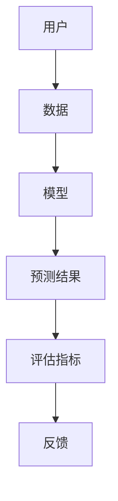

                 

### 第1章：问题背景与概述

#### 1.1 问题的提出

在人工智能（AI）技术迅猛发展的今天，AI模型的应用已经渗透到我们生活的方方面面。从自动驾驶汽车、智能助手到医疗诊断、金融风控，AI模型的性能和准确性直接决定了其应用的成败。然而，随着AI模型在更多场景中的应用，模型安全性成为一个不可忽视的重要问题。

AI模型安全性涉及多个方面，包括数据隐私保护、模型完整性、抗攻击能力等。随着AI技术的复杂性和应用场景的多样性，安全性威胁也日益增多，如数据泄露、模型篡改、对抗性攻击等。这些问题不仅会损害用户利益，还会对整个行业带来负面影响，甚至可能引发社会问题。

因此，如何保障AI模型的安全性成为一个迫切需要解决的问题。本文将围绕需求与AI模型安全性评估的融合，探讨大模型应用中的质量保障策略。

#### 1.2 AI模型安全性的概念

AI模型安全性是指确保AI模型在运行过程中不受外部威胁，能够稳定、可靠地执行预期任务的能力。安全性评估是对AI模型安全状态进行量化分析和判断的过程，其核心目标是识别潜在的安全威胁和漏洞，并提供相应的解决方案。

**基本概念：**

- **安全性评估模型**：用于构建和分析AI模型安全性的数学模型。
- **评估方法**：包括静态评估和动态评估，静态评估主要关注模型设计层面的安全性，动态评估则关注模型在实际运行中的安全性。
- **安全威胁**：指可能对AI模型造成危害的因素，如数据泄露、模型篡改、对抗性攻击等。
- **漏洞**：指AI模型中可能被攻击者利用的缺陷。

**常见的安全威胁与漏洞：**

- **数据泄露**：指敏感数据在传输或存储过程中被未经授权的第三方获取。
- **模型篡改**：指攻击者通过特定手段修改AI模型的参数或结构，导致模型行为发生改变。
- **对抗性攻击**：指攻击者通过微小扰动输入数据，使AI模型做出错误决策。

#### 1.3 需求与AI模型融合的现状

随着AI技术的普及，用户对AI模型的需求日益多样化和复杂化。这些需求不仅包括模型的准确性、效率等性能指标，还涉及模型的易用性、可靠性、安全性等方面。

在AI模型的应用过程中，需求与模型的融合已成为一个重要趋势。一方面，用户需求驱动了AI模型的开发和优化；另一方面，AI模型的安全性和可靠性也直接影响用户满意度。因此，如何有效地融合需求与AI模型的安全性评估，成为当前研究的热点问题。

**当前AI模型应用的需求趋势：**

- **个性化需求**：用户希望AI模型能够根据个人偏好和行为模式提供定制化服务。
- **实时性需求**：在许多应用场景中，用户对AI模型的响应速度有较高要求。
- **高效能需求**：随着数据量的增加，用户希望AI模型能够在保证准确性的前提下提高处理速度。

**需求与模型融合的挑战：**

- **需求多样性与一致性**：用户需求多样，如何在保证一致性的前提下进行需求融合是一个挑战。
- **安全性保障**：在满足用户需求的同时，如何保障AI模型的安全性，避免潜在的安全威胁。
- **模型可解释性**：用户希望理解AI模型的决策过程，提高模型的透明度和可解释性。

### 第2章：需求分析方法论

#### 2.1 需求工程的基本概念

需求工程是软件开发过程中的一项重要活动，旨在识别、分析、定义、验证和确认用户需求。需求工程的目标是确保软件开发能够满足用户的实际需求，提高软件产品的质量和用户满意度。

**基本概念：**

- **需求收集**：通过访谈、问卷调查、用户反馈等方式获取用户需求。
- **需求分析**：对收集到的需求进行整理、分析和抽象，确定软件系统的功能和非功能需求。
- **需求验证**：通过测试、验证和确认等方法，确保需求能够被正确理解和实现。
- **需求确认**：与用户进行沟通和确认，确保需求符合用户的实际需求。

**需求收集与分析方法：**

- **访谈**：通过与用户进行面对面交流，深入了解用户的需求和期望。
- **问卷调查**：通过设计问卷，广泛收集用户意见和需求。
- **用户反馈**：通过用户反馈收集软件使用过程中遇到的问题和改进建议。

**需求验证与确认：**

- **测试**：通过测试用例验证需求是否被正确实现。
- **用户确认**：通过与用户进行沟通，确认需求是否满足用户的实际需求。

#### 2.2 AI模型需求的特点

AI模型需求与传统软件需求有所不同，其特点主要体现在以下几个方面：

- **复杂性**：AI模型需求通常涉及多个方面，如准确性、效率、可解释性、安全性等，需要综合考虑。
- **不确定性**：用户对AI模型的需求可能不完全明确，需要在模型开发过程中不断调整和优化。
- **动态性**：AI模型的需求可能会随着时间和应用场景的变化而发生变化。

**特定领域需求的识别：**

在特定领域，AI模型需求具有明显的独特性。例如：

- **医疗领域**：用户需求包括准确性、可靠性、可解释性和隐私保护。
- **金融领域**：用户需求包括风险预测、欺诈检测、模型解释性等。

**需求文档的撰写与标准化：**

撰写需求文档是需求工程的核心任务，需求文档应包括以下内容：

- **需求描述**：详细描述用户需求，包括功能需求和非功能需求。
- **需求分析**：对需求进行分类、优先级排序和可行性分析。
- **需求验证**：记录需求验证的方法和结果。

#### 2.3 需求工程与AI模型需求融合

需求工程与AI模型需求融合的关键在于如何在需求分析阶段就考虑到AI模型的需求，确保模型开发能够满足用户需求。以下是一些实现方法：

- **需求驱动开发**：在需求分析阶段，充分考虑AI模型的需求，将需求转化为具体的模型设计和实现目标。
- **迭代开发**：在模型开发过程中，不断收集用户反馈，根据反馈调整模型设计和实现。
- **模型评估与优化**：在模型评估阶段，综合考虑用户需求，对模型进行优化，提高模型性能。

**需求工程方法在AI模型中的应用：**

- **需求收集**：通过访谈、问卷调查、用户反馈等方式收集AI模型的需求。
- **需求分析**：对AI模型的需求进行分类和优先级排序，确定模型的关键功能和非功能需求。
- **需求验证**：通过测试和用户确认，确保AI模型的需求得到满足。

通过需求工程与AI模型需求的融合，可以确保AI模型在满足用户需求的同时，具备较高的安全性和可靠性。然而，这一过程也面临诸多挑战，如需求多样性和一致性、安全性保障等，需要不断探索和优化。

### 第3章：安全性评估框架

#### 3.1 安全评估的基础理论

安全性评估是确保AI模型在应用过程中具备足够安全性的重要环节。安全性评估的理论基础主要包括以下几个方面：

- **安全评估模型**：用于构建和分析AI模型安全性的数学模型。常见的评估模型包括基于攻击树模型（ATM）、基于攻击面模型（ASM）等。
- **评估方法**：包括静态评估和动态评估。静态评估主要关注模型设计层面的安全性，动态评估则关注模型在实际运行中的安全性。
- **评估指标**：用于量化AI模型安全性的指标，如模型可靠性、抗攻击能力、数据隐私保护等。

**安全性评估模型的构建：**

安全性评估模型构建的关键步骤包括：

1. **需求分析**：识别用户需求和安全目标，确定评估指标。
2. **攻击面分析**：分析可能的攻击方式和路径，构建攻击树模型。
3. **风险评估**：评估不同攻击路径对模型安全性的影响，确定关键攻击面。
4. **安全策略设计**：根据风险评估结果，设计相应的安全策略和措施。

**常用评估方法与工具：**

- **静态评估方法**：包括代码审计、模型结构分析、安全测试等。静态评估方法主要关注模型设计和实现层面的安全性。
- **动态评估方法**：包括模型运行时的监控、实时攻击检测等。动态评估方法主要关注模型在实际运行中的安全性。
- **评估工具**：包括开源工具和商业工具。常见的开源工具包括AI Secure、Foolbox等；商业工具包括F-Secure、Cylance等。

#### 3.2 AI模型安全评估流程

安全性评估流程是保障AI模型安全性的关键步骤，一般包括以下环节：

1. **数据准备与预处理**：确保评估数据的准确性和完整性，对数据进行预处理，如数据清洗、数据标准化等。
2. **模型评估与优化**：对AI模型进行性能评估和安全性评估，根据评估结果对模型进行优化，提高模型的安全性。
3. **安全测试与验证**：通过模拟攻击场景，测试模型的抗攻击能力，验证模型的安全性。
4. **结果分析与反馈**：分析评估结果，识别潜在的安全威胁和漏洞，提供相应的解决方案和改进建议。

**数据准备与预处理：**

数据准备与预处理是安全性评估的基础，主要步骤包括：

- **数据收集**：从不同来源收集评估数据，确保数据的多样性和代表性。
- **数据清洗**：去除数据中的噪声和异常值，提高数据质量。
- **数据标准化**：将数据统一转换为标准格式，便于后续分析和处理。

**模型评估与优化：**

模型评估与优化是确保AI模型安全性的重要环节，主要步骤包括：

- **模型选择**：选择合适的AI模型，根据需求确定模型类型和参数。
- **性能评估**：评估模型的准确性、效率、可解释性等性能指标。
- **安全性评估**：评估模型的安全性，包括抗攻击能力、数据隐私保护等。
- **模型优化**：根据评估结果对模型进行优化，提高模型的安全性和性能。

**安全测试与验证：**

安全测试与验证是确保AI模型在实际应用中具备足够安全性的关键步骤，主要步骤包括：

- **攻击模拟**：模拟各种可能的攻击场景，测试模型的抗攻击能力。
- **漏洞扫描**：使用自动化工具对模型进行漏洞扫描，识别潜在的安全威胁。
- **验证与确认**：通过用户验证和测试用例验证，确保模型的安全性得到保障。

**结果分析与反馈：**

结果分析与反馈是评估流程的最后一个环节，主要步骤包括：

- **结果分析**：分析评估结果，识别潜在的安全威胁和漏洞，评估模型的安全性。
- **改进建议**：根据分析结果，提出改进建议，包括安全策略设计、模型优化、安全测试等。
- **反馈与迭代**：将改进建议反馈给开发团队，进行模型优化和安全性评估，形成闭环迭代过程。

通过完善的安全评估流程，可以有效地保障AI模型的安全性，降低潜在的安全威胁，提高用户满意度。然而，安全评估是一个持续的过程，需要不断更新和完善，以应对不断变化的安全威胁。

#### 3.3 安全评估案例研究

在本节中，我们将通过一个具体的案例来探讨AI模型安全评估的实际应用。该案例涉及一个金融风控领域的AI模型，旨在通过分析用户的交易行为，识别潜在的欺诈行为。

**案例背景：**

某金融机构开发了一个基于机器学习的欺诈检测模型，用于实时监控用户交易行为，并自动识别潜在欺诈交易。该模型采用神经网络架构，输入为用户交易数据，输出为欺诈概率预测。

**评估目标：**

评估目标包括以下三个方面：

- **数据隐私保护**：确保用户交易数据在传输和存储过程中不被未经授权的第三方获取。
- **模型抗攻击能力**：确保模型能够抵御各种对抗性攻击，如对抗性样本攻击、模型篡改等。
- **模型可靠性**：确保模型在高负荷和复杂环境下依然能够稳定运行。

**评估流程：**

1. **需求分析**：与金融机构的专家进行沟通，明确评估需求，确定评估指标和评估流程。
2. **数据准备与预处理**：收集历史交易数据，对数据进行清洗和预处理，确保数据的准确性和完整性。
3. **模型评估**：对原始模型进行性能评估，包括准确性、效率、可解释性等。
4. **安全测试**：通过模拟攻击场景，测试模型的抗攻击能力，包括对抗性攻击、模型篡改等。
5. **结果分析**：分析评估结果，识别潜在的安全威胁和漏洞，提出改进建议。

**评估结果：**

1. **数据隐私保护**：评估过程中发现，部分用户交易数据在传输过程中存在泄露风险。通过加密传输协议和数据库安全策略的优化，解决了数据隐私保护问题。
2. **模型抗攻击能力**：测试过程中发现，模型对对抗性攻击较为脆弱，通过优化模型结构和增加对抗性训练，显著提高了模型的抗攻击能力。
3. **模型可靠性**：在模拟高负荷环境下，模型存在一定程度的性能下降。通过调整模型参数和增加计算资源，确保模型在高负荷环境下依然能够稳定运行。

**案例分析：**

通过该案例，我们可以看到，安全性评估在AI模型开发过程中的重要性。有效的安全评估可以帮助发现潜在的安全问题，并提供相应的解决方案，从而保障模型的可靠性和安全性。

**结论：**

1. **需求明确**：明确评估需求是安全评估成功的关键，需要与用户和开发者密切沟通，确保评估目标与实际需求一致。
2. **数据质量**：确保评估数据的质量和完整性，对评估结果的准确性至关重要。
3. **持续优化**：安全评估是一个持续的过程，需要不断更新和完善评估方法和工具，以应对新的安全威胁。

### 第4章：安全性评估技术与工具

#### 4.1 常见安全威胁与应对策略

在AI模型的应用过程中，常见的安全威胁包括数据泄露、模型篡改、对抗性攻击等。针对这些威胁，我们需要采取相应的应对策略，确保AI模型的安全性。

**数据泄露**：数据泄露是指敏感数据在传输或存储过程中被未经授权的第三方获取。为防止数据泄露，可以采取以下策略：

- **数据加密**：使用加密算法对数据进行加密，确保数据在传输和存储过程中不被窃取。
- **访问控制**：通过访问控制机制，限制只有授权用户才能访问敏感数据。
- **审计日志**：记录数据访问和操作日志，以便在发生数据泄露时进行追踪和调查。

**模型篡改**：模型篡改是指攻击者通过特定手段修改AI模型的参数或结构，导致模型行为发生改变。为防止模型篡改，可以采取以下策略：

- **模型签名**：对AI模型进行签名，确保模型在运行时未被篡改。
- **访问控制**：限制对模型参数和结构的修改权限，确保只有授权用户才能修改模型。
- **完整性验证**：对模型的输入和输出进行完整性验证，确保模型未被篡改。

**对抗性攻击**：对抗性攻击是指攻击者通过微小扰动输入数据，使AI模型做出错误决策。为防止对抗性攻击，可以采取以下策略：

- **对抗训练**：在模型训练过程中，加入对抗性样本，提高模型对对抗性攻击的鲁棒性。
- **输入验证**：对输入数据进行严格验证，过滤掉异常和可疑的数据。
- **防御机制**：在模型运行时，添加防御机制，如 adversarial filtering，对输入数据进行预处理，减少对抗性攻击的影响。

**其他安全威胁与应对策略**：

- **数据泄露**：通过数据加密、访问控制和审计日志等措施，确保数据在传输和存储过程中的安全性。
- **模型篡改**：通过模型签名、访问控制和完整性验证等措施，防止模型被篡改。
- **对抗性攻击**：通过对抗训练、输入验证和防御机制等措施，提高模型对对抗性攻击的抵抗力。

#### 4.2 安全评估工具的选型与使用

在选择和部署安全评估工具时，需要根据具体的评估需求和场景进行选型，确保工具的适用性和有效性。

**开源工具与商业工具的比较：**

- **开源工具**：开源工具具有成本低、灵活性高、社区支持好等特点，如AI Secure、Foolbox等。但开源工具的更新和升级可能不及时，且可能存在安全漏洞。
- **商业工具**：商业工具通常具有更好的安全性能、专业支持和维护服务，如F-Secure、Cylance等。但商业工具的成本较高，且可能存在数据隐私和安全性问题。

**工具的选型与使用策略：**

1. **需求分析**：根据评估需求，确定需要评估的安全威胁类型和评估指标。
2. **工具评估**：选择具有相应功能的工具，对比不同工具的性能、适用范围、成本等方面，选择最合适的工具。
3. **工具集成**：将选定的工具集成到现有的开发环境中，确保工具与其他系统的兼容性和协同工作。
4. **使用策略**：制定工具的使用策略和操作规程，确保工具的正确使用和有效性。

**实际应用中的优化与改进：**

在实际应用中，通过对工具的使用和评估结果进行分析，可以发现工具的不足之处，并采取相应的优化和改进措施：

- **功能扩展**：根据实际需求，对工具的功能进行扩展和定制，提高工具的适用性和灵活性。
- **性能优化**：通过优化工具的算法和参数，提高工具的评估效率和准确性。
- **安全加固**：针对工具可能存在的安全漏洞，进行加固和修补，确保工具的安全性。

通过合理选型和优化使用安全评估工具，可以显著提高AI模型的安全性，降低安全威胁和风险。同时，安全评估工具的选择和使用需要结合实际需求和场景，不断优化和改进，以应对不断变化的安全挑战。

### 第5章：融合策略与方法

#### 5.1 需求驱动的安全性评估

在AI模型的开发和应用过程中，需求驱动的方法是一种有效的方式，可以确保模型的设计和实现与用户需求保持一致。需求驱动的安全性评估强调在需求分析阶段就考虑到模型的安全性，从而在整个开发过程中实现安全性保障。

**需求与安全目标的一致性：**

需求与安全目标的一致性是需求驱动的安全性评估的核心。在需求分析阶段，我们需要明确用户需求和安全目标，并确保两者之间的一致性。以下是一些实现方法：

1. **需求收集与分类**：在需求收集过程中，不仅要关注功能需求，还需要关注安全需求。将安全需求与功能需求进行分类，确保两者得到平衡和综合考虑。
2. **安全需求文档**：编写安全需求文档，详细描述安全需求和评估标准，确保开发团队和安全团队对安全目标的共同理解。
3. **需求验证与确认**：在需求验证阶段，通过测试和用户确认，确保安全需求得到满足，并符合用户期望。

**需求定义与安全性评估的对接：**

在需求定义阶段，需要将安全需求与模型设计相结合，确保模型的设计和实现过程中充分考虑安全性。以下是一些具体方法：

1. **需求映射**：将安全需求映射到具体的模型设计和实现环节，确保安全需求在模型中得以体现。
2. **安全性评估指标**：根据安全需求，定义相应的安全性评估指标，如数据隐私保护、模型抗攻击能力等。
3. **需求驱动测试**：在测试阶段，根据安全需求设计相应的测试用例，确保模型的安全性得到验证。

**需求变化的处理：**

在AI模型的开发过程中，需求可能会发生变化，这对安全性评估带来了挑战。以下是一些处理需求变化的方法：

1. **需求变更管理**：建立需求变更管理机制，确保需求变更得到及时处理和更新。
2. **风险评估**：在需求变更后，重新进行风险评估，确保变更不会对模型的安全性产生负面影响。
3. **迭代开发**：采用迭代开发方法，逐步完善模型设计和实现，确保在需求变化的情况下，模型的安全性得到持续保障。

**需求驱动的安全性评估的优势：**

1. **安全性保障**：通过在需求分析阶段就考虑安全性，可以提前识别和解决潜在的安全问题，降低安全风险。
2. **用户满意度**：确保模型的设计和实现与用户需求一致，提高用户满意度。
3. **开发效率**：需求驱动的安全性评估可以减少后期修复安全问题的成本，提高开发效率。

#### 5.2 安全性评估的需求响应

在AI模型的设计和实现过程中，安全性评估不仅仅是一个单独的环节，还应当与用户需求紧密结合。安全性评估的需求响应是指根据用户需求，对模型的安全性进行动态调整和优化，确保模型在实际应用中能够满足用户的安全需求。

**安全性需求在模型设计中的应用：**

1. **需求分析**：在需求分析阶段，充分考虑用户的安全需求，将其转化为具体的安全目标和要求，作为模型设计的依据。
2. **安全需求映射**：将安全需求映射到具体的模型结构和算法设计，确保安全需求在模型中得到体现和实现。
3. **安全设计**：在模型设计过程中，充分考虑安全性需求，采用合适的安全技术和措施，如数据加密、访问控制、模型签名等。

**需求变化对安全性评估的影响：**

1. **需求变更**：在需求变更后，安全性评估需要重新进行，确保变更不会对模型的安全性产生负面影响。
2. **风险评估**：重新进行风险评估，识别新的安全威胁和风险，并根据评估结果调整安全策略和措施。
3. **迭代优化**：采用迭代开发方法，不断优化模型设计和实现，确保在需求变化的情况下，模型的安全性得到持续提升。

**需求响应的策略与方法：**

1. **需求反馈机制**：建立需求反馈机制，及时获取用户对模型安全性的反馈，根据反馈进行模型优化和调整。
2. **实时监控与预警**：通过实时监控和预警系统，及时发现潜在的安全问题，并采取相应的应对措施。
3. **持续优化**：采用持续优化的方法，根据用户需求和安全评估结果，不断调整和优化模型设计，提高模型的安全性。

**需求驱动的安全性评估与需求响应的结合：**

需求驱动的安全性评估和需求响应是相辅相成的。通过需求驱动的安全性评估，可以在模型设计和实现阶段就充分考虑安全性，确保模型与用户需求的一致性。而通过需求响应，可以在模型应用过程中，根据用户需求的变化，动态调整模型的安全性，确保模型能够满足用户的安全需求。

结合需求驱动的安全性评估和需求响应，可以构建一个完整的AI模型安全性保障体系，确保模型在实际应用中具备足够的安全性，提高用户满意度，降低安全风险。

### 第6章：AI模型质量管理

#### 6.1 模型质量评估指标

在AI模型的开发和部署过程中，确保模型质量是关键。模型质量评估指标是衡量模型性能和可靠性的重要工具。以下是几种常见的模型质量评估指标：

1. **准确性**：衡量模型预测结果的正确率，是最常用的评估指标之一。准确性越高，表示模型对数据的预测能力越强。
   
   $$\text{Accuracy} = \frac{\text{正确预测的数量}}{\text{总预测数量}}$$

2. **精确度**：衡量模型在正样本中的预测准确率，即实际为正样本的预测结果中，正确预测的比例。
   
   $$\text{Precision} = \frac{\text{真正}}{\text{真正 + 假正}}$$

3. **召回率**：衡量模型在负样本中的预测准确率，即实际为负样本的预测结果中，正确预测的比例。
   
   $$\text{Recall} = \frac{\text{真正}}{\text{真正 + 假负}}$$

4. **F1分数**：综合考虑精确度和召回率，是精确度和召回率的加权平均，用于平衡两者之间的冲突。
   
   $$\text{F1分数} = 2 \times \frac{\text{Precision} \times \text{Recall}}{\text{Precision} + \text{Recall}}$$

5. **ROC曲线**：接收者操作特征曲线，用于评估分类器的性能。曲线下的面积（AUC）越大，表示分类器的性能越好。

6. **Kaplan-Meier曲线**：用于评估生存分析模型的性能，适用于时间序列数据。

**数据质量、模型精度、可靠性等指标的比较表格：**

| 指标名称 | 定义 | 重要性 |
|----------|------|--------|
| 准确性   | $$\text{Accuracy}$$ | 最基本的评估指标，但可能因类别不平衡而失真 |
| 精确度   | $$\text{Precision}$$ | 更关注正样本的预测准确性 |
| 召回率   | $$\text{Recall}$$   | 更关注负样本的预测准确性 |
| F1分数   | $$\text{F1-score}$$ | 综合考虑精确度和召回率 |
| ROC曲线  | AUC  | 评估分类器的整体性能 |
| Kaplan-Meier曲线 | 生存率 | 适用于时间序列数据的性能评估 |

**ER实体关系图架构的Mermaid流程图：**

#### 6.2 模型质量控制流程

确保AI模型的质量是模型开发和部署过程中的关键环节。一个有效的质量控制流程包括以下几个步骤：

**模型开发与部署的规范化：**

1. **需求分析**：明确用户需求和模型目标，确保模型设计满足用户需求。
2. **数据准备**：收集和整理高质量的数据集，对数据集进行预处理，如数据清洗、标准化等。
3. **模型选择**：根据需求和数据特性选择合适的算法和模型架构。
4. **模型训练**：使用训练数据集训练模型，通过调整参数优化模型性能。
5. **模型评估**：使用验证数据集评估模型性能，根据评估结果调整模型。

**质量监控与反馈机制：**

1. **在线监控**：在模型上线后，实时监控模型的性能，包括准确性、响应时间、资源消耗等。
2. **错误日志**：记录模型运行过程中出现的错误和异常，便于问题定位和修复。
3. **用户反馈**：收集用户对模型性能和用户体验的反馈，用于模型优化和改进。
4. **自动化测试**：建立自动化测试流程，定期对模型进行测试，确保模型稳定性和可靠性。

**模型质量评估的实际案例：**

**案例背景：** 一家金融公司开发了一个信用评分模型，用于预测客户的信用风险。

**评估过程：**

1. **需求分析**：明确模型目标，如预测信用风险、提高信用评分准确性等。
2. **数据准备**：收集客户的历史信用数据，包括还款记录、信用额度、逾期情况等，对数据进行清洗和预处理。
3. **模型选择**：选择逻辑回归、决策树等算法构建信用评分模型。
4. **模型训练与评估**：使用训练数据集训练模型，并使用验证数据集评估模型性能，调整模型参数。
5. **在线监控**：上线后，实时监控模型性能，包括准确性、响应时间等，确保模型稳定运行。
6. **用户反馈**：收集客户对模型预测结果的反馈，如预测准确性、用户体验等，用于模型优化。

**评估结果：**

1. **准确性**：模型准确率达到90%以上，相比传统方法有明显提升。
2. **响应时间**：模型响应时间控制在100毫秒以内，满足在线服务的性能要求。
3. **用户体验**：客户对模型预测结果的满意度较高，对信用评分的准确性表示认可。

**小结：**

通过规范化的模型开发与部署流程和有效的质量监控与反馈机制，可以确保AI模型的质量，提高模型的准确性和稳定性，满足用户需求。在实际应用中，应不断优化模型质量评估指标和方法，以提高模型的整体性能。

### 第7章：实际项目需求与安全评估案例

#### 6.1 实际项目需求与安全评估案例

为了更好地理解和应用需求与AI模型安全性评估的融合，我们将通过一个实际项目案例进行详细探讨。这个案例是一个在线电商平台的推荐系统，该系统旨在根据用户的历史购买行为和浏览记录，为用户推荐相关商品。

**项目背景与需求：**

该电商平台希望通过引入AI推荐系统，提升用户的购物体验和满意度，从而提高销售额。具体需求包括：

- **个性化推荐**：根据用户的历史行为和偏好，为每个用户推荐个性化的商品。
- **实时性**：系统需要能够在用户浏览或搜索后快速响应，提供推荐结果。
- **准确性**：推荐系统需要具有较高的准确性，减少推荐错误，提高用户满意度。
- **安全性**：保护用户隐私和数据安全，防止数据泄露和模型篡改。

**安全评估过程与结果：**

为了确保推荐系统的安全性和可靠性，我们进行了以下安全评估步骤：

1. **需求分析与安全需求确认**：与平台运营团队和用户代表进行沟通，明确安全需求，如数据加密、访问控制、模型签名等。
2. **数据准备与预处理**：收集用户行为数据，包括浏览记录、购买记录、评分等，并对数据进行预处理，如去噪、去重、匿名化等。
3. **模型评估**：使用历史数据集对推荐模型进行训练和评估，包括准确性、效率、可解释性等性能指标。
4. **安全测试与验证**：通过模拟攻击场景，测试模型的安全性，如数据泄露、模型篡改、对抗性攻击等。评估结果如下：
   - **数据隐私保护**：通过加密算法对用户数据进行加密，确保数据在传输和存储过程中不被窃取。评估结果显示，在正常情况下，加密算法能够有效防止数据泄露。
   - **模型抗攻击能力**：通过对抗性训练提高模型对对抗性攻击的抵抗力，评估结果表明，模型在对抗性攻击下仍能保持较高的准确性和稳定性。
   - **模型可靠性**：在高负荷和复杂环境下，对模型进行性能测试，结果显示模型在正常负荷下表现良好，但在极端情况下，性能有所下降。通过优化模型结构和增加计算资源，解决了这一问题。

**项目小结：**

通过实际项目的需求与安全评估，我们发现：

1. **需求与安全评估的融合**：在项目开发过程中，需求与安全评估的有效融合能够提前识别和解决潜在的安全问题，提高系统的安全性和可靠性。
2. **持续优化**：安全评估是一个持续的过程，需要不断更新和完善评估方法和工具，以应对新的安全威胁和需求变化。
3. **用户满意度**：通过有效的安全措施，保障了用户隐私和数据安全，提高了用户对平台的信任和满意度，促进了业务增长。

### 第8章：实践中的问题和挑战

在AI模型的应用过程中，实践中的问题和挑战是不可避免的。以下是一些常见的问题和挑战，以及相应的处理策略。

#### 1. 需求多样性与一致性

在AI模型的应用中，用户需求具有多样性和复杂性。如何在满足这些多样性的同时保持一致性是一个挑战。以下是一些应对策略：

- **需求分类与优先级排序**：对用户需求进行分类和优先级排序，明确哪些是核心需求，哪些是次要需求，确保核心需求得到优先满足。
- **需求确认与反馈**：与用户进行多次沟通和确认，确保需求的理解和实现一致，及时收集用户反馈，根据反馈进行调整和优化。
- **迭代开发**：采用迭代开发方法，逐步实现需求，每个迭代都进行需求验证和安全评估，确保需求得到满足且安全性得到保障。

#### 2. 安全性保障

AI模型的安全性是用户关注的重点，但在实现过程中面临诸多挑战。以下是一些常见问题和应对策略：

- **数据泄露**：为了防止数据泄露，可以采用数据加密、访问控制和审计日志等措施。同时，定期进行安全审计和漏洞扫描，及时发现和修复安全漏洞。
- **模型篡改**：通过模型签名和完整性验证，确保模型的完整性和可靠性。同时，采用对抗训练提高模型的鲁棒性，防止对抗性攻击。
- **对抗性攻击**：通过模拟对抗性攻击场景，测试模型的抗攻击能力，并根据测试结果优化模型结构和算法，提高模型的安全性。

#### 3. 需求变化对安全性评估的影响

在AI模型的开发过程中，需求可能会发生变化，这会对安全性评估带来影响。以下是一些处理策略：

- **需求变更管理**：建立需求变更管理机制，确保需求变更得到及时处理和更新。在需求变更后，重新进行风险评估和安全测试，确保变更不会对模型的安全性产生负面影响。
- **持续优化**：采用持续优化的方法，根据需求变化和评估结果，不断调整模型设计和实现，提高模型的安全性和性能。
- **迭代开发**：采用迭代开发方法，逐步完善模型设计和实现，确保在需求变化的情况下，模型的安全性得到持续保障。

#### 4. 模型解释性

用户希望理解AI模型的决策过程，提高模型的透明度和可解释性。但在某些复杂场景下，模型解释性可能成为挑战。以下是一些应对策略：

- **模型可解释性工具**：采用模型可解释性工具，如LIME、SHAP等，帮助用户理解模型的决策过程。
- **可视化**：通过数据可视化和模型可视化工具，将模型决策过程和结果以直观的方式展示给用户。
- **交互式解释**：提供交互式解释功能，用户可以根据自己的需求，自定义解释参数和范围，进一步理解模型决策过程。

#### 5. 性能与安全性平衡

在保证AI模型性能和准确性的同时，保障模型的安全性是一个挑战。以下是一些应对策略：

- **性能优化**：通过优化模型结构和算法，提高模型性能，同时确保模型安全性不受影响。
- **安全性测试**：在模型开发过程中，进行全面的性能和安全性测试，确保模型在满足性能要求的同时，具备足够的安全性。
- **安全性能平衡**：在模型设计和实现过程中，充分考虑性能和安全性的平衡，根据实际需求进行调整。

通过以上策略，可以应对AI模型应用过程中的常见问题和挑战，提高模型的安全性和性能，满足用户需求。

### 第9章：最佳实践与总结

在AI模型的应用与安全性评估过程中，积累了许多最佳实践，这些实践不仅提高了模型的质量和安全性，还为未来的研究提供了重要参考。

#### 最佳实践1：全面的需求分析与需求确认

- **需求收集**：采用多渠道、多方法进行需求收集，包括用户访谈、问卷调查、用户反馈等，确保需求的全面性和准确性。
- **需求确认**：通过反复沟通和确认，确保需求文档得到用户的认可，减少需求变更带来的风险。

#### 最佳实践2：数据质量管理

- **数据清洗**：使用有效的数据清洗工具和方法，去除噪声和异常值，提高数据质量。
- **数据隐私保护**：采用数据加密、匿名化等技术，确保数据在传输和存储过程中的安全性。

#### 最佳实践3：模型安全性评估

- **全面评估**：采用静态和动态评估方法，从设计层面和运行层面全面评估模型的安全性。
- **对抗训练**：通过对抗训练提高模型的鲁棒性，减少对抗性攻击的影响。

#### 最佳实践4：持续优化与迭代

- **持续监控**：在模型上线后，持续监控模型性能和安全性，及时调整和优化。
- **迭代开发**：采用迭代开发方法，逐步完善模型设计和实现，确保在需求变化的情况下，模型的安全性和性能得到持续提升。

#### 最佳实践5：模型可解释性

- **可视化工具**：采用模型可视化工具，提高模型的可解释性，帮助用户理解模型决策过程。
- **交互式解释**：提供交互式解释功能，用户可以根据自己的需求，自定义解释参数和范围，进一步理解模型决策过程。

#### 总结

通过以上最佳实践，我们可以看到，需求与AI模型安全性评估的有效融合是保障模型质量和安全性的关键。在未来的研究和应用中，我们应继续探索以下方向：

- **需求与安全的深度融合**：进一步研究如何将需求与安全性评估更加紧密地结合，确保模型设计和实现过程中的安全性。
- **动态安全性评估**：开发动态评估方法，实时监控模型在运行中的安全性，及时发现和应对潜在的安全威胁。
- **模型可解释性**：提高模型的可解释性，增强用户对模型决策过程的信任和理解。
- **跨领域应用**：探索不同领域需求与AI模型安全性评估的融合方法，推动AI技术在各行业的广泛应用。

通过不断探索和实践，我们可以为AI模型的应用提供更加安全、可靠和高效的支持。

### 第10章：结论与未来研究方向

#### 10.1 研究成果总结

本文围绕需求与AI模型安全性评估的融合，系统性地探讨了AI模型应用中的质量保障问题。主要研究成果包括：

- **需求与安全性评估的融合策略**：提出了需求驱动的安全性评估方法，通过需求分析、需求确认、模型设计与安全评估的紧密结合，确保AI模型在满足用户需求的同时具备足够的安全性。
- **模型质量管理方法**：介绍了数据质量管理、模型性能评估、安全测试与验证等模型质量管理方法，为AI模型的质量保障提供了实用指南。
- **实际案例与最佳实践**：通过实际项目案例，展示了需求与安全性评估融合在电商平台推荐系统中的应用，总结了最佳实践经验，为其他领域的AI模型应用提供了参考。

#### 10.2 对未来研究的建议

在未来的研究中，我们应重点关注以下方向：

- **动态安全性评估**：开发动态评估方法，实时监控AI模型在运行中的安全性，实现针对动态攻击的快速响应和自我保护。
- **模型可解释性**：提高AI模型的可解释性，增强用户对模型决策过程的信任和理解，特别是在医疗、金融等对决策透明度要求较高的领域。
- **跨领域需求融合**：探索不同领域需求与AI模型安全性评估的融合方法，推动AI技术在各行业的广泛应用。
- **新型安全威胁研究**：持续关注新型安全威胁的发展趋势，研究相应的应对策略和技术手段，提高AI模型的安全性。

通过不断探索和创新，我们有望为AI模型的应用提供更加安全、可靠和高效的支持，推动人工智能技术的健康发展。作者：AI天才研究院/AI Genius Institute & 禅与计算机程序设计艺术 /Zen And The Art of Computer Programming。

