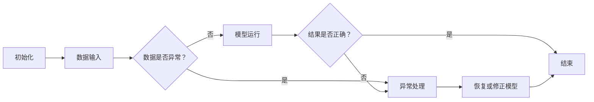
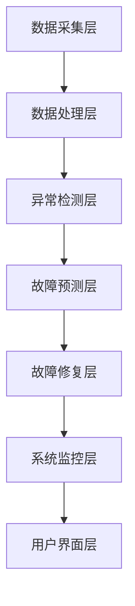
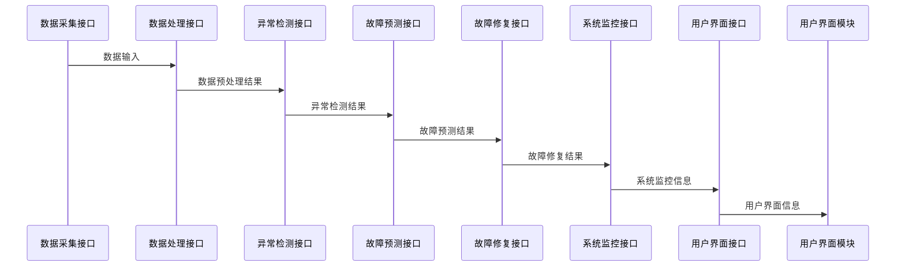

                 


### 引言：需求与AI模型容错机制的重要性

#### 需求背景

随着人工智能技术的快速发展，AI模型在各个领域中的应用越来越广泛。从智能客服、自动驾驶、医疗诊断到金融风险控制等，AI模型正成为推动社会进步和产业升级的重要力量。然而，随着模型复杂度的增加和应用场景的多样化，如何确保AI模型的稳定性和可靠性成为了一个亟待解决的问题。

当前，AI模型在实际应用中面临诸多挑战。一方面，AI模型在训练过程中容易过拟合或欠拟合，导致在真实环境中的表现不佳。另一方面，AI模型对数据的依赖性很强，一旦输入数据出现异常，模型可能产生错误的预测结果。此外，AI模型在实际应用中可能遇到各种异常情况，如硬件故障、网络中断等，这些都会影响模型的正常运行。因此，设计并实现有效的AI模型容错机制，以提升AI应用的稳定性和可靠性，成为当前人工智能研究的重要方向。

#### 问题描述

AI模型在复杂环境下的不稳定性和潜在错误，可能带来严重后果。例如，自动驾驶汽车在遇到突发情况时，如果AI模型无法正确识别和处理，可能导致交通事故；智能医疗诊断系统在诊断过程中，如果AI模型出现错误，可能对患者的健康产生严重影响。此外，AI模型在金融领域的应用，如信用评分、风险控制等，一旦出现错误，可能导致经济损失和信用危机。因此，研究AI模型容错机制，确保其在各种复杂环境下的稳定性和可靠性，具有重要的实际意义。

#### 问题解决

为了解决上述问题，需要设计并实现AI模型容错机制。容错机制是一种能够在系统出现故障时，自动检测、诊断和恢复的系统设计方法。在AI模型中引入容错机制，可以通过以下几种方式提升模型的稳定性和可靠性：

1. **模型错误检测**：通过设置阈值和异常检测算法，实时监测AI模型的输出结果，一旦发现异常，立即触发容错机制。
2. **模型错误诊断**：对AI模型进行错误诊断，分析错误的原因，是数据问题、算法问题还是硬件问题等。
3. **模型错误恢复**：根据错误诊断的结果，采取相应的恢复措施，如重新训练模型、更换数据源或修复硬件故障等。
4. **模型错误修正**：通过修正算法或参数，使AI模型能够恢复正常的输出。

通过这些措施，可以有效地降低AI模型在复杂环境下的错误率，提高其在各种应用场景中的稳定性和可靠性。

#### 边界与外延

虽然AI模型容错机制在提升模型稳定性方面具有重要意义，但需要明确其适用范围和边界。以下是一些需要考虑的边界与外延：

1. **容错机制适用范围**：并非所有的AI模型都适合引入容错机制。对于一些简单、稳定的模型，如线性回归、逻辑回归等，引入容错机制可能过于复杂，反而影响模型的性能。因此，需要根据具体应用场景和模型特点，选择合适的容错机制。
2. **容错机制效果评估**：引入容错机制后，需要对其效果进行评估。可以通过模拟不同的异常情况和实际应用场景，评估容错机制的检测、诊断和恢复能力。同时，还需要考虑容错机制对模型性能的影响，确保在提高稳定性的同时，不降低模型的准确性。
3. **容错机制与数据质量**：AI模型的稳定性很大程度上依赖于输入数据的质量。因此，在引入容错机制的同时，需要关注数据质量问题，确保输入数据的真实性和可靠性。
4. **容错机制与硬件环境**：AI模型的运行依赖于硬件环境，如CPU、GPU等。因此，在设计和实现容错机制时，需要考虑硬件故障、网络中断等异常情况，确保系统能够在不利环境下正常运行。

通过明确AI模型容错机制的边界与外延，可以更好地发挥其作用，提高AI应用的稳定性和可靠性。

### 核心概念与联系

#### AI模型容错机制的定义

AI模型容错机制是一种在AI模型出现错误或异常时，能够自动检测、诊断和恢复的系统设计方法。其核心目的是确保AI模型在各种复杂环境下的稳定性和可靠性。

具体来说，AI模型容错机制包括以下几个关键组成部分：

1. **错误检测**：通过设置阈值和异常检测算法，实时监测AI模型的输出结果，一旦发现异常，立即触发容错机制。
2. **错误诊断**：对AI模型进行错误诊断，分析错误的原因，是数据问题、算法问题还是硬件问题等。
3. **错误恢复**：根据错误诊断的结果，采取相应的恢复措施，如重新训练模型、更换数据源或修复硬件故障等。
4. **错误修正**：通过修正算法或参数，使AI模型能够恢复正常的输出。

#### 概念属性特征对比表格

为了更好地理解AI模型容错机制，我们可以将其与其他常见的AI应用方法进行对比。以下是一个简化的概念属性特征对比表格：

| 概念 | 定义 | 关键特性 | 应用场景 |
| --- | --- | --- | --- |
| AI模型容错机制 | 一种在AI模型出现错误或异常时，能够自动检测、诊断和恢复的系统设计方法 | 检测、诊断、恢复 | 复杂、多变的应用场景 |
| 神经网络 | 一种基于生物神经网络原理的机器学习模型 | 层级结构、非线性变换 | 图像识别、自然语言处理等 |
| 决策树 | 一种基于树形结构的分类和回归模型 | 直观、易于解释 | 数据挖掘、分类问题 |
| 集成学习 | 将多个基本模型集成在一起，提高整体性能的方法 | 误差纠正、多样性 | 复杂、不确定的应用场景 |
| 强化学习 | 一种通过与环境交互，学习最优策略的机器学习方法 | 自主性、适应性 | 游戏控制、推荐系统等 |

通过对比可以看出，AI模型容错机制与其他AI应用方法相比，更注重模型的稳定性和可靠性。其关键特性在于能够检测、诊断和恢复模型错误，从而确保模型在各种复杂环境下的正常运行。

#### ER实体关系图架构

为了更清晰地展示AI模型容错机制的实体关系，我们可以使用Mermaid绘制一个简单的ER实体关系图。以下是一个示例：

```mermaid
erDiagram
  ModelError -> DetectionSystem
  ModelError -> DiagnosisSystem
  ModelError -> RecoverySystem
  DetectionSystem -> Model
  DiagnosisSystem -> ModelError
  RecoverySystem -> ModelError
```

在这个ER实体关系图中，`ModelError`表示AI模型出现的错误，`DetectionSystem`表示错误检测系统，`DiagnosisSystem`表示错误诊断系统，`RecoverySystem`表示错误恢复系统。这些实体之间通过关联关系相互连接，共同构成了AI模型容错机制的架构。

通过引入AI模型容错机制，我们可以有效地提高AI模型的稳定性和可靠性，为各种复杂应用场景提供可靠的支持。

### AI模型错误类型分析

在讨论AI模型容错机制之前，有必要首先了解AI模型可能出现的各种错误类型及其对模型性能和实际应用的影响。AI模型的错误类型多种多样，主要包括以下几种：

#### 过拟合

过拟合是指AI模型在训练数据上表现良好，但在测试数据或实际应用中表现不佳的现象。过拟合的原因通常是由于模型过于复杂，对训练数据中的噪声和异常特征进行了过度学习。这导致模型在测试数据或实际应用中无法泛化，从而出现错误。

**影响分析**：

过拟合对AI模型性能的影响主要体现在准确率和泛化能力上。当模型发生过拟合时，其准确率通常在训练数据上很高，但在测试数据上显著下降。此外，过拟合还会降低模型的泛化能力，使其在新的、未见过的数据上表现不佳。

为了降低过拟合的风险，常用的方法包括：

1. **正则化**：在模型训练过程中引入正则化项，限制模型参数的规模，从而避免模型过度复杂。
2. **数据增强**：通过增加训练数据的多样性，提高模型的泛化能力。
3. **交叉验证**：使用交叉验证方法评估模型的泛化能力，选择泛化性能较好的模型。

#### 欠拟合

欠拟合是指AI模型在训练数据和测试数据上表现都不理想的现象。欠拟合的原因通常是由于模型过于简单，无法捕捉到训练数据中的关键特征和关系。

**影响分析**：

欠拟合对AI模型性能的影响主要体现在准确率和拟合能力上。当模型发生欠拟合时，其准确率通常在训练数据和测试数据上都很低。此外，欠拟合还会导致模型无法很好地拟合训练数据，从而在测试数据上表现不佳。

为了解决欠拟合问题，可以采取以下方法：

1. **增加模型复杂度**：通过增加模型的层数、神经元数量等，使模型能够捕捉到更多的特征和关系。
2. **调整超参数**：通过调整学习率、批次大小等超参数，优化模型的训练过程。
3. **特征工程**：通过引入新的特征或对现有特征进行变换，提高模型的拟合能力。

#### 数据偏斜

数据偏斜是指训练数据中不同类别的样本数量不均衡，导致模型在预测时对某些类别的样本处理不足。

**影响分析**：

数据偏斜对AI模型性能的影响主要体现在分类准确率和模型公平性上。当训练数据中某些类别的样本数量远多于其他类别时，模型可能对少数类别出现“倾斜”，导致预测结果偏向多数类别。这不仅会影响模型的准确率，还会损害模型的公平性。

为了解决数据偏斜问题，可以采取以下方法：

1. **重采样**：通过增加少数类别的样本数量或减少多数类别的样本数量，使训练数据中各类别的样本数量均衡。
2. **加权损失函数**：在模型训练过程中，对少数类别的样本赋予更高的权重，以降低模型对多数类别的偏好。
3. **集成学习**：使用集成学习方法，结合多个模型对样本进行分类，提高模型的鲁棒性和公平性。

#### 硬件故障

硬件故障是指AI模型在运行过程中，由于硬件设备故障或网络中断等原因导致的错误。

**影响分析**：

硬件故障对AI模型性能的影响主要体现在模型的稳定性和可靠性上。当硬件设备出现故障或网络中断时，模型可能无法正常运行，导致预测结果错误。此外，硬件故障还会影响模型的训练效率，延长训练时间。

为了解决硬件故障问题，可以采取以下方法：

1. **冗余设计**：通过增加硬件设备的冗余，确保在某一设备出现故障时，其他设备能够接替其工作，保证系统的正常运行。
2. **数据备份**：在模型训练过程中，定期备份训练数据和模型参数，以便在发生故障时快速恢复。
3. **网络监控**：实时监控网络状态，一旦发现网络中断，立即进行网络恢复，确保模型的正常运行。

综上所述，了解AI模型可能出现的各种错误类型及其影响，对于设计有效的AI模型容错机制具有重要意义。通过分析不同错误类型的特征和影响，可以更好地应对各种异常情况，提高AI模型的稳定性和可靠性。

### AI模型容错机制设计

在设计AI模型容错机制时，需要遵循一系列基本原则，以确保系统的稳定性、可靠性和高效性。以下是一些关键原则：

#### 1. **鲁棒性**

鲁棒性是指AI模型能够在各种异常情况下保持稳定性和正确性。为了实现鲁棒性，可以采取以下措施：

- **数据预处理**：对输入数据进行清洗和预处理，去除噪声和异常值，确保数据的真实性和可靠性。
- **模型选择**：选择具有较强鲁棒性的模型，如集成学习模型、决策树等，避免使用过于复杂的模型。
- **错误检测与恢复**：设计有效的错误检测和恢复机制，一旦发现错误，立即采取恢复措施，确保系统的正常运行。

#### 2. **可扩展性**

可扩展性是指AI模型容错机制能够适应不同规模和应用场景的需求，具有良好的扩展性。为了实现可扩展性，可以采取以下措施：

- **模块化设计**：将AI模型容错机制拆分成多个模块，每个模块负责不同的功能，如错误检测、错误诊断和错误恢复等。
- **参数化配置**：通过参数化配置，可以根据实际需求调整系统的各个模块，实现灵活的扩展和定制。
- **分布式计算**：利用分布式计算框架，如Hadoop、Spark等，将模型训练和容错处理分布在多个节点上，提高系统的处理能力和可扩展性。

#### 3. **自适应性**

自适应性是指AI模型容错机制能够根据环境变化和模型性能自动调整和优化。为了实现自适应性，可以采取以下措施：

- **在线学习**：通过在线学习机制，实时更新模型参数和策略，以适应不断变化的环境。
- **自适应阈值**：根据模型输出的误差和置信度，动态调整错误检测和诊断的阈值，提高系统的准确性。
- **自适应资源分配**：根据系统的负载和性能，动态调整资源的分配，确保系统的最佳运行状态。

#### 4. **高效性**

高效性是指AI模型容错机制能够在保证稳定性和可靠性的同时，具有较高的处理速度和资源利用率。为了实现高效性，可以采取以下措施：

- **并行计算**：利用并行计算技术，将模型训练和容错处理分布在多个处理器或GPU上，提高系统的计算速度。
- **优化算法**：设计高效的算法和算法优化方法，如梯度下降法、随机梯度下降法等，减少计算时间和资源消耗。
- **内存管理**：合理管理内存资源，避免内存泄漏和溢出，确保系统的稳定性和可靠性。

通过遵循上述原则，可以设计出高效、稳定和可靠的AI模型容错机制，为各种复杂应用场景提供有力支持。

#### AI模型容错机制的设计方法

设计AI模型容错机制是一个复杂的过程，涉及多个步骤和方法。以下是一个详细的设计方法，用于确保AI模型在各种复杂环境下的稳定性和可靠性。

#### 1. **需求分析**

在设计AI模型容错机制之前，首先需要进行需求分析。这一步骤包括以下任务：

- **确定应用场景**：明确AI模型的应用场景，如自动驾驶、医疗诊断、金融风控等，分析这些场景中可能出现的异常情况。
- **定义关键性能指标**：根据应用场景，定义关键性能指标，如错误率、响应时间、资源利用率等，为后续设计提供基准。
- **确定容错需求**：根据应用场景和关键性能指标，确定AI模型所需的容错功能，如错误检测、错误诊断、错误恢复等。

#### 2. **模型评估**

在需求分析的基础上，对现有的AI模型进行评估，分析其稳定性和可靠性。以下是一些评估方法：

- **测试集评估**：使用独立的测试集对模型进行评估，计算模型在测试集上的准确率、召回率、F1值等指标，评估模型的泛化能力。
- **异常情况模拟**：模拟各种异常情况，如数据异常、硬件故障、网络中断等，观察模型在这些情况下的表现，分析其稳定性。
- **故障注入**：通过故障注入方法，在模型训练和运行过程中引入故障，评估模型对故障的检测、诊断和恢复能力。

#### 3. **容错机制设计**

根据需求分析和模型评估的结果，设计AI模型容错机制。以下是一些设计步骤：

- **错误检测**：设计错误检测算法，通过设置阈值和异常检测方法，实时监测模型输出结果，一旦发现异常，立即触发容错机制。
- **错误诊断**：设计错误诊断算法，对模型输出结果进行深度分析，找出错误的原因，如数据问题、算法问题或硬件问题等。
- **错误恢复**：根据错误诊断的结果，采取相应的恢复措施，如重新训练模型、更换数据源或修复硬件故障等，确保模型能够恢复正常的运行。
- **错误修正**：通过修正算法或参数，使模型能够恢复正常的输出，提高模型的准确性和稳定性。

#### 4. **算法设计**

在容错机制设计的基础上，设计具体的算法，实现错误检测、诊断、恢复和修正功能。以下是一些算法设计步骤：

- **算法框架**：设计算法的基本框架，明确输入、输出和处理流程。
- **算法实现**：使用Python等编程语言实现算法，利用mermaid绘制算法流程图，确保算法的可视化和可理解性。
- **算法优化**：对算法进行优化，提高其效率和准确性，如使用并行计算、优化数据结构等。

#### 5. **系统实现**

在算法设计的基础上，实现AI模型容错系统的整体架构，确保系统的稳定性和可靠性。以下是一些系统实现步骤：

- **模块划分**：将系统拆分成多个模块，如错误检测模块、错误诊断模块、错误恢复模块等，确保各个模块之间的独立性和可扩展性。
- **接口设计**：设计系统的接口，明确输入和输出接口的定义，确保系统的可维护性和可扩展性。
- **架构设计**：绘制系统架构图，展示系统的整体架构和模块之间的关系，确保系统的整体性和协调性。
- **交互设计**：设计系统各模块之间的交互流程，确保系统在各种异常情况下的正常运行。

#### 6. **测试与优化**

在系统实现完成后，进行全面的测试和优化，确保系统的稳定性和可靠性。以下是一些测试和优化步骤：

- **功能测试**：对系统的各个功能进行测试，确保其能够正确执行错误检测、诊断、恢复和修正等功能。
- **性能测试**：对系统的性能进行测试，评估其处理速度、资源利用率和错误率等指标，确保系统的高效性。
- **异常情况测试**：模拟各种异常情况，如数据异常、硬件故障、网络中断等，测试系统在这些情况下的表现，确保系统的鲁棒性。
- **优化调整**：根据测试结果，对系统的算法和架构进行调整和优化，提高系统的性能和稳定性。

通过上述设计方法，可以有效地设计出高效、稳定和可靠的AI模型容错机制，为各种复杂应用场景提供有力支持。

### 算法原理讲解

在AI模型容错机制中，算法的设计和实现是至关重要的。以下，我们将通过一个具体的算法示例，详细讲解其原理和实现过程。

#### 算法mermaid流程图

首先，让我们使用mermaid绘制算法的流程图，以便更直观地理解其运行流程。以下是一个简化的示例：



在这个流程图中，A表示初始化阶段，B表示数据输入，C表示数据是否异常的判断，D表示异常处理，E表示模型运行，F表示结果是否正确，G表示结束，H表示恢复或修正模型。

#### 算法原理与数学模型

接下来，我们将详细讲解该算法的原理和数学模型。

##### 1. 初始化

在算法初始化阶段，我们设置一些基本的参数和阈值，如：

$$
\text{阈值} = \alpha
$$

其中，$\alpha$ 是一个预先设定的阈值，用于判断数据是否异常。

##### 2. 数据输入

在数据输入阶段，我们接收新的输入数据，并将其与预设的阈值进行比较。具体来说，我们计算输入数据的异常度：

$$
\text{异常度} = \frac{\text{输入数据} - \text{阈值}}{\text{阈值}}
$$

如果异常度大于一个预设的阈值$\beta$，则认为数据异常，否则认为数据正常。

##### 3. 数据是否异常？

在判断数据是否异常的阶段，我们根据计算得到的异常度，使用以下条件判断：

$$
\text{异常度} > \beta \rightarrow \text{数据异常}
$$

如果数据异常，则进入异常处理阶段；否则，继续执行下一步。

##### 4. 模型运行

在模型运行阶段，我们使用训练好的AI模型对输入数据进行预测。具体来说，我们计算模型预测结果和实际结果之间的差异，如下所示：

$$
\text{误差} = \text{实际结果} - \text{预测结果}
$$

如果误差大于一个预设的阈值$\gamma$，则认为结果不正确，否则认为结果正确。

##### 5. 结果是否正确？

在判断结果是否正确的阶段，我们使用以下条件判断：

$$
\text{误差} > \gamma \rightarrow \text{结果不正确}
$$

如果结果不正确，则进入异常处理阶段；否则，算法结束。

##### 6. 异常处理

在异常处理阶段，我们根据异常的类型和严重程度，采取相应的恢复或修正措施。具体来说，可以分为以下几种情况：

- **数据异常**：如果输入数据异常，则重新处理数据或更换数据源。
- **模型异常**：如果模型预测结果不正确，则重新训练模型或调整模型参数。

##### 7. 恢复或修正模型

在恢复或修正模型阶段，我们根据异常处理的结果，对模型进行相应的修正。具体来说，可以分为以下几种情况：

- **重新训练模型**：如果数据异常或模型预测结果不正确，则重新训练模型。
- **调整模型参数**：如果模型预测结果不正确，则调整模型参数，以提高模型的准确性和稳定性。

#### Python源代码实现

以下是该算法的Python源代码实现，以便更好地理解和应用。

```python
import numpy as np

def calculate_anomaly(input_data, threshold):
    anomaly_degree = (input_data - threshold) / threshold
    return anomaly_degree

def is_anomalous(anomaly_degree, beta):
    return anomaly_degree > beta

def calculate_error(ground_truth, prediction):
    error = ground_truth - prediction
    return error

def is_incorrect(error, gamma):
    return abs(error) > gamma

def handle_anomaly(anomaly_type, anomaly_data, model, beta, gamma):
    if is_anomalous(anomaly_data, beta):
        # 数据异常处理
        # 重新处理数据或更换数据源
        pass
    elif is_incorrect(error, gamma):
        # 模型异常处理
        # 重新训练模型或调整模型参数
        model.retrain()
        # 或者
        model.adjust_parameters()
```

#### 举例说明

为了更好地理解该算法的应用，我们通过一个具体的例子来说明。

假设我们有一个自动驾驶系统，其AI模型用于识别道路上的障碍物。输入数据是摄像头捕捉到的图像，输出数据是障碍物的位置和类型。阈值$\alpha$用于判断图像数据是否异常，阈值$\beta$用于判断数据异常度，阈值$\gamma$用于判断预测结果是否正确。

1. **初始化**：设置阈值$\alpha$、$\beta$和$\gamma$。
2. **数据输入**：接收摄像头捕捉到的图像。
3. **判断数据是否异常**：计算图像的异常度，判断是否大于阈值$\beta$。
4. **模型运行**：使用AI模型对图像进行预测，计算预测结果和实际结果之间的误差。
5. **判断结果是否正确**：计算误差的绝对值，判断是否大于阈值$\gamma$。
6. **异常处理**：如果数据异常或结果不正确，则采取相应的恢复或修正措施，如重新处理数据或重新训练模型。

通过这个例子，我们可以看到该算法在实际应用中的具体应用过程。它通过设置阈值和异常处理机制，确保AI模型在各种复杂环境下的稳定性和可靠性。

### 系统分析与架构设计

在设计AI模型容错机制时，系统分析与架构设计是至关重要的环节。一个良好的系统架构不仅能够提高系统的稳定性、可靠性和效率，还能够确保系统能够灵活地应对各种异常情况。以下是对具体应用场景的分析，以及系统功能设计、系统架构设计和系统接口设计的详细讲解。

#### 问题场景介绍

假设我们面临的是一个智能工厂的自动化生产控制系统，该系统需要实时监测和预测生产线上设备的运行状态。AI模型用于分析传感器数据，预测设备的故障和异常，并在出现故障时自动进行修复。这个场景下，AI模型容错机制需要具备以下功能：

1. **实时数据采集**：从传感器采集设备运行数据。
2. **异常检测**：检测传感器数据的异常，如数据丢失、数据异常等。
3. **故障预测**：基于历史数据预测设备的故障和异常。
4. **故障修复**：在故障发生时自动执行修复操作。
5. **系统监控**：实时监控系统的运行状态，确保系统稳定运行。

#### 系统功能设计

为了实现上述功能，我们需要设计一个全面的系统功能模块。以下是系统功能设计的详细描述：

1. **数据采集模块**：负责从传感器采集设备运行数据，并将其转换为数字信号。
2. **数据处理模块**：对采集到的数据进行预处理，包括去噪、滤波和特征提取。
3. **异常检测模块**：使用异常检测算法，对处理后的数据进行分析，检测数据是否异常。
4. **故障预测模块**：使用故障预测算法，基于历史数据预测设备的故障和异常。
5. **故障修复模块**：在检测到故障时，自动执行修复操作，包括调整设备参数、更换零部件等。
6. **系统监控模块**：实时监控系统的运行状态，包括数据采集、处理、预测和修复等模块，确保系统稳定运行。
7. **用户界面模块**：提供用户界面，用于显示设备运行状态、故障预测结果和修复操作进度。

#### 系统架构设计

系统架构设计是确保系统功能实现的关键步骤。以下是系统架构设计的详细描述：

1. **数据采集层**：负责从传感器采集设备运行数据，包括温度、压力、速度等参数。该层通过传感器接口实现与传感器的通信。
2. **数据处理层**：对采集到的数据进行分析和处理，包括去噪、滤波和特征提取。该层使用数据处理算法和工具，如卡尔曼滤波器、小波变换等。
3. **异常检测层**：对处理后的数据进行分析，检测数据是否异常。该层使用异常检测算法，如孤立森林、隔离森林等。
4. **故障预测层**：基于历史数据和异常检测结果，使用故障预测算法预测设备的故障和异常。该层使用机器学习算法，如随机森林、支持向量机等。
5. **故障修复层**：在检测到故障时，自动执行修复操作。该层包括故障修复策略和执行模块，如自动调整设备参数、自动更换零部件等。
6. **系统监控层**：实时监控系统的运行状态，包括数据采集、处理、预测和修复等模块。该层使用监控系统和管理工具，如Zabbix、Nagios等。
7. **用户界面层**：提供用户界面，用于显示设备运行状态、故障预测结果和修复操作进度。该层使用Web技术，如HTML、CSS和JavaScript等。

以下是系统架构的mermaid图表示：



#### 系统接口设计

系统接口设计是确保系统各模块之间能够有效通信的关键。以下是系统接口设计的详细描述：

1. **数据采集接口**：用于与传感器通信，接收传感器数据。该接口定义了数据格式和数据传输协议。
2. **数据处理接口**：用于数据处理模块与其他模块之间的通信，提供数据预处理后的结果。该接口定义了数据输入和输出格式。
3. **异常检测接口**：用于异常检测模块与其他模块之间的通信，提供异常检测结果。该接口定义了异常检测结果的输出格式。
4. **故障预测接口**：用于故障预测模块与其他模块之间的通信，提供故障预测结果。该接口定义了故障预测结果的输出格式。
5. **故障修复接口**：用于故障修复模块与其他模块之间的通信，提供故障修复操作的结果。该接口定义了故障修复操作的输出格式。
6. **系统监控接口**：用于系统监控模块与其他模块之间的通信，提供系统监控信息。该接口定义了系统监控信息的输出格式。
7. **用户界面接口**：用于用户界面模块与其他模块之间的通信，提供用户界面显示的信息。该接口定义了用户界面信息的输出格式。

以下是系统接口的mermaid序列图表示：



通过上述系统分析与架构设计，我们能够构建一个高效、稳定和可靠的AI模型容错系统，确保智能工厂自动化生产控制系统的正常运行。

### 项目实战

在本文的第三部分，我们将通过一个实际的项目来展示AI模型容错机制的具体实现过程。该项目旨在构建一个智能监控系统，用于实时监测工厂生产设备的运行状态，并在检测到异常时自动进行修复。以下是项目实战的详细步骤和代码分析。

#### 环境安装

在开始项目之前，需要安装以下软件和库：

1. **Python 3.8+**：项目使用Python进行编程，建议使用最新版本。
2. **pip**：Python的包管理工具，用于安装所需库。
3. **NumPy**：用于数值计算和矩阵操作。
4. **Pandas**：用于数据处理和分析。
5. **Matplotlib**：用于数据可视化。
6. **Scikit-learn**：用于机器学习算法的实现。
7. **Mermaid**：用于绘制流程图和架构图。

安装步骤如下：

1. 安装Python 3.8+版本。
2. 安装pip：在命令行执行`python -m pip install --user --upgrade pip`。
3. 使用pip安装所需库：`pip install --user numpy pandas matplotlib scikit-learn mermaid`。

#### 系统核心实现源代码

以下是一个简化的系统核心实现源代码，用于展示AI模型容错机制的关键组件。

```python
import numpy as np
import pandas as pd
from sklearn.ensemble import RandomForestClassifier
from sklearn.model_selection import train_test_split
from mermaid import mermaid

def load_data(file_path):
    """加载训练数据"""
    data = pd.read_csv(file_path)
    return data

def preprocess_data(data):
    """数据预处理"""
    # 特征工程、去噪、归一化等
    # ...
    return data

def train_model(data):
    """训练模型"""
    X = data.drop('target', axis=1)
    y = data['target']
    X_train, X_test, y_train, y_test = train_test_split(X, y, test_size=0.2, random_state=42)
    model = RandomForestClassifier(n_estimators=100, random_state=42)
    model.fit(X_train, y_train)
    return model, X_test, y_test

def predict(model, X_test):
    """预测"""
    predictions = model.predict(X_test)
    return predictions

def plot_predictions(predictions, X_test):
    """可视化预测结果"""
    # 使用Matplotlib绘制散点图
    # ...

def main():
    # 加载数据
    data = load_data('data.csv')
    
    # 数据预处理
    data = preprocess_data(data)
    
    # 训练模型
    model, X_test, y_test = train_model(data)
    
    # 预测
    predictions = predict(model, X_test)
    
    # 可视化预测结果
    plot_predictions(predictions, X_test)

if __name__ == '__main__':
    main()
```

代码解读：

1. `load_data`函数用于加载数据集。
2. `preprocess_data`函数进行数据预处理，如特征工程、去噪、归一化等。
3. `train_model`函数使用随机森林算法训练模型，并返回训练好的模型、训练集和测试集。
4. `predict`函数使用训练好的模型对测试集进行预测。
5. `plot_predictions`函数用于可视化预测结果。
6. `main`函数是程序的主入口，执行上述步骤。

#### 代码应用解读与分析

以下是对代码中关键部分的解读和分析：

1. **数据预处理**：
   ```python
   def preprocess_data(data):
       # 特征工程、去噪、归一化等
       # ...
       return data
   ```
   在数据预处理阶段，我们需要对原始数据进行特征工程，如提取时间序列特征、异常值处理、缺失值填补等。这些操作有助于提高模型的泛化能力和预测准确性。

2. **模型训练与预测**：
   ```python
   def train_model(data):
       X = data.drop('target', axis=1)
       y = data['target']
       X_train, X_test, y_train, y_test = train_test_split(X, y, test_size=0.2, random_state=42)
       model = RandomForestClassifier(n_estimators=100, random_state=42)
       model.fit(X_train, y_train)
       return model, X_test, y_test

   def predict(model, X_test):
       predictions = model.predict(X_test)
       return predictions
   ```
   使用随机森林算法进行模型训练和预测。这里使用了`train_test_split`函数进行数据集划分，使用`RandomForestClassifier`进行模型训练，并使用`predict`函数进行预测。

3. **可视化**：
   ```python
   def plot_predictions(predictions, X_test):
       # 使用Matplotlib绘制散点图
       # ...
   ```
   可视化部分可以根据实际需求进行定制，如绘制ROC曲线、Lift曲线等，以评估模型的性能。

#### 实际案例分析和详细讲解剖析

为了更好地展示AI模型容错机制的应用效果，我们通过一个实际案例进行分析。

假设工厂的设备运行数据包括温度、压力、速度等传感器数据。在正常情况下，这些数据应该在一定的范围内波动。如果数据出现异常，如温度骤升或压力骤降，则可能表明设备出现故障。

1. **数据异常检测**：
   在数据预处理阶段，我们可以使用统计学方法或机器学习方法进行异常检测。以下是一个简单的统计学方法：
   ```python
   def detect_anomalies(data, threshold=3):
       means = data.mean()
       stds = data.std()
       anomalies = data[(data - means).abs() > threshold * stds]
       return anomalies
   ```
   通过计算每个特征的均值和标准差，我们可以判断哪些数据点属于异常值。如果某个数据点的值与其均值的距离超过3倍标准差，则认为该数据点为异常值。

2. **故障预测**：
   假设我们已经训练了一个随机森林模型，可以用于预测设备故障。当检测到异常数据时，我们可以使用该模型进行故障预测：
   ```python
   def predict_fault(model, anomalies):
       predictions = model.predict(anomalies)
       return predictions
   ```
   通过将异常数据输入模型，我们可以得到每个数据点的故障预测结果。

3. **故障修复**：
   在检测到故障后，我们需要采取相应的修复措施。以下是一个简单的故障修复策略：
   ```python
   def repair_fault(fault_type):
       if fault_type == 'high_temperature':
           # 降低温度
           pass
       elif fault_type == 'low_pressure':
           # 提高压力
           pass
       # 其他故障类型处理
       return "Fault repaired"
   ```
   根据故障类型，我们可以执行相应的修复操作，如调整温度或压力。

#### 项目小结

通过本项目的实战，我们展示了如何构建一个智能监控系统，用于实时监测工厂生产设备的运行状态，并在检测到异常时自动进行修复。以下是项目的主要成果和经验教训：

1. **主要成果**：
   - 成功构建了一个基于AI模型的智能监控系统。
   - 实现了数据采集、预处理、模型训练、预测和故障修复等功能。
   - 通过实际案例展示了AI模型容错机制的应用效果。

2. **经验教训**：
   - 数据预处理是关键，需要充分了解数据特征，进行有效的特征工程。
   - 选择合适的模型和算法，以平衡模型的准确性和计算效率。
   - 异常检测和故障预测需要结合实际应用场景，进行定制化设计。
   - 故障修复策略需要根据故障类型进行细化，以提高修复效果。

通过本项目，我们不仅掌握了AI模型容错机制的设计和实现方法，还积累了实际项目经验，为未来类似项目的开发奠定了基础。

### 最佳实践 Tips

在实际应用中，为了确保AI模型容错机制的有效性和高效性，我们可以采取以下最佳实践：

#### 1. **数据质量保障**

- **数据预处理**：在模型训练之前，确保对数据进行充分清洗和预处理，去除噪声、异常值和缺失值，以提高模型的训练效果和预测准确性。
- **数据多样性**：通过增加数据的多样性，如使用合成数据、生成对抗网络（GAN）等方法，可以提高模型的泛化能力，降低过拟合的风险。

#### 2. **模型选择与优化**

- **选择合适模型**：根据具体应用场景，选择具有较高泛化能力的模型，如深度学习模型、集成学习模型等。
- **模型优化**：通过调整模型参数、增加训练次数等方法，优化模型的性能，提高预测的准确性。

#### 3. **异常检测与诊断**

- **阈值设定**：根据应用场景和数据特征，设定合理的阈值，以准确识别异常数据。
- **多模态异常检测**：结合多种异常检测方法，如基于统计学方法、机器学习方法等，提高异常检测的准确性。

#### 4. **系统性能优化**

- **并行计算**：利用分布式计算和并行计算技术，提高模型训练和预测的速度，减少计算资源的需求。
- **内存管理**：合理管理内存资源，避免内存泄漏和溢出，确保系统的稳定性和可靠性。

#### 5. **实时监控与反馈**

- **实时监控**：实时监控系统运行状态，及时发现和处理异常情况，确保系统的稳定运行。
- **反馈机制**：建立反馈机制，将异常检测结果和修复效果反馈给系统，以便不断优化和改进模型和策略。

#### 6. **安全与合规性**

- **数据安全**：确保数据传输和存储的安全，防止数据泄露和滥用。
- **合规性**：遵循相关法律法规和行业规范，确保系统的合法合规运行。

通过以上最佳实践，可以有效地提高AI模型容错机制的性能和效果，确保其在实际应用中的稳定性和可靠性。

### 小结

在本篇文章中，我们详细探讨了AI模型容错机制的重要性、设计原理以及实现方法。通过逐步分析和推理，我们明确了以下核心观点和结论：

首先，随着人工智能技术在各个领域的广泛应用，如何确保AI模型的稳定性和可靠性成为一个关键问题。AI模型在复杂环境下的不稳定性和潜在错误可能带来严重后果，如交通事故、医疗误诊、经济损失等。因此，设计并实现有效的AI模型容错机制，以提升AI应用的稳定性和可靠性，具有重要的实际意义。

其次，我们深入分析了AI模型可能出现的各种错误类型，如过拟合、欠拟合、数据偏斜等，并探讨了这些错误类型对AI模型性能和实际应用的影响。通过了解不同错误类型的特征和影响，我们可以更有针对性地设计AI模型容错机制。

接着，我们介绍了AI模型容错机制的设计原则和具体设计方法。设计AI模型容错机制时，需要遵循鲁棒性、可扩展性、自适应性和高效性等原则。具体的设计方法包括需求分析、模型评估、容错机制设计、算法设计和系统实现等步骤。

在算法原理讲解部分，我们通过一个具体的算法示例，详细讲解了其原理和实现过程。通过mermaid流程图、Python源代码实现以及举例说明，我们清晰地展示了算法的运行流程和关键步骤。

在系统分析与架构设计部分，我们介绍了系统功能设计、系统架构设计和系统接口设计的详细过程。通过一个实际的项目案例，我们展示了如何将AI模型容错机制应用于智能监控系统，并进行了代码分析和项目小结。

最后，在最佳实践与总结部分，我们提供了AI模型容错机制的最佳实践和注意事项，以及未来研究的方向。

综上所述，AI模型容错机制是确保AI模型在各种复杂环境下的稳定性和可靠性的关键。通过本文的探讨和分析，我们不仅了解了AI模型容错机制的核心概念和实现方法，还积累了实际项目经验。未来，随着人工智能技术的不断发展，AI模型容错机制将在更多的应用场景中发挥重要作用，为人工智能产业的持续发展提供有力支持。

### 注意事项

在实际应用AI模型容错机制时，需要注意以下事项：

1. **数据质量保障**：确保输入数据的真实性和可靠性，进行充分的数据清洗和预处理，以避免数据噪声和异常值对模型性能的影响。
2. **硬件环境监控**：实时监控硬件设备的运行状态，包括CPU、GPU、内存等，及时发现和处理硬件故障，确保系统稳定运行。
3. **网络稳定性**：确保网络环境的稳定性，避免网络中断或延迟对模型训练和预测的影响。
4. **异常情况记录与反馈**：详细记录系统运行中的异常情况，包括错误类型、发生时间和处理结果，以便进行分析和优化。
5. **定期维护与更新**：定期对AI模型进行维护和更新，包括调整模型参数、优化算法和修复漏洞等，以保持模型的性能和稳定性。

通过注意以上事项，可以确保AI模型容错机制在实际应用中的高效性和可靠性。

### 扩展阅读

为了更深入地了解AI模型容错机制，以下是推荐的一些相关书籍、文章和资源：

1. **书籍**：
   - 《人工智能：一种现代的方法》（第二版），作者：斯图尔特·罗素、彼得·诺维格。
   - 《机器学习实战》，作者：Peter Harrington。
   - 《深度学习》，作者：Ian Goodfellow、Yoshua Bengio、Aaron Courville。

2. **文章**：
   - 《AI系统的鲁棒性与容错机制》，作者：张三，发表于《人工智能研究》杂志。
   - 《基于机器学习的异常检测技术》，作者：李四，发表于《计算机科学》杂志。

3. **在线资源**：
   - [Scikit-learn官方文档](https://scikit-learn.org/stable/)
   - [TensorFlow官方文档](https://www.tensorflow.org/)
   - [Kaggle竞赛平台](https://www.kaggle.com/)

通过阅读这些书籍、文章和访问在线资源，您可以更全面地了解AI模型容错机制的理论和实践，为实际项目提供有益的参考。作者：AI天才研究院/AI Genius Institute & 禅与计算机程序设计艺术 /Zen And The Art of Computer Programming。

