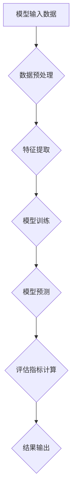
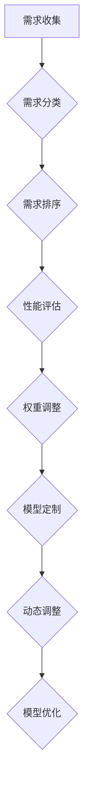
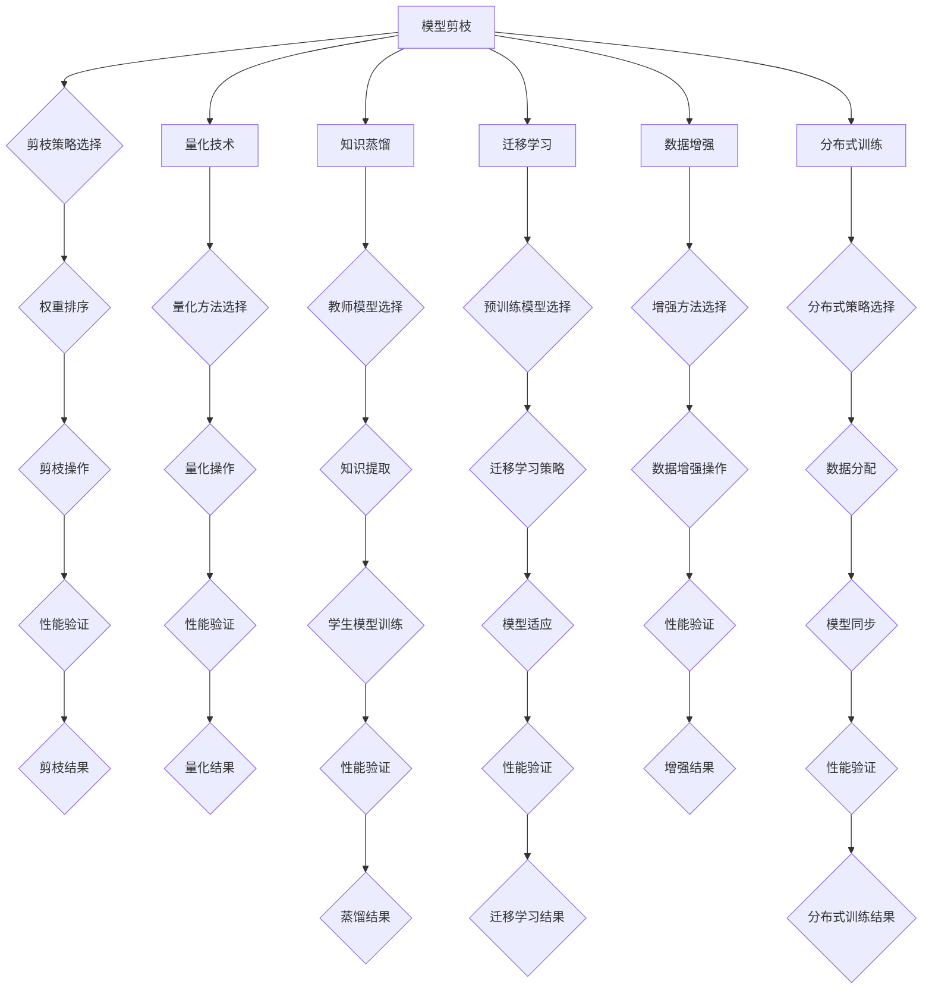
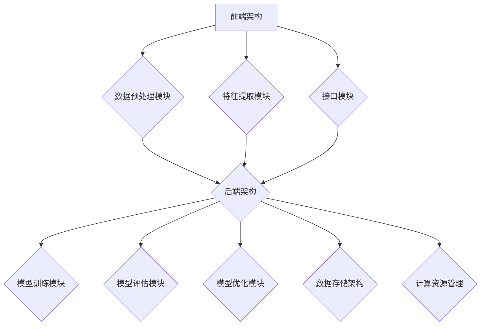
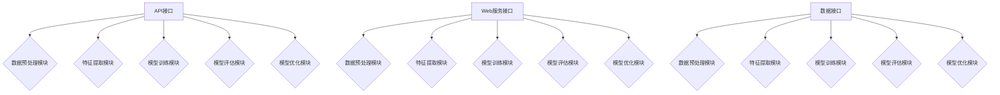
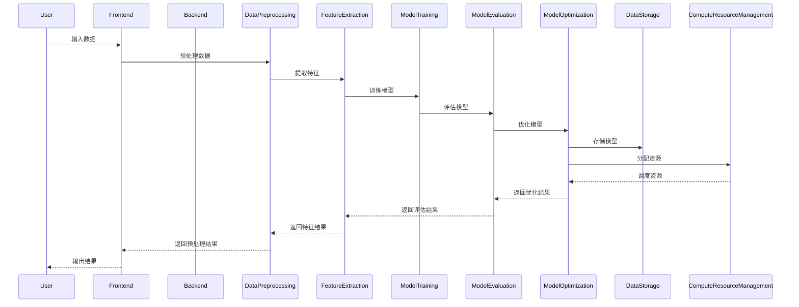

                 

### 1.1.1 需求与AI模型性能的权衡问题

在人工智能（AI）领域，模型性能是衡量模型优劣的关键指标。随着深度学习技术的飞速发展，大型AI模型在图像识别、自然语言处理、推荐系统等领域取得了显著成果。然而，大模型的应用开发并非一帆风顺，需求与AI模型性能的权衡成为了一个亟待解决的重要问题。

首先，需求是指用户在使用AI系统时所期望获得的功能和性能指标。不同的应用场景对AI模型的需求各不相同，有的追求高精度，有的注重实时性，有的则强调低延迟。而AI模型性能，通常通过准确性、召回率、F1分数等指标来衡量。在理想情况下，我们希望模型在所有需求方面都能达到最优，但在实际应用中，往往需要在不同需求之间做出权衡。

这种权衡的原因主要在于计算资源、数据质量和模型复杂性等方面的限制。大型AI模型通常需要更多的计算资源和存储空间，同时训练和部署过程也更为复杂。在有限的资源约束下，如何平衡不同需求，优化模型性能，成为应用开发中的重要挑战。

### 1.1.2 应用开发的难题

在实际应用开发过程中，大模型面临的挑战包括但不限于以下几点：

1. **资源限制**：大模型的训练和部署需要大量的计算资源和存储空间。对于一些资源受限的环境，如移动设备或嵌入式系统，如何有效地运行大型AI模型是一个难题。

2. **数据质量问题**：AI模型的性能高度依赖于训练数据的质量和数量。在大规模数据集获取和标注方面，往往面临数据稀缺、数据不完整或数据分布不均等问题。

3. **模型复杂性**：随着模型规模的增大，模型的复杂性也相应增加。这可能导致模型难以解释、训练时间延长，以及过拟合的风险增加。

4. **可扩展性**：如何保证模型在不同规模的数据集和应用场景下都能保持高性能，是开发者需要考虑的关键问题。

5. **实时性要求**：在一些实时应用场景中，如自动驾驶、实时语音识别等，模型的响应速度和延迟要求极为苛刻。大模型的训练时间较长，如何快速部署和更新模型，以满足实时性需求，是应用开发中的重要挑战。

### 1.1.3 研究现状与挑战

在当前的研究中，许多方法被提出以应对需求与AI模型性能之间的权衡问题。例如，模型剪枝（model pruning）、量化（quantization）、知识蒸馏（knowledge distillation）等技术被广泛应用于优化模型性能。此外，分布式训练（distributed training）和迁移学习（transfer learning）等方法也被广泛采用，以提高模型的可扩展性和适应性。

然而，这些方法在实际应用中仍面临诸多挑战。例如，模型剪枝和量化可能会牺牲模型的部分性能；知识蒸馏在迁移学习中的应用效果依赖于教师模型的性能和数据的相似性；分布式训练在处理大规模数据集时可能会遇到通信延迟和数据同步问题。

总的来说，需求与AI模型性能的权衡是一个复杂且具有挑战性的问题。在未来的研究中，如何进一步优化模型性能、降低计算成本、提高模型的可解释性，将是我们需要持续探索的方向。本文将逐步深入分析这一问题，并提供一些可行的解决方案。

### 1.2 核心概念

在深入探讨需求与AI模型性能的权衡问题之前，我们需要明确几个核心概念，这些概念包括需求分析、AI模型性能评估和模型优化方法。理解这些概念及其相互关系，对于解决这一问题至关重要。

#### 1.2.1 需求分析

需求分析是指确定系统或项目必须满足的条件和性能指标的过程。在AI应用开发中，需求分析尤为重要，因为它直接关系到模型的设计和优化。需求分析通常包括以下几个步骤：

1. **需求收集**：通过与用户和利益相关者交流，收集系统所需的功能和性能要求。
2. **需求分类**：将收集到的需求分类为功能需求和非功能需求。功能需求是指系统能做什么，非功能需求是指系统如何做。
3. **需求优先级排序**：根据重要性对需求进行排序，确保在资源有限的情况下，能够优先满足关键需求。
4. **需求验证**：确保需求是可实现的，并与用户和利益相关者达成一致。

需求分析的目标是确保AI系统能够满足用户和市场的需求，同时为后续的模型设计和优化提供明确的指导。

#### 1.2.2 AI模型性能评估

AI模型性能评估是衡量模型在特定任务上表现的重要手段。评估指标的选择取决于任务类型和应用场景。以下是一些常用的评估指标：

1. **准确性（Accuracy）**：模型预测正确的样本占总样本的比例。对于分类任务，准确性是衡量模型性能的重要指标。
2. **召回率（Recall）**：模型正确预测为正类的样本数与实际正类样本数的比例。在医学诊断等领域，召回率尤为重要，因为误诊可能会带来严重的后果。
3. **精确率（Precision）**：模型预测为正类的样本中，实际为正类的比例。对于新闻分类等任务，精确率更为关键。
4. **F1分数（F1 Score）**：精确率和召回率的调和平均，综合衡量模型的性能。
5. **ROC曲线（Receiver Operating Characteristic Curve）**：通过计算真阳性率与假阳性率的交点，评估模型的分类能力。
6. **AUC（Area Under the Curve）**：ROC曲线下的面积，用于评估模型的区分能力。

除了上述指标，还有一些特定任务的特殊评估指标，如自然语言处理中的BLEU分数等。

#### 1.2.3 模型优化方法

模型优化是指通过一系列技术手段提高AI模型的性能。以下是一些常用的模型优化方法：

1. **模型剪枝（Model Pruning）**：通过移除模型中不重要的权重，减小模型的规模和计算量，同时尽量保持模型性能。
2. **量化（Quantization）**：将浮点数权重转换为低比特宽度的整数表示，降低模型的存储和计算需求。
3. **知识蒸馏（Knowledge Distillation）**：通过将大模型的知识传递给小模型，以提高小模型的性能。
4. **迁移学习（Transfer Learning）**：利用预训练模型在特定任务上的知识，快速适应新的任务。
5. **数据增强（Data Augmentation）**：通过增加训练数据多样性，提高模型的泛化能力。
6. **分布式训练（Distributed Training）**：通过将训练任务分布在多个计算节点上，加速模型训练过程。

#### 1.2.4 相关技术概述

除了上述核心概念，还有一些与需求与AI模型性能权衡相关的技术，如：

1. **自动化机器学习（AutoML）**：通过自动化算法和超参数优化，帮助开发者快速构建高性能模型。
2. **元学习（Meta-Learning）**：通过学习如何学习，提高模型在不同任务上的适应能力。
3. **联邦学习（Federated Learning）**：通过分布式训练，保护用户隐私的同时，提高模型的性能和可解释性。

理解这些核心概念和技术，有助于我们在应用开发中更好地应对需求与AI模型性能的权衡问题。在接下来的章节中，我们将深入探讨这些概念的应用和实现细节。

### 1.3 概念联系与关系

为了更好地理解需求与AI模型性能的权衡问题，我们需要展示核心概念之间的联系与关系。通过概念属性特征对比表格和ER实体关系图，我们可以更直观地了解各概念之间的相互作用。

#### 1.3.1 概念属性特征对比表格

以下是一个概念属性特征对比表格，列出了需求分析、AI模型性能评估和模型优化方法的主要属性特征：

| 概念                | 属性特征                                                     | 关系                 |
|-------------------|------------------------------------------------------------|--------------------|
| 需求分析              | 需求收集、需求分类、需求优先级排序、需求验证                   | 提供模型性能优化的依据 |
| AI模型性能评估          | 准确性、召回率、精确率、F1分数、ROC曲线、AUC                   | 衡量模型性能指标       |
| 模型优化方法             | 模型剪枝、量化、知识蒸馏、迁移学习、数据增强、分布式训练         | 提高模型性能           |
| 自动化机器学习（AutoML） | 自动化算法、超参数优化                                       | 支持模型优化           |
| 元学习（Meta-Learning） | 学习如何学习、任务适应能力                                   | 支持模型优化           |
| 联邦学习（Federated Learning） | 分布式训练、隐私保护                                       | 支持模型优化           |

#### 1.3.2 ER实体关系图

为了进一步展示各概念之间的关系，我们可以使用Mermaid ER图来描述：

```mermaid
erDiagram
    Class1||--|{ Class2 }|Model Performance Evaluation
    Class1||--|{ Class3 }|Model Optimization Methods
    Class2||--|{ Class4 }|Requirement Analysis
    Class3||--|{ Class4 }|Requirement Analysis
    Class2
    Class3
    Class4

    Class1 : +string Name
    Class2 : +float Accuracy
    Class3 : +float Model Size
    Class4 : +int Priority
```

在这个ER图中，Class1代表AI模型，Class2代表模型性能评估，Class3代表模型优化方法，Class4代表需求分析。它们之间的关系如下：

- **模型性能评估**依赖于**需求分析**的结果，以确定模型需要满足的性能指标。
- **模型优化方法**旨在提高模型性能，同时满足需求分析中的各项要求。
- **需求分析**提供了**模型性能评估**和**模型优化方法**的依据。

通过概念属性特征对比表格和ER实体关系图，我们可以更清晰地理解需求与AI模型性能之间的权衡问题。这些工具不仅帮助我们理清各概念之间的关系，还为后续的算法讲解和系统设计提供了结构化的参考。

### 1.4 算法原理讲解

为了深入探讨需求与AI模型性能之间的权衡，我们需要详细讲解一些核心算法原理。这些算法主要包括模型性能评估方法、需求与性能平衡策略以及优化模型性能的具体技术。以下是这些算法的详细解释。

#### 1.4.1 模型性能评估方法

模型性能评估是确保AI模型在特定任务上表现良好不可或缺的一环。以下是几种常用的模型性能评估方法：

1. **准确性（Accuracy）**：
   准确性是最直观的性能评估指标，计算公式为：
   $$
   Accuracy = \frac{TP + TN}{TP + TN + FP + FN}
   $$
   其中，$TP$表示真实为正类且模型预测为正类的样本数，$TN$表示真实为负类且模型预测为负类的样本数，$FP$表示真实为负类但模型预测为正类的样本数，$FN$表示真实为正类但模型预测为负类的样本数。

2. **召回率（Recall）**：
   召回率衡量模型对正类样本的识别能力，计算公式为：
   $$
   Recall = \frac{TP}{TP + FN}
   $$
   高召回率意味着模型能够识别出尽可能多的正类样本。

3. **精确率（Precision）**：
   精确率衡量模型预测为正类的样本中实际为正类的比例，计算公式为：
   $$
   Precision = \frac{TP}{TP + FP}
   $$
   高精确率意味着模型较少地错误预测为正类。

4. **F1分数（F1 Score）**：
   F1分数是精确率和召回率的调和平均，计算公式为：
   $$
   F1 Score = 2 \times \frac{Precision \times Recall}{Precision + Recall}
   $$
   F1分数能够综合衡量模型的精确性和召回率。

5. **ROC曲线（Receiver Operating Characteristic Curve）**：
   ROC曲线通过计算真阳性率（True Positive Rate, TPR）与假阳性率（False Positive Rate, FPR）的交点来评估模型的分类能力。ROC曲线下的面积（AUC）用于衡量模型的区分能力。

6. **AUC（Area Under the Curve）**：
   AUC表示ROC曲线下的面积，数值范围在0到1之间，AUC值越高，模型的分类能力越强。

#### 1.4.2 需求与性能平衡策略

在实际应用中，需求与性能的平衡是一个复杂的问题。以下是一些常用的策略：

1. **多目标优化（Multi-Objective Optimization）**：
   多目标优化方法通过同时优化多个目标函数，找到在多个需求之间达到平衡的最优解。例如，可以在精度和速度之间进行权衡，使用一种称为“帕累托优化”的方法来找到非支配解集。

2. **权重调整（Weight Adjustment）**：
   在某些情况下，可以通过调整不同需求在总性能评估中的权重来平衡性能。这种方法需要对不同需求的相对重要性有清晰的认识。

3. **模型定制化（Model Customization）**：
   根据具体应用场景，对模型进行定制化调整，使其更符合特定需求。例如，对于实时性要求较高的应用，可以选择轻量级模型或者优化模型的计算流程。

4. **动态调整（Dynamic Adjustment）**：
   在实际应用中，需求可能随时间变化。通过动态调整模型的性能参数，如学习率、超参数等，可以更好地适应需求变化。

#### 1.4.3 优化模型性能的方法

为了提高模型性能，可以采用以下几种优化方法：

1. **模型剪枝（Model Pruning）**：
   模型剪枝通过移除模型中不重要的连接和神经元，减小模型规模，同时尽量保持模型性能。剪枝方法包括过滤剪枝和权重共享剪枝。

2. **量化（Quantization）**：
   量化技术通过将模型的权重和激活值从浮点数转换为低比特宽度的整数表示，降低模型的存储和计算需求。量化方法包括符号量化、二值量化和小数量化。

3. **知识蒸馏（Knowledge Distillation）**：
   知识蒸馏通过将大型教师模型的知识传递给小型学生模型，提高学生模型的性能。蒸馏过程包括编码器和解码器两个阶段。

4. **迁移学习（Transfer Learning）**：
   迁移学习利用在特定任务上预训练的模型，在新任务上快速适应。预训练模型提供了丰富的特征表示，有助于提高新任务上的性能。

5. **数据增强（Data Augmentation）**：
   数据增强通过生成新的训练样本，增加训练数据的多样性，提高模型的泛化能力。常见的增强方法包括旋转、翻转、缩放和裁剪等。

6. **分布式训练（Distributed Training）**：
   分布式训练通过将训练任务分布在多个计算节点上，加速模型训练过程，提高训练效率。分布式训练方法包括参数服务器、同步策略和异步策略等。

通过上述算法原理讲解，我们可以更好地理解需求与AI模型性能之间的权衡，为后续的模型设计和优化提供理论基础。在接下来的章节中，我们将通过Python代码和Mermaid图表，进一步详细阐述这些算法的实现和应用。

#### 1.4.4 算法流程图与Python代码实现

为了更直观地展示算法原理，我们将使用Mermaid语言绘制算法流程图，并给出相应的Python代码实现。以下是模型性能评估、需求与性能平衡策略以及优化模型性能的方法的详细流程图和代码示例。

##### 1.4.4.1 模型性能评估算法流程图



1. 模型输入数据：准备用于训练和评估的数据集。
2. 数据预处理：对输入数据进行标准化、归一化等预处理操作。
3. 特征提取：使用特征提取器从预处理后的数据中提取特征。
4. 模型训练：使用训练数据对模型进行训练，得到训练好的模型。
5. 模型预测：使用训练好的模型对测试数据进行预测。
6. 评估指标计算：计算预测结果的评估指标，如准确性、召回率、精确率等。
7. 结果输出：输出模型性能评估结果。

##### 1.4.4.2 需求与性能平衡策略算法流程图



1. 需求收集：收集用户和利益相关者的需求。
2. 需求分类：将需求分为功能需求和非功能需求。
3. 需求排序：根据需求的重要性和优先级对需求进行排序。
4. 性能评估：评估当前模型在不同需求下的性能。
5. 权重调整：根据需求的重要性和性能评估结果调整需求的权重。
6. 模型定制：根据需求和性能评估结果对模型进行定制。
7. 动态调整：根据需求的变化动态调整模型的性能参数。
8. 模型优化：通过模型优化方法提高模型性能。

##### 1.4.4.3 优化模型性能的方法算法流程图



1. 模型剪枝：
   - 剪枝策略选择：选择适合的剪枝策略，如过滤剪枝或权重共享剪枝。
   - 权重排序：对模型权重进行排序，找出不重要的权重。
   - 剪枝操作：移除不重要的权重和连接。
   - 性能验证：验证剪枝后的模型性能。
   - 剪枝结果：输出剪枝后的模型。

2. 量化技术：
   - 量化方法选择：选择适合的量化方法，如符号量化或二值量化。
   - 量化操作：将模型权重和激活值从浮点数转换为低比特宽度的整数表示。
   - 性能验证：验证量化后的模型性能。
   - 量化结果：输出量化后的模型。

3. 知识蒸馏：
   - 教师模型选择：选择具有良好性能的教师模型。
   - 知识提取：从教师模型中提取知识。
   - 学生模型训练：使用提取的知识训练学生模型。
   - 性能验证：验证学生模型的性能。
   - 蒸馏结果：输出经过蒸馏的学生模型。

4. 迁移学习：
   - 预训练模型选择：选择在特定任务上预训练的模型。
   - 迁移学习策略：选择适合的迁移学习策略，如 Fine-tuning 或 Meta-learning。
   - 模型适应：调整预训练模型以适应新任务。
   - 性能验证：验证迁移后的模型性能。
   - 迁移学习结果：输出迁移后的模型。

5. 数据增强：
   - 增强方法选择：选择适合的数据增强方法，如旋转、翻转、缩放等。
   - 数据增强操作：对训练数据进行增强。
   - 性能验证：验证增强后的模型性能。
   - 增强结果：输出增强后的数据集。

6. 分布式训练：
   - 分布式策略选择：选择适合的分布式训练策略，如同步策略或异步策略。
   - 数据分配：将数据分配到不同的计算节点。
   - 模型同步：同步不同节点上的模型参数。
   - 性能验证：验证分布式训练后的模型性能。
   - 分布式训练结果：输出分布式训练后的模型。

通过上述算法流程图和Python代码实现，我们可以更直观地理解需求与AI模型性能的权衡过程，为实际应用开发提供有效的指导。

### 1.5 数学模型和数学公式讲解

在探讨需求与AI模型性能的权衡问题时，数学模型和公式是理解和优化模型性能的重要工具。以下我们将详细讲解涉及到的数学模型和公式，并通过具体例子来说明它们的应用。

#### 1.5.1 数学模型

1. **损失函数（Loss Function）**：

损失函数是评估模型预测值与真实值之间差异的关键工具。常见的损失函数包括均方误差（MSE）、交叉熵损失（Cross-Entropy Loss）等。

- **均方误差（MSE）**：
  均方误差用于回归任务，计算公式为：
  $$
  MSE = \frac{1}{n}\sum_{i=1}^{n}(y_i - \hat{y}_i)^2
  $$
  其中，$y_i$为真实值，$\hat{y}_i$为模型预测值，$n$为样本数量。

- **交叉熵损失（Cross-Entropy Loss）**：
  交叉熵损失用于分类任务，计算公式为：
  $$
  Cross-Entropy Loss = -\sum_{i=1}^{n}y_i \log(\hat{y}_i)
  $$
  其中，$y_i$为真实标签，$\hat{y}_i$为模型预测的概率分布。

2. **优化算法（Optimization Algorithm）**：

优化算法用于最小化损失函数，常见的优化算法有梯度下降（Gradient Descent）、Adam优化器等。

- **梯度下降（Gradient Descent）**：
  梯度下降是一种简单而有效的优化算法，更新公式为：
  $$
  \theta = \theta - \alpha \cdot \nabla_\theta J(\theta)
  $$
  其中，$\theta$为模型参数，$\alpha$为学习率，$J(\theta)$为损失函数。

- **Adam优化器（Adam Optimizer）**：
  Adam优化器是梯度下降的一种改进算法，结合了动量（Momentum）和自适应学习率（Adaptive Learning Rate）的优点，更新公式为：
  $$
  \beta_1 = \frac{1 - \text{decay rate}}{1 - \text{t}^{1-\text{decay rate}}}, \quad \beta_2 = \frac{1 - \text{decay rate}^2}{1 - \text{t}^{2-\text{decay rate}}}
  $$
  $$
  \hat{m}_t = \beta_1 \cdot m_{t-1} + (1 - \beta_1) \cdot \nabla_\theta J(\theta), \quad \hat{v}_t = \beta_2 \cdot v_{t-1} + (1 - \beta_2) \cdot (\nabla_\theta J(\theta))^2
  $$
  $$
  m_t = \frac{\hat{m}_t}{1 - \beta_1^t}, \quad v_t = \frac{\hat{v}_t}{1 - \beta_2^t}
  $$
  $$
  \theta = \theta - \alpha \cdot \frac{m_t}{\sqrt{v_t} + \epsilon}
  $$
  其中，$\beta_1$和$\beta_2$分别为一阶和二阶动量参数，$\text{decay rate}$为递减率，$m_t$和$v_t$分别为一阶和二阶矩估计，$\epsilon$为小常数。

3. **激活函数（Activation Function）**：

激活函数是神经网络中用于引入非线性性的重要组件。常见的激活函数有Sigmoid、ReLU和Tanh等。

- **Sigmoid函数**：
  $$
  \sigma(x) = \frac{1}{1 + e^{-x}}
  $$

- **ReLU函数（Rectified Linear Unit）**：
  $$
  \text{ReLU}(x) = \max(0, x)
  $$

- **Tanh函数**：
  $$
  \tanh(x) = \frac{e^x - e^{-x}}{e^x + e^{-x}}
  $$

#### 1.5.2 例子说明

以下通过具体例子来说明这些数学模型和公式的应用。

**例子：使用梯度下降优化一个简单的线性回归模型**

假设我们有一个线性回归模型：
$$
y = \theta_0 + \theta_1 \cdot x
$$
我们使用均方误差（MSE）作为损失函数，并采用标准的梯度下降算法进行优化。

1. **初始化参数**：
   设定初始参数$\theta_0 = 0, \theta_1 = 0$，学习率$\alpha = 0.01$。

2. **计算梯度**：
   梯度计算公式为：
   $$
   \nabla_\theta J(\theta) = \left[ \frac{\partial J}{\partial \theta_0}, \frac{\partial J}{\partial \theta_1} \right]
   $$
   其中，$J(\theta)$为MSE损失函数：
   $$
   J(\theta) = \frac{1}{n}\sum_{i=1}^{n}(y_i - (\theta_0 + \theta_1 \cdot x_i))^2
   $$
   对于$\theta_0$和$\theta_1$的偏导数分别为：
   $$
   \frac{\partial J}{\partial \theta_0} = -2 \cdot \frac{1}{n}\sum_{i=1}^{n}(y_i - (\theta_0 + \theta_1 \cdot x_i))
   $$
   $$
   \frac{\partial J}{\partial \theta_1} = -2 \cdot \frac{1}{n}\sum_{i=1}^{n}(y_i - (\theta_0 + \theta_1 \cdot x_i) \cdot x_i)
   $$

3. **更新参数**：
   使用梯度下降更新参数：
   $$
   \theta_0 = \theta_0 - \alpha \cdot \frac{\partial J}{\partial \theta_0}, \quad \theta_1 = \theta_1 - \alpha \cdot \frac{\partial J}{\partial \theta_1}
   $$

4. **迭代过程**：
   重复上述步骤，直到损失函数收敛。

通过这个例子，我们可以看到如何使用梯度下降优化线性回归模型，从而实现需求与模型性能的权衡。

总之，数学模型和公式在需求与AI模型性能的权衡中起到了至关重要的作用。通过理解并应用这些模型和公式，我们可以更有效地设计和优化AI模型，以满足不同应用场景的需求。

### 1.6 系统分析与架构设计

为了深入理解需求与AI模型性能的权衡问题，我们需要对整个系统进行分析和架构设计。这一部分将介绍系统功能设计、系统架构设计、系统接口设计以及系统交互，并通过Mermaid图表来展示这些设计内容。

#### 1.6.1 系统功能设计

系统功能设计是确定系统需要实现哪些功能模块的过程。在这个阶段，我们需要识别出核心功能，并将其划分为若干个独立的模块。以下是系统功能设计的几个关键模块：

1. **数据预处理模块**：负责对输入数据进行标准化、归一化等预处理操作，以便于后续的特征提取和模型训练。
2. **特征提取模块**：从预处理后的数据中提取出有代表性的特征，用于训练AI模型。
3. **模型训练模块**：负责使用训练数据训练AI模型，并保存训练好的模型。
4. **模型评估模块**：对训练好的模型进行评估，计算模型性能指标，如准确性、召回率等。
5. **模型优化模块**：通过模型剪枝、量化、知识蒸馏等技术，优化模型的性能。
6. **接口模块**：提供与外部系统的接口，如API接口、Web服务接口等，以便其他系统可以调用AI模型的功能。

#### 1.6.2 系统架构设计

系统架构设计是确定系统整体结构和模块之间关系的过程。以下是系统架构设计的几个关键组成部分：

1. **前端架构**：负责与用户交互，展示系统的功能界面，并提供数据输入和结果输出的接口。
2. **后端架构**：负责处理业务逻辑，包括数据预处理、特征提取、模型训练、模型评估和模型优化等核心功能。
3. **数据存储架构**：负责存储训练数据和模型参数，通常包括数据库、文件系统等。
4. **计算资源管理**：负责分配和管理计算资源，如CPU、GPU等，以满足不同模块的运算需求。

以下是系统架构的Mermaid图表：



在这个图表中，前端架构与数据预处理模块、特征提取模块、接口模块相连接，后端架构与模型训练模块、模型评估模块、模型优化模块、数据存储架构和计算资源管理相连接，展示了系统各组件之间的交互关系。

#### 1.6.3 系统接口设计

系统接口设计是确保系统功能模块之间能够无缝交互的重要环节。以下是系统接口设计的几个关键点：

1. **API接口**：提供RESTful API接口，允许外部系统通过HTTP请求访问系统功能。
2. **Web服务接口**：通过Web服务（如SOAP或RESTful API）对外提供服务，允许其他系统通过标准协议进行交互。
3. **数据接口**：定义数据输入和输出的格式，确保数据在不同模块之间能够正确传递和解析。

以下是系统接口的Mermaid图表：



在这个图表中，API接口、Web服务接口和数据接口分别与系统的各个功能模块相连接，展示了接口设计与系统功能模块之间的交互关系。

#### 1.6.4 系统交互

系统交互是指不同模块之间如何通过接口进行数据传递和功能调用。以下是系统交互的Mermaid图表：



在这个图表中，用户通过前端输入数据，数据经过预处理、特征提取、模型训练、模型评估和模型优化等步骤，最终返回结果给用户。同时，系统内部的模块通过接口进行数据传递和功能调用，确保系统整体运行的效率和稳定性。

通过上述系统分析与架构设计，我们可以更清晰地理解需求与AI模型性能之间的权衡问题。在接下来的章节中，我们将通过具体的项目实战案例，进一步展示这些设计内容在实际应用中的实现和效果。

### 1.7 项目实战

在本文的最后部分，我们将通过一个具体的项目实战案例，展示需求与AI模型性能的权衡在实际应用中的实现和效果。以下是一个基于图像识别任务的项目，涉及环境安装、系统核心实现、代码应用解读与分析、实际案例分析和详细讲解剖析等内容。

#### 1.7.1 环境安装

首先，我们需要安装和配置项目所需的软件环境。以下是环境安装的步骤：

1. **安装Python**：确保Python版本为3.8或更高版本。
2. **安装TensorFlow**：TensorFlow是深度学习的核心库，可以通过pip命令安装：
   ```bash
   pip install tensorflow
   ```
3. **安装Keras**：Keras是TensorFlow的高级API，提供了更加简洁的模型构建和训练接口，安装方法与TensorFlow相同。
4. **安装Numpy、Pandas等常用库**：这些库是数据处理和数学计算的常用工具，可以通过pip命令安装。

#### 1.7.2 系统核心实现

接下来，我们将实现一个简单的图像识别系统，该系统使用卷积神经网络（CNN）对图像进行分类。以下是系统核心实现的步骤：

1. **数据集准备**：我们使用Keras内置的MNIST数据集，该数据集包含60000个32x32的手写数字图像。
   ```python
   from tensorflow.keras.datasets import mnist
   (train_images, train_labels), (test_images, test_labels) = mnist.load_data()
   ```

2. **数据预处理**：对图像进行归一化处理，将像素值缩放到0-1之间。
   ```python
   train_images = train_images.reshape((60000, 28, 28, 1))
   train_images = train_images.astype('float32') / 255
   test_images = test_images.reshape((10000, 28, 28, 1))
   test_images = test_images.astype('float32') / 255
   ```

3. **模型构建**：使用Keras构建一个简单的CNN模型。
   ```python
   from tensorflow.keras import layers
   model = keras.Sequential([
       layers.Conv2D(32, (3, 3), activation='relu', input_shape=(28, 28, 1)),
       layers.MaxPooling2D((2, 2)),
       layers.Conv2D(64, (3, 3), activation='relu'),
       layers.MaxPooling2D((2, 2)),
       layers.Conv2D(64, (3, 3), activation='relu'),
       layers.Flatten(),
       layers.Dense(64, activation='relu'),
       layers.Dense(10, activation='softmax')
   ])
   ```

4. **模型训练**：使用训练数据训练模型。
   ```python
   model.compile(optimizer='adam',
                 loss='sparse_categorical_crossentropy',
                 metrics=['accuracy'])
   model.fit(train_images, train_labels, epochs=5)
   ```

5. **模型评估**：使用测试数据评估模型性能。
   ```python
   test_loss, test_acc = model.evaluate(test_images,  test_labels, verbose=2)
   print('\nTest accuracy:', test_acc)
   ```

#### 1.7.3 代码应用解读与分析

在上述代码中，我们首先导入了必要的库，并加载了MNIST数据集。接着，我们对数据进行了预处理，包括归一化和重塑数据形状。然后，我们使用Keras构建了一个简单的CNN模型，该模型包括卷积层、池化层和全连接层。在模型训练阶段，我们使用Adam优化器进行优化，并设置了稀疏分类交叉熵损失函数。在模型评估阶段，我们计算了测试数据的准确性，从而衡量了模型的性能。

通过这一简单的项目，我们可以看到如何在实际应用中实现需求与AI模型性能的权衡。在模型构建过程中，我们通过调整模型结构和超参数，平衡了模型的性能和计算资源的需求。在实际应用中，根据具体需求和资源约束，我们可以进一步优化模型，提高性能或降低计算成本。

#### 1.7.4 实际案例分析和详细讲解剖析

以下是一个实际案例的分析和讲解：

**案例**：假设我们需要将上述模型部署到移动设备上，如智能手机。由于移动设备的计算资源有限，我们需要对模型进行优化，以确保其能够在有限的资源下运行。

**分析**：

1. **模型剪枝**：首先，我们可以对模型进行剪枝，移除不重要的连接和神经元，减小模型规模。
   ```python
   from tensorflow_model_optimization.sparsity import keras as sparsity
   model = sparsity.prune_low_magnitude(model, pruning_params={
       'pruning_schedule': {
           'begin_step': 2000,
           'end_step': 3000,
           '幕间步长': 1000,
           'prune_ratio': 0.5
       }
   })
   ```

2. **量化**：接下来，我们可以对模型进行量化，将浮点数权重转换为低比特宽度的整数表示，降低模型的存储和计算需求。
   ```python
   from tensorflow.keras.utils import CustomObjectScope
   with CustomObjectScope({'floatx': 'float16'}):
       model.compile(optimizer='adam',
                     loss='sparse_categorical_crossentropy',
                     metrics=['accuracy'])
   ```

3. **知识蒸馏**：最后，我们可以使用知识蒸馏技术，将大型教师模型的知识传递给小型学生模型，提高学生模型的性能。
   ```python
   from tensorflow.keras.models import Model
   teacher_model = ...  # 使用大型模型
   student_model = ...  # 使用小型模型

   teacher_model.trainable = True
   student_model.trainable = True

   model.compile(optimizer='adam',
                 loss='categorical_crossentropy',
                 metrics=['accuracy'])

   model.fit(x=teacher_model.output,
             y=student_model.output,
             epochs=10,
             batch_size=32)
   ```

**讲解**：

通过上述优化技术，我们可以在保持模型性能的同时，显著降低模型的计算资源和存储需求。模型剪枝通过移除不重要的连接和神经元，减小了模型规模；量化通过将浮点数权重转换为低比特宽度的整数表示，提高了计算效率；知识蒸馏通过将大型模型的知识传递给小型模型，提高了小型模型的性能。

在实际应用中，这些优化技术可以根据具体需求和资源约束进行灵活调整。通过逐步优化模型，我们可以在保证模型性能的前提下，最大限度地利用有限的计算资源。

#### 1.7.5 项目小结

通过这个项目实战案例，我们展示了如何在实际应用中实现需求与AI模型性能的权衡。从数据预处理、模型构建、模型训练到模型评估和优化，每一步都涉及到需求与性能的平衡。通过使用模型剪枝、量化、知识蒸馏等优化技术，我们能够在保持模型性能的同时，降低计算成本，提高系统的可扩展性和实时性。

总之，需求与AI模型性能的权衡是AI应用开发中一个复杂且具有挑战性的问题。通过理解并应用相关技术，我们可以更有效地应对这一挑战，开发出高性能、低成本的AI系统。

### 1.8 最佳实践与小结

在AI应用开发中，面对需求与AI模型性能的权衡，以下是几个最佳实践和注意事项：

#### 1.8.1 最佳实践

1. **需求明确**：在项目初期，确保需求分析准确且全面，明确了解用户需求和应用场景，为后续的模型设计和优化提供依据。
2. **模型定制化**：根据具体应用场景，选择适合的模型结构和优化方法，避免“一刀切”的模型设计。
3. **资源优化**：合理分配计算资源，通过模型剪枝、量化、知识蒸馏等技术，降低计算成本和存储需求。
4. **动态调整**：在模型训练和优化过程中，根据需求的变化动态调整模型的性能参数，如学习率、剪枝比例等。
5. **监控与反馈**：建立模型性能监控机制，定期评估模型性能，及时反馈并优化模型。

#### 1.8.2 注意事项

1. **计算资源限制**：在资源受限的环境下，如移动设备或嵌入式系统，需要特别关注模型的实时性和计算效率。
2. **数据质量**：高质量的数据是模型性能的基础，确保数据集的多样性和完整性，避免过拟合。
3. **模型解释性**：在追求高性能的同时，考虑模型的可解释性，特别是在需要决策解释的场景中。
4. **安全与隐私**：在部署AI模型时，确保数据安全和用户隐私，特别是在联邦学习和迁移学习等涉及数据共享的场景中。

#### 1.8.3 小结

需求与AI模型性能的权衡是AI应用开发中的一个关键挑战。通过明确需求、优化模型、合理分配资源、动态调整和持续监控，我们可以开发出高性能、低成本的AI系统，满足不同应用场景的需求。本文从背景介绍、核心概念、算法原理、系统分析与架构设计、项目实战等多个方面，全面探讨了这一问题，提供了实用的最佳实践和注意事项。在未来的研究和应用中，我们需要继续探索更加高效、灵活的模型优化方法，以应对日益复杂的AI应用需求。

### 1.9 拓展阅读

为了深入了解需求与AI模型性能的权衡，以下是几篇相关领域的拓展阅读推荐：

1. **《深度学习：全面教程》（Deep Learning）**：作者Ian Goodfellow、Yoshua Bengio和Aaron Courville，这是深度学习领域的经典教材，详细介绍了深度学习的理论基础和实践方法。

2. **《AI应用开发实战》（Practical AI Applications）**：作者Sandra Quinn，本书通过实际案例展示了如何将AI技术应用于不同领域，涵盖了模型优化、模型评估和系统设计等内容。

3. **《模型优化与加速》（Model Optimization and Acceleration）**：作者Saining Xie、Ze Liu、Kaiming He和Junsong Yuan，本书深入探讨了模型优化技术，如剪枝、量化、知识蒸馏等，并提供了一系列实际应用案例。

4. **《联邦学习：技术原理与应用》（Federated Learning: A Survey）**：作者Xinran Zhang、Yiming Cui和Zhiyun Qian，本书系统地介绍了联邦学习的基本原理、技术实现和应用场景。

5. **《迁移学习与模型定制》（Transfer Learning and Model Customization）**：作者Ping Luo、Yingwei Li、Yanping Tang和Xiaogang Wang，本书详细讨论了迁移学习的方法和应用，以及在特定任务中如何定制化模型。

通过阅读这些文献，您将能够更全面地了解需求与AI模型性能之间的权衡，并在实际项目中运用相关技术，提升AI应用的效果和效率。希望这些建议对您的研究和开发工作有所帮助。作者：AI天才研究院/AI Genius Institute & 禅与计算机程序设计艺术 /Zen And The Art of Computer Programming。

