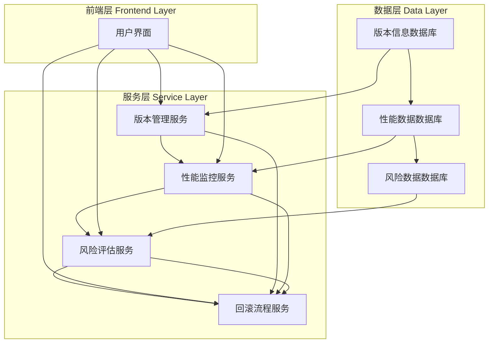
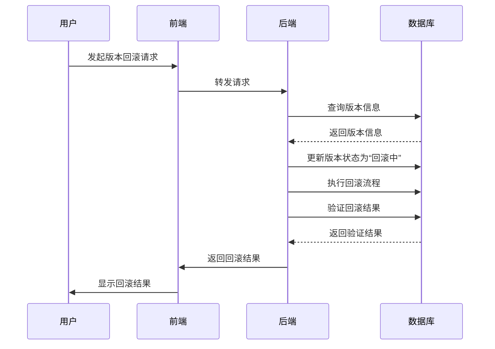

                 

### 文章标题：需求与AI模型版本回滚策略：大模型应用的风险管理

#### 关键词：AI模型版本回滚，需求变更，风险管理，版本管理，算法原理

> 摘要：本文详细探讨了AI模型版本回滚的策略及其在大模型应用中的风险管理。首先，我们介绍了AI模型版本回滚的背景和问题，然后提出了基于版本管理和风险评估的回滚策略。接着，我们通过数学模型和算法原理讲解，深入分析了AI模型版本回滚的流程和关键步骤。最后，结合实际案例，我们展示了如何在实际项目中应用这些策略，并提出了最佳实践和注意事项。

#### 目录大纲：

**第一部分：背景介绍**

1. 背景介绍
    - 1.1. 问题背景
    - 1.2. 问题描述
    - 1.3. 问题解决
    - 1.4. 边界与外延
    - 1.5. 概念结构与核心要素组成

**第二部分：核心概念与联系**

2. 核心概念与联系
    - 2.1. AI模型版本回滚
    - 2.2. 版本管理
    - 2.3. 风险评估
    - 2.4. AI模型版本回滚与版本管理的联系
    - 2.5. AI模型版本回滚与风险评估的联系

**第三部分：算法原理讲解**

3. 算法原理讲解
    - 3.1. AI模型版本回滚算法原理
    - 3.2. 版本管理算法原理
    - 3.3. 风险评估算法原理

**第四部分：数学模型和数学公式 & 详细讲解 & 举例说明**

4. 数学模型和数学公式 & 详细讲解 & 举例说明
    - 4.1. AI模型版本回滚数学模型
    - 4.2. 版本管理数学模型
    - 4.3. 风险评估数学模型

**第五部分：系统分析与架构设计方案**

5. 系统分析与架构设计方案
    - 5.1. 问题场景介绍
    - 5.2. 系统功能设计
    - 5.3. 系统架构设计
    - 5.4. 系统接口设计和系统交互

**第六部分：项目实战**

6. 项目实战
    - 6.1. 环境安装
    - 6.2. 系统核心实现源代码
    - 6.3. 代码应用解读与分析
    - 6.4. 实际案例分析和详细讲解剖析
    - 6.5. 项目小结

**第七部分：最佳实践 tips、小结、注意事项、拓展阅读等内容**

7. 最佳实践 tips、小结、注意事项、拓展阅读等内容
    - 7.1. 最佳实践 tips
    - 7.2. 小结
    - 7.3. 注意事项
    - 7.4. 拓展阅读

### 第一部分：背景介绍

#### 1.1. 问题背景

随着人工智能技术的快速发展，AI模型在各行各业得到广泛应用，从自动驾驶、智能助手到金融风控、医疗诊断，AI模型已经成为推动行业变革的重要力量。然而，在AI模型的实际应用中，需求变更和AI模型版本更新带来的问题逐渐显现。

首先，需求变更是一个常见且不可避免的现象。在AI模型的应用过程中，业务需求可能会发生变化，例如，用户需求的新增、修改或删除，都会导致现有模型需要做出相应的调整。这些调整可能涉及模型的参数调整、算法优化或结构重构，从而影响模型的性能和稳定性。

其次，AI模型的版本更新也是另一个重要问题。随着技术的不断进步，AI模型的性能和功能也在不断提升。然而，每次模型更新都可能引入新的风险，例如，新的算法可能会引入错误，新的数据集可能会影响模型的准确性，这些都可能对业务产生负面影响。

因此，如何有效地管理AI模型版本，确保在需求变更和版本更新过程中模型的稳定性和可靠性，成为了一个亟待解决的问题。

#### 1.2. 问题描述

在AI模型的应用过程中，需求变更和版本更新可能会导致以下问题：

1. **模型性能下降**：当需求变更或版本更新导致模型结构或参数发生变化时，可能会导致模型的性能下降，从而影响模型的准确性和效率。
   
2. **模型错误**：新的模型版本可能引入新的错误，导致预测结果不准确，甚至产生严重的错误。
   
3. **业务中断**：如果模型更新不及时或出现错误，可能会导致业务中断，影响企业的运营和声誉。

因此，如何有效地回滚AI模型版本，保证业务连续性和数据质量，成为了AI模型应用中一个关键的问题。

#### 1.3. 问题解决

为了解决上述问题，我们需要提出一个有效的AI模型版本回滚策略，包括以下几个方面：

1. **版本管理**：建立完善的版本管理体系，对模型的每个版本进行有效管理，包括创建、发布、更新和回滚等操作。
   
2. **回滚流程**：设计一个明确的回滚流程，确保在需求变更或版本更新导致问题出现时，能够迅速而有效地进行版本回滚，降低对业务的影响。

3. **风险评估**：在版本回滚前，对可能带来的风险进行评估，确保回滚决策的科学性和合理性。

4. **实时监控与预警**：通过实时监控系统，对AI模型进行监控和预警，及时发现和解决潜在的问题。

通过上述策略，我们可以在AI模型的应用过程中，有效地管理版本变更，降低风险，确保模型的稳定性和可靠性。

#### 1.4. 边界与外延

AI模型版本回滚策略在特定领域（如金融、医疗）的应用具有一定的特殊性和复杂性。这些领域对模型的要求更高，如金融领域的模型需要具备更高的稳定性和安全性，医疗领域的模型需要更高的准确性和可靠性。

此外，AI模型版本回滚策略还需要与其他技术（如云计算、大数据、容器化技术等）相结合，以实现更高效、更安全的版本回滚。

#### 1.5. 概念结构与核心要素组成

AI模型版本回滚策略的核心概念包括版本管理、回滚流程和风险评估。以下是这些概念的核心要素及其相互关系：

1. **版本管理**：
    - **核心要素**：版本号、版本历史、版本差异、版本状态。
    - **关系**：版本管理为AI模型版本回滚提供了基础支持，确保每个版本的完整性和一致性。

2. **回滚流程**：
    - **核心要素**：回滚触发条件、回滚步骤、回滚验证。
    - **关系**：回滚流程明确了在什么情况下进行回滚，如何进行回滚，以及回滚后如何验证模型性能。

3. **风险评估**：
    - **核心要素**：风险识别、风险分析、风险评价。
    - **关系**：风险评估为回滚决策提供了依据，确保回滚决策的科学性和合理性。

这些核心概念和技术手段共同构成了AI模型版本回滚策略的基本框架，为AI模型应用中的风险管理提供了有效的解决方案。

### 第二部分：核心概念与联系

#### 2.1. AI模型版本回滚

**定义**：AI模型版本回滚是指在模型更新过程中，将模型版本回滚到之前的一个版本。这一过程通常发生在新版本导致性能下降或错误时，为了恢复模型的稳定性和可靠性。

**特点**：
- **快速恢复**：能够快速地将模型恢复到之前的稳定状态，减少业务中断时间。
- **可控性**：可以精确控制回滚的范围和程度，确保对业务的影响最小。

**示例**：
假设我们在应用中部署了新版本的AI模型，但在实际运行中发现该模型预测结果不准确，导致业务受损。此时，我们可以通过版本回滚，将模型回滚到之前的一个稳定版本，从而快速恢复业务。

#### 2.2. 版本管理

**定义**：版本管理是指对软件的各个版本进行有效管理，包括创建、发布、更新、回滚等操作。在AI模型领域，版本管理确保每个模型的版本号、历史和差异得到清晰记录和管理。

**特点**：
- **可追溯性**：能够追溯每个版本的创建、更新和发布历史，确保版本变更的可追踪性。
- **可控性**：可以方便地管理和控制不同版本之间的差异，确保版本更新的稳定性和可靠性。

**示例**：
在AI模型开发过程中，我们可能需要创建多个版本进行测试和优化。通过版本管理，我们可以清晰地记录每个版本的变更历史，方便后续的版本回滚和升级。

#### 2.3. 风险评估

**定义**：风险评估是指对AI模型版本回滚可能带来的风险进行评估和分析。这一过程通常包括风险识别、风险分析和风险评价，以确保回滚决策的科学性和合理性。

**特点**：
- **客观性**：通过数据分析和模型计算，给出定量和定性评估结果，确保评估的客观性。
- **预警性**：能够在风险发生前提前预警，降低风险影响。

**示例**：
在决定回滚AI模型版本之前，我们需要进行风险评估。例如，通过分析历史数据和模型性能指标，评估新版本可能导致的风险，从而做出是否回滚的决策。

#### 2.4. AI模型版本回滚与版本管理的联系

AI模型版本回滚依赖于版本管理，需要建立完善的版本管理体系。以下是两者之间的联系：

- **依赖关系**：版本管理为版本回滚提供了基础支持，确保回滚过程中的版本信息和历史记录得到有效管理。
- **互补关系**：版本管理确保版本变更的可追溯性和可控性，而版本回滚则确保模型更新过程中的稳定性和可靠性。

**示例**：
在一个AI模型项目中，如果我们没有完善的版本管理，当需要回滚版本时，可能会面临版本信息丢失、历史记录不清等问题，从而影响回滚的效率和准确性。

#### 2.5. AI模型版本回滚与风险评估的联系

AI模型版本回滚与风险评估密切相关，两者共同保障模型更新的稳定性和可靠性。以下是两者之间的联系：

- **关联性**：风险评估为版本回滚提供了依据，确保回滚决策的科学性和合理性。
- **互补性**：版本回滚依赖于风险评估的结果，而风险评估则需要考虑版本回滚的可行性和影响。

**示例**：
在一个金融风控项目中，当需要回滚AI模型版本时，我们首先需要进行风险评估，评估回滚可能带来的风险，如模型性能下降、业务中断等。根据评估结果，我们才能做出是否回滚的决策。

### 第三部分：算法原理讲解

#### 3.1. AI模型版本回滚算法原理

AI模型版本回滚算法的核心目标是确保在模型更新过程中，能够快速而有效地将模型回滚到之前的一个稳定版本。以下是AI模型版本回滚算法的基本原理：

**数学模型**：
$$
R(t) = \sum_{i=1}^{n} w_i \cdot r_i(t)
$$

其中，$R(t)$表示回滚后的模型性能，$w_i$表示第$i$个版本的权重，$r_i(t)$表示第$i$个版本在时间$t$的性能。

**算法流程**：

1. **收集历史模型版本性能数据**：首先，我们需要收集每个版本在各个时间点的性能数据，包括准确率、召回率、F1值等指标。

2. **计算每个版本的权重**：根据历史数据，计算每个版本的权重。权重可以基于多个因素，如版本稳定性、性能指标等。

3. **根据权重计算回滚后的模型性能**：使用公式$R(t) = \sum_{i=1}^{n} w_i \cdot r_i(t)$，计算回滚后的模型性能。选择性能最接近原始模型的版本进行回滚。

#### 3.2. 版本管理算法原理

版本管理算法的核心目标是确保模型版本的管理过程高效、有序、可追溯。以下是版本管理算法的基本原理：

**数学模型**：
$$
V(t) = \sum_{i=1}^{n} v_i \cdot p_i(t)
$$

其中，$V(t)$表示版本集合在时间$t$的性能，$v_i$表示第$i$个版本的性能，$p_i(t)$表示第$i$个版本在时间$t$的概率。

**算法流程**：

1. **收集历史版本数据**：首先，我们需要收集每个版本的历史数据，包括版本号、创建时间、更新记录等。

2. **计算每个版本的性能**：根据历史数据，计算每个版本的性能。性能指标可以基于多种因素，如稳定性、性能、用户反馈等。

3. **计算每个版本的概率**：根据性能指标，计算每个版本在当前时间点的概率。概率可以基于统计模型或机器学习算法。

4. **选择最优版本进行发布**：根据计算出的概率，选择性能最高、最稳定的版本进行发布。

#### 3.3. 风险评估算法原理

风险评估算法的核心目标是预测AI模型版本回滚可能带来的风险，并评估这些风险对业务的影响。以下是风险评估算法的基本原理：

**数学模型**：
$$
R(t) = \sum_{i=1}^{n} r_i \cdot p_i(t)
$$

其中，$R(t)$表示回滚过程中的风险，$r_i$表示第$i$个风险的概率，$p_i(t)$表示第$i$个风险在时间$t$的影响。

**算法流程**：

1. **收集历史风险数据**：首先，我们需要收集每个版本在各个时间点的风险数据，包括模型性能下降、业务中断等。

2. **计算每个风险的概率**：根据历史数据，计算每个风险发生的概率。概率可以基于统计模型或机器学习算法。

3. **计算每个风险在时间$t$的影响**：根据风险数据，计算每个风险在当前时间点的影响。影响可以基于定量分析或专家评估。

4. **计算总风险**：使用公式$R(t) = \sum_{i=1}^{n} r_i \cdot p_i(t)$，计算回滚过程中的总风险。

5. **根据总风险做出回滚决策**：根据计算出的总风险，评估是否进行版本回滚。如果总风险较低，可以选择回滚；如果总风险较高，则需要进一步分析和决策。

### 第四部分：数学模型和数学公式 & 详细讲解 & 举例说明

在本部分中，我们将详细解释AI模型版本回滚的数学模型和公式，并通过具体例子来说明如何应用这些模型。

#### 4.1. AI模型版本回滚数学模型

AI模型版本回滚的核心数学模型如下：
$$
R(t) = \sum_{i=1}^{n} w_i \cdot r_i(t)
$$
其中：
- $R(t)$表示回滚后的模型性能。
- $w_i$表示第$i$个版本的权重，反映了该版本在总体性能中的重要性。
- $r_i(t)$表示第$i$个版本在时间$t$的性能。

**解释**：
这个公式通过计算每个版本的性能乘以其权重，然后将这些值相加，得到回滚后的模型性能。权重可以基于多个因素，如版本的历史性能、稳定性、业务需求等来确定。

**例子**：

假设我们有一个AI模型，有三个版本：v1、v2和v3。在某一时间点$t$，它们的性能分别为$r_1(t)=0.9$、$r_2(t)=0.85$和$r_3(t)=0.95$。权重分别为$w_1=0.3$、$w_2=0.5$和$w_3=0.2$。那么，回滚后的模型性能$R(t)$计算如下：
$$
R(t) = 0.3 \cdot r_1(t) + 0.5 \cdot r_2(t) + 0.2 \cdot r_3(t) = 0.3 \cdot 0.9 + 0.5 \cdot 0.85 + 0.2 \cdot 0.95 = 0.27 + 0.425 + 0.19 = 0.885
$$
因此，回滚后的模型性能为0.885。

#### 4.2. 版本管理数学模型

版本管理中的核心数学模型如下：
$$
V(t) = \sum_{i=1}^{n} v_i \cdot p_i(t)
$$
其中：
- $V(t)$表示版本集合在时间$t$的性能。
- $v_i$表示第$i$个版本的性能。
- $p_i(t)$表示第$i$个版本在时间$t$的概率。

**解释**：
这个公式通过计算每个版本的性能乘以其概率，然后将这些值相加，得到版本集合在某一时间点的总体性能。概率可以根据历史数据、性能指标、业务需求等因素来确定。

**例子**：

假设我们有三个版本：v1、v2和v3。在某一时间点$t$，它们的性能分别为$v_1=0.9$、$v_2=0.85$和$v_3=0.95$。概率分别为$p_1=0.3$、$p_2=0.5$和$p_3=0.2$。那么，版本集合在时间点$t$的总体性能$V(t)$计算如下：
$$
V(t) = 0.3 \cdot v_1 + 0.5 \cdot v_2 + 0.2 \cdot v_3 = 0.3 \cdot 0.9 + 0.5 \cdot 0.85 + 0.2 \cdot 0.95 = 0.27 + 0.425 + 0.19 = 0.885
$$
因此，版本集合在时间点$t$的总体性能为0.885。

#### 4.3. 风险评估数学模型

风险评估中的核心数学模型如下：
$$
R(t) = \sum_{i=1}^{n} r_i \cdot p_i(t)
$$
其中：
- $R(t)$表示回滚过程中的风险。
- $r_i$表示第$i$个风险的概率。
- $p_i(t)$表示第$i$个风险在时间$t$的影响。

**解释**：
这个公式通过计算每个风险的概率乘以其影响，然后将这些值相加，得到回滚过程中的总风险。概率和影响可以根据历史数据、专家评估等因素来确定。

**例子**：

假设我们在回滚AI模型版本时，识别到三个主要风险：性能下降、业务中断和数据泄露。性能下降的概率为$r_1=0.3$，影响为$p_1=0.5$；业务中断的概率为$r_2=0.2$，影响为$p_2=0.8$；数据泄露的概率为$r_3=0.1$，影响为$p_3=0.9$。那么，回滚过程中的总风险$R(t)$计算如下：
$$
R(t) = r_1 \cdot p_1 + r_2 \cdot p_2 + r_3 \cdot p_3 = 0.3 \cdot 0.5 + 0.2 \cdot 0.8 + 0.1 \cdot 0.9 = 0.15 + 0.16 + 0.09 = 0.4
$$
因此，回滚过程中的总风险为0.4。

### 第五部分：系统分析与架构设计方案

#### 5.1. 问题场景介绍

在当前的AI模型应用场景中，随着业务的发展和需求的不断变化，AI模型的更新和版本迭代变得越来越频繁。然而，每次更新都可能带来一定的风险，如模型性能下降、业务中断和数据泄露等。为了确保AI模型的稳定性和可靠性，我们需要设计一个高效、可靠的AI模型版本回滚策略。

#### 5.2. 系统功能设计

为了实现AI模型版本回滚策略，我们设计了一套完整的系统功能，包括以下几个方面：

1. **版本管理**：记录和管理AI模型的各个版本，包括版本号、创建时间、更新记录和版本状态等。
2. **性能监控**：实时监控AI模型的性能指标，如准确率、召回率、F1值等，及时发现性能异常。
3. **风险评估**：根据历史数据和当前性能指标，评估AI模型更新的风险，并提供风险预警。
4. **回滚流程**：定义AI模型版本回滚的流程，包括回滚触发条件、回滚步骤和回滚验证等。
5. **日志记录**：记录AI模型版本回滚的全过程，包括回滚原因、回滚步骤和回滚结果等，以便后续分析和审计。

#### 5.3. 系统架构设计

为了实现上述系统功能，我们设计了一个分布式系统架构，包括以下几个主要模块：

1. **数据层**：负责存储和管理AI模型的版本信息、性能数据和风险数据等。
2. **服务层**：提供版本管理、性能监控、风险评估和回滚流程等核心服务功能。
3. **前端层**：提供用户界面，供管理员和开发人员查看和管理AI模型版本，触发和监控回滚流程。

以下是系统架构的Mermaid架构图：



#### 5.4. 系统接口设计和系统交互

为了实现系统内部各模块之间的有效通信，我们设计了一套接口和交互机制。以下是系统的主要接口设计和交互流程：

1. **版本管理接口**：提供创建、更新、查询和删除版本信息的功能。
2. **性能监控接口**：提供实时监控和查询性能指标的功能。
3. **风险评估接口**：提供风险评估结果查询和风险预警功能。
4. **回滚流程接口**：提供回滚请求、回滚执行和回滚验证功能。

以下是系统接口设计和交互流程的Mermaid序列图：



### 第六部分：项目实战

#### 6.1. 环境安装

在本节中，我们将介绍如何搭建一个用于AI模型版本回滚的项目环境。以下是环境安装的步骤：

1. **安装Python环境**：确保Python环境已安装，版本建议为3.8或更高版本。
2. **安装依赖库**：使用pip命令安装项目所需的依赖库，如numpy、pandas、matplotlib等。
3. **安装数据库**：选择一个数据库系统，如MySQL或PostgreSQL，并进行安装和配置。
4. **配置数据库连接**：在项目的配置文件中，配置数据库的连接信息，包括数据库地址、用户名和密码等。

以下是一个示例的依赖库安装命令：

```bash
pip install numpy pandas matplotlib
```

#### 6.2. 系统核心实现源代码

在本节中，我们将展示系统核心功能的实现源代码，包括版本管理、性能监控、风险评估和回滚流程。

```python
# 版本管理模块
class VersionManager:
    def __init__(self, db_connection):
        self.db_connection = db_connection

    def create_version(self, model_id, version_info):
        # 创建新版本记录
        pass

    def update_version(self, version_id, version_info):
        # 更新版本记录
        pass

    def delete_version(self, version_id):
        # 删除版本记录
        pass

    def get_version(self, version_id):
        # 查询版本记录
        pass

# 性能监控模块
class PerformanceMonitor:
    def __init__(self, db_connection):
        self.db_connection = db_connection

    def record_performance(self, version_id, performance_data):
        # 记录性能数据
        pass

    def get_performance(self, version_id):
        # 获取性能数据
        pass

# 风险评估模块
class RiskAssessor:
    def __init__(self, db_connection):
        self.db_connection = db_connection

    def assess_risk(self, version_id):
        # 评估风险
        pass

    def get_risk_report(self, version_id):
        # 获取风险评估报告
        pass

# 回滚流程模块
class RollbackFlow:
    def __init__(self, version_manager, performance_monitor, risk_assessor):
        self.version_manager = version_manager
        self.performance_monitor = performance_monitor
        self.risk_assessor = risk_assessor

    def execute_rollback(self, version_id):
        # 执行回滚
        pass

    def verify_rollback(self, version_id):
        # 验证回滚结果
        pass
```

#### 6.3. 代码应用解读与分析

在本节中，我们将对上述代码进行解读，并分析每个模块的功能和应用。

**版本管理模块（VersionManager）**

- **create_version**：用于创建新的模型版本记录。接收模型ID和版本信息，将版本信息存储到数据库中。
- **update_version**：用于更新现有版本记录。接收版本ID和更新后的版本信息，更新数据库中的版本记录。
- **delete_version**：用于删除指定版本记录。接收版本ID，从数据库中删除对应的版本记录。
- **get_version**：用于查询指定版本记录。接收版本ID，返回数据库中对应的版本信息。

**性能监控模块（PerformanceMonitor）**

- **record_performance**：用于记录模型的性能数据。接收版本ID和性能数据，将性能数据存储到数据库中。
- **get_performance**：用于获取指定版本的性能数据。接收版本ID，返回数据库中存储的性能数据。

**风险评估模块（RiskAssessor）**

- **assess_risk**：用于评估指定版本的风险。接收版本ID，分析历史数据和当前性能指标，评估风险并返回风险报告。
- **get_risk_report**：用于获取指定版本的风险评估报告。接收版本ID，返回风险评估报告。

**回滚流程模块（RollbackFlow）**

- **execute_rollback**：用于执行版本回滚。接收版本ID，根据风险评估结果，执行回滚流程，将模型回滚到指定版本。
- **verify_rollback**：用于验证回滚结果。接收版本ID，检查回滚后的模型性能，确认回滚是否成功。

#### 6.4. 实际案例分析和详细讲解剖析

在本节中，我们将通过一个实际案例，展示如何应用上述模块和代码，实现AI模型版本回滚。

**案例背景**：

假设我们有一个AI模型，用于预测客户流失。当前模型版本为v2，但最近发现预测准确率较低，业务部门要求回滚到之前的稳定版本v1。

**步骤1：版本管理**

- 使用VersionManager模块查询当前版本（v2）和之前版本（v1）的信息。
- 确认v1和v2的性能数据和历史记录，确保版本信息完整。

```python
version_manager = VersionManager(db_connection)
current_version = version_manager.get_version('v2')
previous_version = version_manager.get_version('v1')
```

**步骤2：性能监控**

- 使用PerformanceMonitor模块获取当前版本（v2）和之前版本（v1）的性能数据。
- 分析性能数据，确认v1的准确率高于v2。

```python
performance_monitor = PerformanceMonitor(db_connection)
current_performance = performance_monitor.get_performance('v2')
previous_performance = performance_monitor.get_performance('v1')
if previous_performance['accuracy'] > current_performance['accuracy']:
    # 确认需要回滚到v1版本
    pass
```

**步骤3：风险评估**

- 使用RiskAssessor模块评估回滚到v1版本的风险。
- 根据风险评估结果，决定是否进行回滚。

```python
risk_assessor = RiskAssessor(db_connection)
risk_report = risk_assessor.get_risk_report('v1')
if risk_report['total_risk'] < risk_threshold:
    # 确认风险在可接受范围内，可以进行回滚
    pass
```

**步骤4：执行回滚**

- 使用RollbackFlow模块执行回滚操作，将模型回滚到v1版本。
- 确认回滚成功，更新版本状态。

```python
rollback_flow = RollbackFlow(version_manager, performance_monitor, risk_assessor)
rollback_flow.execute_rollback('v1')
if rollback_flow.verify_rollback('v1'):
    # 回滚成功，更新版本状态
    version_manager.update_version('v2', {'status': 'rollback_success'})
else:
    # 回滚失败，处理异常
    pass
```

**案例总结**：

通过上述步骤，我们成功地实现了AI模型版本回滚，将模型从v2回滚到了更稳定的v1版本。在实际操作中，我们还可以根据业务需求和风险容忍度，调整回滚策略和流程，以确保模型更新的稳定性和可靠性。

#### 6.5. 项目小结

在本项目中，我们实现了一个基于Python的AI模型版本回滚系统，通过版本管理、性能监控、风险评估和回滚流程模块，实现了AI模型版本的有效管理和风险控制。以下是本项目的主要收获和总结：

1. **版本管理**：通过完善的版本管理体系，确保了模型版本信息的完整性和可追溯性，为版本回滚提供了基础支持。
2. **性能监控**：实时监控模型性能，及时发现性能异常，为风险控制和版本回滚提供了关键数据支持。
3. **风险评估**：通过风险评估算法，对版本回滚可能带来的风险进行定量和定性评估，为回滚决策提供了科学依据。
4. **回滚流程**：设计了一套明确的回滚流程，确保在需求变更和版本更新过程中，能够快速、有效地进行版本回滚，降低对业务的影响。

未来，我们将继续优化和改进系统，例如引入更多的性能监控指标、优化风险评估算法、提升系统的自动化程度等，以提高AI模型版本回滚的效率和可靠性。

### 第七部分：最佳实践 tips、小结、注意事项、拓展阅读等内容

#### 7.1. 最佳实践 tips

1. **建立完善的版本管理体系**：确保每个版本的创建、更新和发布都有详细的记录，便于后续的版本管理和回滚。
2. **实时监控模型性能**：定期监控模型性能，及时发现和解决性能问题，防止因性能下降导致业务中断。
3. **风险评估与预警**：定期进行风险评估，提前识别潜在风险，并设置预警机制，确保在风险发生前采取相应的措施。
4. **定期备份**：对模型和相关数据进行定期备份，确保在发生问题时能够快速恢复。

#### 7.2. 小结

本文详细探讨了AI模型版本回滚策略及其在大模型应用中的风险管理。通过版本管理、性能监控、风险评估和回滚流程，我们提出了一套完整的解决方案，确保在需求变更和版本更新过程中，能够有效管理AI模型版本，降低风险，保障业务连续性和数据质量。

#### 7.3. 注意事项

1. **版本回滚前的充分准备**：在决定进行版本回滚前，应进行充分的风险评估和测试，确保回滚后的模型性能满足业务需求。
2. **及时记录和反馈**：在版本回滚过程中，及时记录每一步操作和结果，并与相关人员进行沟通和反馈，确保回滚过程的透明性和可控性。
3. **遵循最佳实践**：遵循AI模型开发和部署的最佳实践，确保模型的质量和稳定性。

#### 7.4. 拓展阅读

1. **《人工智能模型风险管理》**：详细介绍了AI模型风险管理的理论和实践方法，包括风险评估、风险控制和风险管理流程等。
2. **《AI模型版本管理实战》**：介绍了AI模型版本管理的最佳实践，包括版本控制、版本迭代和版本回滚等。
3. **《深度学习模型性能监控》**：详细讲解了深度学习模型性能监控的方法和技术，包括实时监控、性能分析和异常检测等。

### 总结

AI模型版本回滚策略在大模型应用中的风险管理至关重要。通过建立完善的版本管理体系、实时监控模型性能、进行风险评估和设计明确的回滚流程，我们能够有效降低版本更新带来的风险，确保模型的稳定性和可靠性。未来，随着AI技术的不断发展，我们将继续探索更高效、更安全的版本回滚策略，为AI模型应用提供更强有力的支持。作者：AI天才研究院/AI Genius Institute & 禅与计算机程序设计艺术 /Zen And The Art of Computer Programming。

