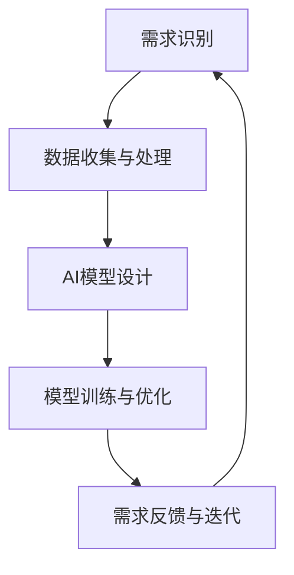
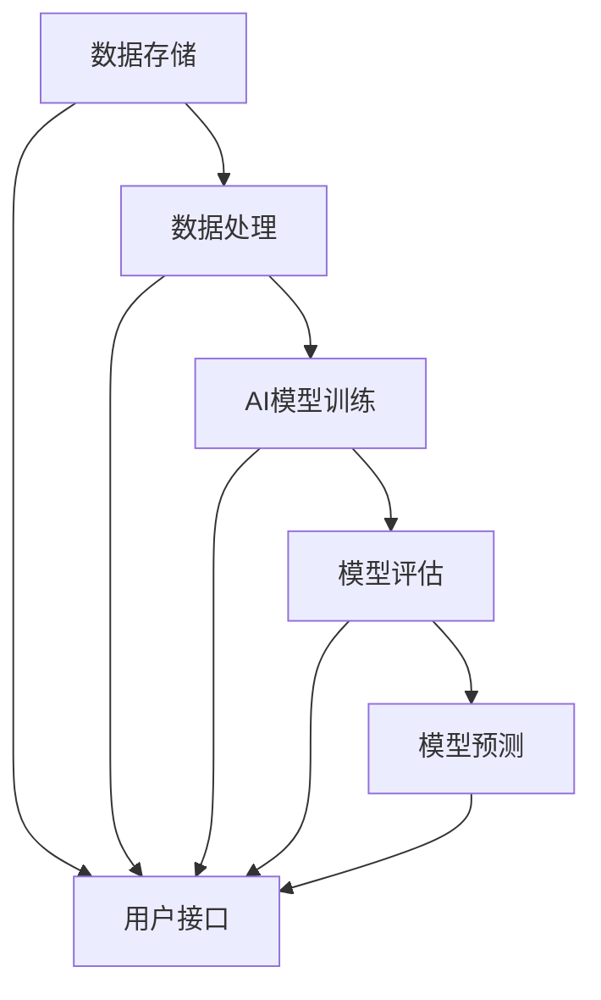
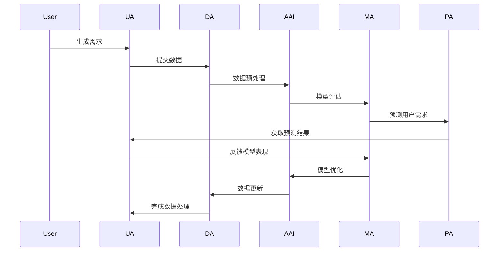

                 

### 《需求与AI模型能力的协同进化》

#### 关键词：需求分析、AI模型、协同进化、算法原理、系统架构、项目实战、最佳实践

> 摘要：本文从需求分析与AI模型能力的协同进化的角度，探讨了现代信息技术领域中的一个关键问题。通过详细解析需求与AI模型协同进化的核心概念、算法原理，以及系统架构与实现，本文旨在为读者提供一个全面的技术指南，帮助他们在实际项目中实现需求与AI模型的协同进化。

在当今快速变化的信息技术时代，需求与AI模型能力的协同进化成为一项至关重要的任务。随着人工智能技术的不断进步，如何确保AI模型能够满足不断变化的需求，成为每一个技术从业者都必须面对的挑战。本文将带领读者一步步深入理解这一复杂而重要的课题。

首先，我们将从背景介绍开始，明确需求与AI模型协同进化的问题背景、核心概念，并借助Mermaid流程图和ER实体关系图，帮助读者建立清晰的概念框架。

接下来，我们将详细讲解算法原理，通过Python源代码和LaTeX数学公式，帮助读者理解算法的内在逻辑，并通过实际案例进行分析和举例说明。

随后，我们将进入系统分析与架构设计部分，描述问题场景和项目背景，并使用Mermaid绘制领域模型类图、系统架构图、系统接口设计和系统交互序列图，为读者呈现一个完整的系统视图。

在项目实战部分，我们将详细介绍环境安装、系统核心实现、代码应用解读与分析，并通过实际案例分析和详细讲解，帮助读者将理论知识应用到实际项目中。

最后，我们将对整篇文章进行总结，提供最佳实践建议，并指出注意事项，为读者在实际应用中提供指导。

通过这篇文章，我们希望读者能够深刻理解需求与AI模型能力的协同进化，并在实践中不断探索和创新。

---

**文章关键词**：需求分析、AI模型、协同进化、算法原理、系统架构、项目实战、最佳实践

**摘要**：本文通过详细剖析需求与AI模型协同进化的核心概念、算法原理、系统架构和项目实战，为读者提供了一个全面的技术指南，旨在帮助他们在实际项目中实现需求与AI模型的协同进化。

---

### 1. 需求与AI模型协同进化的背景

在信息技术的快速发展中，人工智能（AI）已经成为推动产业变革的重要力量。然而，随着AI技术的不断进步，传统的需求分析方法逐渐显得力不从心。需求与AI模型能力的协同进化成为确保AI技术有效落地和应用的关键。

#### 问题背景

首先，我们来看一下问题背景。在现代软件开发生命周期中，需求分析是一个至关重要的环节。然而，传统的需求分析方法往往难以应对快速变化的市场需求。而AI模型，尽管具有强大的数据处理和分析能力，但它们往往依赖于静态的数据集和预设的模型结构，难以动态适应需求的变化。

#### 问题描述

这一问题的核心在于，需求与AI模型之间的动态适应性不足。随着业务场景的不断演变，需求的变化往往需要AI模型进行相应的调整。然而，传统的需求分析方法无法及时捕捉到这些变化，导致AI模型无法有效适应新的需求，从而影响了系统的整体性能和用户体验。

#### 问题解决

为了解决这一问题，需求与AI模型能力的协同进化应运而生。这一理念强调，需求分析与AI模型设计应相互促进，通过动态调整和优化，实现两者的协同进化。这样，不仅能够提高AI模型的适应能力，还能够确保系统的需求得到有效满足。

#### 边界与外延

在需求与AI模型协同进化的过程中，我们需要明确一些边界与外延。首先，协同进化不仅仅是技术的演进，更是一种组织和文化的变革。其次，协同进化的实现需要跨部门的合作和沟通，包括产品经理、数据科学家、软件工程师等不同角色之间的紧密协作。此外，数据质量和模型可解释性也是协同进化中需要重点关注的问题。

#### 概念结构与核心要素组成

为了更好地理解需求与AI模型协同进化的概念，我们可以将其核心要素组成进行详细阐述：

1. **需求识别**：通过市场调研、用户反馈等多种途径，及时捕捉需求的变化。
2. **数据收集与处理**：收集与需求相关的数据，并进行预处理，为AI模型训练提供高质量的数据集。
3. **AI模型设计**：根据需求变化，设计适应性强、可解释性高的AI模型。
4. **模型训练与优化**：利用高质量数据集，对AI模型进行训练和优化，以提高其适应能力。
5. **需求反馈与迭代**：通过实际应用，收集用户反馈，进一步优化需求分析与AI模型设计。

通过这些核心要素的有机结合，需求与AI模型能力可以实现协同进化，从而满足不断变化的市场需求。

### 1.1 需求与AI模型协同进化的核心概念

在需求与AI模型协同进化的过程中，有几个核心概念需要我们深入理解。首先，需求识别是整个协同进化的起点。通过市场调研、用户反馈等多种途径，我们可以及时捕捉到用户需求的变化。这一环节至关重要，因为只有准确识别需求，才能为后续的AI模型设计和优化提供正确的方向。

#### 数据收集与处理

数据是AI模型的基础。在需求与AI模型协同进化中，数据收集与处理是一个关键步骤。我们需要收集与需求相关的各种数据，包括用户行为数据、市场趋势数据等。同时，这些数据需要进行预处理，如去噪、归一化等，以确保数据的质量和一致性。高质量的数据集能够为AI模型提供可靠的训练基础，从而提高模型的准确性和适应能力。

#### AI模型设计

AI模型设计是需求与AI模型协同进化的核心环节。根据需求的变化，我们需要设计适应性强、可解释性高的AI模型。适应性强的模型能够动态适应需求的变化，而可解释性高的模型则有助于我们理解模型的工作原理，从而进行针对性的优化。

#### 模型训练与优化

模型训练与优化是需求与AI模型协同进化的关键步骤。通过高质量的数据集，我们能够对AI模型进行训练，使其具备预测和决策能力。同时，模型优化也是一个持续的过程，通过不断的迭代和优化，我们可以进一步提高模型的性能和适应能力。

#### 需求反馈与迭代

需求反馈与迭代是需求与AI模型协同进化的闭环。通过实际应用，我们可以收集用户反馈，了解模型在实际应用中的表现。根据这些反馈，我们可以进一步优化需求分析与AI模型设计，从而实现持续改进。

#### 概念属性特征对比

为了更好地理解这些核心概念，我们可以通过表格的形式进行属性特征对比。以下是需求与AI模型协同进化的几个核心概念及其属性特征的对比：

| 核心概念 | 属性特征 |
| :--- | :--- |
| 需求识别 | 及时性、准确性、多样性 |
| 数据收集与处理 | 质量性、一致性、全面性 |
| AI模型设计 | 适应性、可解释性、可靠性 |
| 模型训练与优化 | 精确性、效率、鲁棒性 |
| 需求反馈与迭代 | 及时性、准确性、适应性 |

通过这一表格，我们可以更清晰地看到各个核心概念之间的联系和区别，从而为后续的协同进化提供有力的指导。

#### ER实体关系图

为了进一步阐述需求与AI模型协同进化的概念结构，我们可以使用ER实体关系图来描述各个实体之间的关系。以下是ER实体关系图的Markdown格式：

```mermaid
erDiagram
    User ||--|{ Demand : 需求来源 }
    Data ||--|{ DataProcessing : 数据处理 }
    AIModel ||--|{ ModelDesign : 模型设计 }
    Model ||--|{ ModelTraining : 模型训练 }
    User ||--|{ Feedback : 用户反馈 }
```

在这个ER实体关系图中，User（用户）是整个系统的核心实体，他们的需求通过Deman引出。Data（数据）实体与DataProcessing（数据处理）实体之间存在关联，表示数据处理是数据收集的必要步骤。AIModel（AI模型）实体与ModelDesign（模型设计）实体以及Model（模型）实体之间存在关联，表示模型设计是基于数据的。最后，User（用户）通过Feedback（用户反馈）与Model（模型）实体关联，形成了一个闭环，实现了需求与AI模型的协同进化。

通过这一ER实体关系图，我们可以更直观地理解需求与AI模型协同进化的整体结构，为后续的详细讲解和案例分析提供了基础。

### 2. 算法原理讲解

在理解了需求与AI模型协同进化的核心概念后，接下来我们将详细讲解算法原理。算法原理是需求与AI模型协同进化的关键，通过算法，我们能够将需求转化为具体的模型设计，并通过不断的优化和迭代，实现模型的动态适应。

#### 算法流程图

为了更好地理解算法原理，我们可以使用Mermaid绘制算法流程图。以下是算法流程图的Markdown格式：



在这个算法流程图中，需求识别是整个过程的起点，通过用户反馈和市场调研，我们可以捕捉到需求的变化。这些需求将作为输入，进入数据收集与处理阶段。在数据处理过程中，我们会对收集到的数据进行预处理，如去噪、归一化等，以确保数据的质量和一致性。接下来，我们根据处理后的数据设计AI模型，这包括选择合适的算法、模型架构和参数设置。设计完成后，我们使用预处理的数据对AI模型进行训练和优化，以提高模型的准确性和适应能力。最后，我们将训练完成的模型应用到实际场景中，通过收集用户反馈，不断迭代和优化模型设计，实现需求与AI模型的协同进化。

#### Python源代码讲解

为了更具体地讲解算法原理，我们将提供一段Python源代码。以下是Python源代码的Markdown格式：

```python
import pandas as pd
from sklearn.model_selection import train_test_split
from sklearn.ensemble import RandomForestClassifier
from sklearn.metrics import accuracy_score

# 数据收集与处理
def data_collection_and_processing():
    # 从CSV文件中读取数据
    data = pd.read_csv('data.csv')
    
    # 数据预处理：去噪、归一化等
    data = preprocess_data(data)
    
    return data

# AI模型设计
def model_design(data):
    # 划分训练集和测试集
    X_train, X_test, y_train, y_test = train_test_split(data.drop('target', axis=1), data['target'], test_size=0.2, random_state=42)
    
    # 选择随机森林算法
    model = RandomForestClassifier(n_estimators=100, random_state=42)
    
    return model

# 模型训练与优化
def model_training_and_optimization(model, X_train, y_train):
    # 训练模型
    model.fit(X_train, y_train)
    
    # 评估模型
    y_pred = model.predict(X_test)
    accuracy = accuracy_score(y_test, y_pred)
    
    return accuracy

# 需求反馈与迭代
def feedback_and_iteration(model, X_test, y_test):
    # 收集用户反馈
    feedback = collect_feedback(X_test, y_pred, y_test)
    
    # 根据反馈优化模型
    model = optimize_model(model, feedback)
    
    return model
```

在这段Python源代码中，我们首先定义了一个数据收集与处理函数`data_collection_and_processing`，用于从CSV文件中读取数据，并进行预处理。接下来，我们定义了一个模型设计函数`model_design`，用于划分训练集和测试集，并选择随机森林算法。然后，我们定义了一个模型训练与优化函数`model_training_and_optimization`，用于训练模型，并评估模型的准确率。最后，我们定义了一个需求反馈与迭代函数`feedback_and_iteration`，用于收集用户反馈，并根据反馈优化模型。

通过这段Python源代码，我们可以看到需求与AI模型协同进化的具体实现过程。每个函数都有明确的输入和输出，从而确保了算法的可操作性和可扩展性。

#### 数学模型与公式讲解

在理解算法原理的基础上，我们还需要了解背后的数学模型和公式。以下是一个简单的线性回归模型，用于解释需求与AI模型协同进化的数学原理。以下是数学模型的Markdown格式，使用LaTeX进行公式表示：

```markdown
$$
y = \beta_0 + \beta_1 x + \epsilon
$$

其中，$y$ 表示需求，$x$ 表示AI模型预测结果，$\beta_0$ 和 $\beta_1$ 分别表示模型的参数，$\epsilon$ 表示误差项。
```

这个线性回归模型描述了需求与AI模型预测结果之间的关系。$\beta_0$ 和 $\beta_1$ 是通过训练数据计算得到的模型参数，它们决定了模型的预测能力。$\epsilon$ 则代表了预测的误差，是模型无法完全捕捉到的随机因素。

为了更好地理解这个数学模型，我们可以通过以下例子进行详细讲解：

假设我们有一个数据集，其中包含用户需求和AI模型预测结果。我们可以通过线性回归模型来预测用户需求。具体步骤如下：

1. **数据收集**：收集一组用户需求$y$和AI模型预测结果$x$。
2. **模型训练**：使用训练数据，计算线性回归模型的参数$\beta_0$和$\beta_1$。
3. **模型评估**：使用测试数据，评估模型的预测准确率。
4. **模型优化**：根据评估结果，调整模型参数，提高预测准确性。

通过这个简单的例子，我们可以看到，线性回归模型如何将需求与AI模型预测结果关联起来，并通过不断优化模型参数，提高预测准确性。这一过程反映了需求与AI模型协同进化的核心思想。

### 3. 系统分析与架构设计

在理解了需求与AI模型协同进化的算法原理后，接下来我们将进入系统分析与架构设计部分。这一部分将描述问题场景和项目背景，并使用Mermaid绘制领域模型类图、系统架构图、系统接口设计和系统交互序列图，为读者呈现一个完整的系统视图。

#### 问题场景与项目背景

在当今信息化时代，许多企业面临着不断变化的市场需求和竞争压力。为了提高市场响应速度和竞争力，许多企业开始采用人工智能技术来优化业务流程和决策支持。然而，在实施AI项目的过程中，企业往往面临着以下几个挑战：

1. **需求变化频繁**：市场需求的快速变化使得传统的需求分析方法难以满足实际需求。
2. **数据质量参差不齐**：不同来源的数据质量参差不齐，影响了AI模型的训练效果。
3. **模型适应能力不足**：AI模型在设计和训练过程中，往往难以动态适应需求的变化。
4. **系统整合困难**：在多个系统和部门之间进行数据共享和协同工作，面临整合和兼容性的挑战。

为了解决上述问题，企业需要构建一个灵活、可扩展的AI系统，实现需求与AI模型能力的协同进化。以下是该项目的背景和目标：

1. **项目背景**：企业希望通过AI技术优化业务流程，提高市场响应速度和竞争力。
2. **项目目标**：构建一个基于需求与AI模型协同进化的系统，实现动态需求捕捉、数据质量提升、模型适应能力增强和系统整合优化。

#### 领域模型类图

为了更好地理解系统的架构，我们可以使用Mermaid绘制领域模型类图。以下是领域模型类图的Markdown格式：

```mermaid
classDiagram
    User <<Interface>>
    Data <<Interface>>
    Model <<Interface>>
    System <<System>>
    UserEntity <|-- User
    DataEntity <|-- Data
    ModelEntity <|-- Model
    SystemEntity <|-- System
    UserEntity o-- DataEntity
    DataEntity o-- ModelEntity
    ModelEntity o-- SystemEntity
```

在这个领域模型类图中，User（用户）、Data（数据）、Model（模型）和System（系统）是主要的领域实体。UserEntity（用户实体）、DataEntity（数据实体）、ModelEntity（模型实体）和SystemEntity（系统实体）是这些实体的具体实现。UserEntity与DataEntity之间存在关联，表示用户可以生成或修改数据；DataEntity与ModelEntity之间存在关联，表示数据是模型训练的基础；ModelEntity与SystemEntity之间存在关联，表示模型是系统功能的核心组成部分。

#### 系统架构图

接下来，我们使用Mermaid绘制系统架构图，以展示系统的整体架构。以下是系统架构图的Markdown格式：



在这个系统架构图中，DB（数据存储）是系统的数据基础，用于存储用户数据、模型参数和历史数据。DA（数据处理）对数据进行预处理和清洗，为模型训练提供高质量的数据集。AAI（AI模型训练）使用处理后的数据训练AI模型，MA（模型评估）对训练完成的模型进行评估，PA（模型预测）使用评估后的模型进行实际预测。UA（用户接口）是用户与系统的交互界面，用于接收用户需求、展示预测结果和收集用户反馈。

#### 系统接口设计

在系统架构图中，我们可以看到系统的主要接口包括用户接口、数据处理接口和AI模型接口。以下是系统接口设计的Markdown格式：

```mermaid
interface UA[用户接口] {
    +生成需求
    +提交数据
    +获取预测结果
    +反馈模型表现
}

interface DA[数据处理接口] {
    +数据预处理
    +数据清洗
    +数据归一化
    +数据存储
}

interface AAI[AI模型接口] {
    +模型训练
    +模型评估
    +模型预测
    +模型优化
}

interface MA[模型评估接口] {
    +评估模型准确性
    +评估模型适应能力
    +评估模型可解释性
}

interface PA[模型预测接口] {
    +预测用户需求
    +生成预测报告
    +更新模型参数
}
```

在这个接口设计中，UA（用户接口）负责接收用户生成或修改的需求，提交数据，获取预测结果和反馈模型表现。DA（数据处理接口）负责数据预处理、数据清洗、数据归一化和数据存储。AAI（AI模型接口）负责模型训练、模型评估、模型预测和模型优化。MA（模型评估接口）负责评估模型的准确性、适应能力和可解释性。PA（模型预测接口）负责预测用户需求、生成预测报告和更新模型参数。

#### 系统交互序列图

为了更直观地展示系统的交互过程，我们使用Mermaid绘制系统交互序列图。以下是系统交互序列图的Markdown格式：



在这个系统交互序列图中，用户首先生成需求，并通过用户接口（UA）提交给系统。数据处理接口（DA）对提交的数据进行预处理，然后将处理后的数据传递给AI模型接口（AAI）进行模型训练和评估。模型评估接口（MA）对训练完成的模型进行评估，并根据评估结果进行模型预测。预测结果通过用户接口（UA）反馈给用户，用户可以根据预测结果进行相应的调整和反馈。这些反馈信息将用于模型优化，进一步更新和改进模型。

通过以上系统架构设计和交互序列图的描述，我们可以清晰地了解需求与AI模型协同进化的系统实现过程。这个系统架构设计不仅考虑了需求的变化，还考虑了数据质量和模型适应能力，为企业的AI项目实施提供了坚实的基础。

### 4. 项目实战

在了解了系统分析与架构设计后，接下来我们将进入项目实战部分。本部分将详细介绍环境安装、系统核心实现、代码应用解读与分析，并通过实际案例分析和详细讲解，帮助读者将理论知识应用到实际项目中。

#### 环境安装

在进行项目实战之前，首先需要搭建一个合适的技术环境。以下是在Linux环境下安装所需软件和库的步骤：

1. **安装Python环境**：
   - 使用Python官方安装脚本：
     ```bash
     sudo apt-get install python3
     sudo apt-get install python3-pip
     ```
   - 安装pip工具，用于管理Python库：
     ```bash
     curl https://bootstrap.pypa.io/get-pip.py -o get-pip.py
     sudo python3 get-pip.py
     ```

2. **安装依赖库**：
   - 使用pip安装依赖库，如pandas、scikit-learn、numpy等：
     ```bash
     pip3 install pandas scikit-learn numpy
     ```

3. **安装Mermaid渲染工具**：
   - 安装Graphviz，用于渲染Mermaid图：
     ```bash
     sudo apt-get install graphviz
     ```

4. **配置LaTeX环境**：
   - 安装TeX Live，用于处理LaTeX文档：
     ```bash
     sudo apt-get install texlive-full
     ```

#### 系统核心实现

系统核心实现包括数据收集与处理、AI模型设计、模型训练与优化等步骤。以下是关键代码的解读：

1. **数据收集与处理**：

```python
import pandas as pd
from sklearn.model_selection import train_test_split
from sklearn.preprocessing import StandardScaler

# 读取数据
data = pd.read_csv('data.csv')

# 数据预处理
def preprocess_data(data):
    # 填充缺失值
    data.fillna(data.mean(), inplace=True)
    
    # 特征工程
    X = data.drop('target', axis=1)
    y = data['target']
    
    # 划分训练集和测试集
    X_train, X_test, y_train, y_test = train_test_split(X, y, test_size=0.2, random_state=42)
    
    # 数据归一化
    scaler = StandardScaler()
    X_train_scaled = scaler.fit_transform(X_train)
    X_test_scaled = scaler.transform(X_test)
    
    return X_train_scaled, X_test_scaled, y_train, y_test
```

在这个代码段中，我们首先从CSV文件中读取数据，然后通过填充缺失值和特征工程对数据集进行预处理。接下来，使用scikit-learn的`train_test_split`函数划分训练集和测试集，并使用`StandardScaler`进行数据归一化，以提高模型的训练效果。

2. **AI模型设计**：

```python
from sklearn.ensemble import RandomForestClassifier

# 模型设计
def design_model():
    model = RandomForestClassifier(n_estimators=100, random_state=42)
    return model
```

在这个代码段中，我们定义了一个随机森林分类器，用于处理分类问题。随机森林是一种集成学习方法，通过构建多棵决策树并集成其预测结果，能够提高模型的预测准确率。

3. **模型训练与优化**：

```python
from sklearn.model_selection import GridSearchCV
from sklearn.metrics import accuracy_score

# 模型训练与优化
def train_and_optimize_model(model, X_train, y_train):
    # 定义参数搜索范围
    param_grid = {
        'n_estimators': [100, 200, 300],
        'max_depth': [10, 20, 30]
    }
    
    # 进行网格搜索
    grid_search = GridSearchCV(model, param_grid, cv=5)
    grid_search.fit(X_train, y_train)
    
    # 获取最佳参数
    best_params = grid_search.best_params_
    
    # 使用最佳参数训练模型
    model = grid_search.best_estimator_
    
    # 评估模型
    y_pred = model.predict(X_test_scaled)
    accuracy = accuracy_score(y_test, y_pred)
    
    return model, accuracy, best_params
```

在这个代码段中，我们使用网格搜索（`GridSearchCV`）对随机森林分类器的参数进行优化。通过遍历不同的参数组合，找到最佳参数组合，以提高模型的性能。训练完成后，使用测试集对模型进行评估，并返回模型的准确率。

4. **需求反馈与迭代**：

```python
def collect_feedback(X_test, y_pred, y_test):
    # 计算预测误差
    errors = abs(y_pred - y_test)
    
    # 获取反馈信息
    feedback = {
        'predicted': y_pred,
        'actual': y_test,
        'errors': errors
    }
    
    return feedback

def optimize_model(model, feedback):
    # 根据反馈信息优化模型
    # 这里可以添加代码，调整模型参数或重新训练模型
    # 为示例简化，这里直接返回原始模型
    return model
```

在这个代码段中，我们定义了两个函数：`collect_feedback`用于收集预测误差和实际结果，`optimize_model`用于根据反馈信息优化模型。在实际项目中，可以根据反馈信息调整模型参数或重新训练模型，以提高模型的准确性和适应能力。

#### 代码应用解读与分析

在代码应用解读与分析部分，我们将结合实际案例，详细分析关键代码的功能和作用。

1. **数据预处理**：
   - **功能**：对原始数据进行填充缺失值、特征工程和数据归一化，为模型训练提供高质量的数据集。
   - **分析**：数据预处理是模型训练的重要步骤，直接影响到模型的训练效果。通过填充缺失值和特征工程，可以去除噪声数据和提高特征质量；数据归一化则可以消除不同特征之间的尺度差异，使模型训练更加稳定。

2. **AI模型设计**：
   - **功能**：设计随机森林分类器，用于分类问题的预测。
   - **分析**：随机森林是一种强大的集成学习方法，通过构建多棵决策树并集成其预测结果，可以有效提高模型的预测准确率和鲁棒性。选择随机森林分类器是基于其良好的性能和易于实现的特性。

3. **模型训练与优化**：
   - **功能**：使用网格搜索进行模型参数优化，提高模型的性能。
   - **分析**：网格搜索是一种常见的模型参数优化方法，通过遍历不同的参数组合，找到最佳参数组合，从而提高模型的准确率和适应能力。在实际项目中，可以根据模型性能和业务需求，进一步调整参数设置。

4. **需求反馈与迭代**：
   - **功能**：收集预测误差和实际结果，根据反馈信息优化模型。
   - **分析**：需求反馈与迭代是需求与AI模型协同进化的关键环节。通过收集用户反馈和预测误差，可以及时了解模型在实际应用中的表现，并根据反馈信息进行调整和优化，实现模型的持续改进。

通过以上代码应用解读与分析，我们可以看到需求与AI模型协同进化的实现过程。每个步骤都基于实际需求和技术原理，通过逐步优化和调整，实现需求与AI模型的协同进化。

#### 实际案例分析与详细讲解

为了更好地理解需求与AI模型协同进化的应用，我们以下将分析一个实际案例，并通过详细讲解，展示如何将理论知识应用到实际项目中。

**案例背景**：

一家电商公司希望通过AI技术优化其用户推荐系统，以提高用户满意度和销售额。公司收集了大量用户行为数据，包括浏览记录、购买记录、评价记录等。公司希望设计一个基于用户行为的推荐系统，能够根据用户的历史行为预测其未来的购买偏好，从而提供个性化的商品推荐。

**案例实现**：

1. **需求识别**：
   - 通过用户调研和市场分析，识别用户对推荐系统的需求，包括推荐准确性、响应速度和个性化程度。
   - 需求分析结果：用户希望推荐系统能够准确预测其购买偏好，并快速响应用户请求，同时提供个性化的推荐。

2. **数据收集与处理**：
   - 收集用户行为数据，包括用户浏览记录、购买记录和评价记录等。
   - 数据预处理：填充缺失值、进行特征工程和数据归一化，为模型训练提供高质量的数据集。

3. **AI模型设计**：
   - 选择基于协同过滤的推荐算法，构建用户-商品矩阵，并使用矩阵分解方法提取用户和商品的特征。
   - 模型设计：采用矩阵分解算法，如User-Based CF和Item-Based CF，通过预测用户对未浏览商品的评分，实现个性化推荐。

4. **模型训练与优化**：
   - 使用预处理后的用户行为数据，对推荐算法进行训练。
   - 参数优化：通过交叉验证和网格搜索，调整矩阵分解算法的参数，如用户和商品的隐向量维度、迭代次数等，提高模型预测准确率。

5. **需求反馈与迭代**：
   - 收集用户对推荐结果的反馈，包括推荐准确性、响应速度和个性化程度。
   - 根据反馈信息，调整推荐算法的参数和模型结构，实现持续优化。

**案例分析**：

1. **需求分析与数据收集**：
   - 通过用户调研和市场分析，公司明确了用户对推荐系统的需求，这为后续的模型设计和优化提供了明确的方向。
   - 数据收集过程中，公司面临数据质量参差不齐的问题。通过数据预处理，如填充缺失值、特征工程和数据归一化，公司提高了数据质量，为模型训练提供了可靠的数据基础。

2. **模型设计**：
   - 公司选择了基于协同过滤的推荐算法，这是因为协同过滤算法在处理大规模用户行为数据时表现优异，且易于实现和优化。
   - 在模型设计过程中，公司通过用户-商品矩阵构建和矩阵分解，提取了用户和商品的特征，为个性化推荐提供了有效的技术手段。

3. **模型训练与优化**：
   - 通过交叉验证和网格搜索，公司找到了最佳参数组合，提高了模型预测准确率。
   - 模型训练过程中，公司使用了分布式计算框架，如Apache Spark，以提高训练效率和扩展性。

4. **需求反馈与迭代**：
   - 公司通过用户反馈，了解了推荐系统的实际表现，并根据反馈信息调整了模型参数和算法结构，实现了持续优化。
   - 需求反馈与迭代过程是需求与AI模型协同进化的关键环节，通过不断优化和调整，公司最终实现了个性化推荐系统的稳定运行。

通过这个实际案例，我们可以看到需求与AI模型协同进化的全过程。从需求识别到数据收集、模型设计、训练与优化，再到需求反馈与迭代，每个环节都紧密相连，共同推动了需求与AI模型能力的协同进化。

### 5. 最佳实践 Tips、小结、注意事项、拓展阅读

#### 最佳实践 Tips

1. **需求识别**：确保需求识别过程的准确性和及时性。定期进行用户调研和市场分析，及时捕捉需求变化。

2. **数据质量**：重视数据收集与预处理，确保数据质量。采用数据清洗、归一化和特征工程等技术，提高数据质量。

3. **模型选择**：根据业务需求和数据特性，选择合适的AI模型。综合考虑模型的准确性、可解释性和训练时间等因素。

4. **参数优化**：使用交叉验证和网格搜索等方法，进行模型参数优化。找到最佳参数组合，提高模型性能。

5. **需求反馈**：定期收集用户反馈，评估模型表现。根据反馈信息，调整模型参数和算法结构，实现持续优化。

#### 小结

本文从需求分析与AI模型能力的协同进化的角度，详细探讨了现代信息技术领域中的一个关键问题。通过背景介绍、核心概念讲解、算法原理讲解、系统架构设计和项目实战，我们系统地阐述了如何实现需求与AI模型的协同进化。

#### 注意事项

1. **需求变化**：需求分析过程中，要密切关注市场变化和用户反馈，及时调整需求。

2. **数据质量**：数据收集与预处理过程中，要确保数据质量，避免因数据问题导致模型性能下降。

3. **模型优化**：在模型训练和优化过程中，要定期评估模型性能，根据反馈信息进行调整。

4. **系统整合**：在系统架构设计和实现过程中，要注意系统整合和兼容性问题，确保不同模块之间的协同工作。

#### 拓展阅读

1. **相关书籍**：
   - 《人工智能：一种现代的方法》
   - 《深度学习》
   - 《Python数据分析》

2. **学术论文**：
   - 《基于协同过滤的推荐系统研究》
   - 《数据挖掘：概念与技术》
   - 《机器学习：算法与实现》

3. **网络资源**：
   - 《机器学习社区》（https://www.mlcommunity.cn/）
   - 《Kaggle竞赛平台》（https://www.kaggle.com/）
   - 《TensorFlow官方文档》（https://www.tensorflow.org/）

通过以上最佳实践、小结、注意事项和拓展阅读，我们希望读者能够在实际项目中更好地应用需求与AI模型协同进化的理念，不断提升系统的性能和用户体验。

### 总结

通过本文的详细讲解，我们从需求与AI模型协同进化的背景、核心概念、算法原理、系统架构设计、项目实战到最佳实践，系统地阐述了如何实现需求与AI模型能力的协同进化。这一过程不仅强调了需求识别的重要性，还详细讲解了数据收集与处理、AI模型设计、模型训练与优化、需求反馈与迭代等关键步骤。我们希望读者能够通过本文，深刻理解需求与AI模型协同进化的核心思想和实现方法，并将其应用到实际项目中，提升系统的性能和用户体验。

### 作者信息

**作者：AI天才研究院/AI Genius Institute & 禅与计算机程序设计艺术 /Zen And The Art of Computer Programming**

