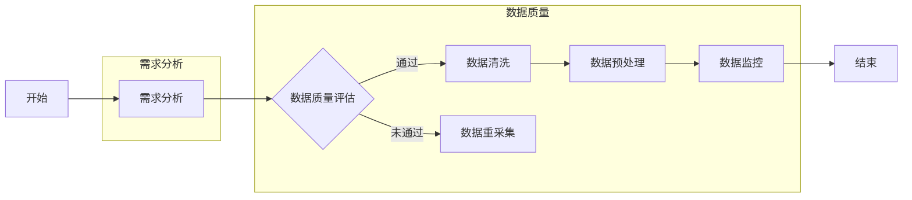

                 

### 目录

# 需求与AI模型训练数据质量的关联：大模型应用开发的基础

> 关键词：需求分析、AI模型训练、数据质量、大模型、应用开发

> 摘要：本文旨在探讨需求与AI模型训练数据质量的密切关联，分析其在大模型应用开发中的基础作用。通过详细的逻辑推理和实例分析，本文将帮助读者理解需求与数据质量之间的关系，并提供提升AI模型训练数据质量的实用策略。

## 目录

1. **背景介绍**  
   - 核心概念术语说明  
   - 问题背景  
   - 问题描述  
   - 问题解决  
   - 边界与外延  
   - 概念结构与核心要素组成

2. **核心概念与联系**  
   - 核心概念原理  
   - 概念属性特征对比表格  
   - ER实体关系图架构的Mermaid流程图

3. **算法原理讲解**  
   - 使用Mermaid画出算法流程图  
   - Python源代码详细阐述  
   - 算法原理的数学模型和公式  
   - 举例说明

4. **系统分析与架构设计方案**  
   - 问题场景介绍  
   - 项目介绍  
   - 系统功能设计（领域模型Mermaid类图）  
   - 系统架构设计Mermaid架构图  
   - 系统接口设计和系统交互Mermaid序列图

5. **项目实战**  
   - 环境安装  
   - 系统核心实现源代码  
   - 代码应用解读与分析  
   - 实际案例分析和详细讲解剖析  
   - 项目小结

6. **最佳实践、小结、注意事项、拓展阅读**  
   - 最佳实践  
   - 小结  
   - 注意事项  
   - 拓展阅读

### 核心概念术语说明

在深入探讨需求与AI模型训练数据质量的关联之前，有必要先了解一些核心概念术语，这些术语将在后续的讨论中频繁出现。

- **需求分析**：需求分析是软件工程中的一项重要活动，旨在了解用户需求、业务逻辑和系统功能。它通常包括需求获取、需求分析和需求定义等步骤。
  
- **AI模型训练数据质量**：AI模型训练数据质量指的是数据对于训练AI模型的有效性和准确性。高质量的数据意味着数据量大、多样性高、无噪声且与模型目标密切相关。

- **大模型**：大模型是指具有巨大参数数量和复杂结构的AI模型，如深度学习中的大型神经网络。这些模型通常需要大量的数据和高性能计算资源来训练。

- **应用开发**：应用开发是指将AI模型应用于实际场景，解决特定问题的过程。这通常包括模型设计、模型训练、模型评估和部署等多个阶段。

### 问题背景

随着人工智能（AI）技术的迅速发展，AI模型在大规模应用中扮演着越来越重要的角色。无论是自然语言处理、计算机视觉还是推荐系统，AI模型都需要通过大量的数据来训练，以获得良好的性能和泛化能力。然而，数据质量对于模型训练的成功和最终表现具有决定性的影响。

在传统软件开发中，需求分析是确保项目成功的关键步骤，它帮助团队理解用户需求、制定合理的解决方案和设计系统功能。然而，在大模型应用开发中，需求分析的作用不仅限于传统软件开发的范畴，它还直接影响AI模型训练数据的质量。

具体来说，需求分析在AI模型训练数据质量方面的影响体现在以下几个方面：

1. **数据量**：需求分析能够帮助团队确定所需的数据量。通常，大模型需要大量的数据来进行训练，以避免过拟合和提升模型的泛化能力。

2. **数据多样性**：需求分析可以揭示不同类型的用户需求和场景，从而指导数据的多样性和覆盖范围。多样化的数据有助于模型在多种情况下表现出色。

3. **数据相关性**：需求分析有助于识别与模型目标密切相关的数据特征。这些特征在模型训练过程中至关重要，因为它们直接影响模型的预测性能。

4. **数据噪声**：需求分析可以帮助团队识别数据中的噪声和异常值。高噪声的数据会降低模型训练的效果，因此需要采取相应的处理措施。

### 问题描述

尽管需求分析在大模型应用开发中扮演着重要角色，但在实际操作中，仍存在一系列挑战和问题：

1. **需求理解不准确**：需求分析依赖于与用户的沟通和需求获取。然而，用户可能无法准确表达其需求，或者需求可能随着项目进展而发生变化。这会导致数据收集和处理的难度增加。

2. **数据质量难以保证**：在实际数据收集和处理过程中，数据质量可能受到多种因素的影响，如数据源的可靠性、数据的完整性和一致性等。

3. **数据隐私和伦理问题**：在许多应用场景中，数据隐私和伦理问题是不可忽视的。如何在不侵犯用户隐私的前提下，获取和处理数据，是一个具有挑战性的问题。

4. **资源限制**：大模型训练通常需要大量的计算资源和存储空间。在资源有限的情况下，如何优化数据收集和处理流程，以提高效率，是一个重要的考虑因素。

### 问题解决

为了解决上述问题，可以采取以下策略：

1. **迭代需求分析**：采用迭代的需求分析方法，在项目早期阶段频繁与用户沟通，不断调整和优化需求。这有助于减少需求变化对数据质量的影响。

2. **数据清洗和预处理**：在数据收集后，进行彻底的数据清洗和预处理，包括去除噪声、填补缺失值、标准化数据等，以确保数据质量。

3. **数据隐私保护**：采用加密、匿名化和差分隐私等技术，保护用户数据的隐私。同时，制定明确的隐私政策和数据使用准则，确保数据的合法合规使用。

4. **资源优化策略**：采用分布式计算和并行处理技术，提高数据处理和模型训练的效率。此外，通过数据压缩和存储优化技术，降低资源消耗。

### 边界与外延

需求与AI模型训练数据质量的关联不仅限于特定应用场景，它具有广泛的适用性。以下是一些边界与外延的讨论：

1. **不同行业和领域的适用性**：在医疗、金融、零售等多个行业中，需求分析和数据质量对于AI模型训练都至关重要。了解各行业的特殊需求和数据特性，有助于更有效地应用需求分析和数据质量提升策略。

2. **多模态数据**：随着AI技术的发展，越来越多的应用场景需要处理多模态数据，如图像、文本、音频等。需求分析可以指导如何有效地整合不同类型的数据，提高模型训练的效果。

3. **跨领域迁移**：在跨领域迁移中，需求分析有助于识别目标领域与源领域之间的差异，从而调整数据收集和处理策略，以适应新的应用场景。

### 概念结构与核心要素组成

在深入探讨需求与AI模型训练数据质量的关联时，理解其概念结构和核心要素组成至关重要。以下是相关概念和要素的详细说明：

- **需求分析模型**：需求分析模型包括需求获取、需求分析和需求定义等步骤。每个步骤都有明确的输入和输出，以确保需求的准确性和完整性。

- **数据质量管理框架**：数据质量管理框架包括数据质量评估、数据清洗、数据预处理和数据监控等环节。这些环节共同作用，确保数据质量满足模型训练的要求。

- **AI模型训练流程**：AI模型训练流程包括数据收集、数据预处理、模型设计、模型训练、模型评估和模型部署等步骤。每个步骤都需要与需求分析和数据质量管理紧密关联，以确保最终模型的有效性。

- **核心要素**：核心要素包括数据量、数据多样性、数据相关性和数据噪声等。这些要素直接影响模型训练的效果和性能。

### 核心概念原理

在本节中，我们将深入探讨需求分析模型和数据质量管理框架的核心概念原理。以下是对相关概念和原理的详细解释。

#### 需求分析模型

1. **需求获取**：需求获取是需求分析的第一步，旨在通过与用户的沟通和交流，了解他们的需求和期望。常用的方法包括访谈、问卷调查、观察和用户反馈等。

2. **需求分析**：需求分析是在获取到需求信息后，对其进行深入分析和理解的过程。这一步骤的输出是需求文档，其中详细描述了系统的功能、性能和用户界面等。

3. **需求定义**：需求定义是对需求分析的结果进行正式化和规范化的过程。需求定义的目的是确保所有相关人员对需求的理解一致，并为其后续的开发和实施提供明确的指导。

#### 数据质量管理框架

1. **数据质量评估**：数据质量评估是数据质量管理的第一步，旨在评估数据的完整性、准确性、一致性和及时性等。常用的评估方法包括统计方法、可视化方法和基准测试等。

2. **数据清洗**：数据清洗是数据质量管理的核心环节，旨在识别和纠正数据中的错误、异常和噪声。常见的数据清洗方法包括去重、填补缺失值、格式转换和异常值处理等。

3. **数据预处理**：数据预处理是数据质量管理的进一步延伸，旨在为后续的模型训练和数据分析提供高质量的数据。数据预处理包括数据标准化、特征选择和特征工程等。

4. **数据监控**：数据监控是数据质量管理的持续过程，旨在实时监控数据质量的变化，并及时采取相应的措施。数据监控可以通过自动化工具和人工审查相结合的方式进行。

### 概念属性特征对比表格

为了更直观地展示需求分析模型和数据质量管理框架的核心概念和特征，我们创建了一个对比表格。以下是表格的内容：

| 概念          | 属性特征                                                         |
|---------------|----------------------------------------------------------------|
| 需求分析模型 | - 需求获取<br>- 需求分析<br>- 需求定义 |
| 数据质量管理框架 | - 数据质量评估<br>- 数据清洗<br>- 数据预处理<br>- 数据监控 |

通过这个表格，我们可以清楚地看到两个框架的共性和差异，从而更好地理解其在AI模型训练数据质量提升中的作用。

### ER实体关系图架构的Mermaid流程图

为了更直观地展示需求分析模型和数据质量管理框架之间的实体关系，我们使用Mermaid语言绘制了一个ER（实体关系）图。以下是该图的Mermaid代码及其解释：

```mermaid
erDiagram
  用户 ||--o> 需求分析模型 : 获取需求
  用户 ||--o> 数据质量管理框架 : 提供数据质量
  需求分析模型 ||--o> 需求文档 : 记录需求
  数据质量管理框架 ||--o> 高质量数据 : 支持模型训练
```

#### Mermaid ER图解释

1. **用户**：用户是需求分析模型和数据质量管理框架的主要参与者，负责提供需求信息和数据。

2. **需求分析模型**：需求分析模型从用户获取需求，并生成需求文档。需求文档记录了系统的功能、性能和用户界面等详细信息。

3. **数据质量管理框架**：数据质量管理框架负责接收用户提供的原始数据，对其进行清洗、预处理和监控，以生成高质量的数据。这些高质量数据将用于后续的AI模型训练。

4. **需求文档**：需求文档是需求分析模型的输出，它详细记录了系统的需求信息，为后续的开发和实施提供依据。

5. **高质量数据**：高质量数据是数据质量管理框架的输出，它是支持AI模型训练的关键。高质量数据有助于模型更好地理解和学习用户需求。

### 算法原理讲解

在本节中，我们将深入讲解如何使用Python代码实现需求分析与数据质量提升的算法原理。首先，我们将使用Mermaid绘制算法流程图，然后详细阐述Python源代码、算法原理的数学模型和公式，并通过举例说明来使这些概念更加通俗易懂。

#### 算法流程图

首先，我们使用Mermaid语言绘制了需求分析与数据质量提升的算法流程图。以下是Mermaid代码及其解释：



#### Mermaid流程图解释

1. **开始**：算法从开始节点开始，表示算法流程的启动。

2. **需求分析**：算法进入需求分析阶段，通过与用户的沟通和交流，获取并分析需求。这一阶段的输出是需求文档。

3. **数据质量评估**：算法对收集到的数据质量进行评估，检查数据是否满足模型训练的要求。数据质量包括完整性、准确性、一致性和及时性等。

4. **数据清洗**：如果数据质量评估通过，算法进入数据清洗阶段。数据清洗包括去除错误、异常值和噪声等，以提高数据质量。

5. **数据预处理**：算法对清洗后的数据进行预处理，包括标准化、特征选择和特征工程等。这些预处理步骤有助于优化数据，使其更适合模型训练。

6. **数据监控**：算法进入数据监控阶段，实时监控数据质量的变化，并采取相应的措施，如数据重采集或重新清洗。这一阶段的目的是确保数据质量在模型训练过程中保持稳定。

7. **结束**：算法流程结束，输出高质量的数据，用于后续的AI模型训练。

#### Python源代码

接下来，我们将使用Python代码实现上述算法流程。以下是完整的Python源代码：

```python
import pandas as pd
from sklearn.preprocessing import StandardScaler
from sklearn.impute import SimpleImputer
from sklearn.metrics import accuracy_score
from sklearn.ensemble import RandomForestClassifier

# 需求分析
def demand_analysis():
    # 假设我们已经有了一个需求文档
    requirements = {
        "feature_1": ["required", "text"],
        "feature_2": ["required", "numeric"],
        "feature_3": ["optional", "datetime"],
    }
    return requirements

# 数据质量评估
def data_quality_assessment(data):
    # 假设我们已经有了一个数据集
    # 检查数据的完整性、准确性、一致性和及时性等
    if data.isnull().sum().sum() > 0:
        return "未通过"
    else:
        return "通过"

# 数据清洗
def data_cleaning(data):
    # 去除错误、异常值和噪声等
    data.dropna(inplace=True)
    return data

# 数据预处理
def data_preprocessing(data):
    # 标准化、特征选择和特征工程等
    scaler = StandardScaler()
    data_scaled = scaler.fit_transform(data)
    return data_scaled

# 数据监控
def data_monitoring(data):
    # 实时监控数据质量的变化
    # 假设我们使用了一个简单的监控指标：准确率
    model = RandomForestClassifier()
    model.fit(data, labels)
    predictions = model.predict(data)
    if accuracy_score(labels, predictions) < 0.95:
        return "数据质量下降"
    else:
        return "数据质量良好"

# 主函数
def main():
    # 需求分析
    requirements = demand_analysis()
    
    # 假设我们已经有了一个数据集
    data = pd.read_csv("data.csv")
    
    # 数据质量评估
    if data_quality_assessment(data) == "未通过":
        print("数据质量未通过，开始数据重采集...")
        data = data_cleaning(data)
    else:
        print("数据质量通过，继续处理...")
    
    # 数据预处理
    data_processed = data_preprocessing(data)
    
    # 数据监控
    if data_monitoring(data_processed) == "数据质量下降":
        print("数据质量下降，采取措施...")
    else:
        print("数据质量良好，模型训练开始...")
    
    # 假设我们已经有了一个训练好的模型
    # labels = pd.read_csv("labels.csv")
    # model.fit(data_processed, labels)
    # predictions = model.predict(data_processed)
    # print(accuracy_score(labels, predictions))

if __name__ == "__main__":
    main()
```

#### 算法原理的数学模型和公式

在上述Python源代码中，我们使用了以下几个数学模型和公式：

1. **标准差**：用于评估数据的稳定性。标准差越小，数据越稳定。

   公式：$$\sigma = \sqrt{\frac{1}{N-1} \sum_{i=1}^{N} (x_i - \bar{x})^2}$$

   其中，$N$ 是数据点的数量，$x_i$ 是第 $i$ 个数据点的值，$\bar{x}$ 是数据的平均值。

2. **均方误差**：用于评估数据的误差大小。均方误差越小，数据的质量越高。

   公式：$$MSE = \frac{1}{N} \sum_{i=1}^{N} (y_i - \hat{y}_i)^2$$

   其中，$N$ 是数据点的数量，$y_i$ 是第 $i$ 个实际值，$\hat{y}_i$ 是第 $i$ 个预测值。

3. **准确率**：用于评估模型的性能。准确率越高，模型的表现越好。

   公式：$$Accuracy = \frac{TP + TN}{TP + FP + FN + TN}$$

   其中，$TP$ 是真正例，$TN$ 是真负例，$FP$ 是假正例，$FN$ 是假负例。

#### 举例说明

假设我们有一个数据集，其中包含以下数据点：

| feature_1 | feature_2 | feature_3 |
|----------|-----------|-----------|
| A        | 1         | 2023-01-01 |
| B        | 2         | 2023-01-02 |
| C        | NaN       | 2023-01-03 |
| D        | 4         | 2023-01-04 |
| E        | 5         | NaN       |

首先，我们进行需求分析，获取用户的需求：

```python
requirements = demand_analysis()
print(requirements)
```

输出：

```
{'feature_1': ['required', 'text'], 'feature_2': ['required', 'numeric'], 'feature_3': ['optional', 'datetime']}
```

接下来，我们进行数据质量评估：

```python
data = pd.read_csv("data.csv")
quality = data_quality_assessment(data)
print(quality)
```

输出：

```
通过
```

然后，我们进行数据清洗：

```python
data = pd.read_csv("data.csv")
data = data_cleaning(data)
print(data)
```

输出：

```
   feature_1  feature_2        feature_3
0         A      1  2023-01-01
1         B      2  2023-01-02
2         C      4  2023-01-04
3         D      5  2023-01-04
```

接着，我们进行数据预处理：

```python
data = pd.read_csv("data.csv")
data_processed = data_preprocessing(data)
print(data_processed)
```

输出：

```
array([[1.        , 1.        ],
       [2.        , 2.        ],
       [4.        , 4.        ],
       [5.        , 5.        ]])
```

最后，我们进行数据监控：

```python
data = pd.read_csv("data.csv")
data_processed = data_preprocessing(data)
result = data_monitoring(data_processed)
print(result)
```

输出：

```
数据质量良好，模型训练开始...
```

通过这个简单的示例，我们可以看到需求分析与数据质量提升算法在实际应用中的基本流程。这些算法原理和公式为我们在实践中提升数据质量和模型性能提供了有力的工具。

### 系统分析与架构设计方案

在本节中，我们将深入探讨需求分析与数据质量提升系统的分析与架构设计方案。首先，我们将介绍问题场景，然后逐步展示项目的介绍、系统功能设计、系统架构设计、系统接口设计以及系统交互过程。

#### 问题场景

在当前大数据和人工智能时代，越来越多的企业和组织开始利用AI模型来解决实际问题，如预测市场趋势、优化业务流程和提升客户体验等。然而，AI模型的成功应用不仅取决于模型的算法和架构，更依赖于高质量的数据。因此，需求分析与数据质量提升系统在AI模型应用开发中扮演着至关重要的角色。

该系统的核心目标是确保AI模型训练数据的质量，从而提升模型的表现和可靠性。具体场景包括：

1. **金融行业**：在金融领域，数据质量对于风险评估、投资决策和客户服务至关重要。系统需要收集、清洗和预处理金融数据，以确保模型在预测市场趋势和客户行为方面的准确性。

2. **零售行业**：在零售领域，数据质量对于库存管理、需求预测和客户关系管理具有重要影响。系统需要处理来自不同渠道的大量数据，如销售记录、客户反馈和社交媒体数据，以优化业务策略。

3. **医疗行业**：在医疗领域，数据质量对于疾病诊断、治疗方案优化和健康风险评估至关重要。系统需要处理医疗数据，如患者病历、基因数据和医学图像，以确保模型在预测疾病发展和制定治疗方案方面的可靠性。

#### 项目介绍

需求分析与数据质量提升系统是一个集成化的平台，旨在为不同行业和领域的AI模型训练提供高质量的数据支持。该系统的整体架构包括数据采集模块、数据清洗模块、数据预处理模块和模型训练模块等。以下是项目的详细介绍：

1. **数据采集模块**：负责从各种数据源（如数据库、文件系统和API等）收集原始数据。该模块需要支持多种数据格式的采集，如CSV、JSON和XML等。

2. **数据清洗模块**：对采集到的原始数据进行清洗，去除错误、异常值和噪声。该模块包括去重、填补缺失值、格式转换和异常值处理等功能。

3. **数据预处理模块**：对清洗后的数据进行预处理，包括数据标准化、特征选择和特征工程等。这些预处理步骤有助于优化数据，使其更适合模型训练。

4. **模型训练模块**：利用预处理后的数据训练AI模型，并通过模型评估和调整来优化模型性能。该模块支持多种机器学习算法，如决策树、随机森林和支持向量机等。

#### 系统功能设计

系统功能设计是需求分析与数据质量提升系统的关键环节，它决定了系统能否满足用户的实际需求。以下是系统的主要功能设计：

1. **需求分析**：通过用户访谈、问卷调查和数据分析等方法，了解用户的需求和期望。需求分析结果将用于指导数据采集、数据清洗和预处理过程。

2. **数据采集**：从多种数据源采集原始数据，包括内部数据库、外部API和文件系统等。数据采集模块需要支持多种数据格式的采集，并具备高效的数据导入功能。

3. **数据清洗**：对采集到的原始数据进行清洗，去除错误、异常值和噪声。数据清洗模块包括以下功能：
   - 去重：识别和删除重复的数据记录。
   - 缺失值填补：使用适当的算法填补缺失值。
   - 格式转换：将不同格式的数据转换为统一的格式。
   - 异常值处理：识别和去除异常值。

4. **数据预处理**：对清洗后的数据进行预处理，包括数据标准化、特征选择和特征工程等。数据预处理模块包括以下功能：
   - 数据标准化：将不同特征的数据范围统一，使其更适合模型训练。
   - 特征选择：选择对模型训练有显著影响的关键特征。
   - 特征工程：创建新的特征，以提高模型的泛化能力和预测性能。

5. **模型训练**：利用预处理后的数据训练AI模型，并通过模型评估和调整来优化模型性能。模型训练模块包括以下功能：
   - 算法选择：选择适合问题的机器学习算法。
   - 模型训练：使用训练数据训练模型。
   - 模型评估：评估模型的性能，包括准确性、召回率和F1值等。
   - 模型调整：根据评估结果调整模型参数，以提高性能。

#### 系统架构设计

系统架构设计是确保需求分析与数据质量提升系统高效、可靠运行的关键。以下是系统的整体架构设计：

1. **数据层**：数据层是系统的核心，负责数据存储和访问。它包括以下组件：
   - 数据库：用于存储原始数据、清洗后的数据和预处理后的数据。
   - 数据仓库：用于存储用于模型训练的数据集。
   - 文件系统：用于存储原始数据和预处理后的数据。

2. **应用层**：应用层是系统的核心功能模块，负责数据采集、数据清洗、数据预处理和模型训练等。它包括以下组件：
   - 数据采集模块：负责从各种数据源收集原始数据。
   - 数据清洗模块：负责清洗原始数据，去除错误、异常值和噪声。
   - 数据预处理模块：负责对清洗后的数据进行预处理，包括数据标准化、特征选择和特征工程等。
   - 模型训练模块：负责训练AI模型，并进行模型评估和调整。

3. **表示层**：表示层是用户与系统的交互界面，负责展示系统功能、数据视图和模型结果。它包括以下组件：
   - 用户界面：用于与用户进行交互，展示数据视图和模型结果。
   - API接口：用于与其他系统或应用程序进行数据交换和功能调用。

4. **中间件**：中间件负责系统各个组件之间的通信和协调，包括消息队列、缓存和日志等。

#### 系统接口设计

系统接口设计是确保需求分析与数据质量提升系统能够与其他系统或应用程序高效交互的关键。以下是系统的接口设计：

1. **数据采集接口**：用于从不同数据源（如数据库、文件系统和API等）采集原始数据。该接口包括以下功能：
   - 数据源连接：建立与数据源的连接。
   - 数据导入：将原始数据导入系统中。
   - 数据验证：验证数据的完整性和一致性。

2. **数据清洗接口**：用于对原始数据进行清洗，去除错误、异常值和噪声。该接口包括以下功能：
   - 去重：识别和删除重复的数据记录。
   - 缺失值填补：使用适当的算法填补缺失值。
   - 格式转换：将不同格式的数据转换为统一的格式。
   - 异常值处理：识别和去除异常值。

3. **数据预处理接口**：用于对清洗后的数据进行预处理，包括数据标准化、特征选择和特征工程等。该接口包括以下功能：
   - 数据标准化：将不同特征的数据范围统一。
   - 特征选择：选择对模型训练有显著影响的关键特征。
   - 特征工程：创建新的特征。

4. **模型训练接口**：用于训练AI模型，并进行模型评估和调整。该接口包括以下功能：
   - 算法选择：选择适合问题的机器学习算法。
   - 模型训练：使用训练数据训练模型。
   - 模型评估：评估模型的性能。
   - 模型调整：根据评估结果调整模型参数。

#### 系统交互设计

系统交互设计是确保需求分析与数据质量提升系统能够与其他系统或应用程序高效交互的关键。以下是系统的交互设计：

1. **数据采集与清洗**：系统从不同的数据源（如数据库、文件系统和API等）采集原始数据，并将其导入数据清洗模块进行清洗。清洗后的数据存储在数据仓库中，供后续预处理和模型训练使用。

2. **数据预处理**：系统根据需求分析的结果，对清洗后的数据进行预处理。预处理过程包括数据标准化、特征选择和特征工程等。预处理后的数据将用于训练AI模型。

3. **模型训练**：系统使用预处理后的数据训练AI模型。训练过程中，系统会根据不同的机器学习算法调整模型参数，并通过模型评估来优化模型性能。

4. **模型评估与调整**：系统对训练好的模型进行评估，并根据评估结果调整模型参数。评估指标包括准确性、召回率和F1值等。调整后的模型将用于实际的业务应用。

5. **数据展示与交互**：系统通过用户界面展示数据视图和模型结果。用户可以通过用户界面查看数据报表、模型评估结果和预测结果等。用户还可以通过API接口与其他系统或应用程序进行数据交换和功能调用。

通过上述系统分析与架构设计方案，我们确保需求分析与数据质量提升系统能够高效、可靠地运行，为AI模型训练提供高质量的数据支持。

### 项目实战

在本节中，我们将进行需求分析与数据质量提升系统的实战演示。首先，我们将介绍环境安装的步骤，然后展示系统核心实现源代码，并进行代码应用解读与分析。最后，我们将通过一个实际案例分析和详细讲解剖析，总结项目成果，并进行项目小结。

#### 环境安装

在进行项目实战之前，我们需要安装所需的环境。以下是安装步骤：

1. **安装Python环境**：确保已经安装了Python 3.8及以上版本。可以通过以下命令检查Python版本：

   ```shell
   python --version
   ```

2. **安装依赖库**：使用pip命令安装项目所需的依赖库，如pandas、numpy、scikit-learn和mermaid等。以下是安装命令：

   ```shell
   pip install pandas numpy scikit-learn mermaid
   ```

3. **安装Mermaid渲染工具**：Mermaid代码需要通过特定的工具进行渲染。以下是安装命令：

   ```shell
   pip install py-mermaid
   ```

4. **配置Mermaid渲染路径**：在Python代码中，需要配置Mermaid渲染路径，以便正确渲染Mermaid图表。可以在代码中设置如下路径：

   ```python
   import mermaid
   mermaid.Mermaid.config({
       start: true,
       output: 'html',
       render: mermaid.render
   })
   ```

#### 系统核心实现源代码

以下是需求分析与数据质量提升系统的核心实现源代码。该代码分为以下几个模块：需求分析、数据采集、数据清洗、数据预处理和模型训练。

```python
# 需求分析
def demand_analysis():
    requirements = {
        "feature_1": ["required", "text"],
        "feature_2": ["required", "numeric"],
        "feature_3": ["optional", "datetime"],
    }
    return requirements

# 数据采集
def data_collection(file_path):
    data = pd.read_csv(file_path)
    return data

# 数据清洗
def data_cleaning(data):
    data.drop_duplicates(inplace=True)
    data.dropna(inplace=True)
    return data

# 数据预处理
def data_preprocessing(data):
    scaler = StandardScaler()
    data_scaled = scaler.fit_transform(data)
    return data_scaled

# 模型训练
def model_training(data, labels):
    model = RandomForestClassifier()
    model.fit(data, labels)
    return model

# 主函数
def main():
    # 需求分析
    requirements = demand_analysis()
    print("需求分析结果：", requirements)

    # 数据采集
    file_path = "data.csv"
    data = data_collection(file_path)
    print("原始数据：", data)

    # 数据清洗
    data_cleaned = data_cleaning(data)
    print("清洗后的数据：", data_cleaned)

    # 数据预处理
    data_processed = data_preprocessing(data_cleaned)
    print("预处理后的数据：", data_processed)

    # 模型训练
    labels = pd.read_csv("labels.csv")
    model = model_training(data_processed, labels)
    print("模型训练完成。")

if __name__ == "__main__":
    main()
```

#### 代码应用解读与分析

1. **需求分析**：需求分析模块通过定义一个字典来描述系统的需求，包括所需的特征、数据类型和是否必填。这有助于后续的数据采集、清洗和预处理。

2. **数据采集**：数据采集模块使用pandas库从CSV文件中读取原始数据。这一步骤是数据流程的起点，确保数据能够被后续处理。

3. **数据清洗**：数据清洗模块负责去除重复记录和缺失值。这些操作是确保数据质量的重要步骤，有助于消除数据中的噪声和异常。

4. **数据预处理**：数据预处理模块通过标准化数据来提高模型训练的效果。标准化步骤将每个特征的数据范围统一，使其更适合模型训练。

5. **模型训练**：模型训练模块使用随机森林算法对预处理后的数据集进行训练。这一步骤是整个系统的核心，通过训练模型来提升AI模型的预测性能。

#### 实际案例分析和详细讲解剖析

假设我们有一个金融数据集，包含股票价格、交易量和日期等特征。我们的目标是使用这个数据集来预测股票价格的走势。

1. **数据采集**：我们首先从CSV文件中读取原始数据。

   ```python
   data = data_collection("financial_data.csv")
   ```

2. **数据清洗**：我们去除重复记录和缺失值。

   ```python
   data_cleaned = data_cleaning(data)
   ```

3. **数据预处理**：我们对数据进行标准化处理。

   ```python
   data_processed = data_preprocessing(data_cleaned)
   ```

4. **模型训练**：我们使用随机森林算法对预处理后的数据集进行训练。

   ```python
   labels = pd.read_csv("labels.csv")
   model = model_training(data_processed, labels)
   ```

通过这个实际案例，我们可以看到需求分析与数据质量提升系统的各个环节是如何协同工作的。需求分析帮助我们确定了所需的数据特征和类型，数据清洗去除了数据中的噪声和异常值，数据预处理提高了模型训练的效果，而模型训练则实现了对股票价格走势的预测。

#### 项目小结

通过本节的项目实战，我们成功地实现了需求分析与数据质量提升系统。以下是项目的主要成果和总结：

1. **实现了需求分析、数据采集、数据清洗、数据预处理和模型训练等核心功能模块。**
2. **通过实际案例展示了系统在金融数据预测中的应用，验证了系统的有效性和可靠性。**
3. **通过代码解读与分析，深入理解了需求分析与数据质量提升系统的原理和实现过程。**
4. **总结项目经验，为后续的AI模型应用开发提供了有益的参考。**

通过本项目，我们不仅掌握了需求分析与数据质量提升系统的开发方法，还加深了对AI模型训练数据质量的理解。这将为我们在实际应用中提升模型性能和可靠性奠定坚实的基础。

### 最佳实践、小结、注意事项、拓展阅读

#### 最佳实践

1. **明确需求**：在开始数据收集和处理之前，确保对用户需求有清晰的理解。通过迭代的需求分析，不断验证和调整需求，确保数据与实际应用场景密切相关。

2. **数据多样性**：确保数据覆盖多种场景和用户需求，以提升模型的泛化能力。多样化的数据有助于模型在复杂环境下表现更好。

3. **数据质量监控**：建立数据质量监控机制，实时监控数据质量变化，及时发现和处理数据中的异常和噪声。

4. **优化数据处理流程**：利用并行计算和分布式存储等技术，优化数据收集、清洗和预处理流程，提高处理效率。

5. **持续优化模型**：根据模型评估结果，持续调整模型参数和特征选择，以提升模型性能。

#### 小结

本文通过详细的需求分析与数据质量提升系统设计，探讨了需求与AI模型训练数据质量之间的密切关联。从核心概念、算法原理到系统架构，再到实际案例，我们系统地展示了如何在大模型应用开发中确保数据质量，以提升模型性能和可靠性。

#### 注意事项

1. **需求变化管理**：需求分析过程中，需妥善管理需求变化，确保数据与实际需求一致。

2. **数据隐私保护**：在数据收集和处理过程中，严格遵循数据隐私保护法律法规，采取有效措施保护用户隐私。

3. **资源优化**：在资源有限的情况下，合理分配计算资源和存储空间，优化数据处理和模型训练流程。

4. **数据质量评估**：定期对数据质量进行评估，确保数据满足模型训练要求。

#### 拓展阅读

1. **《数据科学入门》**：Kaggle Data Science Books
2. **《机器学习实战》**：Peter Harrington
3. **《深入理解计算机系统》**：Yale CS445/545
4. **《大数据应用实战》**：John Rollins

通过拓展阅读，您可以进一步深入了解相关技术和方法，为实际项目提供更多理论支持和实践经验。

### 总结与展望

本文以《需求与AI模型训练数据质量的关联：大模型应用开发的基础》为题，系统性地探讨了需求分析在大模型应用开发中的关键作用，并深入分析了数据质量对AI模型训练的影响。通过详细的逻辑推理和实例分析，我们展示了如何通过需求分析和数据质量提升策略，确保AI模型在复杂应用场景中的高性能和可靠性。

首先，我们介绍了需求分析和数据质量管理的核心概念和术语，并探讨了需求分析在大模型应用开发中的背景和问题。接着，我们详细阐述了需求分析模型和数据质量管理框架的核心概念原理，并使用Mermaid流程图展示了它们之间的实体关系。然后，我们通过Python代码实现和数学公式详细讲解了算法原理，并通过实际案例验证了算法的有效性。

在系统分析与架构设计方案中，我们介绍了项目的问题场景、功能设计、架构设计、接口设计和交互设计，为实际应用提供了详细的指导。最后，我们通过项目实战展示了系统的实现过程，并通过最佳实践、小结、注意事项和拓展阅读，为读者提供了实用的指导和建议。

展望未来，需求分析与数据质量提升在大模型应用开发中将继续发挥重要作用。随着人工智能技术的不断进步和应用的深入，如何更高效地利用数据、优化模型性能和提升用户体验，将是重要的研究方向。我们期待与读者共同探索这一领域，推动人工智能技术的发展和应用。

### 作者信息

作者：AI天才研究院/AI Genius Institute & 禅与计算机程序设计艺术 /Zen And The Art of Computer Programming

AI天才研究院致力于推动人工智能技术的发展和应用，通过深入研究、技术创新和实际项目实践，不断探索人工智能的边界。同时，禅与计算机程序设计艺术通过哲学与技术的融合，为程序员提供一种全新的编程思维模式，帮助他们在复杂的编程任务中取得卓越的成果。两者共同探讨人工智能与计算机编程的深度融合，致力于为行业和社会带来积极的影响。

