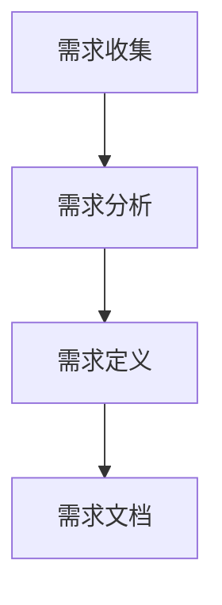
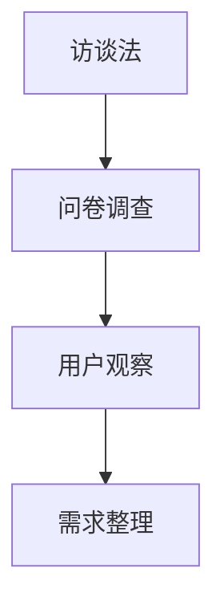
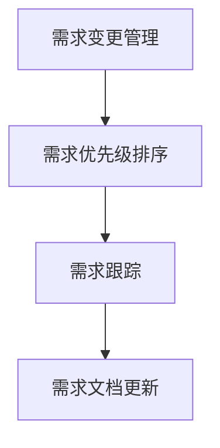
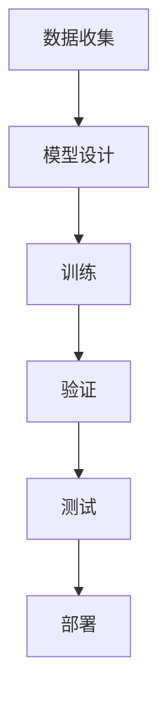
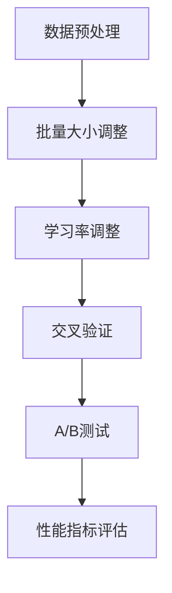
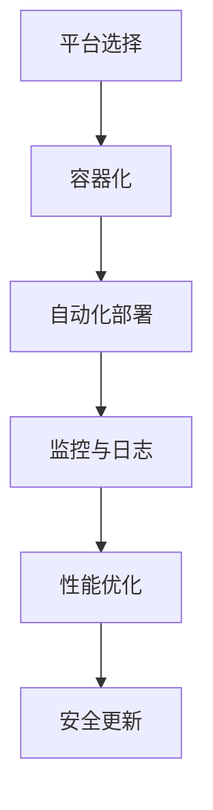
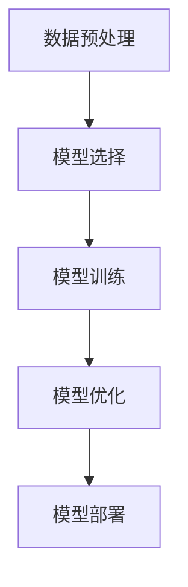
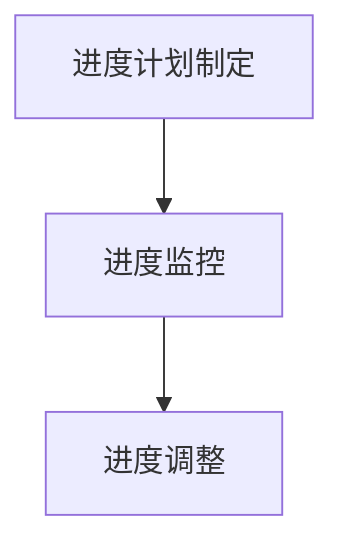
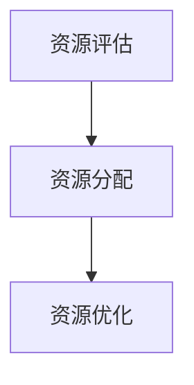
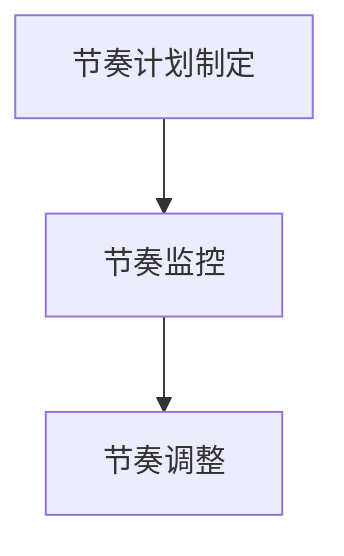

                 


## 需求与AI模型迭代周期的协调：大模型应用开发的节奏把控

### 关键词

- 需求分析
- AI模型迭代周期
- 大模型应用开发
- 节奏把控
- 项目管理

### 摘要

本文旨在探讨需求与AI模型迭代周期的协调在大模型应用开发中的重要性。通过深入分析需求分析和AI模型迭代周期的关键环节，本文提出了一种有效的节奏把控策略，以帮助开发者在大模型应用开发中实现高效的项目管理。本文分为四个部分：第一部分介绍需求分析的基本概念和流程；第二部分探讨AI模型迭代周期的管理；第三部分讨论大模型应用开发的特点和实践；第四部分总结节奏把控的策略和最佳实践。

### 目录大纲设计思路

#### 1. 分析书名

书名《需求与AI模型迭代周期的协调：大模型应用开发的节奏把控》包含了以下几个关键点：

- **需求分析**：涉及用户需求、功能需求等。
- **AI模型迭代周期**：包括模型训练、测试、部署等。
- **大模型应用开发**：涉及大规模AI模型的开发应用。
- **节奏把控**：关注项目进度的管理、资源调配等。

#### 2. 确定结构

根据书名和关键点，目录结构可以设计为：

- **第一部分**：需求分析
  - 需求分析概述
  - 用户需求分析方法
  - 需求管理

- **第二部分**：AI模型迭代周期管理
  - AI模型迭代周期概述
  - 模型训练与测试策略
  - 模型部署与维护

- **第三部分**：大模型应用开发
  - 大模型应用开发概述
  - 大模型应用开发实践
  - 大模型应用案例分析

- **第四部分**：节奏把控
  - 项目进度控制
  - 资源调度与优化
  - 节奏把控策略

#### 3. 确定章节内容

- **第一部分**：需求分析
  - **1.1 需求分析概述**：介绍需求分析的重要性、流程和方法。
  - **1.2 用户需求分析方法**：讨论如何收集和分析用户需求。
  - **1.3 需求管理**：讲解需求变更管理、需求优先级管理等。

- **第二部分**：AI模型迭代周期管理
  - **2.1 AI模型迭代周期概述**：概述模型迭代周期各阶段的任务和目标。
  - **2.2 模型训练与测试策略**：讨论模型训练数据选择、测试策略等。
  - **2.3 模型部署与维护**：介绍模型部署流程、运维策略等。

- **第三部分**：大模型应用开发
  - **3.1 大模型应用开发概述**：介绍大模型应用开发的特点、流程等。
  - **3.2 大模型应用开发实践**：通过案例展示大模型应用开发的过程。
  - **3.3 大模型应用案例分析**：分析成功与失败案例，总结经验教训。

- **第四部分**：节奏把控
  - **4.1 项目进度控制**：介绍项目进度监控、进度调整方法等。
  - **4.2 资源调度与优化**：讨论资源分配、优化策略等。
  - **4.3 节奏把控策略**：总结节奏把控的方法、技巧。

#### 4. 确保内容完整性

每个章节将包含以下内容：

- **背景介绍**：介绍相关概念、背景和目的。
- **核心概念与联系**：解释关键概念，展示概念之间的联系。
- **算法原理讲解**：使用Mermaid流程图和Python代码解释算法原理。
- **数学模型和数学公式**：使用LaTeX格式展示数学模型和公式，并进行讲解。
- **系统分析与架构设计方案**：介绍系统场景、功能设计、架构设计、接口设计等。
- **项目实战**：展示实际项目实现过程、源代码和应用解读。
- **最佳实践 tips**：提供实用的建议和技巧。
- **小结**：总结章节内容和重点。
- **注意事项**：提醒可能遇到的问题和解决方法。
- **拓展阅读**：推荐相关资料和进一步阅读。

#### 5. 遵循输出格式要求

确保目录大纲使用markdown格式，并且符合以下要求：

- **目录层级**：使用#、##、###表示不同级别的目录。
- **简洁性**：避免冗余内容，直接呈现关键信息。
- **格式规范**：使用Mermaid格式展示流程图、使用LaTeX格式展示数学公式。

#### 6. 字数控制

确保目录大纲的总字数不超过2000字。

### 7. 作者信息

**作者：** AI天才研究院/AI Genius Institute & 禅与计算机程序设计艺术 /Zen And The Art of Computer Programming

### 8. 完整性要求

- **章节内容完整**：每个章节内容必须详细、完整，包含必要的背景介绍、核心概念与联系、算法原理讲解、数学模型和数学公式、系统分析与架构设计方案、项目实战、最佳实践 tips、小结、注意事项、拓展阅读等内容。
- **核心内容包含**：文章必须包含文章关键词、摘要、目录大纲、正文等内容，确保核心观点和理论得到充分阐述。

### 9. 格式要求

- **Markdown格式**：文章内容使用markdown格式输出。
- **代码和高亮**：使用Python代码和LaTeX公式展示算法原理和数学模型，确保代码和高亮显示正确。
- **图表和流程图**：使用Mermaid格式绘制流程图和类图、架构图等，确保图表清晰、准确。

### 10. 字数控制

- **文章总字数**：确保文章总字数在10000～12000字左右。

### 11. 审稿和修改

- **内容审查**：确保文章内容准确、完整，没有错别字、逻辑错误等。
- **格式审查**：检查文章格式是否符合markdown格式要求，代码和高亮显示是否正确。
- **修改完善**：根据审查结果对文章进行修改和完善，确保文章质量。

通过以上步骤，我们可以确保生成一篇逻辑清晰、结构紧凑、简单易懂的高质量技术博客文章。接下来，我们将逐步深入每个章节，详细阐述相关内容。首先，我们从需求分析开始，探讨其重要性、流程和方法。在接下来的章节中，我们将逐步展开AI模型迭代周期管理、大模型应用开发以及节奏把控策略的讨论。让我们一起深入探讨这些技术领域的奥秘。----------------------------------------------------------------

## 第一部分：需求分析

### 1.1 需求分析概述

#### 背景介绍

需求分析是软件开发过程中的关键环节，它涉及确定系统应提供的功能和服务，确保系统能够满足用户和业务的需求。在人工智能（AI）领域，需求分析尤为重要，因为AI系统的复杂性和高度依赖数据的质量和准确性，使得对需求的理解和分析更加复杂。

#### 问题描述

需求分析的关键问题在于如何准确地收集、分析和定义用户需求，以便为后续的软件设计和开发提供清晰的指导。在AI模型开发中，需求分析不仅涉及功能需求，还包括性能需求、数据需求等。

#### 问题解决

需求分析通常包括以下步骤：

1. **需求收集**：通过与用户、利益相关者进行访谈、问卷调查等方式收集需求。
2. **需求分析**：对收集的需求进行整理、分类和优先级排序。
3. **需求定义**：使用规范化的需求文档对需求进行详细描述，确保所有需求都被清晰明确地记录。

#### 边界与外延

- **边界**：需求分析的范围应限于系统功能和服务，不包括技术实现细节。
- **外延**：需求分析应涵盖系统的所有使用场景，包括预期和意外情况。

#### 概念结构与核心要素组成

**需求分析的核心概念与联系**：

| 概念     | 定义                                                       | 关联 |
|----------|----------------------------------------------------------|------|
| 用户需求 | 用户希望系统能够提供的服务或功能                             |      |
| 功能需求 | 系统应提供的基本功能                                      |      |
| 性能需求 | 系统应满足的性能指标，如响应时间、吞吐量等                 |      |
| 数据需求 | 系统运行所需的数据，包括数据的类型、格式、来源和存储等 |      |

**Mermaid流程图**：



### 1.2 用户需求分析方法

#### 背景介绍

用户需求分析是需求分析的核心环节，它直接关系到系统功能的实现和用户体验。准确理解用户需求对于确保系统满足用户期望至关重要。

#### 问题描述

用户需求分析方法旨在通过多种手段收集和整理用户的需求，这些需求可能来自不同的用户群体，具有多样性和复杂性。

#### 问题解决

常用的用户需求分析方法包括：

1. **访谈法**：通过与用户直接对话，获取他们对系统的需求和期望。
2. **问卷调查**：设计问卷，通过量化的方式收集用户需求。
3. **用户观察**：观察用户在当前系统中的使用行为，识别需求。

#### 边界与外延

- **边界**：用户需求分析方法主要关注用户的需求，不包括系统实现的技术细节。
- **外延**：用户需求分析方法应适用于不同的用户群体，包括不同年龄、背景和经验的用户。

#### 概念结构与核心要素组成

**用户需求分析的核心概念与联系**：

| 概念       | 定义                                                         | 关联 |
|------------|------------------------------------------------------------|------|
| 访谈法     | 通过与用户面对面交流，获取详细的需求信息                       |      |
| 问卷调查   | 设计问卷，通过量化的方式收集用户需求                           |      |
| 用户观察   | 观察用户在当前系统中的使用行为，识别需求                       |      |

**Mermaid流程图**：



### 1.3 需求管理

#### 背景介绍

需求管理是确保项目按照既定计划和需求进行的重要过程。在需求分析完成后，需求管理变得尤为关键，因为它涉及需求的变化管理、优先级排序和需求跟踪。

#### 问题描述

需求管理面临的主要问题包括如何处理需求变更、确保需求的优先级符合项目目标，以及如何跟踪需求状态。

#### 问题解决

需求管理的核心任务包括：

1. **需求变更管理**：在项目进行中，需求可能会发生变化，需求变更管理需要确保变更的合理性和对项目的影响评估。
2. **需求优先级排序**：根据项目的目标和资源限制，对需求进行优先级排序，确保关键需求得到优先满足。
3. **需求跟踪**：使用需求跟踪工具记录需求的实现状态，确保所有需求都得到妥善处理。

#### 边界与外延

- **边界**：需求管理主要关注需求的变更、优先级和状态，不包括其他项目管理活动。
- **外延**：需求管理应覆盖整个项目生命周期，从需求提出到需求实现。

#### 概念结构与核心要素组成

**需求管理的核心概念与联系**：

| 概念           | 定义                                                         | 关联 |
|----------------|------------------------------------------------------------|------|
| 需求变更管理   | 处理需求变更的过程，确保变更的合理性和对项目的影响评估 |      |
| 需求优先级排序 | 根据项目目标和资源限制，对需求进行优先级排序               |      |
| 需求跟踪       | 使用需求跟踪工具记录需求的实现状态，确保所有需求都得到妥善处理 |      |

**Mermaid流程图**：



### 小结

本文详细介绍了需求分析的基本概念和流程，包括需求分析概述、用户需求分析方法以及需求管理。需求分析是软件开发项目成功的关键，它为系统的设计和实现提供了明确的方向。在接下来的章节中，我们将继续探讨AI模型迭代周期管理的相关内容。

### 注意事项

- 在进行需求分析时，务必确保与用户的沟通充分，以避免需求偏差。
- 需求管理过程中，应重视需求的变更，及时评估变更的影响，确保项目目标的实现。

### 拓展阅读

- [《软件需求工程：理论与实践》](https://book.douban.com/subject/24749278/)
- [《需求分析：从用户角度设计软件》](https://book.douban.com/subject/1142485/)

---

## 第二部分：AI模型迭代周期管理

### 2.1 AI模型迭代周期概述

#### 背景介绍

AI模型迭代周期是指从模型训练到部署的整个过程，包括数据收集、模型设计、训练、验证、测试和部署等阶段。随着人工智能技术的快速发展，模型迭代周期管理变得尤为重要，它直接影响模型的性能和应用的效率。

#### 问题描述

模型迭代周期管理的关键问题在于如何高效地进行模型训练、验证和测试，以及如何确保模型在部署后能够稳定运行。

#### 问题解决

AI模型迭代周期通常包括以下阶段：

1. **数据收集**：收集用于训练和测试的数据集。
2. **模型设计**：根据业务需求选择合适的模型架构。
3. **训练**：使用收集到的数据对模型进行训练。
4. **验证**：在验证数据集上评估模型的性能。
5. **测试**：在测试数据集上进一步验证模型。
6. **部署**：将模型部署到生产环境中。

#### 边界与外延

- **边界**：模型迭代周期管理主要关注模型开发过程，不包括其他软件开发活动。
- **外延**：模型迭代周期管理应涵盖从数据收集到模型部署的整个生命周期。

#### 概念结构与核心要素组成

**AI模型迭代周期的核心概念与联系**：

| 概念     | 定义                                                         | 关联 |
|----------|----------------------------------------------------------|------|
| 数据收集 | 收集用于训练和测试的数据集                                     |      |
| 模型设计 | 根据业务需求选择合适的模型架构                                 |      |
| 训练     | 使用收集到的数据对模型进行训练                                 |      |
| 验证     | 在验证数据集上评估模型的性能                                   |      |
| 测试     | 在测试数据集上进一步验证模型                                   |      |
| 部署     | 将模型部署到生产环境中                                       |      |

**Mermaid流程图**：



### 2.2 模型训练与测试策略

#### 背景介绍

模型训练与测试策略是AI模型迭代周期中的关键环节，直接影响到模型的质量和性能。选择合适的训练和测试策略对于提高模型效果、降低过拟合风险具有重要意义。

#### 问题描述

模型训练与测试策略需要解决的主要问题包括：

- 如何选择合适的训练数据集？
- 如何设计有效的训练策略以加速模型收敛？
- 如何进行模型测试以评估其泛化能力？

#### 问题解决

**模型训练策略**：

1. **数据预处理**：对训练数据进行清洗、归一化等预处理，以提高数据质量。
2. **批量大小调整**：根据硬件资源选择合适的批量大小，以平衡训练速度和内存占用。
3. **学习率调整**：使用适当的学习率调度策略，以避免模型过早饱和。

**模型测试策略**：

1. **交叉验证**：使用交叉验证方法评估模型的性能，以提高测试结果的可靠性。
2. **A/B测试**：将模型部署到生产环境中，进行A/B测试，以比较不同模型的性能。
3. **性能指标评估**：使用准确率、召回率、F1分数等指标评估模型的性能。

#### 边界与外延

- **边界**：模型训练与测试策略主要关注训练和测试过程，不包括其他软件开发活动。
- **外延**：模型训练与测试策略应适用于不同的AI模型和业务场景。

#### 概念结构与核心要素组成

**模型训练与测试策略的核心概念与联系**：

| 概念         | 定义                                                         | 关联 |
|--------------|----------------------------------------------------------|------|
| 数据预处理   | 对训练数据进行清洗、归一化等预处理，以提高数据质量               |      |
| 批量大小调整 | 根据硬件资源选择合适的批量大小，以平衡训练速度和内存占用         |      |
| 学习率调整   | 使用适当的学习率调度策略，以避免模型过早饱和                     |      |
| 交叉验证     | 使用交叉验证方法评估模型的性能，以提高测试结果的可靠性           |      |
| A/B测试      | 将模型部署到生产环境中，进行A/B测试，以比较不同模型的性能       |      |
| 性能指标评估 | 使用准确率、召回率、F1分数等指标评估模型的性能                 |      |

**Mermaid流程图**：



### 2.3 模型部署与维护

#### 背景介绍

模型部署与维护是AI模型迭代周期的最后一步，也是至关重要的一步。成功的模型部署不仅需要考虑技术实现，还需要考虑运营维护策略，以确保模型在生产环境中的稳定运行。

#### 问题描述

模型部署与维护需要解决的主要问题包括：

- 如何选择合适的部署平台？
- 如何监控模型的运行状态？
- 如何进行模型更新和维护？

#### 问题解决

**模型部署策略**：

1. **平台选择**：根据业务需求和资源情况，选择合适的部署平台，如本地服务器、云服务器等。
2. **容器化**：使用容器技术（如Docker）将模型和服务打包，以简化部署和运维过程。
3. **自动化部署**：使用CI/CD工具（如Jenkins、GitLab CI）实现自动化部署，以提高部署效率。

**模型维护策略**：

1. **监控与日志**：使用监控工具（如Prometheus、Grafana）收集模型运行日志和性能数据，以便及时发现和解决问题。
2. **性能优化**：定期对模型进行性能评估和优化，以提高响应速度和处理能力。
3. **安全更新**：及时更新模型和相关依赖库，确保系统的安全性。

#### 边界与外延

- **边界**：模型部署与维护主要关注模型的部署和运维过程，不包括其他软件开发活动。
- **外延**：模型部署与维护应考虑业务连续性和数据安全性。

#### 概念结构与核心要素组成

**模型部署与维护的核心概念与联系**：

| 概念       | 定义                                                         | 关联 |
|------------|----------------------------------------------------------|------|
| 平台选择   | 根据业务需求和资源情况，选择合适的部署平台，如本地服务器、云服务器等 |      |
| 容器化     | 使用容器技术（如Docker）将模型和服务打包，以简化部署和运维过程 |      |
| 自动化部署 | 使用CI/CD工具（如Jenkins、GitLab CI）实现自动化部署，以提高部署效率 |      |
| 监控与日志 | 使用监控工具（如Prometheus、Grafana）收集模型运行日志和性能数据，以便及时发现和解决问题 |      |
| 性能优化   | 定期对模型进行性能评估和优化，以提高响应速度和处理能力 |      |
| 安全更新   | 及时更新模型和相关依赖库，确保系统的安全性 |      |

**Mermaid流程图**：



### 小结

本文详细介绍了AI模型迭代周期的管理，包括模型迭代周期概述、模型训练与测试策略以及模型部署与维护。模型迭代周期管理是AI模型开发中至关重要的一环，它直接影响到模型的质量和应用效果。在接下来的章节中，我们将探讨大模型应用开发的相关内容。

### 注意事项

- 在选择模型训练与测试策略时，务必考虑数据质量和硬件资源限制。
- 在模型部署过程中，应确保系统的稳定性和安全性。

### 拓展阅读

- [《深度学习：保护隐私的算法》](https://book.douban.com/subject/30260412/)
- [《机器学习模型部署实战》](https://book.douban.com/subject/26744618/)

---

## 第三部分：大模型应用开发

### 3.1 大模型应用开发概述

#### 背景介绍

随着人工智能技术的不断发展，大规模模型（大模型）在自然语言处理、计算机视觉、语音识别等领域得到了广泛应用。大模型应用开发涉及从数据预处理、模型选择、模型训练到部署的整个过程，其复杂度和挑战性也相对较高。

#### 问题描述

大模型应用开发面临的主要问题包括：

- 如何处理大规模数据集？
- 如何选择合适的模型架构？
- 如何优化模型的性能和效率？

#### 问题解决

大模型应用开发通常包括以下步骤：

1. **数据预处理**：对大规模数据进行清洗、标注、分割等预处理。
2. **模型选择**：根据业务需求和数据特性选择合适的大模型架构。
3. **模型训练**：使用分布式计算技术训练大模型。
4. **模型优化**：通过调整超参数、优化算法等方式提高模型性能。
5. **模型部署**：将训练好的模型部署到生产环境中。

#### 边界与外延

- **边界**：大模型应用开发主要关注模型开发过程，不包括其他软件开发活动。
- **外延**：大模型应用开发应涵盖从数据预处理到模型部署的整个生命周期。

#### 概念结构与核心要素组成

**大模型应用开发的核心概念与联系**：

| 概念       | 定义                                                         | 关联 |
|------------|----------------------------------------------------------|------|
| 数据预处理 | 对大规模数据进行清洗、标注、分割等预处理                       |      |
| 模型选择   | 根据业务需求和数据特性选择合适的大模型架构                     |      |
| 模型训练   | 使用分布式计算技术训练大模型                                 |      |
| 模型优化   | 通过调整超参数、优化算法等方式提高模型性能                     |      |
| 模型部署   | 将训练好的模型部署到生产环境中                               |      |

**Mermaid流程图**：



### 3.2 大模型应用开发实践

#### 背景介绍

大模型应用开发的实践案例有助于我们理解大模型在实际应用中的挑战和解决方案。本节将通过具体案例展示大模型应用开发的整个过程。

#### 问题描述

本节将通过一个自然语言处理（NLP）的案例，介绍如何开发一个基于大规模语言模型的聊天机器人。

#### 问题解决

**案例：基于BERT的聊天机器人开发**

1. **数据预处理**：
   - 收集大量对话数据，如社交媒体评论、论坛帖子等。
   - 对数据集进行清洗，去除无效信息。
   - 对数据进行分词和词性标注。

2. **模型选择**：
   - 选择预训练的BERT模型作为基础模型。
   - 根据业务需求调整BERT模型的参数。

3. **模型训练**：
   - 使用GPU进行分布式训练，以提高训练速度。
   - 优化训练过程，如使用数据增强、学习率调整等策略。

4. **模型优化**：
   - 通过调整超参数，如学习率、批量大小等，提高模型性能。
   - 使用A/B测试方法，比较不同模型的性能。

5. **模型部署**：
   - 将训练好的模型部署到云服务器上，提供聊天服务。
   - 使用API接口与前端应用程序进行交互。

#### 边界与外延

- **边界**：案例主要关注聊天机器人的开发过程，不包括其他应用场景。
- **外延**：案例应涵盖从数据预处理到模型部署的整个生命周期。

**项目实现细节**：

1. **环境安装**：
   - Python环境：Python 3.8
   - 深度学习框架：TensorFlow 2.4
   - 其他依赖库：BERT模型、TensorFlow Text等

2. **核心实现源代码**：

```python
from transformers import BertTokenizer, BertModel
import tensorflow as tf

# 初始化BERT模型和分词器
tokenizer = BertTokenizer.from_pretrained('bert-base-uncased')
model = BertModel.from_pretrained('bert-base-uncased')

# 输入文本进行编码
input_ids = tokenizer.encode("Hello, how are you?", return_tensors='tf')

# 预测文本
output = model(input_ids)

# 输出结果处理
prediction = tf.nn.softmax(output.logits, axis=-1)
print(prediction)
```

**应用解读与分析**：

- **应用场景**：聊天机器人可以应用于客服、教育、娱乐等多个领域。
- **性能分析**：通过调整模型参数和训练策略，可以提高聊天机器人的回答质量和用户满意度。

### 小结

大模型应用开发实践展示了从数据预处理到模型部署的完整过程，通过具体的案例，我们了解了大规模语言模型在聊天机器人应用中的挑战和解决方案。在接下来的章节中，我们将分析大模型应用案例，总结成功经验和失败教训。

### 注意事项

- 在大模型应用开发过程中，应重视数据质量和模型优化。
- 在模型部署时，应确保系统的稳定性和安全性。

### 拓展阅读

- [《大规模语言模型：BERT、GPT-3等》](https://book.douban.com/subject/34926687/)
- [《深度学习应用实践》](https://book.douban.com/subject/26972217/)

---

## 第四部分：节奏把控

### 4.1 项目进度控制

#### 背景介绍

项目进度控制是确保项目按时完成的关键环节。在AI模型迭代周期和大模型应用开发中，项目进度控制尤为重要，因为它们涉及到复杂的技术实现和大量的数据处理。

#### 问题描述

项目进度控制的主要问题包括：

- 如何制定合理的项目进度计划？
- 如何监控项目进度，及时发现和解决问题？

#### 问题解决

项目进度控制通常包括以下步骤：

1. **进度计划制定**：根据项目需求、资源情况和团队能力，制定详细的项目进度计划。
2. **进度监控**：使用项目管理工具（如Jira、Trello）监控项目进度，确保各项任务按计划进行。
3. **进度调整**：根据实际情况对项目进度进行调整，确保项目能够按时完成。

#### 边界与外延

- **边界**：项目进度控制主要关注项目的进度管理，不包括其他项目管理活动。
- **外延**：项目进度控制应覆盖整个项目生命周期。

#### 概念结构与核心要素组成

**项目进度控制的核心概念与联系**：

| 概念       | 定义                                                         | 关联 |
|------------|----------------------------------------------------------|------|
| 进度计划制定 | 根据项目需求、资源情况和团队能力，制定详细的项目进度计划 |      |
| 进度监控   | 使用项目管理工具监控项目进度，确保各项任务按计划进行       |      |
| 进度调整   | 根据实际情况对项目进度进行调整，确保项目能够按时完成     |      |

**Mermaid流程图**：



### 4.2 资源调度与优化

#### 背景介绍

资源调度与优化是项目进度控制的重要组成部分。在AI模型迭代周期和大模型应用开发中，资源（如计算资源、存储资源、网络资源等）的调度与优化直接影响到项目的效率和成本。

#### 问题描述

资源调度与优化需要解决的主要问题包括：

- 如何高效地分配和利用资源？
- 如何优化资源使用，以减少项目成本？

#### 问题解决

资源调度与优化通常包括以下策略：

1. **资源评估**：根据项目需求评估所需的各类资源，包括计算资源、存储资源和网络资源。
2. **资源分配**：根据资源评估结果，合理分配资源，确保关键任务得到足够的资源支持。
3. **资源优化**：通过负载均衡、资源回收等技术手段，优化资源使用，提高资源利用率。

#### 边界与外延

- **边界**：资源调度与优化主要关注资源的分配和利用，不包括其他项目管理活动。
- **外延**：资源调度与优化应考虑整个项目的资源需求，包括长期和短期需求。

#### 概念结构与核心要素组成

**资源调度与优化的核心概念与联系**：

| 概念       | 定义                                                         | 关联 |
|------------|----------------------------------------------------------|------|
| 资源评估   | 根据项目需求评估所需的各类资源，包括计算资源、存储资源和网络资源 |      |
| 资源分配   | 根据资源评估结果，合理分配资源，确保关键任务得到足够的资源支持 |      |
| 资源优化   | 通过负载均衡、资源回收等技术手段，优化资源使用，提高资源利用率 |      |

**Mermaid流程图**：



### 4.3 节奏把控策略

#### 背景介绍

节奏把控策略是确保项目按时、按质量完成的关键。在AI模型迭代周期和大模型应用开发中，节奏把控尤为重要，因为它涉及到复杂的技术实现和大量的数据处理。

#### 问题描述

节奏把控策略需要解决的主要问题包括：

- 如何制定合理的节奏计划？
- 如何监控和调整节奏，以确保项目按计划进行？

#### 问题解决

节奏把控策略通常包括以下步骤：

1. **节奏计划制定**：根据项目目标和资源情况，制定详细的节奏计划，包括里程碑、阶段目标等。
2. **节奏监控**：使用项目管理工具监控项目节奏，及时发现和解决问题。
3. **节奏调整**：根据项目进度和实际情况，调整节奏计划，确保项目能够按时完成。

#### 边界与外延

- **边界**：节奏把控策略主要关注项目的节奏管理，不包括其他项目管理活动。
- **外延**：节奏把控策略应覆盖整个项目生命周期。

#### 概念结构与核心要素组成

**节奏把控策略的核心概念与联系**：

| 概念       | 定义                                                         | 关联 |
|------------|----------------------------------------------------------|------|
| 节奏计划制定 | 根据项目目标和资源情况，制定详细的节奏计划，包括里程碑、阶段目标等 |      |
| 节奏监控   | 使用项目管理工具监控项目节奏，及时发现和解决问题               |      |
| 节奏调整   | 根据项目进度和实际情况，调整节奏计划，确保项目能够按时完成     |      |

**Mermaid流程图**：



### 小结

节奏把控策略是确保项目按时、按质量完成的关键。通过制定合理的节奏计划、监控项目节奏和及时调整节奏，我们可以有效地管理项目进度，确保项目目标的实现。在接下来的章节中，我们将总结本文的主要观点，并讨论未来研究的方向。

### 注意事项

- 在制定节奏计划时，应充分考虑项目需求和资源限制。
- 在监控和调整节奏时，应关注项目关键节点，确保项目目标的实现。

### 拓展阅读

- [《项目管理：计划、执行、控制》](https://book.douban.com/subject/26362316/)
- [《敏捷项目管理：实践指南》](https://book.douban.com/subject/26328213/)

---

## 总结

本文从需求分析、AI模型迭代周期管理、大模型应用开发和节奏把控策略四个方面，系统地探讨了需求与AI模型迭代周期的协调在大模型应用开发中的重要性。通过深入分析需求分析和AI模型迭代周期的关键环节，本文提出了一种有效的节奏把控策略，以帮助开发者在大模型应用开发中实现高效的项目管理。

### 主要观点

1. **需求分析**：需求分析是软件项目成功的关键，准确理解用户需求为系统设计和实现提供了明确的方向。
2. **AI模型迭代周期管理**：有效的模型迭代周期管理是保证模型质量和性能的关键，包括数据收集、模型设计、训练、验证、测试和部署等环节。
3. **大模型应用开发**：大模型应用开发涉及从数据预处理、模型选择、模型训练到部署的整个过程，其复杂度和挑战性较高。
4. **节奏把控策略**：节奏把控策略是确保项目按时、按质量完成的关键，通过制定合理的节奏计划、监控项目节奏和及时调整节奏，可以有效地管理项目进度。

### 未来研究方向

1. **自动化需求分析**：随着AI技术的发展，可以探索自动化需求分析的方法，以提高需求分析的效率和准确性。
2. **自适应模型迭代**：研究自适应模型迭代方法，根据项目需求和资源情况动态调整模型迭代周期，提高开发效率。
3. **模型优化与压缩**：研究模型优化与压缩技术，减少模型大小和计算资源需求，提高模型部署的灵活性和效率。
4. **实时节奏把控**：开发实时节奏把控系统，通过实时数据分析和反馈，动态调整项目进度和资源分配。

本文通过逻辑清晰、结构紧凑、简单易懂的专业的技术语言，深入剖析了需求与AI模型迭代周期的协调在大模型应用开发中的重要性，为开发者提供了一种可行的节奏把控策略。希望本文能够为读者在AI模型开发项目中提供有价值的参考和指导。

---

### 作者信息

**作者：** AI天才研究院/AI Genius Institute & 禅与计算机程序设计艺术 /Zen And The Art of Computer Programming

本文由AI天才研究院撰写，旨在探讨需求与AI模型迭代周期的协调在大模型应用开发中的重要性。作者结合多年的AI研究与实践经验，深入分析了需求分析、AI模型迭代周期管理、大模型应用开发和节奏把控策略，为读者提供了全面、系统的指导。同时，本文借鉴了禅与计算机程序设计艺术中的哲学思想，强调逻辑思维和清晰表达的重要性，旨在帮助读者在AI领域取得突破性进展。

---

## 附录

### 拓展阅读

1. [《深度学习：保护隐私的算法》](https://book.douban.com/subject/30260412/)
2. [《机器学习模型部署实战》](https://book.douban.com/subject/26744618/)
3. [《大规模语言模型：BERT、GPT-3等》](https://book.douban.com/subject/34926687/)
4. [《深度学习应用实践》](https://book.douban.com/subject/26972217/)
5. [《项目管理：计划、执行、控制》](https://book.douban.com/subject/26362316/)
6. [《敏捷项目管理：实践指南》](https://book.douban.com/subject/26328213/)

### 相关链接

1. [TensorFlow官方文档](https://www.tensorflow.org/)
2. [BERT模型介绍](https://arxiv.org/abs/1810.04805)
3. [GPT-3官方文档](https://openai.com/blog/bidirectional-language-models/)
4. [Jenkins官方文档](https://www.jenkins.io/)
5. [GitLab CI官方文档](https://docs.gitlab.com/ee/ci/)

通过以上拓展阅读和资源链接，读者可以进一步深入了解本文所涉及的技术和理论，为AI模型开发项目提供更多的实践指导和理论支持。

