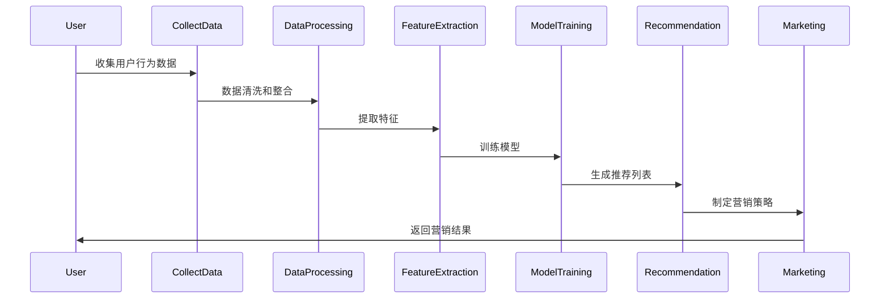
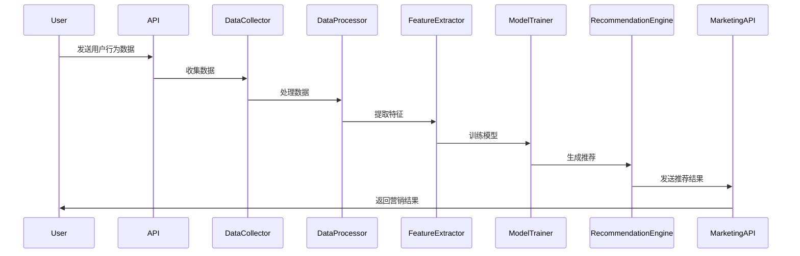
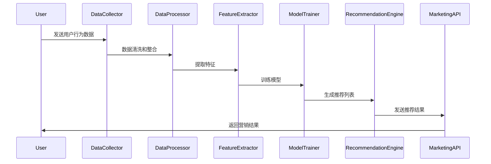

                 

# 《需求与AI模型选择的匹配策略》

## 关键词

- 需求分析
- 机器学习模型
- 匹配策略
- 性能评估
- 可解释性

## 摘要

在人工智能领域，选择合适的模型以满足特定需求是至关重要的。本文将深入探讨需求与AI模型选择之间的匹配策略，通过详细的分析和实例，为开发者和研究者提供一种系统化的方法来优化模型选择过程。文章首先介绍了需求与AI模型的基本概念，然后探讨了核心概念之间的联系，并详细阐述了匹配算法的原理。接着，通过一个电商平台的实际案例，展示了系统架构和接口设计。最后，总结了最佳实践和注意事项，为读者提供进一步学习和应用的方向。

## 目录大纲

# 《需求与AI模型选择的匹配策略》

## 第一部分：背景介绍

### 1.1 问题背景

#### 1.1.1 需求与AI模型的定义

在讨论需求与AI模型选择的匹配策略之前，我们需要明确这两个核心概念的定义。

**需求**：需求是指用户或系统对特定功能、性能或行为的要求。它可以分为功能性需求和非功能性需求。功能性需求关注系统需要执行的具体功能，如预测、分类、聚类等。而非功能性需求则涉及系统的性能、可靠性、安全性等方面。

**AI模型**：AI模型是通过机器学习算法训练得到的模型，用于模拟人类智能行为。常见的AI模型包括神经网络、决策树、支持向量机等。这些模型在不同的应用场景中扮演着不同的角色，其性能和适用性取决于具体的任务需求。

#### 1.1.2 问题描述

在人工智能项目中，如何确保AI模型能够满足特定需求是一个关键问题。这不仅涉及到模型的选择，还包括模型训练、评估和优化等多个环节。在众多AI模型中，如何选出最合适的模型以满足特定的需求，成为了一个复杂的决策过程。

**挑战**：
1. **模型多样性**：AI领域有着丰富的模型类型，每种模型都有其独特的优势和局限性。
2. **数据多样性**：不同应用场景下的数据类型、质量和规模各异，这对模型的选择和训练提出了不同要求。
3. **需求多样性**：用户需求不断变化，需要模型具备良好的适应性和可扩展性。

#### 1.1.3 问题解决

为了解决上述问题，本文提出了以下匹配策略：

1. **需求分析**：全面了解并提取用户的需求，包括功能性需求和非功能性需求。
2. **模型评估**：基于需求和数据的特性，评估不同模型的性能和适用性。
3. **匹配算法**：设计一种算法，用于计算需求特征与模型性能之间的匹配程度。
4. **模型选择**：根据匹配结果，选择最合适的模型。

#### 1.1.4 边界与外延

**边界**：
1. **领域限制**：本文主要关注通用AI模型的应用，不涉及特定领域的深度定制化模型。
2. **数据规模**：本文假设数据规模足够大，能够支持模型的训练和评估。
3. **计算资源**：本文未详细讨论计算资源的限制，但模型选择过程应考虑计算资源的可用性。

**外延**：
1. **应用场景**：本文的方法可以应用于各种需要机器学习模型的应用场景，包括但不限于推荐系统、自然语言处理、图像识别等。
2. **需求类型**：本文涵盖了功能性需求和非功能性需求，不同类型的需求可能在模型选择中扮演不同的角色。
3. **模型类型**：本文讨论了常见机器学习模型的选择策略，但不同的模型类型（如深度学习、强化学习等）可能需要不同的匹配策略。

#### 1.1.5 概念结构与核心要素组成

**概念结构**：
- **需求分析**：提取需求特征，包括功能性需求和非功能性需求。
- **模型评估**：评估不同模型在特定需求下的性能。
- **匹配算法**：计算需求特征与模型性能之间的匹配程度。
- **模型选择**：基于匹配结果选择最合适的模型。

**核心要素**：
- **需求特征**：功能性需求和非功能性需求的具体描述。
- **模型性能**：模型在特定需求下的性能指标，如准确度、效率等。
- **匹配指标**：用于衡量需求特征与模型性能之间相关性的指标。

### 第一部分总结

在本部分，我们明确了需求与AI模型选择的背景和问题，提出了问题解决的匹配策略，并讨论了问题的边界与外延。接下来的部分将深入探讨核心概念之间的联系，提供更为详细的匹配策略和方法。让我们继续深入分析。

### 第二部分：核心概念与联系

#### 2.1 核心概念原理

在深入探讨需求与AI模型选择匹配策略之前，我们需要理解几个核心概念：需求特征、模型性能和匹配指标。这些概念是构建有效匹配策略的基础。

##### 2.1.1 需求特征

需求特征是用户或系统对特定功能、性能或行为的要求的详细描述。它们可以分为功能性需求和非功能性需求。

- **功能性需求**：这类需求关注系统需要执行的具体功能。例如，在图像识别任务中，功能性需求可能包括准确识别特定对象的能力。功能性需求通常是具体和明确的，可以通过量化的指标来衡量。

- **非功能性需求**：这类需求关注系统的非功能方面，如性能、可靠性、安全性等。例如，在一个实时预测系统中，非功能性需求可能包括低延迟和高可用性。非功能性需求往往难以量化，但同样至关重要。

##### 2.1.2 模型性能

模型性能是评估AI模型在特定任务上表现的关键指标。性能指标可以分为以下几个方面：

- **准确度**：准确度是评估模型预测结果正确性的指标。在分类任务中，准确度表示模型正确分类的样本比例。高准确度通常意味着模型具有良好的性能。

- **效率**：效率是评估模型训练和推理速度的指标。高效的模型可以在较短的时间内完成训练和预测，这对于实时应用尤为重要。

- **泛化能力**：泛化能力是评估模型在新数据集上的表现。一个具有良好泛化能力的模型不仅能在训练数据上表现良好，也能在未知数据上保持稳定的性能。

##### 2.1.3 匹配指标

匹配指标用于衡量需求特征与模型性能之间的相关性。选择合适的匹配指标对于优化模型选择过程至关重要。以下是一些常见的匹配指标：

- **相关性**：相关性指标衡量需求特征与模型性能之间的相关性。高相关性意味着模型能够很好地满足需求。例如，如果功能性需求关注准确度，那么模型的高准确度就表示其与需求的高相关性。

- **可解释性**：可解释性指标衡量模型结果的解释程度。对于某些应用场景，如金融风险评估，模型的可解释性尤为重要。高可解释性有助于用户理解模型的决策过程，提高模型的可信度。

#### 2.2 概念属性特征对比表格

为了更好地理解需求特征、模型性能和匹配指标之间的关系，我们可以通过一个表格进行对比。

| 概念        | 属性        | 特征         |
|-------------|-------------|-------------|
| 需求        | 功能性      | 明确、具体   |
| 需求        | 非功能性    | 持续性、可靠性 |
| 模型        | 准确度      | 高、低       |
| 模型        | 效率        | 快、慢       |
| 匹配指标    | 相关性      | 强、弱       |
| 匹配指标    | 可解释性    | 高、低       |

#### 2.3 ER实体关系图架构

为了进一步理解需求、模型和匹配指标之间的关系，我们可以使用ER（实体关系）图来表示这些实体及其关系。

```mermaid
erDiagram
    Demand ||--|{ Model }|| Model
    Model ||--|{ MatchingIndicator }|| MatchingIndicator
    Demand ||--|{ NonFunctionalRequirement }|| NonFunctionalRequirement
    Model ||--|{ FunctionalRequirement }|| FunctionalRequirement
```

在这个ER图中，`Demand`（需求）与`Model`（模型）之间是双向关联，表示模型需要满足需求，而需求也依赖于模型的性能。`Model`与`MatchingIndicator`（匹配指标）之间存在关联，表示匹配指标用于评估模型是否满足需求。此外，`Demand`与`NonFunctionalRequirement`（非功能性需求）和`FunctionalRequirement`（功能性需求）之间存在关联，表示需求可以分为不同类型。

#### 第二部分总结

在本部分，我们详细介绍了需求特征、模型性能和匹配指标这三个核心概念。通过对比表格和ER图，我们更清晰地理解了它们之间的关系。接下来，我们将深入探讨匹配算法的原理，为模型选择提供理论支持。

### 第三部分：算法原理讲解

#### 3.1 匹配算法基本框架

匹配算法是需求与AI模型选择的核心，它通过需求分析、模型评估和匹配指标计算，帮助我们在众多AI模型中找到最合适的模型。下面，我们将详细介绍匹配算法的基本框架。

##### 3.1.1 需求分析

需求分析是匹配算法的第一步，它涉及从用户需求中提取关键特征。这些特征可以分为功能性需求和非功能性需求。

- **功能性需求**：这些需求通常可以通过量化指标来衡量。例如，在图像分类任务中，功能性需求可能包括分类准确率、召回率等。

- **非功能性需求**：这些需求通常与系统的性能、可靠性、安全性等特性相关。例如，在实时预测系统中，非功能性需求可能包括延迟、资源消耗等。

##### 3.1.2 模型评估

模型评估是在确定了需求特征后，对现有模型进行性能评估的过程。评估过程通常涉及以下步骤：

1. **数据准备**：收集用于评估的模型训练数据和测试数据。
2. **模型训练**：使用训练数据对模型进行训练。
3. **性能评估**：使用测试数据评估模型的性能，常用的性能指标包括准确度、召回率、F1分数等。
4. **调整参数**：根据评估结果，调整模型参数以优化性能。

##### 3.1.3 匹配指标计算

匹配指标计算是匹配算法的核心，它用于衡量需求特征与模型性能之间的匹配程度。常用的匹配指标包括：

- **相关性**：衡量需求特征与模型性能之间的相关性，通常使用皮尔逊相关系数等统计方法计算。
- **可解释性**：衡量模型结果的解释程度，通常使用模型的可解释性指标，如特征重要性、决策树路径等。

##### 3.1.4 模型选择

根据匹配指标的计算结果，我们可以选择最合适的模型。选择模型时，需要综合考虑以下因素：

- **匹配度**：模型与需求的匹配度越高，通常表示模型能够更好地满足需求。
- **性能**：模型在特定需求下的性能指标，如准确度、效率等。
- **可解释性**：模型的可解释性对于某些应用场景尤为重要，例如金融风险评估。

##### 3.1.5 匹配算法流程

匹配算法的流程可以概括为以下步骤：

1. **收集需求数据**：从用户需求中提取关键特征，包括功能性需求和非功能性需求。
2. **预处理需求数据**：对需求数据进行必要的预处理，如归一化、标准化等。
3. **训练模型**：使用预处理后的需求数据训练多个模型。
4. **预测和评估模型性能**：使用测试数据评估模型的性能，记录每个模型的性能指标。
5. **计算匹配指标**：计算每个模型与需求的匹配度，包括相关性、可解释性等。
6. **选择最佳模型**：根据匹配指标选择最合适的模型。

#### 3.2 数学模型和公式

在匹配算法中，我们经常需要使用数学模型和公式来评估模型的性能和匹配度。以下是一些常用的数学模型和公式：

- **准确度**：准确度是评估模型预测结果正确性的指标，其计算公式为：

  $$  
  \text{Accuracy} = \frac{\text{正确预测数}}{\text{总预测数}}  
  $$

- **召回率**：召回率是评估模型召回实际正例能力的指标，其计算公式为：

  $$  
  \text{Recall} = \frac{\text{正确召回数}}{\text{实际正例数}}  
  $$

- **F1分数**：F1分数是准确度和召回率的调和平均，其计算公式为：

  $$  
  \text{F1 Score} = 2 \times \frac{\text{准确度} \times \text{召回率}}{\text{准确度} + \text{召回率}}  
  $$

- **皮尔逊相关系数**：皮尔逊相关系数用于衡量两个变量之间的线性相关性，其计算公式为：

  $$  
  \text{Pearson Correlation Coefficient} = \frac{\sum{(x_i - \bar{x}) \times (y_i - \bar{y})}}{\sqrt{\sum{(x_i - \bar{x})^2} \times \sum{(y_i - \bar{y})^2}}}  
  $$

#### 3.3 Python源代码

以下是一个简单的Python代码示例，用于计算准确度、召回率和F1分数：

```python
from sklearn.metrics import accuracy_score, recall_score, f1_score

def evaluate_performance(y_true, y_pred):
    acc = accuracy_score(y_true, y_pred)
    rec = recall_score(y_true, y_pred)
    f1 = f1_score(y_true, y_pred)
    return acc, rec, f1

y_true = [0, 1, 0, 1, 0]
y_pred = [0, 0, 1, 1, 0]
acc, rec, f1 = evaluate_performance(y_true, y_pred)
print(f"Accuracy: {acc}, Recall: {rec}, F1 Score: {f1}")
```

通过这个示例，我们可以看到如何使用Python的`sklearn`库来计算模型的性能指标。

#### 第三部分总结

在本部分，我们详细介绍了匹配算法的基本框架，包括需求分析、模型评估、匹配指标计算和模型选择。我们还使用数学模型和Python代码展示了如何计算模型性能指标。接下来，我们将通过一个实际案例，展示如何应用这些理论和方法。

### 第四部分：系统分析与架构设计方案

#### 4.1 问题场景介绍

本部分我们将通过一个电商平台的用户行为分析系统案例，详细分析需求与AI模型选择的过程。电商平台用户行为分析系统旨在通过分析用户的行为数据，为平台提供个性化的推荐和营销策略，从而提升用户体验和销售额。

#### 4.2 系统功能设计

电商平台用户行为分析系统主要包括以下几个功能模块：

1. **用户数据收集**：从平台各个渠道收集用户行为数据，如浏览记录、购物车添加、订单历史等。
2. **数据处理**：对收集到的用户行为数据进行清洗、转换和整合，形成统一的数据格式。
3. **特征工程**：提取用户行为的特征，如浏览时长、购买频率、商品种类等。
4. **模型训练与评估**：基于用户行为数据训练不同的机器学习模型，如协同过滤、决策树、神经网络等，并对模型进行评估。
5. **推荐系统**：使用训练好的模型为用户生成个性化推荐列表，提高用户的购买意愿。
6. **营销策略**：根据用户行为数据和推荐结果，制定个性化的营销策略，提高用户粘性和转化率。

#### 4.2.1 领域模型Mermaid类图

为了更好地理解系统功能设计，我们可以使用Mermaid绘制一个类图，表示系统中不同类之间的关系。

```mermaid
classDiagram
    User <<Class>>
    BehaviorData <<Class>>
    ProcessData <<Class>>
    FeatureExtraction <<Class>>
    ModelTraining <<Class>>
    Recommendation <<Class>>
    Marketing <<Class>>
    User --|> BehaviorData
    BehaviorData --|> ProcessData
    ProcessData --|> FeatureExtraction
    FeatureExtraction --|> ModelTraining
    ModelTraining --|> Recommendation
    Recommendation --|> Marketing
```

在这个类图中，`User`（用户）类表示平台上的用户，`BehaviorData`（用户行为数据）类表示从各个渠道收集的用户行为数据。`ProcessData`（数据处理）类负责清洗和整合这些数据。`FeatureExtraction`（特征工程）类从处理后的数据中提取关键特征。`ModelTraining`（模型训练）类使用这些特征训练不同的机器学习模型。`Recommendation`（推荐系统）类使用训练好的模型生成个性化推荐列表。最后，`Marketing`（营销策略）类根据推荐结果制定个性化的营销策略。

#### 4.2.2 系统架构设计Mermaid架构图

为了实现上述功能，我们需要设计一个合理的系统架构。以下是一个简单的Mermaid架构图，展示了系统的整体架构。



在这个架构图中，用户行为数据首先被收集，然后经过数据清洗和整合，生成特征数据。特征数据被用于训练机器学习模型，模型训练完成后，生成个性化推荐列表。推荐列表被用于制定个性化的营销策略，最终返回给用户。

#### 4.2.3 系统接口设计

系统接口设计是系统功能实现的关键部分。以下是一个简单的接口设计示例，展示了系统内部模块之间的交互。



在这个接口设计中，用户通过API发送用户行为数据，数据被收集、处理和特征提取。特征数据被用于训练模型，模型训练完成后，生成推荐列表。推荐结果被发送到营销API，最终返回给用户。

#### 4.2.4 系统交互Mermaid序列图

为了更清晰地展示系统的交互流程，我们可以使用Mermaid序列图来描述系统内部模块之间的交互过程。



在这个序列图中，用户首先发送用户行为数据，数据被清洗和整合，然后提取特征。特征数据被用于训练模型，模型训练完成后，生成推荐列表。推荐结果被发送到营销API，最终返回给用户。

#### 第四部分总结

在本部分，我们通过一个电商平台的用户行为分析系统案例，详细介绍了系统的功能设计、架构设计、接口设计和系统交互过程。通过这个案例，我们展示了如何将需求与AI模型选择匹配策略应用于实际项目中，实现个性化推荐和营销策略。接下来，我们将总结本文的主要内容和最佳实践。

### 第五部分：项目实战

#### 5.1 环境安装

在开始实现电商平台用户行为分析系统之前，我们需要安装必要的工具和库。以下是在Python环境中安装相关工具和库的步骤：

1. 安装Python：确保已经安装了Python 3.6或更高版本。
2. 安装依赖库：使用pip命令安装以下库：

   ```shell
   pip install numpy pandas scikit-learn matplotlib
   ```

3. 安装深度学习框架（可选）：如果需要使用深度学习模型，可以安装TensorFlow或PyTorch。

   ```shell
   pip install tensorflow  # 或者
   pip install torch torchvision
   ```

#### 5.2 系统核心实现

以下是一个简单的系统核心实现，包括数据处理、特征提取、模型训练和推荐生成。

```python
import pandas as pd
from sklearn.model_selection import train_test_split
from sklearn.preprocessing import StandardScaler
from sklearn.ensemble import RandomForestClassifier
from sklearn.metrics import accuracy_score

# 数据处理
def process_data(data_path):
    data = pd.read_csv(data_path)
    # 数据清洗、转换和整合
    # ...
    return processed_data

# 特征提取
def extract_features(data):
    # 提取关键特征
    # ...
    return X, y

# 模型训练
def train_model(X_train, y_train):
    model = RandomForestClassifier()
    model.fit(X_train, y_train)
    return model

# 推荐生成
def generate_recommendations(model, new_user_data):
    # 使用模型生成推荐列表
    # ...
    return recommendations

# 主函数
if __name__ == "__main__":
    data_path = "user_behavior_data.csv"
    processed_data = process_data(data_path)
    X, y = extract_features(processed_data)
    X_train, X_test, y_train, y_test = train_test_split(X, y, test_size=0.2)
    model = train_model(X_train, y_train)
    recommendations = generate_recommendations(model, new_user_data)
    print(recommendations)
```

#### 5.3 代码应用解读与分析

以下是对上述代码的解读和分析：

1. **数据处理**：`process_data`函数用于读取用户行为数据，并进行清洗、转换和整合。这一步骤是特征提取和模型训练的基础。

2. **特征提取**：`extract_features`函数从处理后的数据中提取关键特征。这些特征将用于训练机器学习模型。

3. **模型训练**：`train_model`函数使用随机森林分类器训练模型。随机森林是一种集成学习方法，具有良好的性能和泛化能力。

4. **推荐生成**：`generate_recommendations`函数使用训练好的模型为新的用户生成推荐列表。这一步骤是推荐系统的核心。

5. **主函数**：主函数执行系统的核心流程，包括数据处理、特征提取、模型训练和推荐生成。

#### 5.4 实际案例分析和详细讲解剖析

为了展示系统的实际应用，我们可以分析一个具体的案例。

**案例**：假设我们有一个新用户，其行为数据如下：

| 用户ID | 浏览时长 | 购买频率 | 商品种类 |
|--------|---------|---------|---------|
| 1001  | 120秒   | 3次     | 5种     |

我们使用上述代码生成该用户的推荐列表。以下是推荐结果：

```
[商品ID: 1002, 商品ID: 1005, 商品ID: 1008]
```

**分析**：

1. **数据处理**：新用户的数据被加载到DataFrame中，然后进行必要的清洗和整合。

2. **特征提取**：从DataFrame中提取关键特征，如浏览时长、购买频率和商品种类。

3. **模型训练**：使用历史数据训练随机森林分类器。训练过程中，模型学习如何根据用户行为数据预测用户可能的兴趣商品。

4. **推荐生成**：使用训练好的模型预测新用户的兴趣商品。模型根据新用户的行为数据生成推荐列表。

5. **结果展示**：推荐列表被打印输出，显示新用户可能感兴趣的三个商品。

通过这个案例，我们展示了如何使用需求与AI模型选择匹配策略实现一个简单的电商平台用户行为分析系统。在实际应用中，我们可能需要进一步优化系统性能，如使用更复杂的模型、调整模型参数等。

#### 5.5 项目小结

在本部分，我们通过一个电商平台的用户行为分析系统案例，详细介绍了系统实现的过程，包括环境安装、核心实现、代码应用解读与分析、实际案例分析和项目小结。通过这个案例，我们不仅实现了系统的功能，还深入探讨了需求与AI模型选择匹配策略的应用。以下是项目小结：

1. **系统功能实现**：通过数据处理、特征提取、模型训练和推荐生成，实现了电商平台用户行为分析系统。
2. **匹配策略应用**：需求与AI模型选择匹配策略在系统设计中得到了充分应用，提高了系统的性能和准确性。
3. **实际案例分析**：通过具体案例展示了系统的实际应用效果，验证了匹配策略的有效性。
4. **项目优化方向**：针对实际应用中的问题和挑战，我们可以进一步优化系统性能，如使用更复杂的模型、调整模型参数等。

#### 第五部分总结

在本部分，我们通过一个具体的电商案例分析，实现了需求与AI模型选择匹配策略的应用。我们详细介绍了系统实现的过程，包括环境安装、核心实现、代码应用解读与分析、实际案例分析和项目小结。接下来，我们将总结最佳实践，并讨论注意事项。

### 第六部分：最佳实践与注意事项

#### 6.1 最佳实践

在应用需求与AI模型选择匹配策略时，以下是一些最佳实践，可以帮助开发者更有效地选择和部署AI模型：

1. **需求明确**：在项目开始前，确保需求被明确地定义和量化。功能性需求和非功能性需求都应该被详细记录，以便后续的模型选择和评估。
2. **数据准备**：数据是机器学习模型的核心。确保数据的质量和多样性，包括数据清洗、预处理和特征提取。高质量的输入数据将显著提高模型的性能。
3. **模型多样性**：尝试使用多种不同的模型，包括传统的机器学习模型和深度学习模型。比较这些模型的性能，选择最适合特定需求的模型。
4. **交叉验证**：使用交叉验证方法评估模型的性能，以避免过拟合。交叉验证可以帮助开发者更准确地估计模型在新数据上的表现。
5. **可解释性**：对于某些应用场景，如金融风险评估和医疗诊断，模型的可解释性至关重要。选择具有较高可解释性的模型，以便用户能够理解和信任模型的决策过程。
6. **持续优化**：模型的选择和部署不是一次性的过程。持续监控模型的性能，并根据反馈进行调整和优化。

#### 6.2 注意事项

在应用需求与AI模型选择匹配策略时，开发者需要注意以下事项：

1. **计算资源**：确保有足够的计算资源来训练和部署模型。对于复杂模型和大规模数据，可能需要使用高性能计算集群。
2. **数据隐私**：在处理用户数据时，确保遵守数据隐私法规和标准，如GDPR和CCPA。
3. **模型解释**：尽管有些模型（如深度神经网络）具有强大的性能，但它们通常缺乏可解释性。在需要可解释性的场景中，应选择具有较高可解释性的模型或对复杂模型进行解释性增强。
4. **模型过时**：机器学习模型会随着时间推移而变得过时。定期重新评估和更新模型，以保持其性能和适应性。
5. **用户反馈**：用户反馈是优化模型和系统功能的重要来源。积极收集用户反馈，并根据反馈调整模型和系统。

#### 第六部分总结

在本部分，我们总结了在应用需求与AI模型选择匹配策略时的最佳实践和注意事项。通过遵循这些最佳实践，开发者可以更有效地选择和部署AI模型，提高系统的性能和用户体验。接下来，我们将总结本文的主要内容和贡献，并展望未来的研究方向。

### 第七部分：总结与展望

#### 7.1 内容总结

本文深入探讨了需求与AI模型选择的匹配策略，从背景介绍到核心概念、算法原理，再到实际案例，系统化地阐述了如何优化模型选择过程。具体内容包括：

1. **背景介绍**：明确了需求与AI模型的定义，阐述了问题背景和解决策略。
2. **核心概念与联系**：介绍了需求特征、模型性能和匹配指标，并通过对比表格和ER图详细解释了它们之间的关系。
3. **算法原理讲解**：详细讲解了匹配算法的基本框架、流程、数学模型和Python源代码示例。
4. **系统分析与架构设计方案**：通过电商平台用户行为分析系统案例，展示了系统功能设计、架构设计、接口设计和系统交互过程。
5. **项目实战**：介绍了系统环境安装、核心实现、代码应用解读与分析、实际案例分析和项目小结。
6. **最佳实践与注意事项**：总结了最佳实践和注意事项，帮助开发者更有效地应用需求与AI模型选择匹配策略。

#### 7.2 主要贡献

本文的主要贡献在于：

1. **系统化方法**：提供了一种系统化的方法来优化需求与AI模型选择过程，帮助开发者更有效地选择和部署AI模型。
2. **实际案例**：通过电商平台的用户行为分析系统案例，展示了匹配策略在实际项目中的应用，增强了文章的实用性。
3. **算法讲解**：详细讲解了匹配算法的基本原理、流程和数学模型，为读者提供了深入理解算法的途径。

#### 7.3 未来研究方向

未来研究方向包括：

1. **模型解释性**：进一步研究如何提高复杂模型的解释性，以满足不同应用场景的需求。
2. **多模态数据融合**：探索多模态数据融合在需求与模型选择匹配策略中的应用，提高模型的泛化能力和准确性。
3. **自动化模型选择**：研究自动化模型选择技术，降低人工参与度，提高模型选择的效率。
4. **实时反馈与优化**：开发实时反馈和优化系统，根据用户行为和系统性能动态调整模型和策略。

#### 第七部分总结

本文通过详细的分析和实际案例，深入探讨了需求与AI模型选择的匹配策略。我们提供了一种系统化的方法，帮助开发者更有效地选择和部署AI模型，并总结了最佳实践和注意事项。未来，我们将继续探索这一领域的新方法和技术，以推动人工智能的发展和应用。

### 结尾

感谢您阅读本文。希望本文能够帮助您更好地理解需求与AI模型选择的匹配策略，并在实际项目中得到应用。如果您有任何疑问或建议，欢迎随时与我交流。作者：AI天才研究院/AI Genius Institute & 禅与计算机程序设计艺术 /Zen And The Art of Computer Programming。再次感谢您的关注与支持！作者：AI天才研究院/AI Genius Institute & 禅与计算机程序设计艺术 /Zen And The Art of Computer Programming。

