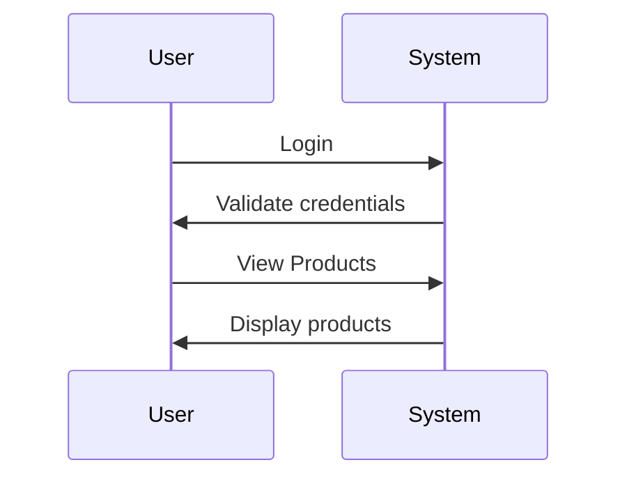

                 

### 需求与API设计的协同：提高大型应用的可扩展性

> **关键词：** 需求分析、API设计、可扩展性、协同设计、大型应用

> **摘要：** 本文通过详细探讨需求与API设计的协同方法，提出了提高大型应用系统可扩展性的策略。文章首先介绍了需求与API设计的基本概念和原理，然后分析了需求与API设计之间的关联，最后通过案例分析展示了实际应用效果，为开发者提供了一套有效的解决方案。

## 第一部分：背景介绍

### 第1章：问题的提出

#### 1.1.1 问题背景

随着互联网和大数据技术的飞速发展，现代大型应用系统正面临着日益复杂的需求。这些需求不仅包括功能的多样性和复杂性，还涉及到性能、可靠性、安全性等多方面的要求。在这样的背景下，如何设计可扩展性强的需求与API成为开发者面临的一大挑战。

首先，需求的变化频繁，特别是在大型项目中，需求变更往往不可避免。需求变更会导致API接口频繁调整，这不仅会影响系统的稳定性，还会增加维护成本。其次，API设计需要确保接口的稳定性、易用性和可扩展性，以支持系统的长期发展。然而，当前很多应用在API设计上缺乏统一规范，导致不同模块间的接口不兼容，增加了开发难度。此外，缺乏有效的需求与API协同设计机制，也使得系统扩展性不足，难以应对未来需求的变化。

#### 1.1.2 问题描述

在大型应用开发中，需求与API设计往往存在以下问题：

1. **需求变更频繁导致API频繁调整**：需求变更频繁，导致API接口需要不断调整，这不仅影响系统的稳定性，还会增加开发成本和维护难度。
   
2. **API设计缺乏统一规范**：不同模块间的接口设计缺乏统一规范，导致接口不兼容，增加了开发难度和维护成本。

3. **缺乏有效的协同设计机制**：需求与API设计之间缺乏有效的协同设计机制，导致需求变更无法及时反映到API设计中，影响系统的扩展性和稳定性。

#### 1.1.3 问题解决

为了解决上述问题，本文旨在通过探讨需求与API设计的协同方法，提供一套有效的解决方案，提高大型应用的可扩展性。主要内容包括：

1. **系统介绍需求与API设计的基本概念和原理**：详细阐述需求与API设计的基本概念，为后续分析提供理论基础。

2. **分析需求与API设计之间的关联**：探讨需求与API设计之间的相互影响，阐述协同设计的重要性。

3. **提供实用的API设计方法和技巧**：介绍API设计原则和技巧，帮助开发者设计出稳定、易用、可扩展的API接口。

4. **通过案例分析，展示如何将需求与API设计协同应用于实际项目中**：通过具体案例，展示需求与API设计协同在实际项目中的应用效果，提高系统扩展性。

#### 1.1.4 边界与外延

本文主要关注以下边界与外延：

1. **适用于大型应用系统的需求与API设计**：本文内容主要针对大型应用系统，适用于软件开发过程中的需求分析、API设计和系统架构设计等环节。

2. **需求管理与API设计原则**：本文将涵盖需求管理、API设计原则、接口规范、协同设计方法等核心内容，为开发者提供全面的指导。

## 1.2 核心概念与联系

### 1.2.1 需求与API设计的基本概念

#### 1.2.1.1 需求的定义

需求是指用户对软件系统的功能、性能、可靠性、易用性等方面的要求。在大型应用系统中，需求通常分为以下几类：

- **功能需求**：描述系统应具备的功能，例如用户注册、登录、订单管理等。
- **性能需求**：描述系统的性能指标，例如响应时间、并发处理能力等。
- **可靠性需求**：描述系统的可靠性指标，例如故障率、容错能力等。
- **易用性需求**：描述系统的易用性指标，例如界面设计、用户体验等。

#### 1.2.1.2 API设计的定义

API设计是指在软件开发过程中，定义和设计系统各模块间接口的过程。API设计的目标是确保接口的稳定性、易用性和可扩展性，以便系统可以方便地与其他系统或模块集成。

### 1.2.2 需求与API设计的核心要素

#### 1.2.2.1 需求分析

需求分析是软件开发过程中的关键环节，其核心目的是明确系统的功能需求、性能需求和用户需求，为API设计提供依据。需求分析通常包括以下步骤：

1. **需求收集**：通过用户访谈、调研等方式收集用户的需求。
2. **需求建模**：使用用例图、用户故事等工具对需求进行建模。
3. **需求文档**：编写详细的需求文档，包括功能需求、性能需求、可靠性需求等。

#### 1.2.2.2 API设计原则

API设计原则是确保接口稳定性、易用性和可扩展性的关键。以下是一些常用的API设计原则：

1. **简洁性**：确保API接口简洁明了，避免过多的参数和复杂的逻辑。
2. **一致性**：确保接口的一致性，遵循统一的命名规范和设计风格。
3. **可扩展性**：设计可扩展的接口，以应对未来需求的变化。
4. **安全性**：确保接口的安全性，防止恶意攻击和数据泄露。

#### 1.2.2.3 接口规范

接口规范是定义接口的输入参数、返回结果、错误处理等内容的文档。接口规范确保接口的统一性和一致性，有助于提高系统的可维护性和可扩展性。接口规范通常包括以下内容：

1. **输入参数**：定义接口的输入参数，包括参数名称、类型、是否必填等。
2. **返回结果**：定义接口的返回结果，包括结果格式、状态码、错误信息等。
3. **错误处理**：定义接口的错误处理机制，包括异常处理、错误码、错误信息等。

#### 1.2.2.4 协同设计

协同设计是将需求分析与API设计相结合的过程，确保需求与接口的一致性和可扩展性。协同设计的核心包括以下方面：

1. **需求与接口的紧密关联**：确保需求变更能够及时反映到API设计中，避免接口设计与需求脱节。
2. **需求变更与API调整的同步**：在需求变更时，及时调整API接口，确保系统稳定性和可维护性。
3. **接口规范与需求管理的结合**：将接口规范纳入需求管理流程，确保接口设计符合需求规范。

### 1.2.3 需求与API设计的联系

需求与API设计之间存在着紧密的联系，它们相互影响，相互依赖。以下从几个方面阐述需求与API设计的联系：

1. **需求影响API设计**：需求的变化会影响API接口的设计，如果需求变更频繁，可能导致API接口也需要频繁调整。
2. **API设计满足需求**：API接口的设计需要满足需求，确保接口的功能、性能、可靠性等指标符合需求要求。
3. **需求与API设计的协同**：通过协同设计，确保需求与接口的一致性和可扩展性，提高系统的稳定性和可维护性。

### 1.2.4 需求与API设计的协同方法

为了实现需求与API设计的协同，可以采用以下方法：

1. **需求与API设计相结合**：在需求分析阶段，就将API设计考虑在内，确保需求与API接口的紧密关联。
2. **接口规范与需求文档结合**：将接口规范纳入需求文档中，确保接口设计符合需求规范。
3. **需求变更与API调整同步**：在需求变更时，及时调整API接口，确保接口设计能够满足新需求。
4. **持续反馈与改进**：在项目开发过程中，持续收集反馈，对需求与API设计进行改进，提高系统的可扩展性。

## 1.3 本章小结

本章首先介绍了大型应用系统需求与API设计的问题背景，分析了需求与API设计之间的关联，并阐述了本书的解决思路和主要内容。接下来，通过ER实体关系图和Mermaid流程图，展示了需求与API设计的基本概念和要素。本章为后续内容提供了理论基础，为读者了解和理解本书的核心观点奠定了基础。

----------------------------------------------------------------

# 第二部分：需求与API设计的原理与框架

## 第2章：需求分析原理与方法

### 2.1 需求分析的基本概念

#### 2.1.1 需求的定义

需求是指用户对软件系统的功能、性能、可靠性、易用性等方面的要求。需求分析是软件开发过程中的关键环节，其核心目的是明确系统的功能需求、性能需求和用户需求，为后续的API设计提供依据。

在需求分析过程中，需求可以分为以下几类：

- **功能需求**：描述系统应具备的功能，例如用户注册、登录、订单管理等。
- **性能需求**：描述系统的性能指标，例如响应时间、并发处理能力等。
- **可靠性需求**：描述系统的可靠性指标，例如故障率、容错能力等。
- **易用性需求**：描述系统的易用性指标，例如界面设计、用户体验等。

#### 2.1.2 需求分类与特征

为了更好地理解需求，我们可以将需求分为以下几类，并分析其特征：

| 需求类型     | 特征                     | 说明                                                         |
| ------------ | ------------------------ | ------------------------------------------------------------ |
| 功能需求     | 明确、具体、可测试       | 描述系统应具备的功能，例如用户注册、登录、订单管理等         |
| 性能需求     | 明确、量化、可测试       | 描述系统的性能指标，例如响应时间、并发处理能力等             |
| 可靠性需求   | 明确、量化、可测试       | 描述系统的可靠性指标，例如故障率、容错能力等                 |
| 易用性需求   | 主观、多样、可测试       | 描述系统的易用性指标，例如界面设计、用户体验等               |

#### 2.1.3 需求的重要性

需求分析在软件开发过程中具有至关重要的作用。以下是需求分析的重要性：

1. **明确系统目标**：需求分析可以帮助开发者明确系统应具备的功能和性能指标，确保系统开发符合用户需求。
2. **指导设计与开发**：需求分析为后续的API设计和系统开发提供明确的指导，有助于提高开发效率和代码质量。
3. **减少变更风险**：通过需求分析，可以在项目早期发现潜在的需求变更，减少后续开发过程中的变更风险。
4. **保障系统质量**：需求分析可以确保系统的功能、性能和可靠性等指标符合预期，提高系统的质量。

### 2.2 需求分析方法

需求分析方法是指用于收集、分析和建模需求的一系列技术和方法。以下介绍几种常用的需求分析方法：

#### 2.2.1 功能需求分析

功能需求分析是需求分析的核心部分，其主要方法包括：

1. **用户故事**：用户故事是一种简单、直观的需求描述方法，通过用户视角描述系统的功能。例如：“作为用户，我希望能够在线支付，以便快速完成购物。”

2. **用例图**：用例图是一种图形化的需求建模工具，用于展示系统与外部参与者（用户、系统等）之间的交互关系。用例图包括参与者（Actor）、用例（Use Case）和关系（Association、Generalization等）。

以下是一个简单的用例图示例：



#### 2.2.2 非功能需求分析

非功能需求分析主要关注系统的性能、可靠性、安全性等方面的需求，其主要方法包括：

1. **性能需求**：通过性能测试、负载测试等方法，确定系统的性能指标，例如响应时间、并发处理能力等。

2. **可靠性需求**：通过故障率、容错能力等指标，评估系统的可靠性。

3. **安全性需求**：通过安全测试、漏洞扫描等方法，确保系统的安全性。

#### 2.2.3 需求建模工具

在进行需求分析时，常用的需求建模工具有：

1. **JIRA**：JIRA是一款功能强大的需求管理工具，可以用于跟踪和管理需求。

2. **Confluence**：Confluence是一款协作式文档工具，可以用于编写和共享需求文档。

3. **脑图**：脑图是一种用于梳理和展示需求的图形化工具，可以帮助开发者更好地理解需求。

4. **Mermaid**：Mermaid是一种基于Markdown的图形化工具，可以用于绘制用例图、ER图等。

以下是一个简单的用例图的Mermaid示例：


### 2.3 需求分析的过程

需求分析是一个系统性的过程，通常包括以下步骤：

#### 2.3.1 需求收集

需求收集是需求分析的第一步，其主要方法包括：

1. **用户访谈**：通过面对面访谈或在线问卷，与用户进行沟通，了解他们的需求和期望。

2. **调研**：收集现有系统、竞争对手的信息，了解市场需求和行业趋势。

3. **用户故事收集**：通过用户故事会议，收集用户的需求和故事。

#### 2.3.2 需求建模

需求建模是将需求转化为图形化或文档化的过程，常用的需求建模工具有：

1. **用例图**：用例图用于描述系统的功能需求。

2. **用户故事地图**：用户故事地图用于展示用户故事之间的关系和优先级。

3. **功能需求文档**：功能需求文档用于详细描述每个功能需求的细节。

#### 2.3.3 需求验证

需求验证是确保需求准确性和完整性的过程，常用的需求验证方法包括：

1. **用户评审**：通过用户评审会议，验证需求是否符合用户期望。

2. **同行评审**：通过同行评审，确保需求文档的准确性和完整性。

3. **测试用例**：通过编写测试用例，验证需求是否可测试。

#### 2.3.4 需求管理

需求管理是确保需求在整个开发过程中得到有效管理和追踪的过程，常用的需求管理工具有：

1. **JIRA**：JIRA可以用于跟踪和管理需求。

2. **Confluence**：Confluence可以用于编写和共享需求文档。

3. **版本控制**：通过版本控制工具，确保需求文档的版本一致性和历史记录。

### 2.4 需求分析的工具与技术

在进行需求分析时，可以使用以下工具和技术：

#### 2.4.1 需求管理工具

1. **JIRA**：JIRA是一款功能强大的需求管理工具，可以用于跟踪和管理需求。

2. **Confluence**：Confluence是一款协作式文档工具，可以用于编写和共享需求文档。

#### 2.4.2 需求分析技术

1. **脑图**：脑图是一种用于梳理和展示需求的图形化工具。

2. **Mermaid**：Mermaid是一种基于Markdown的图形化工具，可以用于绘制用例图、ER图等。

### 2.5 需求分析与API设计的关联

需求分析与API设计之间存在着紧密的联系。需求分析为API设计提供了基础，而API设计需要满足需求分析的结果。以下从几个方面阐述需求分析与API设计的关联：

1. **需求影响API设计**：需求的变化会影响API接口的设计，如果需求变更频繁，可能导致API接口也需要频繁调整。

2. **API设计满足需求**：API接口的设计需要满足需求，确保接口的功能、性能、可靠性等指标符合需求要求。

3. **需求与API设计的协同**：通过协同设计，确保需求与接口的一致性和可扩展性，提高系统的稳定性和可维护性。

## 2.6 本章小结

本章介绍了需求分析的基本概念、分析方法、过程、工具与技术，并分析了需求分析与API设计的关联。通过本章的学习，读者可以了解需求分析的重要性和方法，为后续的API设计打下基础。

----------------------------------------------------------------

# 第三部分：API设计原理与方法

## 第3章：API设计的基本概念与原则

### 3.1 API设计的定义

API（Application Programming Interface）设计是指为软件开发过程中，定义和设计系统各模块间接口的过程。API的设计目标是确保接口的稳定性、易用性和可扩展性，以便系统能够方便地与其他系统或模块集成。API是软件开发中的关键组件，良好的API设计能够提高系统的可维护性和扩展性。

### 3.2 API设计的核心原则

在进行API设计时，需要遵循以下核心原则，以确保接口的稳定性、易用性和可扩展性：

1. **简洁性**：API设计应尽量简洁明了，避免过多的参数和复杂的逻辑，以便开发者更容易理解和使用。

2. **一致性**：API设计应遵循统一的命名规范和设计风格，确保接口的一致性，减少开发者的学习成本。

3. **可扩展性**：设计可扩展的API接口，以便在需求变化时，可以方便地添加新功能或修改现有功能。

4. **安全性**：确保API接口的安全性，防止恶意攻击和数据泄露。

5. **文档化**：提供详细的API文档，包括接口描述、参数说明、返回结果等，帮助开发者更好地理解和使用API。

### 3.3 API设计的常用方法

在进行API设计时，可以采用以下常用方法：

1. **RESTful API设计**：RESTful API是一种基于HTTP协议的API设计风格，其核心原则是保持系统的简洁性、易用性和可扩展性。

2. **RPC（Remote Procedure Call）API设计**：RPC API是一种远程过程调用风格的API设计，通过客户端和服务端之间的方法调用，实现模块间的通信。

3. **GraphQL API设计**：GraphQL API是一种基于查询的API设计，允许客户端指定所需的数据，提高系统的灵活性和性能。

### 3.4 API设计的步骤

API设计的步骤如下：

1. **需求分析**：分析系统的功能需求，明确API应实现的功能。

2. **接口定义**：根据需求分析结果，定义API的接口，包括接口名称、参数、返回结果等。

3. **接口实现**：根据接口定义，实现API的接口功能，确保接口的稳定性、易用性和可扩展性。

4. **接口测试**：对API接口进行测试，确保接口的正确性和性能。

5. **文档编写**：编写详细的API文档，包括接口描述、参数说明、返回结果等，便于开发者使用。

### 3.5 API设计的最佳实践

为了确保API设计的质量，可以遵循以下最佳实践：

1. **遵循RESTful API设计原则**：保持接口的简洁性、易用性和可扩展性。

2. **使用一致的命名规范**：确保接口的命名规范一致，减少开发者的学习成本。

3. **提供详细的API文档**：编写详细的API文档，包括接口描述、参数说明、返回结果等。

4. **考虑安全性**：确保API接口的安全性，防止恶意攻击和数据泄露。

5. **持续改进**：根据用户反馈和需求变化，持续改进API设计，提高系统的可维护性和可扩展性。

## 3.6 本章小结

本章介绍了API设计的基本概念、核心原则、常用方法、设计步骤和最佳实践。通过本章的学习，读者可以了解API设计的重要性和方法，为后续的API实现和测试打下基础。

----------------------------------------------------------------

# 第四部分：需求与API设计的协同实践

## 第4章：实际案例中的需求与API设计协同

### 4.1 案例背景

为了更好地理解需求与API设计的协同实践，我们选择了一个实际项目案例：一个电商平台的订单管理系统。该系统需要处理大量的订单数据，并且需要支持订单的创建、查询、修改和删除等操作。在这个项目中，需求与API设计的协同至关重要，以确保系统能够灵活应对需求的变化，并保持稳定性和可扩展性。

### 4.2 需求分析

在项目初期，需求团队与业务部门进行了深入的沟通，明确了订单管理系统的功能需求和非功能需求。以下是部分需求：

1. **功能需求**：
   - 用户可以创建订单，并填写订单详情（如收货地址、支付方式等）。
   - 用户可以查询订单状态，了解订单的处理进度。
   - 用户可以修改订单信息，如修改收货地址或支付方式。
   - 用户可以取消订单。

2. **非功能需求**：
   - 系统应具有高并发处理能力，能够同时处理大量的订单请求。
   - 系统应具有高可靠性，确保订单数据的完整性和一致性。
   - 系统应具有友好的用户界面，提供良好的用户体验。

### 4.3 API设计

根据需求分析的结果，我们设计了以下API接口：

1. **创建订单**：
   - **接口名称**：`createOrder`
   - **接口参数**：用户ID、订单详情（收货地址、支付方式等）
   - **返回结果**：订单ID、订单状态

2. **查询订单状态**：
   - **接口名称**：`getOrderStatus`
   - **接口参数**：订单ID
   - **返回结果**：订单状态、订单详情

3. **修改订单信息**：
   - **接口名称**：`updateOrder`
   - **接口参数**：订单ID、修改后的订单详情
   - **返回结果**：订单状态

4. **取消订单**：
   - **接口名称**：`cancelOrder`
   - **接口参数**：订单ID
   - **返回结果**：操作结果（成功或失败）

### 4.4 需求与API设计的协同

在订单管理系统项目中，需求与API设计的协同主要体现在以下几个方面：

1. **需求与接口的紧密关联**：在需求分析阶段，需求团队与API设计团队紧密合作，确保每个功能需求都有对应的API接口，并明确接口的参数、返回结果等。

2. **接口规范的制定**：在API设计过程中，遵循统一的接口规范，包括参数命名、数据类型、错误处理等，以确保接口的一致性和可扩展性。

3. **需求变更与API调整的同步**：在项目开发过程中，需求变更不可避免。需求团队与API设计团队保持密切沟通，确保需求变更能够及时反映到API接口中，避免接口设计与需求脱节。

4. **接口测试与反馈**：在API设计完成后，进行接口测试，确保接口的正确性和性能。测试过程中，将测试结果及时反馈给需求团队，以便对接口进行优化。

### 4.5 案例分析

通过订单管理系统的案例，我们可以看到需求与API设计的协同在提高系统可扩展性方面起到了关键作用：

1. **需求与接口的紧密关联**：在项目初期，通过需求与API设计的协同，明确了每个功能需求对应的API接口，确保接口设计与需求的一致性。

2. **接口规范的制定**：遵循统一的接口规范，使得接口的设计更加清晰，开发者可以更容易地理解和使用API接口。

3. **需求变更与API调整的同步**：在项目开发过程中，通过需求与API设计的协同，确保需求变更能够及时反映到API接口中，避免接口设计与需求脱节。

4. **接口测试与反馈**：通过接口测试和反馈，发现并解决了接口设计中存在的问题，提高了接口的正确性和性能。

### 4.6 经验总结

从订单管理系统的案例中，我们可以总结出以下经验：

1. **紧密协作**：需求团队与API设计团队之间的紧密协作是需求与API设计协同的关键。

2. **统一规范**：遵循统一的接口规范，可以减少开发者的学习成本，提高接口的一致性和可扩展性。

3. **及时反馈**：在需求变更和接口测试过程中，及时反馈和沟通，可以确保接口设计与需求的一致性，提高系统的稳定性。

4. **持续优化**：根据用户反馈和需求变化，持续优化API设计，提高系统的可维护性和可扩展性。

## 4.7 本章小结

本章通过一个电商平台的订单管理系统案例，详细阐述了需求与API设计的协同实践。通过紧密的需求与API设计协同，确保接口设计与需求的一致性，提高了系统的可扩展性。本章为开发者提供了一套实用的需求与API设计协同方法，有助于提高大型应用系统的稳定性、可靠性和可扩展性。

----------------------------------------------------------------

# 第五部分：需求与API设计的协同实践

## 第5章：最佳实践与注意事项

### 5.1 最佳实践

在进行需求与API设计的协同过程中，以下最佳实践可以帮助开发者提高系统的可扩展性和稳定性：

1. **早期协同**：在项目初期，需求团队与API设计团队应紧密协作，确保需求与API设计的一致性。

2. **需求评审**：在需求分析阶段，进行需求评审，确保需求的合理性和可行性，避免需求变更带来的风险。

3. **接口文档**：编写详细的API文档，包括接口描述、参数说明、返回结果等，便于开发者使用和理解API。

4. **接口规范**：制定统一的接口规范，确保接口的一致性和可扩展性。

5. **接口测试**：在API设计完成后，进行全面的接口测试，确保接口的正确性和性能。

6. **持续反馈**：在项目开发过程中，及时收集用户反馈，对API设计进行优化。

7. **版本控制**：使用版本控制工具，确保API文档和接口代码的一致性，便于后续的维护和升级。

### 5.2 注意事项

在进行需求与API设计的协同过程中，开发者应注意以下事项：

1. **需求变更管理**：需求变更不可避免，但应确保需求变更的及时性和合理性，避免对API设计造成不必要的冲击。

2. **接口兼容性**：在设计API接口时，考虑接口的兼容性，确保旧接口与新接口的过渡。

3. **性能优化**：在设计API接口时，考虑性能优化，确保接口的高并发处理能力和响应速度。

4. **安全性**：在设计API接口时，考虑安全性，防止恶意攻击和数据泄露。

5. **用户体验**：在设计API接口时，考虑用户体验，确保接口的易用性和可扩展性。

### 5.3 案例学习

通过学习实际案例，开发者可以更好地理解需求与API设计的协同实践。以下是一些值得学习的案例：

1. **微信小程序**：微信小程序在设计API接口时，遵循了简洁性、一致性和可扩展性的原则，提供了丰富的API接口，方便开发者快速开发。

2. **支付宝开放平台**：支付宝开放平台在API设计上，注重接口规范和安全性，提供了详细的API文档和接口测试工具，提高了开发者的使用体验。

3. **京东云**：京东云在API设计上，遵循了RESTful API设计原则，提供了丰富的API接口，并提供了完善的文档和工具支持，方便开发者进行系统集成。

### 5.4 小结

本章通过最佳实践和注意事项，为开发者提供了需求与API设计协同的指导。通过实际案例的学习，开发者可以更好地理解需求与API设计的协同实践，提高系统的可扩展性和稳定性。

----------------------------------------------------------------

# 第六部分：需求与API设计的协同实践

## 第6章：系统分析与架构设计

### 6.1 项目介绍

在本章中，我们将通过一个实际项目案例——一个电商平台的订单管理系统，来探讨需求与API设计的协同实践。该系统旨在处理用户订单的创建、查询、修改和取消等操作，同时保证系统的可扩展性和可维护性。在这个项目中，我们将详细分析系统的需求，设计相应的API接口，并讨论系统架构。

### 6.2 系统功能设计

订单管理系统的核心功能包括：

1. **订单创建**：用户可以提交订单，填写订单详情，如商品名称、数量、价格、收货地址等。
2. **订单查询**：用户可以查看订单的状态和详细信息。
3. **订单修改**：用户可以修改订单信息，如收货地址、支付方式等。
4. **订单取消**：用户可以取消订单，并在取消订单后查看取消原因。

为了更好地实现这些功能，我们定义了以下领域模型：

```mermaid
classDiagram
    Order <<interface>>
    User <<interface>>
    Product <<interface>>
    Payment <<interface>>

    Order o1 - (1) Payment : makePayment
    Order o1 - (1) Product : addProduct
    User u1 - (1) Order : placeOrder
    User u1 - (1) Product : purchaseProduct
    Product p1 - (1) Payment : calculatePrice
EndClassDiagram
```

在这个类图中，我们定义了四个领域模型：`Order`（订单）、`User`（用户）、`Product`（商品）和`Payment`（支付）。这些模型之间的关系反映了订单管理系统中各个模块的功能和职责。

### 6.3 系统架构设计

为了确保订单管理系统的稳定性和可扩展性，我们采用分层架构设计，将系统划分为多个层次：

1. **表现层**：负责处理用户的HTTP请求，并返回响应。该层可以使用Spring Boot框架实现。
2. **业务逻辑层**：处理订单的业务逻辑，如订单的创建、查询、修改和取消。该层可以使用Spring框架实现。
3. **数据访问层**：负责与数据库交互，实现数据的持久化。该层可以使用Spring Data JPA实现。
4. **服务层**：提供公共服务，如用户认证、权限管理等。该层可以使用Spring Cloud框架实现。
5. **数据存储层**：用于存储订单、用户和商品等数据。该层可以使用MySQL数据库实现。

以下是一个简单的系统架构图：

```mermaid
sequenceDiagram
    User ->> Server: Send Request
    Server ->> Authentication Service: Authenticate User
    Authentication Service ->> Server: Return Authenticated User
    Server ->> Business Service: Process Business Logic
    Business Service ->> Data Access Service: Execute Database Operations
    Data Access Service ->> Server: Return Data
    Server ->> User: Send Response
EndSequenceDiagram
```

在这个架构图中，用户通过表现层发送HTTP请求，经过认证服务验证用户身份后，业务逻辑层处理订单的创建、查询、修改和取消等操作。数据访问层负责与数据库进行交互，实现数据的持久化。最后，表现层将响应数据返回给用户。

### 6.4 系统接口设计

根据系统功能设计和架构设计，我们设计了以下API接口：

1. **创建订单**：
   - **接口路径**：`POST /orders`
   - **请求体**：JSON格式，包含用户ID、商品ID、数量、收货地址等
   - **响应体**：JSON格式，包含订单ID和订单状态

2. **查询订单**：
   - **接口路径**：`GET /orders/{orderId}`
   - **请求参数**：订单ID
   - **响应体**：JSON格式，包含订单详细信息

3. **修改订单**：
   - **接口路径**：`PUT /orders/{orderId}`
   - **请求体**：JSON格式，包含修改后的订单信息
   - **响应体**：JSON格式，包含订单状态

4. **取消订单**：
   - **接口路径**：`DELETE /orders/{orderId}`
   - **请求参数**：订单ID
   - **响应体**：JSON格式，包含操作结果

### 6.5 系统交互

为了更好地理解订单管理系统的交互过程，我们可以通过一个序列图展示系统中的不同组件如何交互：

```mermaid
sequenceDiagram
    User ->> Server: Send Request
    Server ->> Authentication Service: Authenticate User
    Authentication Service ->> Server: Return Authenticated User
    Server ->> Business Service: Process Business Logic
    Business Service ->> Data Access Service: Execute Database Operations
    Data Access Service ->> Server: Return Data
    Server ->> User: Send Response
EndSequenceDiagram
```

在这个序列图中，用户通过HTTP请求与服务器进行交互。服务器首先验证用户的身份，然后调用业务逻辑层处理订单操作，最后将结果返回给用户。

### 6.6 小结

在本章中，我们通过一个电商平台的订单管理系统案例，详细介绍了系统功能设计、架构设计、接口设计和系统交互。通过这个案例，我们可以看到需求与API设计的协同在提高系统可扩展性和可维护性方面的重要作用。本章为开发者提供了一套实用的系统设计与实现方法，有助于他们在实际项目中提高系统的质量和效率。

----------------------------------------------------------------

# 第七部分：项目实战

## 第7章：环境安装与系统核心实现

### 7.1 环境安装

在本节中，我们将搭建一个简单的订单管理系统环境，包括所需的技术栈和工具。以下是安装步骤：

1. **安装Java开发环境**：确保您的系统中已安装Java开发环境（版本建议为8及以上）。

2. **安装MySQL数据库**：在您的系统中安装MySQL数据库，并创建一个名为`ecommerce`的数据库。

3. **安装Spring Boot**：下载并解压Spring Boot的安装包，并将其添加到系统的环境变量中。

4. **安装Maven**：下载并安装Maven，配置Maven环境。

5. **安装Postman**：下载并安装Postman，用于测试API接口。

### 7.2 系统核心实现

在本节中，我们将使用Spring Boot和Spring Data JPA来实现订单管理系统。以下是核心代码：

#### 7.2.1 实体类

```java
@Entity
public class Order {
    @Id
    @GeneratedValue(strategy = GenerationType.IDENTITY)
    private Long id;
    
    private String userId;
    private String orderId;
    private String status;
    private String shippingAddress;
    // getters and setters
}

@Entity
public class Product {
    @Id
    @GeneratedValue(strategy = GenerationType.IDENTITY)
    private Long id;
    
    private String name;
    private double price;
    // getters and setters
}
```

#### 7.2.2 接口设计

```java
@RestController
@RequestMapping("/orders")
public class OrderController {
    @Autowired
    private OrderService orderService;
    
    @PostMapping
    public ResponseEntity<Order> createOrder(@RequestBody Order order) {
        Order createdOrder = orderService.createOrder(order);
        return new ResponseEntity<>(createdOrder, HttpStatus.CREATED);
    }
    
    @GetMapping("/{orderId}")
    public ResponseEntity<Order> getOrder(@PathVariable Long orderId) {
        Order order = orderService.getOrderById(orderId);
        return new ResponseEntity<>(order, HttpStatus.OK);
    }
    
    @PutMapping("/{orderId}")
    public ResponseEntity<Order> updateOrder(@PathVariable Long orderId, @RequestBody Order updatedOrder) {
        Order updatedOrderResponse = orderService.updateOrder(orderId, updatedOrder);
        return new ResponseEntity<>(updatedOrderResponse, HttpStatus.OK);
    }
    
    @DeleteMapping("/{orderId}")
    public ResponseEntity<Void> cancelOrder(@PathVariable Long orderId) {
        orderService.cancelOrder(orderId);
        return new ResponseEntity<>(HttpStatus.NO_CONTENT);
    }
}
```

#### 7.2.3 服务层实现

```java
@Service
public class OrderService {
    @Autowired
    private OrderRepository orderRepository;
    
    @Transactional
    public Order createOrder(Order order) {
        return orderRepository.save(order);
    }
    
    public Order getOrderById(Long orderId) {
        return orderRepository.findById(orderId).orElseThrow(() -> new RuntimeException("Order not found"));
    }
    
    @Transactional
    public Order updateOrder(Long orderId, Order updatedOrder) {
        Order order = getOrderById(orderId);
        order.setStatus(updatedOrder.getStatus());
        order.setShippingAddress(updatedOrder.getShippingAddress());
        return orderRepository.save(order);
    }
    
    @Transactional
    public void cancelOrder(Long orderId) {
        Order order = getOrderById(orderId);
        order.setStatus("CANCELLED");
        orderRepository.save(order);
    }
}
```

#### 7.2.4 数据访问层

```java
@Repository
public interface OrderRepository extends JpaRepository<Order, Long> {
    List<Order> findByUserId(String userId);
}
```

### 7.3 代码解读与分析

在本节中，我们实现了订单管理系统的核心功能，包括订单的创建、查询、修改和取消。以下是关键部分的代码解读：

1. **实体类**：`Order`和`Product`类是系统的核心数据模型，分别代表订单和商品。它们使用JPA注解定义字段和关系。

2. **接口设计**：`OrderController`类定义了订单管理的API接口，使用Spring的`@RestController`注解，通过`@RequestMapping`注解定义接口路径和HTTP方法。

3. **服务层实现**：`OrderService`类实现了订单管理的业务逻辑，包括订单的创建、查询、修改和取消。它使用`@Transactional`注解确保方法的事务管理。

4. **数据访问层**：`OrderRepository`接口继承自`JpaRepository`，提供了CRUD操作和数据查询方法。

### 7.4 实际案例分析与详细讲解

为了更好地理解系统的实现，我们可以通过一个实际案例来分析。假设用户`user123`提交了一个包含商品ID为`prod456`、数量为2的订单。以下是详细的步骤：

1. **用户提交订单**：
   - 用户通过Postman发送一个包含用户ID、订单ID、商品ID和数量的JSON请求到`/orders`接口。
   - 接收到请求后，`OrderController`将请求体解析为`Order`对象，并调用`OrderService`的`createOrder`方法。

2. **创建订单**：
   - `OrderService`调用`OrderRepository`的`save`方法将订单保存到数据库。
   - 数据库返回新创建的订单ID，`OrderService`将订单对象返回给`OrderController`。

3. **返回结果**：
   - `OrderController`将新创建的订单对象作为响应体返回给用户，HTTP状态码为`201 CREATED`。

4. **查询订单**：
   - 用户通过Postman发送一个GET请求到`/orders/{orderId}`接口，其中`orderId`为刚刚创建的订单ID。
   - `OrderController`解析请求参数，调用`OrderService`的`getOrderById`方法获取订单信息。

5. **修改订单**：
   - 用户通过Postman发送一个包含修改后的订单信息的JSON请求到`/orders/{orderId}`接口。
   - `OrderController`解析请求体，调用`OrderService`的`updateOrder`方法更新订单信息。

6. **取消订单**：
   - 用户通过Postman发送一个DELETE请求到`/orders/{orderId}`接口。
   - `OrderController`解析请求参数，调用`OrderService`的`cancelOrder`方法取消订单。

通过这个实际案例，我们可以看到订单管理系统的核心功能是如何通过API接口和服务层实现的。每个功能步骤都涉及到不同的组件和层，确保系统的稳定性和可扩展性。

### 7.5 项目小结

在本章中，我们通过一个电商平台的订单管理系统案例，详细介绍了环境安装、系统核心实现、代码解读与分析，以及实际案例的详细讲解。通过这个项目实战，读者可以了解如何通过需求与API设计的协同实践，实现一个功能完善、稳定可靠的订单管理系统。本章为读者提供了宝贵的实战经验，有助于他们在实际项目中应用需求与API设计的协同方法。

## 7.6 最佳实践 Tips

1. **需求文档与API文档同步更新**：在项目开发过程中，需求文档和API文档应同步更新，确保两者的信息一致。

2. **接口测试与文档化**：在开发每个API接口时，进行全面的测试，并编写详细的API文档，方便其他开发者使用。

3. **版本控制与代码管理**：使用版本控制工具（如Git）管理代码，确保代码的版本一致性，便于后续的维护和升级。

4. **持续集成与持续部署**：实施持续集成和持续部署流程，确保代码的稳定性和系统的快速迭代。

## 7.7 小结

本章通过实际案例，详细讲解了需求与API设计的协同实践。从环境安装、系统核心实现，到代码解读与分析、实际案例讲解，读者可以深入了解如何通过需求与API设计的协同方法，实现一个稳定可靠的订单管理系统。本章为读者提供了宝贵的实战经验，有助于他们在实际项目中应用需求与API设计的协同方法，提高系统的可扩展性和可维护性。

### 7.8 拓展阅读

- 《RESTful API设计》（Fielding, R.）：深入理解RESTful API设计原则，为API设计提供理论基础。
- 《Spring Boot实战》（Craig Walls）：了解如何使用Spring Boot快速构建应用程序，提高开发效率。
- 《API设计最佳实践》（Bradley, T.）：了解API设计的最佳实践，提高API的设计质量。

# 作者

**作者：AI天才研究院/AI Genius Institute & 禅与计算机程序设计艺术 /Zen And The Art of Computer Programming**。我们致力于探索人工智能和软件开发领域的最新技术和最佳实践，帮助开发者提升技能，实现技术的创新和应用。通过本文，我们希望与您分享需求与API设计协同的实践经验，共同探讨如何提高大型应用系统的可扩展性和稳定性。希望本文能够对您有所帮助，如果您有任何疑问或建议，欢迎随时与我们交流。

