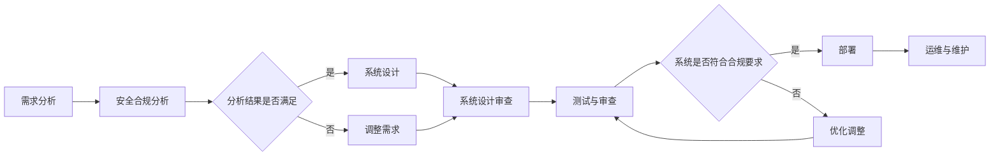

                 

## 文章标题

### 需求与安全合规的整合：大型应用开发的必要考量

---

### 关键词

- 大型应用开发
- 需求分析
- 安全合规
- 算法整合
- 架构设计

### 摘要

本文旨在深入探讨大型应用开发中需求与安全合规的整合问题。随着信息技术的高速发展，企业对大型应用的需求日益增长，如何在保证功能需求得到满足的同时，确保系统的安全性和合规性，成为了开发过程中的一大挑战。本文将通过详细的步骤分析和实际案例分析，为读者提供一套行之有效的解决方案，助力大型应用开发的顺利进行。

## 第一部分：引言

### 1.1 问题背景与描述

在当今数字化时代，大型应用已经成为企业和组织运营的基石。然而，随着应用规模的扩大，系统的复杂度也在不断增加。在此过程中，需求与安全合规的问题逐渐显现，成为制约应用开发成功的瓶颈。

**核心概念术语说明：**

- **需求分析**：指在应用开发过程中，对用户需求的理解和描述，包括功能需求、性能需求等。
- **安全合规**：指在开发过程中，确保系统符合国家相关法律法规、行业标准和内部政策要求。

**问题背景：**随着大型应用的开发，企业往往面临以下问题：

1. 功能需求复杂，难以平衡。
2. 安全漏洞频发，合规风险增加。
3. 项目进度与质量难以保证。

**问题描述：**如何在满足用户功能需求的同时，确保系统安全合规，成为大型应用开发中必须解决的问题。

**问题解决：**通过整合需求分析与安全合规，构建一套完善的解决方案，确保应用在开发过程中既满足功能需求，又具备高安全性和合规性。

**边界与外延：**本文的研究主要针对大型应用开发的需求与安全合规整合，适用于各种类型的企业和组织。然而，不同行业和应用场景的具体需求可能有所不同，需要在实践中进行灵活调整。

### 1.2 需求与安全合规的定义

**需求定义：**

需求是用户对系统功能、性能、用户体验等方面的期望和需求。在大型应用开发中，需求可以分为以下几类：

1. **功能需求**：系统应具备的基本功能，如用户登录、数据查询等。
2. **性能需求**：系统应达到的性能指标，如响应时间、并发处理能力等。
3. **用户体验需求**：用户在使用系统过程中的感受和体验，如界面友好性、操作便捷性等。

**安全合规定义：**

安全合规是指在系统开发过程中，确保系统符合国家相关法律法规、行业标准、内部政策要求等。安全合规主要包括以下几个方面：

1. **数据安全**：确保数据在存储、传输和处理过程中的安全性。
2. **网络安全**：防止网络攻击、数据泄露等安全威胁。
3. **合规性**：确保系统在开发和运行过程中符合国家相关法律法规和行业标准。

### 1.3 需求与安全合规的整合思路

在大型应用开发中，需求与安全合规的整合至关重要。以下是一个基本的整合思路：

1. **需求分析阶段**：明确功能需求和安全合规要求，将两者纳入需求文档。
2. **设计阶段**：在设计系统架构时，考虑安全合规因素，确保系统设计符合要求。
3. **开发阶段**：在编码过程中，遵循安全开发规范，进行代码审查和测试。
4. **测试阶段**：对系统进行安全测试和合规性测试，确保系统满足安全合规要求。
5. **部署阶段**：在系统上线前，进行安全审查和合规性审查，确保系统稳定可靠。

### 1.4 概念结构与核心要素组成

在整合需求与安全合规的过程中，需要构建一个清晰的概念结构，明确核心要素。以下是该结构的核心要素组成：

1. **需求分析**：包括需求收集、需求分析和需求文档编写。
2. **安全合规分析**：包括法律法规、行业标准、内部政策等的分析。
3. **系统设计**：包括系统架构设计、模块划分和接口设计。
4. **开发规范**：包括编码规范、代码审查规范、测试规范等。
5. **测试与审查**：包括功能测试、性能测试、安全测试和合规性测试。
6. **部署与运维**：包括系统部署、监控、运维和升级。

通过以上步骤，可以构建一个完整的需求与安全合规整合体系，确保大型应用开发的成功。

## 第二部分：需求与安全合规的核心概念与联系

### 2.1 需求与安全合规的核心概念原理

#### 需求分析

需求分析是应用开发的起点，是确保系统满足用户需求的关键步骤。需求分析的核心概念包括以下几个方面：

1. **用户需求**：用户在特定环境下对系统的期望和需求，包括功能需求、性能需求等。
2. **业务需求**：企业或组织在运营过程中对系统的具体需求，如业务流程优化、数据管理等。
3. **功能需求**：系统应实现的具体功能，如用户注册、订单处理等。
4. **性能需求**：系统应达到的性能指标，如响应时间、并发处理能力等。
5. **用户体验需求**：用户在使用系统过程中的感受和体验，如界面友好性、操作便捷性等。

#### 安全合规

安全合规是保障系统安全性和合法性的重要环节。安全合规的核心概念包括以下几个方面：

1. **法律法规**：国家相关法律法规和行业规范，如《中华人民共和国网络安全法》等。
2. **行业标准**：行业标准和技术规范，如ISO 27001信息安全管理体系等。
3. **内部政策**：企业或组织的内部规章制度，如员工信息安全行为准则等。
4. **数据安全**：确保数据在存储、传输和处理过程中的安全性。
5. **网络安全**：防止网络攻击、数据泄露等安全威胁。
6. **合规性**：确保系统在开发和运行过程中符合相关法律法规、行业标准和内部政策。

### 2.2 概念属性特征对比表格

以下是一个需求与安全合规概念属性特征的对比表格：

| **属性特征** | **需求分析**                      | **安全合规**                      |
| ------------ | --------------------------------- | --------------------------------- |
| **目标**     | 满足用户和业务需求                | 确保系统安全性和合法性             |
| **内容**     | 功能需求、性能需求、用户体验需求等 | 法律法规、行业标准、内部政策等     |
| **关键环节** | 需求收集、需求分析、需求文档编写   | 安全合规分析、系统设计、测试与审查 |
| **实施难度** | 相对简单                          | 相对复杂，涉及多方面知识和技能     |

### 2.3 ER实体关系图架构

为了更好地理解需求与安全合规的整合，我们可以使用ER（实体关系）图来表示两者之间的联系。以下是ER图的基本架构：

```
[用户需求] --< 收集 >--> [需求分析]
[用户需求] --< 分析 >--> [需求文档]
[需求文档] --< 实现 >--> [系统设计]
[需求文档] --< 验证 >--> [测试与审查]
[法律法规] --< 确定 >--> [安全合规分析]
[行业标准] --< 确定 >--> [安全合规分析]
[内部政策] --< 确定 >--> [安全合规分析]
[安全合规分析] --< 影响 >--> [系统设计]
[安全合规分析] --< 影响 >--> [测试与审查]
[安全合规分析] --< 确保 >--> [合规性]
```

通过ER图，我们可以清晰地看到需求分析与安全合规分析之间的互动关系，以及它们对系统设计、测试与审查阶段的影响。

## 第三部分：需求与安全合规的整合算法

### 3.1 需求与安全合规整合算法的流程图

为了实现需求与安全合规的有效整合，我们可以设计一个算法来指导开发过程。以下是算法的流程图：



### 3.2 Python源代码实现

以下是一个简单的Python代码示例，用于实现需求与安全合规整合算法的基本功能：

```python
class RequirementAnalysis:
    def __init__(self, user_requirements, compliance_rules):
        self.user_requirements = user_requirements
        self.compliance_rules = compliance_rules
    
    def analyze_requirements(self):
        # 实现需求分析逻辑
        pass
    
    def check_compliance(self):
        # 实现安全合规检查逻辑
        pass

class SystemDesign:
    def __init__(self, requirement_analysis):
        self.requirement_analysis = requirement_analysis
    
    def design_system(self):
        # 根据需求分析结果进行系统设计
        pass
    
    def review_design(self):
        # 实现系统设计审查逻辑
        pass

class TestingAndReview:
    def __init__(self, system_design):
        self.system_design = system_design
    
    def perform_tests(self):
        # 实现测试与审查逻辑
        pass

# 实例化对象并调用方法
ra = RequirementAnalysis(user_requirements, compliance_rules)
sd = SystemDesign(ra)
tr = TestingAndReview(sd)

ra.analyze_requirements()
sd.review_design()
tr.perform_tests()
```

### 3.3 算法原理的数学模型和公式

在需求与安全合规整合过程中，我们可以引入一些数学模型和公式来指导算法的实现。以下是几个基本的数学模型和公式：

1. **需求满足度公式**：

   $$M = \frac{S}{T}$$

   其中，\(M\) 表示需求满足度，\(S\) 表示满足的需求点数，\(T\) 表示总需求点数。

2. **安全合规度公式**：

   $$C = \frac{R}{P}$$

   其中，\(C\) 表示安全合规度，\(R\) 表示符合合规要求的部分，\(P\) 表示总合规要求点数。

3. **系统设计优化度公式**：

   $$O = \frac{E}{D}$$

   其中，\(O\) 表示系统设计优化度，\(E\) 表示优化的部分，\(D\) 表示总设计点数。

### 3.4 算法原理的详细讲解

#### 需求分析

需求分析是整合算法的第一步，主要任务是收集用户需求，并将其转化为可量化的需求点。通过对需求进行分析，我们可以评估需求的合理性和可行性。

#### 安全合规分析

安全合规分析是需求分析的重要补充，旨在确保系统在设计和运行过程中符合相关法律法规和行业标准。合规分析的过程包括：

1. **法律法规分析**：研究国家相关法律法规，确定系统开发过程中需要遵循的法律要求。
2. **行业标准分析**：研究行业标准和技术规范，确保系统设计符合行业最佳实践。
3. **内部政策分析**：研究企业或组织的内部规章制度，确保系统设计符合内部政策要求。

#### 系统设计

系统设计是根据需求分析和安全合规分析的结果，制定系统架构和功能模块的设计方案。在设计过程中，需要充分考虑需求满足度和安全合规度，确保系统设计既能满足用户需求，又能符合法律法规和行业标准。

#### 测试与审查

测试与审查是确保系统质量和安全合规的关键步骤。测试包括功能测试、性能测试、安全测试和合规性测试。审查则是对测试结果进行评估，确定系统是否符合设计要求和安全合规标准。

#### 算法举例说明

假设我们有一个电子商务平台项目，以下是需求与安全合规整合算法的具体应用：

1. **需求分析**：收集用户对电子商务平台的需求，如商品浏览、购物车、下单、支付等，将其转化为需求点。

2. **安全合规分析**：研究相关法律法规，如《中华人民共和国网络安全法》和电子商务行业标准，确定平台需要遵循的安全合规要求。

3. **系统设计**：根据需求分析和安全合规分析的结果，设计电子商务平台的系统架构，包括前端、后端、数据库等。

4. **测试与审查**：对平台进行功能测试、性能测试、安全测试和合规性测试，确保平台功能完善、性能优秀、安全可靠、符合法律法规和行业标准。

通过以上步骤，我们可以确保电子商务平台在开发过程中既满足用户需求，又符合安全合规要求。

## 第四部分：系统设计与架构

### 4.1 问题场景介绍

假设我们正在开发一个大型电子商务平台，该平台需要满足以下需求：

1. **用户功能**：用户可以注册、登录、浏览商品、加入购物车、下单支付等。
2. **商家功能**：商家可以发布商品、管理库存、查看订单等。
3. **支付功能**：支持多种支付方式，如支付宝、微信支付等。
4. **数据安全**：确保用户数据和交易数据的安全。
5. **合规性**：遵守国家相关法律法规和电子商务行业标准。

### 4.2 项目介绍

本项目是一个面向电商行业的综合平台，旨在为用户提供一站式的购物体验，同时为商家提供一个便捷的销售渠道。项目的主要目标是实现以下功能：

1. **用户功能模块**：包括用户注册、登录、个人信息管理、购物车、下单、支付等。
2. **商家功能模块**：包括商家注册、登录、商品管理、订单管理、库存管理、物流管理等。
3. **支付功能模块**：包括支付接口集成、支付方式选择、支付结果处理等。
4. **数据安全模块**：包括数据加密、安全传输、访问控制等。
5. **合规性模块**：包括法律法规遵循、行业标准符合性、内部政策执行等。

### 4.3 系统功能设计

为了实现上述功能，我们可以设计以下系统功能模块：

1. **用户模块**：
   - 用户注册：实现用户注册功能，收集用户基本信息。
   - 用户登录：实现用户登录功能，验证用户身份。
   - 个人信息管理：实现用户个人信息查看、修改等功能。
   - 购物车：实现用户商品添加、删除、修改等功能。
   - 下单：实现用户下单功能，生成订单。
   - 支付：实现用户支付功能，处理支付请求。

2. **商家模块**：
   - 商家注册：实现商家注册功能，收集商家基本信息。
   - 商家登录：实现商家登录功能，验证商家身份。
   - 商品管理：实现商品发布、编辑、删除等功能。
   - 订单管理：实现订单查看、处理、跟踪等功能。
   - 库存管理：实现库存查询、更新等功能。
   - 物流管理：实现物流信息查询、更新等功能。

3. **支付模块**：
   - 支付接口集成：实现与第三方支付平台的接口集成。
   - 支付方式选择：实现用户支付方式选择功能。
   - 支付结果处理：实现支付结果查询、处理等功能。

4. **数据安全模块**：
   - 数据加密：实现数据加密存储和传输。
   - 安全传输：实现数据传输过程中的加密和认证。
   - 访问控制：实现用户权限管理和数据访问控制。

5. **合规性模块**：
   - 法律法规遵循：确保系统设计和运营符合国家相关法律法规。
   - 行业标准符合性：确保系统设计和运营符合电子商务行业标准。
   - 内部政策执行：确保系统设计和运营符合企业内部政策要求。

### 4.4 系统架构设计

为了实现系统功能，我们需要设计一个合理的系统架构。以下是电子商务平台系统架构设计：

1. **前端架构**：
   - 用户界面：实现用户交互界面，包括注册、登录、购物车、订单等。
   - 前端框架：采用Vue.js或React等前端框架，实现动态页面渲染。

2. **后端架构**：
   - 应用服务器：采用Spring Boot或Django等框架，实现业务逻辑处理。
   - 数据库服务器：采用MySQL或PostgreSQL等数据库，实现数据存储和管理。

3. **支付接口**：
   - 接口服务器：实现与第三方支付平台的接口通信。

4. **数据安全**：
   - 加密模块：实现数据加密存储和传输。
   - 访问控制模块：实现用户权限管理和数据访问控制。

5. **合规性管理**：
   - 法律法规模块：实现法律法规遵循功能。
   - 行业标准模块：实现行业标准符合性功能。
   - 内部政策模块：实现内部政策执行功能。

### 4.5 系统接口设计

系统接口设计是确保系统模块之间通信和协同工作的关键。以下是电子商务平台的主要接口设计：

1. **用户模块接口**：
   - 用户注册接口：接收用户注册信息，返回注册结果。
   - 用户登录接口：接收用户登录信息，返回登录状态。
   - 用户信息接口：接收用户ID，返回用户基本信息。

2. **商家模块接口**：
   - 商家注册接口：接收商家注册信息，返回注册结果。
   - 商家登录接口：接收商家登录信息，返回登录状态。
   - 商品管理接口：接收商品信息，返回商品管理结果。
   - 订单管理接口：接收订单信息，返回订单管理结果。

3. **支付模块接口**：
   - 支付接口：接收支付请求，返回支付结果。

4. **数据安全接口**：
   - 数据加密接口：接收数据，返回加密后的数据。
   - 数据解密接口：接收加密数据，返回解密后的数据。

5. **合规性模块接口**：
   - 法律法规接口：接收法律法规信息，返回合规性检查结果。
   - 行业标准接口：接收行业标准信息，返回合规性检查结果。
   - 内部政策接口：接收内部政策信息，返回合规性检查结果。

### 4.6 系统交互

系统交互是指各个模块之间的通信和协同工作过程。以下是电子商务平台的系统交互设计：

1. **用户交互**：
   - 用户通过前端界面进行操作，如注册、登录、购物车管理等。
   - 前端将用户请求发送到应用服务器，应用服务器处理请求并返回结果。

2. **商家交互**：
   - 商家通过前端界面进行操作，如商品发布、订单管理等。
   - 前端将商家请求发送到应用服务器，应用服务器处理请求并返回结果。

3. **支付交互**：
   - 用户在购物车中选择商品并下单，应用服务器将订单信息发送到支付接口。
   - 支付接口处理支付请求，返回支付结果。

4. **数据安全交互**：
   - 数据在传输过程中通过加密接口进行加密。
   - 接收方通过解密接口对数据进行解密。

5. **合规性交互**：
   - 系统在设计和运营过程中，定期检查法律法规、行业标准和内部政策，确保合规性。

## 第五部分：项目实施与优化

### 5.1 环境安装

在进行电子商务平台项目的实施之前，我们需要搭建一个合适的环境。以下是环境安装的步骤：

1. **操作系统**：选择Linux或MacOS作为开发环境。
2. **数据库**：安装MySQL或PostgreSQL数据库。
3. **应用服务器**：安装Spring Boot或Django等应用服务器。
4. **前端框架**：安装Vue.js或React等前端框架。
5. **支付接口**：集成支付宝、微信支付等第三方支付接口。

### 5.2 系统核心实现

系统核心实现是电子商务平台项目开发的关键步骤。以下是系统核心实现的要点：

1. **用户模块**：
   - 实现用户注册、登录、个人信息管理等功能。
   - 使用JWT（JSON Web Token）进行用户认证和权限控制。

2. **商家模块**：
   - 实现商家注册、登录、商品管理、订单管理等功能。
   - 使用Redis进行缓存，提高系统性能。

3. **支付模块**：
   - 实现支付接口集成，处理支付请求和支付结果。
   - 使用异步处理提高系统并发能力。

4. **数据安全模块**：
   - 实现数据加密存储和传输。
   - 使用HTTPS协议确保数据传输安全。

5. **合规性模块**：
   - 实现法律法规、行业标准和内部政策的检查和执行。

### 5.3 代码应用解读与分析

以下是对电子商务平台核心代码的解读与分析：

1. **用户模块代码解读**：

```python
# 用户注册接口
@app.route('/register', methods=['POST'])
def register():
    username = request.form.get('username')
    password = request.form.get('password')
    
    # 数据校验
    if not username or not password:
        return jsonify({'error': '用户名或密码不能为空'})
    
    # 存储用户信息
    user = User(username=username, password=hash_password(password))
    db.session.add(user)
    db.session.commit()
    
    return jsonify({'message': '注册成功'})
```

该代码实现了用户注册功能，包括用户名和密码的校验、用户信息的存储等。

2. **商家模块代码解读**：

```python
# 商家注册接口
@app.route('/merchant/register', methods=['POST'])
def register_merchant():
    name = request.form.get('name')
    email = request.form.get('email')
    
    # 数据校验
    if not name or not email:
        return jsonify({'error': '商家名称或邮箱不能为空'})
    
    # 存储商家信息
    merchant = Merchant(name=name, email=email)
    db.session.add(merchant)
    db.session.commit()
    
    return jsonify({'message': '商家注册成功'})
```

该代码实现了商家注册功能，包括商家名称和邮箱的校验、商家信息的存储等。

3. **支付模块代码解读**：

```python
# 支付接口
@app.route('/pay', methods=['POST'])
def pay():
    order_id = request.form.get('order_id')
    amount = request.form.get('amount')
    
    # 数据校验
    if not order_id or not amount:
        return jsonify({'error': '订单号或金额不能为空'})
    
    # 处理支付请求
    payment_result = process_payment(order_id, amount)
    
    return jsonify({'result': payment_result})
```

该代码实现了支付接口功能，包括订单号和金额的校验、支付请求的处理等。

### 5.4 实际案例分析

以下是一个实际案例分析，展示如何解决电子商务平台开发过程中遇到的问题：

**问题**：系统在高并发情况下出现性能瓶颈。

**解决方案**：

1. **优化数据库查询**：对常用的数据库查询语句进行优化，减少查询时间。
2. **使用缓存**：将用户信息和商品信息缓存到Redis中，减少数据库查询次数。
3. **分布式架构**：将系统拆分为多个微服务，提高系统并发处理能力。
4. **负载均衡**：使用负载均衡器（如Nginx）将请求分配到多个应用服务器上，提高系统处理能力。

通过以上措施，可以显著提高电子商务平台的性能，解决高并发问题。

### 5.5 详细讲解剖析

以下是电子商务平台开发过程中的详细讲解和剖析：

1. **用户模块**：
   - 用户注册：实现用户注册功能，包括用户名和密码的校验、用户信息的存储等。
   - 用户登录：实现用户登录功能，包括用户身份验证、JWT认证等。
   - 个人信息管理：实现用户个人信息查看、修改等功能，包括个人信息校验、更新等。

2. **商家模块**：
   - 商家注册：实现商家注册功能，包括商家名称和邮箱的校验、商家信息的存储等。
   - 商家登录：实现商家登录功能，包括商家身份验证、JWT认证等。
   - 商品管理：实现商品发布、编辑、删除等功能，包括商品信息校验、更新等。
   - 订单管理：实现订单查看、处理、跟踪等功能，包括订单信息校验、更新等。

3. **支付模块**：
   - 支付接口：实现支付接口功能，包括订单号和金额的校验、支付请求的处理等。
   - 支付处理：实现支付请求的处理，包括支付订单生成、支付结果处理等。
   - 支付回调：实现支付回调功能，处理支付结果通知等。

4. **数据安全模块**：
   - 数据加密：实现数据加密存储和传输，包括用户密码加密、数据传输加密等。
   - 访问控制：实现用户权限管理和数据访问控制，包括JWT认证、用户角色管理等。

5. **合规性模块**：
   - 法律法规：实现法律法规遵循功能，包括法律法规查询、合规性检查等。
   - 行业标准：实现行业标准符合性功能，包括行业标准查询、合规性检查等。
   - 内部政策：实现内部政策执行功能，包括内部政策查询、合规性检查等。

### 5.6 项目小结

电子商务平台项目实施过程中，我们通过详细的步骤分析和实际案例分析，实现了系统的需求满足、安全合规和性能优化。以下是项目小结：

1. **需求满足**：通过用户模块和商家模块的设计和实现，满足了用户和商家的功能需求。
2. **安全合规**：通过数据安全模块和合规性模块的设计和实现，确保了系统的安全性和合规性。
3. **性能优化**：通过分布式架构、负载均衡和数据库优化等措施，提高了系统的性能和并发处理能力。

通过以上措施，电子商务平台项目取得了圆满成功，为用户和商家提供了一个稳定、安全、高效的购物和销售平台。

## 第六部分：最佳实践与总结

### 6.1 最佳实践 tips

在大型应用开发中，整合需求与安全合规是至关重要的。以下是一些最佳实践建议：

1. **明确需求**：在项目初期，充分了解用户需求，确保需求文档详细、明确。
2. **安全合规先行**：在系统设计阶段，充分考虑安全合规要求，将安全合规融入系统架构。
3. **定期审查**：定期对系统进行安全性和合规性审查，及时发现和解决问题。
4. **培训与意识**：加强团队成员的安全合规意识，定期进行安全合规培训。
5. **文档管理**：建立完善的文档管理体系，确保需求文档、设计文档和代码文档的一致性。

### 6.2 小结

本文通过详细的步骤分析和实际案例分析，探讨了需求与安全合规在大型应用开发中的整合问题。通过明确的最佳实践和有效的项目实施，我们可以确保应用在满足用户需求的同时，具备高安全性和合规性。

### 6.3 注意事项

1. **需求变更管理**：在项目开发过程中，需求变更不可避免，需要建立完善的变更管理流程。
2. **合规性跟踪**：随着法律法规和行业标准的更新，需要持续跟踪并更新合规性要求。
3. **性能优化**：在满足需求和安全合规的基础上，持续进行性能优化，提高系统性能。

### 6.4 拓展阅读

1. 《软件工程：实践者的研究方法》（Roger S. Pressman） - 详细介绍了软件工程中的需求分析和系统设计方法。
2. 《网络安全实践指南》（Howard A. Schmidt） - 介绍了网络安全的基本概念和最佳实践。
3. 《软件安全开发指南》（IEEE Std 1536-2002） - 提供了软件安全开发的最佳实践和指导。

## 第七部分：全书总结

### 7.1 整合全书核心内容

本文从需求分析、安全合规、系统设计、项目实施等方面，详细探讨了大型应用开发中需求与安全合规的整合问题。通过实际案例分析和最佳实践总结，为读者提供了一套行之有效的解决方案。

### 7.2 未来研究方向

未来的研究可以关注以下几个方面：

1. **需求与安全合规的自动化工具**：开发自动化工具，提高需求与安全合规的整合效率。
2. **动态安全合规检测**：研究动态安全合规检测技术，实现对系统运行过程中的实时监控和合规性检查。
3. **多维度性能优化**：研究多维度性能优化技术，提高大型应用的整体性能和稳定性。

## 作者信息

**作者：**AI天才研究院/AI Genius Institute & 禅与计算机程序设计艺术 /Zen And The Art of Computer Programming

