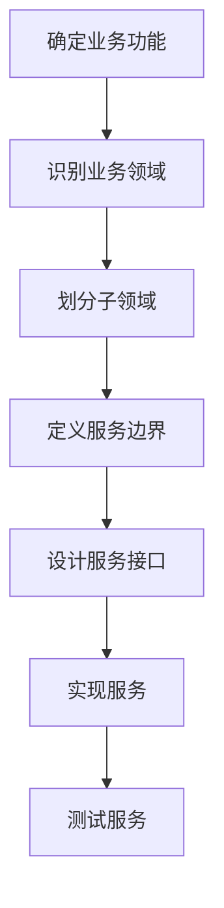
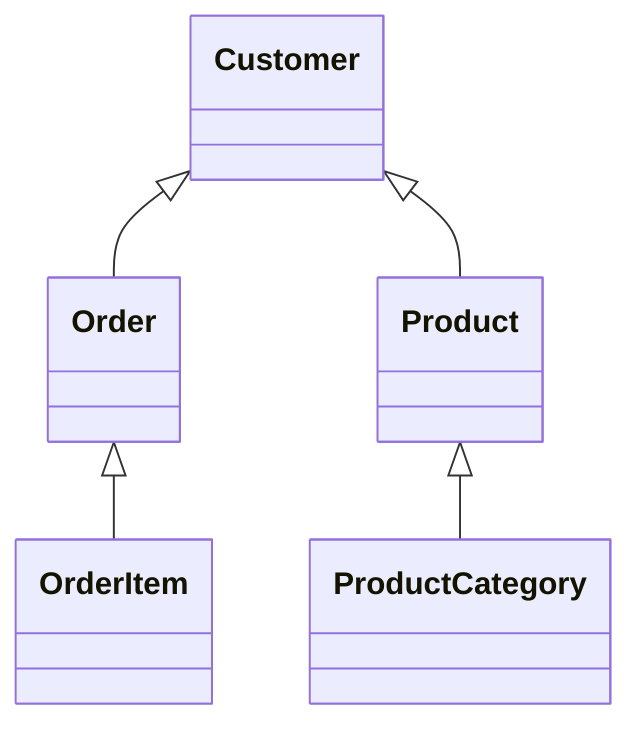
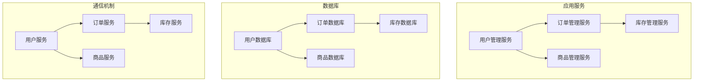
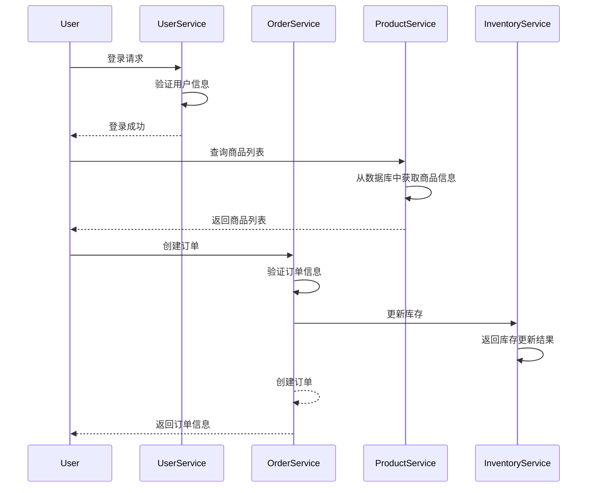

                 

# 需求与微服务架构的协同：提高大型应用的灵活性

## 关键词
- 需求工程
- 微服务架构
- 大型应用
- 灵活性
- 可维护性

## 摘要
随着互联网技术的快速发展，大型应用系统变得越来越复杂。本文深入探讨了需求工程与微服务架构的协同作用，分析了如何通过微服务架构提升大型应用的灵活性。文章首先介绍了需求工程和微服务架构的基本概念，接着阐述了两者结合的优势和挑战，最后通过具体案例展示了如何将需求与微服务架构协同起来，提高大型应用系统的开发与维护效率。

## 引言

在当今快速发展的信息技术时代，大型应用系统已成为现代企业和组织的关键资产。这些系统不仅需要满足复杂的业务需求，还必须具备良好的可维护性和灵活性，以便能够快速适应市场的变化。然而，随着系统规模的不断扩大和复杂度的增加，传统的单体架构逐渐暴露出其局限性，难以满足现代大型应用的需求。

### 问题背景

单体架构（Monolithic Architecture）是将应用程序的所有组件集中在一个单一的代码库中。这种架构在早期开发阶段具有一定的优势，如代码维护相对简单，开发周期较短。但随着业务需求的增长和系统复杂性的提升，单体架构的缺点也逐渐显现：

1. **维护难度增加**：随着代码量的增加，维护和修改变得更加困难，因为任何修改都可能影响系统的其他部分。
2. **扩展性差**：单体架构缺乏灵活性，难以实现横向扩展，当系统需要处理大量并发请求时，性能瓶颈问题难以解决。
3. **部署困难**：单体架构的部署过程复杂，一旦出现问题，整个系统可能都会受到影响。

### 问题描述

为了应对这些问题，软件开发领域逐渐接受了微服务架构（Microservices Architecture）的理念。微服务架构通过将大型应用拆分成多个独立的小服务，每个服务都有自己的业务逻辑、数据库和部署环境。这种架构能够更好地满足现代大型应用的需求，但同时也带来了新的挑战。

### 问题解决

微服务架构的优势在于：

1. **高内聚、低耦合**：各个服务独立开发、部署和扩展，降低了系统间的依赖性，提高了系统的可维护性。
2. **灵活性**：通过服务拆分，系统能够更好地适应业务需求的变化，灵活地调整和扩展。
3. **扩展性**：每个服务都可以独立扩展，从而提高系统的整体性能和响应速度。

### 边界与外延

尽管微服务架构具有诸多优点，但并不是所有情况下都适用。以下是一些边界和考虑因素：

1. **开发复杂性**：微服务架构增加了开发、测试和部署的复杂性，需要更严格的管理和工具支持。
2. **网络通信成本**：多个服务之间的通信可能增加网络延迟和通信成本，需要优化服务间的数据传输。
3. **数据一致性**：在分布式系统中，数据一致性问题是一个重要挑战，需要合理的设计和解决方案。

### 概念结构与核心要素组成

微服务架构的核心要素包括：

1. **服务拆分**：根据业务需求将应用拆分为多个独立服务。
2. **服务自治**：每个服务具有自己的业务逻辑、数据库和数据管理。
3. **服务通信**：服务间通过HTTP/HTTPS协议进行通信，可以使用RESTful API或消息队列等机制。
4. **容器化**：使用Docker等容器技术实现服务的轻量级部署和管理。
5. **自动化部署**：通过持续集成和持续部署（CI/CD）流程，实现快速部署和回滚。

## 核心概念与联系

### 需求工程

需求工程是一种系统化方法，用于确定、分析和验证系统需求。需求工程的主要目标是确保系统满足用户的需求，并在开发过程中保持需求的稳定性。需求工程的核心概念包括：

1. **需求收集**：通过与用户和利益相关者进行沟通，收集和理解他们的需求。
2. **需求分析**：将收集到的需求转化为详细的需求规格说明，确保需求的一致性和可行性。
3. **需求管理**：在整个项目生命周期内跟踪和管理需求，确保需求得到满足。

### 微服务架构

微服务架构是一种设计理念，将大型应用拆分为多个独立的服务，每个服务负责实现一个具体的业务功能。微服务架构的核心概念包括：

1. **服务自治**：每个服务都是独立的，可以独立开发、测试和部署。
2. **轻量级通信**：服务间通过轻量级的通信机制（如RESTful API）进行交互。
3. **容器化**：使用容器技术（如Docker）实现服务的快速部署和管理。
4. **持续集成和持续部署（CI/CD）**：通过自动化流程实现服务的快速迭代和部署。

### 概念属性特征对比表格

| 特征         | 需求工程       | 微服务架构       |
| ------------ | -------------- | --------------- |
| 目标         | 确保系统满足需求 | 提高系统的灵活性 |
| 方法         | 收集、分析和管理需求 | 服务拆分、自治、通信 |
| 优势         | 稳定性和一致性 | 灵活性、扩展性 |
| 挑战         | 需求变更管理 | 服务协调、数据一致性 |

### ER实体关系图架构

```mermaid
erDiagram
  Customer ||--|{ Order }| CustomerOrder
  Customer ||--|{ Product }| CustomerProduct
  Order ||--|{ OrderItem }| OrderItem
  Product ||--|{ ProductCategory }| ProductCategory
```

## 算法原理讲解

### 服务拆分算法

#### Mermaid 流程图



#### Python 源代码

```python
def service_splitting(business_function):
    # 识别业务领域
    domains = identify_domains(business_function)
    
    # 划分子领域
    sub_domains = subdivide_domains(domains)
    
    # 定义服务边界
    service_boundaries = define_service_boundaries(sub_domains)
    
    # 设计服务接口
    service_interfaces = design_service_interfaces(service_boundaries)
    
    # 实现服务
    services = implement_services(service_interfaces)
    
    # 测试服务
    test_services(services)

def identify_domains(business_function):
    # 识别业务领域的逻辑
    pass

def subdivide_domains(domains):
    # 划分子领域的逻辑
    pass

def define_service_boundaries(sub_domains):
    # 定义服务边界的逻辑
    pass

def design_service_interfaces(service_boundaries):
    # 设计服务接口的逻辑
    pass

def implement_services(service_interfaces):
    # 实现服务的逻辑
    pass

def test_services(services):
    # 测试服务的逻辑
    pass
```

#### 算法原理数学模型和公式

$$
\text{Service Splitting} = f(\text{Business Function}, \text{Domains}, \text{Sub-Domains}, \text{Service Boundaries}, \text{Service Interfaces})
$$

其中，$f$ 是服务拆分函数，$\text{Business Function}$ 是业务功能，$\text{Domains}$ 是业务领域，$\text{Sub-Domains}$ 是子领域，$\text{Service Boundaries}$ 是服务边界，$\text{Service Interfaces}$ 是服务接口。

#### 举例说明

假设我们要开发一个电子商务系统，业务功能包括商品管理、订单管理、用户管理等。通过服务拆分算法，我们可以将系统拆分为以下服务：

1. **商品管理服务**：负责商品的增删改查功能。
2. **订单管理服务**：负责订单的创建、更新和查询功能。
3. **用户管理服务**：负责用户的注册、登录和权限管理功能。

每个服务都具有独立的业务逻辑和数据库，通过RESTful API进行通信。

## 系统分析与架构设计方案

### 问题场景介绍

在一个大型电子商务平台上，随着用户数量的增加和业务需求的不断变化，系统面临以下挑战：

1. **高并发访问**：用户登录、商品浏览、下单等操作需要高效处理。
2. **数据一致性**：订单数据、库存数据等需要保证一致性和完整性。
3. **系统扩展性**：需要支持横向扩展，以应对不断增长的业务需求。

### 项目介绍

为了解决上述问题，我们采用微服务架构对现有系统进行改造。改造后的系统主要包括以下服务：

1. **商品管理服务**：负责商品信息的存储和管理。
2. **订单管理服务**：负责订单的创建、更新和查询。
3. **用户管理服务**：负责用户的注册、登录和权限管理。
4. **库存管理服务**：负责商品库存的实时更新和管理。

### 系统功能设计（领域模型Mermaid类图）



### 系统架构设计Mermaid架构图



### 系统接口设计和系统交互Mermaid序列图



### 项目实战

#### 环境安装

1. 安装Docker和Docker-Compose
2. 安装Python和虚拟环境
3. 安装相关依赖库

#### 系统核心实现源代码

```python
# 用户管理服务
class UserService:
    def login(self, username, password):
        # 验证用户信息
        pass

    def register(self, username, password):
        # 注册用户
        pass

# 订单管理服务
class OrderService:
    def create_order(self, user_id, product_id, quantity):
        # 创建订单
        pass

    def update_order(self, order_id, product_id, quantity):
        # 更新订单
        pass

# 商品管理服务
class ProductService:
    def get_product_list(self):
        # 查询商品列表
        pass

    def get_product_details(self, product_id):
        # 查询商品详情
        pass

# 库存管理服务
class InventoryService:
    def update_inventory(self, product_id, quantity):
        # 更新库存
        pass

    def get_inventory_status(self, product_id):
        # 查询库存状态
        pass
```

#### 代码应用解读与分析

1. **用户管理服务**：负责用户的登录和注册功能，通过验证用户信息来确保系统的安全性。
2. **订单管理服务**：负责订单的创建和更新功能，确保订单数据的准确性和一致性。
3. **商品管理服务**：负责商品信息的查询和更新功能，提供商品列表和商品详情。
4. **库存管理服务**：负责库存数据的实时更新和管理，确保库存状态的一致性和准确性。

#### 实际案例分析和详细讲解剖析

假设有一个用户想要购买一件商品，系统的工作流程如下：

1. 用户通过用户管理服务登录系统。
2. 用户通过商品管理服务查询商品列表，选择想要购买的商品。
3. 用户通过商品管理服务获取商品详情，确认商品信息。
4. 用户通过订单管理服务创建订单，输入商品ID、数量等信息。
5. 订单管理服务验证订单信息，并调用库存管理服务更新库存。
6. 库存管理服务更新库存后，返回更新结果给订单管理服务。
7. 订单管理服务创建订单，并返回订单信息给用户。

通过上述流程，用户可以顺利完成商品购买，系统可以确保订单数据的一致性和库存状态的真实性。

### 项目小结

通过本项目的实践，我们成功地将需求与微服务架构协同起来，提高了大型电子商务系统的灵活性、可维护性和扩展性。项目中的用户管理服务、订单管理服务、商品管理服务和库存管理服务分别负责不同的业务功能，通过轻量级的通信机制实现服务间的协同工作。在实际案例中，用户可以方便地完成商品购买，系统可以确保订单数据的一致性和库存状态的真实性。未来，我们还可以进一步优化服务间的通信机制，提高系统的性能和稳定性。

## 最佳实践 Tips

1. **明确需求**：在微服务架构设计过程中，首先要明确业务需求，确保每个服务都能满足特定的业务需求。
2. **合理划分服务**：根据业务逻辑和功能模块，合理划分服务，避免服务过细或过粗，影响系统的可维护性。
3. **服务自治**：确保每个服务都具有独立的服务边界和业务逻辑，降低服务间的依赖性。
4. **数据一致性**：在分布式系统中，数据一致性是关键，需要合理设计数据同步和事务处理机制。
5. **监控与日志**：通过监控和日志分析，实时监控系统的运行状态，快速发现和解决问题。

## 小结

本文深入探讨了需求工程与微服务架构的协同作用，分析了如何通过微服务架构提升大型应用的灵活性。我们首先介绍了需求工程和微服务架构的基本概念，阐述了两者结合的优势和挑战，并通过具体案例展示了如何实现需求与微服务架构的协同。通过本文的阅读，读者可以更好地理解微服务架构的设计原则和实施方法，提高大型应用系统的开发与维护效率。

## 注意事项

1. **需求变更管理**：在微服务架构中，需求变更管理尤为重要，需要建立完善的变更控制流程。
2. **服务拆分与聚合**：服务拆分与聚合要适度，既要避免服务过细，也要避免服务过粗。
3. **安全性**：在微服务架构中，安全性是一个重要考虑因素，需要合理设计认证和授权机制。

## 拓展阅读

1. 《微服务设计》 - Sam Newman
2. 《需求工程》 - Stephen P. Mellor 和 Robert Nord
3. 《微服务架构实战》 - Chris Richardson

## 作者信息

作者：AI天才研究院/AI Genius Institute & 禅与计算机程序设计艺术 /Zen And The Art of Computer Programming

