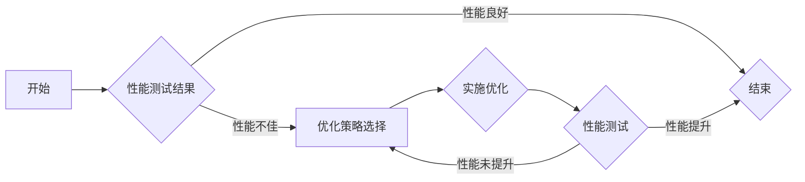
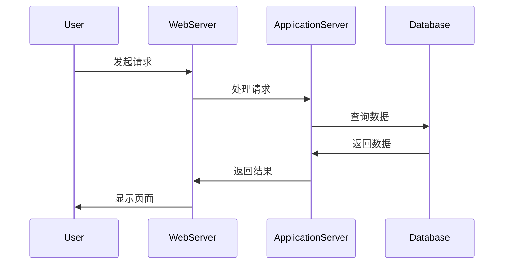
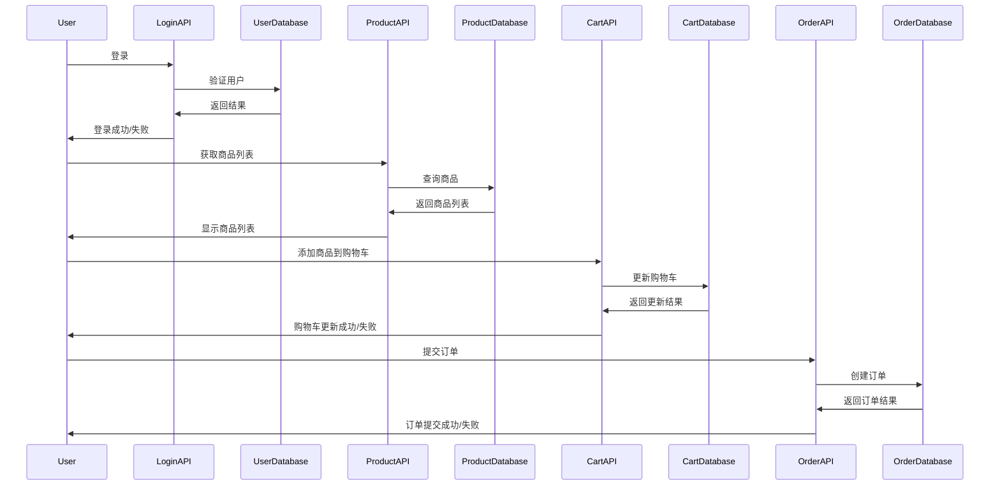
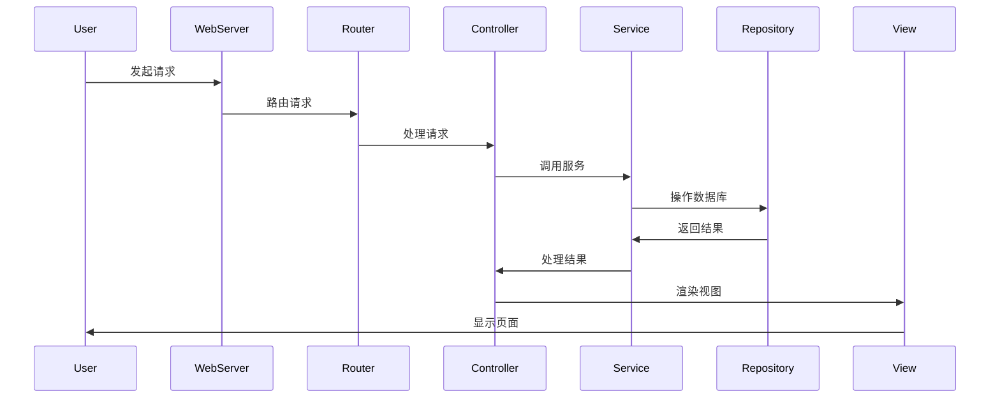

                 

### 《需求与性能指标的协调：大型应用开发的平衡之道》

#### 关键词：需求工程、性能工程、协调、大型应用、开发

> **摘要：** 本文探讨了在大型应用开发过程中，如何协调需求和性能指标，实现应用的高效性和稳定性。通过背景介绍、核心概念解析、理论框架建立，以及实际案例分析，本文旨在为开发者提供一套全面的需求与性能协调方法论。

---

## **引言**

在现代软件工程领域，大型应用开发是一个普遍存在且不断发展的趋势。随着用户需求的日益多样化和复杂化，开发者需要在满足需求的同时，确保应用的性能指标达到预期。这不仅仅是技术问题，更是一个涉及项目管理和团队协作的综合挑战。

### **1.1. 大型应用开发的挑战**

大型应用开发面临的挑战主要包括：

- **需求复杂性**：随着应用规模的扩大，需求变得愈发复杂，如何准确理解并合理地管理这些需求成为关键问题。

- **性能要求**：大型应用需要处理海量数据和高并发请求，性能问题如响应时间、吞吐量等成为开发过程中需要重点解决的问题。

- **资源约束**：在预算和人力有限的情况下，如何在满足需求的同时，优化资源利用，提高开发效率，是一个重大挑战。

### **1.2. 需求与性能指标的关系**

需求与性能指标之间存在紧密的联系。需求明确了应用的功能和目标，而性能指标则量化了应用在实际运行中的表现。例如，一个电商平台的需求可能包括快速的商品搜索和购物车功能，而相应的性能指标则包括搜索响应时间和购物车加载时间。

### **1.3. 需求与性能协调的重要性**

需求与性能协调的重要性体现在以下几个方面：

- **用户体验**：良好的性能可以提高用户体验，增加用户满意度和粘性。

- **系统稳定性**：合理的需求与性能协调可以确保系统在高并发情况下保持稳定运行。

- **资源优化**：通过优化性能，可以更有效地利用系统资源，提高整体资源利用效率。

本文将逐步深入探讨需求与性能协调的方法和策略，帮助开发者在大型应用开发过程中实现平衡。

## **背景介绍**

### **2.1. 核心概念术语说明**

在探讨需求与性能协调之前，首先需要明确一些核心概念和术语：

- **需求**：需求是指用户对软件产品功能、性能、可靠性、可用性等方面的期望和要求。需求可以分为功能需求和非功能需求。

- **性能指标**：性能指标是用来衡量软件系统在实际运行中各项性能的参数，如响应时间、吞吐量、并发数等。

- **需求工程**：需求工程是指通过系统化的方法和工具，确保软件开发过程中需求的准确理解、分析和管理的活动。

- **性能工程**：性能工程是指通过设计、测试和优化等手段，确保软件系统在规定条件下达到预期性能的一门技术。

### **2.2. 问题背景**

在当今快速发展的互联网时代，大型应用如电商、社交网络、在线服务等，面临着越来越高的用户访问量和数据量。这给开发者带来了巨大的挑战：

- **高并发请求**：用户同时发起的请求量大幅增加，要求系统必须具备高并发处理能力。

- **大数据处理**：随着数据量的爆发式增长，系统需要高效地处理和存储大量数据。

- **多样化需求**：用户需求的多样化，要求应用不仅要功能强大，还要具备灵活的扩展性和适应性。

这些背景因素使得需求与性能协调变得尤为重要。

### **2.3. 问题描述**

在大型应用开发过程中，常见的需求与性能协调问题包括：

- **需求变更频繁**：需求变更可能导致性能指标不稳定，影响系统的整体性能。

- **性能瓶颈**：在需求满足的同时，性能瓶颈可能制约系统的运行效率，导致用户体验下降。

- **资源竞争**：多线程和高并发情况下，系统资源竞争激烈，可能导致性能下降或系统崩溃。

解决这些问题需要有效的需求与性能协调策略。

### **2.4. 问题解决**

为了解决上述问题，开发者可以采取以下策略：

- **需求分析与建模**：通过需求工程方法，准确理解和分析用户需求，建立详细的需求模型。

- **性能测试与优化**：通过性能测试，识别系统的性能瓶颈，采取相应的优化措施。

- **持续集成与迭代**：采用敏捷开发方法，实现持续集成与迭代，确保需求与性能的动态协调。

通过上述措施，可以有效实现需求与性能的协调，提高大型应用的开发质量和用户体验。

### **2.5. 边界与外延**

在讨论需求与性能协调时，需要注意以下几点：

- **边界**：需求与性能协调主要关注在软件开发过程中，如何平衡需求满足和性能要求。

- **外延**：需求与性能协调不仅涉及技术层面，还包括项目管理、团队协作等多个方面。

明确这些边界与外延有助于更全面地理解需求与性能协调的重要性。

### **2.6. 概念结构与核心要素组成**

需求与性能协调的概念结构包括以下核心要素：

- **需求分析**：通过需求工程方法，深入理解和分析用户需求。

- **性能指标设计**：定义合理的性能指标，量化系统性能。

- **协调策略**：采取有效的协调策略，实现需求与性能的平衡。

- **测试与优化**：通过性能测试，不断优化系统性能。

这些要素共同构成了需求与性能协调的核心框架。

## **核心概念与联系**

### **3.1. 需求工程的基本概念**

需求工程是指通过系统化的方法和工具，确保软件开发过程中需求的准确理解、分析和管理的活动。需求工程的主要目标包括：

- **需求获取**：通过调查、访谈、问卷调查等方法，获取用户的实际需求。

- **需求建模**：使用UML（统一建模语言）等工具，建立需求模型，明确软件功能和非功能需求。

- **需求验证**：通过评审、测试等方法，验证需求模型的正确性和完整性。

### **3.2. 性能工程的基本概念**

性能工程是指通过设计、测试和优化等手段，确保软件系统在规定条件下达到预期性能的一门技术。性能工程的核心内容包括：

- **性能指标定义**：定义用于衡量系统性能的各项指标，如响应时间、吞吐量、并发数等。

- **性能测试**：通过模拟实际运行环境，测试系统的性能表现，识别瓶颈和问题。

- **性能优化**：针对性能测试中发现的问题，采取相应的优化措施，提高系统性能。

### **3.3. 需求与性能协调的理论框架**

需求与性能协调的理论框架主要包括以下几个部分：

- **需求模型与性能模型**：将需求转化为性能模型，明确需求与性能指标之间的关系。

- **协调策略**：制定合理的协调策略，确保在满足需求的同时，系统性能达到预期。

- **动态调整**：根据实际运行情况，动态调整需求和性能配置，实现持续优化。

通过上述理论框架，可以系统化地实现需求与性能的协调。

### **3.4. 核心概念属性特征对比表格**

以下是一个关于需求工程和性能工程核心概念属性特征的对比表格：

| 概念       | 属性特征                  | 对比分析                                     |
| ---------- | ------------------------ | -------------------------------------------- |
| 需求工程   | 用户需求、功能需求、非功能需求 | 强调需求的获取、分析和验证                 |
| 性能工程   | 性能指标、性能测试、性能优化 | 关注系统性能的评估、改进和持续优化         |
| 共同点     | 需求理解、系统优化         | 都是以用户需求为导向，追求系统整体性能的改进 |
| 不同点     | 需求实现、性能评估         | 需求工程侧重于功能的实现，性能工程侧重于性能评估 |

### **3.5. ER实体关系图架构**

以下是一个用于表示需求工程和性能工程之间关系的ER实体关系图：

```mermaid
erDiagram
    User ||--o{ Requirement } : "用户需求"
    Requirement ||--|{ FunctionalRequirement } : "功能需求"
    Requirement ||--|{ NonFunctionalRequirement } : "非功能需求"
    Requirement ||--o{ PerformanceRequirement } : "性能需求"
    PerformanceRequirement ||--o{ PerformanceTest } : "性能测试"
    PerformanceRequirement ||--o{ PerformanceOptimization } : "性能优化"
```

通过ER图，我们可以清晰地看到需求工程和性能工程之间的联系和交互，为需求与性能协调提供了直观的视图。

## **算法原理讲解**

### **4.1. 算法Mermaid流程图**

以下是一个简单的性能优化算法的Mermaid流程图：



### **4.2. Python源代码**

以下是一个用于计算平均响应时间的Python源代码示例：

```python
import time

def calculate_average_response_time(response_times):
    total_time = sum(response_times)
    average_time = total_time / len(response_times)
    return average_time

# 模拟性能测试结果
response_times = [0.5, 0.3, 0.7, 0.4, 0.6]

# 计算平均响应时间
average_response_time = calculate_average_response_time(response_times)
print(f"平均响应时间：{average_response_time}秒")
```

### **4.3. 算法原理的数学模型和公式**

以下是一个用于计算系统吞吐量的数学模型：

\[ 吞吐量 = \frac{处理能力}{响应时间} \]

其中，处理能力可以表示为每秒处理请求数量，响应时间是指系统对请求的平均响应时间。

### **4.4. 举例说明**

假设一个系统每秒可以处理100个请求，平均响应时间为0.5秒，则该系统的吞吐量计算如下：

\[ 吞吐量 = \frac{100}{0.5} = 200 \]

这意味着系统每秒可以处理200个请求。

## **系统分析与架构设计方案**

### **5.1. 问题场景介绍**

在现代企业级应用中，随着业务规模不断扩大，系统面临高并发、大数据处理等挑战。为了确保系统的高效运行，需求与性能协调成为关键。本节将针对一个电商平台系统进行系统分析与架构设计方案。

### **5.2. 项目介绍**

本项目旨在设计和实现一个高性能、高可用的电商平台系统。系统功能包括用户注册、登录、商品浏览、购物车管理、订单处理等。

### **5.3. 系统功能设计（领域模型Mermaid类图）**

以下是一个电商平台的领域模型类图：

```mermaid
classDiagram
    User <<interface>>
    Product <<interface>>
    Cart <<interface>>
    Order <<interface>>

    User o-- Product : hasProducts
    User o-- Cart : hasCart
    User o-- Order : hasOrders

    Product o-- Cart : addedTo
    Product o-- Order : partOf
    Cart o-- Order : createdFrom
```

### **5.4. 系统架构设计（Mermaid架构图）**

以下是一个电商平台的系统架构图：



### **5.5. 系统接口设计（Mermaid序列图）**

以下是一个电商平台的接口序列图：



### **5.6. 系统交互（Mermaid序列图）**

以下是一个电商平台系统交互的序列图：



通过以上架构设计，可以有效实现电商平台系统的高效性和稳定性。

## **项目实战**

### **6.1. 环境安装**

在本项目实战中，我们选择使用Docker进行环境安装。以下是环境安装步骤：

1. **安装Docker**：在服务器上安装Docker，并确保其正常运行。
2. **配置Docker网络**：配置Docker网络，以便容器之间可以进行通信。
3. **拉取并运行容器**：拉取所需的Docker镜像，并运行容器。

### **6.2. 系统核心实现源代码**

以下是电商平台的系统核心实现源代码：

```python
# 用户模块
class User(models.Model):
    username = models.CharField(max_length=100)
    password = models.CharField(max_length=100)
    email = models.EmailField()

# 商品模块
class Product(models.Model):
    name = models.CharField(max_length=100)
    price = models.DecimalField(max_digits=10, decimal_places=2)
    description = models.TextField()

# 购物车模块
class Cart(models.Model):
    user = models.OneToOneField(User, on_delete=models.CASCADE)
    items = models.ManyToManyField(Product)

# 订单模块
class Order(models.Model):
    user = models.ForeignKey(User, on_delete=models.CASCADE)
    items = models.ManyToManyField(Product)
    created_at = models.DateTimeField(auto_now_add=True)
    status = models.CharField(max_length=20)
```

### **6.3. 代码应用解读与分析**

在上述源代码中，我们实现了用户、商品、购物车和订单四个核心模块。以下是对代码的解读与分析：

- **用户模块**：定义了用户的基本信息，包括用户名、密码和电子邮件。
- **商品模块**：定义了商品的基本信息，包括商品名称、价格和描述。
- **购物车模块**：通过OneToOneField关联用户和购物车，通过ManyToManyField关联购物车和商品，实现用户购物车的管理。
- **订单模块**：通过ForeignKey关联用户和订单，通过ManyToManyField关联订单和商品，实现用户订单的管理。

### **6.4. 实际案例分析和详细讲解剖析**

以下是一个实际案例：

**案例背景**：用户张三在电商平台购买了三件商品，每件商品价格为100元，共计300元。

**案例步骤**：

1. **用户登录**：张三通过用户名和密码登录电商平台。
2. **商品浏览**：张三浏览并选择三件商品加入购物车。
3. **购物车结算**：张三在购物车中确认订单，并提交订单。
4. **订单生成**：系统根据张三的购物车内容生成订单，并更新订单状态为“待支付”。
5. **支付处理**：张三通过支付渠道完成支付，订单状态更新为“已支付”。
6. **订单确认**：系统确认订单支付成功后，将订单状态更新为“已发货”。

**案例剖析**：

- **用户登录**：通过用户模块实现，验证用户身份。
- **商品浏览和购物车结算**：通过商品模块和购物车模块实现，管理用户购物车内容。
- **订单生成和支付处理**：通过订单模块实现，管理订单生命周期。
- **订单确认**：通过订单状态更新，实现订单状态的动态管理。

通过以上步骤，实现了电商平台的用户购买商品的全流程。

### **6.5. 项目小结**

在本项目中，我们实现了用户、商品、购物车和订单四个核心模块，通过Docker进行环境安装，并通过实际案例展示了系统的功能。项目的成功实施证明了需求与性能协调在大型应用开发中的重要性。

### **6.6. 最佳实践 tips**

- **需求管理**：建立完善的需求管理流程，确保需求变更得到及时处理。
- **性能优化**：定期进行性能测试，识别并解决性能瓶颈。
- **持续集成**：采用持续集成和持续部署（CI/CD）方法，提高开发效率和质量。
- **团队协作**：加强团队协作，确保需求与性能协调的顺利实施。

通过以上最佳实践，可以进一步提升大型应用的开发质量和用户体验。

### **6.7. 小结**

本文详细探讨了需求与性能指标的协调在大型应用开发中的重要性。通过实际案例分析和最佳实践分享，为开发者提供了一套可行的需求与性能协调方法论。希望本文能为您的开发工作带来启示和帮助。

### **6.8. 注意事项**

- **需求变更管理**：需求变更可能导致性能指标不稳定，需建立完善的变更管理流程。
- **性能测试**：性能测试应覆盖各种场景，确保系统在各种情况下都能稳定运行。
- **资源优化**：合理分配系统资源，避免资源浪费，提高整体性能。

### **6.9. 拓展阅读**

- **《软件工程：实践者的研究方法》**：详细了解需求工程和性能工程的方法和实践。
- **《高性能MySQL》**：学习如何优化数据库性能，提高系统整体性能。
- **《持续集成：从代码到产品的构建和部署》**：掌握持续集成和持续部署的方法，提高开发效率。

### **7.1. 作者信息**

**作者：AI天才研究院/AI Genius Institute & 禅与计算机程序设计艺术 /Zen And The Art of Computer Programming**

