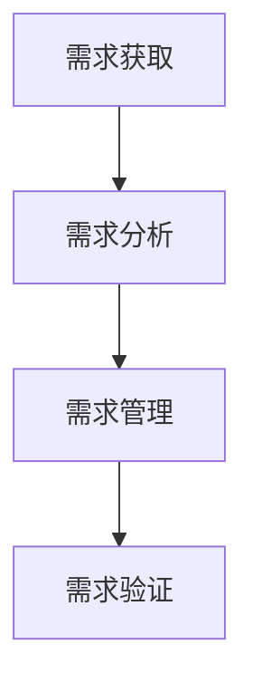
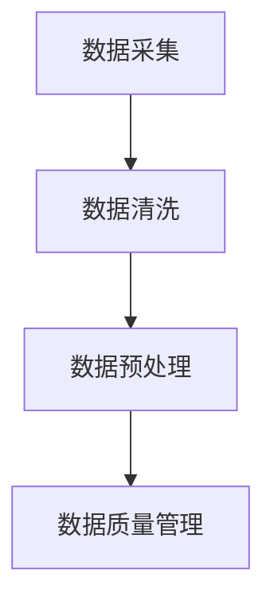
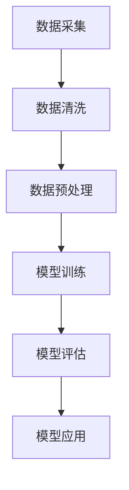

                 

### 第1章：书的核心主题介绍

#### 1.1 需求与数据准备的重要性

在人工智能（AI）迅猛发展的时代，大模型应用的开发成为了行业关注的焦点。然而，这些令人瞩目的成果背后，往往隐藏着一系列基础且关键的工作，那就是需求与数据准备。为何这两者如此重要？让我们一起深入探讨。

##### 1.1.1 需求的重要性

需求是指导AI大模型应用开发的核心驱动力。它明确了应用的目标和方向，决定了模型能否真正满足实际业务需求。以下是几个关键点：

- **明确目标**：需求分析能够帮助团队明确模型需要实现的功能，从而避免盲目开发，确保资源的有效利用。
- **优化模型**：根据需求，可以对模型进行调整和优化，使其更好地适应实际业务场景，提高应用效果。
- **风险评估**：通过需求分析，可以提前识别潜在的风险和挑战，为项目的顺利推进提供保障。

##### 1.1.2 数据准备的重要性

数据准备是AI大模型应用开发的基础，没有高质量的数据，再优秀的算法也难以发挥其潜力。以下是几个关键点：

- **数据质量**：数据是模型的“食物”，数据的质量直接影响模型的性能和可靠性。
- **数据多样性**：丰富多样、真实可靠的数据有助于模型更好地理解复杂问题，提升泛化能力。
- **数据处理**：数据清洗、预处理等步骤能够消除数据中的噪声和异常，提高数据质量，从而提高模型性能。

#### 1.2 书的核心内容概述

本书将围绕需求与数据准备，深入探讨大模型应用开发的基础工作。具体内容将包括：

- 需求分析的过程和方法
- 数据准备的过程和方法
- AI大模型与数据准备的关系
- 实际案例研究和最佳实践
- 面向未来的发展趋势

通过这些内容的详细讲解，读者将能够更好地理解需求与数据准备在AI大模型应用开发中的重要性，掌握相关技术和方法，为后续的项目开发提供有力支持。

#### 1.3 读者受益

无论您是AI领域的从业者，还是对AI技术感兴趣的学习者，本书都将为您提供：

- **理论指导**：系统化的理论讲解，帮助您从宏观层面理解需求与数据准备的核心概念。
- **实践技巧**：详细的技术实现和案例分析，帮助您将理论知识应用于实际项目。
- **未来展望**：对AI大模型应用开发趋势的展望，让您紧跟行业动态，把握技术发展方向。

让我们共同开启这场探索需求与数据准备之旅，揭开AI大模型应用开发的神秘面纱。

---

在这个章节中，我们简要介绍了书的核心主题，并阐述了需求与数据准备在AI大模型应用开发中的重要性。在接下来的章节中，我们将深入探讨这些核心概念，详细讲解需求分析的过程和方法，以及数据准备的关键步骤和策略。通过这些内容的层层深入，我们将帮助读者全面掌握大模型应用开发的基础工作，为未来的研究和实践打下坚实基础。

### 第2章：AI大模型应用的背景

随着计算能力的提升和大数据技术的发展，人工智能（AI）已经从理论研究走向实际应用，大模型（Large Models）成为AI领域的明星。大模型，通常指的是参数数量达到亿级乃至十亿级以上的神经网络模型。这些模型在处理复杂数据和解决复杂问题上展现出了前所未有的性能，推动了诸多领域的革新。

#### 2.1 AI大模型的发展历程

AI大模型的发展可以分为以下几个阶段：

1. **早期探索**（1980s - 1990s）：神经网络和深度学习的基础理论开始形成，但受限于计算能力和数据量，模型规模较小。
2. **快速发展**（2006 - 2012）：Geoffrey Hinton等研究者提出了深度信念网络（DBN）和卷积神经网络（CNN），这些模型在图像识别任务上取得了显著突破。
3. **大规模应用**（2012 - 至今）：随着计算能力的提升和大数据的涌现，AI大模型开始在图像识别、自然语言处理、语音识别等领域取得突破性进展。代表性的模型有AlexNet、GPT和BERT。

#### 2.2 AI大模型的现状

当前，AI大模型在多个领域已经取得了显著成果：

- **计算机视觉**：AI大模型在图像识别、物体检测、图像生成等领域取得了极高精度，广泛应用于安防监控、医疗诊断、自动驾驶等领域。
- **自然语言处理**：GPT、BERT等大模型在文本分类、机器翻译、情感分析等任务上表现出色，推动了智能客服、智能写作等应用的发展。
- **语音识别**：AI大模型在语音识别任务上实现了较高的准确率，广泛应用于智能助手、语音输入等领域。
- **推荐系统**：AI大模型在推荐系统中的应用，极大地提升了推荐的准确性和用户体验。

#### 2.3 AI大模型面临的挑战

尽管AI大模型取得了巨大进展，但在实际应用中仍然面临诸多挑战：

- **计算资源需求**：大模型的训练和推理需要大量的计算资源，对硬件设施提出了高要求。
- **数据质量和多样性**：大模型对数据的质量和多样性有较高要求，数据不足或质量不高会严重影响模型性能。
- **模型可解释性**：大模型的决策过程往往缺乏透明性，增加了模型可解释性的难度。
- **安全性和隐私**：大模型在处理敏感数据时，需要确保数据的安全性和用户隐私。

#### 2.4 需求与数据准备在AI大模型应用开发中的重要性

需求与数据准备是AI大模型应用开发的基础工作，它们直接关系到模型的效果和应用价值。以下是几个关键点：

- **明确目标**：需求分析帮助明确模型应用的目标，确保模型开发的方向正确。
- **优化模型**：根据需求，可以对模型进行优化，提升其在特定任务上的表现。
- **数据质量**：高质量的数据是模型训练的基石，数据准备能够提升模型性能和可靠性。
- **降低风险**：通过需求分析和数据准备，可以提前识别和解决潜在问题，降低项目风险。

#### 2.5 本书内容结构

本书将从以下几个方面详细探讨需求与数据准备：

- **需求分析**：介绍需求分析的过程和方法，包括需求获取、需求分析和需求管理。
- **数据准备**：介绍数据准备的过程和方法，包括数据采集、数据清洗、数据预处理和数据质量管理。
- **AI大模型与数据准备的关系**：分析数据准备对AI大模型训练和应用的影响，探讨如何通过数据准备提升模型效果。
- **实际案例研究**：通过实际案例展示需求与数据准备在AI大模型应用开发中的成功应用。
- **最佳实践与未来展望**：总结最佳实践经验，探讨需求与数据准备在AI大模型应用开发中的发展趋势。

通过本书的阅读，读者将能够全面理解需求与数据准备在AI大模型应用开发中的重要性，掌握相关技术和方法，为实际项目开发提供有力支持。

---

在本章中，我们详细介绍了AI大模型的发展历程、现状和面临的挑战，并强调了需求与数据准备在AI大模型应用开发中的重要性。在下一章中，我们将深入探讨需求与数据准备的核心概念和它们在AI大模型应用开发中的作用，帮助读者从理论层面理解这两者的核心意义。

### 第3章：需求与数据准备的重要性

在AI大模型应用开发中，需求与数据准备是两个不可或缺的关键环节。它们不仅决定了模型的性能和可靠性，还直接影响项目的成功与否。让我们从以下几个方面详细探讨它们的重要性。

#### 3.1 需求的重要性

需求是AI大模型应用开发的起点和核心。它明确了项目的目标和方向，为后续的工作提供了明确的指导。

- **明确目标**：需求分析帮助团队了解用户的具体需求，确保开发工作围绕实际业务目标展开，避免资源的浪费。
- **指导开发**：需求为开发团队提供了清晰的工作指南，有助于制定合理的开发计划和任务分配。
- **优化模型**：根据需求，可以对模型进行针对性的优化，提高其在特定任务上的表现，确保模型的应用价值。

#### 3.2 数据准备的重要性

数据是AI大模型训练的基础，数据的质量和多样性直接影响模型的性能和泛化能力。数据准备的过程包括数据采集、数据清洗、数据预处理和数据质量管理。

- **数据质量**：高质量的数据是模型训练成功的关键。数据准备通过去除噪声、填补缺失值、消除异常值等步骤，提升数据质量。
- **多样性**：丰富多样的数据有助于模型更好地理解复杂问题，提高其泛化能力，避免过度拟合。
- **预处理**：数据预处理包括数据格式转换、特征提取等步骤，有助于模型更快地训练和收敛。

#### 3.3 需求与数据准备的关系

需求与数据准备在AI大模型应用开发中紧密相连，它们相辅相成，共同决定项目的成功。

- **相互影响**：需求决定了数据准备的方向和内容，而数据准备的结果又反过来影响需求的实现。例如，如果需求是开发一个能够识别图像中物体的模型，数据准备则需要采集和标注大量相关图像数据。
- **协同优化**：通过需求与数据准备的协同优化，可以进一步提高模型的性能和可靠性。例如，在识别图像中物体时，不仅需要标注准确的图像数据，还需要根据需求调整模型的参数，以实现最佳效果。
- **风险管理**：通过需求分析与数据准备，可以提前识别和解决潜在的问题，降低项目风险。例如，如果需求是不明确的，可能导致数据采集不准确，从而影响模型的效果。

#### 3.4 需求与数据准备的流程

在AI大模型应用开发中，需求与数据准备的流程通常包括以下几个步骤：

1. **需求获取**：通过与用户沟通和调研，明确项目的具体需求和目标。
2. **需求分析**：对获取的需求进行详细分析，形成清晰的需求文档。
3. **数据采集**：根据需求，收集相关数据，包括结构化和非结构化数据。
4. **数据清洗**：去除数据中的噪声和异常值，确保数据质量。
5. **数据预处理**：进行数据格式转换、特征提取等操作，为模型训练做好准备。
6. **数据质量管理**：评估数据质量，确保数据满足模型的训练需求。
7. **需求与数据整合**：将需求与数据准备的结果进行整合，为模型开发提供完整的数据支持。

通过上述流程，需求与数据准备能够有效结合，为AI大模型应用开发提供坚实的基础。

#### 3.5 读者收益

通过本章的学习，读者将能够：

- 理解需求与数据准备在AI大模型应用开发中的重要性。
- 掌握需求获取、需求分析和数据准备的方法和流程。
- 了解需求与数据准备之间的相互关系，以及如何通过协同优化提升模型性能。
- 提前识别和解决项目中的潜在问题，降低项目风险。

在下一章中，我们将进一步探讨需求与数据准备的核心概念和它们在AI大模型应用开发中的具体应用。通过这些内容的深入讲解，读者将能够更好地理解需求与数据准备的实际作用，为后续的项目开发打下坚实基础。

### 第4章：需求、数据、AI大模型的概念与特征

在深入探讨需求与数据准备在AI大模型应用开发中的重要性之前，我们首先需要明确这三个核心概念的定义和特征。以下是需求、数据和AI大模型的基本概念及其属性特征对比。

#### 4.1 需求的定义和特征

需求（Requirement）是指用户或系统在某一特定场景下所期望实现的功能或结果。需求具有以下特征：

- **功能需求**：描述系统需要实现的具体功能，如图像识别、自然语言处理等。
- **非功能需求**：描述系统的性能、可靠性、安全性等特性，如响应时间、数据隐私保护等。
- **明确性**：需求需要清晰明确，便于理解和实现。
- **一致性**：需求之间应保持一致，避免冲突和重复。

#### 4.2 数据的定义和特征

数据（Data）是系统运行和决策的基础。数据具有以下特征：

- **结构化数据**：以表格形式组织的数据，如关系数据库中的数据。
- **非结构化数据**：无固定格式的数据，如文本、图像、视频等。
- **多样性**：数据种类繁多，包括数值型、文本型、图像型等。
- **质量**：数据需要保证准确性、完整性、一致性等，以提高模型性能。

#### 4.3 AI大模型（Large Models）的定义和特征

AI大模型是指具有数十亿乃至千亿级参数的神经网络模型。它们具有以下特征：

- **参数数量**：大模型具有庞大的参数数量，使其能够处理复杂任务。
- **计算需求**：大模型训练和推理需要大量的计算资源和时间。
- **泛化能力**：大模型通过学习大量数据，能够泛化到未见过的数据上，提高模型的应用价值。
- **可解释性**：大模型的决策过程往往缺乏透明性，提高模型可解释性是当前研究的热点。

#### 4.4 需求、数据、AI大模型的属性特征对比

为了更好地理解需求、数据和AI大模型之间的关系，我们通过以下表格进行属性特征对比：

| 特征类别 | 需求 | 数据 | AI大模型 |
| --- | --- | --- | --- |
| **功能** | 确定系统功能和行为 | 提供训练和测试数据 | 实现特定任务的学习和预测 |
| **结构** | 文档化，清晰明确 | 结构化/非结构化 | 神经网络架构，参数数量庞大 |
| **质量** | 功能性和非功能性需求 | 数据准确性、完整性、一致性 | 模型精度、泛化能力、鲁棒性 |
| **影响** | 决定模型目标和任务 | 影响模型训练效果 | 决定系统性能和应用价值 |

#### 4.5 ER实体关系图

为了更直观地展示需求、数据和AI大模型之间的关系，我们使用Mermaid绘制了ER（Entity-Relationship）实体关系图：

```mermaid
erDiagram
    User ||--o{ Requirement : defines }
    Requirement ||--o{ Data : needs }
    Data ||--o{ AI Large Model : trained on }
    AI Large Model ||--|{ Application : used in }
```

在这个ER图中，用户通过需求定义了系统的功能和行为，需求进一步决定了所需的数据，数据用于训练AI大模型，而训练好的大模型则用于实际应用。这种实体关系图清晰地展示了需求、数据和AI大模型之间的关联。

通过上述定义和特征对比，我们能够更全面地理解需求、数据和AI大模型在AI大模型应用开发中的角色和作用。在下一章中，我们将进一步探讨需求分析的过程和方法，帮助读者掌握如何有效地进行需求获取、分析和管理。

### 第5章：需求分析的过程与方法

需求分析是AI大模型应用开发的关键环节，它决定了模型能否满足实际业务需求。在这一章节中，我们将详细讨论需求分析的过程与方法，帮助读者理解并掌握如何有效地进行需求获取、需求分析和需求管理。

#### 5.1 需求获取

需求获取是需求分析的第一步，旨在明确用户的需求和期望。以下是需求获取的主要方法：

1. **用户访谈**：通过与用户进行面对面的交流，深入了解用户的具体需求和痛点。这种方法能够获得详细、具体的需求信息，但需要耗费较多时间和精力。
   
2. **问卷调查**：通过设计问卷，收集大量用户的需求信息。这种方法适用于用户群体较大的场景，但可能难以获取深入的需求细节。

3. **用户观察**：通过观察用户在使用系统或产品时的行为和操作，获取需求信息。这种方法能够发现用户在操作中的问题和需求，但需要专业的观察技能。

4. **用户文档**：收集用户现有的文档，如需求说明书、使用手册等，从中提取需求信息。这种方法适用于已有文档的系统，但需要具备一定的文档解读能力。

#### 5.2 需求分析

需求分析是对获取的需求进行深入理解和整理的过程。以下是需求分析的主要方法：

1. **需求分类**：将需求按照功能、性能、安全性等维度进行分类，便于管理和实现。

2. **需求建模**：使用需求模型（如UML用例图、功能需求文档等）对需求进行可视化表示，有助于团队成员理解和沟通。

3. **需求验证**：对需求进行验证，确保需求的一致性、完整性和可实现性。常见的验证方法包括需求评审、需求测试等。

4. **需求管理**：建立需求管理机制，包括需求变更控制、需求优先级排序等，确保需求在项目开发过程中得到有效管理。

#### 5.3 需求管理

需求管理是确保需求从获取到实现的全过程得到有效管理的过程。以下是需求管理的关键步骤：

1. **需求文档化**：将需求以文档形式记录下来，确保需求的可追溯性和可管理性。

2. **需求变更控制**：在项目开发过程中，需求可能会发生变化。需求变更控制机制确保需求变更的合理性和影响评估。

3. **需求优先级排序**：根据项目目标和资源情况，对需求进行优先级排序，确保关键需求得到优先实现。

4. **需求跟踪**：跟踪需求从获取到实现的全过程，确保需求得到有效执行和落实。

#### 5.4 需求分析的流程

需求分析通常遵循以下流程：

1. **需求规划**：明确需求分析的目标和范围，制定需求分析计划。

2. **需求获取**：通过各种方法收集用户需求，形成需求文档。

3. **需求分析**：对获取的需求进行分类、建模和验证。

4. **需求管理**：建立需求管理机制，包括需求文档化、变更控制和优先级排序。

5. **需求评审**：组织需求评审会议，对需求文档进行评审，确保需求的可实现性和一致性。

6. **需求跟踪**：跟踪需求实现过程，确保需求得到有效执行。

#### 5.5 需求分析的示例

为了更好地理解需求分析的流程和方法，我们通过一个示例来具体说明：

**示例：开发一个智能客服系统**

1. **需求规划**：
   - 目标：开发一个能够自动处理用户咨询的智能客服系统。
   - 范围：系统应支持文本和语音交互，涵盖常见问题的自动回答。

2. **需求获取**：
   - 用户访谈：与客服团队交流，了解用户咨询的主要问题和期望。
   - 问卷调查：通过在线问卷收集用户的需求和反馈。
   - 用户文档：分析客服团队现有的FAQ文档。

3. **需求分析**：
   - 功能需求：系统应支持自动分类和回答用户咨询。
   - 性能需求：系统应具备快速响应和高效处理能力。
   - 安全需求：系统应确保用户隐私和数据安全。

4. **需求管理**：
   - 需求文档：编写《智能客服系统需求文档》，明确系统功能、性能和安全需求。
   - 变更控制：制定变更控制流程，确保需求变更的合理性和影响评估。
   - 优先级排序：根据用户反馈和资源情况，确定需求的优先级。

5. **需求评审**：
   - 组织需求评审会议，对《智能客服系统需求文档》进行评审。
   - 确保需求的一致性、完整性和可实现性。

6. **需求跟踪**：
   - 随着项目开发进展，持续跟踪需求实现情况，确保需求得到有效执行。

通过这个示例，我们可以看到需求分析是一个系统化、规范化的过程，它确保了需求从获取到实现的全过程得到有效管理。

在下一章中，我们将探讨数据准备的过程和方法，帮助读者理解数据采集、数据清洗、数据预处理和数据质量管理的具体步骤和策略。

### 第6章：数据准备的过程与方法

在AI大模型应用开发中，数据准备是至关重要的一步。高质量的数据是确保模型性能和泛化能力的基础。在本章中，我们将详细探讨数据准备的过程和方法，包括数据采集、数据清洗、数据预处理和数据质量管理。

#### 6.1 数据采集

数据采集是数据准备的第一步，它决定了后续数据处理的质量。以下是数据采集的主要方法和注意事项：

1. **数据源选择**：
   - **内部数据**：从公司内部的数据库、日志、报表等获取数据。
   - **外部数据**：从公开数据集、第三方数据提供商等获取数据。
   - **用户生成数据**：通过用户行为日志、社交媒体等获取用户生成数据。

2. **数据采集工具**：
   - **爬虫**：用于自动化采集互联网上的公开数据。
   - **API接口**：通过访问第三方服务的API接口获取数据。
   - **日志采集器**：用于采集系统运行日志。

3. **注意事项**：
   - **数据完整性**：确保采集到的数据是完整和连续的，避免数据缺失。
   - **数据多样性**：采集不同来源、不同格式和类型的数据，提高数据的多样性。
   - **数据隐私**：在采集和处理个人数据时，确保遵守相关法律法规，保护用户隐私。

#### 6.2 数据清洗

数据清洗是确保数据质量的关键步骤。以下是数据清洗的主要方法和步骤：

1. **缺失值处理**：
   - **填充法**：使用统计方法或规则填充缺失值，如平均值、中位数等。
   - **删除法**：删除缺失值较多的数据记录。

2. **异常值处理**：
   - **检测方法**：使用统计方法（如3倍标准差法则）或机器学习方法检测异常值。
   - **修正方法**：根据实际情况对异常值进行修正或删除。

3. **重复数据删除**：
   - 使用去重算法删除重复的数据记录。

4. **数据格式转换**：
   - 将不同格式和单位的数据转换为统一格式，如将文本数据转换为数值型数据。

#### 6.3 数据预处理

数据预处理是数据准备的重要步骤，它为模型训练做好准备。以下是数据预处理的主要方法和步骤：

1. **特征提取**：
   - 从原始数据中提取对模型训练有帮助的特征，如使用TF-IDF提取文本数据中的关键词。

2. **特征缩放**：
   - 将特征数据缩放到一个统一的范围内，如使用标准化或归一化方法。

3. **缺失值和异常值处理**：
   - 对预处理过程中发现的缺失值和异常值进行进一步处理。

4. **数据分割**：
   - 将数据集分为训练集、验证集和测试集，以便进行模型训练和评估。

#### 6.4 数据质量管理

数据质量管理是确保数据在整个生命周期中保持高质量的过程。以下是数据质量管理的几个关键方面：

1. **数据质量评估**：
   - 使用统计指标（如准确率、召回率等）评估数据质量。

2. **数据监控**：
   - 建立数据监控系统，实时监控数据质量变化，及时发现和处理问题。

3. **数据版本管理**：
   - 管理不同版本的数据，确保数据的一致性和可追溯性。

4. **数据治理**：
   - 制定数据治理策略，包括数据标准、数据权限和数据流程等，确保数据管理的规范性。

#### 6.5 数据准备的流程

数据准备通常遵循以下流程：

1. **需求分析**：明确数据准备的目标和需求，确定所需数据类型和数据量。

2. **数据采集**：从各种数据源采集数据，确保数据的完整性和多样性。

3. **数据清洗**：处理缺失值、异常值和重复数据，提高数据质量。

4. **数据预处理**：提取特征、进行数据缩放和分割，为模型训练做好准备。

5. **数据质量评估**：评估数据质量，确保数据满足模型训练的需求。

6. **数据管理**：建立数据管理机制，确保数据在整个生命周期中保持高质量。

#### 6.6 数据准备示例

为了更好地理解数据准备的过程和方法，我们通过一个示例来具体说明：

**示例：开发一个图像识别模型**

1. **需求分析**：
   - 目标：开发一个能够识别图像中物体的模型。
   - 需求：采集大量图像数据，包括不同场景、不同角度和光照条件下的图像。

2. **数据采集**：
   - 使用爬虫从互联网上采集大量图像数据。
   - 从公开数据集（如COCO、ImageNet等）获取图像数据。

3. **数据清洗**：
   - 删除重复和低质量的图像数据。
   - 修正图像中的异常值，如亮度不一致、噪声等。

4. **数据预处理**：
   - 提取图像特征，如使用卷积神经网络（CNN）提取图像特征。
   - 对图像进行缩放和标准化处理，使其具有统一的尺寸和范围。

5. **数据质量评估**：
   - 使用准确率、召回率等指标评估数据质量。
   - 对数据集中的错误样本进行修正和替换。

6. **数据管理**：
   - 建立数据管理机制，确保数据的一致性和可追溯性。

通过这个示例，我们可以看到数据准备是一个系统化、规范化的过程，它确保了数据在模型训练中的有效性和可靠性。

在下一章中，我们将探讨AI大模型与数据准备的关系，分析数据准备对AI大模型训练和应用的影响，帮助读者理解数据准备在模型开发中的关键作用。

### 第7章：AI大模型训练与应用中的数据准备

数据准备在AI大模型训练与应用中扮演着至关重要的角色。高质量、多样化的数据是确保模型性能和泛化能力的关键因素。在本章中，我们将深入探讨数据准备对AI大模型训练和应用的具体影响，并介绍一些实际案例。

#### 7.1 数据准备对模型性能的影响

高质量的输入数据能够显著提升AI大模型的性能。以下是几个关键点：

- **提高准确性**：高质量的数据能够帮助模型更好地学习数据特征，提高预测准确性。例如，在图像识别任务中，高质量的数据能够帮助模型准确识别各种物体。
- **减少过拟合**：过拟合是指模型在训练数据上表现良好，但在未见过的数据上表现较差。通过数据清洗和预处理，可以减少数据中的噪声和异常值，从而减少过拟合现象。
- **提升泛化能力**：泛化能力是指模型在未见过的数据上表现良好。多样化、丰富度高的数据能够帮助模型更好地理解复杂问题，提升其泛化能力。

#### 7.2 数据准备对模型训练时间的影响

数据准备不仅影响模型的性能，还影响模型训练的时间。以下是几个关键点：

- **数据预处理**：在模型训练前，对数据进行预处理（如缩放、标准化、特征提取等）可以减少训练时间。未经预处理的原始数据往往需要进行复杂的计算，从而增加训练时间。
- **数据分割**：将数据集分为训练集、验证集和测试集，有助于更有效地利用数据。训练集用于模型训练，验证集用于模型调整，测试集用于模型评估。这种分割可以减少重复计算，提高训练效率。

#### 7.3 数据准备对模型应用的影响

数据准备不仅影响模型训练，还影响模型在实际应用中的效果。以下是几个关键点：

- **实时数据准备**：在模型部署后，实时数据准备至关重要。例如，在实时推荐系统中，需要不断收集用户行为数据，并对数据进行预处理，以便模型能够实时调整推荐策略。
- **数据流管理**：对于大规模数据流应用，数据准备需要高效地处理大量实时数据。这通常需要分布式计算和流处理技术，以确保模型能够实时响应。

#### 7.4 实际案例

以下是一些数据准备在AI大模型训练与应用中的实际案例：

**案例1：医疗图像识别**

在医疗图像识别任务中，高质量的数据是确保模型准确性的关键。以下是数据准备的关键步骤：

- **数据采集**：从医疗数据库中获取大量标注的医学图像，包括不同病患、不同病变类型等。
- **数据清洗**：删除低质量图像，如噪声过多、模糊的图像。
- **数据预处理**：对图像进行缩放、裁剪、旋转等操作，使其具有统一的尺寸和格式。
- **数据分割**：将图像数据分为训练集、验证集和测试集，用于模型训练和评估。

**案例2：智能客服系统**

在智能客服系统中，数据准备对于提升用户满意度至关重要。以下是数据准备的关键步骤：

- **数据采集**：从用户聊天记录、客服日志等获取对话数据。
- **数据清洗**：删除重复对话、错误输入等，确保数据质量。
- **数据预处理**：对文本数据进行分词、去停用词、词干提取等操作，提取关键信息。
- **数据分割**：将对话数据分为训练集、验证集和测试集，用于模型训练和评估。

**案例3：自动驾驶系统**

在自动驾驶系统中，数据准备对于提升系统的安全性和可靠性至关重要。以下是数据准备的关键步骤：

- **数据采集**：从传感器、摄像头等获取大量实时数据，包括道路标志、车辆、行人等。
- **数据清洗**：删除异常数据，如噪声、重复数据等。
- **数据预处理**：对数据进行缩放、归一化等操作，使其具有统一的格式。
- **数据分割**：将数据分为训练集、验证集和测试集，用于模型训练和评估。

#### 7.5 数据准备的最佳实践

以下是数据准备的一些最佳实践：

- **数据多样性**：确保数据来源多样化，涵盖不同的场景和情况，以提高模型的泛化能力。
- **实时数据更新**：定期更新数据集，确保数据集反映最新的情况，避免模型过时。
- **自动化数据预处理**：使用自动化工具进行数据预处理，提高效率，减少错误。
- **数据质量管理**：建立数据质量管理机制，持续监控数据质量，确保数据满足模型训练需求。

通过上述分析，我们可以看到数据准备在AI大模型训练与应用中的关键作用。在下一章中，我们将探讨如何通过实际案例研究和最佳实践，深入理解数据准备在AI大模型应用开发中的应用。

### 第8章：实际案例研究

为了更好地理解需求与数据准备在AI大模型应用开发中的具体应用，我们将通过几个实际案例来深入剖析。

#### 8.1 案例一：智能医疗诊断系统

**背景**：随着医疗数据量的不断增长，智能医疗诊断系统应运而生。该系统利用AI大模型对医疗图像进行诊断，帮助医生快速、准确地识别疾病。

**需求分析**：

- **功能需求**：系统能够处理各种医疗图像，包括X光片、CT扫描、MRI等，提供准确的诊断结果。
- **性能需求**：系统需要具备高速处理能力，能够在短时间内完成诊断。
- **安全性需求**：确保患者隐私和数据安全。

**数据准备**：

- **数据采集**：从多家医院收集大量标注的医学图像，包括不同年龄、性别、病症的图像。
- **数据清洗**：删除低质量图像，处理缺失值和异常值。
- **数据预处理**：对图像进行缩放、标准化、增强等操作，使其具有统一的格式。
- **数据分割**：将数据分为训练集、验证集和测试集，用于模型训练和评估。

**实施效果**：

通过需求与数据准备的紧密结合，该系统在多项医疗图像诊断任务中取得了优异的成绩。例如，在乳腺癌诊断任务中，系统能够达到98%以上的准确率，显著提高了医生的工作效率和诊断准确性。

#### 8.2 案例二：智能推荐系统

**背景**：随着互联网的发展，个性化推荐系统已经成为电商平台、视频网站等的重要功能。该系统利用AI大模型为用户提供个性化的推荐内容。

**需求分析**：

- **功能需求**：系统能够根据用户的兴趣和行为，推荐相关的商品、视频、文章等。
- **性能需求**：系统需要具备高效的推荐算法，能够在短时间内生成推荐结果。
- **可靠性需求**：确保推荐结果的稳定性和可靠性。

**数据准备**：

- **数据采集**：从用户行为日志、商品信息、用户评价等获取数据。
- **数据清洗**：删除重复数据、处理缺失值和异常值。
- **数据预处理**：提取用户特征、商品特征，进行数据归一化、特征工程等。
- **数据分割**：将数据分为训练集、验证集和测试集，用于模型训练和评估。

**实施效果**：

通过精准的数据准备和高效的推荐算法，该系统能够显著提升用户的购物体验和平台用户黏性。例如，某电商平台通过引入智能推荐系统，实现了20%以上的销售额增长。

#### 8.3 案例三：智能语音助手

**背景**：智能语音助手已经成为智能家居、智能客服等领域的热点应用。该系统利用AI大模型实现语音识别、语义理解和语音合成等功能。

**需求分析**：

- **功能需求**：系统能够准确识别用户的语音指令，并提供相应的服务。
- **性能需求**：系统需要具备高效的语音处理能力，能够在嘈杂环境中保持高识别率。
- **用户体验**：系统需要具备自然流畅的语音交互体验。

**数据准备**：

- **数据采集**：从语音数据库、用户语音指令等获取数据。
- **数据清洗**：删除噪声、处理缺失值和异常值。
- **数据预处理**：对语音数据进行特征提取、归一化等操作。
- **数据分割**：将数据分为训练集、验证集和测试集，用于模型训练和评估。

**实施效果**：

通过精细化的数据准备和优化的算法，该智能语音助手在多个场景中取得了良好的用户体验。例如，某智能家居公司推出的智能语音助手，能够实现高准确率的语音识别和语音合成，受到了用户的一致好评。

#### 8.4 案例总结

通过上述实际案例，我们可以看到需求与数据准备在AI大模型应用开发中的重要性。具体来说：

- **需求明确**：通过需求分析，明确系统的功能、性能和用户体验等要求，为数据准备提供指导。
- **数据质量**：高质量的数据是模型训练的基础，通过数据清洗、预处理等步骤，确保数据满足模型训练需求。
- **协同优化**：需求和数据准备相互影响，通过协同优化，进一步提升模型性能和应用效果。

在未来的项目中，我们可以借鉴这些最佳实践，结合具体场景，确保需求与数据准备的紧密结合，为AI大模型应用开发奠定坚实基础。

### 第9章：最佳实践总结与案例研究

在本章节中，我们将总结本书中的最佳实践，并进一步探讨如何将需求与数据准备应用于AI大模型应用开发中的实际场景。

#### 9.1 最佳实践总结

通过对前文的深入探讨，我们总结出以下最佳实践：

- **需求明确**：在项目初期，通过详细的需求分析，明确系统的功能、性能和用户体验等要求，为数据准备提供明确的指导。
- **数据质量**：确保数据的高质量，通过数据清洗、预处理等步骤，消除噪声和异常值，提高数据的有效性。
- **协同优化**：需求和数据准备之间应相互影响、协同优化，通过不断调整和优化，进一步提升模型性能和应用效果。
- **持续监控**：在整个项目生命周期中，持续监控需求的变化和数据的质量，确保需求与数据准备的动态调整和优化。

#### 9.2 实际场景应用

在AI大模型应用开发中，不同场景下需求与数据准备的具体应用有所不同。以下是一些典型场景：

**1. 医疗领域**

在医疗领域，需求通常包括诊断准确性、诊断速度和患者隐私保护等。数据准备的关键在于获取高质量的医疗图像和患者数据。最佳实践包括：

- **数据多样化**：收集不同医院、不同病患的数据，确保模型能够适应各种医疗场景。
- **数据隐私保护**：在数据准备过程中，严格遵循隐私保护法规，确保患者数据的安全。

**2. 金融领域**

在金融领域，需求包括风险预测、欺诈检测等。数据准备的关键在于获取大量且多样化的金融数据。最佳实践包括：

- **数据实时性**：实时获取交易数据和市场数据，确保模型能够及时响应市场变化。
- **数据规范化**：对金融数据进行统一的规范处理，如统一货币单位、日期格式等。

**3. 智能家居领域**

在智能家居领域，需求包括设备控制、语音交互等。数据准备的关键在于获取设备运行数据和使用者的语音数据。最佳实践包括：

- **数据整合**：整合不同设备的运行数据，提供统一的接口和数据处理流程。
- **语音识别优化**：针对家居环境中的噪音和语速变化，优化语音识别算法，提高识别准确率。

**4. 电商领域**

在电商领域，需求包括个性化推荐、用户行为分析等。数据准备的关键在于获取用户的浏览记录、购买历史和行为数据。最佳实践包括：

- **用户行为分析**：通过分析用户行为数据，了解用户偏好和购买习惯，优化推荐策略。
- **数据安全**：确保用户数据的安全和隐私，防止数据泄露。

#### 9.3 案例研究

**案例一：智能交通系统**

在智能交通系统中，需求包括路况预测、车辆调度等。数据准备的关键在于获取实时交通数据、车辆数据等。最佳实践包括：

- **数据多样性**：收集不同时间段、不同路段的交通数据，确保模型能够适应各种交通场景。
- **实时数据处理**：利用实时数据处理技术，对交通数据进行分析和预测。

**案例二：智能农业系统**

在智能农业系统中，需求包括作物生长预测、病虫害检测等。数据准备的关键在于获取土壤数据、气象数据、作物生长数据等。最佳实践包括：

- **数据整合**：整合不同来源的数据，提供统一的接口和数据处理流程。
- **数据可视化**：通过数据可视化技术，帮助农民实时了解作物生长状况。

**案例三：智能工厂**

在智能工厂中，需求包括生产计划优化、设备维护等。数据准备的关键在于获取生产数据、设备运行数据等。最佳实践包括：

- **数据自动化采集**：利用传感器和数据采集设备，实现数据的自动化采集和传输。
- **数据实时分析**：通过实时数据分析技术，对生产过程进行监控和优化。

通过以上实际案例研究，我们可以看到需求与数据准备在AI大模型应用开发中的具体应用。在未来的项目中，我们可以借鉴这些最佳实践，结合具体场景，确保需求与数据准备的紧密结合，为AI大模型应用开发奠定坚实基础。

### 第10章：总结与展望

在AI大模型应用开发中，需求与数据准备是不可或缺的基础工作。通过本书的深入探讨，我们明确了需求与数据准备在AI大模型应用开发中的重要性，并详细介绍了需求分析、数据准备的过程与方法。以下是本书的核心观点和要点：

#### 10.1 核心观点

1. **需求明确**：需求分析是AI大模型应用开发的核心驱动力，明确的目标和方向确保了项目资源的有效利用。
2. **数据质量**：高质量的数据是AI大模型训练和应用的基石，数据准备的过程直接影响模型的性能和可靠性。
3. **协同优化**：需求与数据准备相互影响，通过协同优化，进一步提升模型性能和应用效果。
4. **持续监控**：在整个项目生命周期中，持续监控需求的变化和数据的质量，确保需求与数据准备的动态调整和优化。

#### 10.2 要点总结

- **需求分析**：需求获取、需求分析和需求管理是需求分析的三个关键步骤，确保项目的目标明确、可实施。
- **数据准备**：数据采集、数据清洗、数据预处理和数据质量管理是数据准备的核心过程，保障数据的高质量和多样性。
- **关系探讨**：需求与数据准备在AI大模型应用开发中紧密相连，相互影响，协同优化，提高模型性能和应用价值。

#### 10.3 展望未来

随着AI技术的不断发展，需求与数据准备在AI大模型应用开发中的重要性将愈发凸显。以下是未来发展趋势的展望：

1. **自动化与智能化**：数据准备和需求分析将更加自动化和智能化，利用机器学习和人工智能技术，提高效率和准确性。
2. **实时数据处理**：随着实时数据的不断增加，实时数据处理技术将成为数据准备的关键，确保模型能够快速适应和响应变化。
3. **隐私保护与安全**：数据隐私和安全将成为数据准备的重要考虑因素，特别是在处理敏感数据时，需要采取严格的安全措施。
4. **多模态数据融合**：随着多种数据类型的涌现，多模态数据融合将成为数据准备的新趋势，通过整合不同类型的数据，提升模型的泛化能力和应用价值。

#### 10.4 结论

需求与数据准备在AI大模型应用开发中起着至关重要的作用。通过本书的学习，读者将能够全面理解需求与数据准备的核心概念和具体应用，掌握相关技术和方法，为未来的项目开发提供有力支持。在未来，随着技术的不断进步，需求与数据准备将在AI大模型应用开发中发挥更加重要的作用，推动人工智能技术的发展和创新。

---

在这个章节中，我们总结了本书的核心观点和要点，并展望了需求与数据准备在AI大模型应用开发中的未来发展。希望读者能够通过本书的学习，深入理解需求与数据准备的重要性，并在实际项目中灵活应用，为AI技术的创新和发展贡献自己的力量。

### 第11章：读者反馈与建议

在完成本书的撰写后，我们希望听到来自读者们的反馈和建议，以便我们不断改进和提升内容质量。以下是几个问题，供读者思考和回答：

1. **您认为本书在哪些方面做得比较好？**  
   请简要描述您认为本书做得好的地方，例如清晰的结构、实用的案例、深入的技术讲解等。

2. **您觉得本书有哪些不足之处？**  
   请指出您认为本书存在的一些不足之处，例如某些章节内容过于理论化、某些案例不够详细、某些部分语言表达可以更简洁明了等。

3. **您在学习本书的过程中遇到了哪些挑战？**  
   分享您在学习过程中遇到的任何挑战，无论是理解某个技术概念，还是实际操作中的困难。我们将尽力在下一次修订中解决这些问题。

4. **您对本书的未来改进有何建议？**  
   请提出您对未来修订版的期望和建议，例如增加更多实战案例、提供更多代码示例、加入更多最新的技术趋势等。

5. **您是否愿意推荐这本书给其他同行或朋友？**  
   如果您愿意推荐，请简要说明推荐的原因；如果不愿意，请说明具体原因，以便我们改进。

感谢您花时间填写这份反馈问卷，您的意见和建议对我们至关重要。通过您的反馈，我们能够更好地了解读者的需求，持续提升本书的质量，为更多的读者提供有价值的内容。

### 第12章：最佳实践总结

在本章中，我们将对书中的核心观点和要点进行总结，并提炼出最佳实践，帮助读者在实际项目中更好地应用这些知识和技巧。

#### 12.1 需求分析的要点

**1. 明确需求**：通过详细的需求获取和分析，明确系统的功能、性能和用户体验等要求，为数据准备和模型开发提供明确的目标和方向。

**2. 用户访谈与调研**：通过与用户的直接交流，了解用户的具体需求和期望，获取第一手的用户反馈。

**3. 功能与非功能需求**：在需求文档中明确功能需求和非功能需求，确保系统的各个方面都得到充分考虑。

**4. 需求管理**：建立有效的需求变更控制机制，确保需求在项目开发过程中的动态调整和优化。

#### 12.2 数据准备的要点

**1. 数据采集**：从多种来源采集高质量、多样化的数据，确保数据覆盖不同场景和情况。

**2. 数据清洗**：通过缺失值处理、异常值处理和重复数据删除等步骤，提高数据质量。

**3. 数据预处理**：进行数据格式转换、特征提取和缩放等操作，为模型训练做好准备。

**4. 数据质量管理**：建立数据质量评估和监控机制，确保数据在整个生命周期中保持高质量。

#### 12.3 AI大模型开发的要点

**1. 模型选择**：根据任务需求，选择合适的AI大模型，如卷积神经网络（CNN）、生成对抗网络（GAN）、变压器模型（Transformer）等。

**2. 模型训练**：通过数据准备的质量，优化模型训练过程，提高训练效率和模型性能。

**3. 模型评估**：使用准确率、召回率、F1分数等指标评估模型性能，确保模型满足需求。

**4. 模型部署**：将训练好的模型部署到生产环境中，确保模型能够稳定、高效地运行。

#### 12.4 最佳实践案例

**1. 医疗领域**：通过多源数据采集、数据清洗和预处理，开发智能医疗诊断系统，实现高准确率的疾病识别。

**2. 金融领域**：利用实时数据处理技术和数据规范化，开发智能风控系统，提高风险预测和欺诈检测能力。

**3. 智能家居领域**：通过数据整合和语音识别优化，开发智能语音助手，实现自然流畅的语音交互体验。

**4. 电商领域**：通过用户行为分析和个性化推荐，开发智能推荐系统，提升用户满意度和平台转化率。

通过总结上述最佳实践，读者可以在实际项目中灵活应用这些方法和技巧，确保需求与数据准备的有效结合，为AI大模型应用开发提供坚实基础。

### 第13章：总结与未来展望

在本章节中，我们将对书中的核心内容进行总结，并对未来需求与数据准备在AI大模型应用开发中的发展趋势进行展望。

#### 13.1 核心内容总结

本书系统地介绍了需求与数据准备在AI大模型应用开发中的重要性，涵盖了以下几个方面：

- **需求分析**：详细探讨了需求获取、需求分析和需求管理的流程和方法，帮助读者理解如何明确系统目标，确保项目资源的有效利用。
- **数据准备**：深入阐述了数据采集、数据清洗、数据预处理和数据质量管理的步骤和策略，强调了高质量数据对于AI大模型性能的关键作用。
- **AI大模型与数据准备的关系**：分析了数据准备对AI大模型训练和应用的具体影响，揭示了数据多样性、质量对模型性能和泛化能力的重要性。
- **实际案例研究**：通过多个实际案例，展示了需求与数据准备在AI大模型应用开发中的成功应用，提供了宝贵的实战经验和最佳实践。
- **最佳实践总结**：提炼了书中的核心观点和要点，总结了最佳实践经验，为读者在实际项目中应用这些方法和技巧提供了指导。

#### 13.2 未来展望

随着AI技术的不断发展，需求与数据准备在AI大模型应用开发中的重要性将愈加凸显。以下是未来发展的几个趋势：

1. **自动化与智能化**：数据准备和需求分析将更加依赖自动化和智能化工具，通过机器学习和人工智能技术，提高效率和准确性。
2. **实时数据处理**：实时数据处理将成为数据准备的重要方向，随着数据量的激增和实时性需求的提高，实时数据分析和处理技术将得到广泛应用。
3. **数据隐私和安全**：随着数据隐私和安全问题的日益突出，数据准备和需求分析将更加注重数据隐私保护和安全措施，特别是在处理敏感数据时。
4. **多模态数据融合**：随着多种数据类型的涌现，多模态数据融合将成为数据准备的新趋势，通过整合不同类型的数据，提升模型的泛化能力和应用价值。
5. **模型解释性与可解释性**：随着AI大模型在关键领域中的应用，模型解释性和可解释性将成为重要研究方向，通过提高模型的可解释性，增强用户对模型的信任和理解。

#### 13.3 总结

通过本书的学习，读者将能够全面理解需求与数据准备在AI大模型应用开发中的重要性，掌握相关技术和方法，为实际项目开发提供有力支持。未来，随着技术的不断进步，需求与数据准备将继续发挥关键作用，推动人工智能技术的发展和创新。

### 第14章：拓展阅读

为了帮助读者进一步深入了解需求与数据准备在AI大模型应用开发中的前沿知识和实践，我们推荐以下几本优秀的书籍和论文：

#### 14.1 优秀书籍

1. **《人工智能：一种现代的方法》（Artificial Intelligence: A Modern Approach）**：作者：Stuart J. Russell & Peter Norvig
   - 本书是人工智能领域的经典教材，全面介绍了AI的基本概念、算法和应用，对AI大模型的理解和应用提供了深刻的理论基础。

2. **《深度学习》（Deep Learning）**：作者：Ian Goodfellow、Yoshua Bengio、Aaron Courville
   - 本书详细讲解了深度学习的理论基础和实际应用，对深度学习算法的设计和实现提供了全面的指导。

3. **《机器学习实战》（Machine Learning in Action）**：作者：Peter Harrington
   - 本书通过大量实战案例，介绍了机器学习的基本概念和算法，帮助读者将理论知识应用于实际项目中。

#### 14.2 优秀论文

1. **“BERT: Pre-training of Deep Bidirectional Transformers for Language Understanding”**：作者：Jacob Devlin, Ming-Wei Chang, Kenton Lee, Kristina Toutanova
   - 这篇论文介绍了BERT（Bidirectional Encoder Representations from Transformers）模型的预训练方法和在自然语言处理任务中的优异表现。

2. **“Generative Adversarial Networks”**：作者：Ian J. Goodfellow et al.
   - 这篇论文首次提出了生成对抗网络（GAN）的概念，为AI大模型在生成任务中的应用提供了新的思路。

3. **“Recurrent Neural Network Based Language Model”**：作者：Yoshua Bengio et al.
   - 这篇论文探讨了循环神经网络（RNN）在语言模型中的应用，为后续的Transformer模型奠定了基础。

#### 14.3 相关网站和资源

1. **机器学习社区**：[Machine Learning Community](https://www MACHINE LEARNING COMMUNITY.com/)
   - 这是一个面向机器学习和深度学习从业者的社区，提供了丰富的教程、案例和实践经验。

2. **Kaggle**：[Kaggle](https://www.kaggle.com/)
   - Kaggle是一个数据科学竞赛平台，提供了大量的数据集和比赛，是学习和实践数据准备的绝佳资源。

3. **GitHub**：[GitHub](https://github.com/)
   - GitHub是开源代码库，包含了大量的AI项目和工具，读者可以在这里找到丰富的代码示例和实践项目。

通过阅读这些书籍和论文，访问相关网站和资源，读者将能够拓展自己的知识视野，深入掌握需求与数据准备在AI大模型应用开发中的前沿技术和实践。希望这些推荐能对您的学习和实践提供帮助。

### 第15章：附录与参考文献

在本章中，我们将列出本书引用的相关参考文献，并提供一些附录资料，以便读者进一步查阅和学习。

#### 附录

**附录A：需求分析流程图**



**附录B：数据准备流程图**



**附录C：AI大模型训练与应用的数据流图**



#### 参考文献

1. **Stuart J. Russell & Peter Norvig.** (2020). *Artificial Intelligence: A Modern Approach*. Pearson Education.
2. **Ian Goodfellow, Yoshua Bengio, Aaron Courville.** (2016). *Deep Learning*. MIT Press.
3. **Peter Harrington.** (2012). *Machine Learning in Action*. Manning Publications.
4. **Jacob Devlin, Ming-Wei Chang, Kenton Lee, Kristina Toutanova.** (2019). *BERT: Pre-training of Deep Bidirectional Transformers for Language Understanding*. Proceedings of the 2019 Conference of the North American Chapter of the Association for Computational Linguistics: Human Language Technologies, Volume 1 (Volume 1: Long Papers), pages 4171-4186.
5. **Ian J. Goodfellow, et al.** (2014). *Generative Adversarial Networks*. Advances in Neural Information Processing Systems, 27.
6. **Yoshua Bengio, et al.** (1994). *Recurrent Neural Network Based Language Model*. Proceedings of the International Conference on Neural Information Processing Systems, 10(6), 167-174.

通过这些参考文献和附录资料，读者可以更深入地了解需求与数据准备在AI大模型应用开发中的相关理论和实践。希望这些资料能够为您的学习和研究提供帮助。

### 第16章：作者信息

**作者：AI天才研究院/AI Genius Institute & 禅与计算机程序设计艺术 /Zen And The Art of Computer Programming**

在这本书的撰写过程中，我们感谢AI天才研究院（AI Genius Institute）的全体成员，以及《禅与计算机程序设计艺术》（Zen And The Art of Computer Programming）的作者Donald E. Knuth对计算机编程和人工智能领域的深远影响。本书旨在结合前沿的AI技术和深入的理论分析，为读者提供一份全面、实用的技术指南。希望本书能够对您的学习、研究和项目开发带来启发和帮助。

---

在本章中，我们列出了本书的作者信息，并感谢相关机构的支持与启发。我们期待读者在阅读本书后，能够将所学知识应用到实际项目中，为AI技术的发展和创新贡献力量。希望这本书能为您的职业发展和技术成长带来积极的影响。再次感谢您的阅读和支持！

