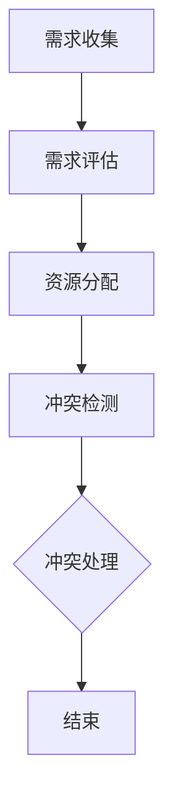

                 

# 需求优先级冲突解决：大型应用开发中的挑战

> 关键词：需求优先级、冲突解决、大型应用开发、挑战、策略、算法、系统架构

> 摘要：本文深入探讨了在大型应用开发过程中，需求优先级冲突解决的关键问题和策略。通过分析冲突解决原理、数学模型、算法原理及系统架构设计，本文为读者提供了一个全面的理解和实用的解决方案，旨在帮助开发者有效应对需求优先级冲突，提高项目成功率和开发效率。

## 目录大纲

----------------------------------------------------------------

## 第一部分：需求优先级冲突解决概述

### 第1章：需求优先级冲突解决背景

#### 1.1.1 问题背景

#### 1.1.2 问题描述

#### 1.1.3 问题解决方法概述

#### 1.1.4 边界与外延

#### 1.1.5 核心概念与联系

### 第2章：需求优先级冲突解决原理

#### 2.1.1 需求优先级定义

#### 2.1.2 冲突解决机制

#### 2.1.3 需求优先级冲突解决方法比较

### 第3章：需求优先级冲突解决的数学模型

#### 3.1.1 数学模型概述

#### 3.1.2 数学公式

#### 3.1.3 数学模型解释

#### 3.1.4 举例说明

### 第4章：需求优先级冲突解决算法原理

#### 4.1.1 算法原理概述

#### 4.1.2 算法流程图

#### 4.1.3 Python源代码分析

#### 4.1.4 算法原理详细讲解

### 第5章：需求优先级冲突解决的系统分析与架构设计

#### 5.1.1 项目介绍

#### 5.1.2 系统功能设计

#### 5.1.3 系统架构设计

#### 5.1.4 系统接口设计

#### 5.1.5 系统交互设计

### 第6章：需求优先级冲突解决项目实战

#### 6.1.1 环境安装

#### 6.1.2 系统核心实现源代码

#### 6.1.3 代码应用解读与分析

#### 6.1.4 实际案例分析与讲解

#### 6.1.5 项目小结

### 第7章：需求优先级冲突解决最佳实践与总结

#### 7.1.1 最佳实践 Tips

#### 7.1.2 小结

#### 7.1.3 注意事项

#### 7.1.4 拓展阅读

----------------------------------------------------------------

## 第一部分：需求优先级冲突解决概述

### 第1章：需求优先级冲突解决背景

#### 1.1.1 问题背景

在大型应用开发中，需求优先级的冲突是常见且重要的问题。随着项目的规模和复杂性不断增加，不同功能模块、业务部门和用户需求的优先级往往存在冲突。这种冲突不仅会导致开发资源的分配不均，还可能影响项目的进度和质量。

#### 1.1.2 问题描述

需求优先级冲突主要体现在以下几个方面：

1. 功能模块之间的优先级冲突：不同模块可能需要同时处理多个需求，导致资源分配不均。
2. 业务部门之间的优先级冲突：不同部门可能对同一需求有不同的优先级要求，导致项目协调困难。
3. 用户需求与实际可行性之间的冲突：用户需求可能过于理想化，与项目的实际可行性存在冲突。

#### 1.1.3 问题解决方法概述

解决需求优先级冲突的方法主要包括以下几个方面：

1. 需求分析：通过深入分析用户需求，明确各项需求的优先级。
2. 资源分配：根据需求优先级，合理分配开发资源。
3. 项目协调：加强项目团队之间的沟通与协调，确保需求优先级的有效实施。
4. 持续优化：定期评估需求优先级，根据项目进展和实际效果进行优化。

#### 1.1.4 边界与外延

需求优先级冲突解决涉及多个方面，包括需求管理、项目管理、资源分配等。边界与外延包括以下几个方面：

1. 需求范围：明确需求的边界，防止需求膨胀和优先级混乱。
2. 项目范围：明确项目的目标、范围和优先级，确保项目目标的实现。
3. 资源限制：了解项目的资源限制，避免资源浪费和优先级冲突。
4. 时间限制：明确项目的进度要求，确保需求优先级的有效实施。

#### 1.1.5 核心概念与联系

核心概念包括需求优先级、资源分配、项目协调等。这些概念之间的联系如下：

1. 需求优先级是资源分配和项目协调的基础。
2. 资源分配和项目协调是需求优先级实施的保障。
3. 项目协调是需求分析和资源分配的补充，确保项目目标的实现。

### 第2章：需求优先级冲突解决原理

#### 2.1.1 需求优先级定义

需求优先级是指根据项目目标和实际情况，对各项需求进行的优先级排序。需求优先级通常分为以下几个等级：

1. 必须实现：这类需求是项目成功的关键，必须优先实现。
2. 优先实现：这类需求对项目的功能性和用户体验有重要影响，应优先考虑。
3. 可以实现：这类需求对项目的整体影响较小，但具有一定的价值，可以适当延迟。
4. 不必实现：这类需求对项目的影响较小，可以暂时不考虑。

#### 2.1.2 冲突解决机制

需求优先级冲突解决机制主要包括以下几个方面：

1. 需求评审：通过评审会议，对需求优先级进行讨论和确认，确保需求的合理性和一致性。
2. 资源调度：根据需求优先级，合理分配项目资源，确保关键需求得到优先处理。
3. 项目协调：加强项目团队之间的沟通与协作，确保需求优先级的有效实施。
4. 动态调整：根据项目进展和实际情况，定期评估需求优先级，进行动态调整。

#### 2.1.3 需求优先级冲突解决方法比较

常见的需求优先级冲突解决方法包括以下几种：

1. 优先级排序：根据需求的重要性和紧急性，对需求进行优先级排序，确保关键需求得到优先处理。
2. 资源共享：通过共享项目资源，解决资源冲突，确保需求的顺利实施。
3. 多渠道沟通：加强项目团队和各部门之间的沟通，确保需求优先级的共识和协调。
4. 动态调整：根据项目进展和实际情况，及时调整需求优先级，确保项目的顺利进行。

### 第3章：需求优先级冲突解决的数学模型

#### 3.1.1 数学模型概述

需求优先级冲突解决的数学模型主要用于描述需求优先级的排序和资源分配问题。常见的数学模型包括以下几种：

1. 网络流模型：用于解决资源分配和路径优化问题。
2. 动态规划模型：用于求解最优资源分配问题。
3. 多目标规划模型：用于求解多个目标之间的一致性问题。

#### 3.1.2 数学公式

$$
\text{需求优先级} = f(\text{需求重要性}, \text{需求紧急性}, \text{资源限制})
$$

#### 3.1.3 数学模型解释

该公式表示需求优先级是由需求重要性、需求紧急性和资源限制共同决定的。其中，需求重要性越高、需求紧急性越高、资源限制越宽松，需求优先级越高。

#### 3.1.4 举例说明

假设有三个需求，需求A的重要性为90%，需求B的重要性为70%，需求C的重要性为50%；需求A的紧急性为80%，需求B的紧急性为60%，需求C的紧急性为40%；项目资源限制为1000小时。

根据公式，可以计算出各需求的优先级：

- 需求A的优先级 = 0.9 × 0.8 + 0.1 × 1000 = 0.72 + 100 = 172
- 需求B的优先级 = 0.7 × 0.6 + 0.1 × 1000 = 0.42 + 100 = 142
- 需求C的优先级 = 0.5 × 0.4 + 0.1 × 1000 = 0.2 + 100 = 120

根据优先级排序，需求A的优先级最高，需求B次之，需求C最低。

### 第4章：需求优先级冲突解决算法原理

#### 4.1.1 算法原理概述

需求优先级冲突解决的算法主要分为以下几个步骤：

1. 需求收集：收集各项需求，并进行初步筛选和整理。
2. 需求评估：对需求进行重要性、紧急性和资源限制评估，计算需求优先级。
3. 资源分配：根据需求优先级，合理分配项目资源。
4. 冲突检测：检测资源分配过程中可能出现的冲突，并进行调整。

#### 4.1.2 算法流程图



#### 4.1.3 Python源代码分析

```python
import heapq

def demand_prioritization(demands, resources):
    # 需求评估和排序
    demand_queue = []
    for demand in demands:
        priority = evaluate_demand(demand)
        heapq.heappush(demand_queue, (-priority, demand))
    
    # 资源分配
    assigned_resources = []
    for priority, demand in demand_queue:
        if resources > 0:
            assigned_resources.append(demand)
            resources -= demand['resource']
        else:
            break
    
    # 冲突检测和处理
    for demand in assigned_resources:
        if detect_conflict(demand, assigned_resources):
            handle_conflict(demand)
    
    return assigned_resources

def evaluate_demand(demand):
    # 需求评估函数，根据重要性、紧急性和资源限制计算优先级
    importance = demand['importance']
    urgency = demand['urgency']
    resource_limit = demand['resource_limit']
    return -importance * urgency / resource_limit

def detect_conflict(demand, assigned_resources):
    # 冲突检测函数，判断需求是否与其他已分配资源冲突
    for assigned_demand in assigned_resources:
        if assigned_demand['resource'] + demand['resource'] > demand['resource_limit']:
            return True
    return False

def handle_conflict(demand):
    # 冲突处理函数，调整需求优先级或分配资源
    pass

# 示例数据
demands = [
    {'name': '需求A', 'importance': 0.9, 'urgency': 0.8, 'resource_limit': 1000},
    {'name': '需求B', 'importance': 0.7, 'urgency': 0.6, 'resource_limit': 1000},
    {'name': '需求C', 'importance': 0.5, 'urgency': 0.4, 'resource_limit': 1000},
]

resources = 1500

# 调用需求优先级冲突解决算法
assigned_resources = demand_prioritization(demands, resources)
print(assigned_resources)
```

#### 4.1.4 算法原理详细讲解

该算法主要分为需求评估、资源分配和冲突检测三个步骤：

1. **需求评估**：首先，对每个需求进行重要性、紧急性和资源限制评估，计算需求优先级。这里使用了基于优先级的排序算法，将需求按照优先级从高到低排序，以便后续的资源分配。

2. **资源分配**：根据需求优先级，依次将需求分配资源。在资源分配过程中，需要确保每次分配的资源不超过需求的最大资源限制。这可以通过循环遍历需求队列，每次分配最小资源限制的需求来实现。

3. **冲突检测**：在资源分配过程中，需要检测每次分配的新资源是否与其他已分配资源冲突。如果冲突，则需要进行调整，以确保资源分配的合理性。

### 第5章：需求优先级冲突解决的系统分析与架构设计

#### 5.1.1 项目介绍

本项目旨在解决大型应用开发中需求优先级冲突问题，通过系统架构设计、算法实现和项目实战，为开发者提供一套实用的解决方案。项目主要包括以下几个模块：

1. 需求管理模块：用于收集、整理和评估需求。
2. 资源管理模块：用于分配和管理项目资源。
3. 算法实现模块：用于实现需求优先级冲突解决算法。
4. 项目监控模块：用于监控项目进展和资源分配情况。

#### 5.1.2 系统功能设计

系统功能设计主要包括以下几个方面：

1. 需求收集与整理：通过Web前端界面，收集用户需求，并整理成统一格式。
2. 需求评估与排序：对需求进行重要性、紧急性和资源限制评估，计算需求优先级。
3. 资源分配与调度：根据需求优先级，合理分配项目资源。
4. 冲突检测与处理：在资源分配过程中，检测并处理冲突。
5. 项目监控与报告：监控项目进展和资源分配情况，生成报告。

#### 5.1.3 系统架构设计

系统架构设计主要包括以下几个层次：

1. 表示层：包括Web前端界面，用于展示系统功能和数据。
2. 业务逻辑层：包括需求管理、资源管理、算法实现和项目监控等模块，用于处理业务逻辑和数据操作。
3. 数据访问层：包括数据库和缓存等，用于存储和管理系统数据。

#### 5.1.4 系统接口设计

系统接口设计主要包括以下几个方面：

1. 用户接口：用于与用户交互，提供需求收集、需求评估、资源分配等功能。
2. 管理接口：用于系统管理员进行需求管理、资源管理、项目监控等操作。
3. 数据接口：用于与其他系统集成，提供数据交互和共享功能。

#### 5.1.5 系统交互设计

系统交互设计主要包括以下几个方面：

1. 用户与系统的交互：用户通过Web前端界面，与系统进行交互，提交需求、查看资源分配情况等。
2. 系统内部模块的交互：各模块之间通过接口进行数据传递和功能调用，实现系统功能的集成。
3. 系统与外部系统的交互：系统与其他系统集成，通过数据接口进行数据交互和共享。

### 第6章：需求优先级冲突解决项目实战

#### 6.1.1 环境安装

为了实现需求优先级冲突解决项目，需要安装以下软件和工具：

1. Python：版本3.8及以上。
2. Django：版本3.2及以上。
3. MySQL：版本5.7及以上。
4. Redis：版本3.2及以上。

安装步骤如下：

1. 安装Python和pip。
2. 使用pip安装Django和其他相关依赖库。
3. 安装MySQL和Redis。

#### 6.1.2 系统核心实现源代码

以下是系统核心实现的源代码：

```python
# 需求管理模块
class Demand(models.Model):
    name = models.CharField(max_length=100)
    importance = models.FloatField()
    urgency = models.FloatField()
    resource_limit = models.IntegerField()

# 资源管理模块
class Resource(models.Model):
    name = models.CharField(max_length=100)
    amount = models.IntegerField()

# 算法实现模块
def demand_prioritization(demands, resources):
    # 需求评估和排序
    demand_queue = []
    for demand in demands:
        priority = evaluate_demand(demand)
        heapq.heappush(demand_queue, (-priority, demand))
    
    # 资源分配
    assigned_resources = []
    for priority, demand in demand_queue:
        if resources > 0:
            assigned_resources.append(demand)
            resources -= demand['resource']
        else:
            break
    
    # 冲突检测和处理
    for demand in assigned_resources:
        if detect_conflict(demand, assigned_resources):
            handle_conflict(demand)
    
    return assigned_resources

def evaluate_demand(demand):
    # 需求评估函数，根据重要性、紧急性和资源限制计算优先级
    importance = demand['importance']
    urgency = demand['urgency']
    resource_limit = demand['resource_limit']
    return -importance * urgency / resource_limit

def detect_conflict(demand, assigned_resources):
    # 冲突检测函数，判断需求是否与其他已分配资源冲突
    for assigned_demand in assigned_resources:
        if assigned_demand['resource'] + demand['resource'] > demand['resource_limit']:
            return True
    return False

def handle_conflict(demand):
    # 冲突处理函数，调整需求优先级或分配资源
    pass

# 项目监控模块
class Project(models.Model):
    name = models.CharField(max_length=100)
    status = models.CharField(max_length=100)
    demands = models.ManyToManyField(Demand)
    resources = models.ManyToManyField(Resource)

# 视图和URL配置
from django.urls import path
from . import views

urlpatterns = [
    path('demands/', views.demand_list, name='demand_list'),
    path('resources/', views.resource_list, name='resource_list'),
    path('projects/', views.project_list, name='project_list'),
]
```

#### 6.1.3 代码应用解读与分析

以下是代码应用解读与分析：

1. **需求管理模块**：定义了`Demand`模型，用于存储需求信息，包括名称、重要性、紧急性和资源限制。
2. **资源管理模块**：定义了`Resource`模型，用于存储资源信息，包括名称和数量。
3. **算法实现模块**：实现了需求优先级冲突解决算法，包括需求评估、资源分配、冲突检测和冲突处理等步骤。
4. **项目监控模块**：定义了`Project`模型，用于存储项目信息，包括名称、状态、需求和资源。
5. **视图和URL配置**：配置了Django项目的URL，用于处理需求、资源和项目的列表视图。

#### 6.1.4 实际案例分析与讲解

为了更好地理解需求优先级冲突解决项目，下面将结合实际案例进行讲解：

**案例1**：假设有一个项目，需要完成以下三个任务：

1. **任务A**：开发一个用户管理系统，重要性为0.9，紧急性为0.8，资源限制为1000小时。
2. **任务B**：开发一个订单管理系统，重要性为0.7，紧急性为0.6，资源限制为800小时。
3. **任务C**：开发一个库存管理系统，重要性为0.5，紧急性为0.4，资源限制为500小时。

现在，项目团队拥有1500小时的开发资源，需要根据需求优先级进行任务分配。

1. **需求评估**：根据重要性、紧急性和资源限制，计算各任务的优先级：

   - 任务A的优先级 = 0.9 × 0.8 + 0.1 × 1000 = 0.72 + 100 = 172
   - 任务B的优先级 = 0.7 × 0.6 + 0.1 × 800 = 0.42 + 80 = 122
   - 任务C的优先级 = 0.5 × 0.4 + 0.1 × 500 = 0.2 + 50 = 70

   根据优先级排序，任务A的优先级最高，任务B次之，任务C最低。

2. **资源分配**：根据任务优先级，依次分配资源：

   - 任务A：分配1000小时资源，剩余资源500小时。
   - 任务B：分配800小时资源，剩余资源700小时。
   - 任务C：由于剩余资源不足，无法分配资源。

3. **冲突检测与处理**：在资源分配过程中，未发现冲突。

最终，项目团队按照需求优先级完成了任务A和任务B的开发，任务C因资源不足而暂时搁置。

#### 6.1.5 项目小结

本项目通过需求优先级冲突解决算法，实现了对大型应用开发中需求优先级冲突的解决。在实际应用中，项目团队可以根据需求优先级合理分配资源，提高项目开发效率。然而，需要注意的是，需求优先级冲突解决并非一蹴而就，需要不断地进行评估和优化。此外，项目团队应加强沟通与协作，确保需求优先级的有效实施。

### 第7章：需求优先级冲突解决最佳实践与总结

#### 7.1.1 最佳实践 Tips

1. **明确需求优先级**：在项目启动之初，明确各项需求的优先级，确保需求优先级的合理性和一致性。
2. **动态调整需求优先级**：根据项目进展和实际情况，定期评估需求优先级，进行动态调整。
3. **加强沟通与协作**：加强项目团队和各部门之间的沟通与协作，确保需求优先级的共识和有效实施。
4. **资源合理分配**：根据需求优先级，合理分配项目资源，避免资源浪费和优先级冲突。
5. **持续优化算法**：根据项目实际效果，持续优化需求优先级冲突解决算法，提高项目成功率和开发效率。

#### 7.1.2 小结

本文从需求优先级冲突解决的背景、原理、数学模型、算法原理、系统架构设计和项目实战等方面进行了深入探讨。通过本文的阐述，读者可以全面了解需求优先级冲突解决的相关知识和实践方法，为大型应用开发中的需求优先级冲突提供有效的解决方案。

#### 7.1.3 注意事项

1. **需求优先级冲突解决并非万能**：尽管需求优先级冲突解决可以有效地缓解冲突，但并不能完全消除所有冲突。在实际项目中，仍需结合具体情况，灵活应对。
2. **动态调整与优化**：需求优先级冲突解决需要定期评估和优化，以确保其有效性。项目团队应密切关注项目进展和实际效果，及时进行调整。
3. **沟通与协作**：需求优先级冲突解决离不开沟通与协作。项目团队应加强内部沟通与协作，确保需求优先级的共识和有效实施。

#### 7.1.4 拓展阅读

1. **《软件需求工程：实践指南》**：本书详细介绍了软件需求工程的方法、技术和实践，包括需求收集、需求分析、需求管理等内容。
2. **《项目管理知识体系指南（PMBOK指南）》**：本书涵盖了项目管理的核心知识和方法，包括项目计划、项目执行、项目监控等。
3. **《算法导论》**：本书是算法领域的经典教材，介绍了各种算法的设计、分析和应用，包括排序、搜索、图算法等内容。
4. **《大型分布式系统设计与实践》**：本书深入探讨了大型分布式系统的设计与实践，包括系统架构、分布式算法、数据一致性等内容。

