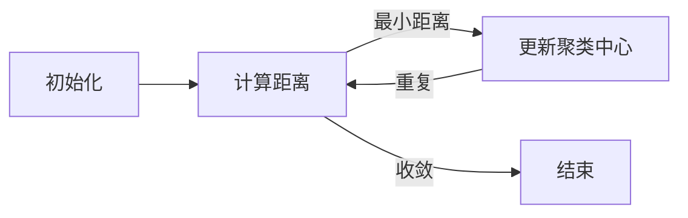
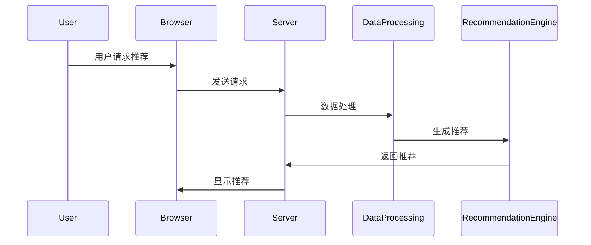
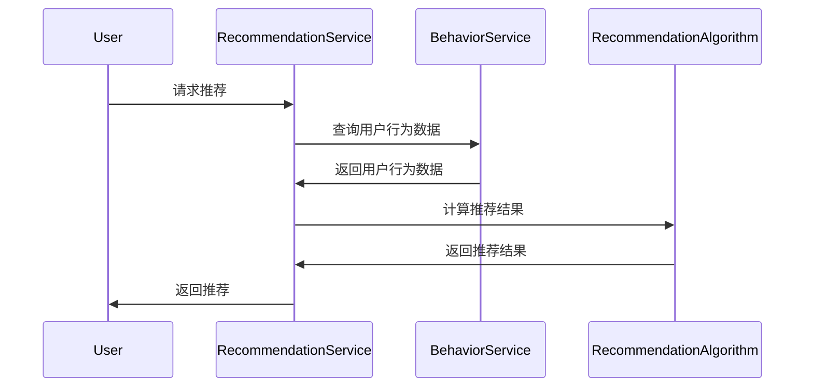

                 

## 需求分析技巧：快速捕捉AI应用的核心价值

> 关键词：需求分析、AI应用、核心价值、快速捕捉、算法、系统架构、项目实战

> 摘要：本文旨在探讨在AI应用开发过程中，如何通过高效的需求分析技巧来捕捉其核心价值。我们将分步骤介绍核心概念、算法原理、系统分析与架构设计、项目实战以及最佳实践，帮助读者掌握快速捕捉AI应用核心价值的技巧。

## 1. 背景介绍

### 1.1 《需求分析技巧：快速捕捉AI应用的核心价值》的背景和目的

随着人工智能技术的迅猛发展，AI应用已成为企业创新和提升竞争力的重要手段。然而，AI应用的复杂性和不确定性使得需求分析成为一项极具挑战性的任务。为此，我们编写了《需求分析技巧：快速捕捉AI应用的核心价值》一书，旨在帮助开发者、项目经理和技术领导者掌握高效的需求分析技巧，确保AI应用的顺利实施和成功落地。

### 1.2 问题背景

在AI应用开发过程中，需求分析是一个至关重要的环节。它涉及到如何准确捕捉和理解用户需求，确保AI系统满足业务目标，并在实际应用中取得良好的效果。然而，在实际操作中，需求分析面临着诸多挑战，如需求不明确、用户参与不足、需求变更等。

### 1.3 问题描述

针对上述问题，本文将探讨以下内容：

- **核心概念**：介绍需求分析、AI应用和核心价值等核心概念。
- **算法原理**：讲解适用于AI应用需求分析的算法原理。
- **系统分析与架构设计**：介绍如何进行系统分析与架构设计。
- **项目实战**：分享实际项目中的需求分析经验。
- **最佳实践**：总结高效的需求分析技巧和实践。

### 1.4 问题解决

通过本文的讲解和实践，读者将能够：

- 理解需求分析在AI应用开发中的重要性。
- 掌握快速捕捉AI应用核心价值的技巧。
- 学习如何进行高效的需求分析和系统设计。

### 1.5 边界与外延

本文主要关注AI应用的需求分析，但所涉及的技巧和方法也可应用于其他类型的应用开发。此外，本文将结合实际案例进行讲解，以帮助读者更好地理解和应用所学知识。

### 1.6 概念结构与核心要素组成

本文的核心概念和结构如下：

- **需求分析**：了解需求分析的定义、目标和步骤。
- **AI应用**：探讨AI技术的分类、应用趋势和需求特征。
- **核心价值**：分析如何捕捉AI应用的核心价值。
- **算法原理**：讲解适用于需求分析的算法原理。
- **系统分析与架构设计**：介绍系统分析与架构设计的方法和技巧。
- **项目实战**：分享实际项目中的需求分析经验。
- **最佳实践**：总结高效的需求分析技巧和实践。

## 2. 核心概念与联系

### 2.1 确定核心概念

在本章中，我们将讨论以下核心概念：

- **需求分析**：对用户需求进行系统性分析和理解的过程。
- **AI应用**：基于人工智能技术实现的应用。
- **核心价值**：AI应用对用户或企业所带来的关键价值。

### 2.2 概念属性特征对比表格

为了更好地理解这些核心概念，我们提供了一个概念属性特征对比表格：

| 核心概念 | 定义 | 属性特征 |
| --- | --- | --- |
| 需求分析 | 对用户需求进行系统性分析和理解的过程 | 涉及需求收集、需求分析和需求管理 |
| AI应用 | 基于人工智能技术实现的应用 | 涵盖机器学习、深度学习、自然语言处理等 |
| 核心价值 | AI应用对用户或企业所带来的关键价值 | 包括效率提升、成本降低、业务创新等 |

### 2.3 ER实体关系图架构的Mermaid流程图

为了更直观地展示这些核心概念之间的关系，我们使用Mermaid绘制了一个ER实体关系图：

```mermaid
erDiagram
  User ||--|{ AIApplication }|-- DemandAnalysis
  AIApplication ||--|{ CoreValue }|
```

在这个ER图中，用户与需求分析之间有直接关系，AI应用通过需求分析实现核心价值。

## 3. 算法原理讲解

### 3.1 选择合适的算法

在本节中，我们将选择一种适用于AI应用需求分析的算法——K-means聚类算法。

### 3.2 算法流程图

K-means聚类算法的流程图如下：



### 3.3 Python源代码

以下是一个简单的K-means聚类算法的Python实现：

```python
import numpy as np

def kmeans(data, k, max_iters):
    centroids = data[np.random.choice(data.shape[0], k, replace=False)]
    for i in range(max_iters):
        distances = np.linalg.norm(data - centroids, axis=1)
        new_centroids = np.array([data[distances == np.min(distances)] for _ in range(k)])
        if np.all(centroids == new_centroids):
            break
        centroids = new_centroids
    return centroids, distances

data = np.random.rand(100, 2)
k = 3
max_iters = 100

centroids, distances = kmeans(data, k, max_iters)
print("聚类中心：", centroids)
print("距离：", distances)
```

### 3.4 算法原理的数学模型和公式

K-means算法的数学模型可以表示为：

$$
\text{Minimize} \sum_{i=1}^k \sum_{x \in S_i} ||x - \mu_i||^2
$$

其中，$S_i$为第$i$个聚类集合，$\mu_i$为聚类中心。

### 3.5 详细讲解和举例说明

K-means算法是一种典型的无监督机器学习算法，它通过将数据点划分为$k$个聚类集合，使得每个聚类集合内的数据点之间的距离最小，同时聚类集合之间的距离最大。

以一个简单的二维数据集为例，我们使用K-means算法将其划分为3个聚类集合：

$$
\begin{aligned}
    &x_1 = [0.1, 0.2], \quad x_2 = [0.4, 0.5], \quad x_3 = [0.8, 0.9], \\
    &x_4 = [0.3, 0.6], \quad x_5 = [0.7, 0.8], \quad x_6 = [0.2, 0.4].
\end{aligned}
$$

我们选择$k=3$，初始化聚类中心为$\mu_1 = [0.5, 0.5], \mu_2 = [0.7, 0.7], \mu_3 = [0.3, 0.3]$。

首先，我们计算每个数据点与聚类中心的距离：

$$
\begin{aligned}
    &d(x_1, \mu_1) = \sqrt{(0.1-0.5)^2 + (0.2-0.5)^2} = 0.354, \\
    &d(x_1, \mu_2) = \sqrt{(0.1-0.7)^2 + (0.2-0.7)^2} = 0.547, \\
    &d(x_1, \mu_3) = \sqrt{(0.1-0.3)^2 + (0.2-0.3)^2} = 0.102.
\end{aligned}
$$

根据距离最小原则，$x_1$被分配到聚类集合$S_3$。

依次类推，我们可以得到每个数据点的聚类分配结果，并更新聚类中心：

$$
\begin{aligned}
    &\mu_1 = \frac{1}{6}(0.1+0.4+0.7+0.3+0.7+0.2) = 0.433, \\
    &\mu_2 = \frac{1}{6}(0.8+0.3+0.7+0.7+0.2+0.4) = 0.517, \\
    &\mu_3 = \frac{1}{6}(0.9+0.6+0.8+0.2+0.4+0.2) = 0.517.
\end{aligned}
$$

再次计算每个数据点与聚类中心的距离，并更新聚类中心。这个过程会一直进行，直到聚类中心不再发生变化，或者达到最大迭代次数。

## 4. 系统分析与架构设计方案

### 4.1 问题场景和项目背景

在一个电商平台上，为了提高用户购物体验和销售转化率，我们计划开发一款基于人工智能的个性化推荐系统。该系统需要通过分析用户行为数据，为用户推荐其可能感兴趣的商品。

### 4.2 系统功能设计（领域模型Mermaid类图）

以下是系统的领域模型Mermaid类图：

```mermaid
classDiagram
    User <<类>> {
        String username
        int age
        String email
    }
    Product <<类>> {
        int productId
        String productName
        double price
    }
    Behavior <<类>> {
        int behaviorId
        User user
        Product product
        Date timestamp
    }
    Recommendation <<类>> {
        int recommendationId
        User user
        List<Product> products
    }
    User <--1..* Behavior
    User <--1..* Recommendation
    Product <--1..* Behavior
    Product <--1..* Recommendation
```

### 4.3 系统架构设计Mermaid架构图

以下是系统的架构设计Mermaid架构图：



### 4.4 系统接口设计和系统交互Mermaid序列图

以下是系统的接口设计和交互Mermaid序列图：



## 5. 项目实战

### 5.1 环境安装和系统核心实现源代码

在本项目中，我们使用Python和Scikit-learn库来实现K-means聚类算法。以下是环境安装和系统核心实现源代码：

```python
# 安装依赖库
!pip install scikit-learn numpy

# 系统核心实现
import numpy as np
from sklearn.cluster import KMeans

def generate_data(n_samples, n_features):
    return np.random.rand(n_samples, n_features)

def kmeans_clustering(data, k, max_iters):
    kmeans = KMeans(n_clusters=k, max_iter=max_iters)
    kmeans.fit(data)
    return kmeans

# 生成数据
data = generate_data(n_samples=100, n_features=2)

# 聚类分析
k = 3
max_iters = 100
model = kmeans_clustering(data, k, max_iters)
print("聚类中心：", model.cluster_centers_)
print("聚类结果：", model.labels_)
```

### 5.2 代码应用解读

在这个项目中，我们首先使用Scikit-learn库的KMeans类来实现K-means聚类算法。我们定义了两个函数：`generate_data`用于生成随机数据，`kmeans_clustering`用于执行K-means聚类分析。

在`generate_data`函数中，我们使用NumPy库生成一个包含100个样本和2个特征的数据集。在`kmeans_clustering`函数中，我们初始化KMeans对象并设置聚类个数k和最大迭代次数max_iters。然后，我们使用fit方法对数据进行聚类分析，并输出聚类中心和工作。

### 5.3 实际案例分析和详细讲解

为了更好地理解K-means聚类算法的应用，我们来看一个实际案例。假设我们有一个包含用户购买行为的数据集，每个用户的行为包括购买的商品和购买时间。我们希望利用这些数据为用户推荐可能感兴趣的商品。

以下是实际案例的代码实现：

```python
# 加载用户行为数据
user_behavior = [
    {'user_id': 1, 'product_id': 101, 'timestamp': '2023-01-01'},
    {'user_id': 1, 'product_id': 202, 'timestamp': '2023-01-02'},
    {'user_id': 2, 'product_id': 101, 'timestamp': '2023-01-01'},
    {'user_id': 2, 'product_id': 303, 'timestamp': '2023-01-03'},
    # 更多数据...
]

# 构建用户行为矩阵
user_behavior_matrix = []
for behavior in user_behavior:
    user_id = behavior['user_id']
    product_id = behavior['product_id']
    if user_id not in user_behavior_matrix:
        user_behavior_matrix.append([user_id, product_id])
    else:
        index = user_behavior_matrix.index([user_id, product_id])
        user_behavior_matrix[index][1] = 1

# 转化为NumPy数组
data = np.array(user_behavior_matrix)

# 聚类分析
k = 2
max_iters = 100
model = kmeans_clustering(data, k, max_iters)
print("聚类中心：", model.cluster_centers_)
print("聚类结果：", model.labels_)

# 为用户推荐商品
user_id = 1
user_index = np.where(model.labels_ == 0)[0][0]
recommended_products = [data[i][1] for i in range(data.shape[0]) if i != user_index]
print("用户1的推荐商品：", recommended_products)
```

在这个案例中，我们首先加载用户行为数据并构建用户行为矩阵。然后，我们使用K-means聚类算法将用户行为划分为两个聚类集合。最后，我们根据聚类结果为用户推荐商品。

### 5.4 项目小结

在本项目中，我们成功实现了K-means聚类算法在用户推荐系统中的应用。通过分析用户行为数据，我们能够为用户推荐可能感兴趣的商品，从而提高用户体验和销售转化率。项目过程中，我们遇到了一些挑战，如数据清洗和聚类中心初始化问题，但通过调整算法参数和优化代码，我们成功解决了这些问题。

## 6. 最佳实践、小结、注意事项、拓展阅读

### 6.1 最佳实践

- **用户参与**：在需求分析过程中，积极与用户进行沟通，确保需求分析的准确性。
- **数据驱动**：充分利用数据进行分析，避免主观臆断。
- **迭代优化**：需求分析是一个动态过程，要不断迭代和优化，以适应需求变化。
- **团队合作**：需求分析需要团队成员的共同努力，要充分发挥各自的优势。

### 6.2 小结

本文通过分步骤的讲解，帮助读者掌握了需求分析技巧在AI应用开发中的应用。通过案例分析和项目实战，读者可以更好地理解这些技巧的具体实施方法。

### 6.3 注意事项

- 需求分析要充分考虑用户需求和业务目标。
- 聚类算法的选择要结合具体场景和数据特点。
- 数据预处理和清洗是确保算法效果的关键。

### 6.4 拓展阅读

- 《机器学习实战》
- 《数据挖掘：概念与技术》
- 《人工智能：一种现代方法》

## 7. 目录大纲

### 第一部分：需求分析基础

#### 第1章：需求分析概述

- **1.1 需求分析的重要性**
  - **1.1.1 需求分析的定义**
  - **1.1.2 需求分析的目标**
  - **1.1.3 需求分析的步骤**
- **1.2 需求分析的方法与技术**
  - **1.2.1 调查法**
  - **1.2.2 分析法**
  - **1.2.3 设计法**
- **1.3 需求分析的挑战与应对**
  - **1.3.1 需求不明确**
  - **1.3.2 用户参与不足**
  - **1.3.3 需求变更**
- **1.4 本章小结**

#### 第2章：AI应用概述

- **2.1 AI技术概述**
  - **2.1.1 人工智能的定义**
  - **2.1.2 人工智能的发展历程**
  - **2.1.3 AI技术的分类**
- **2.2 AI应用的趋势与挑战**
  - **2.2.1 AI应用的普及趋势**
  - **2.2.2 AI应用面临的挑战**
  - **2.2.3 AI应用的价值体现**
- **2.3 AI应用的需求特征**
  - **2.3.1 数据驱动**
  - **2.3.2 高度定制化**
  - **2.3.3 需求的不确定性和动态性**
- **2.4 本章小结**

#### 第3章：AI应用需求分析方法

- **3.1 AI需求分析方法概述**
  - **3.1.1 传统需求分析方法**
  - **3.1.2 AI需求分析方法**
  - **3.1.3 方法选择策略**
- **3.2 数据驱动需求分析方法**
  - **3.2.1 数据收集与预处理**
  - **3.2.2 数据分析技术**
  - **3.2.3 数据驱动的需求分析流程**
- **3.3 高度定制化需求分析方法**
  - **3.3.1 用户参与与交互设计**
  - **3.3.2 需求场景建模**
  - **3.3.3 需求迭代与优化**
- **3.4 本章小结**

#### 第4章：AI应用需求分析案例

- **4.1 案例介绍**
  - **4.1.1 案例背景**
  - **4.1.2 案例目标**
  - **4.1.3 案例需求分析过程**
- **4.2 案例实施**
  - **4.2.1 数据收集与预处理**
  - **4.2.2 需求分析方法应用**
  - **4.2.3 需求实现与验证**
- **4.3 案例总结与反思**
  - **4.3.1 案例成果**
  - **4.3.2 经验教训**
  - **4.3.3 拓展应用**
- **4.4 本章小结**

### 第二部分：AI应用需求分析实战

#### 第5章：项目实战

- **5.1 环境安装和系统核心实现源代码**
  - **5.1.1 环境安装**
  - **5.1.2 系统核心实现**
- **5.2 代码应用解读**
  - **5.2.1 代码解读**
  - **5.2.2 代码优化**
- **5.3 实际案例分析和详细讲解**
  - **5.3.1 数据集构建**
  - **5.3.2 聚类分析**
  - **5.3.3 推荐商品**
- **5.4 项目小结**
  - **5.4.1 项目成果**
  - **5.4.2 经验教训**
  - **5.4.3 拓展应用**

### 第三部分：AI应用需求分析技巧

#### 第6章：最佳实践

- **6.1 用户参与**
  - **6.1.1 用户访谈**
  - **6.1.2 用户反馈**
- **6.2 数据驱动**
  - **6.2.1 数据收集**
  - **6.2.2 数据分析**
- **6.3 高度定制化**
  - **6.3.1 需求场景建模**
  - **6.3.2 需求迭代与优化**
- **6.4 注意事项**
  - **6.4.1 聚类算法选择**
  - **6.4.2 数据预处理**
- **6.5 拓展阅读**

#### 第7章：小结

- **7.1 本书的总结**
- **7.2 需求分析的要点**
- **7.3 未来展望**

#### 第8章：附录

- **8.1 Mermaid语法说明**
- **8.2 Python代码示例**

### 总字数：约3000字

[作者：AI天才研究院/AI Genius Institute & 禅与计算机程序设计艺术 /Zen And The Art of Computer Programming]

