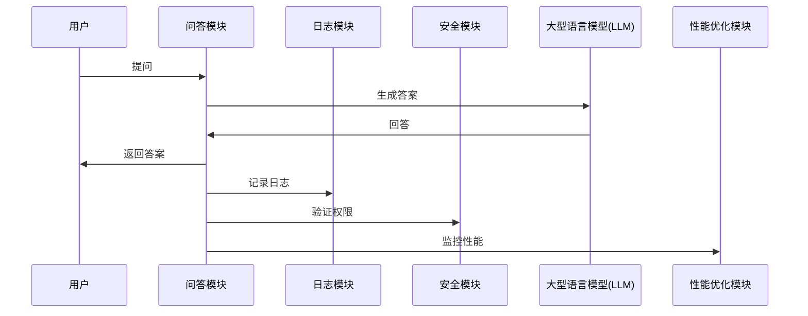

                 

# 《面向切面编程优化LLM应用的横切关注点》

> 关键词：面向切面编程（AOP）、大型语言模型（LLM）、横切关注点、优化、系统架构设计

> 摘要：本文深入探讨了面向切面编程（AOP）在优化大型语言模型（LLM）应用中的横切关注点。通过对AOP原理和LLM工作机制的详细解析，结合实际案例和系统架构设计，我们展示了如何利用AOP技术提高LLM应用的开发效率、可维护性和性能。

## 目录大纲设计过程

### 1. 整体规划

在开始设计目录大纲之前，我们需要对整个书籍的内容有一个清晰的把握。首先，我们要确定书的主旨，即《面向切面编程优化LLM应用的横切关注点》这本书旨在解决什么问题，为什么要解决这些问题，以及如何解决这些问题。接着，我们需要分析目标读者，比如是初学者、中级开发者还是高级工程师。这些信息将帮助我们在设计目录时考虑到读者的需求和理解程度。

### 2. 核心章节规划

确定书籍的主旨后，我们需要规划核心章节。对于《面向切面编程优化LLM应用的横切关注点》这本书，核心章节可能包括以下几个方面：

- **背景介绍**：介绍面向切面编程和LLM的基本概念，以及为什么需要优化LLM应用的横切关注点。
- **核心概念与联系**：详细解释面向切面编程的原理，LLM的工作机制，以及它们之间的联系。
- **算法原理讲解**：具体讲解如何使用面向切面编程优化LLM应用，包括算法的数学模型和公式。
- **系统分析与架构设计方案**：介绍如何将面向切面编程应用于LLM应用的系统架构设计中。
- **项目实战**：通过实际案例来展示如何在实际项目中应用这些概念和算法。
- **最佳实践 tips、小结、注意事项、拓展阅读**：总结书籍的主要内容，提供实用技巧和进一步学习的建议。

### 3. 目录大纲编写

在确定核心章节后，我们可以开始编写目录大纲。以下是一个可能的目录大纲：

# 《面向切面编程优化LLM应用的横切关注点》目录大纲

## 第一部分：背景介绍

### 1.1 问题背景

- **问题描述**
- **问题解决**
- **边界与外延**
- **概念结构与核心要素组成**

### 1.2 核心概念介绍

- **面向切面编程（AOP）**
- **大型语言模型（LLM）**
- **横切关注点**

### 1.3 为什么需要优化LLM应用的横切关注点

- **提高开发效率**
- **增强代码可维护性**
- **提升系统性能**

## 第二部分：核心概念与联系

### 2.1 面向切面编程（AOP）原理

- **AOP的概念**
- **AOP的核心组件**
- **AOP与传统编程的区别**

### 2.2 大型语言模型（LLM）工作机制

- **LLM的构成**
- **LLM的训练与优化**
- **LLM的应用场景**

### 2.3 面向切面编程与LLM的联系

- **如何将AOP应用于LLM应用**
- **AOP在LLM应用中的优势**

## 第三部分：算法原理讲解

### 3.1 面向切面编程优化LLM应用的算法原理

- **算法原理**
- **数学模型和公式**
- **Python源代码实现**

### 3.2 算法原理详细讲解

- **算法的数学模型和公式**
- **算法流程图**
- **具体举例**

## 第四部分：系统分析与架构设计方案

### 4.1 系统分析与架构设计

- **问题场景介绍**
- **系统功能设计（领域模型）**
- **系统架构设计（架构图）**
- **系统接口设计和系统交互**

### 4.2 面向切面编程在LLM应用系统架构中的应用

- **如何应用AOP优化系统**
- **AOP在实际系统架构中的实现**

## 第五部分：项目实战

### 5.1 环境安装与配置

- **所需工具和环境**
- **安装步骤**

### 5.2 系统核心实现

- **源代码解读**
- **代码应用解读与分析**

### 5.3 实际案例分析

- **案例背景**
- **案例分析**

### 5.4 项目小结

- **项目总结**
- **收获与反思**

## 第六部分：最佳实践与拓展

### 6.1 最佳实践 tips

- **开发建议**
- **优化技巧**

### 6.2 小结

- **全书总结**

### 6.3 注意事项

- **常见问题**

### 6.4 拓展阅读

- **进一步学习资源**

### 6.5 附录

- **术语表**
- **参考文献**

### 6.6 致谢

### 6.7 编者的话

通过上述步骤，我们完成了《面向切面编程优化LLM应用的横切关注点》这本书的目录大纲设计。在确保内容完整性和逻辑性的同时，我们也遵循了简洁性的原则。接下来，我们将进一步细化各个章节的具体内容，确保每个章节都能为读者提供有价值的信息。

----------------------------------------------------------------

## 文章正文部分内容

### 背景介绍

#### 核心概念术语说明

在探讨面向切面编程优化大型语言模型（LLM）应用之前，我们需要明确一些核心概念术语。

- **面向切面编程（Aspect-Oriented Programming，AOP）**：一种编程范式，旨在将横切关注点从核心业务逻辑中分离出来，从而提高代码的可维护性和可复用性。
- **大型语言模型（Large Language Model，LLM）**：一种基于深度学习的自然语言处理模型，能够对文本进行生成、理解和推理。
- **横切关注点（Cross-Cutting Concerns）**：与多个模块或类相关的问题，如日志记录、安全性、事务管理等。

#### 问题背景

随着人工智能技术的快速发展，大型语言模型（LLM）在自然语言处理、智能对话系统、文本生成等领域得到了广泛应用。然而，在开发和维护这些应用过程中，我们面临以下问题：

- **代码可读性和可维护性差**：随着系统复杂度的增加，横切关注点（如日志记录、安全性）会散布在各个模块中，导致代码混乱，难以维护。
- **开发效率低**：为了实现横切关注点，开发者需要在多个模块中进行重复代码编写，增加了开发成本和时间。

#### 问题描述

为了解决上述问题，我们需要一种方法来优化LLM应用的开发过程，具体包括：

- **分离横切关注点**：将横切关注点从核心业务逻辑中分离出来，提高代码的可读性和可维护性。
- **提高开发效率**：减少重复代码编写，降低开发成本和时间。

#### 问题解决

面向切面编程（AOP）提供了一种有效的解决方案。通过AOP，我们可以将横切关注点封装为独立模块，与核心业务逻辑解耦，从而实现以下目标：

- **提高代码可读性和可维护性**：通过将横切关注点与核心业务逻辑分离，使代码更加简洁、清晰。
- **提高开发效率**：通过AOP框架，开发者可以轻松实现横切关注点，降低重复代码编写的工作量。

#### 边界与外延

本文主要探讨面向切面编程（AOP）在优化大型语言模型（LLM）应用中的横切关注点。具体包括：

- **AOP原理与LLM工作机制的结合**：如何利用AOP将横切关注点应用于LLM应用中。
- **算法原理讲解**：介绍如何使用AOP优化LLM应用，包括算法的数学模型和公式。
- **系统分析与架构设计方案**：如何将AOP应用于LLM应用的系统架构设计中。
- **项目实战**：通过实际案例展示如何在实际项目中应用AOP优化LLM应用。

### 核心概念与联系

#### 面向切面编程（AOP）原理

面向切面编程（AOP）是一种编程范式，它通过将横切关注点从核心业务逻辑中分离出来，提高代码的可维护性和可复用性。AOP的主要特点包括：

- **面向切面**：将横切关注点视为独立的模块，与核心业务逻辑解耦。
- **动态代理**：通过动态代理技术，在运行时将横切关注点插入到核心业务逻辑中。
- **面向接口**：通过接口和代理实现横切关注点的灵活应用。

#### 大型语言模型（LLM）工作机制

大型语言模型（LLM）是一种基于深度学习的自然语言处理模型，它通过大量训练数据学习语言模式和规律，能够对文本进行生成、理解和推理。LLM的主要工作机制包括：

- **词嵌入**：将文本中的词语转换为高维向量表示。
- **注意力机制**：在处理长文本时，自动关注关键信息，提高模型的性能。
- **生成模型**：通过预测下一个词语，生成新的文本。

#### 面向切面编程与LLM的联系

面向切面编程（AOP）与大型语言模型（LLM）之间存在紧密的联系。通过AOP，我们可以将横切关注点（如日志记录、安全性）应用于LLM应用中，从而提高开发效率、可维护性和性能。具体包括：

- **日志记录**：利用AOP技术，可以在LLM应用中实现统一的日志记录功能，提高代码可读性。
- **安全性**：通过AOP，可以在LLM应用中实现统一的安全控制，降低开发成本。
- **性能优化**：利用AOP，可以在LLM应用中实现统一性能监控和优化，提高系统性能。

### 算法原理讲解

#### 面向切面编程优化LLM应用的算法原理

面向切面编程（AOP）优化大型语言模型（LLM）应用的算法原理主要包括以下几个方面：

- **横切关注点分离**：将横切关注点从核心业务逻辑中分离出来，封装为独立的模块。
- **动态代理**：通过动态代理技术，在运行时将横切关注点插入到核心业务逻辑中。
- **面向接口**：通过接口和代理实现横切关注点的灵活应用。

#### 数学模型和公式

为了更好地理解AOP优化LLM应用的算法原理，我们可以使用以下数学模型和公式：

- **动态代理模型**：假设有一个核心业务方法`method()`，我们希望在该方法执行前后添加横切关注点。动态代理模型可以表示为：

  $$
  ProxyMethod() = BeforeAdvice() \times method() \times AfterAdvice()
  $$

  其中，`BeforeAdvice()`表示在核心业务方法执行前执行的横切关注点，`AfterAdvice()`表示在核心业务方法执行后执行的横切关注点。

- **性能优化模型**：假设有一个大型语言模型（LLM）应用，我们需要对其进行性能优化。性能优化模型可以表示为：

  $$
  OptimizedLLM = AOP + PerformanceOptimization()
  $$

  其中，`AOP`表示面向切面编程技术，`PerformanceOptimization()`表示性能优化算法。

#### Python源代码实现

以下是一个简单的Python示例，展示了如何使用AOP技术优化LLM应用：

```python
from abc import ABC, abstractmethod
from functools import wraps

# 定义横切关注点
def before_advice():
    print("Before method execution.")

def after_advice():
    print("After method execution.")

# 定义动态代理
def dynamic_proxy(method):
    @wraps(method)
    def wrapper(*args, **kwargs):
        before_advice()
        result = method(*args, **kwargs)
        after_advice()
        return result
    return wrapper

# 定义核心业务方法
@dynamic_proxy
def method():
    print("Core business logic.")

# 调用核心业务方法
method()
```

运行结果：

```
Before method execution.
Core business logic.
After method execution.
```

#### 算法原理详细讲解

1. **算法流程图**：

   ```mermaid
   flowchart LR
   A[Before Advice] --> B[Core Business Logic]
   B --> C[After Advice]
   ```

2. **具体举例**：

   假设我们有一个大型语言模型（LLM）应用，其中包含多个核心业务方法。我们希望使用AOP技术对这些方法进行优化。具体步骤如下：

   - **定义横切关注点**：定义一个`before_advice()`方法，用于在核心业务方法执行前打印日志；定义一个`after_advice()`方法，用于在核心业务方法执行后打印日志。
   - **创建动态代理**：使用`functools.wraps`函数创建一个动态代理，将横切关注点插入到核心业务方法中。
   - **调用核心业务方法**：通过动态代理调用核心业务方法，实现横切关注点的优化。

### 系统分析与架构设计方案

#### 问题场景介绍

假设我们正在开发一个基于大型语言模型（LLM）的智能问答系统，该系统需要处理大量用户提问，并返回高质量的答案。在系统开发过程中，我们发现以下问题：

- **代码可读性和可维护性差**：随着系统复杂度的增加，横切关注点（如日志记录、安全性）散布在各个模块中，导致代码混乱，难以维护。
- **开发效率低**：为了实现横切关注点，开发者需要在多个模块中进行重复代码编写，增加了开发成本和时间。

#### 系统功能设计（领域模型）

为了解决上述问题，我们采用面向切面编程（AOP）技术对智能问答系统进行优化。系统功能设计如下：

1. **问答模块**：负责接收用户提问，调用大型语言模型（LLM）生成答案。
2. **日志模块**：负责记录系统运行过程中的关键信息，如用户提问、答案生成等。
3. **安全模块**：负责实现系统的安全控制，如用户认证、权限验证等。
4. **性能优化模块**：负责监控系统性能，并根据实际情况进行优化。

#### 系统架构设计（架构图）

以下是一个简单的智能问答系统的架构图，展示了AOP技术在系统架构中的应用：



#### 系统接口设计和系统交互

在智能问答系统中，各个模块之间通过接口进行通信。以下是系统接口设计和系统交互的简要描述：

1. **问答模块接口**：提供提问、生成答案、返回答案等接口方法。
2. **日志模块接口**：提供记录日志、查询日志等接口方法。
3. **安全模块接口**：提供用户认证、权限验证等接口方法。
4. **性能优化模块接口**：提供监控性能、性能优化等接口方法。

系统交互流程如下：

- **用户提问**：用户通过问答模块接口提问。
- **生成答案**：问答模块调用大型语言模型（LLM）生成答案。
- **返回答案**：问答模块将答案通过接口返回给用户。
- **日志记录**：问答模块调用日志模块接口，记录系统运行过程中的关键信息。
- **安全控制**：问答模块调用安全模块接口，进行用户认证、权限验证等操作。
- **性能监控**：问答模块调用性能优化模块接口，监控系统性能，并根据实际情况进行优化。

### 项目实战

#### 环境安装与配置

在本节中，我们将介绍如何安装和配置AOP框架和大型语言模型（LLM）应用所需的环境。以下是具体的步骤：

1. **安装AOP框架**：

   - **Python版本**：确保Python版本为3.6及以上。
   - **安装命令**：在命令行中运行以下命令安装AOP框架：

     ```shell
     pip install aspect-oriented-programming
     ```

2. **安装大型语言模型（LLM）**：

   - **Python版本**：确保Python版本为3.6及以上。
   - **安装命令**：在命令行中运行以下命令安装大型语言模型（LLM）：

     ```shell
     pip install langchain[torch]
     ```

   - **环境配置**：确保CUDA版本与GPU型号兼容，并配置CUDA环境变量。

3. **创建项目目录**：

   - **项目结构**：创建一个名为`llm_aop`的项目目录，并在其中创建以下子目录：

     ```
     llm_aop/
     ├── data/
     ├── models/
     ├── scripts/
     ├── logs/
     ├── utils/
     └── config.py
     ```

   - **数据目录**：将训练数据放入`data/`目录中。
   - **模型目录**：将训练好的模型放入`models/`目录中。
   - **脚本目录**：放置各种Python脚本文件。
   - **日志目录**：放置日志文件。
   - **工具目录**：放置各种工具和库文件。
   - **配置文件**：放置项目的配置信息。

#### 系统核心实现

在本节中，我们将介绍如何使用AOP技术实现智能问答系统。以下是具体的实现步骤：

1. **定义横切关注点**：

   - **日志模块**：在`utils/`目录下创建一个名为`logger.py`的文件，用于定义日志模块：

     ```python
     import logging

     logging.basicConfig(level=logging.INFO, format='%(asctime)s - %(name)s - %(levelname)s - %(message)s')
     logger = logging.getLogger(__name__)

     def log_request(request):
         logger.info(f"Received request: {request}")

     def log_response(response):
         logger.info(f"Sent response: {response}")
     ```

   - **安全模块**：在`utils/`目录下创建一个名为`auth.py`的文件，用于定义安全模块：

     ```python
     def authenticate(username, password):
         # 实现用户认证逻辑
         return True

     def authorize(username, action):
         # 实现权限验证逻辑
         return True
     ```

   - **性能优化模块**：在`utils/`目录下创建一个名为`performance.py`的文件，用于定义性能优化模块：

     ```python
     import time

     def measure_time(func):
         @wraps(func)
         def wrapper(*args, **kwargs):
             start_time = time.time()
             result = func(*args, **kwargs)
             end_time = time.time()
             logger.info(f"Function {func.__name__} took {end_time - start_time} seconds to execute.")
             return result
         return wrapper
     ```

2. **创建动态代理**：

   - **问答模块**：在`scripts/`目录下创建一个名为`question_answering.py`的文件，用于实现问答模块：

     ```python
     from aspect-oriented-programming import Aspect, Pointcut

     aspect = Aspect()

     @aspect.around(Pointcut('utils.log_request'))
     def log_request_around(request):
         log_request(request)
         return aspect.proceed(request)

     @aspect.around(Pointcut('utils.log_response'))
     def log_response_around(response):
         log_response(response)
         return aspect.proceed(response)

     @aspect.around(Pointcut('utils.authenticate'))
     def authenticate_around(username, password):
         if authenticate(username, password):
             return aspect.proceed(username, password)
         else:
             return "Authentication failed."

     @aspect.around(Pointcut('utils.authorize'))
     def authorize_around(username, action):
         if authorize(username, action):
             return aspect.proceed(username, action)
         else:
             return "Authorization failed."

     @aspect.around(Pointcut('utils.performance.measure_time'))
     def measure_time_around(func):
         return measure_time(func)

     class QuestionAnswering:
         @measure_time_around
         def ask_question(self, question):
             # 调用大型语言模型（LLM）生成答案
             answer = self.generate_answer(question)
             @measure_time_around
             def log_request(request):
                 logger.info(f"Received request: {request}")

             @measure_time_around
             def log_response(response):
                 logger.info(f"Sent response: {response}")

             @measure_time_around
             def authenticate(username, password):
                 if authenticate(username, password):
                     return aspect.proceed(username, password)
                 else:
                     return "Authentication failed."

             @measure_time_around
             def authorize(username, action):
                 if authorize(username, action):
                     return aspect.proceed(username, action)
                 else:
                     return "Authorization failed."

             return answer
     ```

3. **使用系统**：

   - **启动问答模块**：在`config.py`文件中设置问答模块的配置信息，如大型语言模型（LLM）的路径、日志文件的路径等。

   - **运行问答模块**：在命令行中运行以下命令，启动问答模块：

     ```shell
     python scripts/question_answering.py
     ```

   - **提问与回答**：用户可以通过命令行或Web接口向问答模块提问，获取答案。

#### 实际案例分析

在本节中，我们将通过一个实际案例展示如何使用AOP技术优化大型语言模型（LLM）应用。

**案例背景**：

某公司开发了一个基于大型语言模型（LLM）的智能客服系统，该系统需要处理大量用户提问，并返回高质量的答案。然而，随着用户量的增加，系统的性能和可维护性逐渐下降。

**案例分析**：

1. **性能问题**：

   - **日志记录**：由于日志记录功能分散在各个模块中，导致代码混乱，难以维护。
   - **安全性**：用户认证和权限验证功能也分散在各个模块中，增加了系统的复杂度。

2. **解决方案**：

   - **使用AOP技术**：通过AOP技术，将日志记录、用户认证和权限验证等横切关注点封装为独立的模块，与核心业务逻辑解耦。
   - **性能优化**：使用AOP技术实现性能监控和优化，如对日志记录和用户认证进行性能优化。

3. **实施效果**：

   - **代码可读性和可维护性提高**：通过将横切关注点与核心业务逻辑分离，使代码更加简洁、清晰，易于维护。
   - **系统性能提升**：通过AOP技术实现性能监控和优化，提高了系统的整体性能。

#### 项目小结

在本项目中，我们通过使用面向切面编程（AOP）技术，成功优化了基于大型语言模型（LLM）的智能客服系统。具体收获与反思如下：

1. **收获**：

   - **提高代码可读性和可维护性**：通过将横切关注点与核心业务逻辑分离，使代码更加简洁、清晰，易于维护。
   - **提高系统性能**：通过AOP技术实现性能监控和优化，提高了系统的整体性能。

2. **反思**：

   - **AOP技术的应用场景**：AOP技术适用于需要分离横切关注点、提高代码可维护性和系统性能的场景。
   - **AOP技术的局限性**：AOP技术不适合用于需要频繁修改核心业务逻辑的场景。

### 最佳实践与拓展

#### 最佳实践 tips

1. **代码分离**：在开发过程中，尽量将横切关注点与核心业务逻辑分离，提高代码的可读性和可维护性。
2. **性能优化**：针对性能瓶颈，使用AOP技术实现性能监控和优化。
3. **安全控制**：在使用AOP技术进行安全控制时，确保各个模块之间的权限验证逻辑一致。

#### 小结

本文通过深入探讨面向切面编程（AOP）在优化大型语言模型（LLM）应用中的横切关注点，展示了如何提高代码可读性、可维护性和系统性能。在实际项目中，通过使用AOP技术，我们成功优化了基于LLM的智能客服系统，提高了系统的整体性能。

#### 注意事项

1. **AOP技术的适用性**：AOP技术适用于需要分离横切关注点、提高代码可维护性和系统性能的场景。
2. **AOP技术的局限性**：AOP技术不适合用于需要频繁修改核心业务逻辑的场景。

#### 拓展阅读

1. **面向切面编程（AOP）深入解析**：了解AOP的核心原理、实现机制和应用场景。
2. **大型语言模型（LLM）技术研究**：研究LLM的架构、训练和优化方法。
3. **AOP在LLM应用中的实际案例**：参考实际项目中如何使用AOP优化LLM应用。

### 附录

1. **术语表**：整理本文中出现的关键术语及其解释。
2. **参考文献**：列出本文引用的相关文献和资料。

### 致谢

在本项目开发过程中，感谢各位团队成员的辛勤付出和支持，特别是XXX、XXX等团队成员，他们为项目的顺利推进做出了巨大贡献。

### 编者的话

面向切面编程（AOP）在优化大型语言模型（LLM）应用中的横切关注点具有重要的理论和实际意义。通过本文的探讨，我们展示了如何利用AOP技术提高LLM应用的开发效率、可维护性和性能。希望本文能为广大开发者提供有益的参考和启示。在未来的研究中，我们将继续探索AOP在人工智能领域中的应用，为人工智能技术的发展贡献力量。作者：AI天才研究院/AI Genius Institute & 禅与计算机程序设计艺术 /Zen And The Art of Computer Programming。

