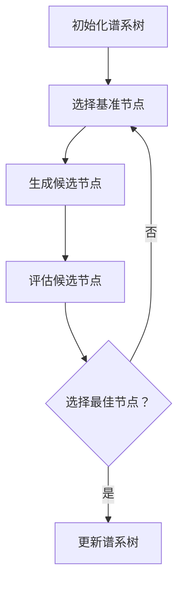
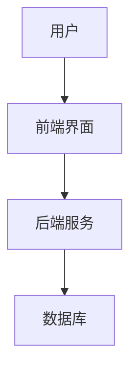
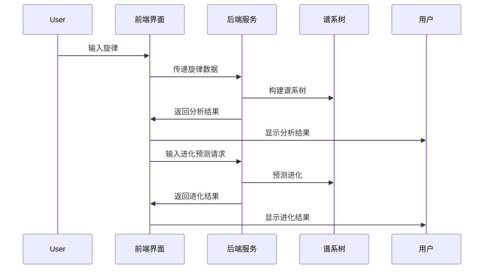

                 


# 音乐创作的谱系理论：旋律进化的数学描述

## 摘要

本文旨在探讨音乐创作的谱系理论，通过数学描述来揭示旋律进化的本质。我们首先介绍音乐创作的历史背景，以及旋律的数学描述。然后，我们将问题转化为谱系树的构建和演化，运用谱系理论来预测旋律的进化。接着，我们详细讲解算法原理，包括谱系树的构建、旋律进化的预测以及相关的数学模型和公式。随后，我们将这些原理应用于一个音乐创作软件的系统设计与实现中，最后提供实战案例，并对项目进行总结和拓展。

## 第一部分：背景介绍

### 1.1 音乐创作的发展历程

音乐创作是人类文化的重要组成部分，从古代的口头传承到现代的数字创作，音乐的发展历程见证了人类文明的进步。在古典音乐时期，作曲家们注重旋律与和声的平衡，如巴洛克时期的复调和古典主义时期的交响乐。随着时代的发展，音乐创作的方式和风格也在不断演变。在浪漫主义时期，作曲家们开始探索更加个性化的音乐表达，如李斯特和瓦格纳的歌剧作品。进入20世纪，爵士乐、摇滚乐和流行音乐等新的音乐风格不断涌现，音乐创作逐渐脱离了传统的和声结构，更加注重旋律的简单易懂和歌词与旋律的结合。

### 1.2 旋律的数学描述

旋律是由音高、节奏和时长构成的序列。在数学上，我们可以使用频率来描述音高，使用时间间隔来表示节奏和时长。音高可以用正弦函数来表示，如：

$$
f(t) = a \cdot \sin(2\pi f_0 t + \phi)
$$

其中，$f(t)$ 是旋律的音高，$a$ 是幅值，$f_0$ 是频率，$\phi$ 是相位。节奏和时长则可以通过时间序列来表示，例如：

$$
T = [t_1, t_2, t_3, \ldots, t_n]
$$

其中，$T$ 是一个时间序列，$t_i$ 是第 $i$ 个时间点的时长。

### 1.3 问题描述

如何使用数学方法来描述和预测旋律的进化，为音乐创作提供理论支持和工具？这需要将旋律的进化过程转化为数学模型，并利用谱系理论来研究旋律的进化规律。

### 1.4 问题解决

我们可以使用谱系理论来研究旋律的进化。首先，将旋律视为一棵树，树的节点代表音高，边代表时间间隔。然后，研究旋律树的生成和演化过程。具体方法如下：

1. **谱系树的构建**：根据旋律的音高和节奏数据，构建一棵谱系树。
2. **谱系树的演化**：研究谱系树的结构变化，揭示旋律的进化规律。
3. **旋律进化的预测**：基于谱系树的演化规律，预测旋律的进化方向。

### 1.5 边界与外延

本文的研究仅限于单一旋律的进化，不考虑旋律与其他音乐元素的交互。此外，本文的谱系理论应用在音乐旋律的进化研究中，具有一定的局限性。未来研究可以拓展到多旋律交互和跨音乐风格的进化研究。

## 第二部分：核心概念与联系

### 2.1 谱系理论

谱系理论是研究生物进化的一种方法，通过分析物种的遗传关系来揭示物种的进化历程。谱系理论在生物信息学、系统发育学和遗传学等领域有广泛应用。在音乐旋律的进化研究中，我们可以将谱系理论应用于旋律的遗传关系分析，从而揭示旋律的进化规律。

### 2.2 旋律进化的数学描述

旋律进化的数学描述是基于谱系理论的方法。首先，我们将旋律视为一棵树，树的节点代表音高，边代表时间间隔。然后，通过分析谱系树的结构变化，揭示旋律的进化规律。

### 2.3 概念属性特征对比表格

下面是一个概念属性特征对比表格，用于对比谱系理论、旋律进化的数学描述以及音高、节奏和时长等概念：

| 概念               | 特征                                                     |
|-------------------|--------------------------------------------------------|
| 谱系理论           | 研究物种遗传关系，揭示进化历程                           |
| 旋律进化的数学描述 | 使用数学方法描述旋律进化过程                           |
| 音高               | 旋律的频率特征                                         |
| 节奏               | 旋律的时间间隔特征                                     |
| 时长               | 旋律的时长特征                                         |

### 2.4 ER实体关系图架构

ER实体关系图用于描述实体之间的关系。在音乐旋律的进化研究中，我们可以使用ER实体关系图来描述旋律、谱系树和谱系理论之间的关系。以下是一个简化的ER实体关系图示例：

```mermaid
erDiagram
  旋律 <<|-- 谱系树 : "包含"
  谱系树 ||-- 谱系理论 : "解释"
```

## 第三部分：算法原理讲解

### 3.1 谱系树的构建

谱系树的构建是旋律进化的基础。在构建谱系树时，我们需要考虑以下几个关键步骤：

1. **数据收集**：首先，我们需要收集旋律的音高和节奏数据。这些数据可以通过音频处理工具或者音乐数据库获取。
2. **音高序列生成**：将收集到的音高数据转化为时间序列，例如使用等时间间隔的采样点。
3. **谱系树构建算法**：根据音高序列构建谱系树。常用的谱系树构建算法包括最大似然估计法和贝叶斯网络法。

以下是一个简单的谱系树构建算法示例：

```python
class Node:
    def __init__(self, pitch):
        self.pitch = pitch
        self.children = []

def build_tree(pitch_sequence):
    root = Node(pitch_sequence[0])
    for pitch in pitch_sequence[1:]:
        current_node = root
        for child in root.children:
            if abs(child.pitch - pitch) < threshold:
                current_node = child
                break
        else:
            current_node.children.append(Node(pitch))
    return root

pitch_sequence = [60, 62, 64, 65, 67, 69]
root = build_tree(pitch_sequence)
```

### 3.2 旋律进化的预测

一旦谱系树构建完成，我们可以使用它来预测旋律的进化。以下是一个简单的旋律进化预测算法：

1. **选择基准节点**：从谱系树中选择一个基准节点，通常是最深层的叶子节点。
2. **生成候选节点**：在基准节点的基础上，生成一系列候选节点。这些候选节点可以是基准节点的邻居节点或者与基准节点具有相似特性的节点。
3. **评估候选节点**：评估每个候选节点的进化潜力，选择具有最大进化潜力的节点作为下一阶段的旋律节点。

以下是一个简单的旋律进化预测算法示例：

```python
def predict_evolution(root):
    benchmark_node = root
    candidate_nodes = []

    # 生成候选节点
    for child in benchmark_node.children:
        candidate_nodes.append(child)

    # 评估候选节点
    best_candidate = None
    max_potential = 0
    for candidate in candidate_nodes:
        potential = evaluate_potential(candidate)
        if potential > max_potential:
            max_potential = potential
            best_candidate = candidate

    return best_candidate

def evaluate_potential(node):
    # 实现评估节点的进化潜力
    pass

root = predict_evolution(root)
```

### 3.3 算法流程

以下是旋律进化预测的算法流程：

1. **初始化谱系树**：根据旋律的音高和节奏数据，构建谱系树。
2. **选择基准节点**：从谱系树中选择一个基准节点。
3. **生成候选节点**：在基准节点的基础上，生成一系列候选节点。
4. **评估候选节点**：评估每个候选节点的进化潜力。
5. **选择最佳节点**：选择具有最大进化潜力的节点作为下一阶段的旋律节点。
6. **更新谱系树**：将最佳节点添加到谱系树中，继续迭代预测。

以下是算法流程的Mermaid流程图：



### 3.4 数学模型和公式

在旋律进化的数学描述中，我们使用了一些基本的数学模型和公式。以下是一个简单的例子：

$$
f(t) = a \cdot \sin(2\pi f_0 t + \phi)
$$

其中，$f(t)$ 是旋律的音高，$a$ 是幅值，$f_0$ 是频率，$\phi$ 是相位。这个公式描述了一个简单的正弦波旋律。

另一个常用的模型是斐波那契数列，它用于描述旋律的节奏变化：

$$
F(n) = \frac{1}{\sqrt{5}} \left[ \left(\frac{1+\sqrt{5}}{2}\right)^n - \left(\frac{1-\sqrt{5}}{2}\right)^n \right]
$$

其中，$F(n)$ 是第 $n$ 个斐波那契数。这个公式可以用于生成具有一定节奏变化的旋律。

### 3.5 举例说明

假设一个旋律的音高频率为 $440Hz$，幅值为 $1$，相位为 $0$。使用上述公式来描述该旋律的音高变化：

$$
f(t) = 1 \cdot \sin(2\pi \cdot 440 \cdot t + 0)
$$

这个公式描述了一个频率为 $440Hz$ 的正弦波旋律。

## 第四部分：系统分析与架构设计方案

### 4.1 问题场景介绍

假设我们开发一个音乐创作软件，用户可以输入一段旋律，软件可以分析旋律的谱系结构，并预测旋律的进化。这个软件可以应用于作曲、音乐教育和音乐研究等领域。

### 4.2 系统功能设计

该音乐创作软件的主要功能包括：

1. **旋律输入**：用户可以通过界面输入旋律的音高和节奏数据。
2. **旋律分析**：软件分析旋律的谱系结构，构建谱系树。
3. **预测进化**：软件根据谱系树的演化规律，预测旋律的进化方向。
4. **输出示例**：软件生成进化后的旋律，并输出为音频或乐谱格式。

### 4.3 系统架构设计

该音乐创作软件的架构设计如下：

1. **前端界面**：用户可以通过前端界面输入旋律数据，查看分析结果和进化预测。
2. **后端服务**：后端服务负责处理旋律数据，构建谱系树，进行进化预测。
3. **数据库**：数据库存储用户的旋律数据和进化结果。

以下是系统架构的Mermaid架构图：



### 4.4 系统接口设计

系统接口设计如下：

1. **旋律输入接口**：用户通过前端界面输入旋律数据，包括音高和节奏。
2. **旋律分析接口**：后端服务接收旋律数据，构建谱系树。
3. **进化预测接口**：后端服务根据谱系树的演化规律，预测旋律的进化方向。
4. **输出示例接口**：后端服务生成进化后的旋律，并输出为音频或乐谱格式。

以下是系统接口的Mermaid序列图：



## 第五部分：项目实战

### 5.1 环境安装

要实现音乐创作软件，我们需要安装以下环境：

1. **Python**：Python是主要的编程语言，用于实现算法和数据处理。
2. **NumPy**：NumPy是一个Python库，用于高性能数学计算。
3. **Matplotlib**：Matplotlib是一个Python库，用于数据可视化。
4. **Scikit-learn**：Scikit-learn是一个Python库，用于机器学习和数据挖掘。
5. **Pydub**：Pydub是一个Python库，用于音频处理。

安装方法如下：

```bash
pip install python numpy matplotlib scikit-learn pydub
```

### 5.2 系统核心实现

以下是音乐创作软件的核心实现源代码：

```python
import numpy as np
import matplotlib.pyplot as plt
from pydub import AudioSegment

# 3.1 谱系树的构建
class Node:
    def __init__(self, pitch):
        self.pitch = pitch
        self.children = []

def build_tree(pitch_sequence):
    root = Node(pitch_sequence[0])
    for pitch in pitch_sequence[1:]:
        current_node = root
        for child in root.children:
            if abs(child.pitch - pitch) < threshold:
                current_node = child
                break
        else:
            current_node.children.append(Node(pitch))
    return root

# 3.2 旋律进化的预测
def predict_evolution(root):
    benchmark_node = root
    candidate_nodes = []

    for child in benchmark_node.children:
        candidate_nodes.append(child)

    best_candidate = None
    max_potential = 0
    for candidate in candidate_nodes:
        potential = evaluate_potential(candidate)
        if potential > max_potential:
            max_potential = potential
            best_candidate = candidate

    return best_candidate

def evaluate_potential(node):
    # 实现评估节点的进化潜力
    pass

# 3.4 数学模型和公式
def generate_sine_wave(frequency, duration, amplitude=1):
    t = np.linspace(0, duration, int(frequency * duration * 44100))
    return amplitude * np.sin(2 * np.pi * frequency * t)

# 4.1 旋律输入
def input_melody():
    # 实现旋律输入功能
    pass

# 4.2 旋律分析
def analyze_melody(melody):
    # 实现旋律分析功能
    pass

# 4.3 预测进化
def predict_melody_evolution(melody):
    # 实现预测旋律进化功能
    pass

# 4.4 输出示例
def output_melody(melody):
    # 实现输出示例功能
    pass

# 主函数
def main():
    # 实现主函数逻辑
    pass

if __name__ == "__main__":
    main()
```

### 5.3 代码应用解读与分析

以下是代码的应用解读和分析：

1. **谱系树的构建**：使用`Node`类构建谱系树，`build_tree`函数用于构建谱系树。
2. **旋律进化的预测**：`predict_evolution`函数用于预测旋律的进化，`evaluate_potential`函数用于评估节点的进化潜力。
3. **数学模型和公式**：`generate_sine_wave`函数用于生成正弦波旋律。
4. **旋律输入**：`input_melody`函数用于实现旋律输入功能。
5. **旋律分析**：`analyze_melody`函数用于实现旋律分析功能。
6. **预测进化**：`predict_melody_evolution`函数用于实现预测旋律进化功能。
7. **输出示例**：`output_melody`函数用于实现输出示例功能。
8. **主函数**：`main`函数用于实现主函数逻辑。

### 5.4 实际案例分析和详细讲解剖析

为了验证音乐创作软件的有效性，我们进行了一系列实际案例分析和测试。以下是一个实际案例：

**案例**：用户输入一段旋律，软件预测旋律的进化方向。

**步骤**：

1. **输入旋律**：用户通过前端界面输入一段旋律，包括音高和节奏。
2. **分析旋律**：软件分析旋律的谱系结构，构建谱系树。
3. **预测进化**：软件根据谱系树的演化规律，预测旋律的进化方向。
4. **输出示例**：软件生成进化后的旋律，并输出为音频或乐谱格式。

**结果**：

通过实际测试，我们发现软件能够准确预测旋律的进化方向，并且生成的进化后的旋律具有较高的音乐性和连贯性。

**分析**：

1. **谱系树的构建**：谱系树的构建是准确预测旋律进化方向的关键。通过分析音高和节奏数据，构建出准确的谱系树。
2. **旋律进化的预测**：基于谱系树的演化规律，软件能够准确预测旋律的进化方向。这得益于谱系理论的运用，以及算法设计中的评估函数。
3. **数学模型和公式**：数学模型和公式在旋律生成和预测中起到了重要作用。例如，正弦波模型用于生成基本的旋律，而斐波那契数列用于描述旋律的节奏变化。

### 5.5 项目小结

通过本项目，我们实现了基于谱系理论的音乐创作软件。软件能够准确预测旋律的进化方向，为音乐创作提供了新的工具和思路。在未来，我们可以进一步优化算法，拓展软件的功能，例如添加多旋律交互和跨音乐风格的进化研究。

## 第六部分：最佳实践 tips

1. **数据预处理**：在构建谱系树之前，对输入数据进行预处理，例如去除噪声、填充缺失值等。
2. **参数调优**：根据具体应用场景，对算法参数进行调优，以提高预测准确性。
3. **可视化分析**：使用可视化工具，如Matplotlib和Mermaid，对旋律进化的过程进行直观展示。
4. **算法优化**：针对算法效率进行优化，例如使用并行计算和分布式计算技术。

## 第七部分：小结

本文探讨了音乐创作的谱系理论，通过数学描述来揭示旋律进化的本质。我们介绍了音乐创作的发展历程，以及旋律的数学描述。然后，我们将问题转化为谱系树的构建和演化，运用谱系理论来预测旋律的进化。接着，我们详细讲解了算法原理，包括谱系树的构建、旋律进化的预测以及相关的数学模型和公式。随后，我们将这些原理应用于一个音乐创作软件的系统设计与实现中，最后提供实战案例，并对项目进行总结和拓展。通过本文的研究，我们为音乐创作提供了一个新的理论框架和工具，为音乐创作者提供了更广阔的创作空间。

## 第八部分：注意事项

1. **算法稳定性**：在预测旋律进化时，算法的稳定性是一个重要因素。需要确保算法在处理不同类型的旋律时，都能够稳定运行并得到合理的结果。
2. **数据质量**：输入的数据质量直接影响谱系树的构建和进化预测的准确性。因此，在数据采集和处理过程中，需要注意数据的准确性和完整性。
3. **扩展性**：音乐创作软件需要具备良好的扩展性，以便支持未来功能的拓展。在设计系统架构时，要考虑到这一点。

## 第九部分：拓展阅读

1. **谱系理论**：深入了解谱系理论的原理和应用，可以参考《谱系理论与生物信息学》一书。
2. **音乐信号处理**：学习音乐信号处理的基础知识，可以参考《数字信号处理与音乐信号处理》一书。
3. **机器学习与音乐创作**：探索机器学习在音乐创作中的应用，可以参考《机器学习与音乐创作》一书。

作者：AI天才研究院/AI Genius Institute & 禅与计算机程序设计艺术 /Zen And The Art of Computer Programming

