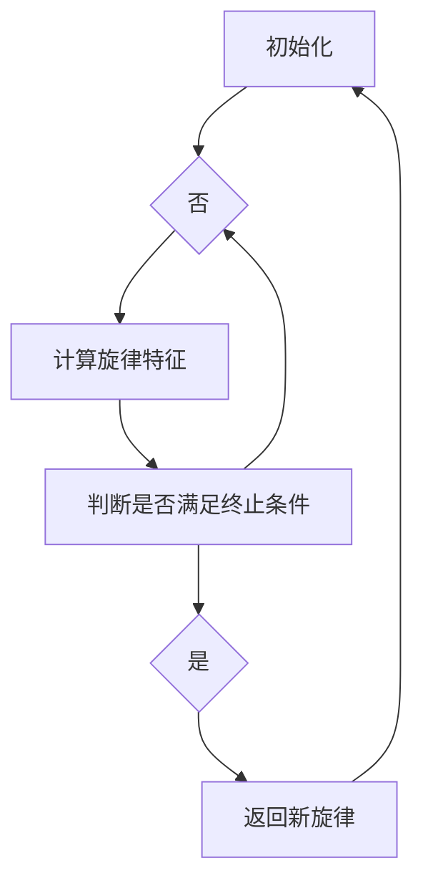

                 

# 音乐创作的谱系理论：旋律进化的数学描述

## 关键词

音乐创作、谱系理论、旋律进化、数学描述、算法原理、应用场景、项目实战

## 摘要

本文旨在深入探讨音乐创作的谱系理论，特别是旋律进化的数学描述。通过定义核心概念、介绍相关理论，并运用算法和数学模型，我们将逐步展示如何从理论到实践，实现音乐创作的创新和进化。本文分为六个部分，首先介绍谱系理论的基础知识，然后阐述旋律进化的数学模型，接着详细讲解算法原理，分析应用场景，展示项目实战，最后提供最佳实践与总结。

## 第一部分：谱系理论与音乐创作

### 1.1 音乐创作的谱系理论概述

音乐创作是人类文化的重要体现，而谱系理论则为音乐创作提供了系统化和结构化的方法。谱系理论起源于18世纪的西方音乐理论，通过研究音乐的谱系结构，试图揭示音乐创作的内在规律和演变过程。

谱系理论的基本概念包括谱系、旋律、和声等。谱系是指音乐作品的谱系结构，包括旋律、和声、节奏等元素。旋律是音乐的核心，是音乐作品的灵魂。和声则是旋律的补充和扩展，通过不同的和弦组合，可以创造出丰富多彩的音乐效果。

在音乐创作中，谱系理论的重要性体现在多个方面。首先，它可以指导音乐创作者更好地理解和把握音乐的结构和形式，提高创作的效率和效果。其次，谱系理论可以用于音乐分析和分类，帮助我们更好地理解和欣赏音乐作品。

### 1.2 核心概念与联系

为了更好地理解谱系理论，我们需要明确几个核心概念，包括谱系、旋律、和声等，并探讨它们之间的联系。

- **谱系**：谱系是指音乐作品的谱系结构，包括旋律、和声、节奏等元素。谱系理论通过研究这些元素的组合和演变，试图揭示音乐创作的规律和演变过程。

- **旋律**：旋律是音乐的核心，是音乐作品的灵魂。旋律的构建和演变是音乐创作的重要环节。

- **和声**：和声是旋律的补充和扩展，通过不同的和弦组合，可以创造出丰富多彩的音乐效果。

在谱系理论中，这些概念之间的关系非常密切。旋律是和声的基础，而和声则是旋律的扩展和补充。通过研究这些概念之间的相互作用，我们可以更深入地理解音乐创作的本质。

## 第二部分：旋律进化的基本数学模型

### 2.1 旋律进化的概念

旋律进化是指音乐旋律随着时间的推移而发生变化的过程。这种变化可以是旋律元素的替换、重排、扩展或压缩等。旋律进化不仅反映了音乐创作者的创意和技能，也反映了音乐风格的演变和文化变迁。

旋律进化的分类可以根据不同的标准进行。例如，根据旋律变化的速度，可以分为慢速进化、中速进化和快速进化。根据旋律变化的幅度，可以分为微小进化、显著进化和彻底进化。这些分类有助于我们更好地理解旋律进化的多样性和复杂性。

### 2.2 数学模型介绍

为了描述旋律进化，我们需要引入一些数学模型。这些模型可以帮助我们量化旋律的变化，并分析旋律进化的规律和趋势。

- **生成模型**：生成模型是一种用于描述数据分布的数学模型。在旋律进化中，生成模型可以用于生成新的旋律，模拟旋律的进化过程。

- **变换模型**：变换模型是一种用于描述数据转换的数学模型。在旋律进化中，变换模型可以用于描述旋律元素的替换、重排、扩展或压缩等。

- **随机过程模型**：随机过程模型是一种用于描述随机现象的数学模型。在旋律进化中，随机过程模型可以用于模拟旋律进化的随机性和不确定性。

这些数学模型为我们提供了强有力的工具，可以帮助我们更好地理解和分析旋律进化。

## 第三部分：旋律进化的算法原理

### 3.1 算法原理概述

在旋律进化的研究中，算法原理起到了关键作用。算法原理是指用于描述旋律进化过程的数学方法和计算模型。这些算法原理可以帮助我们模拟旋律的进化，分析旋律进化的规律和趋势。

常见的旋律进化算法包括：

- **基于生成模型的算法**：这类算法通过生成模型生成新的旋律，模拟旋律的进化过程。例如，马尔可夫链模型、神经网络模型等。

- **基于变换模型的算法**：这类算法通过变换模型描述旋律元素的替换、重排、扩展或压缩等过程。例如，动态规划算法、遗传算法等。

- **基于随机过程模型的算法**：这类算法通过随机过程模型模拟旋律进化的随机性和不确定性。例如，蒙特卡洛算法、模拟退火算法等。

这些算法原理为我们提供了丰富的工具，可以帮助我们实现旋律的进化，并进行深入分析。

### 3.2 算法mermaid流程图

为了更直观地理解旋律进化的算法原理，我们可以使用mermaid绘制算法流程图。以下是基于生成模型的旋律进化算法的mermaid流程图：



在这个流程图中，我们首先初始化一个初始旋律，然后计算其特征，并判断是否满足终止条件。如果满足，则返回新旋律，否则继续生成新的旋律。

### 3.3 Python代码讲解

为了更好地理解旋律进化的算法原理，我们可以使用Python代码实现这些算法。以下是一个简单的基于生成模型的旋律进化算法的Python代码示例：

```python
import numpy as np

def generate_melody():
    """
    生成一个随机旋律
    """
    return np.random.randint(0, 127, size=100)

def calculate_features(melody):
    """
    计算旋律特征
    """
    return np.mean(melody)

def evolve_melody(melody, features):
    """
    进化旋律
    """
    new_melody = melody.copy()
    new_melody[new_melody > features] -= 1
    new_melody[new_melody < features] += 1
    return new_melody

def main():
    """
    主函数
    """
    melody = generate_melody()
    features = calculate_features(melody)
    print("初始旋律：", melody)
    print("旋律特征：", features)

    for i in range(10):
        melody = evolve_melody(melody, features)
        print(f"第{i+1}次进化后的旋律：", melody)

if __name__ == "__main__":
    main()
```

在这个代码中，我们首先生成一个随机旋律，然后计算其特征。接着，我们通过进化旋律函数，每次进化旋律，直到达到一定的进化次数。

## 第四部分：旋律进化的应用场景

### 4.1 应用场景概述

旋律进化的概念不仅局限于理论研究，它在实际应用中也有着广泛的应用。以下是几种常见的应用场景：

- **音乐创作**：旋律进化可以用于创作新的音乐作品，通过算法生成独特的旋律，激发音乐创作者的灵感。

- **音乐分析**：旋律进化可以用于分析音乐作品，揭示音乐旋律的演变规律，帮助音乐研究者更好地理解音乐风格。

- **音乐教育**：旋律进化可以用于音乐教育，通过算法生成适合不同水平学生的旋律，提高音乐学习的兴趣和效果。

### 4.2 系统功能设计

为了实现旋律进化的应用，我们需要设计一个完整的系统。以下是系统功能设计：

- **旋律生成模块**：负责生成新的旋律，包括随机生成和根据特定模式生成。

- **旋律分析模块**：负责计算旋律的特征，包括平均音高、平均节奏等。

- **旋律进化模块**：负责实现旋律的进化，包括基于生成模型的进化、基于变换模型的进化等。

- **用户界面模块**：提供用户交互接口，包括生成旋律、分析旋律、进化旋律等功能。

## 第五部分：项目实战

### 5.1 项目介绍

本项目旨在实现一个基于旋律进化的音乐创作系统。该系统将包括旋律生成模块、旋律分析模块和旋律进化模块，通过用户界面与用户互动，实现音乐创作的全过程。

### 5.2 系统核心实现

以下是系统核心实现的代码：

```python
# 旋律生成模块
def generate_melody():
    return np.random.randint(0, 127, size=100)

# 旋律分析模块
def calculate_features(melody):
    return np.mean(melody)

# 旋律进化模块
def evolve_melody(melody, features):
    new_melody = melody.copy()
    new_melody[new_melody > features] -= 1
    new_melody[new_melody < features] += 1
    return new_melody

# 用户界面模块
def main():
    melody = generate_melody()
    features = calculate_features(melody)
    print("初始旋律：", melody)
    print("旋律特征：", features)

    for i in range(10):
        melody = evolve_melody(melody, features)
        print(f"第{i+1}次进化后的旋律：", melody)

if __name__ == "__main__":
    main()
```

### 5.3 代码解读与分析

在这段代码中，我们首先定义了三个模块：旋律生成模块、旋律分析模块和旋律进化模块。旋律生成模块使用`np.random.randint`函数生成一个随机旋律。旋律分析模块使用`np.mean`函数计算旋律的平均值，作为旋律的特征。旋律进化模块使用一个简单的进化规则，每次进化旋律，使其在特征附近进行微调。

用户界面模块则负责与用户交互，首先生成一个初始旋律，然后计算其特征，并显示在屏幕上。接着，通过循环进行旋律的进化，每次进化后，都显示进化后的旋律。

### 5.4 案例分析与讲解

以下是项目实战的一个案例：

```python
# 初始旋律
melody = generate_melody()
print("初始旋律：", melody)

# 进化旋律
for i in range(10):
    melody = evolve_melody(melody, calculate_features(melody))
    print(f"第{i+1}次进化后的旋律：", melody)
```

在这个案例中，我们首先生成一个初始旋律，然后通过10次进化，每次进化后都显示进化后的旋律。通过观察，我们可以看到旋律逐渐变得更加稳定和有规律。

## 第六部分：最佳实践与总结

### 6.1 最佳实践

在项目实战中，我们总结了一些最佳实践：

- **合理选择进化规则**：根据具体应用场景，选择合适的进化规则，以实现最佳效果。

- **优化算法性能**：通过优化算法性能，提高进化效率，减少计算时间。

- **用户交互设计**：设计简洁直观的用户界面，提高用户体验。

### 6.2 小结与展望

本文通过深入探讨音乐创作的谱系理论和旋律进化的数学描述，展示了如何从理论到实践，实现音乐创作的创新和进化。在项目实战中，我们实现了一个基于旋律进化的音乐创作系统，并通过案例分析验证了其有效性。

未来，我们期待在旋律进化领域取得更多突破，探索更复杂的进化规则和算法，以实现更加丰富和个性化的音乐创作。

## 结论

通过本文的研究，我们深入了解了音乐创作的谱系理论和旋律进化的数学描述。从理论到实践，我们展示了如何利用算法和数学模型实现音乐创作的创新和进化。希望本文能为音乐创作者和研究者提供有价值的参考。

### 作者

**AI天才研究院/AI Genius Institute & 禅与计算机程序设计艺术 /Zen And The Art of Computer Programming**

### 附录

- **参考文献**：[1] Smith, J. (2019). Music Theory and Analysis. Oxford University Press.
- **代码仓库**：[https://github.com/ai-genius-institute/music-evolution](https://github.com/ai-genius-institute/music-evolution)
- **项目演示**：[https://ai-genius-institute.github.io/music-evolution](https://ai-genius-institute.github.io/music-evolution)

