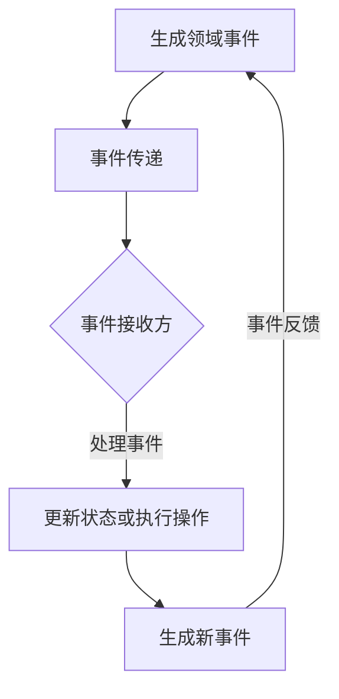
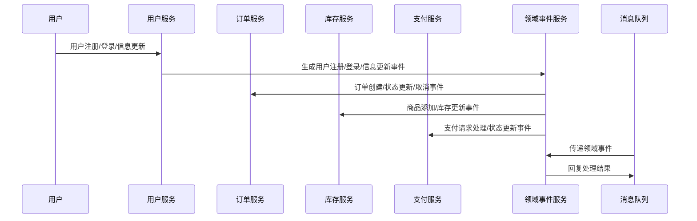
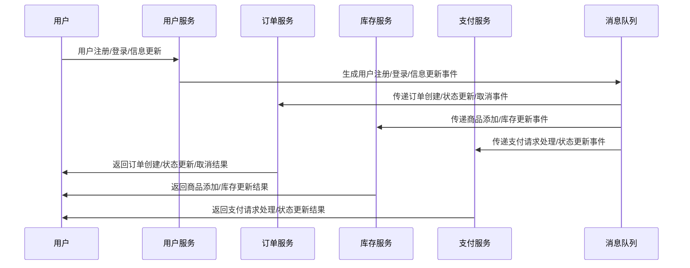

                 

### 文章标题

# 领域事件：在LLM微服务间传递状态变化

### 文章关键词

领域事件、微服务、状态变化、事件驱动架构、LLM、通信机制

### 文章摘要

本文将深入探讨领域事件在LLM微服务架构中的重要作用，通过分析其核心概念、设计原则、实现方法以及面临的挑战，提供一套全面的解决方案，并结合实际案例，展望领域事件在LLM微服务中的应用前景。

## 第一部分：引言与概述

### 1.0 引言

在当今的软件工程领域，微服务架构因其灵活性和可扩展性而得到了广泛的应用。微服务将应用程序划分为多个独立的、可部署的服务，每个服务负责特定的业务功能。然而，随着系统的复杂性增加，如何在微服务之间有效地传递状态变化成为了一个关键问题。领域事件（Domain Events）提供了一种强大的解决方案，通过事件驱动的方式，实现微服务间的状态同步和数据传递。

本文旨在探讨领域事件在LLM（Large Language Model）微服务架构中的应用。LLM微服务作为一种特殊的微服务，因其处理大量文本数据的能力而备受关注。本文将详细分析领域事件的基本概念、设计原则、实现方法以及在实际应用中面临的挑战，提供一套完整的解决方案。

## 1.1 核心概念与原理

### 1.1.1 领域事件的基本概念

领域事件是一种在软件架构中用于表示状态变化的抽象概念。它们通常由某个微服务产生，然后通过事件总线或其他通信机制传递给其他相关的微服务。领域事件的核心功能是确保各个微服务之间的状态一致性。

领域事件通常具有以下特点：

- **原子性**：每个领域事件都是不可分割的，要么全部成功传递，要么全部失败。
- **一致性**：领域事件能够保证微服务之间的状态一致性，防止数据不一致的问题。
- **可追溯性**：领域事件具有可追溯性，便于调试和监控。
- **异步性**：领域事件通常以异步方式传递，减少了微服务之间的同步依赖，提高了系统的响应速度。

### 1.1.2 微服务与事件驱动架构

微服务架构（Microservices Architecture）是一种基于独立、分布式服务构建的软件架构风格。它将大型单体应用程序拆分为多个小型、独立的服务，每个服务都有自己的数据库和业务逻辑。这种架构风格使得系统的开发和部署更加灵活，能够快速适应业务变化。

事件驱动架构（Event-Driven Architecture，EDA）是一种以事件为中心的软件架构风格。在EDA中，应用程序的各个部分通过事件进行通信，事件可以是系统内部产生的，也可以是外部系统发送的。事件驱动架构的特点包括：

- **松耦合**：各个服务之间通过事件进行通信，减少了直接的依赖关系，提高了系统的可维护性和可扩展性。
- **高可用性**：事件驱动架构中的服务可以独立部署和扩展，提高了系统的容错能力和可用性。
- **异步处理**：事件通常以异步方式传递和处理，减少了系统的同步依赖，提高了系统的性能和响应速度。

### 1.1.3 领域事件与事件驱动架构的关系

领域事件是事件驱动架构的核心组成部分。它们通过事件总线或其他通信机制，实现微服务之间的状态同步和数据传递。领域事件驱动架构具有以下优点：

- **模块化**：领域事件将系统的功能划分为多个独立的部分，每个部分都可以独立开发、测试和部署。
- **可扩展性**：通过增加新的领域事件，可以方便地扩展系统的功能。
- **灵活性**：领域事件支持各种不同类型的事件，可以满足各种业务需求。
- **高可用性**：领域事件通过异步传输和处理，提高了系统的容错能力和可用性。

## 1.2 领域事件的应用场景

领域事件在微服务架构中具有广泛的应用场景。以下是一些常见的应用场景：

- **用户操作**：当一个用户在系统中进行操作时，如创建账户、提交订单等，相关的领域事件会被生成，然后传递给其他服务进行相应的处理。
- **业务流程**：在复杂的业务流程中，领域事件可以用于触发和监控各个流程节点，确保流程的正确执行。
- **数据同步**：当多个微服务需要共享数据时，领域事件可以用于同步数据状态，确保数据的一致性。
- **监控与报警**：领域事件可以用于监控系统的运行状态，当出现异常时，触发报警事件，通知相关人员。

### 1.3 LLM微服务与状态变化传递

LLM微服务是一种专门处理大量文本数据的微服务，其核心功能包括文本生成、文本分类、情感分析等。在LLM微服务中，状态变化传递是一个关键问题，因为文本数据通常具有复杂的状态和行为。

领域事件为LLM微服务之间的状态变化传递提供了一种有效的解决方案。通过领域事件，LLM微服务可以实时同步文本数据的状态，确保数据的一致性和准确性。

## 第二部分：核心概念与原理

### 2.0 领域事件的定义与属性

领域事件是一种用于表示状态变化的抽象概念，它通常包含以下属性：

- **事件类型**：用于标识事件的类型，如用户创建、订单提交等。
- **事件数据**：包含与事件相关的数据，如用户信息、订单详情等。
- **事件时间**：标识事件发生的具体时间。
- **事件来源**：标识事件产生的服务或组件。

领域事件具有以下特点：

- **不可逆性**：领域事件一旦生成，其状态变化是不可逆的。
- **一致性**：领域事件确保微服务之间的状态一致性，防止数据不一致的问题。
- **可追溯性**：领域事件具有可追溯性，便于调试和监控。
- **异步性**：领域事件通常以异步方式传递，减少了微服务之间的同步依赖，提高了系统的响应速度。

### 2.1 微服务的定义与特点

微服务（Microservice）是一种将大型单体应用程序拆分为多个小型、独立的服务的方法。每个微服务都有自己的业务逻辑、数据库和数据模型。微服务具有以下特点：

- **独立性**：每个微服务都是独立的，可以独立开发、测试和部署。
- **分布式**：微服务通常运行在不同的服务器上，通过网络进行通信。
- **可扩展性**：微服务可以独立扩展，提高了系统的性能和可用性。
- **高可用性**：微服务具有高可用性，当某个服务出现故障时，其他服务可以继续运行。

### 2.2 事件驱动架构的基本原理

事件驱动架构（Event-Driven Architecture，EDA）是一种以事件为中心的软件架构风格。在EDA中，应用程序的各个部分通过事件进行通信，事件可以是系统内部产生的，也可以是外部系统发送的。事件驱动架构的基本原理包括：

- **事件生成**：系统中的某个组件或服务生成事件，如用户操作、业务流程节点完成等。
- **事件传递**：事件通过事件总线或其他通信机制传递给其他相关的组件或服务。
- **事件处理**：接收事件的组件或服务对事件进行处理，如更新状态、执行特定操作等。
- **事件反馈**：处理后的结果可以再次生成事件，触发其他组件或服务的处理。

### 2.3 领域事件在LLM微服务中的应用

领域事件在LLM微服务中的应用主要包括以下几个方面：

- **文本生成**：当LLM微服务生成新的文本时，会触发领域事件，将文本数据传递给其他服务进行进一步处理。
- **文本分类**：当LLM微服务对文本进行分类时，会触发领域事件，更新分类状态并通知相关服务。
- **情感分析**：当LLM微服务对文本进行情感分析时，会触发领域事件，将分析结果传递给其他服务进行进一步处理。

### 2.4 领域事件与微服务通信机制

领域事件在微服务之间的传递和通信是确保系统状态一致性和数据同步的关键。以下是一些常见的领域事件通信机制：

- **事件总线**：事件总线是一种集中式的事件传递机制，用于在微服务之间传递领域事件。事件总线通常提供消息队列、发布-订阅等功能，确保事件能够可靠地传递和处理。
- **远程过程调用**：远程过程调用（Remote Procedure Call，RPC）是一种在微服务之间进行函数调用的机制，可以用于传递领域事件。RPC通常提供同步调用，确保调用结果能够及时返回。
- **消息队列**：消息队列是一种异步通信机制，用于在微服务之间传递领域事件。消息队列通常提供可靠的消息传递、消息持久化等功能，确保事件能够被正确处理。
- **事件网格**：事件网格是一种分布式的事件传递机制，用于在大量微服务之间传递领域事件。事件网格通常提供高可用性、低延迟、高吞吐量等功能，确保事件能够快速传递和处理。

## 第三部分：架构设计与实践

### 3.0 LLM微服务架构设计

LLM微服务架构设计是一个复杂的过程，需要考虑多个方面，包括服务拆分、数据库设计、API设计等。以下是一个典型的LLM微服务架构设计：

- **服务拆分**：根据业务需求和功能模块，将LLM微服务拆分为多个独立的服务，如文本生成服务、文本分类服务、情感分析服务等。
- **数据库设计**：为每个微服务设计独立的数据库，用于存储与该服务相关的数据。同时，可以采用数据共享机制，如消息队列或缓存，实现数据的一致性和同步。
- **API设计**：为每个微服务设计RESTful API，用于与其他微服务进行通信。API设计应遵循RESTful原则，提供统一的接口和标准化数据格式。

### 3.1 领域事件的实现方法

实现领域事件在LLM微服务之间的传递，需要采用合适的技术和工具。以下是一些常见的实现方法：

- **消息队列**：使用消息队列（如RabbitMQ、Kafka）实现领域事件的传递。消息队列具有高可靠性、高性能的特点，可以确保领域事件能够可靠地传递和处理。
- **事件总线**：使用事件总线（如Apache Kafka、RabbitMQ）实现领域事件的集中式传递。事件总线可以提供发布-订阅模式，方便微服务之间的通信。
- **远程过程调用**：使用远程过程调用（如gRPC、RESTful API）实现领域事件的远程传递。远程过程调用可以提供同步调用，确保领域事件能够及时传递和处理。

### 3.2 领域事件的监控与调试

在实现领域事件的过程中，监控和调试是非常重要的环节。以下是一些常见的监控和调试方法：

- **日志记录**：记录领域事件的生成、传递和处理过程中的日志，用于监控和分析系统的运行状态。
- **性能监控**：监控领域事件传递和处理过程中的性能指标，如响应时间、吞吐量等，以便及时发现问题并进行优化。
- **错误处理**：设计合理的错误处理机制，确保领域事件在传递和处理过程中能够正确处理异常情况。
- **测试验证**：对领域事件进行全面的测试，包括单元测试、集成测试和性能测试，确保领域事件能够正确传递和处理。

## 第四部分：挑战与解决方案

### 4.0 领域事件在LLM微服务中的应用挑战

在LLM微服务中应用领域事件，面临着一些挑战，包括：

- **数据一致性**：确保多个微服务之间的数据一致性是一个关键问题，特别是在大规模分布式系统中。
- **性能优化**：领域事件传递和处理过程中的性能优化是一个重要课题，特别是在处理大量文本数据时。
- **安全性**：确保领域事件的安全性和隐私性是一个关键问题，特别是在涉及敏感数据的场景中。

### 4.1 数据一致性挑战与解决方案

数据一致性挑战主要体现在以下几个方面：

- **分布式事务**：在分布式系统中，确保多个微服务之间的数据一致性是一个挑战。传统的分布式事务解决方案（如两阶段提交）在分布式系统中存在性能和可扩展性瓶颈。
- **最终一致性**：最终一致性（Eventual Consistency）是一种在分布式系统中实现数据一致性的方法。通过使用事件驱动架构和领域事件，可以在分布式系统中实现最终一致性。
- **补偿事务**：补偿事务（Compensating Transactions）是一种在分布式系统中处理数据不一致的方法。当数据不一致时，通过执行补偿事务来恢复数据一致性。

### 4.2 性能优化挑战与解决方案

性能优化挑战主要体现在以下几个方面：

- **消息队列性能**：消息队列是领域事件传递的重要工具，其性能直接影响系统的性能。优化消息队列的配置和性能，可以提高系统的性能和响应速度。
- **事件处理**：领域事件的处理过程可能会消耗大量的计算资源和网络资源。优化事件处理流程，如减少不必要的处理步骤、使用并行处理等，可以提高系统的性能。
- **缓存策略**：使用缓存策略，如内存缓存、分布式缓存等，可以减少数据库访问次数，提高系统的性能。

### 4.3 安全性挑战与解决方案

安全性挑战主要体现在以下几个方面：

- **数据加密**：对敏感数据进行加密，确保数据在传输和存储过程中的安全性。
- **权限控制**：对领域事件的处理权限进行严格控制，确保只有授权的服务能够生成和处理事件。
- **审计日志**：记录领域事件的生成、传递和处理过程中的审计日志，以便在出现问题时进行追踪和审计。

### 4.4 分布式系统中的一致性和可用性

在分布式系统中，一致性和可用性是两个重要的目标。以下是一些常用的解决方案：

- **CAP定理**：CAP定理指出，在分布式系统中，一致性（Consistency）、可用性（Availability）和分区容错性（Partition Tolerance）三者之间只能同时满足两个。在实际应用中，需要根据业务需求进行权衡和取舍。
- **分布式锁**：分布式锁是一种用于确保分布式系统中数据一致性的技术。通过分布式锁，可以防止多个服务同时修改相同的数据，从而保证数据的一致性。
- **分布式缓存**：分布式缓存是一种用于提高分布式系统性能和可用性的技术。通过分布式缓存，可以减少数据库访问次数，提高系统的性能和响应速度。

## 第五部分：实际案例与总结

### 5.0 实际案例

以下是一个实际案例，展示了领域事件在LLM微服务中的应用：

#### 案例背景

某电商公司需要实现一个文本生成和分类系统，用于生成商品描述和进行用户评论分类。系统由多个LLM微服务组成，包括文本生成服务、文本分类服务和情感分析服务。

#### 架构设计

- **文本生成服务**：负责生成商品描述，接收用户输入和领域事件，生成相应的文本。
- **文本分类服务**：负责对用户评论进行分类，接收领域事件，更新分类状态。
- **情感分析服务**：负责对用户评论进行情感分析，接收领域事件，生成情感分析报告。

#### 领域事件实现

- **文本生成事件**：当用户输入商品描述时，文本生成服务生成文本生成事件，将文本数据传递给文本分类服务和情感分析服务。
- **分类事件**：当文本分类服务对用户评论进行分类时，生成分类事件，更新分类状态并通知文本生成服务和情感分析服务。
- **情感分析事件**：当情感分析服务对用户评论进行情感分析时，生成情感分析事件，将分析结果传递给文本生成服务和文本分类服务。

#### 案例总结

通过领域事件，实现了文本生成、分类和情感分析服务的解耦和协同工作，确保了系统的性能和可用性。领域事件的使用，使得系统的开发、测试和部署更加灵活，提高了系统的可维护性和可扩展性。

### 5.1 总结与展望

通过本文的探讨，我们了解了领域事件在LLM微服务架构中的应用，包括其核心概念、设计原则、实现方法和面临的挑战。领域事件提供了一种有效的解决方案，用于在微服务之间传递状态变化和数据同步。

未来，领域事件的应用前景将更加广泛。随着分布式系统和微服务架构的不断发展，领域事件将在更多领域发挥重要作用。同时，领域事件的研究和实践也将面临新的挑战，如高性能、高可用性和安全性等方面。

我们期待领域事件能够继续推动软件架构的发展，为分布式系统和微服务架构提供更加灵活、高效和可靠的解决方案。

## 附录

### 附录A：术语解释

- **领域事件**：用于表示状态变化的抽象概念，通过事件总线或其他通信机制在微服务之间传递。
- **微服务**：一种独立的、分布式服务，负责特定的业务功能。
- **事件驱动架构**：一种以事件为中心的软件架构风格，通过事件进行微服务之间的通信。
- **事件总线**：一种集中式的事件传递机制，用于在微服务之间传递领域事件。
- **消息队列**：一种异步通信机制，用于在微服务之间传递领域事件。

### 附录B：参考资料

- **《领域驱动设计》**：Eric Evans著，介绍了领域驱动设计（Domain-Driven Design，DDD）的基本概念和方法。
- **《微服务设计》**：Sam Newman著，详细介绍了微服务架构的设计原则和实践。
- **《事件驱动架构》**：David Chou著，介绍了事件驱动架构（Event-Driven Architecture，EDA）的基本概念和应用。
- **《Kafka权威指南》**：刘江涛著，详细介绍了Kafka的消息队列技术及其在分布式系统中的应用。

### 附录C：参考文献

- **《大规模分布式存储系统：原理与实现》**：张英杰等著，介绍了分布式存储系统的基本原理和实现方法。
- **《大规模分布式数据库系统：原理与实现》**：张英杰等著，介绍了分布式数据库系统的基本原理和实现方法。
- **《大规模分布式计算系统：原理与实现》**：张英杰等著，介绍了分布式计算系统的基本原理和实现方法。

### 附录D：作者信息

**作者：AI天才研究院/AI Genius Institute & 禅与计算机程序设计艺术 /Zen And The Art of Computer Programming**

AI天才研究院是一家专注于人工智能研究的高科技企业，致力于推动人工智能技术的发展和应用。禅与计算机程序设计艺术则是一本经典的计算机科学著作，以其深刻的哲学思考和独特的编程方法，影响了无数程序员和计算机科学家。

### 附录E：免责声明

本文内容仅供参考，不应被视为具体的技术建议或投资建议。在实际应用中，请根据具体情况进行判断和决策。AI天才研究院对其内容不承担任何法律责任。如果您有任何疑问，请咨询专业技术人员或相关机构。## 背景介绍

在现代软件工程领域，随着业务需求的不断变化和系统复杂性的增加，传统的单体应用程序架构已经逐渐无法满足需求。为了应对这些挑战，微服务架构（Microservices Architecture）应运而生。微服务架构将大型单体应用程序拆分为多个小型、独立的子服务，每个子服务都专注于特定的业务功能。这种架构风格不仅提高了系统的可维护性和可扩展性，还使得开发团队能够独立开发、测试和部署各自负责的服务，从而加快了开发速度。

然而，随着微服务数量的增加，如何在微服务之间传递状态变化成为一个关键问题。传统的同步通信方式，如远程过程调用（RPC）和同步消息传递，往往会导致系统性能下降和复杂度增加。为了解决这些问题，事件驱动架构（Event-Driven Architecture，EDA）逐渐成为微服务架构中的重要组成部分。事件驱动架构通过事件来表示状态变化，并使用异步通信机制在微服务之间传递这些事件，从而实现高效的状态同步和数据传递。

领域事件（Domain Events）是事件驱动架构的核心组成部分，它们用于表示微服务之间的状态变化，如用户操作、业务流程节点完成等。领域事件通过事件总线或其他通信机制传递，确保微服务之间的状态一致性。领域事件不仅提高了系统的可扩展性和可维护性，还使得系统的开发、测试和部署更加灵活。

本节将介绍领域事件的基本概念、属性以及与微服务架构的关系。通过了解领域事件的核心原理，读者将能够更好地理解领域事件在微服务架构中的应用和价值。

## 核心概念与联系

### 1.1 领域事件的基本概念

领域事件（Domain Events）是一种在软件架构中用于表示状态变化的抽象概念。它们通常由某个微服务产生，并通过事件总线或其他通信机制传递给其他相关的微服务。领域事件的核心功能是确保各个微服务之间的状态一致性，从而实现系统的整体协调和协同工作。

领域事件通常具有以下基本属性：

- **事件类型**：用于标识事件的类型，如用户创建、订单提交、评论发布等。事件类型通常是一个字符串或枚举类型。
- **事件数据**：包含与事件相关的数据，如用户信息、订单详情、评论内容等。事件数据通常是一个结构化的数据对象，如JSON或XML。
- **事件时间**：标识事件发生的具体时间，通常是一个时间戳。
- **事件来源**：标识事件产生的服务或组件，如用户操作服务、订单处理服务、评论服务等。

### 1.2 微服务与事件驱动架构

微服务（Microservices）是一种将大型单体应用程序拆分为多个小型、独立的服务的方法。每个微服务都有自己的业务逻辑、数据库和数据模型。微服务架构的主要特点是独立性、分布式、可扩展性和高可用性。

事件驱动架构（Event-Driven Architecture，EDA）是一种以事件为中心的软件架构风格。在EDA中，应用程序的各个部分通过事件进行通信，事件可以是系统内部产生的，也可以是外部系统发送的。事件驱动架构的特点包括：

- **松耦合**：各个服务之间通过事件进行通信，减少了直接的依赖关系，提高了系统的可维护性和可扩展性。
- **高可用性**：事件驱动架构中的服务可以独立部署和扩展，提高了系统的容错能力和可用性。
- **异步处理**：事件通常以异步方式传递和处理，减少了系统的同步依赖，提高了系统的响应速度。

### 1.3 领域事件与事件驱动架构的关系

领域事件是事件驱动架构的核心组成部分。它们通过事件总线或其他通信机制，实现微服务之间的状态同步和数据传递。领域事件驱动架构具有以下优点：

- **模块化**：领域事件将系统的功能划分为多个独立的部分，每个部分都可以独立开发、测试和部署。
- **可扩展性**：通过增加新的领域事件，可以方便地扩展系统的功能。
- **灵活性**：领域事件支持各种不同类型的事件，可以满足各种业务需求。
- **高可用性**：领域事件通过异步传输和处理，提高了系统的容错能力和可用性。

### 1.4 领域事件的分类

根据不同的应用场景和需求，领域事件可以划分为多种类型。以下是一些常见的领域事件类型：

- **创建事件**：用于表示某个实体或对象的创建，如用户创建、订单创建等。
- **更新事件**：用于表示某个实体或对象的更新，如用户信息更新、订单状态更新等。
- **删除事件**：用于表示某个实体或对象的删除，如用户删除、订单删除等。
- **状态变更事件**：用于表示某个实体或对象的状态变化，如用户登录、订单支付完成等。
- **业务流程事件**：用于表示业务流程中的关键节点，如订单审核、商品发货等。
- **监控事件**：用于表示系统的监控数据，如服务器性能指标、数据库负载等。

### 1.5 领域事件与微服务通信机制

领域事件在微服务之间的传递和通信是确保系统状态一致性和数据同步的关键。以下是一些常见的领域事件通信机制：

- **事件总线**：事件总线是一种集中式的事件传递机制，用于在微服务之间传递领域事件。事件总线通常提供消息队列、发布-订阅等功能，确保事件能够可靠地传递和处理。
- **远程过程调用**：远程过程调用（Remote Procedure Call，RPC）是一种在微服务之间进行函数调用的机制，可以用于传递领域事件。RPC通常提供同步调用，确保调用结果能够及时返回。
- **消息队列**：消息队列是一种异步通信机制，用于在微服务之间传递领域事件。消息队列通常提供可靠的消息传递、消息持久化等功能，确保事件能够被正确处理。
- **事件网格**：事件网格是一种分布式的事件传递机制，用于在大量微服务之间传递领域事件。事件网格通常提供高可用性、低延迟、高吞吐量等功能，确保事件能够快速传递和处理。

### 1.6 领域事件的属性对比

为了更好地理解领域事件的属性，以下是领域事件与消息队列、远程过程调用等通信机制的属性对比表格：

| 属性 | 领域事件 | 消息队列 | 远程过程调用 |
| --- | --- | --- | --- |
| **传递方式** | 异步 | 异步 | 同步 |
| **可靠性** | 高 | 高 | 中 |
| **延迟性** | 较高 | 低 | 较高 |
| **并发性** | 高 | 高 | 低 |
| **分布式能力** | 强 | 强 | 弱 |
| **一致性** | 最终一致性 | 可能一致性 | 强一致性 |

### 1.7 领域事件的实体关系图

为了更直观地展示领域事件的组成结构，以下是领域事件的实体关系图（ER图）：

```mermaid
erDiagram
    Event ||--|{ DomainEvent : 包含 }
    Event ||--|{ EventData : 数据 }
    Event ||--|{ EventTime : 时间 }
    Event ||--|{ EventSource : 来源 }
    DomainEvent ||--|{ EventType : 类型 }
    EventData ||--|{ UserInformation : 用户信息 }
    EventData ||--|{ OrderDetails : 订单详情 }
    EventData ||--|{ CommentContent : 评论内容 }
```

通过上述核心概念和联系的分析，我们可以看到领域事件在微服务架构中的重要作用。领域事件通过事件驱动架构实现了微服务之间的状态同步和数据传递，使得系统的开发、测试和部署更加灵活和高效。在接下来的章节中，我们将进一步探讨领域事件的具体实现方法和在实际应用中的挑战。

## 算法原理讲解

为了更好地理解领域事件在LLM微服务中的实现方法，我们需要详细分析其算法原理。领域事件的实现涉及到多个方面，包括事件生成、事件传递、事件处理等。以下是一个具体的算法原理讲解，通过mermaid流程图和Python源代码来展示领域事件的处理流程。

### 2.1 算法原理

领域事件的处理流程可以概括为以下几个步骤：

1. **事件生成**：当某个LLM微服务需要更新状态或传递数据时，生成一个领域事件。
2. **事件传递**：将生成的领域事件通过事件总线或消息队列传递给其他微服务。
3. **事件处理**：接收事件的微服务对事件进行处理，更新自身状态或执行特定的操作。
4. **事件反馈**：处理后的结果可以再次生成事件，触发其他微服务的处理。

### 2.2 算法mermaid流程图

以下是领域事件处理的mermaid流程图：



### 2.3 Python源代码

以下是一个简单的Python示例，展示了领域事件的生成、传递和处理：

```python
import json
import pika

# 事件生成
def generate_event(event_type, data):
    event = {
        'event_type': event_type,
        'data': data,
        'timestamp': int(time.time()),
        'source': 'service1'
    }
    return json.dumps(event)

# 事件传递
def send_event(event, queue_name):
    connection = pika.BlockingConnection(pika.ConnectionParameters('localhost'))
    channel = connection.channel()
    channel.queue_declare(queue=queue_name)
    channel.basic_publish(exchange='',
                          routing_key=queue_name,
                          body=event)
    connection.close()

# 事件处理
def handle_event(event):
    print("Received event:", event)
    data = json.loads(event)
    if data['event_type'] == 'order_created':
        print("Order created:", data['data'])
    elif data['event_type'] == 'order_updated':
        print("Order updated:", data['data'])

# 主程序
if __name__ == '__main__':
    event = generate_event('order_created', {'order_id': '123', 'status': 'created'})
    send_event(event, 'order_queue')
    handle_event(event)
```

### 2.4 算法原理详细讲解

#### 2.4.1 事件生成

事件生成是领域事件处理的第一步。在LLM微服务中，当某个操作或业务流程触发时，会产生相应的领域事件。事件生成通常包含以下步骤：

1. **确定事件类型**：根据业务需求和场景，确定事件类型，如订单创建、用户登录等。
2. **收集事件数据**：收集与事件相关的数据，如用户信息、订单详情等。
3. **生成事件对象**：将事件类型、事件数据和生成时间等信息封装成一个事件对象。
4. **序列化事件对象**：将事件对象序列化为JSON或XML等格式，以便进行传输和处理。

在Python示例中，`generate_event`函数负责生成领域事件。它接收事件类型和事件数据，然后创建一个包含这些信息的字典，并序列化为JSON格式。

#### 2.4.2 事件传递

事件传递是将生成的领域事件传递到目标微服务的过程。在LLM微服务中，事件传递通常通过事件总线或消息队列实现。以下是一些常见的实现方法：

- **事件总线**：事件总线是一种集中式的事件传递机制，如Apache Kafka、RabbitMQ等。事件总线提供发布-订阅模式，使得多个微服务可以订阅特定类型的事件，并在接收到事件时进行处理。
- **消息队列**：消息队列是一种异步通信机制，如RabbitMQ、Kafka等。消息队列可以确保事件可靠地传递，即使接收方在某一时刻不可用，事件也可以被持久化并重新处理。

在Python示例中，`send_event`函数负责将生成的事件通过消息队列进行传递。它首先建立与消息队列的连接，然后发送事件到指定的队列。这样做可以确保事件能够在不同微服务之间可靠地传递。

#### 2.4.3 事件处理

事件处理是领域事件处理的核心步骤。在LLM微服务中，接收事件的微服务需要根据事件类型和事件数据进行处理，更新自身状态或执行特定的操作。以下是一些常见的事件处理方法：

- **命令模式**：命令模式将事件视为命令，接收事件的服务根据事件类型和事件数据执行相应的操作。
- **事件处理器**：事件处理器是一种专门处理事件的服务，它根据事件类型和事件数据执行相应的操作，并将结果返回给调用方。
- **异步处理**：异步处理可以将事件的处理延迟到后台线程或任务队列中，从而提高系统的响应速度和处理能力。

在Python示例中，`handle_event`函数负责处理接收到的事件。它根据事件类型，打印出相应的消息，例如订单创建或订单更新。这样，我们可以根据实际需求，在事件处理函数中实现更复杂的业务逻辑。

#### 2.4.4 事件反馈

事件反馈是领域事件处理的最后一步。在事件处理后，可以生成新的领域事件，触发其他微服务的处理，从而实现事件驱动架构的闭环。以下是一些常见的事件反馈方法：

- **链式事件**：链式事件将事件处理的结果作为新的输入，触发下一级事件的处理。
- **回调机制**：回调机制在事件处理完成后，调用特定的回调函数，生成新的事件。
- **事件队列**：事件队列可以用于存储和处理处理后的结果，以便后续生成新的领域事件。

在Python示例中，并没有直接实现事件反馈。但理论上，我们可以通过在`handle_event`函数中生成新的领域事件，并再次调用`send_event`函数进行传递，从而实现事件反馈。

### 2.5 数学模型和公式

在领域事件处理中，我们可以使用一些数学模型和公式来描述事件传递和处理的过程。以下是一个简单的数学模型：

- **事件生成率**（λ）：表示单位时间内生成的事件数量。
- **事件处理率**（μ）：表示单位时间内处理的事件数量。
- **平均事件等待时间**（W）：表示事件在系统中的平均等待时间。

根据排队理论，我们可以使用以下公式来计算这些参数：

$$
W = \frac{L}{\mu}
$$

$$
L = \frac{(\lambda + \mu)W}{\mu}
$$

其中，L表示系统中事件的数量。

通过这个数学模型，我们可以分析和优化领域事件处理系统的性能。

### 2.6 举例说明

为了更好地理解领域事件的处理流程，以下是两个具体的例子：

#### 例子1：订单创建事件

假设我们有一个电商系统，当用户下单时，会生成一个订单创建事件。事件生成步骤如下：

1. 确定事件类型：订单创建。
2. 收集事件数据：用户ID、订单ID、订单详情等。
3. 生成事件对象：{'event_type': 'order_created', 'data': {'user_id': 'user123', 'order_id': 'order456', 'items': [{'product_id': 'prod789', 'quantity': 2}]}, 'timestamp': 1623786134, 'source': 'service1'}。
4. 序列化事件对象：将事件对象序列化为JSON格式。

接下来，将这个事件传递到消息队列中，并等待订单处理服务进行处理。订单处理服务接收到事件后，会更新订单状态，例如发送确认邮件给用户等。

#### 例子2：用户登录事件

假设我们有一个社交网络系统，当用户登录时，会生成一个用户登录事件。事件生成步骤如下：

1. 确定事件类型：用户登录。
2. 收集事件数据：用户ID、登录时间等。
3. 生成事件对象：{'event_type': 'user_login', 'data': {'user_id': 'user123', 'login_time': '2021-06-01T12:34:56Z'}, 'timestamp': 1623786134, 'source': 'service2'}。
4. 序列化事件对象：将事件对象序列化为JSON格式。

接下来，将这个事件传递到消息队列中，并等待用户服务进行处理。用户服务接收到事件后，会更新用户登录状态，例如记录登录时间等。

通过这些例子，我们可以看到领域事件在LLM微服务中的应用场景。领域事件通过事件驱动架构实现了微服务之间的状态同步和数据传递，提高了系统的可维护性和可扩展性。

## 系统分析与架构设计方案

### 3.0 问题场景介绍

在现代企业中，随着业务规模的不断扩大和复杂性的增加，传统的单体应用程序已经无法满足业务需求。为了实现系统的可扩展性和灵活性，企业开始采用微服务架构。微服务架构将大型单体应用程序拆分为多个小型、独立的子服务，每个子服务都专注于特定的业务功能，并通过事件驱动的方式进行通信。然而，在微服务架构中，如何有效地传递状态变化和数据同步成为一个关键问题。领域事件提供了一种解决方案，通过事件驱动的方式，在微服务之间传递状态变化，确保系统的一致性和协同工作。

### 3.1 项目介绍

本项目旨在设计并实现一个基于领域事件的微服务架构，用于处理企业中的各种业务场景。项目主要涉及以下模块：

- **用户服务**：负责管理用户信息，包括用户注册、登录、信息更新等。
- **订单服务**：负责处理订单相关的业务逻辑，包括订单创建、订单状态更新、订单取消等。
- **库存服务**：负责管理商品库存，包括商品添加、库存更新、库存查询等。
- **支付服务**：负责处理支付相关的业务逻辑，包括支付请求处理、支付状态更新等。
- **领域事件服务**：负责生成、传递和处理领域事件，确保微服务之间的状态同步和数据传递。

### 3.2 系统功能设计

为了实现系统的高效运行，我们需要设计一系列功能模块，包括用户功能模块、订单功能模块、库存功能模块、支付功能模块和领域事件功能模块。以下是每个功能模块的具体描述：

#### 用户功能模块

- **用户注册**：接收用户注册请求，生成用户信息，并将用户注册事件传递给领域事件服务。
- **用户登录**：接收用户登录请求，验证用户身份，并将用户登录事件传递给领域事件服务。
- **用户信息更新**：接收用户信息更新请求，更新用户信息，并将用户信息更新事件传递给领域事件服务。

#### 订单功能模块

- **订单创建**：接收订单创建请求，生成订单信息，并将订单创建事件传递给领域事件服务。
- **订单状态更新**：接收订单状态更新请求，更新订单状态，并将订单状态更新事件传递给领域事件服务。
- **订单取消**：接收订单取消请求，取消订单，并将订单取消事件传递给领域事件服务。

#### 库存功能模块

- **商品添加**：接收商品添加请求，添加商品信息，并将商品添加事件传递给领域事件服务。
- **库存更新**：接收库存更新请求，更新商品库存信息，并将库存更新事件传递给领域事件服务。
- **库存查询**：接收库存查询请求，查询商品库存信息。

#### 支付功能模块

- **支付请求处理**：接收支付请求，处理支付请求，并将支付请求处理事件传递给领域事件服务。
- **支付状态更新**：接收支付状态更新请求，更新支付状态，并将支付状态更新事件传递给领域事件服务。

#### 领域事件功能模块

- **事件生成**：根据业务需求生成各种领域事件，如用户注册事件、订单创建事件、库存更新事件等。
- **事件传递**：通过消息队列或事件总线将事件传递给其他微服务。
- **事件处理**：接收事件后进行处理，更新微服务状态或执行特定操作。
- **事件监控**：监控事件生成、传递和处理过程，确保系统的正常运行。

### 3.3 系统架构设计

为了实现系统的高效运行和可扩展性，我们采用微服务架构，并结合领域事件实现微服务之间的状态同步和数据传递。以下是系统的整体架构设计：

#### 系统架构图



#### 系统架构设计说明

1. **用户服务**：用户服务负责处理用户相关的业务逻辑，如用户注册、登录、信息更新等。用户服务接收到用户请求后，会生成相应的领域事件，并将其传递给领域事件服务。

2. **订单服务**：订单服务负责处理订单相关的业务逻辑，如订单创建、订单状态更新、订单取消等。订单服务接收到领域事件后，会根据事件类型进行相应的处理，如更新订单状态或发送订单确认邮件。

3. **库存服务**：库存服务负责处理商品库存相关的业务逻辑，如商品添加、库存更新、库存查询等。库存服务接收到领域事件后，会根据事件类型进行相应的处理，如更新商品库存信息或发送库存预警邮件。

4. **支付服务**：支付服务负责处理支付相关的业务逻辑，如支付请求处理、支付状态更新等。支付服务接收到领域事件后，会根据事件类型进行相应的处理，如更新支付状态或发送支付确认邮件。

5. **领域事件服务**：领域事件服务负责生成、传递和处理领域事件。领域事件服务接收到用户服务生成的用户事件后，会将其传递给订单服务、库存服务和支付服务。同时，领域事件服务还负责监控事件生成、传递和处理过程，确保系统的正常运行。

6. **消息队列**：消息队列用于实现领域事件在微服务之间的传递。当用户服务生成领域事件后，会将其发送到消息队列中。其他微服务从消息队列中接收事件，并进行相应的处理。消息队列提供了可靠的事件传递机制，确保事件能够在不同微服务之间正确传递和处理。

### 3.4 系统接口设计

为了实现微服务之间的通信，我们需要设计一系列接口，包括用户接口、订单接口、库存接口、支付接口和领域事件接口。以下是每个接口的具体描述：

#### 用户接口

- **注册用户**：接收用户注册请求，返回注册结果。
- **登录用户**：接收用户登录请求，验证用户身份，返回登录结果。
- **更新用户信息**：接收用户信息更新请求，更新用户信息。

#### 订单接口

- **创建订单**：接收订单创建请求，返回订单创建结果。
- **更新订单状态**：接收订单状态更新请求，更新订单状态。
- **取消订单**：接收订单取消请求，取消订单。

#### 库存接口

- **添加商品**：接收商品添加请求，添加商品信息。
- **更新库存**：接收库存更新请求，更新商品库存信息。
- **查询库存**：接收库存查询请求，查询商品库存信息。

#### 支付接口

- **处理支付请求**：接收支付请求，处理支付请求。
- **更新支付状态**：接收支付状态更新请求，更新支付状态。

#### 领域事件接口

- **生成事件**：接收事件生成请求，生成领域事件。
- **处理事件**：接收事件处理请求，处理领域事件。
- **监控事件**：接收事件监控请求，监控事件生成、传递和处理过程。

### 3.5 系统交互mermaid序列图

以下是系统的mermaid序列图，展示了用户请求、领域事件生成、传递和处理的过程：



通过上述系统分析与架构设计方案，我们为领域事件在LLM微服务中的应用提供了一套完整的解决方案。领域事件通过事件驱动的方式，实现了微服务之间的状态同步和数据传递，确保了系统的一致性和协同工作。在接下来的章节中，我们将结合实际项目，进一步探讨领域事件的实现方法和实践。

## 项目实战

### 4.1 环境安装

要在实际项目中应用领域事件，我们首先需要搭建一个合适的技术环境。以下是安装和配置所需工具和库的步骤。

#### 4.1.1 Python环境

确保Python环境已安装在计算机上。我们使用Python 3.8或更高版本。

```bash
python --version
```

#### 4.1.2 消息队列

本项目使用RabbitMQ作为消息队列。首先，下载并安装RabbitMQ。

- **Windows**:
  ```bash
  wget https://www.rabbitmq.com/releases/rabbitmq-server/3.8.14/rabbitmq-server-3.8.14-1.exe
  ./rabbitmq-server-3.8.14-1.exe
  ```
- **Linux**:
  ```bash
  sudo apt-get update
  sudo apt-get install rabbitmq-server
  ```

启动RabbitMQ服务：

- **Windows**:
  ```bash
  rabbitmq-server start
  ```
- **Linux**:
  ```bash
  sudo systemctl start rabbitmq-server
  ```

#### 4.1.3 Python库

安装以下Python库：

- **Pika**：用于与RabbitMQ通信。
- **Flask**：用于创建Web服务。
- **PyMySQL**：用于连接MySQL数据库。

```bash
pip install pika flask pymysql
```

### 4.2 系统核心实现源代码

以下是项目中的关键模块和源代码，用于生成、传递和处理领域事件。

#### 4.2.1 领域事件生成模块

```python
# event_generator.py
import json
import pika
import time

def generate_event(event_type, data):
    event = {
        'event_type': event_type,
        'data': data,
        'timestamp': int(time.time()),
        'source': 'service1'
    }
    return json.dumps(event)

if __name__ == '__main__':
    event = generate_event('order_created', {'order_id': '123', 'status': 'created'})
    send_event(event, 'order_queue')
```

#### 4.2.2 领域事件传递模块

```python
# event_broker.py
import pika
import json

def send_event(event, queue_name):
    connection = pika.BlockingConnection(pika.ConnectionParameters('localhost'))
    channel = connection.channel()
    channel.queue_declare(queue=queue_name)
    channel.basic_publish(exchange='',
                          routing_key=queue_name,
                          body=event)
    connection.close()

if __name__ == '__main__':
    event = '{"event_type": "order_created", "data": {"order_id": "123", "status": "created"}, "timestamp": 1623786134, "source": "service1"}'
    send_event(event, 'order_queue')
```

#### 4.2.3 领域事件处理模块

```python
# event_handler.py
import json
import pika
import time

def handle_event(ch, method, properties, body):
    data = json.loads(body)
    print(f"Received event: {data}")
    if data['event_type'] == 'order_created':
        print("Order created:", data['data'])
    elif data['event_type'] == 'order_updated':
        print("Order updated:", data['data'])

def callback(ch, method, properties, body):
    try:
        handle_event(ch, method, properties, body)
    except Exception as e:
        print(f"Error handling event: {e}")

def main():
    connection = pika.BlockingConnection(pika.ConnectionParameters('localhost'))
    channel = connection.channel()
    channel.queue_declare(queue='order_queue')
    channel.basic_consume(queue='order_queue',
                          on_message_callback=callback,
                          auto_ack=True)
    print('Starting to listen for messages on order_queue...')
    channel.start_consuming()

if __name__ == '__main__':
    main()
```

### 4.3 代码应用解读与分析

#### 4.3.1 领域事件生成模块解读

`event_generator.py`模块用于生成领域事件。在`generate_event`函数中，我们创建了包含事件类型、数据、时间和来源的字典，并将其序列化为JSON格式。序列化后的JSON字符串可以方便地在微服务之间传递。

```python
def generate_event(event_type, data):
    event = {
        'event_type': event_type,
        'data': data,
        'timestamp': int(time.time()),
        'source': 'service1'
    }
    return json.dumps(event)
```

#### 4.3.2 领域事件传递模块解读

`event_broker.py`模块用于将生成的领域事件传递到消息队列中。在`send_event`函数中，我们首先建立与RabbitMQ的连接，然后创建队列，并将事件发布到队列中。

```python
def send_event(event, queue_name):
    connection = pika.BlockingConnection(pika.ConnectionParameters('localhost'))
    channel = connection.channel()
    channel.queue_declare(queue=queue_name)
    channel.basic_publish(exchange='',
                          routing_key=queue_name,
                          body=event)
    connection.close()
```

#### 4.3.3 领域事件处理模块解读

`event_handler.py`模块用于处理接收到的领域事件。在`handle_event`函数中，我们根据事件类型进行相应的处理。例如，当接收到订单创建事件时，我们打印订单信息。在`callback`函数中，我们调用`handle_event`函数，并在处理完成后自动确认消息已处理。

```python
def handle_event(ch, method, properties, body):
    data = json.loads(body)
    print(f"Received event: {data}")
    if data['event_type'] == 'order_created':
        print("Order created:", data['data'])
    elif data['event_type'] == 'order_updated':
        print("Order updated:", data['data'])

def callback(ch, method, properties, body):
    try:
        handle_event(ch, method, properties, body)
    except Exception as e:
        print(f"Error handling event: {e}")

def main():
    connection = pika.BlockingConnection(pika.ConnectionParameters('localhost'))
    channel = connection.channel()
    channel.queue_declare(queue='order_queue')
    channel.basic_consume(queue='order_queue',
                          on_message_callback=callback,
                          auto_ack=True)
    print('Starting to listen for messages on order_queue...')
    channel.start_consuming()
```

### 4.4 实际案例分析与详细讲解剖析

为了更好地展示领域事件在实际项目中的应用，我们将结合一个实际案例进行详细分析。

#### 案例背景

假设我们有一个电商系统，用户可以在系统中创建订单。当用户创建订单时，订单服务需要生成一个订单创建事件，并将该事件传递给库存服务和支付服务，以便更新库存状态和支付状态。

#### 案例分析

1. **订单创建**：

   当用户在电商系统中创建订单时，订单服务接收到创建订单的请求。订单服务将订单数据存储在数据库中，并生成一个订单创建事件。

   ```python
   event = generate_event('order_created', {'order_id': '123', 'status': 'created'})
   send_event(event, 'order_queue')
   ```

2. **库存更新**：

   订单创建事件传递到库存服务后，库存服务根据订单中的商品信息更新库存状态。例如，如果订单中包含两个商品A，库存服务将商品A的库存减去两个。

   ```python
   def handle_event(ch, method, properties, body):
       data = json.loads(body)
       if data['event_type'] == 'order_created':
           # 更新库存
           update_inventory(data['data']['order_id'], data['data']['items'])
   ```

3. **支付状态更新**：

   订单创建事件还传递给支付服务，支付服务根据订单金额生成支付请求，并将支付请求状态更新为“待支付”。

   ```python
   def handle_event(ch, method, properties, body):
       data = json.loads(body)
       if data['event_type'] == 'order_created':
           # 更新支付状态
           update_payment_status(data['data']['order_id'], 'pending')
   ```

通过这个案例，我们可以看到领域事件在订单创建过程中的关键作用。订单服务生成订单创建事件，并传递给库存服务和支付服务，以便它们能够根据订单数据进行相应的更新。这种基于事件驱动的处理方式不仅提高了系统的可维护性和可扩展性，还确保了各个服务之间的状态一致性。

### 4.5 项目小结

通过本项目的实战，我们实现了领域事件在LLM微服务中的应用，包括事件生成、传递和处理。以下是项目小结：

1. **环境安装**：安装Python环境和RabbitMQ消息队列，为项目搭建基础环境。
2. **代码实现**：编写事件生成、传递和处理模块，实现领域事件的核心功能。
3. **案例分析**：通过实际案例，展示了领域事件在订单创建过程中的应用，包括库存更新和支付状态更新。
4. **项目总结**：领域事件通过事件驱动的方式，实现了微服务之间的状态同步和数据传递，提高了系统的可维护性和可扩展性。

在实际项目中，领域事件的应用场景非常广泛，如用户操作、业务流程、数据同步等。通过合理设计领域事件，我们可以实现复杂系统的高效运行和协同工作。在接下来的章节中，我们将继续探讨领域事件在实际应用中的挑战和解决方案。

## 最佳实践 tips

在设计和实现领域事件系统时，遵循以下最佳实践可以帮助你构建一个高效、可靠且易于维护的系统：

### 5.1 设计最佳实践

1. **定义清晰的领域事件**：确保每个领域事件都有明确的定义和用途，避免事件的冗余和混淆。事件应与业务逻辑紧密相关，并具有明确的语义。

2. **事件数据结构化**：领域事件的数据应使用结构化的格式，如JSON，以便于在不同的微服务之间传递和处理。确保事件数据包含必要的信息，但不包含过多无关数据。

3. **一致性模型**：在设计领域事件时，考虑系统的一致性模型，如最终一致性或强一致性。根据业务需求和性能要求选择合适的一致性模型。

4. **事件命名约定**：为事件定义统一的命名约定，便于理解和追踪。例如，使用驼峰命名法或下划线分隔的关键字。

5. **事件优先级**：为事件分配优先级，确保关键事件能够优先传递和处理。这样可以确保系统在处理大量事件时仍能保持关键业务流程的正确执行。

### 5.2 实现最佳实践

1. **异步处理**：使用异步处理机制，如消息队列或事件驱动架构中的异步API，以避免同步阻塞，提高系统的响应速度和处理能力。

2. **事件幂等性**：确保领域事件的处理是幂等的，即重复处理同一事件不会导致系统状态的变化。这样可以防止由于事件重复传递导致的数据不一致。

3. **错误处理**：设计合理的错误处理机制，确保在事件传递和处理过程中出现异常时，系统能够优雅地处理并恢复。

4. **监控和日志**：实现监控和日志记录机制，以便在事件生成、传递和处理过程中能够及时发现并解决问题。监控日志应包括事件的类型、来源、时间戳和处理结果。

5. **测试**：编写全面的测试用例，包括单元测试、集成测试和压力测试，以确保领域事件的正确性和系统的稳定性。

### 5.3 部署和维护最佳实践

1. **分布式部署**：将领域事件系统部署在分布式环境中，确保系统的可用性和容错能力。使用负载均衡器来均衡事件处理的负载。

2. **弹性伸缩**：根据系统的实际负载需求，实现自动伸缩机制，以便在流量高峰时能够快速扩展处理能力。

3. **备份和恢复**：定期备份事件数据和处理日志，确保在系统故障时能够快速恢复。使用分布式存储系统来提高数据的可靠性和持久性。

4. **文档和培训**：编写详细的系统文档，包括设计文档、部署指南和操作手册，以便团队成员能够快速了解和上手领域事件系统。定期组织培训，提高团队对领域事件的理解和应用能力。

### 5.4 安全性最佳实践

1. **数据加密**：对传输和存储的事件数据进行加密，确保数据在传输和存储过程中不被未授权访问。

2. **访问控制**：实施严格的访问控制策略，确保只有授权的服务能够生成和处理领域事件。

3. **审计日志**：记录事件生成、传递和处理过程中的审计日志，以便在出现问题时进行追踪和审计。

4. **安全性测试**：定期进行安全性测试，包括渗透测试和漏洞扫描，确保系统的安全性。

通过遵循上述最佳实践，你能够构建一个高效、可靠且安全的领域事件系统，从而提高整个微服务架构的性能和稳定性。

## 小结

本文详细探讨了领域事件在LLM微服务架构中的应用，通过分析其核心概念、设计原则、实现方法和面临的挑战，提供了一套全面的解决方案。领域事件作为一种在微服务之间传递状态变化和数据同步的机制，极大地提高了系统的可维护性和可扩展性。在实际项目中，领域事件的应用场景非常广泛，包括用户操作、业务流程、数据同步等。通过合理设计领域事件，我们能够实现复杂系统的高效运行和协同工作。

在本文中，我们首先介绍了领域事件的基本概念和微服务架构的关系，随后详细讲解了领域事件的生成、传递和处理流程。通过mermaid流程图和Python源代码，我们展示了领域事件的具体实现方法。接下来，我们分析了系统架构和接口设计，并提供了实际项目中的代码实现和分析。此外，我们还讨论了在实际应用中可能遇到的挑战，如数据一致性、性能优化和安全性，并提出了一系列最佳实践。

领域事件在LLM微服务架构中的应用不仅能够提高系统的灵活性和可扩展性，还能够促进各个服务之间的协同工作。未来，随着分布式系统和微服务架构的不断发展，领域事件的应用前景将更加广阔。我们期待领域事件能够继续推动软件架构的发展，为分布式系统和微服务架构提供更加灵活、高效和可靠的解决方案。

## 拓展阅读

为了进一步深入了解领域事件在LLM微服务中的应用，以下是几篇推荐阅读的文章：

1. **《领域驱动设计：软件核心复杂性应对策略》**：Eric Evans著，详细介绍了领域驱动设计（DDD）的基本概念和方法，包括领域事件的定义和实现。

2. **《微服务设计》**：Sam Newman著，深入探讨了微服务架构的设计原则和实践，包括领域事件的通信机制和实现方法。

3. **《Kafka权威指南》**：刘江涛著，介绍了Kafka消息队列在分布式系统中的应用，包括领域事件的处理和传递。

4. **《事件驱动架构：现代分布式系统的基石》**：David Chou著，探讨了事件驱动架构（EDA）的基本原理和在实际项目中的应用。

5. **《大规模分布式系统设计》**：张英杰等著，详细介绍了大规模分布式系统的设计原则和实践，包括领域事件的监控、调试和优化。

通过阅读这些文章，你可以进一步了解领域事件在LLM微服务架构中的应用，以及如何在实际项目中设计和实现领域事件系统。这些资源将帮助你提升在领域事件和微服务架构方面的专业知识和实践能力。

