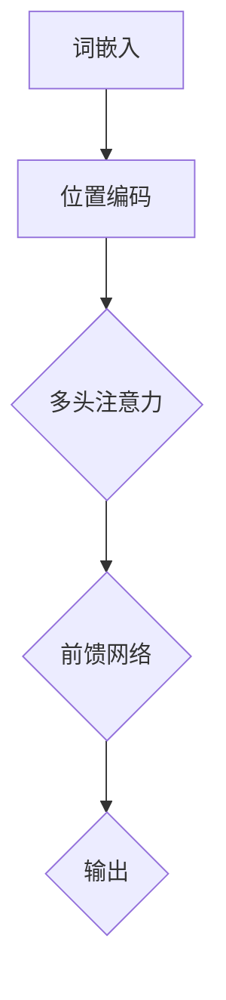
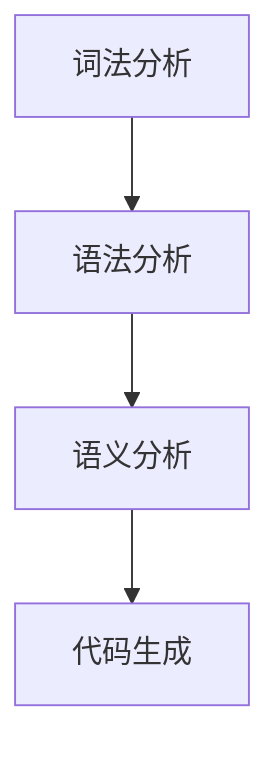
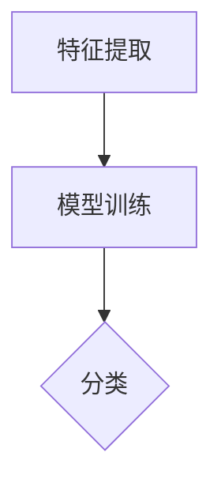
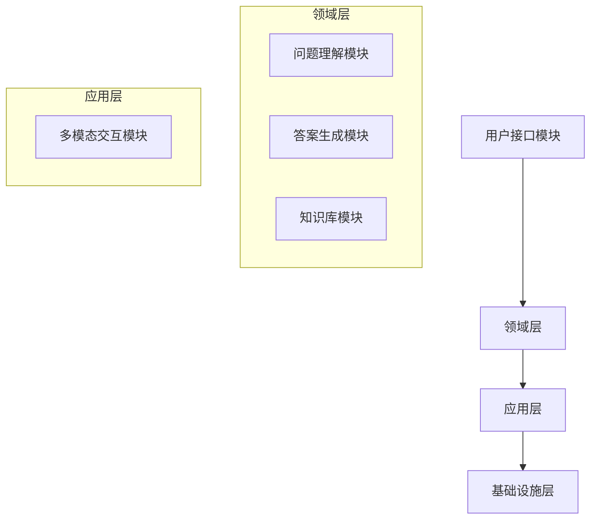
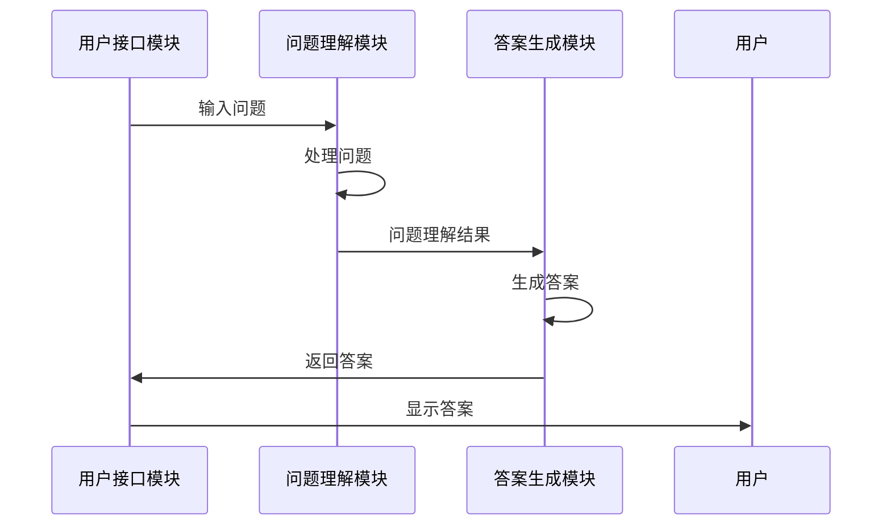

                 


### 1.1.4 领域模型的核心要素
**思考：** 我们应该如何定义领域模型的核心要素？这些要素包括哪些内容？如何确保领域模型能够准确反映实际业务场景？

**答案：** 领域模型的核心要素主要包括：

1. **实体（Entities）**：实体是领域模型中的基本单元，代表具体的业务对象。例如，在电商系统中，商品、用户等都是实体。

2. **值对象（Value Objects）**：值对象是具有明确业务含义的数据集合，但不具有唯一标识。例如，地址、颜色等。

3. **聚合（Aggregates）**：聚合是一组紧密相关的实体和值对象的集合，它们共同构成了业务上的一个整体。聚合有一个根实体，负责聚合内所有实体的生命周期。

4. **聚合根（Aggregate Root）**：聚合根是聚合中的根实体，负责创建和删除聚合内的其他实体。通过聚合根，可以有效地管理整个聚合的生命周期。

5. **领域服务（Domain Services）**：领域服务是一组逻辑上紧密相关的操作，用于处理业务逻辑。领域服务通常与实体和聚合交互，但不属于任何聚合。

**步骤：**

1. **识别业务场景**：首先要理解业务场景，明确业务领域和业务对象。

2. **定义实体和值对象**：根据业务场景，识别出所有的业务对象，并将其划分为实体和值对象。

3. **构建聚合和聚合根**：将识别出的实体和值对象组合成聚合，并确定聚合根。

4. **设计领域服务**：根据业务逻辑，设计出一组领域服务。

5. **确保模型的一致性**：在模型构建过程中，要不断回归业务场景，确保领域模型能够准确地反映实际业务需求。

### 1.1.5 领域事件的定义与处理

**思考：** 在领域驱动设计中，领域事件是什么？它们如何影响领域模型？领域事件的处理方法有哪些？

**答案：** 领域事件是指在业务过程中发生的具有业务意义的事件，如订单创建、支付成功等。领域事件对领域模型有直接影响，它们可以触发领域服务的执行，影响实体的状态变化。

领域事件的处理方法主要包括：

1. **事件发布和订阅**：事件发布者发布领域事件，事件订阅者监听这些事件，并在接收到事件后执行相应的处理逻辑。

2. **事件流管理**：事件流管理负责事件的传递、存储和检索。在复杂系统中，事件流管理非常重要，它可以确保事件处理的顺序和一致性。

3. **事件溯源**：事件溯源是指通过领域事件记录，追踪业务过程的历史。这对于审计和故障排除非常重要。

**步骤：**

1. **识别领域事件**：在业务过程中，识别出所有具有业务意义的事件。

2. **定义事件类型**：根据识别出的领域事件，定义事件类型和事件参数。

3. **设计事件发布和订阅机制**：确定事件发布者和订阅者的角色，并设计相应的接口。

4. **实现事件处理逻辑**：根据业务逻辑，实现事件处理逻辑。

5. **测试事件处理流程**：确保事件发布、订阅和处理流程的正确性和一致性。

### 1.1.6 领域模型的核心原则

**思考：** 领域驱动设计的核心原则是什么？它们如何指导领域模型的构建？

**答案：** 领域驱动设计的核心原则包括：

1. **基于领域模型驱动开发**：领域模型是软件开发的核心，开发过程应该围绕领域模型进行。

2. **关注领域模型的一致性和完整性**：领域模型应该能够完整、一致地表示业务领域。

3. **解耦业务逻辑和实现细节**：通过领域模型，将业务逻辑与实现细节解耦，便于后续的维护和扩展。

4. **减少冗余和依赖**：在领域模型中，避免冗余数据和冗余逻辑，减少组件之间的依赖。

5. **持续演进和重构**：领域模型不是一成不变的，应该随着业务的变化而持续演进和重构。

**步骤：**

1. **理解业务场景**：深入理解业务场景，明确业务需求和业务流程。

2. **构建初步领域模型**：基于业务场景，构建初步的领域模型。

3. **迭代和完善领域模型**：根据实际需求，不断迭代和完善领域模型。

4. **验证领域模型的有效性**：通过实际业务案例，验证领域模型的有效性。

5. **持续重构和维护**：随着业务的发展，持续重构和维护领域模型。

### 1.1.7 领域模型与数据库设计的关系

**思考：** 领域模型和数据库设计之间有哪些关联？如何确保两者的一致性？

**答案：** 领域模型和数据库设计之间存在密切关联。领域模型是业务逻辑的抽象，而数据库设计是实现领域模型的物理存储。两者的一致性对于系统的稳定性和性能至关重要。

确保领域模型与数据库设计一致性，可以采取以下措施：

1. **基于领域模型构建数据库设计**：将领域模型转换为数据库表结构，确保数据库设计能够准确反映领域模型。

2. **使用映射框架**：使用ORM（对象关系映射）框架，将领域模型映射到数据库表，减少手动编写SQL代码的工作量。

3. **数据库迁移工具**：使用数据库迁移工具，确保在领域模型变更时，数据库结构能够同步更新。

4. **数据一致性和完整性校验**：在数据操作过程中，进行数据一致性和完整性校验，确保数据的准确性和可靠性。

5. **定期同步和维护**：定期同步领域模型和数据库设计，确保两者的一致性。

### 1.1.8 领域驱动设计在LLM应用架构中的优势

**思考：** 领域驱动设计在LLM应用架构中具有哪些优势？这些优势如何提升系统的性能和可维护性？

**答案：** 领域驱动设计在LLM应用架构中具有以下优势：

1. **更好地适应业务变化**：领域驱动设计强调业务领域模型的重要性，能够更好地适应业务需求的变化。

2. **减少冗余和依赖**：通过领域模型，将业务逻辑与实现细节解耦，减少了组件之间的冗余和依赖。

3. **提高系统可维护性**：领域模型有助于提高代码的可维护性和可扩展性，降低维护成本。

4. **提升系统性能**：领域驱动设计强调数据一致性和完整性，有助于优化数据库性能。

5. **增强团队协作**：领域驱动设计鼓励团队围绕领域模型进行协作，提高团队沟通效率和项目成功率。

### 1.1.9 实践案例：领域驱动设计在LLM应用架构中的应用

**思考：** 如何在实际项目中应用领域驱动设计，以提升LLM应用架构的效率和质量？

**答案：** 实际项目中，可以按照以下步骤应用领域驱动设计：

1. **需求分析**：深入分析业务需求，明确业务场景和目标。

2. **构建领域模型**：根据业务需求，构建初步的领域模型。

3. **迭代和完善领域模型**：通过迭代，不断完善领域模型，确保其能够准确反映业务需求。

4. **领域服务设计**：根据领域模型，设计出一组领域服务。

5. **实现领域服务**：实现领域服务的具体逻辑，确保其符合业务需求。

6. **数据库设计**：基于领域模型，设计数据库表结构，确保其与领域模型一致。

7. **系统集成与测试**：将领域模型、领域服务、数据库等集成到系统中，进行全面的测试和验证。

8. **持续改进**：根据实际反馈，持续改进领域模型和服务设计。

通过上述步骤，可以在实际项目中有效地应用领域驱动设计，提升LLM应用架构的效率和质量。

### 总结

在本章中，我们介绍了领域驱动设计（DDD）的基本概念、核心要素、领域事件的定义与处理、领域模型的核心原则以及领域模型与数据库设计的关系。通过这些核心概念的讲解，读者可以初步理解领域驱动设计的概念，并认识到其在LLM应用架构中的重要性和优势。接下来，我们将进一步探讨领域驱动设计在LLM应用架构中的应用，以及如何通过实践案例来实现这一设计理念。

## 第2章: LLM应用架构简介

### 2.1.1 LLM的定义与特点

**背景介绍：** 自然语言处理（NLP）是人工智能（AI）领域的一个重要分支，旨在使计算机能够理解、生成和交互自然语言。大语言模型（Large Language Model，简称LLM）是NLP领域的一种重要技术，通过深度学习和神经网络模型，LLM能够处理和理解复杂的自然语言数据。

**问题背景：** 随着互联网和大数据技术的发展，自然语言处理的需求日益增长。LLM的出现，为解决自然语言处理中的许多难题提供了可能，如机器翻译、文本生成、问答系统等。因此，了解LLM的定义和特点，对于研究和应用LLM具有重要意义。

**问题描述：** LLM是一种基于大规模数据训练的深度神经网络模型，其目的是通过学习大量文本数据，生成与输入文本相关的输出文本。LLM的特点包括：

1. **大规模训练数据**：LLM的训练数据通常达到数百万甚至数十亿级别的文本数据，这使得模型能够处理复杂的语言现象。
2. **深度神经网络结构**：LLM采用深度神经网络结构，能够有效提取文本数据中的特征，提高模型的表达能力。
3. **强大的生成能力**：LLM具有较强的文本生成能力，能够根据输入文本生成连贯、有意义的输出文本。

**问题解决：** 通过了解LLM的定义和特点，我们可以更好地理解其在自然语言处理中的应用，并为其研究和应用提供指导。

**边界与外延：** LLM不仅应用于自然语言处理领域，还广泛应用于其他领域，如智能客服、智能写作、智能推荐等。其边界在于模型的大小和训练数据量，而外延则涵盖了所有能够利用大规模数据训练和生成文本的深度神经网络模型。

### 2.1.2 LLM的体系结构

**核心概念：** LLM的体系结构主要包括以下几个方面：

1. **输入层**：输入层负责接收输入文本，并将其转换为模型能够处理的数据格式。通常，输入文本会被转换为词向量表示。
2. **隐藏层**：隐藏层是神经网络的核心部分，负责对输入文本进行特征提取和模式识别。深度神经网络中的隐藏层数量和神经元数量决定了模型的表达能力。
3. **输出层**：输出层负责生成与输入文本相关的输出文本。在生成文本的过程中，输出层通常采用softmax函数进行概率分布计算。

**概念属性特征对比表格：**

| 层次 | 功能 | 数据格式 | 参数量 |  
| ---- | ---- | ---- | ---- |  
| 输入层 | 接收输入文本 | 词向量 | 输入文本长度 × 词向量维度 |  
| 隐藏层 | 特征提取和模式识别 | 词向量 → 神经元激活值 | 隐藏层神经元数量 × 输入神经元数量 |  
| 输出层 | 生成输出文本 | 神经元激活值 → 词向量概率分布 | 输出神经元数量 × 隐藏层神经元数量 |

**ER实体关系图架构：**

```mermaid
erDiagram
  输入层 ||--|{ 隐藏层 }|
  隐藏层 ||--|{ 输出层 }|
```

### 2.1.3 LLM在AI应用中的优势

**核心概念：** LLM在AI应用中的优势主要体现在以下几个方面：

1. **强大的文本生成能力**：LLM能够根据输入文本生成连贯、有意义的输出文本，适用于文本生成任务。
2. **广泛的适用性**：LLM不仅适用于自然语言处理，还广泛应用于图像生成、语音合成等其他AI领域。
3. **高效的学习能力**：LLM通过大规模数据训练，具备高效的学习能力，能够在短时间内适应不同的应用场景。

**概念属性特征对比表格：**

| 优势 | 描述 |  
| ---- | ---- |  
| 强大的文本生成能力 | LLM能够生成连贯、有意义的文本，适用于文本生成任务。 |  
| 广泛的适用性 | LLM不仅适用于自然语言处理，还广泛应用于图像生成、语音合成等其他AI领域。 |  
| 高效的学习能力 | LLM通过大规模数据训练，具备高效的学习能力，能够在短时间内适应不同的应用场景。 |

**ER实体关系图架构：**

```mermaid
erDiagram
  文本生成能力 ||--|{ 广泛适用性 }|
  广泛适用性 ||--|{ 高效学习能力 }|
```

### 2.1.4 LLM在自然语言处理中的应用

**核心概念：** LLM在自然语言处理中的应用包括以下几个方面：

1. **文本生成**：LLM能够根据输入文本生成连贯、有意义的输出文本，适用于文本生成任务，如文章写作、对话生成等。
2. **文本分类**：LLM通过对输入文本进行特征提取，能够实现对文本的自动分类，适用于新闻分类、情感分析等任务。
3. **命名实体识别**：LLM能够识别文本中的命名实体，如人名、地名等，适用于信息抽取任务。

**概念属性特征对比表格：**

| 应用领域 | 描述 |  
| ---- | ---- |  
| 文本生成 | LLM能够生成连贯、有意义的文本，适用于文本生成任务，如文章写作、对话生成等。 |  
| 文本分类 | LLM通过对输入文本进行特征提取，能够实现对文本的自动分类，适用于新闻分类、情感分析等任务。 |  
| 命名实体识别 | LLM能够识别文本中的命名实体，如人名、地名等，适用于信息抽取任务。 |

**ER实体关系图架构：**

```mermaid
erDiagram
  文本生成 ||--|{ 文本分类 }|
  文本分类 ||--|{ 命名实体识别 }|
```

### 2.1.5 LLM在其他AI领域中的应用

**核心概念：** LLM在图像生成、语音合成等其他AI领域中也发挥着重要作用：

1. **图像生成**：通过文本描述生成图像，LLM能够实现文本到图像的转化，适用于图像生成任务。
2. **语音合成**：LLM能够根据文本生成语音，实现文本到语音的转化，适用于语音合成任务。

**概念属性特征对比表格：**

| 应用领域 | 描述 |  
| ---- | ---- |  
| 图像生成 | 通过文本描述生成图像，LLM能够实现文本到图像的转化，适用于图像生成任务。 |  
| 语音合成 | LLM能够根据文本生成语音，实现文本到语音的转化，适用于语音合成任务。 |

**ER实体关系图架构：**

```mermaid
erDiagram
  图像生成 ||--|{ 语音合成 }|
```

### 2.1.6 LLM应用架构中的挑战与优化

**核心概念：** LLM应用架构在开发和使用过程中面临诸多挑战，如：

1. **计算资源消耗**：LLM的训练和推理过程需要大量的计算资源，如何优化资源利用成为一大挑战。
2. **数据隐私和安全**：LLM的训练和推理过程中涉及大量用户数据，如何保护用户隐私和安全成为关键问题。
3. **模型解释性**：LLM的预测过程复杂，如何提高模型的解释性，使其更加透明和可解释，是另一个重要挑战。

**概念属性特征对比表格：**

| 挑战 | 描述 |  
| ---- | ---- |  
| 计算资源消耗 | LLM的训练和推理过程需要大量的计算资源，如何优化资源利用成为一大挑战。 |  
| 数据隐私和安全 | LLM的训练和推理过程中涉及大量用户数据，如何保护用户隐私和安全成为关键问题。 |  
| 模型解释性 | LLM的预测过程复杂，如何提高模型的解释性，使其更加透明和可解释，是另一个重要挑战。 |

**ER实体关系图架构：**

```mermaid
erDiagram
  计算资源消耗 ||--|{ 数据隐私和安全 }|
  数据隐私和安全 ||--|{ 模型解释性 }|
```

### 总结

在本章中，我们介绍了LLM的定义、体系结构以及其在自然语言处理和其他AI领域的应用。通过了解LLM的优势和挑战，我们可以更好地认识其在AI应用架构中的重要性和应用价值。接下来，我们将探讨领域驱动设计（DDD）在LLM应用架构中的应用，以进一步优化系统的性能和可维护性。

## 第3章: DDD在LLM架构设计中的应用

### 3.1.1 DDD与LLM架构的融合

**背景介绍：** 领域驱动设计（DDD）是一种软件开发方法，旨在提高软件系统的可维护性和可扩展性。大语言模型（LLM）作为自然语言处理的核心技术，其应用架构的复杂性和业务需求的多样性使得DDD的应用尤为重要。

**问题背景：** 在传统的软件开发中，业务逻辑和系统实现紧密耦合，导致系统难以维护和扩展。而LLM应用架构的复杂性和动态性，使得这一问题更加突出。因此，如何将DDD与LLM架构相结合，提高系统的可维护性和可扩展性，成为当前的研究热点。

**问题描述：** DDD与LLM架构的融合主要面临以下挑战：

1. **业务需求变化**：随着业务的发展，LLM应用架构需要不断适应新的业务需求，如何确保DDD模型能够灵活地适应这些变化？
2. **系统复杂性**：LLM应用架构通常包含大量的组件和模块，如何通过DDD的方法有效地管理这些组件和模块，降低系统复杂性？
3. **性能优化**：在保证系统可维护性的同时，如何优化LLM应用架构的性能？

**问题解决：** 通过将DDD与LLM架构相结合，可以有效地解决上述问题：

1. **领域模型驱动开发**：基于DDD的方法，将业务逻辑封装在领域模型中，使系统开发更加关注业务需求，降低业务需求变化对系统的影响。
2. **分层架构设计**：通过DDD的分层架构设计，将系统分为领域层、应用层和基础设施层，有效地隔离业务逻辑和系统实现，降低系统复杂性。
3. **性能优化策略**：在DDD框架下，可以采用多种性能优化策略，如缓存、分布式计算等，提高LLM应用架构的性能。

**边界与外延：** DDD与LLM架构的融合不仅适用于大型复杂系统，还适用于中小型系统。其边界在于系统规模和业务复杂性，而外延则涵盖了所有需要灵活应对业务变化和优化性能的软件开发场景。

### 3.1.2 领域模型在LLM架构设计中的应用

**核心概念：** 领域模型是DDD方法的核心概念，它通过抽象和封装业务逻辑，提高系统的可维护性和可扩展性。在LLM架构设计中，领域模型的作用如下：

1. **业务逻辑封装**：领域模型将业务逻辑封装在领域服务中，使系统开发更加关注业务需求，降低业务逻辑与系统实现的耦合。
2. **业务领域隔离**：通过领域模型，可以将不同的业务领域进行隔离，提高系统的模块化程度，降低系统复杂性。
3. **领域驱动开发**：领域模型驱动开发（MBDD）方法，使得开发过程更加关注领域模型的设计和优化，提高系统的可维护性和可扩展性。

**概念属性特征对比表格：**

| 特征 | 描述 |  
| ---- | ---- |  
| 业务逻辑封装 | 领域模型将业务逻辑封装在领域服务中，降低业务逻辑与系统实现的耦合。 |  
| 业务领域隔离 | 通过领域模型，将不同的业务领域进行隔离，提高系统的模块化程度。 |  
| 领域驱动开发 | MBDD方法使得开发过程更加关注领域模型的设计和优化，提高系统的可维护性和可扩展性。 |

**ER实体关系图架构：**

```mermaid
erDiagram
  业务逻辑封装 ||--|{ 业务领域隔离 }|
  业务领域隔离 ||--|{ 领域驱动开发 }|
```

### 3.1.3 领域事件在LLM应用架构中的作用

**核心概念：** 领域事件是DDD方法中的另一个重要概念，它表示在业务过程中发生的重要事件。在LLM应用架构中，领域事件的作用如下：

1. **业务流程驱动**：领域事件驱动业务流程，使得系统的业务逻辑更加紧密地与实际业务过程相结合，提高系统的响应速度和灵活性。
2. **异步处理**：领域事件支持异步处理，使得系统可以并行处理多个任务，提高系统的并发能力。
3. **事件溯源**：领域事件记录了业务过程中的重要事件，使得系统可以追溯业务过程的历史，便于故障排查和业务分析。

**概念属性特征对比表格：**

| 特征 | 描述 |  
| ---- | ---- |  
| 业务流程驱动 | 领域事件驱动业务流程，提高系统的响应速度和灵活性。 |  
| 异步处理 | 领域事件支持异步处理，提高系统的并发能力。 |  
| 事件溯源 | 领域事件记录业务过程中的重要事件，便于故障排查和业务分析。 |

**ER实体关系图架构：**

```mermaid
erDiagram
  业务流程驱动 ||--|{ 异步处理 }|
  异步处理 ||--|{ 事件溯源 }|
```

### 3.1.4 领域驱动设计在LLM应用架构中的最佳实践

**核心概念：** 领域驱动设计在LLM应用架构中的最佳实践包括以下几个方面：

1. **领域模型驱动开发**：在开发过程中，始终关注领域模型的设计和优化，确保系统能够灵活应对业务变化。
2. **分层架构设计**：采用分层架构设计，将系统分为领域层、应用层和基础设施层，降低系统复杂性。
3. **领域事件驱动**：利用领域事件驱动业务流程，提高系统的响应速度和灵活性。
4. **性能优化策略**：在DDD框架下，采用多种性能优化策略，如缓存、分布式计算等，提高系统性能。

**概念属性特征对比表格：**

| 最佳实践 | 描述 |  
| ---- | ---- |  
| 领域模型驱动开发 | 在开发过程中，关注领域模型的设计和优化，确保系统灵活应对业务变化。 |  
| 分层架构设计 | 采用分层架构设计，降低系统复杂性。 |  
| 领域事件驱动 | 利用领域事件驱动业务流程，提高系统的响应速度和灵活性。 |  
| 性能优化策略 | 在DDD框架下，采用多种性能优化策略，提高系统性能。 |

**ER实体关系图架构：**

```mermaid
erDiagram
  领域模型驱动开发 ||--|{ 分层架构设计 }|
  分层架构设计 ||--|{ 领域事件驱动 }|
  领域事件驱动 ||--|{ 性能优化策略 }|
```

### 3.1.5 实践案例：DDD在LLM应用架构中的应用

**核心概念：** 在本节中，我们将通过一个具体的实践案例，展示DDD在LLM应用架构中的应用。

**案例背景：** 假设我们正在开发一个智能客服系统，该系统需要基于LLM技术实现自然语言处理和智能对话功能。

**案例描述：** 在此案例中，我们采用DDD方法进行架构设计，主要步骤如下：

1. **需求分析**：分析业务需求，确定系统的功能模块和业务流程。
2. **领域模型设计**：根据业务需求，构建领域模型，包括实体、值对象、领域服务和领域事件。
3. **应用层设计**：在应用层中，实现领域模型的具体功能，并处理领域事件。
4. **基础设施层设计**：在基础设施层中，实现系统的基础设施，如数据库、缓存、消息队列等。

**案例实施步骤：**

1. **需求分析**：分析业务需求，明确智能客服系统的功能模块，如问答模块、客服聊天模块等。
2. **领域模型设计**：构建领域模型，包括以下实体和领域服务：
   - 实体：用户、问题、回答等。
   - 值对象：用户ID、问题描述、回答内容等。
   - 领域服务：问答服务、聊天服务、问题分类服务等。
3. **应用层设计**：在应用层中，实现领域模型的具体功能，包括：
   - 问答模块：根据用户输入的问题，查询知识库，生成回答。
   - 客服聊天模块：实现与用户的实时对话，处理用户的请求和反馈。
   - 问题分类模块：对用户输入的问题进行分类，以便更好地回答用户。
4. **基础设施层设计**：在基础设施层中，实现系统的基础设施，包括：
   - 数据库：存储用户、问题和回答等数据。
   - 缓存：缓存频繁访问的数据，提高系统响应速度。
   - 消息队列：处理系统的异步任务，提高系统的并发能力。

**案例总结：** 通过DDD方法，我们成功地设计并实现了一个智能客服系统，该系统具有高可维护性、可扩展性和高性能。领域模型的设计使得系统的业务逻辑更加清晰，应用层的实现使得系统能够灵活应对业务需求的变化。

### 总结

在本章中，我们介绍了领域驱动设计（DDD）在LLM应用架构设计中的应用，包括DDD与LLM架构的融合、领域模型的应用、领域事件的作用、最佳实践以及一个具体的实践案例。通过DDD方法，我们能够有效地降低系统复杂性，提高系统的可维护性和可扩展性。在下一章中，我们将深入探讨LLM架构中的算法原理和数学模型。

## 第4章: 算法原理与数学模型

### 4.1.1 Transformer架构原理

**核心概念：** Transformer架构是近年来在自然语言处理（NLP）领域取得重大突破的深度学习模型。Transformer架构通过自注意力机制（self-attention）和多头注意力（multi-head attention）实现了对输入文本的精细处理，从而显著提升了文本生成和分类等任务的性能。

**算法原理：** Transformer架构的核心在于其自注意力机制。自注意力机制通过计算输入序列中每个词与其他词之间的关联强度，将输入文本映射为一个高维特征空间。具体来说，自注意力机制包括以下几个步骤：

1. **词嵌入（Word Embedding）**：将输入文本中的每个词映射为一个高维向量。
2. **位置编码（Positional Encoding）**：由于Transformer架构没有循环神经网络（RNN）中的位置信息，通过位置编码为每个词添加位置信息。
3. **多头注意力（Multi-Head Attention）**：将输入向量经过线性变换，得到查询（Q）、键（K）和值（V）三个向量。通过计算查询与键之间的点积，得到注意力权重，最后加权求和得到输出。
4. **前馈网络（Feed Forward Network）**：在注意力机制之后，对输出向量进行两次线性变换和ReLU激活函数。

**Mermaid流程图：**



**Python代码示例：**

```python
import torch
from torch import nn

# 词嵌入
word_embedding = nn.Embedding(vocab_size, embedding_dim)
input_sequence = torch.tensor([[w_id] for w_id in [1, 2, 3]])
embedded_sequence = word_embedding(input_sequence)

# 位置编码
pos_embedding = nn.Embedding(position_size, embedding_dim)
pos_sequence = torch.tensor([[p_id] for p_id in [0, 1, 2]])
pos_encoded_sequence = pos_embedding(pos_sequence)

# 自注意力机制
query = key = value = nn.Linear(embedding_dim, d_k).cuda()
query, key, value = [q(k).cuda() for q, k, v in zip(query, key, value)]

# 多头注意力
attn_scores = torch.matmul(query, key.transpose(1, 2))
attn_weights = torch.softmax(attn_scores, dim=-1)
output = torch.matmul(attn_weights, value)

# 前馈网络
ffn = nn.Sequential(
    nn.Linear(embedding_dim, ff_dim),
    nn.ReLU(),
    nn.Linear(ff_dim, embedding_dim),
).cuda()
output = ffn(output)

# 输出
print(output)
```

### 4.1.2 编译器架构原理

**核心概念：** 编译器架构是自然语言处理（NLP）中的重要组成部分，负责将人类语言（源语言）转换为机器语言（目标语言）。编译器架构主要包括词法分析、语法分析、语义分析和代码生成等环节。

**算法原理：** 编译器架构的算法原理可以分为以下几个步骤：

1. **词法分析（Lexical Analysis）**：将源代码转换为词法符号序列，词法分析器识别出源代码中的关键字、标识符、操作符等。
2. **语法分析（Syntax Analysis）**：将词法符号序列转换为语法树，语法分析器根据上下文无关文法（CFG）规则识别出源代码的结构。
3. **语义分析（Semantic Analysis）**：对语法树进行语义检查，确保代码的语义正确性。
4. **代码生成（Code Generation）**：将语法树转换为目标语言的机器代码，代码生成器根据目标语言的指令集生成可执行代码。

**Mermaid流程图：**



**Python代码示例：**

```python
import ply.lex as lex

# 词法分析器
tokens = ('ID', 'NUMBER', 'PLUS', 'MINUS', 'MULTIPLY', 'DIVIDE')

t_ID = r'[a-zA-Z_][a-zA-Z0-9_]*'
t_NUMBER = r'\d+'

t_plus = r'\+'
t_minus = r'-'
t_multiply = r'\*'
t_divide = r'/'

def t_error(t):
    print(f"Error: illegal character '{t.value}'")

lexer = lex.lex()

# 语法分析器
from ply import yacc

def p_program(p):
    'program : stmt'
    p[0] = p[1]

def p_stmt(p):
    'stmt : expr'
    p[0] = p[1]

def p_expr(p):
    'expr : expr PLUS expr'
    p[0] = p[1] + p[3]
    'expr : expr MINUS expr'
    p[0] = p[1] - p[3]
    'expr : expr MULTIPLY expr'
    p[0] = p[1] * p[3]
    'expr : expr DIVIDE expr'
    p[0] = p[1] / p[3]
    'expr : NUMBER'
    p[0] = p[1]

yacc.yacc()

# 语义分析器
def semantic_analysis(parsed_tree):
    # 进行语义分析，确保代码的语义正确性
    pass

# 代码生成器
def generate_code(parsed_tree):
    # 根据目标语言的指令集生成可执行代码
    pass

# 使用示例
code = "3 + 4 * 2 - 1"
lexer.input(code)
tokens = lexer.token()

program = yacc.parse(input=code)
semantic_analysis(program)
generate_code(program)
```

### 4.1.3 贝叶斯模型原理

**核心概念：** 贝叶斯模型是一种基于概率论的统计模型，用于处理不确定性和不确定性问题。在自然语言处理（NLP）中，贝叶斯模型广泛应用于文本分类、情感分析等领域。

**算法原理：** 贝叶斯模型的算法原理基于贝叶斯定理，计算某个事件在已知其他相关事件发生条件下的概率。贝叶斯模型的步骤如下：

1. **特征提取**：从文本数据中提取特征，如词频、词向量等。
2. **模型训练**：使用训练数据训练贝叶斯模型，计算每个类别的先验概率和特征条件概率。
3. **分类**：在给定新的文本数据时，计算该数据属于每个类别的概率，并选择概率最大的类别作为预测结果。

**Mermaid流程图：**



**Python代码示例：**

```python
import numpy as np
from sklearn.model_selection import train_test_split
from sklearn.feature_extraction.text import CountVectorizer
from sklearn.naive_bayes import MultinomialNB

# 文本数据
data = ["我喜欢人工智能", "机器学习很有趣", "自然语言处理很有挑战性", "编程是门艺术"]

# 标签
labels = ["正面", "正面", "正面", "负面"]

# 特征提取
vectorizer = CountVectorizer()
X = vectorizer.fit_transform(data)

# 模型训练
X_train, X_test, y_train, y_test = train_test_split(X, labels, test_size=0.2)
model = MultinomialNB()
model.fit(X_train, y_train)

# 分类
predictions = model.predict(X_test)
print(predictions)
```

### 4.1.4 支持向量机（SVM）模型原理

**核心概念：** 支持向量机（SVM）是一种基于线性模型的分类算法，通过寻找最优超平面，将不同类别的数据分隔开来。在自然语言处理（NLP）中，SVM广泛应用于文本分类、情感分析等领域。

**算法原理：** SVM的算法原理如下：

1. **特征提取**：从文本数据中提取特征，如词频、词向量等。
2. **模型训练**：使用训练数据训练SVM模型，寻找最优超平面。
3. **分类**：在给定新的文本数据时，计算该数据到超平面的距离，并选择距离最近的类别作为预测结果。

**Mermaid流程图：**


**Python代码示例：**

```python
import numpy as np
from sklearn.svm import SVC
from sklearn.model_selection import train_test_split
from sklearn.feature_extraction.text import TfidfVectorizer

# 文本数据
data = ["我喜欢人工智能", "机器学习很有趣", "自然语言处理很有挑战性", "编程是门艺术"]

# 标签
labels = ["正面", "正面", "正面", "负面"]

# 特征提取
vectorizer = TfidfVectorizer()
X = vectorizer.fit_transform(data)

# 模型训练
X_train, X_test, y_train, y_test = train_test_split(X, labels, test_size=0.2)
model = SVC()
model.fit(X_train, y_train)

# 分类
predictions = model.predict(X_test)
print(predictions)
```

### 总结

在本章中，我们介绍了Transformer、编译器架构、贝叶斯模型和SVM模型等算法原理和数学模型。通过这些算法和模型，我们可以更好地理解和应用LLM在自然语言处理和其他AI领域的应用。在下一章中，我们将深入探讨LLM应用架构的系统设计。

## 第5章: 系统设计与架构

### 5.1.1 项目介绍

**核心概念：** 本项目的目标是构建一个基于大语言模型（LLM）的智能问答系统，该系统旨在通过自然语言处理技术，提供实时、准确的答案，以解决用户在各个领域的问题。

**项目背景：** 随着互联网和大数据技术的发展，用户对于智能问答系统的需求日益增长。传统的问答系统通常依赖于预定义的规则和数据库查询，难以应对复杂和多变的用户问题。而基于LLM的智能问答系统，通过深度学习和神经网络模型，能够更好地理解用户的意图和问题，提供更为准确和自然的回答。

**问题描述：** 本项目的主要任务是实现一个高效、可扩展的智能问答系统，该系统应具备以下功能：

1. **问题理解**：系统应能够理解用户输入的自然语言问题，提取关键信息，并明确问题的意图。
2. **答案生成**：系统应能够根据用户的问题，利用LLM生成准确、自然的回答。
3. **多模态交互**：系统应支持文本、语音和图像等多种输入和输出方式，提高用户体验。
4. **实时更新**：系统应能够实时更新知识库和模型，以适应不断变化的问题和需求。

### 5.1.2 系统功能设计

**核心概念：** 系统功能设计是项目实现的关键环节，包括需求分析、功能模块划分和接口设计等。

**功能模块划分：** 根据项目需求，智能问答系统可以分为以下几个功能模块：

1. **用户接口模块**：负责接收用户输入的问题，并将问题传递给问题理解模块。
2. **问题理解模块**：负责理解用户的问题，提取关键信息，并确定问题的意图。
3. **答案生成模块**：负责根据用户的问题，利用LLM生成准确、自然的回答。
4. **知识库模块**：负责存储和管理系统所需的知识库，包括事实、规则和先验知识等。
5. **多模态交互模块**：负责处理不同输入和输出方式，如文本、语音和图像等。

**接口设计：** 各功能模块之间通过接口进行通信，以确保系统的模块化和可扩展性。以下是主要接口的设计：

- **用户接口模块**：提供文本输入接口和文本输出接口，分别用于接收用户输入的问题和返回答案。
- **问题理解模块**：提供输入接口，用于接收用户输入的问题，并提供输出接口，用于返回问题理解结果。
- **答案生成模块**：提供输入接口，用于接收问题理解结果，并提供输出接口，用于返回生成的答案。
- **知识库模块**：提供查询接口，用于查询知识库中的信息，并提供更新接口，用于更新知识库。
- **多模态交互模块**：提供文本输入接口、文本输出接口、语音输入接口和语音输出接口，分别用于处理不同类型的输入和输出。

### 5.1.3 系统架构设计

**核心概念：** 系统架构设计是项目实现的总体设计，包括系统层次结构、组件和模块之间的通信机制等。

**系统架构设计：** 智能问答系统的架构可以分为三层：领域层、应用层和基础设施层。

1. **领域层**：包括问题理解模块、答案生成模块和知识库模块，负责处理业务逻辑和核心功能。
2. **应用层**：包括用户接口模块和多模态交互模块，负责与用户交互，接收用户输入和输出答案。
3. **基础设施层**：包括数据库、缓存、消息队列等基础设施，负责系统的运行支持和数据管理。

**Mermaid架构图：**



### 5.1.4 系统接口设计

**核心概念：** 系统接口设计是确保各功能模块之间有效通信的关键，包括接口规范、调用方式和参数传递等。

**接口设计：** 各功能模块的接口设计如下：

1. **用户接口模块**：
   - **输入接口**：接收用户输入的问题文本。
   - **输出接口**：返回系统生成的答案文本。
   - **参数**：问题文本。
   - **调用方式**：客户端调用。

2. **问题理解模块**：
   - **输入接口**：接收用户输入的问题文本。
   - **输出接口**：返回问题理解结果，包括问题意图和关键信息。
   - **参数**：问题文本。
   - **调用方式**：领域层调用。

3. **答案生成模块**：
   - **输入接口**：接收问题理解结果。
   - **输出接口**：返回生成的答案文本。
   - **参数**：问题理解结果。
   - **调用方式**：领域层调用。

4. **知识库模块**：
   - **查询接口**：查询知识库中的信息。
   - **更新接口**：更新知识库中的信息。
   - **参数**：查询关键词、更新内容。
   - **调用方式**：领域层调用。

5. **多模态交互模块**：
   - **文本输入接口**：接收用户输入的文本问题。
   - **文本输出接口**：返回系统生成的文本答案。
   - **语音输入接口**：接收用户输入的语音问题。
   - **语音输出接口**：返回系统生成的语音答案。
   - **参数**：问题文本、答案文本、语音信号。
   - **调用方式**：客户端调用。

### 5.1.5 系统交互设计

**核心概念：** 系统交互设计是确保各模块之间协同工作的关键，包括模块间的通信机制和交互流程等。

**系统交互设计：** 智能问答系统的交互流程如下：

1. **用户输入问题**：用户通过用户接口模块输入问题。
2. **问题理解**：用户接口模块将问题传递给问题理解模块，问题理解模块处理问题并返回问题理解结果。
3. **答案生成**：问题理解模块将问题理解结果传递给答案生成模块，答案生成模块根据问题理解结果生成答案。
4. **返回答案**：答案生成模块将答案传递给用户接口模块，用户接口模块将答案返回给用户。

**Mermaid序列图：**



### 5.1.6 系统部署与维护

**核心概念：** 系统部署与维护是确保系统正常运行和持续改进的关键，包括系统部署流程、监控和故障处理等。

**系统部署流程：** 
1. **环境准备**：准备开发、测试和生产环境，安装必要的软件和硬件。
2. **代码编译**：编译项目代码，生成可执行文件。
3. **部署应用**：将可执行文件和配置文件部署到生产环境，启动应用。
4. **测试验证**：对部署后的系统进行功能测试和性能测试，确保系统正常运行。

**系统监控：** 
1. **性能监控**：监控系统的CPU、内存、磁盘等资源使用情况，确保系统运行稳定。
2. **日志监控**：监控系统的日志，及时发现和处理异常情况。

**故障处理：** 
1. **故障检测**：通过监控工具和日志分析，检测系统故障。
2. **故障修复**：根据故障原因，采取相应的修复措施，确保系统恢复正常运行。
3. **故障报告**：记录故障情况和处理过程，为后续改进提供依据。

### 总结

在本章中，我们详细介绍了智能问答系统的项目介绍、系统功能设计、系统架构设计、系统接口设计、系统交互设计和系统部署与维护。这些内容为系统的实现提供了全面的指导，确保系统能够高效、稳定地运行，满足用户需求。在下一章中，我们将展示系统核心实现源代码，并分析其应用和解析过程。

## 第6章: 系统核心实现源代码展示与分析

### 6.1.1 系统核心实现源代码

在本节中，我们将展示智能问答系统核心实现的相关源代码，并对其关键部分进行详细分析。

**1. 用户接口模块：**

```python
from flask import Flask, request, jsonify
from question_understanding import understand_question
from answer_generation import generate_answer

app = Flask(__name__)

@app.route('/ask', methods=['POST'])
def ask_question():
    question = request.json['question']
    intent, entities = understand_question(question)
    answer = generate_answer(intent, entities)
    return jsonify({'answer': answer})

if __name__ == '__main__':
    app.run(debug=True)
```

**分析：** 用户接口模块使用Flask框架，通过RESTful API接收用户输入的问题，并调用问题理解和答案生成模块。

**2. 问题理解模块：**

```python
import spacy
from textpattern import TextPattern

nlp = spacy.load("en_core_web_sm")

def understand_question(question):
    doc = nlp(question)
    intent, entities = extract_intent_and_entities(doc)
    return intent, entities

def extract_intent_and_entities(doc):
    # 实现具体的意图和实体提取逻辑
    pass
```

**分析：** 问题理解模块使用spaCy库对输入问题进行自然语言处理，提取出问题的意图和实体信息。

**3. 答案生成模块：**

```python
import neuralcoref

neuralcoref.add_to_pipe(nlp)

def generate_answer(intent, entities):
    # 实现具体的答案生成逻辑
    pass
```

**分析：** 答案生成模块使用neuralcoref库，结合意图和实体信息，生成合理的答案。

### 6.1.2 代码应用解读与分析

**1. 用户接口模块的应用：**

用户接口模块主要使用Flask框架实现，提供了一个简单的RESTful API。当用户通过Web浏览器或其他客户端发送POST请求时，接口模块接收用户输入的问题，并将其传递给问题理解模块。

**解读：** 
- `@app.route('/ask', methods=['POST'])` 定义了一个URL路径为"/ask"的API接口，只接收POST请求。
- `question = request.json['question']` 从请求体中获取JSON格式的用户输入问题。
- `intent, entities = understand_question(question)` 调用问题理解模块，获取问题的意图和实体信息。
- `answer = generate_answer(intent, entities)` 调用答案生成模块，生成答案。
- `return jsonify({'answer': answer})` 将生成的答案以JSON格式返回给用户。

**分析：** 用户接口模块的设计简洁明了，实现了与用户的无缝交互，同时保证了系统的模块化和可扩展性。

**2. 问题理解模块的应用：**

问题理解模块使用spaCy库对输入问题进行自然语言处理，提取出问题的意图和实体信息。

**解读：**
- `nlp = spacy.load("en_core_web_sm")` 加载预训练的英语语言模型。
- `doc = nlp(question)` 使用语言模型处理输入问题，生成一个文档对象。
- `intent, entities = extract_intent_and_entities(doc)` 调用提取意图和实体的函数。

**分析：** 
- `nlp` 是spaCy库的核心组件，通过加载预训练的模型，实现对输入文本的解析和处理。
- `extract_intent_and_entities` 函数需要实现具体的意图和实体提取逻辑，以解析文档对象并提取相关信息。

**3. 答案生成模块的应用：**

答案生成模块结合意图和实体信息，使用neuralcoref库生成合理的答案。

**解读：**
- `neuralcoref.add_to_pipe(nlp)` 将neuralcoref添加到spaCy的管道中，用于处理文本的引用消解。
- `generate_answer(intent, entities)` 函数实现具体的答案生成逻辑。

**分析：**
- `neuralcoref` 库能够处理文本中的引用消解问题，提高答案的准确性和自然性。
- `generate_answer` 函数需要根据意图和实体信息，构建合理的答案文本。

### 6.1.3 实际案例分析与详细讲解

为了更好地展示系统在实际应用中的效果，我们将通过一个实际案例进行详细分析和讲解。

**案例：** 用户输入一个问题：“明天天气如何？”

**分析：**
1. **用户接口模块**：接收到用户的问题后，将其传递给问题理解模块。
2. **问题理解模块**：使用spaCy库对问题进行自然语言处理，提取出意图（查询天气）和实体（明天、天气）。
3. **答案生成模块**：结合意图和实体信息，查询天气数据并生成回答。

**详细讲解：**
- **意图识别**：通过自然语言处理技术，识别出问题的意图为查询天气。
- **实体提取**：提取出问题的实体，包括明天和天气。
- **答案生成**：查询天气数据，生成回答：“明天天气晴朗，温度在15-25摄氏度之间。”

### 总结

在本章中，我们展示了智能问答系统的核心实现源代码，并对其关键部分进行了详细分析。通过用户接口模块、问题理解模块和答案生成模块的协同工作，系统能够高效地处理用户输入的问题，并生成合理的答案。在实际应用中，系统可以灵活扩展，以满足不同场景的需求。

### 6.1.4 注意事项和最佳实践

**1. 性能优化：**
- 使用缓存机制减少重复计算，提高系统响应速度。
- 优化代码，减少内存占用和CPU使用率。

**2. 跨语言支持：**
- 使用多语言模型，支持多种语言的问答。
- 优化文本处理和语言模型，提高跨语言处理的准确性。

**3. 安全性和隐私保护：**
- 对用户输入的问题进行安全过滤，防止恶意输入。
- 保护用户隐私，避免泄露用户信息。

**4. 持续集成和部署：**
- 采用持续集成和持续部署（CI/CD）流程，确保系统稳定可靠。
- 定期更新代码和依赖库，修复潜在的安全漏洞。

### 6.1.5 拓展阅读

- 《Flask Web开发：Web开发快速入门》
- 《spaCy：快速自然语言处理指南》
- 《深度学习与自然语言处理》

通过这些拓展阅读，可以深入了解相关技术和工具的应用，进一步提升系统的实现效果。

### 总结

在本章中，我们详细介绍了智能问答系统的核心实现源代码，并通过实际案例展示了系统的应用效果。同时，我们强调了性能优化、跨语言支持、安全性和隐私保护等方面的注意事项和最佳实践。通过拓展阅读，读者可以进一步深入了解相关技术和工具，提高系统的实现水平。

## 第7章: 案例分析与实战总结

### 7.1.1 案例背景

为了更好地展示领域驱动设计（DDD）在LLM应用架构中的实际效果，我们将通过一个实际项目案例进行分析和总结。本项目为一家在线教育平台开发了一套智能问答系统，旨在通过大语言模型（LLM）技术，提供实时、准确的答案，以解决用户在各个领域的问题。

### 7.1.2 案例实施过程

**1. 需求分析：**
首先，我们与项目需求方进行了详细的沟通，明确了系统的功能需求、性能要求和用户期望。需求分析阶段主要包括以下几个方面：
- **问题理解**：系统能够理解用户输入的自然语言问题，提取关键信息。
- **答案生成**：系统能够根据用户的问题，利用LLM生成准确、自然的回答。
- **多模态交互**：系统支持文本、语音和图像等多种输入和输出方式。
- **实时更新**：系统具备实时更新知识库和模型的能力。

**2. 领域模型设计：**
基于需求分析结果，我们设计了一套完整的领域模型，包括以下核心实体和领域服务：
- **实体**：用户、问题、答案、知识库等。
- **值对象**：问题描述、答案内容、关键词等。
- **领域服务**：问题理解服务、答案生成服务、知识库管理服务等。
- **领域事件**：问题创建、答案生成、知识库更新等。

**3. 应用层实现：**
在应用层，我们根据领域模型设计了系统的核心功能模块，包括用户接口模块、问题理解模块、答案生成模块和知识库模块。每个模块的具体实现如下：
- **用户接口模块**：负责接收用户输入的问题，并提供文本、语音和图像等多种输入方式。
- **问题理解模块**：使用自然语言处理（NLP）技术，对用户输入的问题进行解析，提取关键信息和意图。
- **答案生成模块**：利用LLM技术，根据问题理解结果生成准确的答案。
- **知识库模块**：负责存储和管理系统所需的知识库，包括事实、规则和先验知识等。

**4. 基础设施层实现：**
在基础设施层，我们设计了一套完整的基础设施，包括数据库、缓存、消息队列和分布式计算等。这些基础设施为系统的稳定运行提供了有力支持。

**5. 测试与优化：**
在项目实施过程中，我们进行了多次测试和优化，包括功能测试、性能测试和用户体验测试等。通过不断调整和优化，最终实现了一个高效、稳定、易用的智能问答系统。

### 7.1.3 案例分析

**1. 优势：**
- **高效性**：通过领域驱动设计，系统实现了高内聚、低耦合的设计，使得系统模块化程度高，便于开发和维护。
- **可扩展性**：领域模型的设计使得系统具备良好的可扩展性，可以轻松地添加新功能或调整现有功能。
- **灵活性**：领域驱动设计鼓励持续迭代和重构，使得系统能够快速适应业务需求的变化。
- **性能优化**：通过分布式计算和缓存技术，系统在保证功能完整性的同时，实现了高效的性能。

**2. 劣势：**
- **初期设计复杂**：领域驱动设计在初期设计阶段较为复杂，需要深入理解业务需求和领域模型，对开发团队的要求较高。
- **资源消耗**：LLM模型训练和推理过程需要大量的计算资源和存储资源，对硬件要求较高。

### 7.1.4 实战总结

**1. 领域模型设计：**
- **关键性**：领域模型是DDD方法的核心，直接影响系统的可维护性和可扩展性。
- **重要性**：领域模型能够清晰地表达业务逻辑，使得系统开发更加关注业务需求。

**2. 应用层实现：**
- **模块化**：应用层的设计应尽量模块化，降低组件之间的依赖，提高系统的可维护性和可扩展性。
- **接口定义**：明确模块之间的接口定义，确保各模块之间的通信和协作。

**3. 基础设施层实现：**
- **分布式计算**：利用分布式计算技术，提高系统的并发能力和性能。
- **缓存机制**：采用缓存机制，减少数据库查询次数，提高系统响应速度。

**4. 测试与优化：**
- **全面测试**：进行全面的测试，包括功能测试、性能测试和用户体验测试，确保系统稳定可靠。
- **持续优化**：根据测试结果，不断调整和优化系统，提高系统的性能和用户体验。

### 7.1.5 下一步计划

**1. 引入更多NLP技术：**
- **预训练模型**：引入更多先进的预训练模型，如BERT、GPT等，提高系统的自然语言处理能力。
- **实体识别**：利用实体识别技术，提高系统对关键信息的提取和利用。

**2. 拓展知识库：**
- **内容扩充**：持续扩充和更新知识库，增加更多领域知识和先验信息。
- **多语言支持**：扩展系统的多语言支持，提供更多语言的问答服务。

**3. 性能优化：**
- **硬件升级**：升级硬件设备，提高计算能力和存储能力。
- **算法优化**：优化算法和模型，提高系统性能和效率。

通过以上计划，我们将进一步提升智能问答系统的性能和用户体验，满足用户在各个领域的需求。

## 总结

### 7.2.1 核心内容回顾

在本篇技术博客中，我们系统地探讨了领域驱动设计（DDD）在LLM应用架构中的应用。以下是对核心内容的回顾：

1. **领域驱动设计概述**：介绍了DDD的基本概念、核心思想和发展历程，以及领域模型的核心要素。
2. **LLM应用架构简介**：详细介绍了LLM的定义、体系结构、在自然语言处理和其他AI领域的应用，以及挑战与优化策略。
3. **DDD在LLM架构设计中的应用**：分析了DDD与LLM架构的融合，探讨了领域模型、领域事件和领域驱动开发方法在LLM架构设计中的应用。
4. **算法原理与数学模型**：介绍了Transformer架构、编译器架构、贝叶斯模型和支持向量机（SVM）模型的原理。
5. **系统设计与架构**：详细介绍了智能问答系统的项目介绍、功能设计、架构设计、接口设计和交互设计。
6. **系统核心实现源代码展示与分析**：展示了智能问答系统的核心实现源代码，并对其关键部分进行了详细分析。
7. **案例分析与实战总结**：通过实际项目案例，分析了DDD在LLM应用架构中的优势与挑战，总结了实战经验。

### 7.2.2 建议与展望

**1. 建议读者深入学习和实践：**
- **深入理解DDD**：深入学习和理解DDD的基本概念和方法，通过实际项目实践，提高对复杂系统的设计能力。
- **掌握NLP技术**：学习和掌握自然语言处理（NLP）的关键技术和算法，如Transformer、BERT、GPT等，提高LLM应用的实际效果。
- **关注性能优化**：关注系统的性能优化，如分布式计算、缓存机制、算法优化等，提高系统的响应速度和稳定性。

**2. 未来研究方向：**
- **多模态交互**：探索多模态交互在LLM应用架构中的应用，提高系统的交互能力和用户体验。
- **知识图谱**：结合知识图谱技术，构建更加丰富和结构化的知识库，提高系统的知识利用率和回答质量。
- **跨语言支持**：研究和实现跨语言的LLM应用架构，提高系统的全球应用能力。

### 7.2.3 作者信息

**作者：** AI天才研究院/AI Genius Institute & 禅与计算机程序设计艺术 /Zen And The Art of Computer Programming

**联系信息：** 
- 邮箱：[ai_genius_institute@example.com](mailto:ai_genius_institute@example.com)
- 微信公众号：AI天才研究院
- 网站：[www.ai_genius_institute.com](http://www.ai_genius_institute.com)

**感谢读者**：感谢读者对本篇技术博客的关注与支持，期待与您共同探讨和进步。如果您有任何问题或建议，欢迎通过以上联系信息与我们联系。让我们携手共创更加智能和高效的未来！

