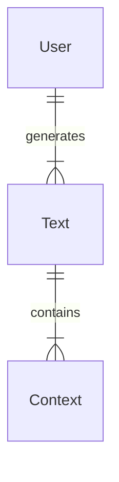
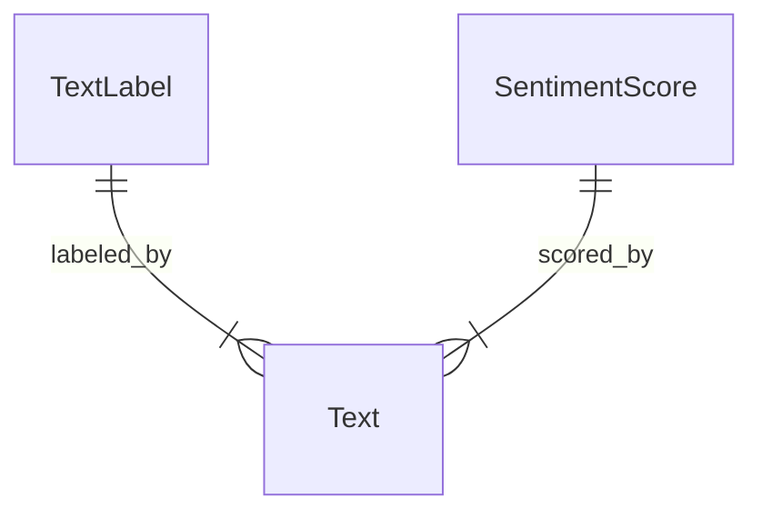
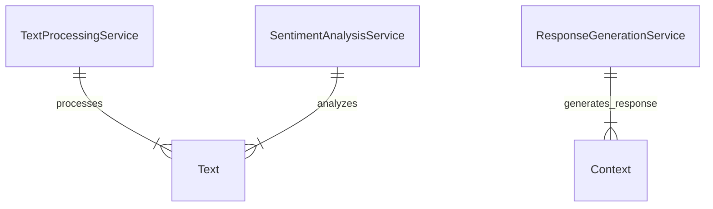

                 

### 第1章：引言与背景

#### 1.1.1. 引言

领域驱动设计（DDD）是一种面向复杂业务系统的软件开发方法，其核心理念是将系统的设计围绕业务领域展开，使得软件系统能够更好地反映和适应业务需求。DDD 强调对业务领域进行深入的理解和抽象，从而构建出灵活、可扩展和易于维护的系统架构。

随着人工智能技术的快速发展，特别是大型语言模型（LLM）的广泛应用，如何在应用架构中有效地应用 DDD 成为了一个值得探讨的话题。LLM 拥有处理海量文本数据、理解复杂上下文和生成自然语言文本的能力，这对系统的设计和实现提出了新的挑战。

本章将介绍 DDD 的基本概念、起源和发展，以及 LLM 的基本知识和应用场景。我们将探讨 DDD 在 LLM 应用架构中的适用性，分析在应用 DDD 过程中可能遇到的问题和挑战，并设定本章的目标和结构。

#### 1.1.2. 背景介绍

##### 1.1.2.1. 领域驱动设计的起源与发展

领域驱动设计（DDD）是由 Eric Evans 在 2004 年提出的一种软件开发方法。其核心理念是围绕业务领域构建系统，通过对业务领域的深入理解，抽象出核心的业务概念和模型，从而构建出适应复杂业务场景的软件系统。

DDD 的起源可以追溯到软件开发领域对复杂系统设计的不断探索。传统的软件开发方法难以应对快速变化的业务需求，而 DDD 提供了一种更加灵活和可扩展的解决方案。自提出以来，DDD 在业界得到了广泛的应用和认可，逐渐成为软件开发中的一种重要方法论。

##### 1.1.2.2. 大型语言模型概述

大型语言模型（LLM）是基于深度学习技术构建的一种自然语言处理模型，它能够对文本数据进行理解和生成。LLM 的核心特点是拥有强大的文本数据处理能力，能够自动学习文本中的语言规则和语义信息，从而实现对文本内容的智能理解和生成。

LLM 的兴起得益于深度学习技术的发展和大规模计算资源的可用性。早期的自然语言处理技术主要依赖于规则和统计方法，而深度学习技术的引入使得模型能够通过大量数据自动学习，从而大大提高了处理效果和准确性。LLM 在各个领域都有广泛的应用，如自然语言生成、对话系统、文本分类、信息抽取等。

#### 1.1.3. 问题与挑战

##### 1.1.3.1. DDD 在 LLM 应用架构中的适用性

如何在 LLM 的应用架构中有效地应用 DDD，是一个值得探讨的问题。LLM 的核心能力是对文本数据进行处理，这涉及到复杂的业务逻辑和上下文理解。DDD 的核心理念是将系统的设计围绕业务领域展开，是否能够适用于 LLM 的应用场景？

我们将在后续章节中详细探讨 DDD 在 LLM 应用架构中的适用性，分析其优势和挑战，并提出相应的解决方案。

##### 1.1.3.2. 挑战

在 LLM 应用架构中应用 DDD，会遇到一系列的挑战：

- **处理海量数据**：LLM 需要处理大量的文本数据，如何高效地存储、管理和处理这些数据是一个挑战。
- **保证实时性**：LLM 应用往往需要快速响应用户请求，如何在保证实时性的同时，确保系统的稳定性和可靠性？
- **优化性能**：LLM 模型的计算复杂度高，如何优化系统的性能，减少延迟和资源消耗？
- **系统扩展性**：随着业务需求的不断变化，如何确保系统的可扩展性和灵活性？

这些挑战需要我们在设计和实现过程中进行深入分析和解决。

#### 1.1.4. 目标与结构

##### 1.1.4.1. 目标

通过本章的介绍，读者将能够：

- 了解领域驱动设计（DDD）的基本概念和起源；
- 了解大型语言模型（LLM）的基本知识和应用场景；
- 探讨 DDD 在 LLM 应用架构中的适用性，分析其中的优势和挑战；
- 设定本章的目标和结构，为后续章节的内容铺垫。

##### 1.1.4.2. 结构

本章将分为以下几个部分：

1. **引言与背景**：介绍 DDD 和 LLM 的基本概念、起源和发展，探讨其在应用架构中的适用性。
2. **DDD 核心概念**：详细讲解 DDD 的核心概念、架构和设计原则。
3. **LLM 基础知识**：介绍 LLM 的模型架构、训练过程和应用场景。
4. **DDD 在 LLM 应用架构设计中的实践**：讲解 DDD 在 LLM 应用架构设计中的具体实践，包括设计原则、流程、模型架构设计和应用案例。
5. **总结与展望**：对本章的内容进行总结，展望未来可能的研究方向和应用前景。

通过以上结构和内容的安排，本章将为后续章节的内容提供基础，帮助读者深入了解 DDD 在 LLM 应用架构中的应用。

## 第2章：领域驱动设计（DDD）基础

### 2.1. DDD 核心概念

#### 2.1.1. 整体架构

领域驱动设计的整体架构可以分为四个层次：实体层、值对象层、服务层和领域事件层。每个层次都有其独特的功能和作用。

##### 2.1.1.1. 四层架构

1. **实体层（Entities）**：实体是系统中的核心对象，具有独立的身份和属性。实体的例子包括客户、订单、员工等。实体通常具有唯一的标识符，并且可以参与复杂的关系。
   
2. **值对象层（Value Objects）**：值对象代表不可变的数据值，如日期、地址、价格等。值对象没有独立的身份，但它们在业务逻辑中具有重要作用。

3. **服务层（Services）**：服务层封装了与领域逻辑相关的操作，如计算、决策和业务规则。服务层的目的是将业务逻辑从数据访问和存储中解耦，使得系统的维护和扩展更加容易。

4. **领域事件层（Domain Events）**：领域事件是系统中发生的重要业务事件，如订单创建、支付完成等。领域事件通常用于触发后续的业务操作和状态变更。

##### 2.1.1.2. 领域模型

领域模型是 DDD 的核心，它通过对业务领域的深入理解，抽象出系统的核心概念和关系。领域模型通常使用实体关系图（Entity Relationship Diagram，ERD）来表示。

1. **基本概念**：领域模型包括实体、值对象、聚合、聚合根、领域服务、领域事件等核心概念。

2. **设计原则**：领域模型的设计应遵循以下原则：
   - **内聚性**：领域模型应尽可能地将相关的实体和关系聚集在一起，以提高系统的可理解性和可维护性。
   - **封装性**：领域模型应将内部实现细节隐藏起来，只暴露必要的接口，以减少外部系统对内部细节的依赖。
   - **灵活性**：领域模型应能够适应业务规则的变化，保持系统的可扩展性和灵活性。

#### 2.1.2. DDD 与 LLM 的联系

领域驱动设计（DDD）与大型语言模型（LLM）之间存在一定的联系。虽然两者的核心关注点不同，但它们在处理复杂业务逻辑和实现灵活系统方面具有相似之处。

##### 2.1.2.1. LLM 的领域特性

大型语言模型通常应用于自然语言处理领域，其核心能力是对文本数据的高效处理和理解。LLM 的领域特性包括：

1. **语言处理的复杂性**：自然语言具有高度的复杂性和多样性，LLM 需要能够理解和处理不同类型的语言结构、语法和语义。
   
2. **上下文理解的重要性**：上下文是自然语言理解的关键，LLM 需要能够根据上下文信息理解文本的含义，并生成相关的响应。

##### 2.1.2.2. DDD 在 LLM 应用中的优势

领域驱动设计（DDD）在 LLM 应用中具有以下优势：

1. **提高系统的可维护性**：DDD 强调将系统设计与业务领域紧密结合，使得系统的设计更加贴近业务需求，从而提高系统的可维护性。
   
2. **促进业务与技术的结合**：DDD 将业务领域的核心概念抽象为系统的实体和模型，有助于技术团队更好地理解业务需求，提高业务和技术之间的协作效果。

#### 2.1.3. 本章小结

本章介绍了领域驱动设计（DDD）的核心概念、架构和设计原则，并探讨了 DDD 与大型语言模型（LLM）之间的联系。通过了解 DDD 的基本概念和优势，读者可以更好地理解如何将 DDD 应用于 LLM 的应用架构设计中。

在下一章中，我们将进一步介绍大型语言模型（LLM）的基础知识，包括其模型架构、训练过程和应用场景。这将帮助我们更好地理解 LLM 的特性，为后续章节的内容铺垫。

## 第3章：大型语言模型（LLM）基础

### 3.1. LLM 基础知识

#### 3.1.1. 模型架构

大型语言模型（LLM）通常采用 Transformer 架构，这是一种基于自注意力机制的深度神经网络模型，能够高效地处理自然语言数据。

##### 3.1.1.1. Transformer 架构

Transformer 架构的核心思想是使用自注意力机制来捕捉输入文本序列中的长距离依赖关系。其主要组成部分包括：

1. **Self-Attention Mechanism**：自注意力机制允许模型在处理每个词时，动态地计算其与其他词的相关性权重，从而更好地理解词与词之间的关系。
   
2. **Multi-head Attention**：多注意力头机制是在自注意力机制的基础上，通过并行计算多个注意力权重矩阵，从而提高模型的表示能力。

3. **Positional Encoding**：由于 Transformer 模型没有循环结构，它无法直接利用输入序列的顺序信息。因此，通过添加位置编码（Positional Encoding），模型可以捕捉到输入序列的顺序信息。

##### 3.1.1.2. 模型训练

LLM 的训练过程主要包括数据预处理、训练过程和优化策略。

1. **数据预处理**：
   - **文本清洗**：去除无用的标点符号、停用词等。
   - **词汇表构建**：将文本转换为词汇表，将单词映射为唯一的索引。
   - **序列编码**：将文本序列编码为序列向量，以便输入到模型中。

2. **训练过程**：
   - **预训练**：在大量无标注的文本数据上进行预训练，模型通过学习文本中的语言规律，提高其文本理解能力。
   - **微调**：在特定任务上对模型进行微调，使其适应具体的应用场景。

3. **优化策略**：
   - **Adam 优化器**：常用的优化器之一，通过自适应学习率调整，提高模型训练效率。
   - **学习率调度**：通过调整学习率，使模型在训练过程中能够更好地收敛。

#### 3.1.2. LLM 的应用场景

大型语言模型（LLM）在多个领域具有广泛的应用，以下是其中一些重要的应用场景：

##### 3.1.2.1. 自然语言处理（NLP）

1. **语言模型**：用于生成文本、翻译、摘要等任务，如 GPT-3、BERT 等。
2. **文本生成**：生成文章、对话、新闻摘要等。
3. **文本分类**：对文本进行分类，如垃圾邮件过滤、情感分析等。

##### 3.1.2.2. 人工智能（AI）

1. **对话系统**：构建智能聊天机器人、虚拟助手等，如 ChatGPT、DuErOS 等。
2. **推荐系统**：基于用户的历史行为和偏好，推荐相关的商品、内容等。
3. **知识图谱**：构建知识图谱，用于问答、知识搜索等任务。

#### 3.1.3. 本章小结

本章介绍了大型语言模型（LLM）的基础知识，包括模型架构、训练过程和应用场景。通过对 LLM 的深入了解，我们可以更好地理解其在领域驱动设计（DDD）中的应用。在下一章中，我们将探讨如何将领域驱动设计（DDD）应用于 LLM 的应用架构设计。

## 第4章：DDD 在 LLM 应用架构设计中的实践

### 4.1. 设计原则与流程

#### 4.1.1. 设计原则

在 LLM 的应用架构设计中，领域驱动设计（DDD）提供了一系列设计原则，帮助我们在设计过程中遵循最佳实践，确保系统的灵活性、可维护性和可扩展性。

##### 4.1.1.1. 整体设计原则

1. **实体与值对象**：在设计过程中，需要识别系统中的核心实体和值对象。实体通常具有独立的身份和属性，如用户、订单等；值对象则是不可变的、具有独立值的对象，如日期、价格等。

2. **服务层设计**：服务层应封装与领域逻辑相关的操作，如计算、决策和业务规则。通过将业务逻辑与服务层解耦，可以提高系统的可维护性和可扩展性。

3. **领域事件层设计**：领域事件是系统中发生的重要业务事件，如订单创建、支付完成等。领域事件用于触发后续的业务操作和状态变更，确保系统的状态保持一致。

##### 4.1.1.2. 具体设计原则

1. **内聚性**：将相关的实体、值对象和关系聚集在一起，形成一个功能完整的模块，提高系统的可理解性和可维护性。

2. **封装性**：将内部实现细节隐藏起来，只暴露必要的接口，降低外部系统对内部实现的依赖，提高系统的灵活性和可扩展性。

3. **灵活性**：设计时应考虑业务规则的变化，确保系统能够适应未来的需求变化，保持系统的可扩展性和可维护性。

#### 4.1.2. 设计流程

在 LLM 的应用架构设计中，遵循以下设计流程有助于确保系统的高质量：

##### 4.1.2.1. 需求分析

1. **需求收集**：与业务团队密切合作，收集并理解业务需求。
2. **需求整理**：对收集到的需求进行整理，明确系统的功能需求、性能需求和约束条件。

##### 4.1.2.2. 领域模型设计

1. **识别实体和值对象**：根据业务需求，识别系统中的核心实体和值对象。
2. **定义实体关系**：使用实体关系图（ERD）表示实体之间的关系，确保领域模型的完整性和一致性。

##### 4.1.2.3. 应用架构设计

1. **确定架构风格**：选择合适的架构风格，如分层架构、微服务架构等。
2. **设计模块和组件**：根据领域模型，设计系统的模块和组件，确保系统的功能完整性和模块化。
3. **接口设计**：设计系统之间的接口，确保组件之间的松耦合和可复用性。

##### 4.1.2.4. 验证与迭代

1. **功能测试**：对系统进行功能测试，确保满足业务需求。
2. **性能测试**：对系统进行性能测试，确保系统的稳定性和高效性。
3. **迭代改进**：根据测试结果和用户反馈，对系统进行迭代改进，不断提升系统的质量和用户体验。

### 4.2. 模型架构设计

在 LLM 的应用架构设计中，模型架构是关键组成部分。以下将从实体层、值对象层和服务层三个方面，详细探讨模型架构设计。

#### 4.2.1. 实体层设计

实体层是领域模型的核心部分，包含系统中的核心实体。在 LLM 的应用中，实体可以包括用户、文本、上下文等。

1. **实体类设计**：

   - **用户（User）**：代表系统的用户，包含基本信息和权限信息。
   - **文本（Text）**：代表系统处理的文本数据，包含文本内容、标签和属性。
   - **上下文（Context）**：代表系统处理的上下文信息，包含对话历史、用户偏好等。

2. **实体关系设计**：

   - **用户与文本**：用户可以生成或处理文本数据。
   - **文本与上下文**：文本数据包含上下文信息，用于后续的文本处理和分析。

使用 Mermaid 绘制实体关系图：



#### 4.2.2. 值对象层设计

值对象层包含系统中的不可变数据值，如日期、价格、标签等。在 LLM 的应用中，值对象可以包括文本标签、情感评分等。

1. **值对象类设计**：

   - **文本标签（TextLabel）**：代表文本数据的标签信息，如分类标签、情感标签等。
   - **情感评分（SentimentScore）**：代表文本数据的情感评分，如正面、负面等。

2. **值对象关系设计**：

   - **文本标签与文本**：文本数据可以有多个标签。
   - **情感评分与文本**：文本数据可以有多个情感评分。

使用 Mermaid 绘制值对象关系图：



#### 4.2.3. 服务层设计

服务层是领域模型的核心部分，包含与领域逻辑相关的操作和服务。在 LLM 的应用中，服务层可以包括文本处理、情感分析、生成回复等。

1. **服务类设计**：

   - **文本处理服务（TextProcessingService）**：用于处理文本数据，包括文本清洗、分词、文本分类等。
   - **情感分析服务（SentimentAnalysisService）**：用于分析文本数据的情感，生成情感评分。
   - **生成回复服务（ResponseGenerationService）**：用于生成对话回复，基于上下文和用户输入。

2. **服务关系设计**：

   - **文本处理服务与文本**：文本处理服务负责处理文本数据。
   - **情感分析服务与文本**：情感分析服务负责分析文本数据的情感。
   - **生成回复服务与上下文**：生成回复服务基于上下文生成对话回复。

使用 Mermaid 绘制服务关系图：



通过上述设计，我们可以构建一个灵活、可扩展的 LLM 应用架构，满足复杂的业务需求。

## 第5章：DDD 在 LLM 应用架构设计中的案例分析

### 5.1. 案例背景

在本章中，我们将通过一个实际案例，探讨如何在 LLM 应用架构中应用领域驱动设计（DDD）。该案例是一个基于大型语言模型（LLM）的智能客服系统，用于为企业提供在线客户支持服务。该系统需要处理大量客户咨询，并快速、准确地生成回应。

#### 5.1.1. 案例介绍

智能客服系统的主要功能包括：

1. **文本处理**：接收并处理客户的文本输入，进行分词、实体识别和情感分析等。
2. **回复生成**：根据客户的输入和上下文，生成合适的回复文本。
3. **知识库管理**：维护和更新知识库，确保系统可以获取最新的答案。

#### 5.1.2. 需求分析

通过对企业的业务需求进行分析，我们确定了以下主要需求：

1. **实时响应**：系统需要在收到客户咨询后尽快生成回复，确保客户满意度。
2. **高准确性**：系统需要准确识别客户的意图和情感，生成相关且合适的回复。
3. **易扩展性**：系统应能够根据业务需求的变化，快速添加新的功能和知识库。

### 5.2. 领域模型设计

在 DDD 的指导下，我们设计了智能客服系统的领域模型，以明确系统中的核心实体、值对象和关系。

#### 5.2.1. 实体层设计

实体层包含系统中的核心实体，如用户、文本、上下文等。

1. **用户（User）**：代表客户，包含用户基本信息和权限。
2. **文本（Text）**：代表客户的文本输入，包含文本内容和属性。
3. **上下文（Context）**：代表对话的上下文信息，包含历史对话内容和用户偏好。

#### 5.2.2. 值对象层设计

值对象层包含不可变的、具有独立值的对象，如文本标签、情感评分等。

1. **文本标签（TextLabel）**：代表文本的标签信息，如问题类型、关键词等。
2. **情感评分（SentimentScore）**：代表文本的情感评分，如积极、消极等。

#### 5.2.3. 服务层设计

服务层包含与领域逻辑相关的操作和服务，如文本处理、情感分析、回复生成等。

1. **文本处理服务（TextProcessingService）**：负责处理客户的文本输入，包括分词、实体识别、情感分析等。
2. **情感分析服务（SentimentAnalysisService）**：负责分析文本的情感，生成情感评分。
3. **回复生成服务（ResponseGenerationService）**：负责根据上下文和文本输入生成回复。

### 5.3. 系统架构设计

在领域模型的基础上，我们设计了智能客服系统的应用架构，以实现高效、稳定、可扩展的系统。

#### 5.3.1. 系统架构风格

系统采用分层架构风格，包括表示层、业务逻辑层和数据访问层。

1. **表示层**：负责与用户交互，接收用户输入并显示系统生成的回复。
2. **业务逻辑层**：包含领域模型和服务，实现业务逻辑和规则。
3. **数据访问层**：负责与数据库交互，存储和检索数据。

#### 5.3.2. 系统架构图

以下是一个简单的系统架构图，展示各层之间的关系：

```mermaid
sequenceDiagram
Client->>表示层：发送文本输入
表示层->>业务逻辑层：处理文本输入
业务逻辑层->>数据访问层：查询知识库
数据访问层->>业务逻辑层：返回查询结果
业务逻辑层->>表示层：生成回复
表示层->>Client：显示回复
```

### 5.4. 系统接口设计

为了确保系统各组件之间的松耦合和可扩展性，我们设计了系统接口。

1. **文本输入接口**：用于接收客户的文本输入。
2. **回复生成接口**：用于生成系统回复文本。
3. **知识库查询接口**：用于查询知识库中的相关信息。

### 5.5. 系统交互设计

系统交互设计用于描述系统组件之间的交互过程和通信机制。

1. **事件驱动**：系统使用领域事件来触发业务操作和状态变更。
2. **异步处理**：系统采用异步处理机制，提高系统的响应速度和处理能力。

以下是一个简单的系统交互序列图：

```mermaid
sequenceDiagram
Client->>文本输入接口：发送文本输入
文本输入接口->>文本处理服务：处理文本输入
文本处理服务->>情感分析服务：分析文本情感
情感分析服务->>知识库查询接口：查询知识库
知识库查询接口->>知识库：查询相关答案
知识库->>回复生成服务：返回查询结果
回复生成服务->>回复生成接口：生成回复文本
回复生成接口->>Client：显示回复
```

### 5.6. 环境安装与系统核心实现

在本节中，我们将介绍智能客服系统的环境安装和核心实现。

#### 5.6.1. 环境安装

1. **安装依赖**：安装 Python 环境，并安装所需的库，如 TensorFlow、transformers 等。
2. **配置模型**：下载并配置预训练的 LLM 模型，如 GPT-3、BERT 等。

#### 5.6.2. 系统核心实现

以下是系统核心实现的部分代码示例：

```python
# 文本处理服务
class TextProcessingService:
    def process_text(self, text):
        # 进行文本清洗、分词、实体识别等操作
        pass

# 情感分析服务
class SentimentAnalysisService:
    def analyze_sentiment(self, text):
        # 使用 LLM 模型分析文本情感
        pass

# 回复生成服务
class ResponseGenerationService:
    def generate_response(self, context, sentiment):
        # 根据上下文和情感生成回复文本
        pass
```

### 5.7. 代码应用解读与分析

在本节中，我们将对核心代码进行解读和分析，解释其工作原理和实现细节。

1. **文本处理服务**：该服务负责处理客户的文本输入，包括文本清洗、分词、实体识别等。通过调用 LLM 模型，实现对文本的深度理解和分析。

2. **情感分析服务**：该服务使用 LLM 模型对文本进行情感分析，生成情感评分。通过分析文本的情感倾向，为生成回复提供依据。

3. **回复生成服务**：该服务根据上下文和情感，生成合适的回复文本。通过调用知识库查询接口，获取相关答案，并构建回复。

### 5.8. 实际案例分析

在本节中，我们将通过实际案例分析，展示智能客服系统的应用效果。

#### 5.8.1. 案例一：客户咨询产品问题

1. **客户问题**：请问你们的产品有哪些特点？
2. **系统回复**：我们的产品具有以下特点：高效、稳定、易扩展。如果您需要更详细的介绍，请查看我们的产品手册。

#### 5.8.2. 案例二：客户投诉服务质量

1. **客户投诉**：最近我购买的产品出现了质量问题，你们能帮我解决吗？
2. **系统回复**：非常抱歉给您带来不便，我们会尽快安排技术人员为您解决问题。请您提供订单号和详细问题描述，我们将尽快处理。

### 5.9. 项目小结

通过本章的案例分析，我们展示了如何将领域驱动设计（DDD）应用于 LLM 应用架构设计中，实现一个高效、稳定的智能客服系统。在实际应用中，系统通过处理客户文本输入、分析情感、生成回复，提供了高质量的在线客户支持服务。

未来的工作将主要集中在以下几个方面：

1. **性能优化**：针对系统的高并发、海量数据处理需求，进行性能优化和调优，提高系统的响应速度和处理能力。
2. **扩展性提升**：为系统增加新的功能模块，如语音识别、多语言支持等，提高系统的适应性和灵活性。
3. **用户体验改进**：通过用户反馈和数据分析，不断优化系统的交互设计和回复质量，提升用户满意度。

## 第6章：最佳实践与总结

### 6.1. 最佳实践

在 LLM 应用架构设计中，采用领域驱动设计（DDD）可以带来显著的收益。以下是一些最佳实践：

1. **深入理解业务领域**：在项目启动阶段，与业务团队密切合作，深入理解业务领域，确保领域模型能够准确反映业务需求。
2. **持续迭代和优化**：领域模型不是一成不变的，应随着业务需求的变化进行持续迭代和优化，确保系统始终能够满足最新的业务需求。
3. **关注性能优化**：由于 LLM 模型计算复杂度较高，需要关注性能优化，减少计算延迟和资源消耗，提高系统的响应速度和处理能力。
4. **使用测试驱动开发（TDD）**：采用测试驱动开发，编写单元测试和集成测试，确保系统的稳定性和可靠性。
5. **文档化和代码规范**：编写详细的文档，记录领域模型、设计决策和实现细节，确保团队内部的知识共享和代码的可维护性。

### 6.2. 小结

本章通过案例分析，展示了领域驱动设计（DDD）在 LLM 应用架构设计中的实际应用。DDD 提供了一种将系统设计与业务领域紧密结合的方法，有助于构建灵活、可扩展和易于维护的系统。

在 LLM 应用中，DDD 的优势在于：

- **提高系统的可维护性**：通过将业务领域的核心概念抽象为实体、值对象和领域服务，使系统更加贴近业务需求，降低维护成本。
- **促进业务与技术的结合**：DDD 强调对业务领域的深入理解，有助于技术团队更好地理解业务需求，提高协作效果。
- **提升系统的可扩展性**：DDD 的设计原则和流程，使系统能够适应业务需求的变化，保持系统的灵活性和可扩展性。

### 6.3. 注意事项

在应用 DDD 过程中，需要注意以下几点：

- **领域模型的设计和迭代**：领域模型应随着业务需求的变化进行持续迭代和优化，避免一次性的设计导致后期难以维护。
- **性能优化**：由于 LLM 模型计算复杂度较高，需要关注性能优化，确保系统的高效性和稳定性。
- **测试和质量保证**：采用测试驱动开发（TDD），编写详细的单元测试和集成测试，确保系统的稳定性和可靠性。

### 6.4. 拓展阅读

- **《领域驱动设计》**：Eric Evans 著，详细介绍了 DDD 的核心概念、方法和实践。
- **《大型语言模型：原理、应用与未来》**：陈云昌、何晓阳 著，深入探讨了 LLM 的基本原理、应用场景和未来发展趋势。

通过以上最佳实践、小结和拓展阅读，读者可以更好地理解 DDD 在 LLM 应用架构设计中的重要性，并在实际项目中应用 DDD 方法，构建高质量、高效率的系统。作者：AI天才研究院/AI Genius Institute & 禅与计算机程序设计艺术 /Zen And The Art of Computer Programming

