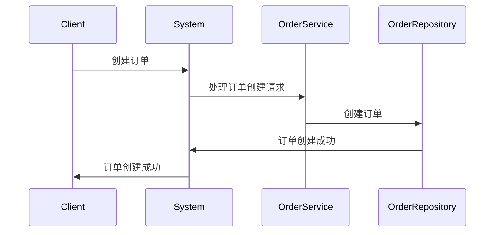

                 

# 领域驱动设计：优化LLM应用的业务逻辑

## 关键词

- **领域驱动设计**
- **LLM应用**
- **业务逻辑优化**
- **软件架构**
- **软件开发流程**
- **敏捷开发**

## 摘要

本文将深入探讨领域驱动设计（Domain-Driven Design，简称DDD）在优化大型语言模型（Large Language Model，简称LLM）应用业务逻辑方面的作用。随着LLM技术的飞速发展，如何有效地管理复杂的业务逻辑成为了一个关键问题。领域驱动设计以其独特的视角和架构方法，提供了一种系统化的解决方案。本文将从DDD的基本概念、核心原则、应用场景，以及其在LLM应用中的具体实践进行详细分析，帮助开发者更好地理解和应用DDD，提升LLM应用的业务逻辑优化能力。

### 目录大纲

----------------------------------------------------------------

## 第一部分：领域驱动设计的概念与背景

### 第1章：领域驱动设计概述

#### 1.1 领域驱动设计的起源与概念

##### 1.1.1 领域驱动设计的定义

##### 1.1.2 领域驱动设计的核心原则

##### 1.1.3 领域驱动设计与传统设计方法的对比

#### 1.2 领域驱动设计的应用背景

##### 1.2.1 复杂业务系统的挑战

##### 1.2.2 领域驱动设计的优势

##### 1.2.3 领域驱动设计在不同行业中的应用

#### 1.3 领域驱动设计的基础设施

##### 1.3.1 实体与值的分离

##### 1.3.2 领域模型的核心组件

##### 1.3.3 领域事件与命令的区分

#### 1.4 领域驱动设计的边界与技术选型

##### 1.4.1 企业级的边界定义

##### 1.4.2 技术栈的选择与整合

##### 1.4.3 领域驱动设计与DevOps的结合

### 第2章：领域模型与业务实体

#### 2.1 领域模型的基本原理

##### 2.1.1 实体与值的分离

##### 2.1.2 领域模型的构建过程

##### 2.1.3 领域模型的核心概念

#### 2.2 业务实体的定义与属性

##### 2.2.1 业务实体的分类

##### 2.2.2 业务实体的属性特征对比表格

##### 2.2.3 业务实体的生命周期管理

#### 2.3 领域模型的设计实践

##### 2.3.1 实体关系的ER图

##### 2.3.2 领域模型的演进与维护

##### 2.3.3 领域模型在LLM应用中的重要性

### 第3章：领域事件与命令

#### 3.1 领域事件的定义与分类

##### 3.1.1 领域事件的定义

##### 3.1.2 领域事件的作用

##### 3.1.3 领域事件与命令的区分

#### 3.2 命令模式的实现

##### 3.2.1 命令模式的定义

##### 3.2.2 命令模式的优点与局限性

##### 3.2.3 命令模式在LLM应用中的实践

#### 3.3 领域事件的驱动机制

##### 3.3.1 事件驱动的架构设计

##### 3.3.2 事件流的管理与调度

##### 3.3.3 事件驱动与LLM应用的结合

### 第4章：领域服务与业务逻辑

#### 4.1 领域服务的概念

##### 4.1.1 领域服务的定义

##### 4.1.2 领域服务的核心功能

##### 4.1.3 领域服务的实现方式

#### 4.2 业务逻辑的拆分与重构

##### 4.2.1 业务逻辑的复杂性分析

##### 4.2.2 业务逻辑的拆分策略

##### 4.2.3 业务逻辑的重构方法

#### 4.3 领域服务的应用案例

##### 44.3.1 领域服务在金融行业的应用

##### 4.3.2 领域服务在电子商务中的应用

##### 4.3.3 领域服务在智能交通系统中的应用

### 第5章：领域驱动设计与软件开发流程

#### 5.1 领域驱动设计在软件开发流程中的应用

##### 5.1.1 领域驱动设计与敏捷开发的结合

##### 5.1.2 领域驱动设计与持续集成

##### 5.1.3 领域驱动设计与持续交付

#### 5.2 领域驱动设计的敏捷实践

##### 5.2.1 敏捷开发中的领域模型

##### 5.2.2 敏捷开发中的领域事件与命令

##### 5.2.3 敏捷开发中的领域服务

#### 5.3 领域驱动设计在软件开发中的价值

##### 5.3.1 提高软件的可维护性和可扩展性

##### 5.3.2 降低软件的维护成本

##### 5.3.3 提升软件开发效率

### 第6章：领域驱动设计与LLM应用的业务逻辑优化

#### 6.1 LLM应用的业务逻辑问题分析

##### 6.1.1 传统业务逻辑的不足

##### 6.1.2 LLM应用对业务逻辑的要求

##### 6.1.3 领域驱动设计在LLM应用中的优势

#### 6.2 领域驱动设计在LLM应用中的实现策略

##### 6.2.1 业务逻辑的抽象与模块化

##### 6.2.2 领域服务的划分与实现

##### 6.2.3 领域事件的驱动与处理

#### 6.3 领域驱动设计在LLM应用中的实践案例

## 第一部分：领域驱动设计的概念与背景

### 第1章：领域驱动设计概述

#### 1.1 领域驱动设计的起源与概念

##### 1.1.1 领域驱动设计的定义

领域驱动设计（Domain-Driven Design，简称DDD）是由Eric Evans在2004年提出的一种软件开发方法，旨在解决复杂业务系统的设计和开发难题。DDD的核心思想是将软件开发的重心从代码层面转移到业务领域，通过构建清晰的领域模型来更好地理解和应对业务需求。

##### 1.1.2 领域驱动设计的核心原则

领域驱动设计有以下几条核心原则：

1. **实体与值的分离**：在DDD中，实体是业务领域中的核心概念，它们具有明确的业务属性和行为，而值则是实体的属性值，两者分离有助于提高系统的灵活性和可维护性。
2. **领域模型**：领域模型是DDD的核心组件，它通过一组实体、关系、服务和规则来描述业务领域，帮助开发者更好地理解和实现业务逻辑。
3. **事件驱动**：DDD倡导使用事件来驱动业务逻辑，通过事件来记录业务变化，使系统更加动态和响应迅速。
4. **服务导向**：领域服务是DDD中负责实现业务逻辑的组件，它们根据业务需求进行组织和实现，有助于提高系统的模块化和可扩展性。

##### 1.1.3 领域驱动设计与传统设计方法的对比

传统的软件开发方法，如面向过程、面向对象等，往往注重代码层面的抽象和复用，而DDD则更加关注业务领域的理解和实现。以下是DDD与传统设计方法的一些对比：

| 特性 | 领域驱动设计 | 传统设计方法 |
| --- | --- | --- |
| **关注点** | 业务领域 | 技术实现 |
| **核心组件** | 领域模型 | 类、对象 |
| **设计原则** | 实体与值的分离、事件驱动 | 封装、继承、多态 |
| **系统架构** | 分层架构、领域服务 | 框架依赖、组件复用 |

#### 1.2 领域驱动设计的应用背景

##### 1.2.1 复杂业务系统的挑战

在现代企业中，业务系统变得越来越复杂，涉及多个领域、层次和参与者。传统的软件开发方法在面对这些复杂系统时，常常会遇到以下挑战：

1. **业务理解难度大**：复杂业务系统往往具有高度的复杂性和不确定性，开发者难以准确理解业务需求。
2. **代码复用性差**：传统的面向对象设计方法容易导致代码的过度抽象，使得代码难以复用和维护。
3. **系统可扩展性低**：随着业务需求的不断增加，系统往往需要进行频繁的调整和重构，导致系统难以扩展。

##### 1.2.2 领域驱动设计的优势

领域驱动设计通过以下几个方面解决了复杂业务系统的挑战：

1. **提高业务理解**：DDD强调从业务领域出发，构建领域模型，有助于开发者更好地理解业务需求。
2. **提升代码复用性**：领域模型通过实体、关系和服务进行组织，使得代码具有更好的复用性。
3. **增强系统可扩展性**：DDD采用分层架构和领域服务，使得系统更加模块化，易于扩展和维护。

##### 1.2.3 领域驱动设计在不同行业中的应用

领域驱动设计在多个行业中已经得到了广泛应用，以下是一些典型应用场景：

1. **金融行业**：金融系统具有高度的复杂性和规范性，领域驱动设计有助于管理和实现复杂的金融业务逻辑。
2. **电子商务**：电子商务系统涉及多个业务领域，如商品管理、订单处理、支付等，DDD有助于将这些业务逻辑组织起来。
3. **物流与供应链**：领域驱动设计可以帮助物流与供应链系统更好地处理复杂的物流信息，优化业务流程。

#### 1.3 领域驱动设计的基础设施

##### 1.3.1 实体与值的分离

在DDD中，实体是业务领域中的核心概念，它们具有明确的业务属性和行为。而值则是实体的属性值，如某个订单的金额、订单号等。实体与值的分离有以下优点：

1. **提高系统的灵活性和可维护性**：通过将实体与值分离，可以独立地修改实体或值，而不影响其他部分。
2. **便于扩展**：当业务需求发生变化时，可以更容易地对实体或值进行扩展。

##### 1.3.2 领域模型的核心组件

领域模型是DDD的核心组件，它由以下几部分组成：

1. **实体**：实体是业务领域中的核心概念，具有明确的业务属性和行为。
2. **值对象**：值对象是具有明确业务属性的小型对象，如订单金额、订单号等。
3. **聚合根**：聚合根是实体的集合，负责管理实体的生命周期和关联关系。
4. **领域服务**：领域服务是负责实现业务逻辑的组件，通常根据业务需求进行组织和实现。

##### 1.3.3 领域事件与命令的区分

在DDD中，事件和命令是两个重要的概念。事件是业务领域中发生的不可分割的原子操作，如订单创建、支付成功等。而命令是客户端向系统发送的请求，如创建订单、支付订单等。事件和命令的区分有以下好处：

1. **提高系统的响应速度**：通过事件驱动，系统可以更加快速地响应用户请求。
2. **便于系统的分解和重构**：事件和命令的分离使得系统的各个部分可以独立开发和维护。

##### 1.4 领域驱动设计的边界与技术选型

##### 1.4.1 企业级的边界定义

在DDD中，企业级边界（Enterprise-Level Boundary）是划分领域模型的重要依据。企业级边界定义了系统的核心业务领域，将系统划分为多个独立的模块，有助于提高系统的可维护性和可扩展性。

##### 1.4.2 技术栈的选择与整合

领域驱动设计可以与多种技术栈结合使用，如Spring Boot、Django、Node.js等。选择合适的技术栈需要考虑以下因素：

1. **业务需求**：选择能够满足业务需求的技术栈，如金融行业可能选择Java Spring Boot。
2. **团队技能**：选择团队成员熟悉的技术栈，以提高开发效率。

##### 1.4.3 领域驱动设计与DevOps的结合

领域驱动设计可以与DevOps相结合，实现快速迭代和交付。以下是一些结合策略：

1. **持续集成和持续交付**：通过自动化测试和部署流程，实现快速交付和部署。
2. **基础设施即代码**：使用基础设施即代码工具，如Terraform、Ansible等，自动化基础设施配置和管理。

### 第2章：领域模型与业务实体

#### 2.1 领域模型的基本原理

##### 2.1.1 实体与值的分离

在DDD中，实体与值的分离是一种重要的设计原则。实体代表业务领域中的核心概念，具有明确的业务属性和行为。而值则是实体的属性值，如某个订单的金额、订单号等。实体与值的分离有以下优点：

1. **提高系统的灵活性和可维护性**：通过将实体与值分离，可以独立地修改实体或值，而不影响其他部分。
2. **便于扩展**：当业务需求发生变化时，可以更容易地对实体或值进行扩展。

##### 2.1.2 领域模型的构建过程

领域模型的构建是一个逐步迭代的过程，通常包括以下几个步骤：

1. **识别业务领域**：首先，需要明确系统的核心业务领域，如订单管理、支付处理等。
2. **识别业务实体**：根据业务领域，识别出核心的业务实体，如订单、用户等。
3. **定义实体属性**：为每个业务实体定义其属性，如订单的金额、订单号等。
4. **建立实体关系**：确定业务实体之间的关系，如订单与用户之间的关系。
5. **设计领域服务**：根据业务需求，设计领域服务，如订单创建、支付处理等。

##### 2.1.3 领域模型的核心概念

领域模型的核心概念包括实体、值对象、聚合根和领域服务。以下是对这些核心概念的定义和解释：

1. **实体**：实体是业务领域中的核心概念，具有明确的业务属性和行为。如订单、用户等。
2. **值对象**：值对象是具有明确业务属性的小型对象，如订单金额、订单号等。
3. **聚合根**：聚合根是实体的集合，负责管理实体的生命周期和关联关系。如订单聚合根，负责管理订单及其相关的订单详情、订单状态等。
4. **领域服务**：领域服务是负责实现业务逻辑的组件，通常根据业务需求进行组织和实现。如订单服务，负责创建订单、处理支付等操作。

#### 2.2 业务实体的定义与属性

##### 2.2.1 业务实体的分类

业务实体可以根据其属性和行为进行分类，常见的业务实体分类包括：

1. **用户**：用户是系统的核心实体，具有用户名、密码、邮箱等属性。
2. **订单**：订单是电子商务系统的核心实体，具有订单号、订单金额、订单状态等属性。
3. **商品**：商品是商品管理系统的核心实体，具有商品名称、价格、库存等属性。
4. **支付**：支付是支付处理系统的核心实体，具有支付金额、支付状态等属性。

##### 2.2.2 业务实体的属性特征对比表格

以下是一个业务实体属性特征的对比表格：

| 实体类型 | 属性名称 | 属性类型 | 描述 |
| --- | --- | --- | --- |
| 用户 | 用户名 | 字符串 | 用户在系统中的唯一标识 |
| 用户 | 密码 | 字符串 | 用户登录系统的密码 |
| 用户 | 邮箱 | 字符串 | 用户注册时提供的邮箱地址 |
| 订单 | 订单号 | 字符串 | 订单在系统中的唯一标识 |
| 订单 | 订单金额 | 浮点数 | 订单的总金额 |
| 订单 | 订单状态 | 字符串 | 订单的处理状态 |
| 商品 | 商品名称 | 字符串 | 商品的名称 |
| 商品 | 价格 | 浮点数 | 商品的售价 |
| 商品 | 库存 | 整数 | 商品的库存数量 |
| 支付 | 支付金额 | 浮点数 | 支付的总金额 |
| 支付 | 支付状态 | 字符串 | 支付的处理状态 |

##### 2.2.3 业务实体的生命周期管理

业务实体的生命周期管理是领域驱动设计中的重要环节。以下是一个简单的业务实体生命周期管理流程：

1. **创建**：系统根据业务需求创建业务实体，如创建一个新用户或新订单。
2. **保存**：将创建的业务实体保存到数据库或其他数据存储介质中。
3. **修改**：根据业务需求对业务实体进行修改，如修改用户的邮箱地址或订单的金额。
4. **查询**：根据业务需求查询业务实体，如查询某个用户的订单记录或某个商品的信息。
5. **删除**：根据业务需求删除业务实体，如删除一个无效的订单或用户。
6. **恢复**：在必要时恢复已删除的业务实体，如误删除的订单或用户。

#### 2.3 领域模型的设计实践

##### 2.3.1 实体关系的ER图

以下是一个简单的实体关系ER图，用于描述订单管理系统的实体及其关系：

```mermaid
erDiagram
    User ||--|{ Order } : "创建"
    Product ||--|{ Order } : "包含"
    Order ||--|{ Payment } : "支付"
```

在上面的ER图中，用户（User）与订单（Order）之间是一对多的关系，一个用户可以创建多个订单；产品（Product）与订单（Order）之间也是一对多的关系，一个订单可以包含多个产品；订单（Order）与支付（Payment）之间是一对一的关系，每个订单只有一个支付。

##### 2.3.2 领域模型的演进与维护

领域模型不是一成不变的，随着业务需求的变化，领域模型也需要不断地演进和维护。以下是一些常见的领域模型演进和维护方法：

1. **迭代开发**：采用迭代开发的方式，逐步完善领域模型，每次迭代对领域模型进行部分修改和优化。
2. **版本控制**：使用版本控制系统（如Git）对领域模型进行版本控制，确保模型的变更可追溯和可管理。
3. **文档记录**：及时记录领域模型的设计文档，包括实体、关系、服务和规则等，以便于后续的维护和修改。
4. **用户反馈**：收集用户对系统的反馈，根据用户需求对领域模型进行适当的调整和优化。
5. **持续重构**：定期对领域模型进行重构，消除代码中的冗余和重复，提高系统的可维护性和可扩展性。

##### 2.3.3 领域模型在LLM应用中的重要性

在大型语言模型（LLM）应用中，领域模型的重要性愈发凸显。LLM应用通常涉及大量的自然语言处理和业务逻辑处理，领域模型可以帮助开发者更好地理解和应对这些复杂的需求。以下是在LLM应用中，领域模型的重要性体现：

1. **业务理解**：通过构建领域模型，开发者可以更加清晰地理解业务需求，从而更好地实现业务逻辑。
2. **模块化开发**：领域模型将业务逻辑分解为独立的模块，有助于提高开发效率和质量。
3. **可扩展性**：领域模型采用分层架构和领域服务，使得系统具有更好的可扩展性，可以轻松应对业务需求的变化。
4. **可维护性**：领域模型通过明确的实体、关系和服务进行组织，使得系统更加模块化和可维护。

### 第3章：领域事件与命令

#### 3.1 领域事件的定义与分类

##### 3.1.1 领域事件的定义

领域事件（Domain Event）是领域驱动设计中的一个核心概念，它表示在业务领域内发生的重要事件。领域事件通常是由系统的业务操作触发的，如订单创建、支付成功、用户登录等。领域事件的特点如下：

1. **原子性**：领域事件是不可分割的原子操作，一旦发生，就必须完整执行。
2. **业务性**：领域事件是业务领域内的核心操作，与系统的技术实现无关。
3. **持久性**：领域事件需要被持久化存储，以便于后续的查询和审计。

##### 3.1.2 领域事件的作用

领域事件在领域驱动设计中有以下几个重要作用：

1. **记录业务变化**：领域事件用于记录业务领域内的变化，如订单创建、支付成功等。
2. **驱动业务逻辑**：领域事件可以驱动领域服务的执行，实现业务逻辑的处理。
3. **提高系统的响应速度**：通过事件驱动，系统可以更加快速地响应用户请求。

##### 3.1.3 领域事件与命令的区分

在领域驱动设计中，领域事件与命令（Command）是两个重要的概念，它们之间的区别如下：

1. **定义**：领域事件是业务领域内发生的重要事件，而命令是客户端向系统发送的请求。
2. **触发方式**：领域事件通常由业务操作触发，如订单创建、支付成功等；而命令通常由用户界面或API接口触发。
3. **处理方式**：领域事件通常用于驱动领域服务的执行，实现业务逻辑的处理；而命令则用于请求系统的特定操作，如创建订单、支付订单等。

以下是一个简单的领域事件与命令的示例：



在这个示例中，客户端发送了一个创建订单的命令，系统接收到命令后，调用订单服务进行处理，然后订单服务将订单信息保存到订单仓库，最后系统向客户端返回订单创建成功的消息。

#### 3.2 命令模式的实现

##### 3.2.1 命令模式的定义

命令模式（Command Pattern）是一种设计模式，它将请求封装为一个对象，从而将请求的发送者和接收者解耦。命令模式的核心组件包括：

1. **命令（Command）**：表示一个请求，它封装了接收者和动作。
2. **调用者（Invoker）**：负责发送命令。
3. **接收者（Receiver）**：负责执行命令中的动作。
4. **命令对象（Receiver）**：存储命令的参数和引用接收者。

##### 3.2.2 命令模式的优点与局限性

命令模式的优点如下：

1. **解耦**：通过命令模式，请求的发送者和接收者可以解耦，提高了系统的灵活性。
2. **灵活性**：命令模式可以灵活地添加新的命令和操作。
3. **可扩展性**：命令模式可以方便地扩展系统的功能。

然而，命令模式也存在一些局限性：

1. **复杂性**：命令模式引入了额外的组件和关系，可能导致系统的复杂性增加。
2. **性能影响**：命令模式可能在性能上产生一定的影响，特别是在大量命令处理时。

##### 3.2.3 命令模式在LLM应用中的实践

在LLM应用中，命令模式可以用于处理复杂的用户请求，如文本生成、文本分类等。以下是一个简单的命令模式在LLM应用中的示例：

```python
class Command:
    def execute(self):
        pass

class CreateTextCommand(Command):
    def __init__(self, text_generator):
        self.text_generator = text_generator

    def execute(self):
        self.text_generator.generate_text()

class TextGenerator:
    def generate_text(self):
        print("生成文本内容...")

# 客户端调用
text_generator = TextGenerator()
create_text_command = CreateTextCommand(text_generator)
create_text_command.execute()
```

在这个示例中，`CreateTextCommand` 类表示一个创建文本的命令，它通过调用 `TextGenerator` 类的 `generate_text` 方法来实现文本生成。客户端可以通过创建 `CreateTextCommand` 对象并调用其 `execute` 方法来生成文本内容。

#### 3.3 领域事件的驱动机制

##### 3.3.1 事件驱动的架构设计

事件驱动（Event-Driven）是一种系统架构设计方法，它通过事件来驱动系统的运行。事件驱动的核心组件包括：

1. **事件源（Event Source）**：负责产生事件。
2. **事件队列（Event Queue）**：用于存储和管理事件。
3. **事件处理器（Event Processor）**：负责处理事件。

事件驱动的架构设计具有以下特点：

1. **异步处理**：事件驱动采用异步处理方式，可以有效地提高系统的并发性能。
2. **可扩展性**：事件驱动架构可以轻松地扩展和修改，以适应不断变化的业务需求。
3. **灵活性强**：事件驱动架构可以根据事件类型灵活地组织和处理事件。

##### 3.3.2 事件流的管理与调度

在事件驱动架构中，事件流的管理与调度是关键环节。以下是一些常见的事件流管理与调度方法：

1. **事件队列**：使用事件队列来存储和管理事件，确保事件的有序处理。
2. **优先级调度**：根据事件的优先级进行调度，确保高优先级事件优先处理。
3. **多线程处理**：使用多线程来并行处理事件，提高系统的处理能力。
4. **异步调用**：使用异步调用方式，将事件处理与主线程解耦，提高系统的响应速度。

##### 3.3.3 事件驱动与LLM应用的结合

在LLM应用中，事件驱动可以用于处理复杂的自然语言处理任务。以下是一个简单的LLM应用中事件驱动的示例：

```python
import asyncio

class LLMEventHandler:
    def __init__(self, text_processor):
        self.text_processor = text_processor

    async def handle_event(self, event):
        print(f"处理事件：{event}")
        await self.text_processor.process_text(event)

class TextProcessor:
    async def process_text(self, text):
        print(f"处理文本：{text}")

# 客户端调用
async def main():
    text_processor = TextProcessor()
    event_handler = LLMEventHandler(text_processor)

    # 模拟生成事件
    await asyncio.sleep(1)
    await event_handler.handle_event("文本1")

# 运行事件驱动程序
asyncio.run(main())
```

在这个示例中，`LLMEventHandler` 类用于处理LLM应用中的事件，`TextProcessor` 类负责处理文本内容。客户端通过调用 `handle_event` 方法来处理文本事件，并使用异步编程来实现事件的处理。

### 第4章：领域服务与业务逻辑

#### 4.1 领域服务的概念

##### 4.1.1 领域服务的定义

领域服务（Domain Service）是领域驱动设计中的一个核心组件，它负责实现业务逻辑。领域服务通常根据业务需求进行组织和实现，具有以下特点：

1. **业务导向**：领域服务直接面向业务需求，负责实现具体的业务功能。
2. **可复用性**：领域服务具有高内聚、低耦合的特点，可以方便地复用和扩展。
3. **可维护性**：领域服务通过明确的接口和实现，使得系统的维护和升级更加简单。

##### 4.1.2 领域服务的核心功能

领域服务的核心功能包括以下几个方面：

1. **业务逻辑实现**：领域服务负责实现具体的业务逻辑，如订单处理、支付处理等。
2. **数据转换**：领域服务可以将外部数据转换为内部数据结构，或将内部数据转换为外部数据格式。
3. **业务规则管理**：领域服务可以管理业务规则，如订单的创建规则、支付的成功条件等。

##### 4.1.3 领域服务的实现方式

领域服务的实现方式可以分为以下几种：

1. **服务层**：将领域服务组织在服务层中，通过接口和实现进行组织和管理。
2. **领域服务组件**：将领域服务作为组件进行组织，可以提高系统的模块化和可维护性。
3. **事件驱动**：使用事件驱动的方式实现领域服务，使得系统更加动态和响应迅速。

#### 4.2 业务逻辑的拆分与重构

##### 4.2.1 业务逻辑的复杂性分析

业务逻辑的复杂性是软件开发中常见的问题，以下是一些导致业务逻辑复杂性的原因：

1. **功能过于集中**：业务逻辑过于集中在一个模块或类中，导致代码难以维护和扩展。
2. **过度抽象**：使用过度的抽象，导致代码难以理解，增加了系统的复杂性。
3. **紧耦合**：业务逻辑之间的紧耦合，使得一个小的修改可能影响整个系统的运作。

##### 4.2.2 业务逻辑的拆分策略

为了降低业务逻辑的复杂性，可以采用以下拆分策略：

1. **分层架构**：采用分层架构，将业务逻辑分解为不同的层次，如表示层、业务逻辑层、数据访问层等。
2. **领域服务**：将业务逻辑组织为领域服务，每个领域服务负责实现一个具体的业务功能。
3. **模块化**：将业务逻辑拆分为模块，每个模块实现一个具体的业务功能，模块之间通过接口进行通信。

##### 4.2.3 业务逻辑的重构方法

为了更好地管理和维护业务逻辑，可以采用以下重构方法：

1. **重构代码**：对复杂的代码进行重构，将其拆分为更小、更易于管理的部分。
2. **重构数据结构**：调整数据结构，使其更加符合业务需求，提高系统的性能和可维护性。
3. **重构业务规则**：对业务规则进行重构，使其更加简洁、易于管理。

#### 4.3 领域服务的应用案例

##### 4.3.1 领域服务在金融行业的应用

在金融行业中，领域服务广泛应用于风险管理、交易处理、客户服务等方面。以下是一个简单的金融行业领域服务应用案例：

1. **风险管理领域服务**：负责计算和评估金融产品的风险，如信用评分、市场风险等。
2. **交易处理领域服务**：负责处理金融交易，如订单处理、清算结算等。
3. **客户服务领域服务**：负责处理客户请求，如账户查询、转账等。

##### 4.3.2 领域服务在电子商务中的应用

在电子商务领域，领域服务广泛应用于商品管理、订单处理、支付处理等方面。以下是一个简单的电子商务领域服务应用案例：

1. **商品管理领域服务**：负责管理商品信息，如商品添加、商品删除等。
2. **订单处理领域服务**：负责处理订单，如订单创建、订单修改等。
3. **支付处理领域服务**：负责处理支付请求，如支付订单、退款处理等。

##### 4.3.3 领域服务在智能交通系统中的应用

在智能交通系统中，领域服务广泛应用于交通管理、路况监测、车辆调度等方面。以下是一个简单的智能交通领域服务应用案例：

1. **交通管理领域服务**：负责管理交通信号，如信号控制、道路关闭等。
2. **路况监测领域服务**：负责监测交通状况，如流量监测、事故报告等。
3. **车辆调度领域服务**：负责调度车辆，如出租车调度、公交车调度等。

### 第5章：领域驱动设计与软件开发流程

#### 5.1 领域驱动设计在软件开发流程中的应用

##### 5.1.1 领域驱动设计与敏捷开发的结合

领域驱动设计（DDD）和敏捷开发（Agile Development）是两种在软件开发中广泛应用的开发方法。将DDD与敏捷开发相结合，可以有效地提高软件开发的质量和效率。以下是如何结合DDD和敏捷开发的一些策略：

1. **迭代开发**：采用迭代开发的方式，逐步构建和完善领域模型。
2. **用户故事**：使用用户故事来驱动领域模型的设计和实现，确保开发工作紧密围绕用户需求进行。
3. **持续集成**：通过持续集成，确保每次迭代都能交付一个可运行的产品版本。
4. **反馈循环**：在每次迭代结束后，收集用户和团队的反馈，根据反馈进行下一轮迭代的设计和实现。

##### 5.1.2 领域驱动设计与持续集成的结合

持续集成（Continuous Integration，简称CI）是一种软件开发实践，旨在通过频繁的代码集成和测试，提高软件的质量和可靠性。将领域驱动设计（DDD）与持续集成相结合，可以采取以下策略：

1. **领域模型检查**：在持续集成过程中，对领域模型进行验证，确保其符合业务需求。
2. **代码质量检查**：对代码进行静态分析和测试，确保代码质量符合标准。
3. **集成测试**：在集成过程中执行集成测试，确保不同模块之间的协作正常。

##### 5.1.3 领域驱动设计与持续交付的结合

持续交付（Continuous Delivery，简称CD）是一种软件开发实践，旨在通过自动化测试和部署流程，实现快速交付和部署。将领域驱动设计（DDD）与持续交付相结合，可以采取以下策略：

1. **自动化测试**：编写自动化测试用例，对领域模型和领域服务进行验证。
2. **容器化部署**：使用容器化技术（如Docker）实现应用程序的自动化部署。
3. **持续监控**：在应用程序部署后，对系统的性能和稳定性进行持续监控，确保系统的稳定运行。

#### 5.2 领域驱动设计的敏捷实践

##### 5.2.1 敏捷开发中的领域模型

在敏捷开发中，领域模型是一个重要的组成部分。以下是如何在敏捷开发中构建领域模型的一些实践：

1. **用户故事映射**：使用用户故事来驱动领域模型的设计，确保领域模型紧密围绕用户需求进行。
2. **迭代式开发**：采用迭代式开发的方式，逐步构建和完善领域模型。
3. **代码示例**：通过编写代码示例来验证领域模型的可行性和正确性。
4. **持续反馈**：在每次迭代结束后，收集用户和团队的反馈，根据反馈对领域模型进行调整和完善。

##### 5.2.2 敏捷开发中的领域事件与命令

在敏捷开发中，领域事件和命令是领域驱动设计的核心概念。以下是如何在敏捷开发中处理领域事件和命令的一些实践：

1. **用户故事映射**：将用户故事映射为领域事件和命令，确保用户需求在系统中得到有效实现。
2. **迭代式开发**：采用迭代式开发的方式，逐步实现领域事件和命令的处理逻辑。
3. **集成测试**：编写集成测试用例，对领域事件和命令的处理逻辑进行验证。
4. **持续反馈**：在每次迭代结束后，收集用户和团队的反馈，根据反馈对领域事件和命令进行调整和完善。

##### 5.2.3 敏捷开发中的领域服务

在敏捷开发中，领域服务是领域驱动设计（DDD）的核心组成部分。以下是如何在敏捷开发中构建和使用领域服务的一些实践：

1. **用户故事映射**：将用户故事映射为领域服务，确保领域服务紧密围绕用户需求进行。
2. **迭代式开发**：采用迭代式开发的方式，逐步实现领域服务的功能。
3. **代码示例**：通过编写代码示例来验证领域服务的可行性和正确性。
4. **持续反馈**：在每次迭代结束后，收集用户和团队的反馈，根据反馈对领域服务进行调整和完善。

#### 5.3 领域驱动设计在软件开发中的价值

##### 5.3.1 提高软件的可维护性和可扩展性

领域驱动设计（DDD）通过以下方式提高了软件的可维护性和可扩展性：

1. **模块化**：通过领域模型和领域服务的组织，将业务逻辑分解为独立的模块，提高了系统的模块化程度。
2. **低耦合**：通过实体与值的分离、领域事件与命令的区分等设计原则，降低了系统的耦合度，提高了系统的灵活性。
3. **高内聚**：领域服务负责实现具体的业务功能，具有较高的内聚性，使得系统更加易于维护和扩展。

##### 5.3.2 降低软件的维护成本

领域驱动设计（DDD）通过以下方式降低了软件的维护成本：

1. **清晰的领域模型**：领域模型使得开发者能够更加清晰地理解业务逻辑，降低了代码的复杂性和维护难度。
2. **易于扩展**：通过模块化和低耦合的设计原则，系统可以更加灵活地应对业务需求的变化，降低了维护成本。
3. **自动化测试**：通过编写自动化测试用例，确保系统的稳定性和可靠性，降低了维护成本。

##### 5.3.3 提升软件开发效率

领域驱动设计（DDD）通过以下方式提升了软件开发效率：

1. **快速迭代**：通过迭代式开发，可以快速构建和完善领域模型，提高开发效率。
2. **用户故事驱动**：紧密围绕用户需求进行开发，确保开发工作始终与用户需求保持一致。
3. **自动化测试**：通过编写自动化测试用例，确保每次迭代都能交付一个可运行的产品版本，提高了开发效率。

### 第6章：领域驱动设计与LLM应用的业务逻辑优化

#### 6.1 LLM应用的业务逻辑问题分析

在大型语言模型（LLM）应用中，业务逻辑的复杂性是一个普遍存在的问题。以下是对LLM应用中业务逻辑问题的分析：

##### 6.1.1 传统业务逻辑的不足

传统业务逻辑在LLM应用中存在以下不足：

1. **紧耦合**：传统业务逻辑往往紧耦合于具体的技术实现，导致业务逻辑难以维护和扩展。
2. **低内聚**：传统业务逻辑可能过于分散，导致代码的可读性和可维护性较差。
3. **过度抽象**：传统业务逻辑可能采用过度的抽象，使得业务逻辑难以理解，增加了系统的复杂性。

##### 6.1.2 LLM应用对业务逻辑的要求

LLM应用对业务逻辑提出了一些特殊的要求：

1. **动态性**：LLM应用通常需要根据用户输入动态调整业务逻辑，以实现个性化的服务。
2. **可扩展性**：随着业务需求的不断变化，LLM应用需要能够灵活地扩展业务逻辑。
3. **实时性**：LLM应用通常需要在短时间内处理大量的业务逻辑，要求系统具有高并发性能。

##### 6.1.3 领域驱动设计在LLM应用中的优势

领域驱动设计（DDD）在优化LLM应用的业务逻辑方面具有以下优势：

1. **模块化**：通过领域模型和领域服务的组织，将业务逻辑分解为独立的模块，提高了系统的模块化程度。
2. **低耦合**：通过实体与值的分离、领域事件与命令的区分等设计原则，降低了系统的耦合度，提高了系统的灵活性。
3. **高内聚**：领域服务负责实现具体的业务功能，具有较高的内聚性，使得系统更加易于维护和扩展。

#### 6.2 领域驱动设计在LLM应用中的实现策略

##### 6.2.1 业务逻辑的抽象与模块化

在LLM应用中，采用领域驱动设计（DDD）可以有效地实现业务逻辑的抽象和模块化。以下是一些具体的实现策略：

1. **领域模型构建**：首先，根据LLM应用的需求，构建清晰的领域模型，包括实体、值对象、聚合根和领域服务。
2. **服务划分**：将业务逻辑划分为独立的领域服务，每个服务负责实现一个具体的业务功能。
3. **模块化组织**：将领域服务组织在模块中，确保模块之间具有清晰的接口和职责。

##### 6.2.2 领域服务的划分与实现

在LLM应用中，领域服务的划分和实现是一个关键环节。以下是一些具体的实现策略：

1. **服务职责划分**：根据业务需求，将领域服务划分为不同的职责，如文本生成服务、文本分类服务、用户管理服务等。
2. **服务接口设计**：为每个领域服务设计清晰的接口，确保服务之间的高内聚和低耦合。
3. **服务实现**：根据服务接口，实现具体的业务逻辑，确保服务的高性能和可扩展性。

##### 6.2.3 领域事件的驱动与处理

在LLM应用中，领域事件的驱动和处理是一个重要的环节。以下是一些具体的实现策略：

1. **事件驱动架构**：采用事件驱动架构，将业务逻辑与事件驱动结合起来，实现系统的动态性和灵活性。
2. **事件队列管理**：使用事件队列管理领域事件，确保事件有序处理。
3. **事件处理机制**：为每个领域事件设计处理机制，确保事件能够及时响应和处理。

#### 6.3 领域驱动设计在LLM应用中的实践案例

##### 6.3.1 案例一：文本生成服务

在文本生成服务中，领域驱动设计（DDD）可以用于优化业务逻辑，提高系统的灵活性和可扩展性。以下是一个简单的文本生成服务的实践案例：

1. **领域模型构建**：构建领域模型，包括文本实体、文本值对象和文本生成服务。
2. **服务划分**：将文本生成服务划分为不同的模块，如文本处理模块、文本生成模块等。
3. **事件驱动**：采用事件驱动架构，实现文本生成过程的动态调整和优化。

##### 6.3.2 案例二：用户管理服务

在用户管理服务中，领域驱动设计（DDD）可以用于优化用户管理业务逻辑，提高系统的模块化和可维护性。以下是一个简单的用户管理服务的实践案例：

1. **领域模型构建**：构建领域模型，包括用户实体、用户值对象和用户管理服务。
2. **服务划分**：将用户管理服务划分为用户注册模块、用户登录模块、用户信息管理模块等。
3. **事件驱动**：采用事件驱动架构，实现用户管理过程的动态调整和优化。

##### 6.3.3 案例三：文本分类服务

在文本分类服务中，领域驱动设计（DDD）可以用于优化文本分类业务逻辑，提高系统的性能和可扩展性。以下是一个简单的文本分类服务的实践案例：

1. **领域模型构建**：构建领域模型，包括文本实体、分类实体和文本分类服务。
2. **服务划分**：将文本分类服务划分为文本预处理模块、分类算法模块和分类结果处理模块等。
3. **事件驱动**：采用事件驱动架构，实现文本分类过程的动态调整和优化。

## 总结与展望

领域驱动设计（DDD）作为一种强大的软件开发方法，在优化大型语言模型（LLM）应用的业务逻辑方面展现了巨大的潜力。通过DDD，开发者可以构建清晰、灵活和可扩展的领域模型，提高系统的可维护性和可扩展性，从而更好地应对复杂业务需求。

未来，领域驱动设计将在以下几个方面继续发展：

1. **智能化**：结合人工智能和机器学习技术，实现领域模型的自适应和优化。
2. **云原生**：随着云原生技术的发展，领域驱动设计将更好地适应云环境，实现大规模分布式系统的优化。
3. **生态整合**：领域驱动设计将与其他软件开发方法和技术（如DevOps、微服务架构等）进行整合，实现更高效、更灵活的软件开发模式。

让我们共同期待领域驱动设计在未来的发展，为软件开发的创新和进步贡献力量。

### 作者信息

**作者：** AI天才研究院/AI Genius Institute & 禅与计算机程序设计艺术 /Zen And The Art of Computer Programming

