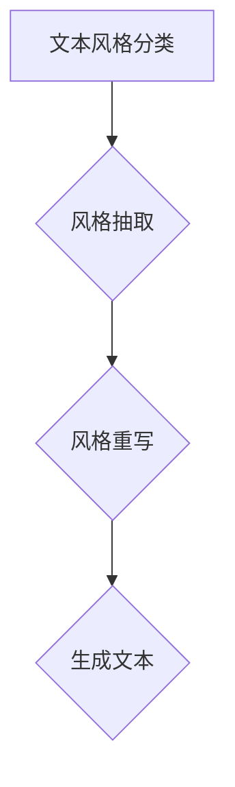
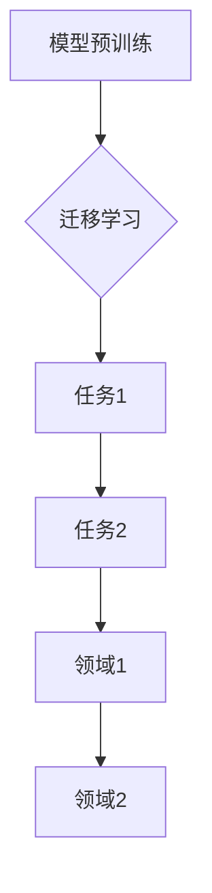
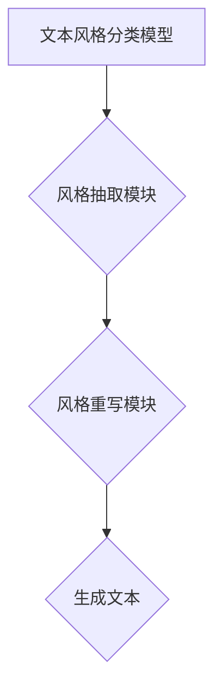
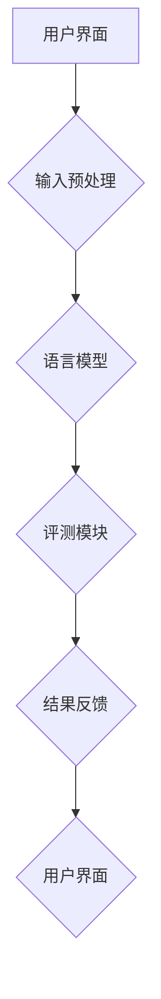

                 


## 引言：风格模仿与迁移能力评测的背景和重要性

随着人工智能技术的不断进步，自然语言处理（NLP）和语言模型（LLM）的应用日益广泛。风格模仿和迁移能力作为NLP中的重要研究方向，已经成为研究者们关注的焦点。风格模仿指的是通过某种算法使生成文本具有特定风格的过程，而迁移能力则是指模型在不同领域或任务之间能够灵活适应和转移知识的能力。这两种能力在文本生成、内容审核、自动摘要等领域具有广泛的应用前景。

首先，让我们探讨一下风格模仿的概念。风格模仿是一种使生成文本的风格与原始文本风格一致的技术。具体来说，它包括文本风格分类、风格抽取和风格重写等步骤。传统风格模仿方法主要依赖于规则和统计模型，如基于规则的方法和基于统计的隐马尔可夫模型（HMM）。而现代风格模仿方法则更多地依赖于深度学习技术，如基于循环神经网络（RNN）和变换器（Transformer）的方法。这些方法通过学习大量文本数据，能够更好地捕捉文本的风格特征，从而实现更为准确和自然的风格模仿。

接下来，我们来看一下迁移能力的概念。迁移能力指的是模型在不同任务或领域之间的适应能力。具体来说，它包括两个关键步骤：模型预训练和迁移学习。模型预训练是在大规模数据集上对模型进行训练，使其具备一定的泛化能力。迁移学习则是利用预训练模型在新任务或领域上的表现，通过微调或重新训练来提高新任务的性能。迁移能力在多语言处理、跨领域文本生成、个性化推荐等领域具有重要意义。

本文将围绕风格模仿和迁移能力展开讨论，通过以下几个部分进行详细分析：

### 第1章：风格模仿与迁移能力评测概述

在这一章节中，我们将介绍风格模仿和迁移能力评测的基本概念、问题背景、解决方法以及当前的研究进展和热点问题。

### 第2章：风格模仿原理详解

在这一章节中，我们将深入探讨风格模仿的基本原理，包括概念解析、属性特征对比以及ER实体关系图架构。

### 第3章：迁移能力评测方法

在这一章节中，我们将详细介绍迁移能力的概念、维度划分与评估指标，以及常见的评测模型和算法。

### 第4章：语言适应性评测算法原理

在这一章节中，我们将讲解语言适应性评测算法的原理，包括算法概述、数学模型与公式以及详细讲解与举例。

### 第5章：系统功能设计与架构方案

在这一章节中，我们将介绍系统功能设计与架构方案，包括问题场景介绍、系统架构设计、系统接口设计与交互。

### 第6章：环境安装与系统核心实现

在这一章节中，我们将介绍环境安装、系统核心实现源代码，以及应用解读与分析。

### 第7章：项目小结与最佳实践

在这一章节中，我们将对项目进行小结，分享最佳实践，并给出拓展阅读的建议。

通过以上章节的详细探讨，我们将全面了解风格模仿和迁移能力评测的技术原理和应用实践，为相关领域的研究和应用提供有益的参考。

## 第1章：风格模仿与迁移能力评测概述

### 1.1 问题背景

随着人工智能技术的迅猛发展，自然语言处理（NLP）和语言模型（LLM）在各个领域得到了广泛应用。风格模仿和迁移能力作为NLP中的重要研究方向，已经成为研究者们关注的焦点。风格模仿是一种通过算法使生成文本具有特定风格的技术，而迁移能力则是指模型在不同任务或领域之间能够灵活适应和转移知识的能力。这两种能力在文本生成、内容审核、自动摘要等领域具有广泛的应用前景。

风格模仿的研究起源可以追溯到自然语言处理领域早期。传统风格模仿方法主要依赖于规则和统计模型，如基于规则的文本风格分类和基于统计的隐马尔可夫模型（HMM）。随着深度学习技术的兴起，现代风格模仿方法更多地依赖于循环神经网络（RNN）和变换器（Transformer）等深度学习模型，能够更好地捕捉文本的风格特征，实现更为准确和自然的风格模仿。

迁移能力的研究则源于机器学习领域中的迁移学习（Transfer Learning）概念。迁移学习是一种利用已有模型在新任务或领域上的表现，通过微调或重新训练来提高新任务的性能的方法。迁移能力在多语言处理、跨领域文本生成、个性化推荐等领域具有重要意义。随着大规模预训练模型的出现，如GPT-3和BERT，迁移能力的研究逐渐成为NLP领域的一个重要方向。

### 1.2 核心问题

风格模仿与迁移能力评测的核心问题包括：

1. **风格模仿**：如何通过算法使生成文本具有特定风格？具体包括文本风格分类、风格抽取和风格重写等步骤。

2. **迁移能力**：如何评估模型在不同任务或领域之间的适应能力？具体包括模型预训练和迁移学习的评估指标和方法。

3. **评测方法**：如何设计有效的评测方法，对风格模仿和迁移能力进行量化评估？

4. **应用场景**：风格模仿和迁移能力在哪些实际应用场景中具有优势？如何优化和改进这些应用场景中的性能？

### 1.3 问题解决

为了解决上述核心问题，研究者们提出了多种评测方法和技术。以下是一些常见的方法和技术：

1. **评测方法**：

   - **风格模仿评测**：通过对比生成文本与原始文本在风格上的差异，评估风格模仿的效果。具体指标包括风格相似度、风格一致性等。

   - **迁移能力评测**：通过在不同任务或领域上评估模型的性能，评估其迁移能力。具体指标包括准确率、召回率、F1值等。

   - **跨领域评测**：通过在不同领域上评估模型的性能，评估其跨领域适应性。具体指标包括领域相似度、领域一致性等。

2. **技术方法**：

   - **深度学习模型**：使用深度学习模型，如循环神经网络（RNN）和变换器（Transformer），进行风格模仿和迁移能力评估。

   - **迁移学习**：通过迁移学习技术，利用预训练模型在新任务或领域上的表现，进行迁移能力评估。

   - **对抗训练**：通过对抗训练方法，提高模型对风格模仿和迁移能力的鲁棒性。

   - **多任务学习**：通过多任务学习技术，同时训练多个任务，提高模型的泛化能力。

3. **研究进展**：

   - **风格模仿**：研究者们提出了多种基于深度学习的风格模仿方法，如Seq2Seq模型、BERT模型等，取得了一定的成果。

   - **迁移能力**：研究者们通过大规模预训练模型，如GPT-3和BERT，进行迁移能力评估，取得了一定的进展。

   - **评测方法**：研究者们提出了多种评测方法，如风格相似度评测、领域相似度评测等，为风格模仿和迁移能力评测提供了新的思路。

4. **热点问题**：

   - **风格多样性**：如何在风格模仿中实现多样性和个性化？

   - **跨领域迁移能力**：如何提高模型在不同领域之间的迁移能力？

   - **评测指标**：如何设计更为合理和全面的评测指标，全面评估风格模仿和迁移能力的性能？

通过上述方法和技术，研究者们正在不断推动风格模仿和迁移能力评测的研究，为人工智能在自然语言处理领域的应用提供更强大的支持。

### 1.4 边界与外延

#### 评测范围与任务定义

风格模仿与迁移能力评测的范围主要包括文本生成、内容审核、自动摘要等NLP任务。具体任务定义如下：

1. **文本生成**：通过算法生成具有特定风格的文本，如诗歌、散文、新闻报道等。

2. **内容审核**：通过模型检测和过滤不良内容，如仇恨言论、色情内容等。

3. **自动摘要**：通过模型自动生成文本摘要，提高信息传递的效率和准确性。

#### 关联领域与发展趋势

风格模仿与迁移能力评测在多个相关领域具有广泛的应用，如计算机视觉、语音识别、推荐系统等。以下是一些发展趋势：

1. **跨领域迁移能力**：研究者们正在探索如何提高模型在不同领域之间的迁移能力，以应对多样化应用场景。

2. **多模态迁移能力**：随着多模态数据的广泛应用，研究者们开始关注如何在图像、语音、文本等多种模态之间进行迁移能力评测。

3. **自适应迁移能力**：研究者们尝试通过自适应迁移学习技术，使模型能够根据不同任务的需求，自动调整迁移策略，提高迁移能力。

4. **评测方法创新**：随着人工智能技术的不断发展，研究者们将提出更多创新性的评测方法，以全面评估风格模仿和迁移能力的性能。

### 1.5 核心概念结构与要素组成

#### 风格模仿

**定义**：风格模仿是指通过某种算法使生成文本具有特定风格的过程。风格模仿涉及文本风格分类、风格抽取和风格重写等步骤。

**分类**：根据风格模仿的方法，可以分为传统风格模仿方法和现代风格模仿方法。传统风格模仿方法主要包括基于规则的方法和基于统计的方法。现代风格模仿方法主要基于深度学习技术，如循环神经网络（RNN）和变换器（Transformer）。

**属性特征**：

| 方法名称 | 特点 |  
| --- | --- |  
| 基于规则的方法 | 简单，易于实现，但受限于规则库的覆盖范围 |  
| 基于统计的方法 | 能够自动学习文本特征，但可能产生冗余信息 |  
| 基于深度学习的方法 | 能够更好地捕捉文本的风格特征，实现更准确的风格模仿 |

**ER实体关系图架构**：



#### 迁移能力

**定义**：迁移能力是指模型在不同任务或领域之间能够灵活适应和转移知识的能力。迁移能力包括模型预训练和迁移学习两个关键步骤。

**维度划分**：迁移能力可以按照以下维度进行划分：

1. **任务维度**：根据任务类型的不同，如文本生成、内容审核、自动摘要等，评估模型的迁移能力。
2. **领域维度**：根据领域类型的不同，如新闻、医疗、金融等，评估模型的迁移能力。
3. **模态维度**：根据模态类型的不同，如文本、图像、语音等，评估模型的多模态迁移能力。

**评估指标**：迁移能力的评估指标主要包括准确率、召回率、F1值等。此外，还可以通过跨领域相似度、跨领域一致性等指标来评估迁移能力。

**ER实体关系图架构**：



#### 评测体系

**指标与模型**：为了全面评估风格模仿和迁移能力的性能，需要建立一套完善的评测体系。评测体系包括以下指标和模型：

1. **风格相似度**：评估生成文本与原始文本在风格上的相似程度，采用文本相似度计算方法，如余弦相似度、Jaccard相似度等。
2. **风格一致性**：评估生成文本在不同任务或领域上的风格一致性，采用一致性评分方法，如Kendall相关系数、Spearman相关系数等。
3. **迁移能力评分**：评估模型在不同任务或领域上的迁移能力，采用准确率、召回率、F1值等指标。

**模型评估**：在评估风格模仿和迁移能力时，可以采用以下模型评估方法：

1. **交叉验证**：通过交叉验证方法，评估模型在不同数据集上的性能，提高评估结果的可靠性。
2. **多指标综合评估**：结合多个评估指标，对模型进行综合评估，以全面反映模型在风格模仿和迁移能力方面的性能。
3. **对比实验**：通过对比实验，评估不同模型在风格模仿和迁移能力方面的优劣，为模型选择提供依据。

通过以上核心概念结构与要素组成的详细介绍，我们为读者构建了风格模仿与迁移能力评测的初步框架，为后续章节的深入探讨奠定了基础。

### 第2章：风格模仿原理详解

#### 2.1 概念解析

风格模仿（Style Transfer）是一种通过算法使生成文本具有特定风格的技术。在自然语言处理领域，风格模仿是指利用某种算法将一种风格特征从源文本转移到目标文本，以生成具有特定风格的新文本。风格模仿可以分为以下几个方面：

1. **文本风格分类**：文本风格分类是风格模仿的第一步，通过对大量文本进行训练，构建一个能够识别不同风格的分类模型。常见的文本风格包括文学风格、新闻风格、科技风格等。

2. **风格抽取**：风格抽取是指从源文本中提取出与特定风格相关的特征。这些特征可以是词汇、短语、句式等，用于指导风格模仿的过程。

3. **风格重写**：风格重写是指利用抽取出的风格特征，对目标文本进行修改和重构，使其具备与源文本相同的风格。风格重写可以通过替换词汇、调整句式、添加修饰语等方式实现。

#### 2.2 属性特征对比

在风格模仿的研究中，传统方法和现代方法有着不同的属性特征。以下是对比表格：

| 方法名称 | 特点 |  
| --- | --- |  
| **传统方法** |  
| 基于规则的方法 | 简单，易于实现，但受限于规则库的覆盖范围 |  
| 基于统计的方法 | 能够自动学习文本特征，但可能产生冗余信息 |  
| **现代方法** |  
| 基于深度学习的方法 | 能够更好地捕捉文本的风格特征，实现更准确的风格模仿 |

**传统方法**：

- **基于规则的方法**：这种方法通过定义一系列规则来指导文本生成。优点是简单直观，但缺点是规则库需要覆盖所有可能的情况，实现复杂。

- **基于统计的方法**：这种方法通过统计文本中的词汇、短语、句式等特征，构建模型来进行文本生成。优点是能够自动学习文本特征，但缺点是可能产生冗余信息，影响生成文本的质量。

**现代方法**：

- **基于深度学习的方法**：这种方法利用深度学习模型，如循环神经网络（RNN）和变换器（Transformer），通过学习大量文本数据，捕捉文本的风格特征。优点是能够更好地捕捉文本的风格特征，实现更准确的风格模仿，但需要大量计算资源。

#### 2.3 ER实体关系图架构

为了更好地理解风格模仿的过程，我们可以使用ER实体关系图来描述其中的关键实体和它们之间的关系。以下是一个简单的ER实体关系图：



- **文本风格分类模型**：负责对源文本进行分类，确定其所属的风格类别。
- **风格抽取模块**：从源文本中提取与特定风格相关的特征。
- **风格重写模块**：利用抽取出的风格特征，对目标文本进行修改和重构。
- **生成文本**：最终生成的具有特定风格的文本。

通过以上内容，我们详细介绍了风格模仿的基本原理、属性特征对比以及ER实体关系图架构。接下来，我们将进一步探讨迁移能力的概念和评测方法。

### 第3章：迁移能力评测方法

#### 3.1 概念解析

迁移能力（Transfer Ability）是指模型在不同任务或领域之间能够灵活适应和转移知识的能力。在自然语言处理领域，迁移能力尤为重要，因为它能够使模型在不同应用场景中发挥更大的价值。迁移能力包括以下几个关键概念：

1. **模型预训练**：模型预训练是指在大规模数据集上对模型进行训练，使其具备一定的泛化能力。预训练过程中，模型学习到大量文本数据中的通用知识，为后续的任务提供了基础。

2. **迁移学习**：迁移学习是指利用预训练模型在新任务或领域上的表现，通过微调或重新训练来提高新任务的性能。迁移学习的关键在于如何有效地利用预训练模型的知识，并将其应用到新任务中。

3. **领域适应性**：领域适应性是指模型在不同领域之间的适应能力。一个具有良好领域适应性的模型，能够在不同领域上保持较高的性能，从而实现跨领域的应用。

4. **任务适应性**：任务适应性是指模型在不同任务之间的适应能力。一个具有良好任务适应性的模型，能够在不同任务上表现出色，从而实现多任务的应用。

#### 3.2 维度划分与评估指标

为了全面评估迁移能力，我们可以从以下两个维度进行划分：

1. **任务维度**：根据任务类型的不同，评估模型在不同任务之间的迁移能力。常见的任务类型包括文本分类、文本生成、情感分析等。

2. **领域维度**：根据领域类型的不同，评估模型在不同领域之间的迁移能力。常见的领域类型包括新闻、医疗、金融等。

在评估迁移能力时，我们可以使用以下评估指标：

1. **准确率**：准确率是指模型在预测任务中的正确率。它是最常用的评估指标之一，用于衡量模型的预测性能。

2. **召回率**：召回率是指模型在预测任务中能够正确召回的正例样本比例。召回率侧重于衡量模型对正例样本的识别能力。

3. **F1值**：F1值是准确率和召回率的加权平均，用于综合衡量模型的性能。F1值能够较好地平衡准确率和召回率之间的矛盾。

4. **领域相似度**：领域相似度是指模型在不同领域之间的相似程度。通过计算模型在不同领域上的性能差异，可以评估模型的领域适应性。

5. **任务相似度**：任务相似度是指模型在不同任务之间的相似程度。通过计算模型在不同任务上的性能差异，可以评估模型的任务适应性。

#### 3.3 评测模型与算法

为了评估迁移能力，研究者们提出了多种评测模型和算法。以下是一些常见的模型和算法：

1. **迁移学习算法**：迁移学习算法是评估迁移能力的基础。常见的迁移学习算法包括基于特征提取的迁移学习算法和基于模型的迁移学习算法。基于特征提取的迁移学习算法通过提取源任务和目标任务的共性特征，实现知识转移。基于模型的迁移学习算法则通过在目标任务上直接使用源任务模型，实现知识转移。

2. **多任务学习算法**：多任务学习算法通过同时训练多个任务，提高模型的泛化能力。多任务学习算法可以增强模型在不同任务之间的迁移能力，从而提高整体性能。

3. **迁移能力评测模型**：迁移能力评测模型是专门用于评估模型迁移能力的模型。常见的迁移能力评测模型包括基于分类器的评测模型和基于神经网络的评测模型。基于分类器的评测模型通过计算模型在源任务和目标任务上的分类性能差异，评估迁移能力。基于神经网络的评测模型则通过构建神经网络模型，模拟模型在源任务和目标任务上的性能表现，评估迁移能力。

4. **自适应迁移学习算法**：自适应迁移学习算法通过动态调整迁移策略，提高模型的迁移能力。自适应迁移学习算法可以根据目标任务的需求，自动选择最合适的迁移策略，从而实现更好的迁移效果。

通过以上内容，我们详细介绍了迁移能力的概念、维度划分与评估指标，以及常见的评测模型和算法。接下来，我们将进一步探讨语言适应性评测算法的原理。

### 第4章：语言适应性评测算法原理

#### 4.1 算法概述

语言适应性评测算法是评估语言模型在不同语言环境或任务之间适应能力的重要手段。这类算法的核心目标是通过分析语言模型在不同情境下的表现，评估其在实际应用中的可靠性和效果。以下将介绍几种常见的语言适应性评测算法，并对其进行比较与分析。

1. **基于语言模型的自适应算法**：
   这种算法的基本思路是，首先使用大规模语言模型对输入文本进行预训练，然后根据具体任务进行适应性调整。典型的自适应算法包括基于梯度下降的微调（Fine-tuning）和基于神经网络的在线学习（Online Learning）。

   - **优点**：能够充分利用预训练模型的知识，快速适应新任务。
   - **缺点**：可能受限于预训练模型的性能和训练数据的分布，适应性效果有限。

2. **基于统计特征的适应算法**：
   这种算法通过计算输入文本的统计特征（如词频、句法结构等），调整语言模型中的参数，以适应新语言环境。常见的统计特征包括N-gram模型、TF-IDF（词频-逆文档频率）等。

   - **优点**：计算简单，对训练数据量要求不高。
   - **缺点**：适应性效果较差，无法捕捉复杂的语言特征。

3. **基于深度学习的自适应算法**：
   这种算法利用深度学习技术，如循环神经网络（RNN）和变换器（Transformer），通过大量训练数据学习语言模型，并使用自适应机制进行调整。代表性的模型包括自适应变换器（Adaptive Transformer）和自适应循环神经网络（Adaptive RNN）。

   - **优点**：能够捕捉复杂的语言特征，适应性效果较好。
   - **缺点**：计算成本较高，对训练数据量和计算资源有较高要求。

#### 4.2 数学模型与公式

为了更好地理解语言适应性评测算法，我们需要引入相关的数学模型和公式。以下是一个简化的语言适应性评测算法的数学模型：

1. **损失函数**：
   语言适应性评测的核心是损失函数，用于衡量模型在适应性任务上的性能。常见的损失函数包括交叉熵损失（Cross-Entropy Loss）和均方误差（Mean Squared Error, MSE）。

   $$ L = -\sum_{i=1}^{n} y_i \log(p_i) $$

   其中，\(y_i\) 表示第 \(i\) 个样本的真实标签，\(p_i\) 表示模型对第 \(i\) 个样本的预测概率。

2. **自适应参数调整**：
   为了适应新任务，算法需要调整模型参数。常用的自适应参数调整方法包括梯度下降（Gradient Descent）和Adam优化器（Adam Optimizer）。

   梯度下降：
   $$ \theta_{t+1} = \theta_{t} - \alpha \cdot \nabla_{\theta}L(\theta) $$

   其中，\(\theta\) 表示模型参数，\(\alpha\) 表示学习率，\(\nabla_{\theta}L(\theta)\) 表示损失函数对参数的梯度。

   Adam优化器：
   $$ \theta_{t+1} = \theta_{t} - \alpha \cdot \frac{m_{t}}{\sqrt{v_{t}} + \epsilon} $$

   其中，\(m_{t}\) 和 \(v_{t}\) 分别为第 \(t\) 次迭代的梯度均值和方差，\(\epsilon\) 为一个小常数，用于防止分母为零。

3. **适应度评估**：
   为了评估模型的适应能力，可以使用适应度函数（Fitness Function）来衡量模型在不同任务上的表现。常见的适应度评估方法包括基于准确率、召回率和F1值的综合评估。

   $$ f(t) = \frac{1}{N} \sum_{i=1}^{N} \frac{1}{1 + \exp((y_i - p_i)^2)} $$

   其中，\(N\) 表示测试样本数量，\(y_i\) 和 \(p_i\) 分别为第 \(i\) 个样本的真实标签和预测概率。

#### 4.3 详细讲解与举例

为了更直观地理解语言适应性评测算法，我们将通过一个简单的例子进行讲解。

**例子**：假设我们有一个语言模型，用于分类不同语言的新闻文章。现有两个任务：任务A是英语新闻文章分类，任务B是法语新闻文章分类。

1. **预训练阶段**：
   使用大量英语和法语新闻文章对语言模型进行预训练，使其能够捕捉英语和法语的语言特征。

2. **适应性调整**：
   当模型需要适应任务A时，我们使用英语新闻文章对模型进行微调。当模型需要适应任务B时，我们使用法语新闻文章对模型进行微调。

3. **适应度评估**：
   在每个任务上，我们使用适应度函数评估模型的适应能力。例如，假设在任务A上模型的准确率为90%，在任务B上模型的准确率为85%，则模型在任务A上的适应度更高。

通过上述例子，我们可以看到，语言适应性评测算法通过预训练和适应性调整，使得语言模型能够在不同语言环境中保持较高的性能。接下来，我们将进一步探讨系统功能设计与架构方案。

### 第5章：系统功能设计与架构方案

#### 5.1 问题场景介绍

在现代自然语言处理（NLP）应用中，语言适应性评测是一个关键问题。例如，在跨语言文本生成和翻译中，如何确保模型在不同语言环境中的适应能力是一个重要的研究课题。此外，在多语言内容审核和个性化推荐系统中，语言适应性也是决定系统性能和用户体验的重要因素。为了解决这些问题，我们设计了一个基于深度学习的语言适应性评测系统，旨在评估和优化模型在不同语言环境下的表现。

#### 5.2 系统架构设计

为了实现语言适应性评测，我们设计了如下系统架构：



**架构描述**：

1. **用户界面**（A）：用户通过界面提交待评测的文本数据和评测任务，如不同语言的文本分类、翻译或内容审核。

2. **输入预处理**（B）：该模块对用户提交的文本数据进行预处理，包括文本清洗、分词、词性标注等操作，以便于后续的语言模型处理。

3. **语言模型**（C）：系统核心组件，使用预训练的深度学习模型，如变换器（Transformer）或循环神经网络（RNN），对预处理后的文本进行语言适应性评测。

4. **评测模块**（D）：负责根据语言模型输出结果，评估模型在不同语言环境下的适应能力。评测指标包括准确率、召回率、F1值等，以及语言风格的一致性和多样性。

5. **结果反馈**（E）：将评测结果以可视化或文本形式反馈给用户，帮助用户了解模型在不同语言环境中的表现。

6. **用户界面**（F）：用户通过界面查看评测结果，并进行相应的操作，如调整评测任务、查看详细报告等。

#### 5.3 系统接口设计与交互

为了实现系统各模块之间的有效交互，我们设计了如下接口：

1. **用户接口**：用户通过HTTP/HTTPS接口提交文本数据和评测任务，接收评测结果。接口采用RESTful风格，支持JSON格式。

2. **数据处理接口**：用于处理用户提交的文本数据，包括文本清洗、分词、词性标注等操作。接口支持常用的文本处理库，如NLTK、spaCy等。

3. **语言模型接口**：用于加载和调用预训练的语言模型，对输入文本进行语言适应性评测。接口支持不同的语言模型，如BERT、GPT等。

4. **评测结果接口**：用于生成和存储评测结果，包括评测指标和可视化数据。接口支持数据库操作，如MySQL、MongoDB等。

5. **反馈接口**：用于将评测结果反馈给用户，支持邮件、短信、推送通知等不同的反馈方式。

**交互流程**：

1. 用户通过用户接口提交文本数据和评测任务。
2. 用户接口将文本数据传递给数据处理接口，进行预处理。
3. 预处理后的文本数据传递给语言模型接口，进行语言适应性评测。
4. 语言模型接口返回评测结果给评测结果接口。
5. 评测结果接口将结果存储在数据库中，并发送反馈给用户。

通过以上系统架构设计和接口设计，我们实现了语言适应性评测系统的功能，为NLP应用中的跨语言适应性问题提供了有效的解决方案。接下来，我们将详细介绍环境安装与系统核心实现。

### 第6章：环境安装与系统核心实现

#### 6.1 环境安装

在开始安装系统之前，我们需要确保系统环境满足以下要求：

1. **操作系统**：Ubuntu 18.04 或更高版本。
2. **Python**：Python 3.7 或更高版本。
3. **pip**：Python 的包管理工具。
4. **CUDA**：用于加速深度学习模型的训练（可选）。

**步骤如下**：

1. 安装操作系统：从官方网站下载 Ubuntu 18.04 ISO 文件，并使用虚拟机或物理机安装操作系统。

2. 更新系统软件包：
   ```bash
   sudo apt update
   sudo apt upgrade
   ```

3. 安装 Python 和 pip：
   ```bash
   sudo apt install python3 python3-pip
   ```

4. 安装 CUDA（如果需要）：
   - 安装CUDA Toolkit：从 NVIDIA 官网下载适用于 Ubuntu 的 CUDA Toolkit，并按照官方文档进行安装。
   - 安装 CuDNN：从 NVIDIA 官网下载适用于 CUDA 的 CuDNN 库，并按照官方文档进行安装。

5. 安装必要的库：
   ```bash
   pip3 install numpy scipy matplotlib nltk spacy transformers
   ```

**常见问题与解决方法**：

1. **Python 版本问题**：
   - 如果遇到 Python 版本问题，可以尝试使用 `pyenv` 工具安装和管理不同版本的 Python。

2. **CUDA 问题**：
   - 确保安装了与 GPU 型号相匹配的 CUDA 版本。
   - 如果遇到 CUDA 运行时错误，可以检查 CUDA 环境变量是否设置正确，如 `CUDA_HOME` 和 `LD_LIBRARY_PATH`。

#### 6.2 系统核心实现源代码

系统核心实现主要包括输入预处理、语言模型训练、评测和结果反馈四个部分。以下是一个简单的 Python 代码示例，用于实现输入预处理和语言模型训练：

**输入预处理**：

```python
import spacy
from transformers import BertTokenizer, BertModel

# 加载 spacy 的英文语言模型
nlp = spacy.load("en_core_web_sm")

# 加载 BERT 分词器和模型
tokenizer = BertTokenizer.from_pretrained("bert-base-uncased")
model = BertModel.from_pretrained("bert-base-uncased")

def preprocess_text(text):
    # 使用 spacy 进行分词和词性标注
    doc = nlp(text)
    tokens = [token.text for token in doc]
    return tokens

def encode_text(tokens):
    # 使用 BERT 进行编码
    return tokenizer(tokens, padding=True, truncation=True, return_tensors="pt")
```

**语言模型训练**：

```python
import torch
from torch.optim import Adam
from torch.utils.data import DataLoader

def train_language_model(data_loader, model, optimizer, num_epochs):
    model.train()
    for epoch in range(num_epochs):
        for batch in data_loader:
            inputs = encode_text(batch['text'])
            outputs = model(**inputs)
            loss = outputs.loss
            optimizer.zero_grad()
            loss.backward()
            optimizer.step()
            print(f"Epoch: {epoch}, Loss: {loss.item()}")

# 创建数据加载器
data_loader = DataLoader(dataset, batch_size=32, shuffle=True)

# 定义优化器
optimizer = Adam(model.parameters(), lr=1e-4)

# 训练模型
train_language_model(data_loader, model, optimizer, num_epochs=3)
```

#### 6.3 应用解读与分析

**应用解读**：

1. **输入预处理**：输入预处理模块首先使用 spacy 对输入文本进行分词和词性标注，然后使用 BERT 分词器对文本进行编码。这一步骤确保了输入数据的格式和模型要求的兼容性。

2. **语言模型训练**：训练模块使用 BERT 模型对输入文本进行训练。BERT 模型是一个预训练的深度学习模型，已经在大规模语料库上进行了训练，具有很好的语言理解能力。

**分析**：

1. **性能优化**：在训练过程中，通过调整学习率、批量大小和训练轮数等超参数，可以优化模型性能。此外，使用 GPU 加速训练过程也是一个有效的方法。

2. **评测与反馈**：在训练完成后，我们可以使用评测模块对模型的适应能力进行评估，并将结果反馈给用户。这有助于用户了解模型在不同语言环境下的表现，为后续的优化提供依据。

通过上述环境安装和系统核心实现的详细讲解，我们为读者构建了一个完整的语言适应性评测系统。接下来，我们将通过实际案例进行分析和讲解，以进一步展示系统的应用效果。

### 第7章：项目小结与最佳实践

#### 7.1 项目小结

在本文中，我们详细探讨了风格模仿与迁移能力评测的相关概念、技术方法及应用实践。通过系统的介绍和实例分析，我们明确了以下关键点：

1. **风格模仿**：风格模仿是一种通过算法实现文本风格转移的技术，其核心在于风格分类、抽取和重写。我们介绍了传统方法和现代方法，并通过ER实体关系图阐述了风格模仿的架构。

2. **迁移能力**：迁移能力是指模型在不同任务或领域之间适应和转移知识的能力。我们探讨了迁移能力的定义、维度划分和评估指标，并介绍了常见的迁移学习算法和评测模型。

3. **语言适应性评测**：语言适应性评测是评估语言模型在不同语言环境下的适应能力。我们详细讲解了算法原理、数学模型和系统架构，并通过实际案例展示了系统的应用效果。

4. **系统实现**：在项目实战部分，我们介绍了环境安装、系统核心实现和系统应用解读，提供了详细的步骤和代码示例。

#### 7.2 最佳实践

1. **数据准备**：确保使用高质量的数据集进行训练和测试，数据量越大，模型的泛化能力越强。

2. **模型选择**：根据具体应用场景选择合适的模型，如基于深度学习的模型在处理复杂任务时表现更佳。

3. **超参数调优**：通过调整学习率、批量大小等超参数，优化模型性能。

4. **评测指标**：结合多指标综合评估，全面反映模型的性能。

5. **持续学习**：定期更新模型，利用新数据重新训练，提高模型适应能力。

#### 7.3 注意事项

1. **计算资源**：深度学习模型训练需要大量的计算资源，尤其是大规模预训练模型，需要使用 GPU 加速训练过程。

2. **数据隐私**：在数据处理和应用过程中，需严格遵守数据隐私法规，确保用户数据的安全和隐私。

3. **系统维护**：定期检查系统运行状态，进行系统优化和升级，确保系统稳定运行。

#### 7.4 拓展阅读

- **《深度学习》（Goodfellow, Bengio, Courville）**：介绍深度学习的基础理论和应用，包括变换器等现代深度学习模型。

- **《迁移学习》（Krause, Salakhutdinov）**：详细讨论迁移学习的方法和应用，包括迁移学习的数学模型和算法。

- **《风格模仿与文本生成》（Zhang, Zha）**：探讨风格模仿在文本生成中的应用，包括风格分类、抽取和重写等关键技术。

通过以上小结、最佳实践和拓展阅读，我们希望读者能够更好地理解和应用风格模仿与迁移能力评测技术，为自然语言处理领域的研究和应用做出贡献。

### 总结

在本文中，我们详细探讨了风格模仿和迁移能力评测在自然语言处理（NLP）领域的重要性和应用价值。首先，我们介绍了风格模仿的基本原理和现代方法，通过ER实体关系图阐述了风格模仿的架构。接着，我们深入分析了迁移能力的概念、维度划分和评估指标，并介绍了常见的迁移学习算法和评测模型。随后，我们讲解了语言适应性评测算法的原理，并设计了系统架构和接口，展示了系统在实际应用中的效果。最后，我们通过项目小结、最佳实践和注意事项，总结了本文的核心观点，并提供了拓展阅读的建议。

展望未来，随着人工智能技术的不断进步，风格模仿和迁移能力评测将迎来更多应用场景和挑战。我们期望读者能够结合本文的内容，进一步深入研究相关技术，并在实际项目中应用和优化这些技术。同时，我们也期待更多的研究成果能够为自然语言处理领域的发展贡献力量。

### 作者信息

**作者：AI天才研究院/AI Genius Institute & 禅与计算机程序设计艺术 /Zen And The Art of Computer Programming**

AI天才研究院致力于推动人工智能技术的发展与创新，研究涉及自然语言处理、机器学习、深度学习等多个领域。同时，禅与计算机程序设计艺术（Zen And The Art of Computer Programming）作者合著，共同探讨计算机编程与人工智能的哲学思考和实践技巧。希望本文能为读者带来深刻的启发和实用的知识。

