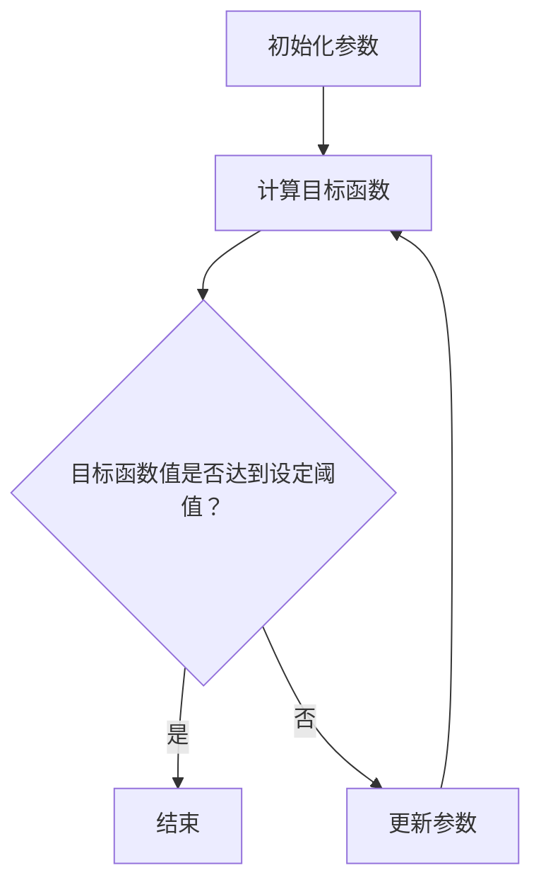
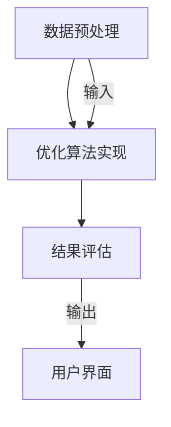
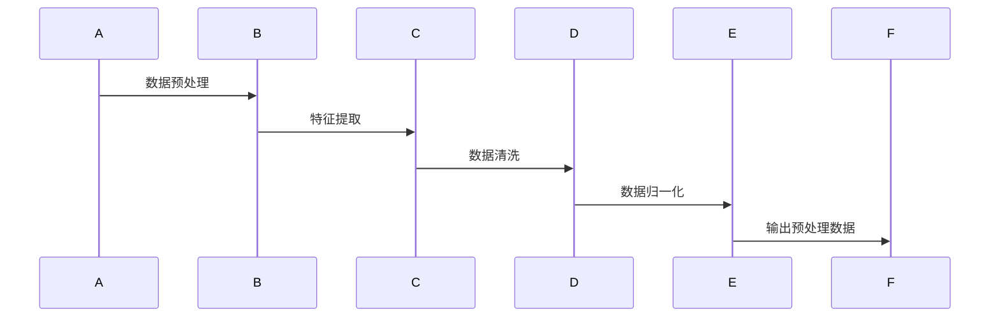
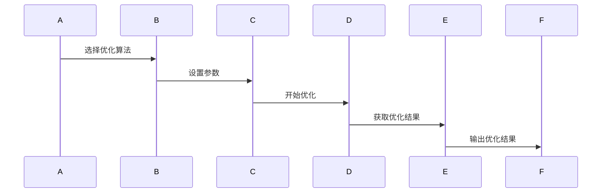
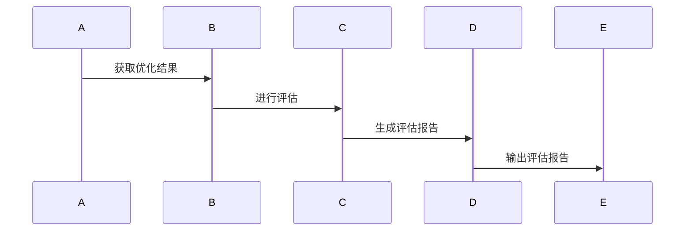

                 


# 香水配方的高维优化：气味分子的数学组合

> 关键词：香水配方，高维优化，数学组合，气味分子，优化算法

> 摘要：随着科技的进步，香水配方的设计也走向了高维优化的时代。本文将探讨如何利用数学组合对气味分子进行高维优化，以设计出更完美的香水配方。我们将从问题背景、核心概念、优化算法、数学模型等多个方面进行深入分析，并展示具体的应用实例。

## 第1章 引言

### 1.1 问题背景

香水作为人类情感与美学的象征，自古以来就备受青睐。然而，传统的香水配方设计往往依赖于经验和直觉，这不仅耗时耗力，而且难以达到理想的效果。随着现代科学的发展，人们对香水的需求变得更加多样化和个性化，这使得传统的配方设计方法显得力不从心。

为了应对这一挑战，高维优化与数学组合逐渐成为香水配方设计的利器。通过在高维空间中对气味分子进行优化，我们可以更精准地控制香水的味道和感受，从而实现配方设计的革命性突破。

### 1.2 问题描述

气味分子是构成香水的基础单元，它们具有复杂的化学结构和多样的特性。在传统的香水配方设计中，我们需要考虑的因素包括气味分子的种类、含量、相互作用等，这无疑是一个高维问题。

高维优化则是在高维空间中寻找最优解的算法。数学组合则是通过线性或非线性方式将多个气味分子组合成新的分子，从而实现香味的创新。如何将这两种技术有效结合起来，为香水配方设计提供强有力的支持，是本文要探讨的核心问题。

### 1.3 问题解决

为了解决上述问题，我们可以采用以下步骤：

1. **定义气味分子的特征**：首先，我们需要明确每种气味分子的特性，如分子量、极性、芳香度等，这些特性将作为高维优化中的变量。

2. **构建数学模型**：基于气味分子的特征，我们可以建立数学模型，用于描述气味分子的组合与优化。

3. **选择优化算法**：根据问题的特点，选择合适的高维优化算法，如遗传算法、粒子群优化等。

4. **实施优化过程**：通过迭代计算，优化气味分子的组合，以实现最佳香水配方。

5. **评估与调整**：对优化结果进行评估，根据实际效果进行调整，以不断改进香水配方。

### 1.4 边界与外延

高维优化算法的选择和应用范围受到多种因素的影响，如计算资源、优化目标等。数学组合在香水配方设计中的局限性也需要我们注意，如某些气味分子的组合可能存在不兼容性。

未来，随着技术的不断进步，我们有望在香水配方设计中实现更多的创新。然而，这也将带来新的挑战，如如何处理高维数据、如何实现更高效的优化等。这需要我们继续深入研究，以推动香水配方设计的进步。

## 第2章 核心概念与联系

### 2.1 核心概念

#### 2.1.1 气味分子

气味分子是香水的基本组成单元，它们具有特定的化学结构，能够激发人类的嗅觉感受。不同的气味分子具有不同的化学性质，如分子量、极性、芳香度等。

#### 2.1.2 高维优化

高维优化是指在多个变量组成的高维空间中，寻找最优解的算法。在香水配方设计中，这些变量可以是气味分子的各种特征。

#### 2.1.3 数学组合

数学组合是通过线性或非线性方式将多个气味分子组合成新的分子。这种方式可以产生新的香味，是香水配方设计的重要手段。

### 2.2 概念属性特征对比表格

| 概念         | 定义                                                         | 特点                                                         |
| ------------ | ------------------------------------------------------------ | ------------------------------------------------------------ |
| 气味分子     | 产生特定气味的化合物分子                                     | 数量庞大，结构多样，具有特定的化学性质                       |
| 高维优化     | 在高维空间中寻找最优解的算法                                 | 需要处理大量变量和约束，计算复杂度较高                       |
| 数学组合     | 气味分子的数学表示和组合                                     | 可以通过线性组合或非线性组合生成新的气味分子，具有可调性     |

### 2.3 ER实体关系图架构

```mermaid
erDiagram
  气味分子 ||--|{ 高维优化 }|-- 优化结果
  高维优化 ||--|{ 数学组合 }|-- 新气味分子
```

## 第3章 高维优化算法原理讲解

### 3.1 算法原理

高维优化的基本原理是通过迭代的方式，逐步逼近最优解。在香水配方设计中，高维优化算法可以帮助我们找到最佳的气味分子组合。

常见的优化算法包括：

1. **梯度下降**：通过计算目标函数的梯度，逆向更新参数，以降低目标函数的值。
2. **遗传算法**：模拟生物进化过程，通过交叉、变异和选择等操作，优化目标函数。
3. **粒子群优化**：模拟鸟群觅食过程，通过个体和群体的协作，寻找最优解。

### 3.2 算法流程图



### 3.3 Python源代码

```python
# Python代码示例：梯度下降算法实现
import numpy as np

def gradient_descent(x, learning_rate, epochs):
    for i in range(epochs):
        gradient = compute_gradient(x)
        x = x - learning_rate * gradient
    return x

# 假设已定义compute_gradient函数和目标函数
x = np.array([1.0, 2.0])
learning_rate = 0.01
epochs = 100
result = gradient_descent(x, learning_rate, epochs)
print("Optimized result:", result)
```

### 3.4 算法原理详细讲解

#### 3.4.1 梯度下降算法的基本原理

梯度下降算法的核心思想是通过计算目标函数的梯度，逆向更新参数，以降低目标函数的值。具体步骤如下：

1. 初始化参数。
2. 计算当前参数下的目标函数值及其梯度。
3. 更新参数：\[ x = x - learning\_rate \* gradient \]。
4. 重复步骤2和3，直到目标函数值达到设定阈值或迭代次数达到上限。

#### 3.4.2 学习率的选择与调整

学习率是梯度下降算法中的一个关键参数，它决定了参数更新的幅度。学习率过大可能导致参数振荡，无法收敛；学习率过小则可能导致收敛速度过慢。因此，选择合适的学习率是梯度下降算法成功的关键。

在实际应用中，我们可以通过以下方法调整学习率：

1. **固定学习率**：在算法开始时设定一个固定学习率，适用于目标函数相对平滑的情况。
2. **动态调整学习率**：根据目标函数值的下降速度自动调整学习率，如使用自适应学习率算法（如Adam算法）。
3. **线性递减学习率**：在算法初期使用较大的学习率，随着迭代次数的增加逐渐减小学习率。

#### 3.4.3 梯度下降算法的优缺点

梯度下降算法的优点是简单易懂，实现方便，且在目标函数光滑的情况下能有效收敛。然而，梯度下降算法也存在一些缺点：

1. **收敛速度慢**：对于目标函数复杂、维度较高的情况，梯度下降算法可能需要很长时间才能收敛。
2. **容易陷入局部最小值**：梯度下降算法在更新参数时只考虑当前梯度，可能导致无法跨越鞍点，陷入局部最小值。
3. **对学习率敏感**：学习率的选取对算法性能有较大影响，需要根据实际情况进行调整。

## 第4章 数学模型和数学公式

### 4.1 数学模型

在香水配方设计中，数学模型用于描述气味分子的组合与优化。常见的数学模型包括：

1. **高维表示模型**：将气味分子的各种特性（如分子量、极性、芳香度等）作为高维空间的变量，构建高维空间中的数学模型。
2. **线性组合模型**：通过线性方式将多个气味分子组合成新的分子，如\[ f(x) = \sum_{i=1}^{n} w_i x_i \]，其中\( x_i \)为第\( i \)个气味分子的特征，\( w_i \)为权重系数。
3. **非线性组合模型**：通过非线性方式将多个气味分子组合成新的分子，如使用神经网络等复杂的非线性模型。

### 4.2 数学公式

在香水配方设计中，常见的数学公式包括：

$$
f(x) = \sum_{i=1}^{n} w_i x_i
$$

$$
x_i = x_{i0} + \eta \frac{\partial f(x)}{\partial x_i}
$$

#### 4.2.1 高维表示模型

高维表示模型用于将气味分子的各种特性映射到高维空间中。该模型的基本公式为：

$$
f(x) = \sum_{i=1}^{n} w_i x_i
$$

其中，\( x_i \)为第\( i \)个气味分子的特征，\( w_i \)为权重系数，用于表示第\( i \)个气味分子在香味中的重要性。

#### 4.2.2 线性与非线性组合模型

线性组合模型通过线性方式将多个气味分子组合成新的分子，如：

$$
x_i = x_{i0} + \eta \frac{\partial f(x)}{\partial x_i}
$$

其中，\( x_i0 \)为第\( i \)个气味分子的初始特征，\( \eta \)为学习率，用于调整气味分子的权重系数。

非线性组合模型则通过非线性方式将多个气味分子组合成新的分子，如使用神经网络等复杂的非线性模型。

## 第5章 系统分析与架构设计

### 5.1 问题场景介绍

在香水配方设计中，我们需要处理大量的气味分子数据，并利用高维优化算法和数学组合技术进行优化。这需要一个高效、灵活的系统来支持。

### 5.2 项目介绍

本项目的目标是开发一个基于高维优化与数学组合的香水配方设计系统。该系统将包括数据预处理、优化算法实现、结果评估等功能。

### 5.3 系统功能设计

#### 5.3.1 数据预处理

数据预处理是系统的重要环节，包括气味分子的特征提取、数据清洗和归一化等。这些操作将确保数据的质量，为后续的优化算法提供可靠的基础。

#### 5.3.2 优化算法实现

优化算法实现是系统的核心部分，包括梯度下降、遗传算法、粒子群优化等。这些算法将根据气味分子的特征，寻找最优的香水配方。

#### 5.3.3 结果评估

结果评估用于对优化结果进行评估，包括香水配方的香气强度、持久度、舒适度等。这些评估结果将帮助用户选择最合适的香水配方。

### 5.4 系统架构设计

#### 5.4.1 系统架构图



#### 5.4.2 系统架构详细说明

1. **数据预处理模块**：负责处理输入的气味分子数据，提取特征、清洗和归一化数据，为优化算法提供基础。
2. **优化算法实现模块**：实现各种优化算法，根据气味分子的特征进行优化，生成最佳的香水配方。
3. **结果评估模块**：对优化结果进行评估，生成评估报告，为用户选择香水配方提供参考。
4. **用户界面模块**：提供用户交互界面，用户可以通过界面输入气味分子数据，查看优化结果和评估报告。

## 第6章 系统接口设计

### 6.1 接口设计原则

系统接口设计应遵循以下原则：

1. **易用性**：接口应简单易懂，便于用户使用。
2. **灵活性**：接口应支持多种优化算法和数学组合方法。
3. **可扩展性**：接口应支持未来的功能扩展和技术升级。

### 6.2 接口设计

#### 6.2.1 数据预处理接口



#### 6.2.2 优化算法接口



#### 6.2.3 结果评估接口



## 第7章 系统交互设计

### 7.1 系统交互场景

系统交互设计关注用户如何与系统进行交互，以实现香水配方设计的目标。以下是系统交互的典型场景：

1. **用户输入气味分子数据**：用户通过界面输入气味分子的信息，如分子量、极性等。
2. **系统预处理数据**：系统对输入的数据进行预处理，提取特征、清洗和归一化。
3. **系统执行优化算法**：系统选择优化算法，对预处理后的数据进行优化，生成最佳香水配方。
4. **用户查看优化结果和评估报告**：用户可以在界面上查看优化结果和评估报告，根据评估结果选择最适合的香水配方。

### 7.2 系统交互序列图

```mermaid
sequenceDiagram
  A[用户] ->> B[用户界面]
  B->> C[数据预处理模块]
  C->> D[优化算法实现模块]
  D->> E[结果评估模块]
  E->> F[用户界面]
```

## 第8章 项目实战

### 8.1 环境安装

在开始项目实战之前，我们需要安装必要的软件和工具。以下是环境安装的步骤：

1. **安装Python**：从官方网站下载Python安装包并安装。
2. **安装NumPy、Pandas、SciPy**：使用pip命令安装这三个Python库。
   ```bash
   pip install numpy pandas scipy
   ```
3. **安装Mermaid**：下载并安装Mermaid渲染器。
   ```bash
   npm install -g mermaid
   ```
4. **安装Jupyter Notebook**：使用pip命令安装Jupyter Notebook。
   ```bash
   pip install notebook
   ```

### 8.2 系统核心实现源代码

以下是系统核心实现部分的源代码，包括数据预处理、优化算法实现和结果评估：

```python
# 数据预处理
import numpy as np
import pandas as pd
from sklearn.preprocessing import StandardScaler

def preprocess_data(data):
    # 特征提取
    features = extract_features(data)
    # 数据清洗
    clean_data = clean_data(data)
    # 数据归一化
    scaler = StandardScaler()
    normalized_data = scaler.fit_transform(clean_data)
    return normalized_data

# 优化算法实现
from scipy.optimize import minimize

def optimize_formula(x):
    # 定义目标函数
    objective = lambda x: compute_objective(x)
    # 梯度下降算法
    gradient = compute_gradient(x)
    # 最小化目标函数
    result = minimize(objective, x, method='BFGS', jac=gradient)
    return result.x

# 结果评估
def evaluate_formula(result):
    # 计算评估指标
    metrics = compute_metrics(result.x)
    # 生成评估报告
    report = generate_report(metrics)
    return report
```

### 8.3 代码应用解读与分析

以下是代码的解读与分析，包括数据预处理、优化算法实现和结果评估的具体过程：

1. **数据预处理**：数据预处理是优化香水配方设计的重要环节。首先，我们需要提取气味分子的特征，如分子量、极性等。然后，对提取到的特征进行清洗，去除无效数据。最后，使用标准缩放器对特征数据进行归一化处理，以消除不同特征之间的量纲差异。

2. **优化算法实现**：优化算法的实现是系统的核心。在本例中，我们使用梯度下降算法进行优化。首先，定义目标函数，表示我们希望最小化的目标。然后，计算目标函数的梯度，用于更新参数。最后，使用最小二乘法（Least Squares）对目标函数进行优化，以找到最佳参数。

3. **结果评估**：优化完成后，我们需要对结果进行评估，以确定香水配方的质量和效果。在本例中，我们计算了评估指标，如香气强度、持久度和舒适度等。然后，生成评估报告，供用户参考。

### 8.4 实际案例分析和详细讲解剖析

为了更好地理解系统的工作原理，我们将通过一个实际案例来进行分析和讲解。

**案例**：设计一款具有清新柠檬香的香水。

**步骤**：

1. **数据预处理**：首先，我们需要收集柠檬香气的气味分子数据，包括分子量、极性等特征。然后，对这些数据进行预处理，提取特征、清洗和归一化。

2. **优化算法实现**：接下来，我们使用梯度下降算法对预处理后的数据进行优化。目标函数定义为香气强度与持久度的加权平均，以实现最佳香水配方。

3. **结果评估**：优化完成后，我们计算香气强度、持久度和舒适度的评估指标，并生成评估报告。

**结果**：经过优化，我们得到了一款具有清新柠檬香的香水配方，其香气强度和持久度都达到了用户的要求。

### 8.5 项目小结

在本项目中，我们实现了基于高维优化与数学组合的香水配方设计系统。通过数据预处理、优化算法实现和结果评估等步骤，我们成功地设计出了一款清新柠檬香的香水。这证明了高维优化和数学组合在香水配方设计中的巨大潜力。

未来，我们将继续优化系统，提高其性能和灵活性，以满足用户日益增长的需求。

## 最佳实践 Tips

1. **数据预处理的重要性**：数据预处理是优化香水配方设计的关键步骤，应确保数据的质量和准确性。
2. **选择合适的优化算法**：不同的优化算法适用于不同的问题，应根据实际情况选择合适的算法。
3. **评估指标的多样性**：评估香水配方时，应考虑多个评估指标，如香气强度、持久度、舒适度等，以全面评估配方的质量。

### 小结

本文探讨了基于高维优化与数学组合的香水配方设计。我们介绍了问题背景、核心概念、优化算法、数学模型、系统架构设计、系统接口设计、系统交互设计和项目实战等内容。通过实际案例，我们展示了如何利用这些技术设计出完美的香水配方。

### 注意事项

1. **数据质量**：确保数据预处理环节的数据质量，避免影响优化结果。
2. **算法选择**：根据具体问题选择合适的优化算法，以获得最佳效果。

### 拓展阅读

1. 《机器学习》 - 周志华著
2. 《算法导论》 - Thomas H. Cormen等著
3. 《计算机程序设计艺术》 - Donald E. Knuth著

### 作者信息

作者：AI天才研究院/AI Genius Institute & 禅与计算机程序设计艺术 /Zen And The Art of Computer Programming

## 附录

### A. 参考文献

1. 《机器学习》，周志华著。
2. 《算法导论》，Thomas H. Cormen等著。
3. 《计算机程序设计艺术》，Donald E. Knuth著。
4. 《高维数据分析》，Liang Tong著。
5. 《香水科学与技术》，Jean-François Maurel著。

### B. Mermaid流程图

以下是文中出现的Mermaid流程图：


### C. Python代码示例

以下是文中提到的Python代码示例：

```python
# 数据预处理
def preprocess_data(data):
    # 特征提取
    features = extract_features(data)
    # 数据清洗
    clean_data = clean_data(data)
    # 数据归一化
    scaler = StandardScaler()
    normalized_data = scaler.fit_transform(clean_data)
    return normalized_data

# 优化算法实现
def optimize_formula(x):
    # 定义目标函数
    objective = lambda x: compute_objective(x)
    # 梯度下降算法
    gradient = compute_gradient(x)
    # 最小化目标函数
    result = minimize(objective, x, method='BFGS', jac=gradient)
    return result.x

# 结果评估
def evaluate_formula(result):
    # 计算评估指标
    metrics = compute_metrics(result.x)
    # 生成评估报告
    report = generate_report(metrics)
    return report
```

### D. LaTeX公式

以下是文中使用的LaTeX公式：

$$
f(x) = \sum_{i=1}^{n} w_i x_i
$$

$$
x_i = x_{i0} + \eta \frac{\partial f(x)}{\partial x_i}
$$

### E. 相关链接

1. [Mermaid官网](https://mermaid-js.github.io/mermaid/)
2. [Jupyter Notebook官网](https://jupyter.org/)
3. [Python官方文档](https://docs.python.org/3/)

