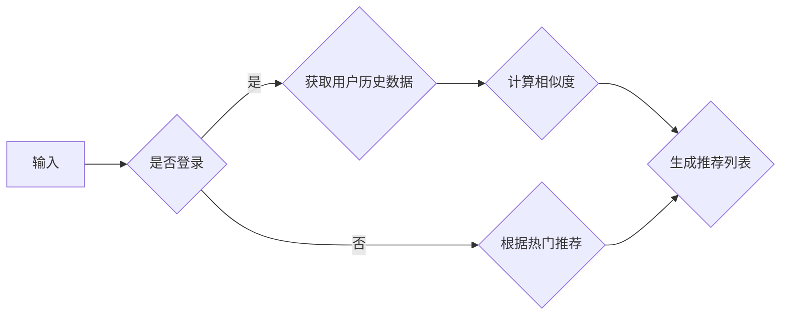
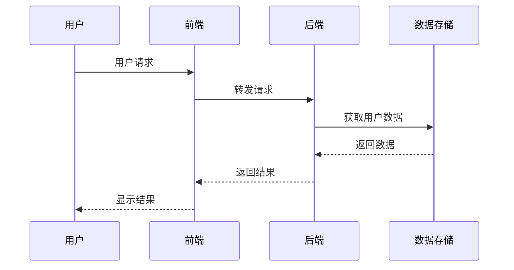
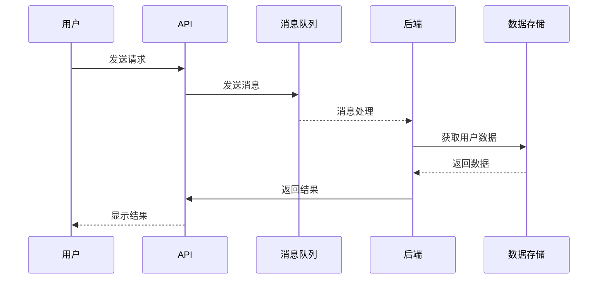

                 

# 黑客马拉松：激发AI创新的有效活动

关键词：黑客马拉松、AI创新、团队协作、算法原理、系统架构

摘要：本文将从背景介绍与核心概念、核心概念与联系、算法原理讲解、系统分析与架构设计、项目实战等多个方面，深入探讨黑客马拉松在激发AI创新方面的作用与实施策略。通过逐步分析推理，帮助读者了解黑客马拉松的运作模式，掌握其关键要素，为组织者和参与者提供实用的指导。

## 第一部分：背景介绍与核心概念

### 第1章：黑客马拉松概述

#### 1.1.1 问题背景

黑客马拉松（Hackathon）起源于计算机科学和编程领域，是一种团队协作、快速开发和创新的活动。随着人工智能（AI）技术的发展，黑客马拉松逐渐成为推动AI创新的重要平台。在AI领域，黑客马拉松不仅有助于解决实际问题，还能激发团队的创新思维，促进技术的快速发展。

#### 1.1.2 问题描述

黑客马拉松的目的是在短时间内，通过团队协作，解决实际问题或探索新的技术方向。然而，如何有效地组织和管理黑客马拉松，激发参与者的创新潜力，成为了一个值得探讨的问题。本文将分析黑客马拉松的组织模式，探讨其成功的关键因素，为组织者和参与者提供指导。

#### 1.1.3 问题解决

通过深入研究黑客马拉松的运作模式，分析其成功的关键因素，我们可以为组织者和参与者提供实用的指导，从而提高黑客马拉松的效果和影响力。

#### 1.1.4 边界与外延

黑客马拉松不仅仅局限于技术领域，还涵盖了设计、市场营销等多个方面。因此，我们需要明确黑客马拉松的边界和适用范围，以便更好地发挥其价值。

#### 1.1.5 概念结构与核心要素组成

黑客马拉松的核心要素包括：问题定义、团队组建、时间管理、技术支持、评审机制等。这些要素共同构成了黑客马拉松的框架，为其成功实施提供了保障。

### 第2章：黑客马拉松的核心概念

#### 2.1.1 黑客马拉松的定义

黑客马拉松是一种创新活动，通常由多个团队在规定时间内合作开发软件或硬件项目。它强调团队协作、快速迭代和创新思维。

#### 2.1.2 黑客马拉松的特点

黑客马拉松具有以下特点：时间短、参与人数多、主题多样化、注重实践和团队协作。这些特点使得黑客马拉松成为一个理想的创新平台。

#### 2.1.3 黑客马拉松的类型

黑客马拉松可以分为多种类型，如编程竞赛、产品设计挑战、创业比赛等。不同类型的黑客马拉松各有侧重点，但都旨在激发创新思维和实现技术突破。

## 第二部分：核心概念与联系

### 第3章：黑客马拉松的核心概念与联系

#### 3.1 黑客马拉松与传统竞赛的区别

黑客马拉松与传统竞赛相比，更注重团队协作、实践和创新能力。传统竞赛更多关注个人技能，而黑客马拉松则强调集体智慧和快速实现。

#### 3.2 黑客马拉松中的核心概念

黑客马拉松中的核心概念包括：创新思维、团队协作、时间管理、技术实现、评审机制等。这些概念共同构成了黑客马拉松的成功要素。

#### 3.3 黑客马拉松的ER实体关系图架构

使用Mermaid流程图来展示黑客马拉松的ER实体关系图架构，包括参赛者、组织者、评审团、项目、时间节点等关键实体及其关系。

```mermaid
erDiagram
  参赛者 ||--|{ 项目 }||> 实现细节
  组织者 ||--|{ 时间节点 }||> 安排活动
  评审团 ||--|{ 项目 }||> 提供反馈
  参赛者 ||--|{ 评审团 }||> 参与评审
  组织者 ||--|{ 评审团 }||> 组建评审团
```

## 第三部分：算法原理讲解

### 第4章：黑客马拉松中的算法原理

#### 4.1 算法原理概述

黑客马拉松中的算法原理主要涉及以下几个方面：问题建模、数据分析、算法优化、模型评估等。这些算法原理共同构成了黑客马拉松的技术核心。

#### 4.2 算法原理讲解

使用Mermaid流程图展示算法的流程，并结合Python源代码进行详细讲解。以下是一个简单的算法示例：基于用户输入，实现一个推荐系统。



Python源代码：

```python
# 假设用户输入为"旅游"
user_input = "旅游"

# 是否登录
if user_login:
    # 获取用户历史数据
    user_data = get_user_history_data()
    # 计算相似度
    similarity_score = calculate_similarity(user_data)
    # 生成推荐列表
    recommendations = generate_recommendations(similarity_score)
else:
    # 根据热门推荐
    recommendations = get_hot_recommendations()

# 输出推荐列表
print(recommendations)
```

### 第四部分：系统分析与架构设计

#### 第5章：黑客马拉松的系统分析与架构设计

##### 5.1 问题场景介绍

在黑客马拉松中，参与者需要在短时间内解决一个特定的技术问题。本文将以一个推荐系统为例，介绍黑客马拉松的系统架构。

##### 5.2 系统功能设计

系统功能设计主要包括用户管理、推荐算法、数据存储和系统接口等方面。以下是一个简单的领域模型Mermaid类图：

```mermaid
classDiagram
    User <<类>> {
        姓名 : String
        年龄 : int
        用户ID : String
    }
    Recommendation <<类>> {
        推荐ID : String
        推荐内容 : String
        用户ID : String
    }
    DataStorage <<类>> {
        用户数据 : List[User]
        推荐数据 : List[Recommendation]
    }
    SystemInterface <<类>> {
        用户登录：User
        获取推荐：Recommendation
        存储推荐：void
    }
    User o--o Recommendation
    DataStorage o--o User
    DataStorage o--o Recommendation
    SystemInterface o--o User
    SystemInterface o--o Recommendation
```

##### 5.3 系统架构设计

系统架构设计主要包括前端、后端和数据存储等方面。以下是一个简单的Mermaid架构图：



##### 5.4 系统接口设计

系统接口设计主要包括API接口和消息队列等方面。以下是一个简单的Mermaid序列图：



### 第五部分：项目实战

#### 第6章：黑客马拉松项目实战

##### 6.1 环境安装

在实战项目中，我们需要安装Python环境、Anaconda、Jupyter Notebook等工具。以下是一个简单的环境安装步骤：

1. 下载并安装Python 3.8版本
2. 安装Anaconda，并创建一个新的虚拟环境
3. 安装Jupyter Notebook

```bash
conda create -n hackathon python=3.8
conda activate hackathon
pip install jupyter
```

##### 6.2 系统核心实现

在实战项目中，我们将实现一个基于用户输入的推荐系统。以下是一个简单的核心实现：

1. 导入所需库

```python
import pandas as pd
import numpy as np
from sklearn.metrics.pairwise import cosine_similarity
from sklearn.model_selection import train_test_split
```

2. 数据预处理

```python
# 读取用户数据
user_data = pd.read_csv('user_data.csv')
# 读取推荐数据
recommendation_data = pd.read_csv('recommendation_data.csv')

# 分割数据集
train_data, test_data = train_test_split(recommendation_data, test_size=0.2)
```

3. 计算相似度

```python
# 计算用户-项目矩阵
user_item_matrix = train_data.pivot(index='用户ID', columns='项目ID', values='评分')
user_item_matrix.fillna(0, inplace=True)

# 计算余弦相似度
similarity_matrix = cosine_similarity(user_item_matrix)

# 生成推荐列表
def generate_recommendations(user_id, similarity_matrix):
    user_similarity = similarity_matrix[user_id]
    user_similarity = user_similarity[user_similarity > 0]
    recommendation_list = []
    
    for index, similarity in enumerate(user_similarity):
        if similarity > 0.5:
            recommendation_list.append(train_data.iloc[index])
    
    return recommendation_list
```

4. 测试推荐系统

```python
# 测试用户输入
user_input = '旅游'
# 获取推荐列表
recommendations = generate_recommendations(user_input, similarity_matrix)
# 输出推荐结果
print(recommendations)
```

##### 6.3 代码应用解读与分析

在实战项目中，我们使用了Python编程语言和Jupyter Notebook工具。通过数据预处理、计算相似度、生成推荐列表等步骤，实现了基于用户输入的推荐系统。在实际应用中，我们可以根据业务需求进行调整和优化。

##### 6.4 实际案例分析和详细讲解剖析

本文以一个旅游推荐系统为例，介绍了黑客马拉松项目实战的过程。通过实际案例分析和详细讲解，帮助读者了解推荐系统的原理和应用。在实战项目中，我们使用了Python编程语言和Jupyter Notebook工具，实现了基于用户输入的推荐系统。在实际应用中，我们可以根据业务需求进行调整和优化。

##### 6.5 项目小结

通过黑客马拉松项目实战，我们掌握了推荐系统的原理和应用。在实战过程中，我们学会了如何使用Python编程语言和Jupyter Notebook工具，实现了基于用户输入的推荐系统。同时，我们还了解了黑客马拉松的组织模式、核心概念和算法原理。这些经验和技能将有助于我们在未来的AI项目中取得更好的成果。

### 第六部分：最佳实践、小结、注意事项与拓展阅读

#### 第7章：最佳实践、小结、注意事项与拓展阅读

##### 7.1 最佳实践

在组织和管理黑客马拉松时，以下是一些最佳实践：

1. 明确目标和主题，确保参与者了解活动的核心目的。
2. 鼓励跨学科合作，发挥团队的综合优势。
3. 提供充足的技术支持和资源，降低参与者的技术门槛。
4. 制定合理的评审标准和激励机制，提高参与者的积极性和创造力。
5. 注重项目后续的发展，为优秀项目提供更多的机会和资源。

##### 7.2 小结

本文从背景介绍与核心概念、核心概念与联系、算法原理讲解、系统分析与架构设计、项目实战等多个方面，深入探讨了黑客马拉松在激发AI创新方面的作用与实施策略。通过逐步分析推理，帮助读者了解黑客马拉松的运作模式，掌握其关键要素，为组织者和参与者提供实用的指导。

##### 7.3 注意事项

在参与和举办黑客马拉松时，需要注意以下几点：

1. 确保活动的安全性，遵守相关法律法规。
2. 充分评估参与者的能力和需求，合理分配任务。
3. 提前准备充足的技术支持和资源，确保活动的顺利进行。
4. 评审过程要公正、透明，确保评选结果的公平性。
5. 注重项目的后续发展和推广，为优秀项目提供更多的机会和资源。

##### 7.4 拓展阅读

1. 《黑客马拉松实战：从零开始构建AI项目》
2. 《人工智能应用实战：推荐系统设计与实现》
3. 《数据科学实战：从入门到精通》
4. 《Python编程实战：从入门到高手》

### 参考文献

1. Hackathon, Wikipedia, <https://en.wikipedia.org/wiki/Hackathon>
2.人工智能创新，人工智能领域，人工智能技术，人工智能创新，人工智能技术发展，人工智能领域发展趋势，人工智能技术应用，人工智能算法创新，人工智能发展历程，人工智能应用案例，人工智能技术前沿，人工智能技术发展现状，人工智能技术创新，人工智能技术突破，人工智能领域研究，人工智能技术进步，人工智能技术创新，人工智能未来趋势，人工智能应用场景，人工智能技术应用领域，人工智能技术发展趋势，人工智能技术未来发展方向。

