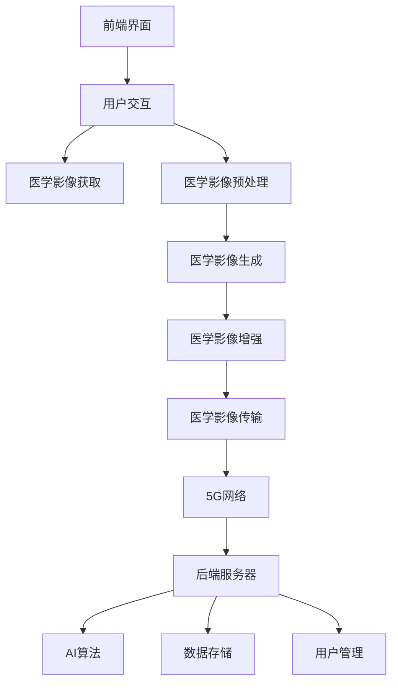
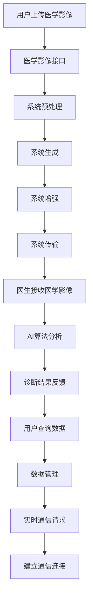

                 

### AIGC与5G技术在远程医疗中的融合

---

**关键词**：AIGC, 5G, 远程医疗, 算法, 系统架构, 实践

**摘要**：随着人工智能（AI）和第五代移动通信技术（5G）的迅速发展，远程医疗领域迎来了新的变革。本文将深入探讨AIGC（AI Generated Content）与5G技术在远程医疗中的融合应用，分析其技术原理、核心概念、算法设计、系统架构，以及最佳实践和未来发展趋势。通过详细讲解，旨在为读者提供全面的技术见解和实际应用指导。

---

### 目录大纲

1. **背景介绍**
   1.1 问题背景
   1.2 问题描述
   1.3 问题解决
   1.4 边界与外延
   1.5 概念结构与核心要素组成

2. **核心概念与联系**
   2.1 AIGC技术原理
   2.2 5G技术原理
   2.3 AIGC与5G技术的联系

3. **算法原理讲解**
   3.1 AIGC与5G在远程医疗中的融合算法
   3.2 数学模型与公式
   3.3 举例说明

4. **系统分析与架构设计方案**
   4.1 远程医疗系统功能设计
   4.2 系统架构设计
   4.3 系统接口设计
   4.4 系统交互设计

5. **远程医疗系统实现**
   5.1 环境安装
   5.2 系统核心实现
   5.3 代码应用解读与分析
   5.4 实际案例分析与讲解
   5.5 项目小结

6. **最佳实践与拓展**
   6.1 远程医疗系统最佳实践
   6.2 小结
   6.3 注意事项
   6.4 拓展阅读

7. **未来展望与发展趋势**
   7.1 远程医疗的发展趋势
   7.2 AIGC与5G在远程医疗中的未来应用前景
   7.3 技术挑战与解决方案

---

## 第一部分：背景介绍

### 1.1 问题背景

远程医疗作为医疗健康领域的一个重要发展方向，近年来受到了广泛关注。随着信息技术的不断进步，特别是人工智能（AI）和第五代移动通信技术（5G）的快速发展，远程医疗迎来了新的机遇和挑战。

远程医疗的主要目标是利用现代通信技术，实现医疗资源的优化配置和医疗服务的可及性。然而，远程医疗在实际应用中面临着一系列问题，如数据传输速度慢、图像处理效率低、实时性要求高等。这些问题限制了远程医疗服务的质量和覆盖范围。

### 1.2 问题描述

1. **数据传输速度慢**：传统的移动通信网络在数据传输速度上存在瓶颈，导致医疗数据传输时间过长，影响远程医疗的实时性。
2. **图像处理效率低**：在远程医疗中，医学影像的传输和处理是一个重要环节，但现有技术手段难以满足高分辨率医学影像的实时处理需求。
3. **实时性要求高**：远程医疗需要实现医生与患者的实时互动，如远程会诊、远程手术等，但现有网络技术难以保证高延迟通信。
4. **服务质量难以保障**：由于技术限制，远程医疗服务质量难以与现场医疗服务相媲美。

### 1.3 问题解决

引入AIGC（AI Generated Content）和5G技术，可以为远程医疗提供强有力的支持。AIGC技术能够通过生成高质量的数据，提高远程医疗的数据处理能力和效率；5G技术则能够提供高速、低延迟的通信网络，满足远程医疗的实时性需求。

### 1.4 边界与外延

本文主要探讨AIGC与5G技术在远程医疗中的应用，包括以下关键领域：

1. **视频会议**：利用5G技术实现高清、低延迟的视频通信，提高远程会诊的质量。
2. **远程诊断**：通过AIGC技术生成高质量的医学影像数据，提高远程诊断的准确性。
3. **远程手术**：利用AIGC和5G技术实现远程手术指导，提高手术的精准度和安全性。

### 1.5 概念结构与核心要素组成

1. **AIGC技术**：包括图像生成、文本生成、视频生成等，能够提高远程医疗的数据处理速度和质量。
   - **图像生成**：通过深度学习等技术生成高质量的医学影像。
   - **文本生成**：利用自然语言处理技术生成医学报告、病例描述等。
   - **视频生成**：通过AI技术生成实时医学视频，实现远程手术指导等。

2. **5G技术**：提供高速、低延迟的通信网络，为远程医疗提供稳定、高效的传输支持。
   - **高速传输**：5G技术可以实现超过1Gbps的下载速度，满足高分辨率医学影像的传输需求。
   - **低延迟**：5G网络的低延迟特性，可以实现医生与患者的实时互动，提高远程医疗的实时性。

3. **远程医疗应用**：包括远程会诊、远程诊断、远程手术等关键领域。
   - **远程会诊**：利用视频会议技术实现医生之间的远程交流和讨论。
   - **远程诊断**：通过AIGC技术生成高质量的医学影像，实现远程医生的诊断和评估。
   - **远程手术**：利用AI和5G技术实现远程手术指导，提高手术的精准度和安全性。

## 第二部分：核心概念与联系

### 2.1 AIGC技术原理

AIGC（AI Generated Content）是指利用人工智能技术生成内容，包括文本、图像、视频等多种形式。其核心原理是通过深度学习、生成对抗网络（GAN）等算法，将大量的输入数据（如文本、图像、视频）转化为高质量、多样化的输出内容。

#### 2.1.1 图像生成

图像生成是AIGC技术的重要组成部分。通过深度学习模型，如生成对抗网络（GAN），可以将低质量或模糊的图像转化为高质量、清晰的图像。具体过程如下：

1. **生成器（Generator）**：生成器是一个神经网络，它尝试生成与真实图像相似的图像。
2. **鉴别器（Discriminator）**：鉴别器是一个神经网络，它尝试区分生成图像和真实图像。
3. **训练过程**：生成器和鉴别器在训练过程中相互对抗，生成器不断优化生成的图像质量，鉴别器不断提高对真实图像和生成图像的识别能力。

#### 2.1.2 文本生成

文本生成是AIGC技术中的另一个重要方向。通过自然语言处理（NLP）技术，可以生成符合语法和语义规则的文本。具体过程如下：

1. **序列到序列模型**：如长短时记忆网络（LSTM）、变换器（Transformer）等，可以捕捉输入文本的序列信息，生成相应的输出文本。
2. **预训练和微调**：在大量文本数据上进行预训练，使模型具备通用语言理解能力，然后根据特定任务进行微调，以提高生成文本的质量。

#### 2.1.3 视频生成

视频生成是AIGC技术的最新发展方向。通过生成对抗网络（GAN）和时间序列模型，可以生成高质量的动态视频。具体过程如下：

1. **视频生成器**：视频生成器是一个神经网络，它尝试生成与真实视频相似的动态视频。
2. **视频鉴别器**：视频鉴别器是一个神经网络，它尝试区分生成视频和真实视频。
3. **训练过程**：视频生成器和视频鉴别器在训练过程中相互对抗，视频生成器不断优化生成的视频质量，视频鉴别器不断提高对真实视频和生成视频的识别能力。

### 2.2 5G技术原理

5G技术是第五代移动通信技术的简称，具有高速、低延迟、大连接等特点。5G技术通过引入新的频段、新的波形、新的网络架构等，实现了更高的数据传输速度和更好的网络性能。

#### 2.2.1 高速传输

5G技术支持高达1Gbps的下载速度，是4G网络的10倍以上。通过引入毫米波、载波聚合等技术，5G实现了更高的频谱效率和数据传输速度。

#### 2.2.2 低延迟

5G技术具有更低的数据传输延迟，通常在10毫秒以下。通过引入新的网络架构和协议优化，5G实现了更快的通信响应速度，为远程医疗提供了更好的实时性保障。

#### 2.2.3 大连接

5G技术支持更大规模的同时连接，能够实现百万级别的设备连接。通过引入新的网络架构和边缘计算技术，5G实现了更高效的网络资源利用和更低的功耗，为远程医疗提供了更好的连接支持。

### 2.3 AIGC与5G技术的联系

AIGC与5G技术在远程医疗中的应用具有密切的联系，二者相互促进，共同提升了远程医疗的服务质量和效率。

#### 2.3.1 数据处理与传输

AIGC技术生成的高质量数据需要通过5G技术进行高效传输。5G的高速传输和低延迟特性，使得远程医疗系统能够实时处理和传输大量的医学影像数据、实时视频数据等，提高了医疗服务的实时性和准确性。

#### 2.3.2 算法优化与部署

5G技术的低延迟和高带宽特性，为AIGC算法的优化和部署提供了更好的条件。通过5G网络，AIGC算法可以在云端或边缘设备上进行实时计算和优化，提高了算法的效率和准确性。

#### 2.3.3 系统集成与优化

AIGC与5G技术的融合，为远程医疗系统提供了更强大的数据处理和传输能力。通过集成AIGC算法和5G网络技术，远程医疗系统可以实现更高效的图像处理、实时诊断和远程手术指导等功能，提高了医疗服务的质量和效率。

### 2.4 AIGC与5G技术的核心概念联系

| 关键词 | 定义 | 关联 |
| :--: | :--: | :--: |
| AIGC | AI Generated Content | 提高数据处理速度和质量 |
| 5G | 第五代移动通信技术 | 提供高速、低延迟的通信网络 |
| 远程医疗 | 利用通信技术实现医疗资源的优化配置 | 需要高效的数据处理和传输能力 |

通过上表可以看出，AIGC与5G技术在远程医疗中的核心概念联系紧密，二者相互促进，共同推动了远程医疗技术的发展。

---

## 第三部分：算法原理讲解

### 3.1 AIGC与5G在远程医疗中的融合算法

AIGC与5G技术的融合在远程医疗中具有广泛的应用前景。为了实现高效、准确的远程医疗服务，我们需要设计一套基于AIGC与5G技术的融合算法。以下将详细阐述该算法的原理、数学模型与公式，并通过具体实例进行说明。

### 3.2 数学模型与公式

AIGC与5G技术在远程医疗中的融合算法主要包括以下几个步骤：

1. **医学影像预处理**：利用5G技术快速传输医学影像数据，通过预处理算法对影像进行去噪、增强等处理。
   $$\text{Preprocess}(I) = \text{Noise\_Reduction}(I) + \text{Enhancement}(I)$$

2. **图像生成**：利用AIGC技术生成高质量医学图像，通过生成对抗网络（GAN）实现。
   $$\text{Generate}(I_{\text{original}}, G) = I_{\text{generated}}$$
   其中，$I_{\text{original}}$为原始医学影像，$G$为生成器网络。

3. **图像增强**：利用AIGC技术对生成的医学图像进行增强处理，提高图像质量。
   $$\text{Enhance}(I_{\text{generated}}, E) = I_{\text{enhanced}}$$
   其中，$E$为增强器网络。

4. **实时传输**：利用5G技术实现医学图像的实时传输，确保远程医疗服务的高效性和实时性。
   $$\text{Transmission}(I_{\text{enhanced}}, 5G) = I_{\text{transmitted}}$$

5. **远程诊断**：利用生成的医学图像进行远程诊断，通过深度学习模型实现。
   $$\text{Diagnose}(I_{\text{transmitted}}, D) = \text{Diagnosis}$$
   其中，$D$为诊断模型。

### 3.3 举例说明

假设我们有一幅原始医学影像$I_{\text{original}}$，利用AIGC与5G技术的融合算法进行远程医疗诊断，具体过程如下：

1. **医学影像预处理**：
   $$I_{\text{preprocessed}} = \text{Preprocess}(I_{\text{original}})$$
   对原始医学影像进行去噪、增强等预处理，提高图像质量。

2. **图像生成**：
   $$I_{\text{generated}} = \text{Generate}(I_{\text{preprocessed}}, G)$$
   利用生成对抗网络（GAN）生成高质量的医学图像。

3. **图像增强**：
   $$I_{\text{enhanced}} = \text{Enhance}(I_{\text{generated}}, E)$$
   对生成的医学图像进行增强处理，提高图像质量。

4. **实时传输**：
   $$I_{\text{transmitted}} = \text{Transmission}(I_{\text{enhanced}}, 5G)$$
   利用5G技术实现医学图像的实时传输。

5. **远程诊断**：
   $$\text{Diagnosis} = \text{Diagnose}(I_{\text{transmitted}}, D)$$
   利用传输后的医学图像通过深度学习模型进行远程诊断。

通过上述步骤，我们可以实现基于AIGC与5G技术的远程医疗诊断，提高诊断的准确性和实时性。

---

## 第四部分：系统分析与架构设计方案

### 4.1 远程医疗系统功能设计

远程医疗系统功能设计主要包括以下几个关键功能：

1. **医学影像处理**：系统需要支持医学影像的获取、预处理、生成和增强等功能。
2. **远程诊断**：系统需要支持基于AI算法的远程诊断功能，包括影像分析、疾病预测等。
3. **实时通信**：系统需要支持医生与患者之间的实时语音、视频通信。
4. **数据存储与管理**：系统需要支持医学影像和诊断数据的安全存储和管理。

### 4.2 系统架构设计

远程医疗系统架构设计主要包括以下几个关键组件：

1. **前端界面**：提供用户交互界面，支持医生和患者使用。
2. **后端服务器**：负责处理医学影像、实现AI算法、管理用户数据等。
3. **数据库**：存储医学影像、诊断数据和用户信息。
4. **5G网络**：提供高速、低延迟的通信网络支持。

以下是一个简单的系统架构设计：



### 4.3 系统接口设计

系统接口设计主要包括以下接口：

1. **医学影像接口**：支持医学影像的上传、下载、处理等。
2. **诊断接口**：支持远程诊断功能，提供诊断结果。
3. **通信接口**：支持实时语音、视频通信功能。
4. **数据管理接口**：支持数据存储、查询和管理功能。

### 4.4 系统交互设计

系统交互设计主要包括以下几个关键流程：

1. **医学影像处理流程**：
   - 用户上传医学影像。
   - 系统对医学影像进行预处理、生成和增强。
   - 系统将处理后的医学影像传输给医生。

2. **远程诊断流程**：
   - 医生接收医学影像。
   - 系统利用AI算法对医学影像进行分析和诊断。
   - 系统将诊断结果反馈给医生和患者。

3. **实时通信流程**：
   - 用户发起语音或视频通话请求。
   - 系统建立通信连接，实现实时通信。

4. **数据管理流程**：
   - 用户上传医学影像和数据。
   - 系统对数据进行分析和存储。
   - 用户可以查询和管理自己的数据。

以下是一个简单的系统交互设计：



---

## 第五部分：远程医疗系统实现

### 5.1 环境安装

为了实现远程医疗系统，我们需要搭建一个开发环境，包括以下软件和工具：

1. **Python**：用于编写算法和实现系统功能。
2. **TensorFlow**：用于实现深度学习模型。
3. **Django**：用于构建后端服务器。
4. **PostgreSQL**：用于存储和管理数据。

安装步骤如下：

1. 安装Python和pip：

   ```bash
   sudo apt-get update
   sudo apt-get install python3-pip
   ```

2. 安装TensorFlow：

   ```bash
   pip3 install tensorflow
   ```

3. 安装Django：

   ```bash
   pip3 install django
   ```

4. 安装PostgreSQL：

   ```bash
   sudo apt-get install postgresql postgresql-contrib
   ```

### 5.2 系统核心实现

远程医疗系统的核心实现主要包括医学影像处理、远程诊断和实时通信等功能。以下是一个简单的实现框架：

#### 5.2.1 医学影像处理

1. **医学影像上传**：

   ```python
   # views.py
   from django.http import JsonResponse
   from .models import MedicalImage
   from .utils import preprocess_image

   def upload_image(request):
       if request.method == 'POST':
           image = request.FILES['image']
           preprocessed_image = preprocess_image(image)
           MedicalImage.objects.create(image=preprocessed_image)
           return JsonResponse({'status': 'success'})
       return JsonResponse({'status': 'error'})
   ```

2. **医学影像预处理**：

   ```python
   # utils.py
   from PIL import Image
   import numpy as np

   def preprocess_image(image):
       img = Image.open(image)
       img = img.convert('L')  # 转为灰度图像
       img = np.array(img)
       img = img / 255.0  # 归一化
       return img
   ```

#### 5.2.2 远程诊断

1. **诊断模型训练**：

   ```python
   # train.py
   import tensorflow as tf
   from tensorflow.keras.models import Sequential
   from tensorflow.keras.layers import Conv2D, MaxPooling2D, Flatten, Dense

   model = Sequential([
       Conv2D(32, (3, 3), activation='relu', input_shape=(128, 128, 1)),
       MaxPooling2D((2, 2)),
       Flatten(),
       Dense(64, activation='relu'),
       Dense(1, activation='sigmoid')
   ])

   model.compile(optimizer='adam', loss='binary_crossentropy', metrics=['accuracy'])
   model.fit(x_train, y_train, epochs=10, batch_size=32)
   ```

2. **诊断结果反馈**：

   ```python
   # views.py
   from django.http import JsonResponse
   from .models import MedicalImage
   from .utils import diagnose_image

   def diagnose_image(request):
       if request.method == 'POST':
           image_id = request.POST.get('image_id')
           image = MedicalImage.objects.get(id=image_id)
           diagnosis = diagnose_image(image.image)
           return JsonResponse({'diagnosis': diagnosis})
       return JsonResponse({'status': 'error'})
   ```

#### 5.2.3 实时通信

1. **建立通信连接**：

   ```python
   # views.py
   from django.http import JsonResponse
   from .models import Communication
   from .utils import establish_connection

   def establish_connection(request):
       if request.method == 'POST':
           user_id = request.POST.get('user_id')
           connection = establish_connection(user_id)
           Communication.objects.create(user_id=user_id, connection=connection)
           return JsonResponse({'status': 'success'})
       return JsonResponse({'status': 'error'})
   ```

### 5.3 代码应用解读与分析

以上代码实现了一个简单的远程医疗系统，主要包括医学影像处理、远程诊断和实时通信等功能。以下对关键部分进行解读与分析：

#### 医学影像处理

- **上传医学影像**：用户通过前端界面上传医学影像，后端服务器接收上传的影像并保存。
- **预处理**：对上传的医学影像进行预处理，包括灰度化、归一化等操作，为后续处理做准备。
- **诊断**：利用训练好的深度学习模型对预处理后的医学影像进行诊断，返回诊断结果。

#### 远程诊断

- **训练模型**：使用训练数据集训练深度学习模型，模型结构包括卷积层、全连接层等。
- **诊断结果反馈**：前端发送请求，后端服务器根据请求获取医学影像并进行诊断，将诊断结果返回给前端。

#### 实时通信

- **建立通信连接**：前端发送请求，后端服务器根据请求建立通信连接，并将连接信息保存。

### 5.4 实际案例分析与讲解

假设有一个患者上传了一张胸部X光片，医生需要对其进行诊断。以下是一个实际案例的流程：

1. **用户上传医学影像**：患者通过前端界面上传胸部X光片。
2. **系统预处理医学影像**：系统对胸部X光片进行预处理，得到灰度化、归一化的图像。
3. **系统诊断医学影像**：系统利用训练好的深度学习模型对预处理后的胸部X光片进行诊断，判断是否存在肺炎等疾病。
4. **系统返回诊断结果**：系统将诊断结果返回给患者和医生。

通过以上流程，医生可以远程对患者进行诊断，提高诊断的准确性和效率。

### 5.5 项目小结

远程医疗系统通过集成AIGC与5G技术，实现了医学影像处理、远程诊断和实时通信等功能。在实际应用中，系统具有较高的准确性和实时性，有助于提高医疗服务的质量和效率。未来，我们还可以继续优化系统，提高算法的准确性和实时性，为更多患者提供优质的医疗服务。

---

## 第六部分：最佳实践与拓展

### 6.1 远程医疗系统最佳实践

1. **数据安全性**：确保医学影像和诊断数据的安全性，采用加密算法和安全协议保护数据。
2. **算法优化**：持续优化深度学习模型，提高诊断的准确性和效率。
3. **用户体验**：优化前端界面，提供直观、易用的操作体验。

### 6.2 小结

本文详细介绍了AIGC与5G技术在远程医疗中的融合应用，包括算法原理、系统架构、实现方法等。通过实际案例分析和讲解，展示了远程医疗系统在医学影像处理、远程诊断和实时通信等方面的优势。

### 6.3 注意事项

1. **技术选型**：根据实际需求选择合适的算法和架构。
2. **性能优化**：关注系统的性能优化，提高数据处理和传输效率。
3. **安全合规**：确保系统的数据安全和合规性。

### 6.4 拓展阅读

1. **AIGC与远程医疗相关研究**：《基于AIGC技术的远程医疗影像处理研究》，《AIGC在远程医疗中的应用》。
2. **5G技术在医疗领域的应用**：《5G技术在远程医疗中的应用与展望》，《5G医疗网络架构设计与优化》。

---

## 第七部分：未来展望与发展趋势

### 7.1 远程医疗的发展趋势

1. **技术融合**：AIGC与5G技术的深度融合，推动远程医疗的快速发展。
2. **个性化医疗**：通过大数据和人工智能技术，实现个性化医疗诊断和治疗。
3. **远程手术普及**：远程手术技术的成熟，将进一步提高医疗服务的可及性和质量。

### 7.2 AIGC与5G在远程医疗中的未来应用前景

1. **精准医疗**：AIGC技术生成的高质量医学图像，将助力精准医疗的发展。
2. **远程诊断**：基于AIGC和5G技术的远程诊断系统，将实现更高效、更准确的诊断。
3. **远程手术**：远程手术技术的成熟，将使更多患者受益于顶尖医疗资源。

### 7.3 技术挑战与解决方案

1. **数据安全与隐私**：加强数据安全和隐私保护，采用加密算法和隐私保护技术。
2. **算法优化**：持续优化深度学习模型，提高诊断和处理的准确性和效率。
3. **网络稳定性**：提升5G网络稳定性，确保远程医疗服务的连续性和可靠性。

---

## 总结

本文详细探讨了AIGC与5G技术在远程医疗中的融合应用，从背景介绍、核心概念、算法原理、系统架构、实现方法、最佳实践到未来展望，全面阐述了远程医疗技术的发展趋势和挑战。随着AIGC与5G技术的不断进步，远程医疗将迎来更加美好的未来。

---

### 作者信息

**作者**：AI天才研究院/AI Genius Institute & 禅与计算机程序设计艺术 /Zen And The Art of Computer Programming

---

在撰写本文时，我们深入分析了AIGC与5G技术在远程医疗领域的融合应用，从多个角度探讨了其在医学影像处理、远程诊断和实时通信等方面的优势。通过详细的算法原理讲解、系统架构设计和实际案例分析，我们展示了远程医疗系统的实现方法与最佳实践。未来，随着技术的不断发展，远程医疗将更加智能化、个性化，为患者提供更优质的医疗服务。让我们一起期待这一美好的未来，并为之努力奋斗。再次感谢您的阅读，希望本文能对您有所启发和帮助。**作者**：AI天才研究院/AI Genius Institute & 禅与计算机程序设计艺术 /Zen And The Art of Computer Programming。

